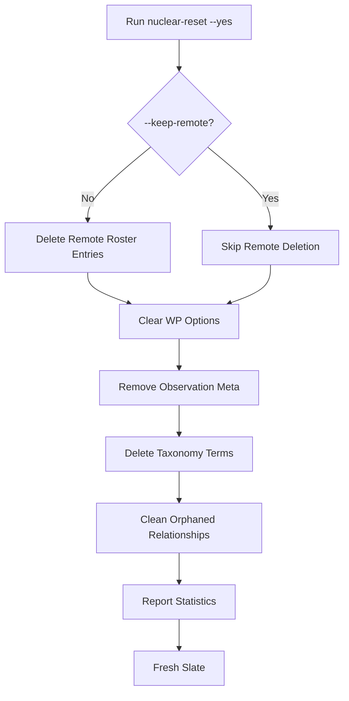

# Troubleshooting Guide

Common issues and solutions for the Context Alt Text plugin.

## Table of Contents

- [Environment & Configuration](#environment--configuration)
- [Recognition Service](#recognition-service)
- [Development](#development)
- [Frontend (Vite/React)](#frontend-vitereact)
- [Testing](#testing)
- [Performance](#performance)
- [Debugging](#debugging)

---

## Environment & Configuration

### "Recognition service not connected"

**Symptoms:**

- Recognition buttons disabled in Workbench
- Settings page shows "Disconnected" status
- Error: "Recognition service unavailable"

**Solutions:**

1. **Check active environment profile:**

    ```bash
    cat .env | grep CAT_RECOGNITION_BASE_URL
    ```

2. **Verify service is running:**

    ```bash
    # For local:
    curl http://localhost:7860/api/v0/health

    # For remote:
    curl https://your-username-recognition.hf.space/api/v0/health
    ```

    Expected response: `{"status":"ok"}`

3. **Test from WordPress:**

    ```bash
    wp cat-recognition health
    ```

4. **Check WordPress admin:**
    - Go to **Context Alt Text → Settings**
    - Look for service status indicator

5. **Restart recognition service:**
    ```bash
    cd apps/recognition-service
    ./scripts/start_recognition_local.sh restart
    ```

---

### "Switch script not working"

**Symptoms:**

- `./scripts/switch-env.sh` fails with "Permission denied"
- Script not found error

**Solutions:**

1. **Make script executable:**

    ```bash
    chmod +x scripts/switch-env.sh
    ```

2. **Run from correct directory:**

    ```bash
    cd apps/wp-context-alt-text
    ./scripts/switch-env.sh local
    ```

3. **Check profile file exists:**

    ```bash
    ls -la .env.*
    # Should show: .env.local, .env.dev-remote, .env.production
    ```

4. **Manually copy profile:**
    ```bash
    cp .env.local .env
    ```

---

### "Which environment am I using?"

**Check active configuration:**

```bash
# View all active environment variables
cat .env

# Check specific variable
cat .env | grep CAT_RECOGNITION_BASE_URL
```

**Verify what WordPress sees:**

```bash
# Check settings in database
wp option get cat_settings --format=json

# Check what plugin resolves (environment variables take precedence)
wp eval 'echo (new \ContextAltText\Recognition\RecognitionSettings())->getBaseUrl();'
```

---

### "Changes not taking effect"

**After editing `.env.<profile>`:**

1. **Re-run the switch script:**

    ```bash
    ./scripts/switch-env.sh <profile>
    ```

2. **Verify `.env` was updated:**

    ```bash
    cat .env | grep CAT_RECOGNITION_BASE_URL
    ```

3. **Clear WordPress caches:**
    - Clear object cache (if using persistent cache)
    - Clear page cache (if using caching plugin)
    - Restart PHP-FPM (if necessary)

4. **Hard refresh browser:**
    - Chrome/Edge: `Ctrl+Shift+R` (Windows) or `Cmd+Shift+R` (Mac)
    - Firefox: `Ctrl+Shift+F5` or `Cmd+Shift+R`

---

## Face Clustering

### "Face scan button disabled"

**Symptoms:**

- "Scan for Faces" button appears grayed out
- No face detection options available

**Solutions:**

1. **Check if images are selected:**
    - At least one image must be uploaded to enable scan

2. **Verify recognition service is running:**

    ```bash
    curl http://localhost:7860/api/v0/health
    # Should return: {"status":"ok"}
    ```

3. **Check user permissions:**
    - Ensure user has `edit_posts` capability

4. **Clear browser cache:**
    - Hard refresh (Cmd+Shift+R or Ctrl+Shift+R)

---

### "Faces detected but not clustered"

**Symptoms:**

- Faces appear in database but show as individual clusters
- No grouping of similar faces

**Diagnosis:**

```bash
# Check if embeddings are stored
wp cat-faces stats
# Should show "With embedding vectors: X (100.0%)"
```

**Solutions:**

1. **Verify embeddings are persisted:**

    ```bash
    # Test recognition service response
    curl -X POST http://localhost:7860/api/v0/recognition/analyze \
      -H "Content-Type: application/json" \
      -d '{"imageUrl":"http://localhost:10008/wp-content/uploads/test.jpg"}'

    # Should include: "embedding_dimension": 512, "has_embedding": true
    ```

2. **Check clustering threshold:**

    ```php
    // In src/Domain/Clustering/ClusteringService.php
    const LOCAL_CLUSTER_THRESHOLD = 1000; // Should be >= detected face count
    ```

3. **Trigger clustering manually:**

    ```bash
    wp cat-faces cluster
    ```

4. **Check debug logs:**
    ```bash
    tail -f wp-content/uploads/cat-logs/debug-$(date +%Y-%m-%d).log | grep -i cluster
    # Should show: "Grouped into X clusters"
    ```

---

### "Embeddings not being stored"

**Symptoms:**

- `wp cat-faces stats` shows "With embedding vectors: 0 (0.0%)"
- Clustering fails with no data

**Root Cause:**
Recognition service not including embedding data in response.

**Solutions:**

1. **Update recognition service:**
    - Ensure `apps/recognition-service/analysis/services/scene_analysis_service.py` includes:

    ```python
    face_data={
        "embedding_id": f"face-{idx}",
        "embedding": face_embedding.embedding.tolist(),
        "embedding_dimension": len(face_embedding.embedding),
        "threshold": threshold,
        "candidates": face_data,
    }
    ```

2. **Restart recognition service:**

    ```bash
    cd apps/recognition-service
    ./scripts/start_recognition_local.sh restart
    ```

3. **Clear and rescan:**
    ```bash
    wp cat-faces clear-unknown --yes
    # Then trigger face scan from UI
    ```

---

### "Cluster thumbnails showing placeholder"

**Symptoms:**

- Some faces show 👤 icon instead of thumbnail
- Error: "Failed to resize cropped region"

**Root Cause:**
Face crops too small for 112x112px resize (minimum ~28x28px).

**Solutions:**

1. **Check crop dimensions in logs:**

    ```bash
    tail -f wp-content/uploads/cat-logs/debug-$(date +%Y-%m-%d).log | grep "Failed to resize"
    ```

2. **Accept placeholder for small faces:**
    - This is expected behavior for very small detected faces
    - Typically affects <5% of faces

3. **Adjust minimum face size in recognition service:**
    - Modify face detection threshold to filter small faces

---

### "Clustering takes too long"

**Symptoms:**

- Face scan button shows loading for minutes
- Browser becomes unresponsive

**Diagnosis:**

Check number of faces being processed:

```bash
wp cat-faces stats
# Total unknown faces: X
```

**Solutions:**

1. **Optimize for large batches:**
    - Local clustering handles up to 1000 faces efficiently
    - Consider batching if you have more

2. **Check algorithm performance:**

    ```php
    // In ClusteringService.php
    // O(n²) complexity for n faces
    // 100 faces: ~10,000 operations
    // 500 faces: ~250,000 operations
    ```

3. **Monitor PHP memory:**

    ```bash
    wp eval 'echo memory_get_peak_usage(true) / 1024 / 1024 . " MB";'
    ```

4. **Increase PHP limits if needed:**
    ```php
    // In wp-config.php
    define('WP_MEMORY_LIMIT', '256M');
    define('WP_MAX_MEMORY_LIMIT', '512M');
    ```

---

### "Cluster suggestions incorrect"

**Symptoms:**

- Suggested roster entries don't match faces
- Low confidence scores (<0.5)

**Solutions:**

1. **Verify roster has reference images:**

    ```bash
    wp cat-roster list
    # Should show roster entries with images
    ```

2. **Check embedding quality:**
    - Ensure reference images are high quality
    - Face should be clearly visible, well-lit

3. **Test recognition directly:**

    ```bash
    wp cat-recognition analyze <attachment-id>
    # Should return matches with confidence scores
    ```

4. **Rebuild roster embeddings:**
    ```bash
    wp cat-roster sync
    ```

---

## Recognition Service

### "Trigger Recognition" button disabled

**Symptoms:**

- Button appears grayed out in Workbench
- No recognition options available

**Solutions:**

1. **Check if service is configured:**

    ```bash
    wp option get cat_settings --format=json
    ```

    Should return: `{"recognition":{"baseUrl":"http://localhost:7860","timeoutMs":30000,"enabled":true}}`

2. **Clear browser cache:**
    - Hard refresh the Workbench page (Cmd+Shift+R or Ctrl+Shift+R)

3. **Verify recognition service is running:**

    ```bash
    curl http://localhost:7860/api/v0/health
    ```

4. **Check feature flag override:**

    ```bash
    # Look for CAT_FEATURE_WORKBENCH_RECOGNITION in wp-config.php
    grep CAT_FEATURE_WORKBENCH_RECOGNITION wp-config.php
    ```

    If set to `false`, remove it or set to `true`

5. **Check user permissions:**
    - Ensure you're logged in as an admin
    - Verify user has `manage_options` capability

---

### "Recognition runs but fails"

**Symptoms:**

- Recognition starts but times out
- Error: "Recognition request timed out"
- No observations returned

**Solutions:**

1. **Increase timeout for first run:**

    ```bash
    # Via WP-CLI
    wp option patch update cat_settings recognition timeoutMs 60000

    # Or edit .env
    echo "CAT_RECOGNITION_TIMEOUT_MS=60000" >> .env
    ```

2. **Check WordPress debug log:**

    ```bash
    tail -f wp-content/uploads/cat-logs/debug-$(date +%Y-%m-%d).log
    ```

3. **Check recognition service logs:**
    - Look at terminal where service is running
    - Check for memory issues, model loading errors

4. **Test with smaller image:**
    - Recognition is slower for large images
    - Try with image < 2MB first

5. **Verify image is accessible:**
    ```bash
    # From recognition service host
    curl -I http://localhost:10008/wp-content/uploads/2025/10/test.jpg
    ```

---

### "Recognition service times out on first request"

**Cause:** First request loads AI model into memory (can take 30-60 seconds).

**Solutions:**

1. **Increase timeout temporarily:**

    ```bash
    ./scripts/switch-env.sh local
    # Edit .env
    CAT_RECOGNITION_TIMEOUT_MS=90000
    ```

2. **Warm up the service:**

    ```bash
    curl -X POST http://localhost:7860/api/v0/recognition/analyze \
      -H "Content-Type: application/json" \
      -d '{"imageUrl":"http://localhost:10008/wp-content/uploads/test.jpg"}'
    ```

3. **Use remote service:**
    - Switch to `dev-remote` profile (remote service is already warm)

---

### "Connection refused" error

**Symptoms:**

- Error: "Failed to connect to localhost port 7860"
- Recognition service not accessible

**Solutions:**

1. **Check if service is running:**

    ```bash
    lsof -i :7860
    # Should show Python process
    ```

2. **Start recognition service:**

    ```bash
    cd apps/recognition-service
    ./scripts/start_recognition_local.sh start
    ```

3. **Check service URL matches:**

    ```bash
    # What plugin is configured with
    cat .env | grep CAT_RECOGNITION_BASE_URL

    # What service is running on
    lsof -i :7860
    ```

4. **Test connectivity:**

    ```bash
    # From WordPress host
    curl http://localhost:7860/api/v0/health
    ```

5. **Check firewall/network:**
    - Ensure port 7860 is not blocked
    - If using Docker, check port mapping

---

## Development

### "Vite dev server not working"

**Symptoms:**

- Assets not loading in WordPress admin
- Console error: "Failed to load module"
- White screen or missing dashboard

**Solutions:**

1. **Ensure Vite is running:**

    ```bash
    npm run dev
    ```

    Should show: `Local: http://localhost:5173`

2. **Check dev server URL in .env:**

    ```bash
    cat .env | grep CAT_VITE_DEV_SERVER
    ```

    Should match Vite's URL (default: `http://localhost:5173`)

3. **Verify WP_ENVIRONMENT_TYPE:**

    ```bash
    grep WP_ENVIRONMENT_TYPE wp-config.php
    ```

    Should be: `define('WP_ENVIRONMENT_TYPE', 'development');`

4. **Check browser console:**
    - Open DevTools (F12)
    - Look for CORS errors or connection refused

5. **Restart Vite with clean cache:**
    ```bash
    rm -rf node_modules/.vite
    npm run dev
    ```

---

### "Hot Module Replacement (HMR) not working"

**Symptoms:**

- Changes to React components don't update in browser
- Need to manually refresh page

**Solutions:**

1. **Check Vite is in dev mode:**

    ```bash
    # Should be running from npm run dev, not npm run build
    ps aux | grep vite
    ```

2. **Verify file is being watched:**
    - Check Vite terminal for file change logs
    - Ensure file is inside `js/` directory

3. **Check browser console:**
    - Look for HMR connection errors
    - Verify WebSocket connection to Vite

4. **Restart Vite:**
    ```bash
    # Ctrl+C to stop
    npm run dev
    ```

---

### "PHP changes not reflecting"

**Symptoms:**

- Code changes in `src/` not visible
- Old behavior persists

**Solutions:**

1. **Clear PHP opcache:**

    ```bash
    # Via WP-CLI
    wp cache flush

    # Or restart PHP-FPM
    # (command varies by setup)
    ```

2. **Check autoloader:**

    ```bash
    composer dump-autoload
    ```

3. **Verify file is being loaded:**

    ```php
    // Add to file temporarily
    error_log('File loaded: ' . __FILE__);

    // Check logs
    tail -f wp-content/uploads/cat-logs/debug-$(date +%Y-%m-%d).log
    ```

4. **Clear object cache:**
    - If using Redis, Memcached, etc.
    - May need to restart cache service

---

## Frontend (Vite/React)

### "Build fails with type errors"

**Symptoms:**

- `npm run build` fails
- TypeScript compilation errors

**Solutions:**

1. **Run type check:**

    ```bash
    npm run type-check
    ```

2. **Fix type errors:**
    - Address reported TypeScript errors
    - Use `// @ts-ignore` only as last resort

3. **Update dependencies:**

    ```bash
    npm install
    npm update
    ```

4. **Clear TypeScript cache:**
    ```bash
    rm -rf node_modules/.cache
    npm run build
    ```

---

### "Storybook not loading"

**Symptoms:**

- `npm run storybook` fails
- Stories not visible
- Build errors

**Solutions:**

1. **Check for build errors:**
    - Look at terminal output for specific errors
    - Common: missing dependencies, syntax errors

2. **Reinstall dependencies:**

    ```bash
    rm -rf node_modules
    npm install
    npm run storybook
    ```

3. **Clear Storybook cache:**

    ```bash
    rm -rf node_modules/.cache/storybook
    npm run storybook
    ```

4. **Check story file syntax:**
    - Ensure stories follow Storybook 7+ format
    - Verify imports are correct

---

### "People Picker shows no roster entries"

**Symptoms:**

- Typing in People Picker only shows "Create new" option
- No existing people appear in search results
- Roster is empty even after creating people

**Diagnosis:**

1. **Check if labels are only in localStorage:**

    Open browser DevTools Console and run:

    ```javascript
    Object.keys(localStorage)
        .filter((key) => key.startsWith("cat_face_labels_"))
        .forEach((key) => console.log(key, localStorage.getItem(key)));
    ```

    If you see data here but roster is empty, labels weren't persisted to backend.

2. **Check backend roster:**

    ```bash
    wp cat-roster list
    ```

    If this returns no entries, the roster is empty in WordPress database.

**Solutions:**

1. **For development: Nuclear reset and start fresh:**

    ```bash
    # Clear backend data
    wp cat-roster nuclear_reset --yes

    # Clear frontend localStorage (in browser console)
    Object.keys(localStorage)
        .filter(key => key.startsWith('cat_face_labels_'))
        .forEach(key => localStorage.removeItem(key));

    # Refresh page and create new roster entry
    ```

2. **Create roster entries via backend API:**

    Labels must be submitted with `label.newName` to backend `/identify` endpoint.
    Check browser DevTools Network tab for POST to `/wp-json/cat/v1/recognition/identify`
    and verify the request includes:

    ```json
    {
        "faces": [
            {
                "label": {
                    "newName": "Person Name"
                }
            }
        ]
    }
    ```

3. **Manual roster creation (for testing):**

    ```bash
    wp cat-roster create-person "Test Person"
    ```

**Root Cause:**

The issue occurs when:

- Labels are saved to localStorage only (client-side)
- Backend `identifyFaces` request doesn't include the `label` field
- Frontend `submitLabel` isn't properly calling backend API

**Prevention:**

- Always check Network tab to ensure label data is sent to backend
- Verify `POST /wp-json/cat/v1/recognition/identify` includes `label` field
- Test roster persistence: refresh page and check if people appear in picker

---

## Testing

````

### "PHP tests failing"

**Symptoms:**

- `composer test` reports failures
- Unexpected test behavior

**Solutions:**

1. **Run specific test:**

    ```bash
    composer test -- tests/Recognition/RecognitionSettingsTest.php
    ```

2. **Check test environment:**

    ```bash
    # Ensure test dependencies are installed
    composer install --dev
    ```

3. **Clear test caches:**

    ```bash
    rm -rf tests/tmp/*
    composer test
    ```

4. **Check for environment pollution:**
    - Ensure tests don't depend on real WordPress installation
    - Use mocks and stubs provided in `tests/stubs/`

---

### "JavaScript tests failing"

**Symptoms:**

- `npm run test` reports failures
- Tests work locally but fail in CI

**Solutions:**

1. **Run tests in watch mode:**

    ```bash
    npm run test:watch
    ```

2. **Check for environment differences:**
    - Node version mismatch
    - Missing environment variables

3. **Update test snapshots:**

    ```bash
    npm run test -- -u
    ```

4. **Clear Jest/Vitest cache:**
    ```bash
    npm run test -- --clear-cache
    ```

---

## Performance

### "Slow recognition processing"

**Symptoms:**

- Recognition takes minutes instead of seconds
- High CPU/memory usage

**Solutions:**

1. **Check image size:**

    ```bash
    ls -lh wp-content/uploads/2025/10/
    ```

    Large images (>5MB) take longer to process

2. **Check recognition service resources:**

    ```bash
    # CPU usage
    top -p $(pgrep -f recognition-service)

    # Memory usage
    free -h
    ```

3. **Optimize image:**
    - Resize before uploading
    - WordPress automatically creates thumbnails

4. **Use async processing:**
    - Recognition happens in background
    - Don't block on results

---

### "Slow WordPress admin"

**Symptoms:**

- Dashboard loads slowly
- High server load

**Solutions:**

1. **Check if Vite dev server is running:**
    - Dev server adds overhead
    - Use production build for testing: `npm run build`

2. **Profile with Query Monitor:**

    ```bash
    wp plugin install query-monitor --activate
    ```

3. **Check for N+1 queries:**
    - Look at database query log
    - Optimize with caching or batch queries

---

## Debugging

### Enable Debug Logging

**wp-config.php:**

```php
define('WP_DEBUG', true);
define('WP_DEBUG_LOG', true);
define('WP_DEBUG_DISPLAY', false);
```

**View logs:**

```bash
# WordPress debug log
tail -f wp-content/uploads/cat-logs/debug-$(date +%Y-%m-%d).log

# PHP error log (location varies)
tail -f /var/log/php-fpm/error.log

# Web server error log
tail -f /var/log/apache2/error.log  # Apache
tail -f /var/log/nginx/error.log    # Nginx
```

---

### Enable Verbose Logging

**Add to wp-config.php:**

```php
// Enable verbose plugin logging
define('CAT_DEBUG_VERBOSE', true);
```

**Check logs:**

```bash
tail -f wp-content/uploads/cat-logs/debug-$(date +%Y-%m-%d).log
```

---

### Browser DevTools

**Console:**

- Check for JavaScript errors
- Look for failed network requests
- Verify nonce is present in AJAX requests

**Network Tab:**

- Check API request/response
- Verify correct endpoint being called
- Check request payload and headers

**React DevTools:**

- Install React DevTools extension
- Inspect component props and state
- Check component render times

---

### WP-CLI Debugging

```bash
# Check configuration
wp option list --search=context_alt_text

# Test recognition service
wp cat-recognition health

# View roster entries
wp cat-roster status

# Run recognition manually
wp cat-recognition analyze 123

# Check plugin status
wp plugin get context-alt-text
```

---

### Clean Up All Recognition Data (Nuclear Reset)

**Symptoms:**

- Roster data is corrupted or inconsistent
- LocalStorage and database out of sync
- Need to start fresh with recognition data
- Testing from clean slate

**Solution:**

```bash
# WARNING: This deletes ALL roster entries, observations, and recognition data
wp cat-roster nuclear_reset --yes

# To preserve remote backend data and only clean WordPress:
wp cat-roster nuclear_reset --yes --keep-remote
```

**What gets deleted:**

- All roster entries (local and remote)
- All recognition observations
- All taxonomy terms in `cat_roster_entity`
- WordPress options: `cat_roster_entries`, `cat_roster_sync_state`, etc.
- Post meta: `_cat_recognition_observations`, `_cat_recognition_roster_ids`

**After reset:**

1. **Clear browser localStorage:**
    - Open DevTools (F12) → Console
    - Run: `localStorage.clear()`
    - Refresh page

2. **Start fresh:**
    - Upload reference images via Roster Manager
    - Run recognition on attachments
    - Create new labels

See [Nuclear Reset Guide](#nuclear-reset-command--development-guide) below for full details.

---

## Getting Help

If you're still experiencing issues:

1. **Search existing issues:**
    - [GitHub Issues](https://github.com/your-org/context-alt-text-monorepo/issues)

2. **Gather diagnostic information:**
    - WordPress version: `wp core version`
    - PHP version: `php -v`
    - Plugin version: `wp plugin get context-alt-text --field=version`
    - Active environment: `cat .env`
    - Recent logs: `tail -n 50 wp-content/uploads/cat-logs/debug-$(date +%Y-%m-%d).log`

3. **Create a minimal reproduction:**
    - Fresh WordPress installation
    - Only Context Alt Text plugin active
    - Specific steps to reproduce

4. **Open an issue:**
    - Include diagnostic information
    - Describe expected vs actual behavior
    - Attach relevant logs (remove sensitive data)

---

## Support

- **Documentation:** [`docs/`](.)
- **Issues:** [GitHub Issues](https://github.com/your-org/context-alt-text-monorepo/issues)
- **Discussions:** [GitHub Discussions](https://github.com/your-org/context-alt-text-monorepo/discussions)

# Nuclear Reset Command — Development Guide

## Overview

The `wp cat-roster nuclear-reset` command provides a comprehensive way to completely wipe all recognition and roster data from WordPress. This is a **development-only** command designed for situations where you need a completely clean slate.

## When to Use

### ✅ Good Use Cases

- **Fresh start during development** after significant data structure changes
- **Testing recognition workflow** from scratch with known data
- **Cleaning up test data** after experimenting with recognition features
- **Resetting after bugs** that corrupted recognition/roster data
- **Before major migrations** to ensure clean state

### ❌ DO NOT Use In Production

This command is **DESTRUCTIVE** and will permanently delete data. Never run this on:

- Production websites
- Sites with real user roster data
- Sites where recognition history needs to be preserved

## What Gets Deleted

### 1. WordPress Options

| Option Key                          | Description                         |
| ----------------------------------- | ----------------------------------- |
| `cat_roster_entries`                | All local roster entries            |
| `cat_roster_entries_archived`       | Archive of deleted entries          |
| `cat_roster_sync_state`             | Sync timestamps and metrics         |
| `cat_recognition_observation_index` | Observation index for quick lookups |
| `cat_recognition_retry_log`         | Recognition retry tracking          |

### 2. Post Meta

| Meta Key                                     | Description                          |
| -------------------------------------------- | ------------------------------------ |
| `_cat_recognition_observations`              | Recognition results and observations |
| `_cat_recognition_roster_ids`                | Roster IDs assigned to attachments   |
| `_context_alt_text_recognition_observations` | Legacy observation data              |

### 3. Taxonomy

- **All terms** in `cat_roster_entity` taxonomy
- **All term relationships** linking attachments to roster entities
- **Orphaned relationships** that may exist from bugs

### 4. Remote Backend (Optional)

With default behavior (no `--keep-remote` flag):

- **Roster entries** deleted from recognition service
- **Embeddings** removed from vector store
- **Reference images** deleted from backend storage

## Command Syntax

```bash
wp cat-roster nuclear_reset --yes [--keep-remote]
```

### Required Flags

- `--yes` — Must be provided to confirm destructive operation (prevents accidental execution)

### Optional Flags

- `--keep-remote` — Preserve remote backend roster data, only clean WordPress

## Usage Examples

### Complete Reset (Local + Remote)

```bash
wp cat-roster nuclear_reset --yes
```

Deletes everything from both WordPress and the remote recognition service.

**Output:**

```text
Starting nuclear reset...
Deleting remote roster entries...
  Deleted 15 remote roster entries
Clearing WordPress options...
  Cleared 5 WordPress options
Removing recognition observations from attachments...
  Removed 48 observation meta entries
Deleting roster taxonomy terms...
  Deleted 15 taxonomy terms
Cleaning orphaned taxonomy relationships...
  Removed 3 orphaned relationships

Nuclear reset completed:
  Roster entries deleted: 15
  Remote entries deleted: 15
  Observation meta entries removed: 48
  Taxonomy terms deleted: 15
  WordPress options cleared: 5

Success: All recognition and roster data has been deleted. You can now start fresh.
```

### Local-Only Reset

```bash
wp cat-roster nuclear_reset --yes --keep-remote
```

Cleans WordPress data but preserves backend roster. Useful when:

- Backend has correct data you want to re-sync
- Testing WordPress integration without losing embeddings
- Resetting after local corruption but backend is healthy

**Output includes:**

```text
Remote entries preserved (--keep-remote)
```

## Recovery Workflow

After running nuclear reset, follow these steps to rebuild your data:

### Option 1: Start Fresh (Complete Reset)

1. **Upload new reference images** via Roster Manager UI
2. **Process images** to generate new embeddings
3. **Run recognition** on attachments to create observations
4. **Taxonomy recreates** automatically as observations are matched

### Option 2: Re-sync from Backend (--keep-remote)

1. **Sync roster entries** from backend:

    ```bash
    wp cat-roster sync
    ```

2. **Re-run recognition** on attachments to rebuild observations
3. **Verify taxonomy** was recreated correctly:

    ```bash
    wp term list cat_roster_entity
    ```

## Data Flow Diagram



## Technical Details

### Deletion Order

The command deletes data in a specific order to minimize orphaned references:

1. **Remote entries first** (if not `--keep-remote`) — removes embeddings from backend
2. **WordPress options** — clears roster and sync state
3. **Post meta** — removes all observation data
4. **Taxonomy terms** — deletes roster entity terms
5. **Orphaned relationships** — belt-and-suspenders cleanup

### Error Handling

The command handles errors gracefully:

- **Remote deletion failures** are logged as warnings but don't stop execution
- **Missing functions** (e.g., in test environments) skip that step with warning
- **Database errors** are caught and reported but allow other steps to continue

### Statistics Tracking

The command tracks and reports:

- `roster_entries_deleted` — Local roster entries removed
- `remote_entries_deleted` — Backend entries deleted (0 if `--keep-remote`)
- `observations_removed` — Post meta rows deleted
- `taxonomy_terms_deleted` — Terms removed from taxonomy
- `options_cleared` — WordPress options deleted

## Safety Features

### Confirmation Required

The `--yes` flag is **required** to prevent accidental execution:

```bash
# This will error without --yes
wp cat-roster nuclear_reset

# Error: Add --yes flag to confirm this destructive operation.
```

### Warning Messages

The command outputs clear warnings:

```text
Starting nuclear reset...
```

### Statistics Summary

Always shows exactly what was deleted so you can verify:

```text
Nuclear reset completed:
  Roster entries deleted: 15
  ...
```

## Alternatives to Nuclear Reset

Before using nuclear reset, consider these less destructive alternatives:

### Update Roster Entries

Instead of deleting, update existing entries with new references:

```php
// Via REST API
PATCH /cat/v1/roster/{remoteId}
```

### Repair Taxonomy

If only taxonomy is broken:

```bash
wp cat-roster repair-taxonomy
```

### Selective Deletion

Delete specific roster entries via UI or:

```bash
wp eval 'context_alt_text_roster_service()->deleteAndArchive("remote-id");'
```

### Re-sync Only

If data is just out of sync:

```bash
wp cat-roster sync
```

## FAQ

### Q: How do I clear frontend localStorage data?

**A:** The frontend stores face labels in browser localStorage. To clear all plugin-related data:

**Option 1: Browser DevTools Console (One-liner)**

```javascript
Object.keys(localStorage).filter(k => k.startsWith('cat_face_labels_')).forEach(k => localStorage.removeItem(k)) || '✓ Cleared'
```

**Option 2: Verbose version with confirmation**

```javascript
// Clear all face labels
Object.keys(localStorage)
    .filter(key => key.startsWith('cat_face_labels_'))
    .forEach(key => localStorage.removeItem(key));
console.log('✓ Cleared all face labels from localStorage');
```

**Option 3: Manual cleanup**

1. Open browser DevTools (F12)
2. Go to Application → Storage → Local Storage
3. Find keys starting with `cat_face_labels_`
4. Right-click each key → Delete

**Note:** This only clears client-side data. Backend data (roster entries, observations) persists in WordPress database. Use `wp cat-roster nuclear_reset` to clear backend data.

### Q: Can I undo a nuclear reset?

**A:** No. The operation is permanent. Make database backups before using this command if you might need to recover data.

### Q: Will this affect my media files?

**A:** No. Only metadata (post meta, taxonomy) is deleted. The actual image files in `wp-content/uploads/` are untouched.

### Q: What about alt text generated by recognition?

**A:** Alt text stored in `_wp_attachment_image_alt` is **not** deleted. Only recognition observation data is removed.

### Q: Can I use this in a script?

**A:** Yes, the `--yes` flag makes it scriptable:

```bash
#!/bin/bash
wp cat-roster nuclear_reset --yes --keep-remote
wp cat-roster sync
```

### Q: How long does it take?

**A:** Usually < 10 seconds for most sites. Time depends on:

- Number of roster entries (remote deletion is slowest)
- Number of attachments with observations
- Database query performance

### Q: Is there a dry-run mode?

**A:** No. The command is destructive by design. Use `wp cat-roster status` to see what data exists before deleting.

## See Also

- [`roster_taxonomy_guide.md`](./roster_taxonomy_guide.md) — Full taxonomy documentation
- [`face_recognition_tasks.md`](./face_recognition_tasks.md) — Recognition workflow overview
- [`roster_auto_resolve_behavior.md`](./roster_auto_resolve_behavior.md) — Auto-matching behavior

## Support

For issues or questions:

1. Check logs: `wp cat-roster status` and `tail -f wp-content/debug.log`
2. Verify data: `wp term list cat_roster_entity --format=count`
3. Report bugs with command output and error messages
````
