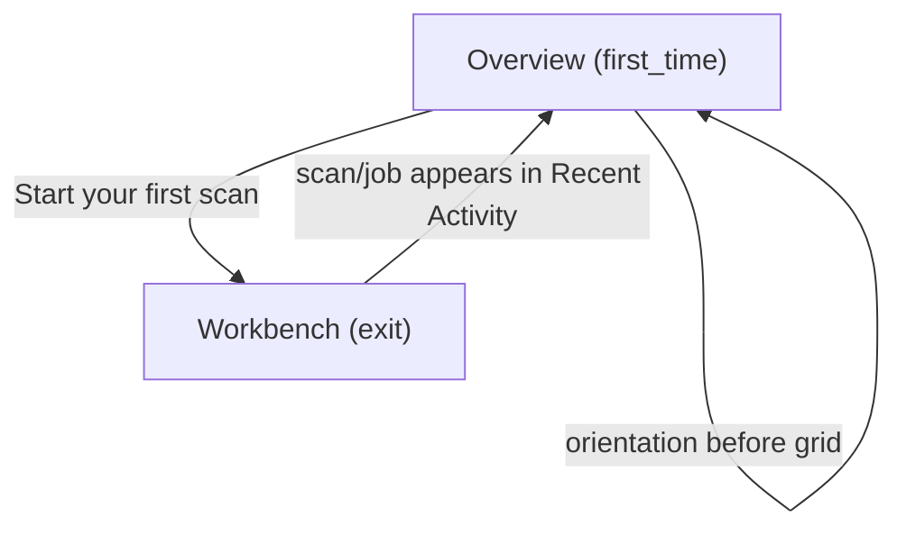
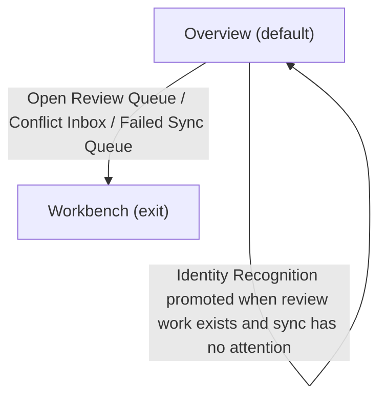
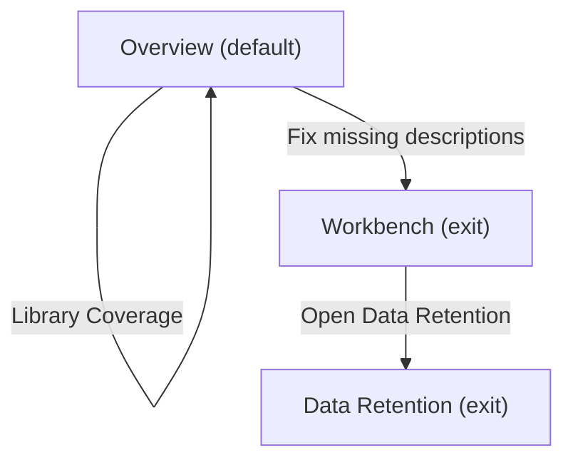

# UX Map — dashboard

**Product:** `prototype-wp-alt-context`
**Source fixture:** `apps/prototype-wp-alt-context/js/admin/pages/DashboardPage.tsx`

## Goals

- Give the operator one landing surface for sync health, identity-recognition progress, library coverage, recent jobs, and data retention
- Keep the first-use orientation before the dashboard grid until the first person is named
- Make dashboard section order and per-section loading, empty, error, first-use, and degraded behavior reviewable as a text-first SSOT

## Jobs

- `job-start-recognition` — Start identity recognition and move from scan to review
- `job-triage-dashboard` — Triage dashboard health and choose the next operator action
- `job-maintain-library` — Improve library coverage and review data retention

## State and placement rules

The screen-level state is the aggregate landing-surface state. Each zone also owns a state matrix; a section can be loading or in error while the hero and other sections remain rendered.

- Base grid order: `Sync Health` → `Identity Recognition` → `Library Coverage` → `Recent Activity` → `Data Retention`.
- When sync has no attention and actionable review work exists (`pendingClustersCount > 0` or `unassignedPersonsCount > 0`), `Identity Recognition` is promoted ahead of `Sync Health`.
- The orientation surface is outside the grid and sits immediately after the hero, before whichever grid order applies.
- Orientation is rendered before the grid for `unscanned`, `scanning`, and `clusters_pending` flow states. It is hidden once `flowState` is `first_named`; dismissal also hides the card for that browser/user.
- `assigned_clusters_count > 0` sets `flowState` to `first_named`, so a populated Assigned count cannot appear with Getting Started. First-time and default sketches are therefore separate compositions.
- The hero is always present and has no distinct first_time branch. Dashboard data hooks load independently, so loading/error branches belong to their sections rather than replacing the shell.
- There is no exclusive page-level `empty` or `offline` shell. Offline copy is a Sync Health summary tag inside the intact (often degraded) grid.

## Screens

| id | kind | route | title | wp_page |
| --- | --- | --- | --- | --- |
| `dashboard-shell` | screen | `#/dashboard` | Overview | `alt-context-dashboard` |
| `exit-workbench` | exit | `#/workbench` | Workbench | `alt-context-workbench` |
| `exit-retention` | exit | `#/retention` | Data Retention | `alt-context-retention` |
| `exit-roster` | exit | `#/roster` | Roster (person workspace) | `alt-context-roster` |

### Overview (`dashboard-shell`)

Purpose: Landing screen with hero, conditional orientation surface, and a priority-ordered grid of Sync Health, Identity Recognition, Library Coverage, Recent Activity, and Data Retention sections.

| zone id | label | role | states |
| --- | --- | --- | --- |
| `z-dashboard-hero` | Dashboard hero (Alt Context / Overview / contextual subtitle) | content | default |
| `z-orientation` | Orientation surface (Getting Started with Identity Recognition; before grid unless first_named) | content | default, first_time |
| `z-sync-health` | Sync Health section (summary, pending changes, conflicts, failed sync events, topology work) | status | default, loading, error |
| `z-identity-recognition` | Identity Recognition section (people, assigned, pending review, media with faces, guidance) | content | default, loading, error, first_time |
| `z-library-coverage` | Library Coverage section (total media, missing alt text, coverage, fix CTA) | content | default, loading |
| `z-recent-activity` | Recent Activity section (recognition jobs, provenance, status, duration, results link) | queue | default, empty, degraded, error |
| `z-retention-posture` | Data Retention section (mode, last export, last purge, Open Data Retention link) | status | default, error |

Screen states: `default`, `loading`, `error`, `first_time`, `degraded`.

#### Default — populated

`flowState` is `first_named` (Assigned > 0), so orientation is hidden. The sketch shows the base order. If actionable review work exists without sync attention, move Identity Recognition above Sync Health. GuidanceCard with pending review shows Go to Review Queue.

```
+------------------------------------------------------------+
| Alt Context                                               |
| Overview                                                  |
| It finds the people in your media library and writes      |
| alt text that names them.                                 |
+------------------------------------------------------------+
| Sync Health                                               |
|   Everything is saved and up to date.                     |
|   Pending changes 0 / Conflicts 0 / Failed operations 0   |
|   [Open Review Queue]                                     |
+------------------------------------------------------------+
| Identity Recognition                                     |
|   People 24 | Assigned 20 | Pending Review 4              |
|   Media with faces 120                                    |
|   [Go to Review Queue]                                    |
+------------------------------------------------------------+
| Library Coverage                                         |
|   Total Media 300 | Missing Alt Text 40 | Coverage 87%    |
|   [Fix missing descriptions]                              |
+------------------------------------------------------------+
| Recent Activity                                          |
|   Scan finished · 120 images · 2 minutes ago              |
|   Durable batch run                         [View Results] |
+------------------------------------------------------------+
| Data Retention                                           |
|   Current Mode / Last Export / Last Purge                 |
|   [Open Data Retention]                                   |
+------------------------------------------------------------+
```

#### Caught up — everything reviewed

A reachable fourth GuidanceCard branch: `pending_clusters_count === 0`, `unassigned_persons_count === 0`, and `people_count > 0`. All review work is done but people already exist, so GuidanceCard shows a caught-up message with an Open Review Queue CTA (distinct from the fresh-tenant `people_count === 0` branch, which shows Go to Scan tab). Everything else matches the Default composition. Not listed in `states`: `caught_up` is not a member of the canonical `MapState` enum (`workbay_canvas_mcp/ux_map/models.py`), so the branch is documented here rather than named in the map until that enum is widened upstream.

```
+------------------------------------------------------------+
| Alt Context                                               |
| Overview                                                  |
| It finds the people in your media library and writes      |
| alt text that names them.                                 |
+------------------------------------------------------------+
| Sync Health                                               |
|   Everything is saved and up to date.                     |
|   Pending changes 0 / Conflicts 0 / Failed operations 0   |
|   [Open Review Queue]                                     |
+------------------------------------------------------------+
| Identity Recognition                                     |
|   People 24 | Assigned 24 | Pending Review 0              |
|   Media with faces 120                                    |
|   All caught up. New faces will appear here for review.   |
|   Open the Review Queue to check for new face groups.     |
|   [Open Review Queue]                                     |
+------------------------------------------------------------+
| Library Coverage                                         |
|   Total Media 300 | Missing Alt Text 40 | Coverage 87%    |
|   [Fix missing descriptions]                              |
+------------------------------------------------------------+
| Recent Activity                                          |
|   Scan finished · 120 images · 2 minutes ago              |
|   Durable batch run                         [View Results] |
+------------------------------------------------------------+
| Data Retention                                           |
|   Current Mode / Last Export / Last Purge                 |
|   [Open Data Retention]                                   |
+------------------------------------------------------------+
```

#### First-time — fresh tenant

The hero and orientation surface render while independently loaded sections settle on zero counts or no-history copy. The first-use flow state is `unscanned`; orientation is before the grid. Assigned is 0, so Getting Started can show. GuidanceCard with people_count 0 shows Go to Scan tab. Dismiss is always on the orientation card. Sync Health has already loaded successfully here, so Open Review Queue is present the same as in the default composition.

```
+------------------------------------------------------------+
| Alt Context                                               |
| Overview                                                  |
| It finds the people in your media library and writes      |
| alt text that names them.                                 |
+------------------------------------------------------------+
| Getting Started with Identity Recognition                 |
|   1. Scan  ->  2. Confirm  ->  3. Review                  |
|   [Start your first scan] [Dismiss getting started]       |
+------------------------------------------------------------+
| Sync Health                                               |
|   Everything is saved and up to date.                     |
|   [Open Review Queue]                                     |
+------------------------------------------------------------+
| Identity Recognition                                     |
|   People 0 | Assigned 0 | Pending Review 0                |
|   Media with faces 0                                     |
|   [Go to Scan tab]                                        |
+------------------------------------------------------------+
| Library Coverage                                         |
|   Total Media 0 | Missing Alt Text 0 | Coverage 0%        |
|   [Fix missing descriptions]                              |
+------------------------------------------------------------+
| Recent Activity                                          |
|   No recent scans yet                                     |
|   Run a scan to find faces in your media library.         |
|   [Run a scan]                                            |
+------------------------------------------------------------+
| Data Retention                                           |
|   (absent while policy is unavailable)                    |
+------------------------------------------------------------+
```

#### Loading

There is no page-wide loading replacement. The hero and orientation can remain visible while each data-backed section reports its own loading branch. Identity still loading means `assigned_clusters_count` is not yet first_named, so orientation may show. The Library Coverage progress bar and Fix missing descriptions CTA render outside the loading branch, so they are present even while coverage stats are still loading.

```
+------------------------------------------------------------+
| Overview                                                  |
| Getting Started with Identity Recognition                 |
+------------------------------------------------------------+
| Sync Health                                               |
|   Loading sync health…                                   |
+------------------------------------------------------------+
| Identity Recognition                                     |
|   Loading identity stats…                                |
+------------------------------------------------------------+
| Library Coverage                                         |
|   Loading coverage insights…                             |
|   (progress bar and [Fix missing descriptions] render regardless of loading) |
+------------------------------------------------------------+
| Recent Activity                                          |
|   History area remains in its hook-provided state         |
+------------------------------------------------------------+
| Data Retention                                           |
|   absent while retention status is loading                |
+------------------------------------------------------------+
```

#### Error

Errors are section-local. Sync Health shows `Sync health is unavailable right now.` when its status request fails or returns no status; Identity Recognition shows a retryable error; Recent Activity shows the unavailable copy when `historySource === 'unavailable'` and the list is empty; Data Retention shows retention remediation; the hero and other sections remain present.

Identity Recognition actually has two distinct, independently-triggered retry controls, both drawn below: the identity-stats request itself failing (`isIdentityError`, `[Retry]`), and the request succeeding but returning no stats (`!identityStats`, `[Retry identity stats]`). These are separate branches in the component, not two labels for the same affordance.

```
+------------------------------------------------------------+
| Overview                                                  |
| Getting Started with Identity Recognition                 |
+------------------------------------------------------------+
| Sync Health                                               |
|   Sync health is unavailable right now.                   |
+------------------------------------------------------------+
| Identity Recognition                                     |
|   Unable to load identity stats.             [Retry]       |
|   (or) Identity stats are unavailable. [Retry identity stats] |
+------------------------------------------------------------+
| Library Coverage                                         |
|   Coverage counters and [Fix missing descriptions]        |
+------------------------------------------------------------+
| Recent Activity                                          |
|   Recent activity is unavailable                          |
|   Previous scans could not be loaded. You can still       |
|   start a new scan.                                       |
|   [Run a scan]                                            |
+------------------------------------------------------------+
| Data Retention                                           |
|   Retention status could not load. Check the connection   |
|   on the Settings page.                      [Open Data Retention] |
+------------------------------------------------------------+
```

#### Degraded

Degraded is an intact first_named dashboard with an attention-bearing sync state or partial history. Orientation is hidden because Assigned > 0. Sync Health can show warnings, mirror divergence, conflicts, failed sync events, topology work, or an offline backend summary; Recent Activity can identify browser-local fallback. When pending review is 0 and unassigned persons remain, GuidanceCard shows Review unassigned persons. Open Review Queue and Fix missing descriptions are not gated by sync or coverage state, so both remain present here too.

`historySource === 'browser_local_fallback'` is a single value, not a flag that composes with an `empty`/`default` toggle: the banner renders from its own `if`, then falls through to whichever content branch `recentActivity.length` selects. So the browser-local-fallback banner can render together with either an empty list or a populated one — degraded and empty are not mutually exclusive. The sketch below draws that pairing: the banner with zero recent jobs.

```
+------------------------------------------------------------+
| Overview                                                  |
+------------------------------------------------------------+
| Sync Health                          (attention / offline) |
|   Mirror is out of sync; pending / conflicts / failures   |
|   [Open Review Queue]                                     |
|   [Reset mirror] [Open Conflict Inbox] [Open Failed Sync Queue] |
+------------------------------------------------------------+
| Identity Recognition                                     |
|   People 24 | Assigned 20 | Pending Review 0              |
|   [Review unassigned persons]                             |
+------------------------------------------------------------+
| Library Coverage                                         |
|   Coverage counters remain available                       |
|   [Fix missing descriptions]                              |
+------------------------------------------------------------+
| Recent Activity                                          |
|   Showing jobs remembered in this browser only.           |
|   No recent scans yet                                     |
|   Run a scan to find faces in your media library.         |
|   [Run a scan]                                            |
+------------------------------------------------------------+
| Data Retention                                           |
|   Policy summary or remediation remains local to panel    |
+------------------------------------------------------------+
```

#### Sync Health — why `degraded` and `offline` are not zone states

`DashboardSyncHealthSection.tsx` has exactly three exclusive branches:

    :56  isLoading              -> "Loading sync health…"
    :58  isError || !syncStatus -> EmptyState: heading + body + [Open settings]
    :66  else                   -> the composition drawn below

Inside the else branch the members render independently. Two are unconditional; the
rest only *add* to them. `degraded` and `offline` name "some subset of the conditional
ones is on", which is a modifier axis, not a branch of the chain above.

    B  :96  (unconditional)                    summary <p>; text varies
    S  :99  (unconditional)                    stats grid, 3 value/label pairs
    A  :68  showMirrorDivergenceBanner         mirror banner + [Reset mirror]
    C  :113 topologyPending|Failed|Conflicts>0 pending-work summary line
    D1 :123 conflictCount>0 && lastConflictDate    last-conflict line
    E1 :126 failedReplayCount>0 && lastFailureDate last-failure line
    R  :129 (unconditional)                    [Open Review Queue]
    D2 :134 conflictCount>0                    [Open Conflict Inbox]
    E2 :140 failedReplayCount>0                [Open Failed Sync Queue]

A recency line and its CTA are gated *separately*: `[Open Conflict Inbox]` needs only
`conflictCount > 0`, while `Last conflict:` additionally needs a parsable date. So
conflict and failure each have three reachable shapes — absent, CTA only, CTA plus
recency line — and together with A and C that is 2 × 2 × 3 × 3 = 36 compositions of
this one branch. B varies orthogonally: `getDashboardSyncHealthSummary`
(`degradedModeBannerLogic.ts:36-50`) returns one of six `SyncHealth` cases (healthy,
queued, conflicts, failures, offline, stale), the last being the default fallthrough, plus a
healthy-with-warnings overlay at :32-33 returning the degraded warning message or
`attentionSummary`. A single `degraded` peer state collapses all of that into one name
*and* implies it excludes `default`, which is false. That is why the states list is
`default, loading, error` and the modifier axis is recorded as an open question.

Maximal composition (A, C, and both counts with dates), real DOM order, real copy.
Recency values are whatever `date.toLocaleDateString()` returns
(`DashboardPage.tsx:47-53`) — a locale calendar date, never relative time:

```
+------------------------------------------------------------+
| Sync Health                                                |
|  /!\ Mirror is out of sync with the backend — 12 stale     |
|      face groups, 3 failed sync events.   [Reset mirror]   |
|  Some sync operations failed and need operator attention.  |
|      7            2             3                          |
|  Pending changes  Conflicts  Failed operations             |
|  7 waiting, 3 failed, 2 need review                        |
|  Last conflict: 3/7/2026                                   |
|  Last failure: 3/7/2026                                    |
|  [Open Review Queue] [Open Conflict Inbox]                 |
|  [Open Failed Sync Queue]                                  |
+------------------------------------------------------------+
```

Counts without dates — same branch, same state name, both CTAs present and both
recency lines gone (exercised by `DashboardPage.test.tsx` “shows dashboard sync links
for conflicts and dead-letter work”):

```
+------------------------------------------------------------+
| Sync Health                                                |
|  Some sync operations failed and need operator attention.  |
|      0            2             1                          |
|  Pending changes  Conflicts  Failed operations             |
|  [Open Review Queue] [Open Conflict Inbox]                 |
|  [Open Failed Sync Queue]                                  |
+------------------------------------------------------------+
```

Minimal composition (A, C and both counts false):

```
+------------------------------------------------------------+
| Sync Health                                                |
|  Everything is saved and up to date.                       |
|      0            0             0                          |
|  Pending changes  Conflicts  Failed operations             |
|  [Open Review Queue]                                       |
+------------------------------------------------------------+
```

Interactivity notes:

- `[Open Review Queue]` is unconditional *inside the default branch only*. Loading
  offers no control at all and error always mounts `[Open settings]` instead, so no
  single action spans the zone's three states [A11Y-24].
- `[Open Conflict Inbox]` and `[Open Failed Sync Queue]` appear and disappear with the
  two counts, so the action row reflows under the operator between polls. A control
  that moves because of a background refetch breaks the meaningful focus order the
  keyboard walk depends on, for pointer and switch users alike [A11Y-11].
- The mirror banner is `role="status"` (no explicit `aria-live`) and mounts only after
  `syncStatus` resolves, so it is a real announcement rather than first-paint
  decoration. It is the only live region in the default branch. The error branch's
  EmptyState mounts its own `role="status"` / `aria-live="polite"` region nested inside
  the panel `<section>`; the branches are exclusive so the two never coexist, but the
  error announcement sits two landmarks deep and loading announces nothing at all
  [A11Y-24].
- `[Reset mirror]` swaps its own label to "Resetting…" while pending and is the only
  destructive control in the zone. It exists only when A is true, so the operator
  cannot reach it from the healthy composition. It calls `onResetMirror` directly on
  click with no confirm or preview step, which contradicts
  `act-reset-mirror.preview_required` in `dashboard.uxmap.json`.


### Workbench (`exit-workbench`)

Purpose: Scan, review queue, conflict inbox, and failed-sync overlays after a dashboard CTA

url_params: `tab`, `panel`, `advanced`, `status`

| zone id | label | role | states |
| --- | --- | --- | --- |
| `z-wb-entry` | Workbench entry | nav | default |

```
+------------------------------------------------------------+
| Workbench  [exit]  #/workbench                             |
| Scan, review queue, conflict inbox, and failed-sync        |
| overlays after a dashboard CTA                             |
+------------------------------------------------------------+
| ZONES                                                      |
|   - Workbench entry (nav)                                  |
+------------------------------------------------------------+
| states: default | loading | error                          |
+------------------------------------------------------------+
```

### Data Retention (`exit-retention`)

Purpose: Review policy, run exports, and inspect recent audit events

| zone id | label | role | states |
| --- | --- | --- | --- |
| `z-retention-entry` | Data Retention entry | nav | default |

```
+------------------------------------------------------------+
| Data Retention  [exit]  #/retention                        |
| Review policy, run exports, and inspect recent audit       |
| events                                                     |
+------------------------------------------------------------+
| ZONES                                                      |
|   - Data Retention entry (nav)                             |
+------------------------------------------------------------+
| states: default | loading | error                          |
+------------------------------------------------------------+
```

### Roster (person workspace) (`exit-roster`)

Purpose: Review unassigned persons after dashboard identity guidance

url_params: `personFilter`, `person`

| zone id | label | role | states |
| --- | --- | --- | --- |
| `z-roster-entry` | Roster entry | nav | default |

```
+------------------------------------------------------------+
| Roster (person workspace)  [exit]  #/roster                |
| Review unassigned persons after dashboard identity         |
| guidance                                                   |
+------------------------------------------------------------+
| ZONES                                                      |
|   - Roster entry (nav)                                     |
+------------------------------------------------------------+
| states: default | loading | empty | error                  |
+------------------------------------------------------------+
```

## Actions

| id | hierarchy | verb | target |
| --- | --- | --- | --- |
| `act-start-first-scan` | primary | Start your first scan | `#/workbench?tab=scan` |
| `act-dismiss-orientation` | tertiary | Dismiss getting started | dashboard-shell |
| `act-open-review-queue` | primary | Open Review Queue | `#/workbench?tab=scan` |
| `act-fix-missing-descriptions` | primary | Fix missing descriptions | `#/workbench?status=missing` |
| `act-open-retention` | secondary | Open Data Retention | `#/retention` |
| `act-open-conflicts` | secondary | Open Conflict Inbox | `#/workbench?tab=scan&panel=conflicts` |
| `act-open-failed-sync` | secondary | Open Failed Sync Queue | `#/workbench?tab=scan&panel=dead-letter` |
| `act-reset-mirror` | destructive | Reset mirror | dashboard sync health |
| `act-view-results` | secondary | View Results | `#/workbench?advanced=open` |
| `act-retry-identity-stats` | secondary | Retry | dashboard-shell |
| `act-retry-identity-stats-unavailable` | secondary | Retry identity stats | dashboard-shell |
| `act-go-to-review-queue` | primary | Go to Review Queue | `#/workbench?advanced=open` |
| `act-review-unassigned` | secondary | Review unassigned persons | `#/roster?personFilter=unassigned` |
| `act-go-to-scan-tab` | secondary | Go to Scan tab | `#/workbench?tab=scan` |

## Flows

### First-time orientation → start first scan → review queue (`flow-first-recognition`)



### Read health and identity counts → open review queue or resolve sync debt (`flow-dashboard-review`)



### Check coverage → fix missing descriptions → inspect data retention (`flow-dashboard-maintenance`)



## Open questions

- Should an unavailable retention policy remain absent, or should the dashboard expose a stable empty-state panel?
- Should Recent Activity expose an explicit loading row while durable history is being fetched?
- `z-retention-posture` renders nothing while retention status is loading and nothing when `available:false` — should either of those become a distinguishable zone state instead of an absence?
- GuidanceCard has a reachable caught-up branch (pending 0, unassigned 0, people > 0) with no canonical `MapState` to name it — widen `MapState` upstream, or accept that the branch stays sketch-only?
- `z-recent-activity` `degraded` (the `browser_local_fallback` banner) is an independent overlay, not exclusive with `default`/`empty`: `historySource` selects the banner and the content branch separately, so `degraded` renders together with either. `error` *is* mutually exclusive with `degraded` (both derive from the same single-valued `historySource`). The flat `states` list cannot express either relation — should the schema gain state composition?

## Parity index

Zone ids: z-dashboard-hero z-orientation z-sync-health z-identity-recognition z-library-coverage z-recent-activity z-retention-posture z-wb-entry z-retention-entry z-roster-entry

Action ids: act-start-first-scan act-dismiss-orientation act-open-review-queue act-fix-missing-descriptions act-open-retention act-open-conflicts act-open-failed-sync act-reset-mirror act-view-results act-retry-identity-stats act-retry-identity-stats-unavailable act-go-to-review-queue act-review-unassigned act-go-to-scan-tab

Zone labels (verbatim):

- Dashboard hero (Alt Context / Overview / contextual subtitle)
- Orientation surface (Getting Started with Identity Recognition; before grid unless first_named)
- Sync Health section (summary, pending changes, conflicts, failed sync events, topology work)
- Identity Recognition section (people, assigned, pending review, media with faces, guidance)
- Library Coverage section (total media, missing alt text, coverage, fix CTA)
- Recent Activity section (recognition jobs, provenance, status, duration, results link)
- Data Retention section (mode, last export, last purge, Open Data Retention link)
- Workbench entry
- Data Retention entry
- Roster entry

Screen states: default loading error first_time degraded

## Not doing

- Changing DashboardPage, the priority model, OrientationCard, or any product behavior
- Defining pixel, token, responsive, or visual styling details
- Replacing the independent per-section data loading branches with a page-level suspense boundary
