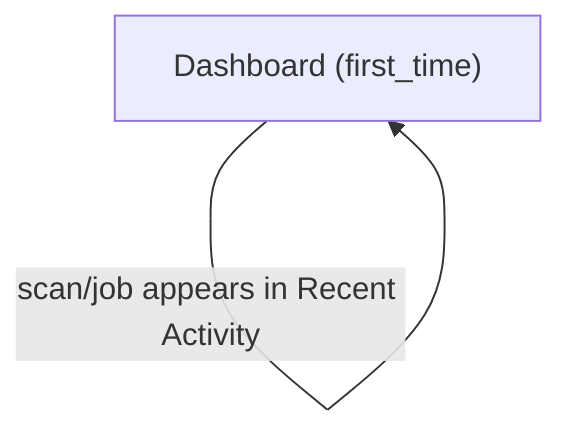
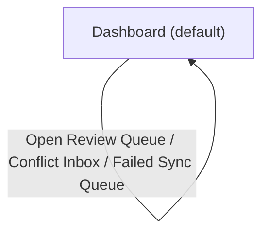
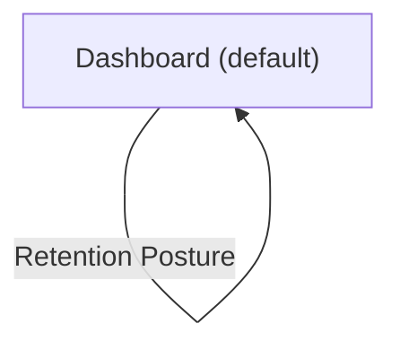

# UX Map — dashboard

**Product:** `prototype-wp-alt-context`
**Source fixture:** `apps/prototype-wp-alt-context/js/admin/pages/DashboardPage.tsx`

## Goals

- Give the operator one landing surface for sync health, identity-recognition progress, library coverage, recent jobs, and retention posture
- Keep the first-use orientation before the dashboard grid until the first person is named
- Make dashboard section order and per-section loading, empty, error, first-use, and degraded behavior reviewable as a text-first SSOT

## Jobs

- `job-start-recognition` — Start identity recognition and move from scan to review
- `job-triage-dashboard` — Triage dashboard health and choose the next operator action
- `job-maintain-library` — Improve library coverage and review retention posture

## State and placement rules

The screen-level state is the aggregate landing-surface state. Each zone also owns a state matrix; a section can be loading or in error while the hero and other sections remain rendered.

- Base grid order: `Sync Health` → `Identity Recognition` → `Library Coverage` → `Recent Activity` → `Retention Posture`.
- When sync has no attention and actionable review work exists (`pendingClustersCount > 0` or `unassignedPersonsCount > 0`), `Identity Recognition` is promoted ahead of `Sync Health`.
- The orientation surface is outside the grid and sits immediately after the hero, before whichever grid order applies.
- Orientation is rendered before the grid for `unscanned`, `scanning`, and `clusters_pending` flow states. It is hidden once `flowState` is `first_named`; dismissal also hides the card for that browser/user.
- The hero is always present. Dashboard data hooks load independently, so loading/error branches belong to their sections rather than replacing the shell.

## Screens

| id | kind | route | title | wp_page |
| --- | --- | --- | --- | --- |
| `dashboard-shell` | screen | `#/dashboard` | Dashboard | `alt-context-dashboard` |

### Dashboard (`dashboard-shell`)

Purpose: Landing screen with hero, conditional orientation surface, and a priority-ordered grid of Sync Health, Identity Recognition, Library Coverage, Recent Activity, and Retention Posture sections.

| zone id | label | role | states |
| --- | --- | --- | --- |
| `z-dashboard-hero` | Dashboard hero (Alt Context / Overview / contextual subtitle) | content | default, first_time |
| `z-orientation` | Orientation surface (Getting Started with Identity Recognition; before grid unless first_named) | content | default, first_time |
| `z-sync-health` | Sync Health section (summary, pending changes, conflicts, failed sync events, topology work) | status | default, loading, error, offline, degraded |
| `z-identity-recognition` | Identity Recognition section (people, assigned, pending review, media with faces, guidance) | content | default, loading, error, first_time |
| `z-library-coverage` | Library Coverage section (total media, missing alt text, coverage, fix CTA) | content | default, loading, first_time |
| `z-recent-activity` | Recent Activity section (recognition jobs, provenance, status, duration, results link) | queue | default, empty, degraded |
| `z-retention-posture` | Retention Posture section (mode, last export, last purge, retention settings link) | status | default, loading, empty, error |

Screen states: `default`, `loading`, `empty`, `error`, `offline`, `first_time`, `degraded`.

#### Default — populated

The sketch shows the base order and the orientation placement. If the first person has already been named, remove the orientation row; if actionable review work exists without sync attention, move Identity Recognition above Sync Health.

```
+------------------------------------------------------------+
| Alt Context                                               |
| Dashboard                                                 |
| It finds the people in your media library and writes      |
| alt text that names them.                                 |
+------------------------------------------------------------+
| Getting Started with Identity Recognition          [x]    |
|   1. Scan  ->  2. Confirm  ->  3. Review                  |
|   [Start your first scan]                                 |
+------------------------------------------------------------+
| Sync Health                                               |
|   Healthy / pending changes 0 / conflicts 0 / failed 0    |
|   [Open Review Queue]                                     |
+------------------------------------------------------------+
| Identity Recognition                                     |
|   People 24 | Assigned 20 | Pending Review 4              |
|   Media with faces 120                                    |
+------------------------------------------------------------+
| Library Coverage                                         |
|   Total Media 300 | Missing Alt Text 40 | Coverage 87%    |
|   [Fix missing descriptions]                              |
+------------------------------------------------------------+
| Recent Activity                                          |
|   Scan finished · 120 images · 2 minutes ago              |
|   Durable batch run                         [View Results] |
+------------------------------------------------------------+
| Retention Posture                                        |
|   Current Mode / Last Export / Last Purge                 |
|   [Retention settings]                                    |
+------------------------------------------------------------+
```

#### First-time — fresh tenant

The hero and orientation surface render while the independently loaded sections settle on zero counts or no-history copy. The first-use flow state is `unscanned`; orientation is before the grid.

```
+------------------------------------------------------------+
| Alt Context                                               |
| Dashboard                                                 |
| It finds the people in your media library and writes      |
| alt text that names them.                                 |
+------------------------------------------------------------+
| Getting Started with Identity Recognition                 |
|   1. Scan  ->  2. Confirm  ->  3. Review                  |
|   [Start your first scan]                                 |
+------------------------------------------------------------+
| Sync Health                                               |
|   Connected / no pending changes                          |
+------------------------------------------------------------+
| Identity Recognition                                     |
|   People 0 | Assigned 0 | Pending Review 0                |
|   Media with faces 0                                     |
+------------------------------------------------------------+
| Library Coverage                                         |
|   Total Media 0 | Missing Alt Text 0 | Coverage 0%        |
|   [Fix missing descriptions]                              |
+------------------------------------------------------------+
| Recent Activity                                          |
|   No recent recognition jobs found.                       |
+------------------------------------------------------------+
| Retention Posture                                        |
|   (absent while policy is unavailable)                    |
+------------------------------------------------------------+
```

#### Loading

There is no page-wide loading replacement. The hero and orientation can remain visible while each data-backed section reports its own loading branch.

```
+------------------------------------------------------------+
| Dashboard                                                 |
| Getting Started with Identity Recognition                 |
+------------------------------------------------------------+
| Sync Health                                               |
|   Loading sync health…                                   |
+------------------------------------------------------------+
| Identity Recognition                                     |
|   Loading identity stats…                                |
+------------------------------------------------------------+
| Library Coverage                                         |
|   Loading coverage insights…                             |
+------------------------------------------------------------+
| Recent Activity                                          |
|   History area remains in its hook-provided state         |
+------------------------------------------------------------+
| Retention Posture                                        |
|   absent while retention status is loading                |
+------------------------------------------------------------+
```

#### Error

Errors are section-local. Sync Health shows `Sync health is unavailable right now.` when its status request fails or returns no status; Identity Recognition shows a retryable error; Retention Posture shows retention remediation; the hero and other sections remain present.

```
+------------------------------------------------------------+
| Dashboard                                                 |
| Getting Started with Identity Recognition                 |
+------------------------------------------------------------+
| Sync Health                                               |
|   Sync health is unavailable right now.                   |
+------------------------------------------------------------+
| Identity Recognition                                     |
|   Unable to load identity stats.             [Retry]       |
+------------------------------------------------------------+
| Library Coverage                                         |
|   Coverage counters and [Fix missing descriptions]        |
+------------------------------------------------------------+
| Recent Activity                                          |
|   Durable recent activity is unavailable right now.       |
+------------------------------------------------------------+
| Retention Posture                                        |
|   Retention status unavailable; open retention settings   |
+------------------------------------------------------------+
```

#### Degraded

Degraded is an intact dashboard with an attention-bearing sync state or partial history. Sync Health can show warnings, mirror divergence, conflicts, failed sync events, topology work, or an offline backend; Recent Activity can identify browser-local fallback. The other sections remain usable when their own requests succeed.

```
+------------------------------------------------------------+
| Dashboard                                                 |
| Getting Started with Identity Recognition                 |
+------------------------------------------------------------+
| Sync Health                         [attention / offline]  |
|   Mirror is out of sync; pending / conflicts / failures   |
|   [Reset mirror] [Open Conflict Inbox]                    |
+------------------------------------------------------------+
| Identity Recognition                                     |
|   Counts and review guidance remain available              |
+------------------------------------------------------------+
| Library Coverage                                         |
|   Coverage counters remain available                       |
+------------------------------------------------------------+
| Recent Activity                                          |
|   Showing jobs remembered in this browser only.           |
+------------------------------------------------------------+
| Retention Posture                                        |
|   Policy summary or remediation remains local to panel    |
+------------------------------------------------------------+
```

## Actions

| id | hierarchy | verb | target |
| --- | --- | --- | --- |
| `act-start-first-scan` | primary | Start first scan | `#/workbench?tab=scan` |
| `act-open-review-queue` | primary | Open review queue | `#/workbench?tab=scan` |
| `act-fix-missing-descriptions` | primary | Fix missing descriptions | `#/workbench?status=missing` |
| `act-open-retention` | secondary | Open retention settings | `#/retention` |
| `act-open-conflicts` | secondary | Open Conflict Inbox | `#/workbench?tab=scan&panel=conflicts` |
| `act-open-failed-sync` | secondary | Open Failed Sync Queue | `#/workbench?tab=scan&panel=dead-letter` |
| `act-reset-mirror` | destructive | Reset mirror | dashboard sync health |

## Flows

### First-time orientation → start first scan → review queue (`flow-first-recognition`)



### Read health and identity counts → open review queue or resolve sync debt (`flow-dashboard-review`)



### Check coverage → fix missing descriptions → inspect retention posture (`flow-dashboard-maintenance`)



## Open questions

- Should an unavailable retention policy remain absent, or should the dashboard expose a stable empty-state panel?
- Should Recent Activity expose an explicit loading row while durable history is being fetched?

## Parity index

Zone ids: z-dashboard-hero z-orientation z-sync-health z-identity-recognition z-library-coverage z-recent-activity z-retention-posture

Action ids: act-start-first-scan act-open-review-queue act-fix-missing-descriptions act-open-retention act-open-conflicts act-open-failed-sync act-reset-mirror

Zone labels (verbatim):

- Dashboard hero (Alt Context / Overview / contextual subtitle)
- Orientation surface (Getting Started with Identity Recognition; before grid unless first_named)
- Sync Health section (summary, pending changes, conflicts, failed sync events, topology work)
- Identity Recognition section (people, assigned, pending review, media with faces, guidance)
- Library Coverage section (total media, missing alt text, coverage, fix CTA)
- Recent Activity section (recognition jobs, provenance, status, duration, results link)
- Retention Posture section (mode, last export, last purge, retention settings link)

Screen states: default loading empty error offline first_time degraded

## Not doing

- Changing DashboardPage, the priority model, OrientationCard, or any product behavior
- Defining pixel, token, responsive, or visual styling details
- Replacing the independent per-section data loading branches with a page-level suspense boundary
