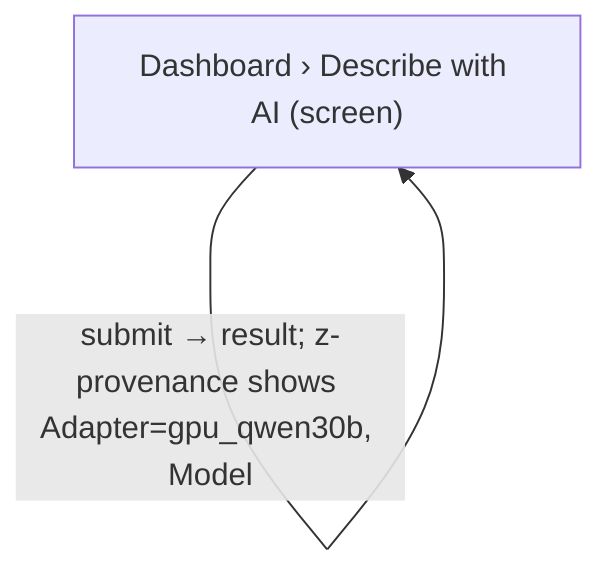

# UX Map — describe-gpu-tier

**Product:** `alt-context WP plugin admin SPA — describe run GPU tier + lifecycle state`
**Source fixture:** `apps/prototype-wp-alt-context/js/admin/pages/DescribeRunApplyView.tsx`

## Goals
- Operator can start a bulk describe run and always see whether the GPU tier is stopped, warming, ready, or degraded (INT-10 status–predict–stop).
- A cold GPU start (~90–100 s measured, VLM-3B decision 2266) is a bounded, cancellable wait, never a silent hang (INT-08, CARD-09).
- Provisional CPU drafts and final GPU descriptions are visibly distinct at the item and run level (HAI-05, HAI-08, PROV-06).
- Before Describe, disclose possible GPU warm-up and infrastructure charges separately from credits, with a Settings link (INT-07, NAV-11). Read failures retain saved rows and apply recovery, show a stale notice, and offer a read-only Retry (INT-10).

## Jobs
- `bulk-describe` — Describe selected media with AI and apply results
- `single-describe` — Describe one image from the dashboard panel
- `gpu-tier-awareness` — Know which tier produced a description and what it will cost/take

## Screens
| id | kind | route | title |
| --- | --- | --- | --- |
| `workbench-media-selection` | screen | `#/workbench` | Workbench › Media selection |
| `describe-run-apply` | screen | `#/description-history?run=<id>` | Description History › Review & apply |
| `dashboard-describe-panel` | screen | `#/` | Dashboard › Describe with AI |
| `toast-gpu-transition` | overlay | `#/workbench (transient toast; no dedicated route)` | Toast — GPU tier transition |

### Workbench › Media selection (`workbench-media-selection`)

Purpose: Select media, launch a bulk describe run, watch progress including GPU tier state. Run phases (domain vocabulary behind the canonical states): selecting = default; describe-running = loading; describe-terminal = default; no selection = empty; degraded-cpu = degraded. Serves job `bulk-describe`.

url_params: `run_id`

| zone id | label | role | states |
| --- | --- | --- | --- |
| `z-bulk-cta` | Describe selected CTA — State vocabulary: default (selection ready) / gpu-cold-preview (default, CTA hint shows the warm-up cost) / pending = loading / disabled-empty-selection = empty. | job | default, loading, empty |
| `z-bulk-progress` | Bulk describe progress — State vocabulary: starting, gpu-stopped, gpu-starting, gpu-warming, describing-provisional, describing-final and waiting-cooldown = loading; complete and cancelled = default; failed = error; degraded-cpu = degraded. | status | default, loading, error, degraded |
| `z-gpu-tier-chip` | GPU tier chip — State vocabulary: hidden-no-run = empty; unknown, stopped and ready = default; starting and warming = loading; degraded = degraded. | status | default, loading, empty, degraded |
| `z-review-link` | Review & apply drafts link — Hidden until the run is terminal; terminal runs link to #/description-history?run=<id>, regardless of item tier. | nav | default, empty, degraded |

```
+------------------------------------------------------------+
| Workbench › Media selection  [screen]  #/workbench         |
| Select media, launch a bulk describe run, watch progress … |
+------------------------------------------------------------+
| ZONES                                                      |
|   - Describe selected CTA — State vocabulary: default (se… |
|   - Bulk describe progress — State vocabulary: starting, … |
|   - GPU tier chip — State vocabulary: hidden-no-run = emp… |
|   - Review & apply drafts link — Hidden until the run is … |
+------------------------------------------------------------+
| ACTIONS                                                    |
|   [PRIMARY] Describe N selected -> POST describe/run (cos… |
|   [secondary] Cancel run -> POST describe/run/:id/cancel   |
|   [secondary] Use CPU drafts now -> navigate describe-run… |
|   [secondary] Retry -> refetch run status                  |
+------------------------------------------------------------+
| states: default | loading | empty | error | degraded       |
+------------------------------------------------------------+
```

### Description History › Review & apply (`describe-run-apply`)

Purpose: Review per-item drafts, see tier per item, apply to media. The canonical Description History route selects the run with the run query parameter; Back to full history clears that selection. Run phases: all-final = default; loading = loading; no items = empty; partial-provisional = degraded. Serves job `gpu-tier-awareness`.

url_params: `run`

| zone id | label | role | states |
| --- | --- | --- | --- |
| `z-item-tier-badge` | Per-item compute tier text, separate from naming provenance, in safe, overwrite, history-completion and no-draft rows: final_gpu = Final (GPU); provisional_cpu = Provisional (CPU); null or unrecognized = Unknown. Failure status does not determine tier. | status | default, error, degraded |
| `z-upgrade-notice` | Future lifecycle requirement (M03), not implemented in review: any upgrade notice requires explicit item upgrade state; GPU readiness alone never promises final descriptions. | status | default, loading, empty |

```
+------------------------------------------------------------+
| Description History › Review & apply  [screen]  #/descrip… |
| Review per-item drafts, see tier per item, apply to media… |
+------------------------------------------------------------+
| ZONES                                                      |
|   - Per-item compute tier text, separate from naming prov… |
|   - Future lifecycle requirement (M03), not implemented i… |
+------------------------------------------------------------+
| ACTIONS                                                    |
|   [PRIMARY] Apply -> POST describe/run/:id/apply (preview) |
+------------------------------------------------------------+
| states: default | loading | empty | error | degraded       |
+------------------------------------------------------------+
```

### Dashboard › Describe with AI (`dashboard-describe-panel`)

Purpose: Single-image describe; shows adapter/model provenance. Run phases: result = default; submitting = loading. Serves job `single-describe`.

| zone id | label | role | states |
| --- | --- | --- | --- |
| `z-provenance` | Provenance (Adapter / Model / Source / Latency) — State vocabulary: gpu and seeded = default; cpu (provisional tier) = degraded. | ai_review | default, degraded |
| `z-inline-error` | Inline error (role=alert) — State vocabulary: hidden = empty; generic = error; gpu-unreachable = offline. | status | empty, error, offline |

```
+------------------------------------------------------------+
| Dashboard › Describe with AI  [screen]  #/                 |
| Single-image describe; shows adapter/model provenance. Ru… |
+------------------------------------------------------------+
| ZONES                                                      |
|   - Provenance (Adapter / Model / Source / Latency) — Sta… |
|   - Inline error (role=alert) — State vocabulary: hidden … |
+------------------------------------------------------------+
| ACTIONS                                                    |
|   [PRIMARY] Describe with AI -> POST scene/describe (cost… |
+------------------------------------------------------------+
| states: default | loading | error                          |
+------------------------------------------------------------+
```

### Toast — GPU tier transition (`toast-gpu-transition`)

Purpose: One-shot notification for a tier transition the operator is NOT looking at (navigated away or terminal). Never a per-poll toast. Toast kinds: info-gpu-warming and info-run-cancelled = default; success-final-ready = default; error-gpu-unavailable = error; degraded tier notice = degraded. Serves job `gpu-tier-awareness`.

| zone id | label | role | states |
| --- | --- | --- | --- |
| `z-toast-body` | Toast body — State vocabulary: info and success = default; error = error. | status | default, error |

```
+------------------------------------------------------------+
| Toast — GPU tier transition  [overlay]  #/workbench (tran… |
| One-shot notification for a tier transition the operator … |
+------------------------------------------------------------+
| ZONES                                                      |
|   - Toast body — State vocabulary: info and success = def… |
+------------------------------------------------------------+
| ACTIONS                                                    |
|   [tertiary] Dismiss -> toast                              |
+------------------------------------------------------------+
| states: default | error | degraded                         |
+------------------------------------------------------------+
```

## Actions

| id | verb | target | hierarchy | costly | irreversible | preview required | screen id |
| --- | --- | --- | --- | --- | --- | --- | --- |
| `start-bulk-describe` | Describe N selected | `POST describe/run` | primary | yes | no | yes | `workbench-media-selection` |
| `cancel-run` | Cancel run | `POST describe/run/:id/cancel` | secondary | no | no | no | `workbench-media-selection` |
| `keep-provisional` | Use CPU drafts now | `navigate describe-run-apply` | secondary | no | no | no | `workbench-media-selection` |
| `retry-polling` | Retry | `refetch run status` | secondary | no | no | no | `workbench-media-selection` |
| `apply-descriptions` | Apply | `POST describe/run/:id/apply` | primary | no | no | yes | `describe-run-apply` |
| `describe-single` | Describe with AI | `POST scene/describe` | primary | yes | no | no | `dashboard-describe-panel` |
| `dismiss-toast` | Dismiss | `toast` | tertiary | no | no | no | `toast-gpu-transition` |

## Flows
### Bulk describe when GPU is stopped (`bulk-describe-cold-gpu`)

```mermaid
flowchart TD
  %% flow: Bulk describe when GPU is stopped job=bulk-describe
  %% steps: [{"screen_id":"workbench-media-selection","branch_label":"select → CTA shows 'GPU will warm (~2 min)' (gpu-cold-preview)"},{"screen_id":"workbench-media-selection","branch_label":"run queued → gpu-starting → gpu-warming (bounded ETA, Cancel)"},{"screen_id":"workbench-media-selection","branch_label":"CPU provisional drafts arrive → describing-provisional; 'Use CPU drafts now' offered"},{"screen_id":"workbench-media-selection","branch_label":"GPU ready → describing-final → complete"},{"screen_id":"toast-gpu-transition","branch_label":"only if operator left the screen: success-final-ready"},{"screen_id":"describe-run-apply","branch_label":"Review per-item compute tiers and separate naming badges; apply safe drafts, explicitly select overwrites, or back out to #/description-history"}]
  n_workbench_media_selection["Workbench › Media selection (screen)"]
  n_workbench_media_selection -->|select → CTA shows 'GPU will warm (~2 min)' (gpu-cold-preview)| n_workbench_media_selection
  n_workbench_media_selection -->|run queued → gpu-starting → gpu-warming (bounded ETA, Cancel)| n_workbench_media_selection
  n_workbench_media_selection -->|CPU provisional drafts arrive → describing-provisional; 'Use CPU drafts now' offered| n_workbench_media_selection
  n_toast_gpu_transition["Toast — GPU tier transition (overlay)"]
  n_workbench_media_selection -->|GPU ready → describing-final → complete| n_toast_gpu_transition
  n_describe_run_apply["Description History › Review &amp; apply (screen)"]
  n_toast_gpu_transition -->|only if operator left the screen: success-final-ready| n_describe_run_apply
```

### GPU fails to come up / unreachable (`bulk-describe-gpu-degraded`)

```mermaid
flowchart TD
  %% flow: GPU fails to come up / unreachable job=bulk-describe
  %% steps: [{"screen_id":"workbench-media-selection","branch_label":"gpu-warming exceeds bound (>180 s) or endpoint unreachable → degraded-cpu"},{"screen_id":"toast-gpu-transition","branch_label":"error-gpu-unavailable (once), CPU drafts kept"},{"screen_id":"describe-run-apply","branch_label":"Review reported per-item tiers without an automatic upgrade promise; apply safe drafts, opt in to overwrites, or return to full history"}]
  n_workbench_media_selection["Workbench › Media selection (screen)"]
  n_toast_gpu_transition["Toast — GPU tier transition (overlay)"]
  n_workbench_media_selection -->|gpu-warming exceeds bound (>180 s) or endpoint unreachable → degraded-cpu| n_toast_gpu_transition
  n_describe_run_apply["Description History › Review &amp; apply (screen)"]
  n_toast_gpu_transition -->|error-gpu-unavailable (once), CPU drafts kept| n_describe_run_apply
```

### Dashboard single describe on GPU tier (`single-describe-gpu`)



## Open questions
- Should the WP operator ever get an explicit 'Start GPU' / 'Stop GPU' control (HAI-04 activate–operate–override), or is warm-on-enqueue + idle reap the only lifecycle (DEMO-UX-1-GPU-01 proposes enqueue-triggered start)? Current recommendation: no manual control in the plugin; CTA discloses the cost and lifecycle is implicit.
- gpu_state source of truth: lifecycle reaper writes /run/acx/gpu-state.json vs API probes ACX_GPU_ENDPOINT_URL/health. One writer only (DATA-14).
- Toast when the operator IS on the progress screen: suppress (double announcement with the polite live region, A11Y-21) — confirm with a screen-reader pass.

## Parity index

Machine-checked by `js/admin/__tests__/uxmap-parity.test.ts` and
`js/admin/__tests__/uxmap-render-parity.test.ts`: every id, state, and verbatim label
below must exist in the sibling `.uxmap.json`, and no `z-*`/`act-*` id may appear here
that the JSON does not define. Regenerate with `docs/ux-maps/render_ux_maps.py` — never
hand-edit one side.

Zone ids: z-bulk-cta z-bulk-progress z-gpu-tier-chip z-review-link z-item-tier-badge z-upgrade-notice z-provenance z-inline-error z-toast-body

Action ids: start-bulk-describe cancel-run keep-provisional retry-polling apply-descriptions describe-single dismiss-toast

Zone labels (verbatim; the tables above escape `|` for markdown, this list does not):

- Describe selected CTA — State vocabulary: default (selection ready) / gpu-cold-preview (default, CTA hint shows the warm-up cost) / pending = loading / disabled-empty-selection = empty.
- Bulk describe progress — State vocabulary: starting, gpu-stopped, gpu-starting, gpu-warming, describing-provisional, describing-final and waiting-cooldown = loading; complete and cancelled = default; failed = error; degraded-cpu = degraded.
- GPU tier chip — State vocabulary: hidden-no-run = empty; unknown, stopped and ready = default; starting and warming = loading; degraded = degraded.
- Review & apply drafts link — Hidden until the run is terminal; terminal runs link to #/description-history?run=<id>, regardless of item tier.
- Per-item compute tier text, separate from naming provenance, in safe, overwrite, history-completion and no-draft rows: final_gpu = Final (GPU); provisional_cpu = Provisional (CPU); null or unrecognized = Unknown. Failure status does not determine tier.
- Future lifecycle requirement (M03), not implemented in review: any upgrade notice requires explicit item upgrade state; GPU readiness alone never promises final descriptions.
- Provenance (Adapter / Model / Source / Latency) — State vocabulary: gpu and seeded = default; cpu (provisional tier) = degraded.
- Inline error (role=alert) — State vocabulary: hidden = empty; generic = error; gpu-unreachable = offline.
- Toast body — State vocabulary: info and success = default; error = error.

States (all zones and screens): default loading empty error degraded offline

## Not doing
- No confirm tab / modal before bulk describe (workbench not-doing inherited); cost disclosure lives in the CTA label + CTA hint.
- No per-poll toasts; no toast for provisional→final per item.
- No GPU cost meter in the plugin (billing is operator-side, OCI).
