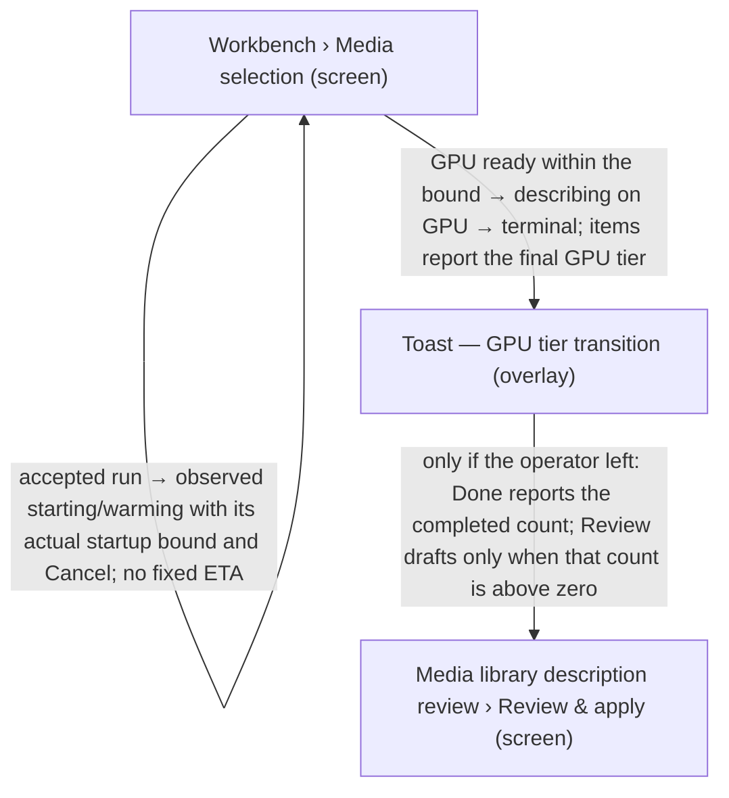
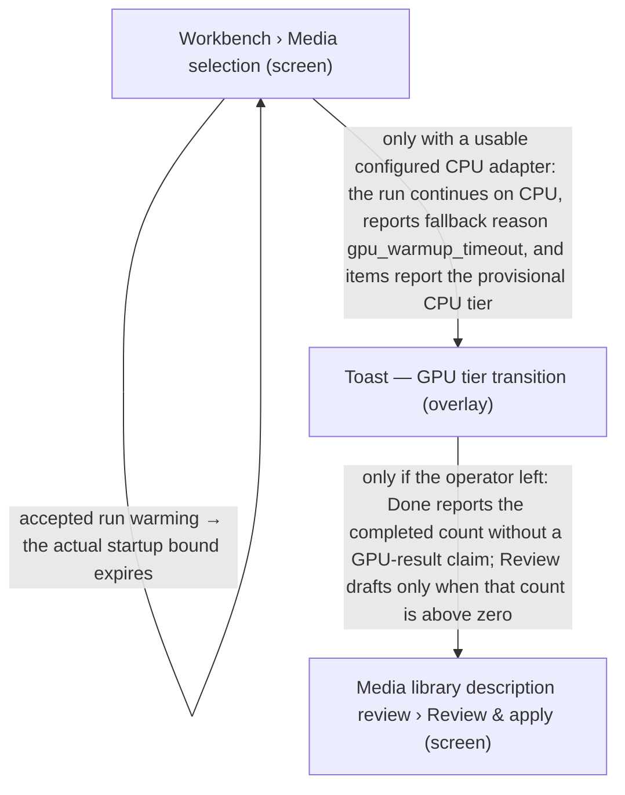
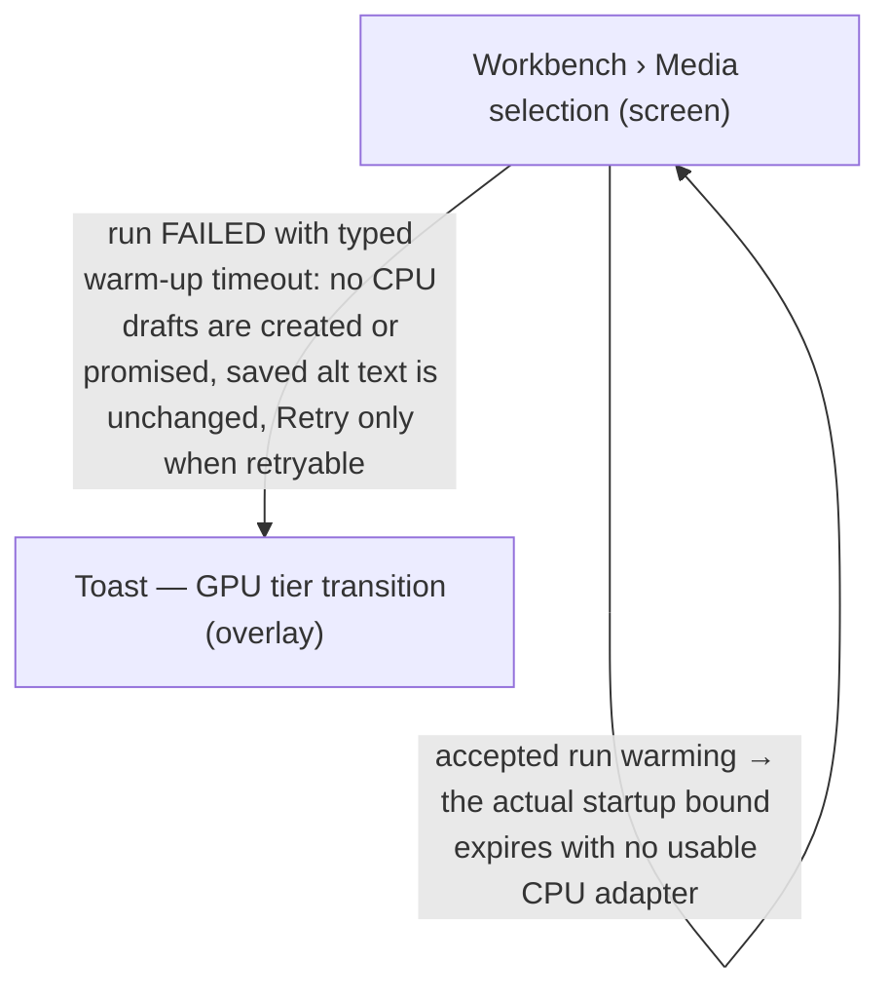
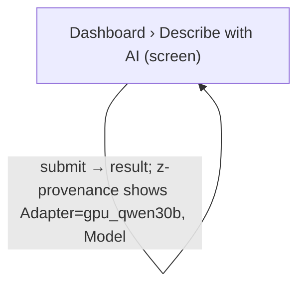
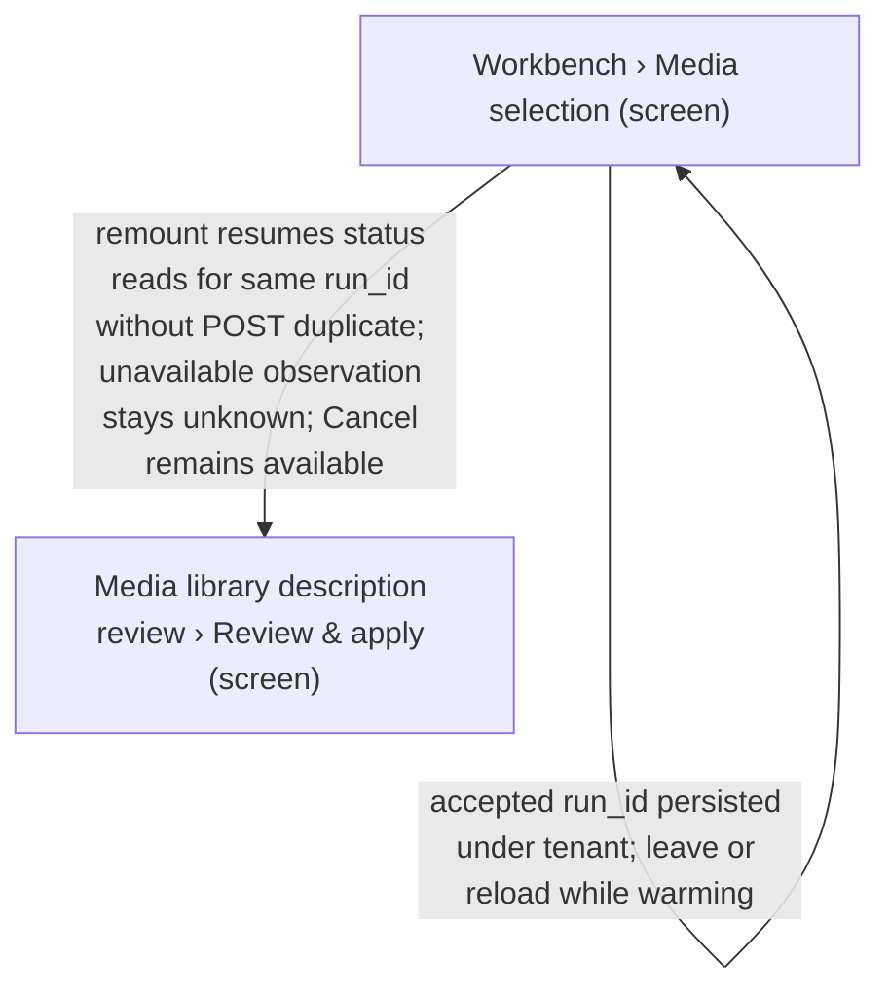

# UX Map — describe-gpu-tier

**Product:** `alt-context WP plugin admin SPA — describe run GPU tier + lifecycle state`
**Source fixture:** `apps/prototype-wp-alt-context/js/admin/pages/workbench/QueueDraftCell.tsx`

## Goals
- UXREC-1 target contract (proposed; not current source): unknown or stale GPU observation, an accepted warming or running run, and a genuine run failure are separate states. GPU status carries no configuration or capability field, so no surface infers configuration or CPU capability from unknown telemetry ([HAI-05] Imperceptible AI is not ethical, Human-Centered AI). Code references are anchors, not implementation claims.
- An accepted run exposes its observed startup state, its actual startup bound, Cancel and return-to-run ([INT-10] Status–predict–stop, Human-Centered AI); historical cold-start measurements are not a current ETA.
- Three outcomes stay distinct: GPU success (items report the final GPU tier); CPU completion after a warm-up timeout, only when a usable CPU adapter is configured (the run reports fallback reason gpu_warmup_timeout and items report the provisional CPU tier); typed warm-up failure with no CPU (FAILED terminal gpu_warmup_timeout, Retry only when retryable, no drafts). There is no automatic CPU-to-GPU draft upgrade, and draft review exists only when the run reports completed items.
- Visible copy fix: the warming and degraded toasts (GPU_STATE_VOCABULARY warmingToast and degradedToast, emitted by useGpuStateToasts) name only the observed GPU state and never claim CPU drafts without returned evidence. Canonical state labels, dormant unavailable-toast suppression, real results and their review actions, and genuine failure, cancel and retry stay. Editing the unused gpuStateNotice / notReportedNotice helper is cleanup, not the visible fix.
- endpoint_unconfigured copy belongs only where an actual unavailable envelope with that reason is received: the shared unavailable-reason copy table and its existing consumers (Settings GPU control and Retention, mapped elsewhere). The bulk describe-run submit returns no such envelope, and unknown or stale status telemetry never shows configuration copy; a status-contract configuration field is a separate backend task.
- Before Describe, disclose possible GPU warm-up and infrastructure charges separately from credits, with a Settings link (INT-07, NAV-11). Read failures retain saved rows and apply recovery, show a stale notice, and offer a read-only Retry (INT-10).

## Jobs
- `bulk-describe` — Describe selected media with AI and apply results
- `single-describe` — Describe one image from the dashboard panel
- `gpu-tier-awareness` — Know which tier produced a description and what it will cost/take

## Code references
- `screen:workbench-media-selection` — `apps/prototype-wp-alt-context/js/admin/pages/workbench/MediaSelection.tsx`
- `screen:describe-run-apply` — `apps/prototype-wp-alt-context/js/admin/pages/workbench/QueueDraftCell.tsx`
- `screen:dashboard-describe-panel` — `apps/prototype-wp-alt-context/js/admin/pages/dashboard/DescribePanel.tsx`
- `screen:toast-gpu-transition` — `apps/prototype-wp-alt-context/js/admin/context/ToastContext.tsx`

## Screens
| id | kind | route | title |
| --- | --- | --- | --- |
| `workbench-media-selection` | screen | `#/workbench` | Workbench › Media selection |
| `describe-run-apply` | screen | `#/workbench?hasDraft=1&run=<id>` | Media library description review › Review & apply |
| `dashboard-describe-panel` | screen | `#/` | Dashboard › Describe with AI |
| `toast-gpu-transition` | overlay | `#/workbench (transient toast; no dedicated route)` | Toast — GPU tier transition |

### Workbench › Media selection (`workbench-media-selection`)

Purpose: Select media and describe. UXREC-1 proposed quiet unknown copy: GPU tier not reported; description readiness is unconfirmed; no idle failure toast. Existing tenant-scoped operation storage resumes an accepted run_id on remount without resubmission; this is source behavior, runtime acceptance pending.

url_params: `run_id`

| zone id | label | role | states |
| --- | --- | --- | --- |
| `z-bulk-cta` | Describe selected; selection and service readiness are separate. Unknown GPU copy makes no CPU or configuration claim and does not disable an otherwise legal submission; no new readiness API. | job | default, loading, empty |
| `z-bulk-progress` | Accepted run only: starting, warming or running with observed state, actual startup bound, Cancel and return-to-run. Terminal captions stay distinct: GPU success; CPU completion after warm-up timeout (reported fallback reason, provisional CPU items); typed warm-up failure with no drafts and Retry only when retryable. Cancelled and other failures keep their existing outcomes. | status | default, loading, error, degraded |
| `z-gpu-tier-chip` | GPU observation is not description readiness: unknown stays quiet with neutral copy; starting, warming, ready and degraded never certify results or CPU capability; canonical state labels are unchanged. | status | default, loading, empty, degraded |
| `z-review-link` | Review & apply drafts link — only for a terminal run that reports completed items, linking #/workbench?hasDraft=1&run=<id>; absent after a failure that returned no drafts; shows the reported item tier and never promises an upgrade. | nav | default, empty, degraded |
| `z-recovery-envelope` | Recovery contract: read-only status retry does not restart inference; remount resumes stored tenant run_id; cancellation acknowledgement ends pending state; rejected persistence remains visible. | status | default, loading, empty, error, degraded |

```
+------------------------------------------------------------+
| Workbench › Media selection  [screen]  #/workbench         |
| Select media and describe. UXREC-1 proposed quiet unknown\ |
|    copy: GPU tier not reported; description readiness is \ |
|   unconfirmed; no idle failure toast. Existing tenant-sco\ |
|   ped operation storage resumes an accepted run_id on rem\ |
|   ount without resubmission; this is source behavior, run\ |
|   time acceptance pending.                                 |
+------------------------------------------------------------+
| ZONES                                                      |
|   - Describe selected; selection and service readiness ar\ |
|   e separate. Unknown GPU copy makes no CPU or configurat\ |
|   ion claim and does not disable an otherwise legal submi\ |
|   ssion; no new readiness API. (job) states=[default,load\ |
|   ing,empty]                                               |
|   - Accepted run only: starting, warming or running with \ |
|   observed state, actual startup bound, Cancel and return\ |
|   -to-run. Terminal captions stay distinct: GPU success; \ |
|   CPU completion after warm-up timeout (reported fallback\ |
|    reason, provisional CPU items); typed warm-up failure \ |
|   with no drafts and Retry only when retryable. Cancelled\ |
|    and other failures keep their existing outcomes. (stat\ |
|   us) states=[default,loading,error,degraded]              |
|   - GPU observation is not description readiness: unknown\ |
|    stays quiet with neutral copy; starting, warming, read\ |
|   y and degraded never certify results or CPU capability;\ |
|    canonical state labels are unchanged. (status) states=\ |
|   [default,loading,empty,degraded]                         |
|   - Review & apply drafts link — only for a terminal run \ |
|   that reports completed items, linking #/workbench?hasDr\ |
|   aft=1&run=<id>; absent after a failure that returned no\ |
|    drafts; shows the reported item tier and never promise\ |
|   s an upgrade. (nav) states=[default,empty,degraded]      |
|   - Recovery contract: read-only status retry does not re\ |
|   start inference; remount resumes stored tenant run_id; \ |
|   cancellation acknowledgement ends pending state; reject\ |
|   ed persistence remains visible. (status) states=[defaul\ |
|   t,loading,empty,error,degraded]                          |
+------------------------------------------------------------+
| ACTIONS                                                    |
|   [PRIMARY] Describe N selected -> POST describe/run (cos\ |
|   tly,preview)                                             |
|   [secondary] Cancel run -> POST describe/run/:id/cancel   |
|   [secondary] Review returned drafts (only when the run r\ |
|   eports completed items) -> navigate describe-run-apply   |
|   [secondary] Retry -> refetch run status                  |
+------------------------------------------------------------+
| states: default | loading | empty | error | degraded       |
+------------------------------------------------------------+
```

### Media library description review › Review & apply (`describe-run-apply`)

Purpose: Review, edit and explicitly approve each image draft beside saved alt text. The run query parameter previews that run; the visible version chooser selects previous descriptions. Loading = loading; no drafts = empty; unavailable history = error or degraded. No selection saves automatically. Serves job `gpu-tier-awareness`.

url_params: `run`

| zone id | label | role | states |
| --- | --- | --- | --- |
| `z-item-tier-badge` | Per-image draft and saved-alt distinction, with version run/time provenance. Shows the reported item tier (final GPU or provisional CPU) and naming provenance from the existing result API; never infers a tier from run failure or GPU state. | status | default, error, degraded |
| `z-upgrade-notice` | No upgrade notice: provisional CPU drafts stay as returned; there is no automatic CPU-to-GPU upgrade, and any GPU result comes only from a later, explicitly started run. GPU readiness never promises final descriptions. | status | default, loading, empty |

```
+------------------------------------------------------------+
| Media library description review › Review & apply  [scree\ |
|   n]  #/workbench?hasDraft=1&run=<id>                      |
| Review, edit and explicitly approve each image draft besi\ |
|   de saved alt text. The run query parameter previews tha\ |
|   t run; the visible version chooser selects previous des\ |
|   criptions. Loading = loading; no drafts = empty; unavai\ |
|   lable history = error or degraded. No selection saves a\ |
|   utomatically. Serves job `gpu-tier-awareness`.           |
+------------------------------------------------------------+
| ZONES                                                      |
|   - Per-image draft and saved-alt distinction, with versi\ |
|   on run/time provenance. Shows the reported item tier (f\ |
|   inal GPU or provisional CPU) and naming provenance from\ |
|    the existing result API; never infers a tier from run \ |
|   failure or GPU state. (status) states=[default,error,de\ |
|   graded]                                                  |
|   - No upgrade notice: provisional CPU drafts stay as ret\ |
|   urned; there is no automatic CPU-to-GPU upgrade, and an\ |
|   y GPU result comes only from a later, explicitly starte\ |
|   d run. GPU readiness never promises final descriptions.\ |
|    (status) states=[default,loading,empty]                 |
+------------------------------------------------------------+
| ACTIONS                                                    |
|   [PRIMARY] Accept draft -> POST description/correct for \ |
|   one media item (preview)                                 |
+------------------------------------------------------------+
| states: default | loading | empty | error | degraded       |
+------------------------------------------------------------+
```

### Dashboard › Describe with AI (`dashboard-describe-panel`)

Purpose: Single-image describe; shows adapter/model provenance. Run phases: result = default; submitting = loading. Serves job `single-describe`.

| zone id | label | role | states |
| --- | --- | --- | --- |
| `z-provenance` | Provenance (Adapter / Model / Source / Latency) — State vocabulary: gpu and seeded = default; cpu (provisional tier) = degraded. | ai_review | default, degraded |
| `z-inline-error` | Inline error (role=alert) — State vocabulary: hidden = empty; generic = error; gpu-unreachable = offline. | status | empty, error, offline |

```
+------------------------------------------------------------+
| Dashboard › Describe with AI  [screen]  #/                 |
| Single-image describe; shows adapter/model provenance. Ru\ |
|   n phases: result = default; submitting = loading. Serve\ |
|   s job `single-describe`.                                 |
+------------------------------------------------------------+
| ZONES                                                      |
|   - Provenance (Adapter / Model / Source / Latency) — Sta\ |
|   te vocabulary: gpu and seeded = default; cpu (provision\ |
|   al tier) = degraded. (ai_review) states=[default,degrad\ |
|   ed]                                                      |
|   - Inline error (role=alert) — State vocabulary: hidden \ |
|   = empty; generic = error; gpu-unreachable = offline. (s\ |
|   tatus) states=[empty,error,offline]                      |
+------------------------------------------------------------+
| ACTIONS                                                    |
|   [PRIMARY] Describe with AI -> POST scene/describe (cost\ |
|   ly)                                                      |
+------------------------------------------------------------+
| states: default | loading | error                          |
+------------------------------------------------------------+
```

### Toast — GPU tier transition (`toast-gpu-transition`)

Purpose: Preserve source suppression of dormant GPU_STATUS_UNAVAILABLE when runId is null; genuine in-run failures and actual completion remain meaningful feedback. UXREC-1 visible fix: the warming and degraded toasts name only the observed GPU state and never claim CPU drafts; no per-poll notices.

| zone id | label | role | states |
| --- | --- | --- | --- |
| `z-toast-body` | Toast body — info and success = default; error = error. Done reports the actual completed count and offers Review drafts only when that count is above zero; failure names its typed cause, with Retry only when retryable. | status | default, error |

```
+------------------------------------------------------------+
| Toast — GPU tier transition  [overlay]  #/workbench (tran\ |
|   sient toast; no dedicated route)                         |
| Preserve source suppression of dormant GPU_STATUS_UNAVAIL\ |
|   ABLE when runId is null; genuine in-run failures and ac\ |
|   tual completion remain meaningful feedback. UXREC-1 vis\ |
|   ible fix: the warming and degraded toasts name only the\ |
|    observed GPU state and never claim CPU drafts; no per-\ |
|   poll notices.                                            |
+------------------------------------------------------------+
| ZONES                                                      |
|   - Toast body — info and success = default; error = erro\ |
|   r. Done reports the actual completed count and offers R\ |
|   eview drafts only when that count is above zero; failur\ |
|   e names its typed cause, with Retry only when retryable\ |
|   . (status) states=[default,error]                        |
+------------------------------------------------------------+
| ACTIONS                                                    |
|   [tertiary] Dismiss -> toast                              |
+------------------------------------------------------------+
| states: default | error | degraded                         |
+------------------------------------------------------------+
```

## Actions

| id | verb | target | hierarchy | costly | irreversible | preview required | screen id |
| --- | --- | --- | --- | --- | --- | --- | --- |
| `start-bulk-describe` | Describe N selected | `POST describe/run` | primary | yes | no | yes | `workbench-media-selection` |
| `cancel-run` | Cancel run | `POST describe/run/:id/cancel` | secondary | no | no | no | `workbench-media-selection` |
| `keep-provisional` | Review returned drafts (only when the run reports completed items) | `navigate describe-run-apply` | secondary | no | no | no | `workbench-media-selection` |
| `retry-polling` | Retry | `refetch run status` | secondary | no | no | no | `workbench-media-selection` |
| `apply-descriptions` | Accept draft | `POST description/correct for one media item` | primary | no | no | yes | `describe-run-apply` |
| `describe-single` | Describe with AI | `POST scene/describe` | primary | yes | no | no | `dashboard-describe-panel` |
| `dismiss-toast` | Dismiss | `toast` | tertiary | no | no | no | `toast-gpu-transition` |

## Flows
### GPU success: cold GPU becomes ready within the startup bound (`bulk-describe-cold-gpu`)

```
flow: GPU success: cold GPU becomes ready within the startup \
  bound (bulk-describe-cold-gpu) job=bulk-describe
  1. Workbench › Media selection [workbench-media-selection]
     --select → readiness/cost preview; unknown GPU observati\
  on is not a CPU or configuration claim-->
  2. Workbench › Media selection [workbench-media-selection] \
  (visit 2)
     --accepted run → observed starting/warming with its actu\
  al startup bound and Cancel; no fixed ETA-->
  3. Workbench › Media selection [workbench-media-selection] \
  (visit 3)
     --GPU ready within the bound → describing on GPU → termi\
  nal; items report the final GPU tier-->
  4. Toast — GPU tier transition [toast-gpu-transition]
     --only if the operator left: Done reports the completed \
  count; Review drafts only when that count is above zero-->
  5. Media library description review › Review & apply [descr\
  ibe-run-apply]
```


```mermaid
flowchart TD
  %% flow: GPU success: cold GPU becomes ready within the startup bound job=bulk-describe
  %% steps: [{"screen_id":"workbench-media-selection","branch_label":"select → readiness/cost preview; unknown GPU observation is not a CPU or configuration claim"},{"screen_id":"workbench-media-selection","branch_label":"accepted run → observed starting/warming with its actual startup bound and Cancel; no fixed ETA"},{"screen_id":"workbench-media-selection","branch_label":"GPU ready within the bound → describing on GPU → terminal; items report the final GPU tier"},{"screen_id":"toast-gpu-transition","branch_label":"only if the operator left: Done reports the completed count; Review drafts only when that count is above zero"},{"screen_id":"describe-run-apply","branch_label":"Review each returned draft, preview an earlier version, edit or explicitly accept; saved alt text changes only on approval"}]
  n_workbench_media_selection["Workbench › Media selection (screen)"]
  n_workbench_media_selection -->|select → readiness/cost preview; unknown GPU observation is not a CPU or configuration claim| n_workbench_media_selection
  n_workbench_media_selection -->|accepted run → observed starting/warming with its actual startup bound and Cancel; no fixed ETA| n_workbench_media_selection
  n_toast_gpu_transition["Toast — GPU tier transition (overlay)"]
  n_workbench_media_selection -->|GPU ready within the bound → describing on GPU → terminal; items report the final GPU tier| n_toast_gpu_transition
  n_describe_run_apply["Media library description review › Review &amp; apply (screen)"]
  n_toast_gpu_transition -->|only if the operator left: Done reports the completed count; Review drafts only when that count is above zero| n_describe_run_apply
```

### Conditional CPU completion: warm-up times out and a usable CPU adapter is configured (`bulk-describe-warmup-cpu-completion`)

```
flow: Conditional CPU completion: warm-up times out and a usa\
  ble CPU adapter is configured (bulk-describe-warmup-cpu-com\
  pletion) job=bulk-describe
  1. Workbench › Media selection [workbench-media-selection]
     --accepted run warming → the actual startup bound expire\
  s-->
  2. Workbench › Media selection [workbench-media-selection] \
  (visit 2)
     --only with a usable configured CPU adapter: the run con\
  tinues on CPU, reports fallback reason gpu_warmup_timeout, \
  and items report the provisional CPU tier-->
  3. Toast — GPU tier transition [toast-gpu-transition]
     --only if the operator left: Done reports the completed \
  count without a GPU-result claim; Review drafts only when t\
  hat count is above zero-->
  4. Media library description review › Review & apply [descr\
  ibe-run-apply]
```


```mermaid
flowchart TD
  %% flow: Conditional CPU completion: warm-up times out and a usable CPU adapter is configured job=bulk-describe
  %% steps: [{"screen_id":"workbench-media-selection","branch_label":"accepted run warming → the actual startup bound expires"},{"screen_id":"workbench-media-selection","branch_label":"only with a usable configured CPU adapter: the run continues on CPU, reports fallback reason gpu_warmup_timeout, and items report the provisional CPU tier"},{"screen_id":"toast-gpu-transition","branch_label":"only if the operator left: Done reports the completed count without a GPU-result claim; Review drafts only when that count is above zero"},{"screen_id":"describe-run-apply","branch_label":"review provisional CPU drafts as returned; no automatic GPU upgrade; acceptance stays explicit"}]
  n_workbench_media_selection["Workbench › Media selection (screen)"]
  n_workbench_media_selection -->|accepted run warming → the actual startup bound expires| n_workbench_media_selection
  n_toast_gpu_transition["Toast — GPU tier transition (overlay)"]
  n_workbench_media_selection -->|only with a usable configured CPU adapter: the run continues on CPU, reports fallback reason gpu_warmup_timeout, and items report the provisional CPU tier| n_toast_gpu_transition
  n_describe_run_apply["Media library description review › Review &amp; apply (screen)"]
  n_toast_gpu_transition -->|only if the operator left: Done reports the completed count without a GPU-result claim; Review drafts only when that count is above zero| n_describe_run_apply
```

### Typed failure without CPU: warm-up times out and no usable CPU adapter exists (`bulk-describe-warmup-failure-no-cpu`)

```
flow: Typed failure without CPU: warm-up times out and no usa\
  ble CPU adapter exists (bulk-describe-warmup-failure-no-cpu\
  ) job=bulk-describe
  1. Workbench › Media selection [workbench-media-selection]
     --accepted run warming → the actual startup bound expire\
  s with no usable CPU adapter-->
  2. Workbench › Media selection [workbench-media-selection] \
  (visit 2)
     --run FAILED with typed warm-up timeout: no CPU drafts a\
  re created or promised, saved alt text is unchanged, Retry \
  only when retryable-->
  3. Toast — GPU tier transition [toast-gpu-transition]
```


```mermaid
flowchart TD
  %% flow: Typed failure without CPU: warm-up times out and no usable CPU adapter exists job=bulk-describe
  %% steps: [{"screen_id":"workbench-media-selection","branch_label":"accepted run warming → the actual startup bound expires with no usable CPU adapter"},{"screen_id":"workbench-media-selection","branch_label":"run FAILED with typed warm-up timeout: no CPU drafts are created or promised, saved alt text is unchanged, Retry only when retryable"},{"screen_id":"toast-gpu-transition","branch_label":"only if the operator left: the failure toast names the warm-up timeout, with Retry only when retryable; no draft review"}]
  n_workbench_media_selection["Workbench › Media selection (screen)"]
  n_workbench_media_selection -->|accepted run warming → the actual startup bound expires with no usable CPU adapter| n_workbench_media_selection
  n_toast_gpu_transition["Toast — GPU tier transition (overlay)"]
  n_workbench_media_selection -->|run FAILED with typed warm-up timeout: no CPU drafts are created or promised, saved alt text is unchanged, Retry only when retryable| n_toast_gpu_transition
```

### Dashboard single describe on GPU tier (`single-describe-gpu`)

```
flow: Dashboard single describe on GPU tier (single-describe-\
  gpu) job=single-describe
  1. Dashboard › Describe with AI [dashboard-describe-panel]
     --submit → result; z-provenance shows Adapter=gpu_qwen30\
  b, Model-->
  2. Dashboard › Describe with AI [dashboard-describe-panel] \
  (visit 2)
```


```mermaid
flowchart TD
  %% flow: Dashboard single describe on GPU tier job=single-describe
  %% steps: [{"screen_id":"dashboard-describe-panel","branch_label":"submit → result; z-provenance shows Adapter=gpu_qwen30b, Model"},{"screen_id":"dashboard-describe-panel","branch_label":"GPU stopped → z-inline-error gpu-unreachable names the state + what to do"}]
  n_dashboard_describe_panel["Dashboard › Describe with AI (screen)"]
  n_dashboard_describe_panel -->|submit → result; z-provenance shows Adapter=gpu_qwen30b, Model| n_dashboard_describe_panel
```

### Source persistence regression: navigation and reload (`uxrec-remount-recovery`)

```
flow: Source persistence regression: navigation and reload (u\
  xrec-remount-recovery) job=bulk-describe
  1. Workbench › Media selection [workbench-media-selection]
     --accepted run_id persisted under tenant; leave or reloa\
  d while warming-->
  2. Workbench › Media selection [workbench-media-selection] \
  (visit 2)
     --remount resumes status reads for same run_id without P\
  OST duplicate; unavailable observation stays unknown; Cance\
  l remains available-->
  3. Media library description review › Review & apply [descr\
  ibe-run-apply]
```


```mermaid
flowchart TD
  %% flow: Source persistence regression: navigation and reload job=bulk-describe
  %% steps: [{"screen_id":"workbench-media-selection","branch_label":"accepted run_id persisted under tenant; leave or reload while warming"},{"screen_id":"workbench-media-selection","branch_label":"remount resumes status reads for same run_id without POST duplicate; unavailable observation stays unknown; Cancel remains available"},{"screen_id":"describe-run-apply","branch_label":"only when the resumed run reports completed items: those returned drafts become reviewable; acceptance is explicit, never automatic"}]
  n_workbench_media_selection["Workbench › Media selection (screen)"]
  n_workbench_media_selection -->|accepted run_id persisted under tenant; leave or reload while warming| n_workbench_media_selection
  n_describe_run_apply["Media library description review › Review &amp; apply (screen)"]
  n_workbench_media_selection -->|remount resumes status reads for same run_id without POST duplicate; unavailable observation stays unknown; Cancel remains available| n_describe_run_apply
```

## Open questions
- Should the WP operator ever get an explicit 'Start GPU' / 'Stop GPU' control (HAI-04 activate–operate–override), or is warm-on-enqueue + idle reap the only lifecycle (DEMO-UX-1-GPU-01 proposes enqueue-triggered start)? Current recommendation: no manual control in the plugin; CTA discloses the cost and lifecycle is implicit.
- gpu_state source of truth: lifecycle reaper writes /run/acx/gpu-state.json vs API probes ACX_GPU_ENDPOINT_URL/health. One writer only (DATA-14).
- Toast when the operator IS on the progress screen: suppress (double announcement with the polite live region, A11Y-21) — confirm with a screen-reader pass.
- UXREC-1: no runtime window granted. Validate starting/results and remount on exact deployment separately; API health and recognition policy do not establish description readiness. No new GPU controls in this slice.

## Parity index

Machine-checked by `js/admin/__tests__/uxmap-parity.test.ts` and
`js/admin/__tests__/uxmap-render-parity.test.ts`: every id, state, and verbatim label
below must exist in the sibling `.uxmap.json`, and no `z-*`/`act-*` id may appear here
that the JSON does not define. Regenerate with `docs/ux-maps/render_ux_maps.py` — never
hand-edit one side.

Zone ids: z-bulk-cta z-bulk-progress z-gpu-tier-chip z-review-link z-recovery-envelope z-item-tier-badge z-upgrade-notice z-provenance z-inline-error z-toast-body

Action ids: start-bulk-describe cancel-run keep-provisional retry-polling apply-descriptions describe-single dismiss-toast

Zone labels (verbatim; the tables above escape `|` for markdown, this list does not):

- Describe selected; selection and service readiness are separate. Unknown GPU copy makes no CPU or configuration claim and does not disable an otherwise legal submission; no new readiness API.
- Accepted run only: starting, warming or running with observed state, actual startup bound, Cancel and return-to-run. Terminal captions stay distinct: GPU success; CPU completion after warm-up timeout (reported fallback reason, provisional CPU items); typed warm-up failure with no drafts and Retry only when retryable. Cancelled and other failures keep their existing outcomes.
- GPU observation is not description readiness: unknown stays quiet with neutral copy; starting, warming, ready and degraded never certify results or CPU capability; canonical state labels are unchanged.
- Review & apply drafts link — only for a terminal run that reports completed items, linking #/workbench?hasDraft=1&run=<id>; absent after a failure that returned no drafts; shows the reported item tier and never promises an upgrade.
- Recovery contract: read-only status retry does not restart inference; remount resumes stored tenant run_id; cancellation acknowledgement ends pending state; rejected persistence remains visible.
- Per-image draft and saved-alt distinction, with version run/time provenance. Shows the reported item tier (final GPU or provisional CPU) and naming provenance from the existing result API; never infers a tier from run failure or GPU state.
- No upgrade notice: provisional CPU drafts stay as returned; there is no automatic CPU-to-GPU upgrade, and any GPU result comes only from a later, explicitly started run. GPU readiness never promises final descriptions.
- Provenance (Adapter / Model / Source / Latency) — State vocabulary: gpu and seeded = default; cpu (provisional tier) = degraded.
- Inline error (role=alert) — State vocabulary: hidden = empty; generic = error; gpu-unreachable = offline.
- Toast body — info and success = default; error = error. Done reports the actual completed count and offers Review drafts only when that count is above zero; failure names its typed cause, with Retry only when retryable.

States (all zones and screens): default loading empty error degraded offline

## Not doing
- No confirm tab / modal before bulk describe (workbench not-doing inherited); cost disclosure lives in the CTA label + CTA hint.
- No per-poll toasts; no toast for provisional→final per item.
- No GPU cost meter in the plugin (billing is operator-side, OCI).
- No automatic CPU-to-GPU draft upgrade, and no CPU-continuation promise from unknown, stale or degraded GPU state.
- No backend status schema or configuration/capability field, GPU automation, authorization bypass, billing or credential change; operator-tenant GPU authorization and id path-segment encoding stay unchanged.
