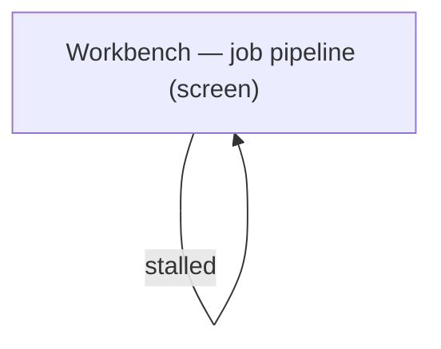
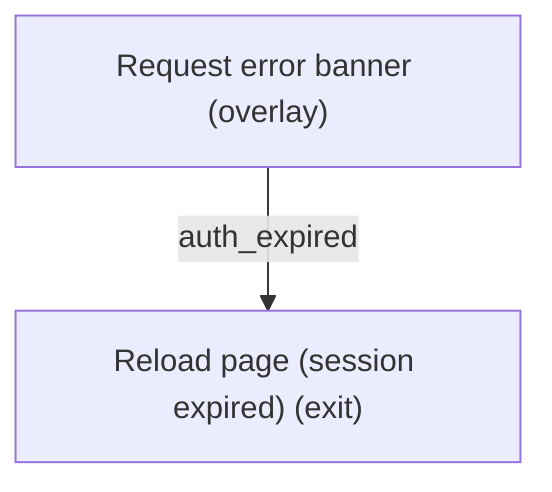
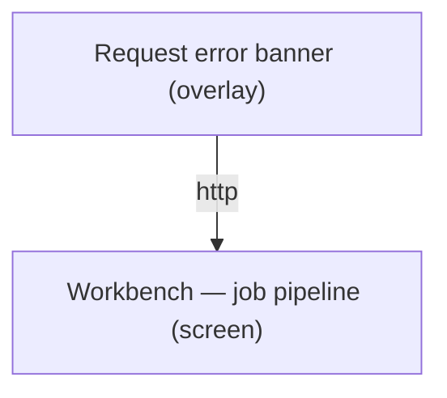

# UX Map — febt-1-job-error-states

**Product:** `AltContext WP admin SPA — job pipeline error and progress states`
**Source fixture:** `apps/prototype-wp-alt-context/docs/ux-maps/workbench-operator-loop.uxmap.json`

## Goals
- Every request failure the operator can see maps to exactly one AppError tag and one recovery action.
- Job progress states are the reducer's states, not derived ad hoc in components.
- Keep stalled and offline as peer reducer states with distinct recoveries: stalled advances a bounded reconnect timer, while offline waits for the browser online event; the canonical UX states are degraded and offline respectively (FEBT1F-L-02, F3/W2D-01).
- Keep the pipeline banner sourced from useJobStateMachineDerivedState.statusText through JobPipelineProvider, WorkbenchProvider, and WorkbenchPage.

## Jobs
- `run-job` — Start a scan/describe job and watch it finish
- `recover-from-failure` — Understand why a job or request failed and recover

## Screens
| id | kind | route | title |
| --- | --- | --- | --- |
| `workbench-pipeline` | screen | `/admin.php?page=alt-context-workbench` | Workbench — job pipeline |
| `request-error-banner` | overlay | `/admin.php?page=alt-context-workbench` | Request error banner |
| `reload-page` | exit | `/admin.php?page=alt-context-workbench` | Reload page (session expired) |

### Workbench — job pipeline (`workbench-pipeline`)

Purpose: Shows the active job's phase, progress, ETA and stall state driven by jobReducer state.

| zone id | label | role | states |
| --- | --- | --- | --- |
| `pipeline-banner` | Pipeline status banner — reducer phase to canonical UX state: idle and completed = default; pending and running = loading; failed = error; offline = offline; stalled and completed_with_errors = degraded. Each reducer phase keeps its own copy and recovery. | status | default, loading, error, offline, degraded |
| `progress-meter` | Progress + ETA — running = loading with live progress; stalled = degraded with elapsed no-progress time and reconnect status. | status | loading, degraded |
| `job-actions` | Start / cancel / retry — idle and completed = default; running = loading; failed = error; completed_with_errors = degraded. | form | default, loading, error, degraded |

```
+------------------------------------------------------------+
| Workbench — job pipeline  [screen]  /admin.php?page=alt-c… |
| Shows the active job's phase, progress, ETA and stall sta… |
+------------------------------------------------------------+
| ZONES                                                      |
|   - Pipeline status banner — reducer phase to canonical U… |
|   - Progress + ETA — running = loading with live progress… |
|   - Start / cancel / retry — idle and completed = default… |
+------------------------------------------------------------+
| ACTIONS                                                    |
|   [PRIMARY] Start job -> workbench-pipeline (costly)       |
|   [secondary] Cancel job -> workbench-pipeline (irreversi… |
+------------------------------------------------------------+
| states: default | loading | error | offline | degraded     |
+------------------------------------------------------------+
```

### Request error banner (`request-error-banner`)

Purpose: One banner per AppError tag with tag-specific copy and recovery; raw messages never reach the DOM. Canonical UX state does not erase the tag: http, parse, auth_expired, nonce_refresh, timeout and unknown are error; transport is offline; abort is default because its frozen poll is silent; an http cooldown (429, or 503 with Retry-After) is degraded while it waits to auto-retry.

| zone id | label | role | states |
| --- | --- | --- | --- |
| `error-copy` | User-facing copy by AppError tag — http: status-aware safe copy; parse: unexpected response; auth_expired: session expired; nonce_refresh and transport: check connection; timeout: server took too long; unknown: caller fallback; abort: silent frozen poll. Cooldown remains the http tag plus isCooldown and Retry-After, never a ninth tag. | content | default, error, offline, degraded |
| `error-action` | Recovery by AppError tag — Retry: http, parse, nonce_refresh, transport, timeout and unknown; Reload page: auth_expired only; no banner or action: abort; Wait countdown then auto-retry: http cooldown. Retry and Reload are tag-specific primary actions; Wait is subordinate, and exactly one tag-appropriate recovery renders. | form | error, offline, degraded |

```
+------------------------------------------------------------+
| Request error banner  [overlay]  /admin.php?page=alt-cont… |
| One banner per AppError tag with tag-specific copy and re… |
+------------------------------------------------------------+
| ZONES                                                      |
|   - User-facing copy by AppError tag — http: status-aware… |
|   - Recovery by AppError tag — Retry: http, parse, nonce_… |
+------------------------------------------------------------+
| ACTIONS                                                    |
|   [PRIMARY] Retry -> request-error-banner                  |
|   [PRIMARY] Reload page -> reload-page                     |
|   [secondary] Wait (countdown) -> request-error-banner     |
+------------------------------------------------------------+
| states: default | error | offline | degraded               |
+------------------------------------------------------------+
```

### Reload page (session expired) (`reload-page`)

Purpose: Only exit from auth_expired; WordPress login handles the rest.

```
+------------------------------------------------------------+
| Reload page (session expired)  [exit]  /admin.php?page=al… |
| Only exit from auth_expired; WordPress login handles the … |
+------------------------------------------------------------+
```

## Detailed reducer and recovery contract

### Pipeline banner examples

```text
idle      : "No job running"                         [Start job] (primary)
pending   : "Queued…"                                [Cancel]
running   : "Describing 42/120  ETA 1m 10s"          [Cancel]
stalled   : "No progress for 35 s — reconnecting"     [Cancel]
offline   : "You are offline — will resume"
completed : "Done 120/120"                           [Start job] (primary)
completed_with_errors : "Done, 3 failed"             [Retry failed]
failed    : "Job failed: <toUserMessage>"             [Retry] [Start]
```

### Reducer transition matrix

Every state×event cell is explicit; `never` guards the rest (GRPH-27).

| state \ event | START | STREAM_OPEN | PROGRESS | STALL_TICK | RECONNECTED | OFFLINE | ONLINE | COMPLETE | COMPLETE_WITH_ERRORS | FAIL | CANCEL | RESET |
| --- | --- | --- | --- | --- | --- | --- | --- | --- | --- | --- | --- | --- |
| idle | pending | — | — | — | — | offline | — | — | — | — | — | idle |
| pending | — | running | running | stalled (if quiet >= 30s) else pending | — | offline | — | completed | completed_with_errors | failed | idle | idle |
| running | — | — | running | stalled (if quiet >= 30s) else running | — | offline | — | completed | completed_with_errors | failed | idle | idle |
| stalled | — | running | running | stalled (if attempts <= 3) else failed | running | offline | — | completed | completed_with_errors | failed | idle | idle |
| offline | — | — | — | offline (if attempts <= 3) else failed | — | — | (prev) | — | — | failed | idle | idle |
| completed / completed_with_errors / failed | pending | — | — | — | — | — | — | — | — | — | — | idle |

### AppError banner and recovery rows

`cooldown` and `not_found` are not tags: they are `isCooldown(http)` (429/503 + Retry-After) and `isHttpStatus(http, 404)`. Abort has copy but no recovery action (frozen poll, not a banner).

| AppError tag | Banner example | Recovery |
| --- | --- | --- |
| http | HTTP error (404 auto-dismiss; 429/503 Wait countdown) | Retry |
| parse | Unexpected response from server | Retry |
| auth_expired | Your session expired — reload the page and sign in again. | Reload page |
| nonce_refresh | Network error — check your connection | Retry; refresh timeout/transport is not expiry |
| abort | Silent frozen poll; no banner | No action |
| timeout | The server took too long to respond — try again | Retry |
| transport | Network error — check your connection | Retry |
| unknown | Caller fallback copy | Retry |

### Stalled/offline reconciliation

The reducer keeps `stalled` and `offline` as peer states because their recoveries differ: stalled advances a bounded reconnect timer, while offline waits for the browser `online` event. The hook derives the existing view contract from reducer state: `stalledForSeconds = status==='stalled' ? (now-lastEventAt)/1000 : null` and `isOnline = status!=='offline'`.

The reconnect counter is internal (`reconnectAttempts`) and never rendered; the banner shows elapsed stall seconds only. A stalled stream returns to running after SSE reopen or fails after bounded reconnect attempts (RES-06). `timeout` has its own overlay row, `abort` stays silent, and `nonce_refresh` reuses transport copy.

## Actions

| id | verb | target | hierarchy | costly | irreversible | preview required | screen id |
| --- | --- | --- | --- | --- | --- | --- | --- |
| `start-job` | Start job | `workbench-pipeline` | primary | yes | no | no | `workbench-pipeline` |
| `cancel-job` | Cancel job | `workbench-pipeline` | secondary | no | yes | no | `workbench-pipeline` |
| `retry-request` | Retry | `request-error-banner` | primary | no | no | no | `request-error-banner` |
| `reload` | Reload page | `reload-page` | primary | no | no | no | `request-error-banner` |
| `wait-cooldown` | Wait (countdown) | `request-error-banner` | secondary | no | no | no | `request-error-banner` |

## Flows
### idle → pending → running → completed (`job-happy-path`)


### running → stalled (30 s no event) → running (SSE reconnect) or failed (`job-stall-reconnect`)



### 401/403 → auth_expired banner → reload (`auth-expired-recovery`)



### http 429/503 + Retry-After (isCooldown) → wait banner → auto retry (`cooldown-429`)



## Parity index

Machine-checked by `js/admin/__tests__/uxmap-parity.test.ts` and
`js/admin/__tests__/uxmap-render-parity.test.ts`: every id, state, and verbatim label
below must exist in the sibling `.uxmap.json`, and no `z-*`/`act-*` id may appear here
that the JSON does not define. Regenerate with `docs/ux-maps/render_ux_maps.py` — never
hand-edit one side.

Zone ids: pipeline-banner progress-meter job-actions error-copy error-action

Action ids: start-job cancel-job retry-request reload wait-cooldown

Zone labels (verbatim; the tables above escape `|` for markdown, this list does not):

- Pipeline status banner — reducer phase to canonical UX state: idle and completed = default; pending and running = loading; failed = error; offline = offline; stalled and completed_with_errors = degraded. Each reducer phase keeps its own copy and recovery.
- Progress + ETA — running = loading with live progress; stalled = degraded with elapsed no-progress time and reconnect status.
- Start / cancel / retry — idle and completed = default; running = loading; failed = error; completed_with_errors = degraded.
- User-facing copy by AppError tag — http: status-aware safe copy; parse: unexpected response; auth_expired: session expired; nonce_refresh and transport: check connection; timeout: server took too long; unknown: caller fallback; abort: silent frozen poll. Cooldown remains the http tag plus isCooldown and Retry-After, never a ninth tag.
- Recovery by AppError tag — Retry: http, parse, nonce_refresh, transport, timeout and unknown; Reload page: auth_expired only; no banner or action: abort; Wait countdown then auto-retry: http cooldown. Retry and Reload are tag-specific primary actions; Wait is subordinate, and exactly one tag-appropriate recovery renders.

States (all zones and screens): default loading error offline degraded

## Not doing
- new screens
- copy changes
- confirm tab
- toast redesign
