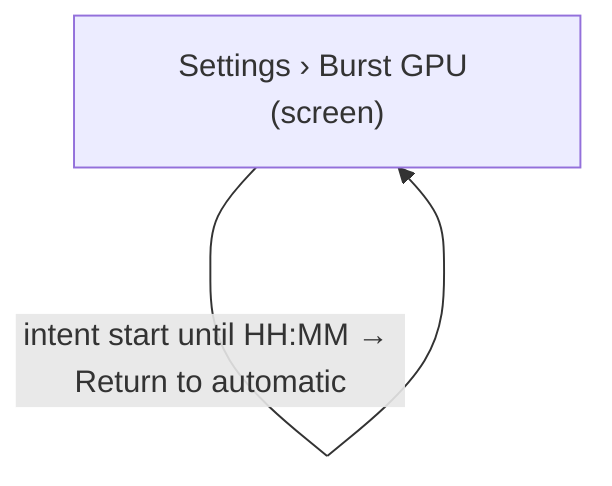

# UX Map — gpu-operator-control

**Product:** `alt-context WP plugin admin SPA — Settings › Burst GPU operator control (start / stop / automatic)`
**Source fixture:** `apps/prototype-wp-alt-context/js/admin/pages/SettingsPage.tsx`

## Goals
- Operator can always see the burst GPU state, the effective intent, the lease expiry and load freshness in one place (INT-10 status–predict–stop, OBS-08 stale is shown as unknown with age).
- Operator can request Start, Stop or Return to automatic; each request is acknowledged within one poll and its outcome (honoured, pending, blocked) is visible (HAI-04 activate–operate–override).
- Cost is disclosed before commitment and the lease cap is named; the user is never surprised by a GPU-hour charge (INT-07, CARD-15, COST-10).
- Stop intent can be requested while busy and shutdown is deferred until idle; the separate hard lease remains a cost backstop. Stale or unknown telemetry blocks Start (INT-10, FLOW-08, A11Y-18).

## Jobs
- `job-prewarm-gpu` — Pre-warm the GPU before a demo so the first describe run is fast
- `job-stop-gpu` — Stop the GPU now to end spend
- `job-return-auto` — Return the GPU to automatic lifecycle

## Screens
| id | kind | route | title |
| --- | --- | --- | --- |
| `settings-burst-gpu` | screen | `#/settings` | Settings › Burst GPU |
| `gpu-start-confirm` | overlay | `#/settings (inline strip; no dedicated route)` | Confirm Start GPU |
| `gpu-stop-confirm` | overlay | `#/settings (inline strip; no dedicated route)` | Confirm Stop GPU |
| `exit-workbench` | exit | `#/workbench` | Workbench |

## Code references
- `screen:settings-burst-gpu` — `apps/prototype-wp-alt-context/js/admin/pages/settings/GpuControlCard.tsx`
- `screen:gpu-start-confirm` — `apps/prototype-wp-alt-context/js/admin/pages/settings/GpuControlCard.tsx`
- `screen:gpu-stop-confirm` — `apps/prototype-wp-alt-context/js/admin/pages/settings/GpuControlCard.tsx`
- `screen:exit-workbench` — `apps/prototype-wp-alt-context/js/admin/pages/workbench/MediaSelection.tsx`

### Settings › Burst GPU (`settings-burst-gpu`)

Purpose: Card on the Settings page showing GPU state, intent, lease and load, with Start / Stop / Return to automatic controls. Domain vocabulary behind the canonical states: stopped and ready = default; starting and warming = loading; snapshot missing = empty; service unreachable = error; lifecycle degraded or intent blocked = degraded.

Action states: stopped, unknown, starting, warming, ready, degraded

| zone id | label | role | states |
| --- | --- | --- | --- |
| `z-gpu-state-chip` | GPU state chip — reuses gpuStatePresentation vocabulary (unknown / stopped / starting / warming / ready / degraded) with snapshot age | status | default, loading, empty, error, degraded |
| `z-gpu-intent` | Effective intent and expiry — automatic / start until HH:MM / stop (pending, blocked: describe run in flight) | status | default, loading, degraded |
| `z-gpu-lease` | Lease countdown — running since, auto-stops by HH:MM (lease cap) | status | default, empty |
| `z-gpu-load` | Describe load — work in flight yes/no with load snapshot freshness | status | default, empty, degraded |
| `z-gpu-cost` | Cost disclosure — hourly rate, warm-up time, lease cap | content | default |
| `z-gpu-controls` | Start GPU / Stop GPU / Return to automatic | form | default, loading, error, degraded |

```
+------------------------------------------------------------+
| Settings › Burst GPU  [screen]  #/settings                 |
| Card on the Settings page showing GPU state, intent, leas… |
+------------------------------------------------------------+
| ZONES                                                      |
|   - GPU state chip — reuses gpuStatePresentation vocabula… |
|   - Effective intent and expiry — automatic / start until… |
|   - Lease countdown — running since, auto-stops by HH:MM … |
|   - Describe load — work in flight yes/no with load snaps… |
|   - Cost disclosure — hourly rate, warm-up time, lease ca… |
|   - Start GPU / Stop GPU / Return to automatic (form) sta… |
+------------------------------------------------------------+
| ACTIONS                                                    |
| when stopped                                               |
|   [PRIMARY] Start GPU                                      |
|   [secondary] Return to automatic                          |
|   [tertiary] Refresh status                                |
| when unknown                                               |
|   [secondary] Return to automatic                          |
|   [tertiary] Refresh status                                |
| when starting                                              |
|   [secondary] Stop GPU                                     |
|   [secondary] Return to automatic                          |
|   [tertiary] Refresh status                                |
| when warming                                               |
|   [secondary] Stop GPU                                     |
|   [secondary] Return to automatic                          |
|   [tertiary] Refresh status                                |
| when ready                                                 |
|   [secondary] Stop GPU                                     |
|   [secondary] Return to automatic                          |
|   [tertiary] Refresh status                                |
|   [secondary] Go to Workbench                              |
| when degraded                                              |
|   [PRIMARY] Start GPU                                      |
|   [secondary] Stop GPU                                     |
|   [secondary] Return to automatic                          |
|   [tertiary] Refresh status                                |
+------------------------------------------------------------+
| states: default | loading | empty | error | degraded       |
+------------------------------------------------------------+
```

### Confirm Start GPU (`gpu-start-confirm`)

Purpose: Inline confirm strip below the controls: names the hourly cost, the warm-up time and the intent TTL after which lifecycle returns to automatic. Stays until confirmed or dismissed.

| zone id | label | role | states |
| --- | --- | --- | --- |
| `z-start-preview` | Start preview — cost per hour, warm-up estimate, auto-return after TTL | content | default |
| `z-start-actions` | Confirm start / Cancel | form | default, loading, error |

```
+------------------------------------------------------------+
| Confirm Start GPU  [overlay]  #/settings (inline strip; n… |
| Inline confirm strip below the controls: names the hourly… |
+------------------------------------------------------------+
| ZONES                                                      |
|   - Start preview — cost per hour, warm-up estimate, auto… |
|   - Confirm start / Cancel (form) states=[default,loading… |
+------------------------------------------------------------+
| ACTIONS                                                    |
|   [PRIMARY] Confirm start -> POST recognition/gpu/intent … |
|   [secondary] Cancel -> settings-burst-gpu                 |
+------------------------------------------------------------+
| states: default | loading | error                          |
+------------------------------------------------------------+
```

### Confirm Stop GPU (`gpu-stop-confirm`)

Purpose: Inline confirm strip: explains that a stop is honoured only when no describe run is in flight, otherwise it is deferred and shown as pending.

| zone id | label | role | states |
| --- | --- | --- | --- |
| `z-stop-preview` | Stop preview — immediate when idle, deferred while a describe run is in flight | content | default, degraded |
| `z-stop-actions` | Confirm stop / Cancel | form | default, loading, error |

```
+------------------------------------------------------------+
| Confirm Stop GPU  [overlay]  #/settings (inline strip; no… |
| Inline confirm strip: explains that a stop is honoured on… |
+------------------------------------------------------------+
| ZONES                                                      |
|   - Stop preview — immediate when idle, deferred while a … |
|   - Confirm stop / Cancel (form) states=[default,loading,… |
+------------------------------------------------------------+
| ACTIONS                                                    |
|   [PRIMARY] Confirm stop -> POST recognition/gpu/intent {… |
+------------------------------------------------------------+
| states: default | loading | error | degraded               |
+------------------------------------------------------------+
```

### Workbench (`exit-workbench`)

Purpose: Go describe media once the GPU is ready

url_params: `run_id`

| zone id | label | role | states |
| --- | --- | --- | --- |
| `z-wb-entry` | Workbench entry | nav | default |

```
+------------------------------------------------------------+
| Workbench  [exit]  #/workbench                             |
| Go describe media once the GPU is ready                    |
+------------------------------------------------------------+
| ZONES                                                      |
|   - Workbench entry (nav) states=[default]                 |
+------------------------------------------------------------+
| states: default                                            |
+------------------------------------------------------------+
```

## Actions

| id | verb | target | hierarchy | costly | irreversible | preview required | screen id | when (recovery state) |
| --- | --- | --- | --- | --- | --- | --- | --- | --- |
| `act-gpu-start` | Start GPU | `gpu-start-confirm` | primary | yes | no | yes | `settings-burst-gpu` | stopped, degraded |
| `act-gpu-confirm-start` | Confirm start | `POST recognition/gpu/intent {action: start}` | primary | yes | no | no | `gpu-start-confirm` | always |
| `act-gpu-stop` | Stop GPU | `gpu-stop-confirm` | secondary | no | no | yes | `settings-burst-gpu` | starting, warming, ready, degraded |
| `act-gpu-confirm-stop` | Confirm stop | `POST recognition/gpu/intent {action: stop}` | primary | no | no | no | `gpu-stop-confirm` | always |
| `act-gpu-auto` | Return to automatic | `POST recognition/gpu/intent {action: auto}` | secondary | no | no | no | `settings-burst-gpu` | always |
| `act-gpu-refresh` | Refresh status | `GET recognition/gpu/status` | tertiary | no | no | no | `settings-burst-gpu` | always |
| `act-cancel-confirm` | Cancel | `settings-burst-gpu` | secondary | no | no | no | `gpu-start-confirm` | always |
| `act-goto-workbench` | Go to Workbench | `exit-workbench` | secondary | no | no | no | `settings-burst-gpu` | ready |

## Flows
### Pre-warm before a demo (`flow-prewarm`)

```mermaid
flowchart TD
  %% flow: Pre-warm before a demo job=job-prewarm-gpu
  %% steps: [{"screen_id":"settings-burst-gpu","branch_label":"state stopped → Start GPU"},{"screen_id":"gpu-start-confirm","branch_label":"preview cost + TTL → Confirm start (202)"},{"screen_id":"settings-burst-gpu","branch_label":"intent start (pending) → starting → warming (bounded ETA) → ready"},{"screen_id":"exit-workbench","branch_label":"Go to Workbench"}]
  n_settings_burst_gpu["Settings › Burst GPU (screen)"]
  n_gpu_start_confirm["Confirm Start GPU (overlay)"]
  n_settings_burst_gpu -->|state stopped → Start GPU| n_gpu_start_confirm
  n_gpu_start_confirm -->|preview cost + TTL → Confirm start (202)| n_settings_burst_gpu
  n_exit_workbench["Workbench (exit)"]
  n_settings_burst_gpu -->|intent start (pending) → starting → warming (bounded ETA) → ready| n_exit_workbench
```

### Stop while a describe run is in flight (`flow-stop-blocked`)

```mermaid
flowchart TD
  %% flow: Stop while a describe run is in flight job=job-stop-gpu
  %% steps: [{"screen_id":"settings-burst-gpu","branch_label":"state ready, load.has_work → Stop GPU disabled with reason"},{"screen_id":"settings-burst-gpu","branch_label":"run finishes → Stop GPU enabled"},{"screen_id":"gpu-stop-confirm","branch_label":"Confirm stop (202)"},{"screen_id":"settings-burst-gpu","branch_label":"intent stop (pending) → stopped; reason operator"}]
  n_settings_burst_gpu["Settings › Burst GPU (screen)"]
  n_settings_burst_gpu -->|state ready, load.has_work → Stop GPU disabled with reason| n_settings_burst_gpu
  n_gpu_stop_confirm["Confirm Stop GPU (overlay)"]
  n_settings_burst_gpu -->|run finishes → Stop GPU enabled| n_gpu_stop_confirm
  n_gpu_stop_confirm -->|Confirm stop (202)| n_settings_burst_gpu
```

### Return to automatic (`flow-return-auto`)



## Open questions
- Should Start GPU be offered on the Workbench media selection as well as Settings? Current recommendation: Settings only; Workbench keeps enqueue-triggered start and the cold-GPU cost hint (describe-gpu-tier not_doing).
- Default intent TTL is 30 min server-clamped to 120 min; confirm against the measured cold-start and typical demo length.

## Parity index

Machine-checked by `js/admin/__tests__/uxmap-parity.test.ts` and
`js/admin/__tests__/uxmap-render-parity.test.ts`: every id, state, and verbatim label
below must exist in the sibling `.uxmap.json`, and no `z-*`/`act-*` id may appear here
that the JSON does not define. Regenerate with `docs/ux-maps/render_ux_maps.py` — never
hand-edit one side.

Zone ids: z-gpu-state-chip z-gpu-intent z-gpu-lease z-gpu-load z-gpu-cost z-gpu-controls z-start-preview z-start-actions z-stop-preview z-stop-actions z-wb-entry

Action ids: act-gpu-start act-gpu-confirm-start act-gpu-stop act-gpu-confirm-stop act-gpu-auto act-gpu-refresh act-cancel-confirm act-goto-workbench

Zone labels (verbatim; the tables above escape `|` for markdown, this list does not):

- GPU state chip — reuses gpuStatePresentation vocabulary (unknown / stopped / starting / warming / ready / degraded) with snapshot age
- Effective intent and expiry — automatic / start until HH:MM / stop (pending, blocked: describe run in flight)
- Lease countdown — running since, auto-stops by HH:MM (lease cap)
- Describe load — work in flight yes/no with load snapshot freshness
- Cost disclosure — hourly rate, warm-up time, lease cap
- Start GPU / Stop GPU / Return to automatic
- Start preview — cost per hour, warm-up estimate, auto-return after TTL
- Confirm start / Cancel
- Stop preview — immediate when idle, deferred while a describe run is in flight
- Confirm stop / Cancel
- Workbench entry

States (all zones and screens): default loading empty error degraded

## Not doing
- No modal dialog; confirmation is an inline strip (consistent with describe-gpu-tier not_doing).
- No per-poll toasts; useGpuStateToasts already covers transitions.
- No direct OCI calls from PHP or the SPA; every field is pass-through from gpu-state.json and the intent file (rg-015).
