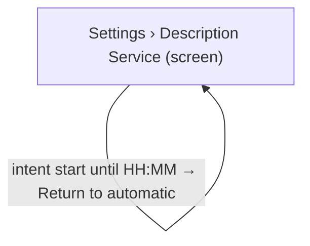

# UX Map — gpu-operator-control

**Product:** `alt-context WP plugin admin SPA — Settings › Description Service operator control (start / stop / automatic)`
**Source fixture:** `apps/prototype-wp-alt-context/js/admin/pages/SettingsPage.tsx`

## Goals
- Operator can always see Description Service state, effective intent, activity and load freshness in one place (INT-10 status–predict–stop, OBS-08 stale is shown as unknown with age).
- Operator can request Start, Stop or Return to automatic; each request is acknowledged within one poll and its outcome (honoured, pending, deferred until idle) is visible (HAI-04 activate–operate–override).
- Cost is disclosed before commitment; the user is never surprised by an hourly charge (INT-07, CARD-15, COST-10).
- Stop stays available while load.has_work; confirm asks Stop after the current run finishes? and the pending indicator is Stopping after the current work finishes until idle. Stale or unknown telemetry hides Start/Stop and offers tertiary Refresh; degraded copy is Service unavailable. Start service to retry. gpu_state is unknown|stopped|starting|warming|ready|degraded (INT-10, FLOW-08, A11Y-18, PERC-02).

## Jobs
- `job-prewarm-gpu` — Pre-warm Description Service before a demo so the first describe run is fast
- `job-stop-gpu` — Stop Description Service now to end spend
- `job-return-auto` — Return Description Service to automatic lifecycle

## Screens
| id | kind | route | title |
| --- | --- | --- | --- |
| `settings-burst-gpu` | screen | `#/settings` | Settings › Description Service |
| `gpu-start-confirm` | overlay | `#/settings (inline strip; no dedicated route)` | Confirm Start |
| `gpu-stop-confirm` | overlay | `#/settings (inline strip; no dedicated route)` | Confirm Stop |
| `exit-workbench` | exit | `#/workbench` | Workbench |

### Settings › Description Service (`settings-burst-gpu`)

Purpose: Card on the Settings page showing Description Service state, intent, activity and load, with Start / Stop / Return to automatic / Refresh controls. Domain vocabulary: stopped and ready = default; starting and warming = loading; snapshot missing or stale = empty; service unreachable = error; lifecycle degraded or intent pending = degraded. gpu_state is unknown|stopped|starting|warming|ready|degraded. Seven sketches: stopped → [PRIMARY] Start service; stopped by operator (intent STOP) → Stopped by operator · auto-start paused, [PRIMARY] Start service, [secondary] Return to automatic; starting/warming with eta_seconds → Warming up, about {eta} left and [secondary] Stop service; starting/warming without eta → Warming up, this can take a few minutes; ready → Service: ready · idle|N in flight and [secondary] Stop service; unknown/stale → Status unavailable, last seen {age} with [tertiary] Refresh, Start/Stop hidden; degraded → Service unavailable. Start service to retry. [PRIMARY] Start service. Typed description_service_unavailable is copy on degraded/unknown, not a gpu_state. Warm-up ETA comes from the load/status payload or is omitted; never invent a retry countdown.

Action states: stopped, unknown, starting, warming, ready, degraded

| zone id | label | role | states |
| --- | --- | --- | --- |
| `z-gpu-state-chip` | Service status chip — Service: not reported / stopped / starting / warming / ready / degraded with snapshot age (icon + text) | status | default, loading, empty, error, degraded |
| `z-gpu-intent` | Effective intent and expiry — automatic / start until HH:MM / stop (pending: Stopping after the current work finishes until idle) | status | default, loading, degraded |
| `z-gpu-lease` | Service activity — idle or running since, auto-stops by HH:MM (run limit); never show lease ids | status | default, empty |
| `z-gpu-load` | Describe load — work in flight yes/no with load snapshot freshness | status | default, empty, degraded |
| `z-gpu-cost` | Cost disclosure — hourly rate and warm-up time before Start, not in the headline | content | default |
| `z-gpu-controls` | Start service / Stop service / Return to automatic / Refresh status | form | default, loading, error, degraded |

```
+------------------------------------------------------------+
| Settings › Description Service  [screen]  #/settings       |
| Card on the Settings page showing Description Service stat…|
+------------------------------------------------------------+
| ZONES                                                      |
|   - Service status chip — Service: not reported / stopped …|
|   - Effective intent and expiry — automatic / start until …|
|   - Service activity — idle or running since, auto-stops b…|
|   - Describe load — work in flight yes/no with load snapsh…|
|   - Cost disclosure — hourly rate and warm-up time before …|
|   - Start service / Stop service / Return to automatic / R…|
+------------------------------------------------------------+
| ACTIONS                                                    |
| when stopped                                               |
|   [PRIMARY] Start service                                  |
|   [secondary] Return to automatic                          |
|   [tertiary] Refresh status                                |
| when unknown                                               |
|   [secondary] Return to automatic                          |
|   [tertiary] Refresh status                                |
| when starting                                              |
|   [secondary] Stop service                                 |
|   [secondary] Return to automatic                          |
|   [tertiary] Refresh status                                |
| when warming                                               |
|   [secondary] Stop service                                 |
|   [secondary] Return to automatic                          |
|   [tertiary] Refresh status                                |
| when ready                                                 |
|   [secondary] Stop service                                 |
|   [secondary] Return to automatic                          |
|   [tertiary] Refresh status                                |
|   [secondary] Go to Workbench                              |
| when degraded                                              |
|   [PRIMARY] Start service                                  |
|   [secondary] Stop service                                 |
|   [secondary] Return to automatic                          |
|   [tertiary] Refresh status                                |
+------------------------------------------------------------+
| states: default | loading | empty | error | degraded       |
+------------------------------------------------------------+
```

#### stopped

```
+------------------------------------------------------------+
| Settings › Description Service  [screen]  #/settings       |
| [■] Service: stopped                        snapshot 12 s  |
| Intent: Automatic                                          |
| Service: idle                                              |
| Load: no work in flight                                    |
| Cost: about $2/hour · warm-up about 2 min                  |
| [PRIMARY] Start service                                    |
| [secondary] Return to automatic                            |
| [tertiary] Refresh status                                  |
+------------------------------------------------------------+
```

#### stopped by operator

```
+------------------------------------------------------------+
| Settings › Description Service  [screen]  #/settings       |
| [■] Stopped by operator · auto-start paused                |
| Intent: Stop requested                                     |
| Service: idle                                              |
| Load: no work in flight                                    |
| [PRIMARY] Start service                                    |
| [secondary] Return to automatic                            |
| [tertiary] Refresh status                                  |
+------------------------------------------------------------+
```

#### starting/warming with ETA

```
+------------------------------------------------------------+
| Settings › Description Service  [screen]  #/settings       |
| [~] Service: warming                                       |
| Warming up, about 48 s left                                |
| Intent: Start requested until 22:40                        |
| Service: warming · no work in flight                       |
| [secondary] Stop service                                   |
| [secondary] Return to automatic                            |
| [tertiary] Refresh status                                  |
+------------------------------------------------------------+
```

#### starting/warming without ETA

```
+------------------------------------------------------------+
| Settings › Description Service  [screen]  #/settings       |
| [~] Service: starting                                      |
| Warming up, this can take a few minutes                    |
| Intent: Automatic                                          |
| Service: starting · no work in flight                      |
| [secondary] Stop service                                   |
| [secondary] Return to automatic                            |
| [tertiary] Refresh status                                  |
+------------------------------------------------------------+
```

#### ready

```
+------------------------------------------------------------+
| Settings › Description Service  [screen]  #/settings       |
| [OK] Service: ready · idle|N in flight                     |
| Intent: Automatic                                          |
| Service: ready · idle                                      |
| Load: no work in flight / N in flight                      |
| [secondary] Stop service                                   |
| [secondary] Return to automatic                            |
| [tertiary] Refresh status                                  |
| [secondary] Go to Workbench                                |
+------------------------------------------------------------+
```

#### unknown/stale

```
+------------------------------------------------------------+
| Settings › Description Service  [screen]  #/settings       |
| [?] Status unavailable, last seen 4 min ago                |
| Intent: Automatic (from last snapshot)                     |
| Start/Stop hidden until status is known.                   |
| [tertiary] Refresh status                                  |
+------------------------------------------------------------+
```

#### degraded

```
+------------------------------------------------------------+
| Settings › Description Service  [screen]  #/settings       |
| [!] Service unavailable. Start service to retry.           |
| Service: degraded                                          |
| [PRIMARY] Start service                                    |
| [secondary] Stop service                                   |
| [secondary] Return to automatic                            |
| [tertiary] Refresh status                                  |
+------------------------------------------------------------+
```

### Confirm Start (`gpu-start-confirm`)

Purpose: Inline confirm strip below the controls: names the hourly cost, the warm-up time and the intent TTL after which lifecycle returns to automatic. Stays until confirmed or dismissed.

| zone id | label | role | states |
| --- | --- | --- | --- |
| `z-start-preview` | Start preview — cost per hour, warm-up estimate, auto-return after TTL | content | default |
| `z-start-actions` | Confirm start / Cancel | form | default, loading, error |

```
+------------------------------------------------------------+
| Confirm Start  [overlay]  #/settings (inline strip; no ded…|
| Inline confirm strip below the controls: names the hourly …|
+------------------------------------------------------------+
| ZONES                                                      |
|   - Start preview — cost per hour, warm-up estimate, auto-…|
|   - Confirm start / Cancel (form) states=[default,loading,…|
+------------------------------------------------------------+
| ACTIONS                                                    |
|   [PRIMARY] Confirm start -> POST recognition/gpu/intent {…|
|   [secondary] Cancel -> settings-burst-gpu                 |
+------------------------------------------------------------+
| states: default | loading | error                          |
+------------------------------------------------------------+
```

### Confirm Stop (`gpu-stop-confirm`)

Purpose: Inline confirm strip: Stop service stays available while load.has_work. Confirm copy is Stop after the current run finishes? After confirm, the pending-intent indicator is Stopping after the current work finishes until idle, then the service stops. Never a disabled control.

| zone id | label | role | states |
| --- | --- | --- | --- |
| `z-stop-preview` | Stop preview — Stop after the current run finishes? then Stopping after the current work finishes until idle | content | default, degraded |
| `z-stop-actions` | Confirm stop / Cancel | form | default, loading, error |

```
+------------------------------------------------------------+
| Confirm Stop  [overlay]  #/settings (inline strip; no dedi…|
| Inline confirm strip: Stop service stays available while l…|
+------------------------------------------------------------+
| ZONES                                                      |
|   - Stop preview — Stop after the current run finishes? th…|
|   - Confirm stop / Cancel (form) states=[default,loading,e…|
+------------------------------------------------------------+
| ACTIONS                                                    |
|   [PRIMARY] Confirm stop -> POST recognition/gpu/intent {a…|
+------------------------------------------------------------+
| states: default | loading | error | degraded               |
+------------------------------------------------------------+
```

### Workbench (`exit-workbench`)

Purpose: Go describe media once Description Service is ready

url_params: `run_id`

| zone id | label | role | states |
| --- | --- | --- | --- |
| `z-wb-entry` | Workbench entry | nav | default |

```
+------------------------------------------------------------+
| Workbench  [exit]  #/workbench                             |
| Go describe media once Description Service is ready        |
+------------------------------------------------------------+
| ZONES                                                      |
|   - Workbench entry (nav) states=[default]                 |
+------------------------------------------------------------+
| states: default                                            |
+------------------------------------------------------------+
```

## Actions

| id | verb | target | hierarchy | costly | irreversible | preview required | screen id | when (recovery state) |
| --- | --- | --- | --- | --- | --- | --- | --- | --- |
| `act-gpu-start` | Start service | `gpu-start-confirm` | primary | yes | no | yes | `settings-burst-gpu` | stopped, degraded |
| `act-gpu-confirm-start` | Confirm start | `POST recognition/gpu/intent {action: start}` | primary | yes | no | no | `gpu-start-confirm` | always |
| `act-gpu-stop` | Stop service | `gpu-stop-confirm` | secondary | no | no | yes | `settings-burst-gpu` | starting, warming, ready, degraded |
| `act-gpu-confirm-stop` | Confirm stop | `POST recognition/gpu/intent {action: stop}` | primary | no | no | no | `gpu-stop-confirm` | always |
| `act-gpu-auto` | Return to automatic | `POST recognition/gpu/intent {action: auto}` | secondary | no | no | no | `settings-burst-gpu` | always |
| `act-gpu-refresh` | Refresh status | `GET recognition/gpu/status` | tertiary | no | no | no | `settings-burst-gpu` | always |
| `act-cancel-confirm` | Cancel | `settings-burst-gpu` | secondary | no | no | no | `gpu-start-confirm` | always |
| `act-goto-workbench` | Go to Workbench | `exit-workbench` | secondary | no | no | no | `settings-burst-gpu` | ready |

## Flows
### Pre-warm before a demo (`flow-prewarm`)

```mermaid
flowchart TD
  %% flow: Pre-warm before a demo job=job-prewarm-gpu
  %% steps: [{"screen_id":"settings-burst-gpu","branch_label":"state stopped → Start service"},{"screen_id":"gpu-start-confirm","branch_label":"preview cost + TTL → Confirm start (202)"},{"screen_id":"settings-burst-gpu","branch_label":"intent start (pending) → starting → warming (bounded ETA) → ready"},{"screen_id":"exit-workbench","branch_label":"Go to Workbench"}]
  n_settings_burst_gpu["Settings › Description Service (screen)"]
  n_gpu_start_confirm["Confirm Start (overlay)"]
  n_settings_burst_gpu -->|state stopped → Start service| n_gpu_start_confirm
  n_gpu_start_confirm -->|preview cost + TTL → Confirm start (202)| n_settings_burst_gpu
  n_exit_workbench["Workbench (exit)"]
  n_settings_burst_gpu -->|intent start (pending) → starting → warming (bounded ETA) → ready| n_exit_workbench
```

### Stop while a describe run is in flight (`flow-stop-blocked`)

```mermaid
flowchart TD
  %% flow: Stop while a describe run is in flight job=job-stop-gpu
  %% steps: [{"screen_id":"settings-burst-gpu","branch_label":"state ready, load.has_work → Stop service available (deferred intent)"},{"screen_id":"gpu-stop-confirm","branch_label":"Stop after the current run finishes? → Confirm stop (202)"},{"screen_id":"settings-burst-gpu","branch_label":"Stopping after the current work finishes until idle → service stops"}]
  n_settings_burst_gpu["Settings › Description Service (screen)"]
  n_gpu_stop_confirm["Confirm Stop (overlay)"]
  n_settings_burst_gpu -->|state ready, load.has_work → Stop service available (deferred intent)| n_gpu_stop_confirm
  n_gpu_stop_confirm -->|Stop after the current run finishes? → Confirm stop (202)| n_settings_burst_gpu
  n_settings_burst_gpu -->|Stopping after the current work finishes until idle → service stops| n_settings_burst_gpu
```

### Return to automatic (`flow-return-auto`)



## Open questions
- Should Start service be offered on the Workbench media selection as well as Settings? Current recommendation: Settings only; Workbench keeps enqueue-triggered start and the cold-start cost hint (describe-gpu-tier not_doing).
- Default intent TTL is 30 min server-clamped to 120 min; confirm against the measured cold-start and typical demo length.

## Parity index

Machine-checked by `js/admin/__tests__/uxmap-parity.test.ts` and
`js/admin/__tests__/uxmap-render-parity.test.ts`: every id, state, and verbatim label
below must exist in the sibling `.uxmap.json`, and no `z-*`/`act-*` id may appear here
that the JSON does not define. Regenerate with `docs/ux-maps/render_ux_maps.py` — never
hand-edit one side.

Zone ids: z-gpu-state-chip z-gpu-intent z-gpu-lease z-gpu-load z-gpu-cost z-gpu-controls z-start-preview z-start-actions z-stop-preview z-stop-actions z-wb-entry

Action ids: act-gpu-start act-gpu-confirm-start act-gpu-stop act-gpu-confirm-stop act-gpu-auto act-gpu-refresh act-cancel-confirm act-goto-workbench

Zone labels (verbatim; the tables above escape `|` for markdown, this list does not):

- Service status chip — Service: not reported / stopped / starting / warming / ready / degraded with snapshot age (icon + text)
- Effective intent and expiry — automatic / start until HH:MM / stop (pending: Stopping after the current work finishes until idle)
- Service activity — idle or running since, auto-stops by HH:MM (run limit); never show lease ids
- Describe load — work in flight yes/no with load snapshot freshness
- Cost disclosure — hourly rate and warm-up time before Start, not in the headline
- Start service / Stop service / Return to automatic / Refresh status
- Start preview — cost per hour, warm-up estimate, auto-return after TTL
- Confirm start / Cancel
- Stop preview — Stop after the current run finishes? then Stopping after the current work finishes until idle
- Confirm stop / Cancel
- Workbench entry

States (all zones and screens): default loading empty error degraded

## Not doing
- No modal dialog; confirmation is an inline strip (consistent with describe-gpu-tier not_doing).
- No per-poll toasts; useGpuStateToasts already covers transitions. Suppress toasts while a warming progress surface is mounted (GPUUX-1, PERC-07).
- No direct OCI calls from PHP or the SPA; every field is pass-through from gpu-state.json and the intent file (rg-015).
- Primary copy never names leases, lease ids, or demand-lease internals; those stay on the wire (UXSCRE-M-08).
- gpu_state has no unavailable member; operator STOP is a reason. Typed description_service_unavailable is copy on degraded/unknown Settings screens, not a new state or action. Retry-After belongs only to description_service_starting.
- Identity and suggestion copy never claims proof of identity; a representative is a proposal to review, not proof.
