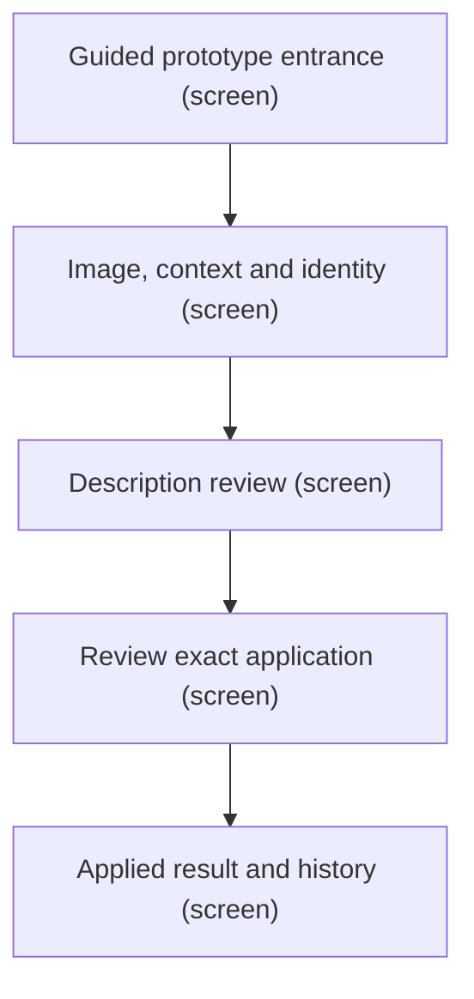
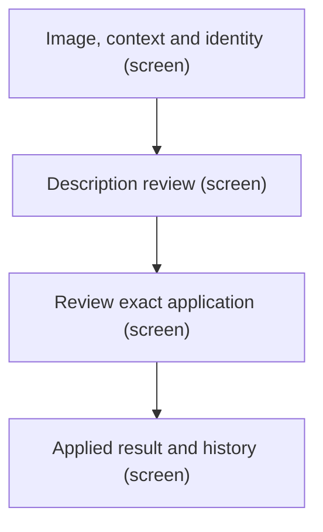
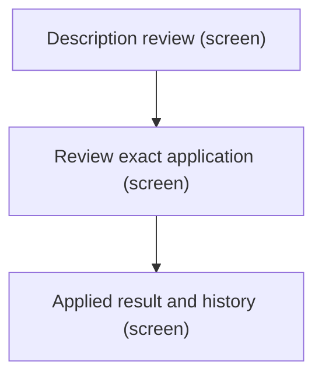
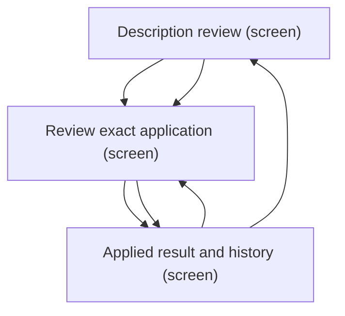
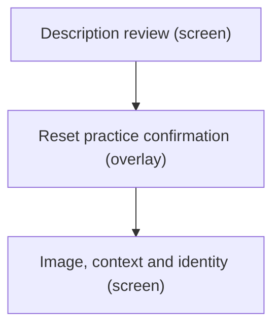
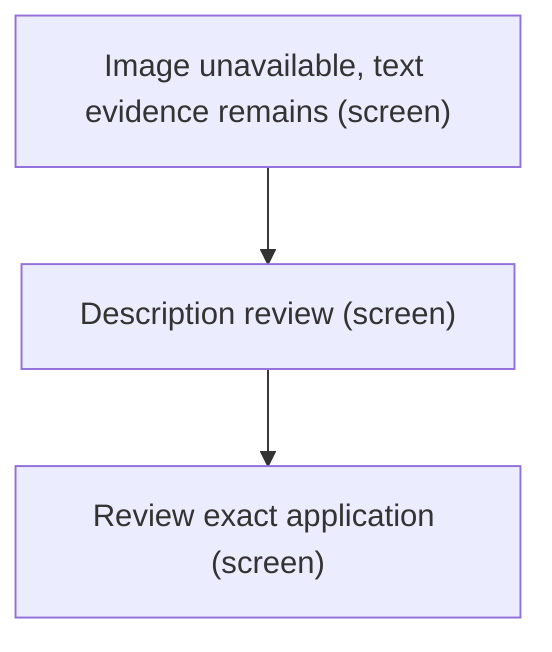

# UX Map — guided-prototype

**Product:** `AltContext — authenticated guided prototype`

## Goals
- Implementation inventory and correction target for feature/guided-prototype-1; one in-memory example inside authenticated WordPress admin, not the public homepage.
- Show visual draft + confirmed identity + page context → named description; editing/rejection never applies automatically.
- Only the saved candidate can be applied; pending text is labelled and must be saved or discarded before Apply.
- Guide navigation reaches its named region; reset dialog preserves edits on cancel; all disappearing actions restore focus.
- Clear illustrative provenance, bundled sample with text fallback, no live inference dependency.
- State variants share one route; refresh resets memory, and the UI explains this.

## Jobs
- `review` — Review identity-informed description and apply to practice copy
- `recover` — Undo or reset practice without hidden losses

## Screens
| id | kind | route | title |
| --- | --- | --- | --- |
| `intro` | screen | `#/guided-prototype` | Guided prototype entrance |
| `evidence` | screen | `#/guided-prototype` | Image, context and identity |
| `draft` | screen | `#/guided-prototype` | Description review |
| `apply` | screen | `#/guided-prototype` | Review exact application |
| `result` | screen | `#/guided-prototype` | Applied result and history |
| `reset` | overlay | `#/guided-prototype` | Reset practice confirmation |
| `image-fallback` | screen | `#/guided-prototype` | Image unavailable, text evidence remains |
| `case-study` | exit | `https://darce.xyz/projects/altcontext/` | Authoritative case study |

## Code references
- `screen:intro` — `apps/prototype-wp-alt-context/js/admin/pages/GuidedPrototypeEntrance.tsx`
- `screen:evidence` — `apps/prototype-wp-alt-context/js/admin/pages/guided/GuidedPrototypePage.tsx`
- `screen:draft` — `apps/prototype-wp-alt-context/js/admin/pages/guided/GuidedDescriptionReview.tsx`
- `screen:apply` — `apps/prototype-wp-alt-context/js/admin/pages/guided/GuidedDescriptionReview.tsx`
- `screen:result` — `apps/prototype-wp-alt-context/js/admin/pages/guided/GuidedPrototypePage.tsx`
- `screen:reset` — `apps/prototype-wp-alt-context/js/admin/pages/guided/GuidedPrototypePage.tsx`
- `screen:image-fallback` — `apps/prototype-wp-alt-context/js/admin/pages/guided/GuidedPrototypePage.tsx`
- `screen:case-study` — `apps/prototype-wp-alt-context/js/admin/pages/GuidedPrototypeEntrance.tsx`

### Guided prototype entrance (`intro`)

```
+------------------------------------------------------------+
| Guided prototype entrance  [screen]  #/guided-prototype    |
| Explains illustrative memory-only scope; case study and c… |
+------------------------------------------------------------+
| ZONES                                                      |
|   - Branded heading, scope and current build status (cont… |
|   - Open a saved example and case study exit (nav) states… |
+------------------------------------------------------------+
| ACTIONS                                                    |
|   [PRIMARY] Open a saved example -> evidence               |
|   [secondary] Read the case study -> case-study            |
+------------------------------------------------------------+
| states: default | error                                    |
+------------------------------------------------------------+
```

### Image, context and identity (`evidence`)

```
+------------------------------------------------------------+
| Image, context and identity  [screen]  #/guided-prototype  |
| Inspect sample photograph/text equivalent and source reco… |
+------------------------------------------------------------+
| ZONES                                                      |
|   - Guide steps and jump to controls in document flow (na… |
|   - Photograph with descriptive fallback, credited sample… |
|   - Confirm identity / keep unidentified; recorded choice… |
+------------------------------------------------------------+
| ACTIONS                                                    |
|   [PRIMARY] Confirm sample identity -> draft               |
|   [secondary] Keep person unidentified -> draft            |
+------------------------------------------------------------+
| states: default | error                                    |
+------------------------------------------------------------+
```

### Description review (`draft`)

```
+------------------------------------------------------------+
| Description review  [screen]  #/guided-prototype           |
| Saved draft and immutable visual-only baseline are distin… |
+------------------------------------------------------------+
| ZONES                                                      |
|   - Generic visual description, identity and page context… |
|   - Labelled editor with pending/saved/error/rejected fee… |
|   - Save edit / discard / reject; Apply availability reas… |
+------------------------------------------------------------+
| ACTIONS                                                    |
|   [PRIMARY] Save description edit -> apply                 |
|   [secondary] Discard unsaved changes -> draft             |
|   [secondary] Reject draft -> draft                        |
+------------------------------------------------------------+
| states: default | edge_input | error                       |
+------------------------------------------------------------+
```

### Review exact application (`apply`)

```
+------------------------------------------------------------+
| Review exact application  [screen]  #/guided-prototype     |
| Before/after shows current practice value and the actual … |
+------------------------------------------------------------+
| ZONES                                                      |
|   - Current value and reviewed saved candidate; explicit … |
|   - Apply, blocked with explanation while pending or reje… |
+------------------------------------------------------------+
| ACTIONS                                                    |
|   [PRIMARY] Apply to practice copy -> result               |
+------------------------------------------------------------+
| states: default | error                                    |
+------------------------------------------------------------+
```

### Applied result and history (`result`)

```
+------------------------------------------------------------+
| Applied result and history  [screen]  #/guided-prototype   |
| Applied value is separate from draft; history preserves o… |
+------------------------------------------------------------+
| ZONES                                                      |
|   - Applied description and unchanged original media scop… |
|   - Chronological decision history and prior text; undo a… |
|   - Undo restores focus to stable Apply control (form) st… |
+------------------------------------------------------------+
| ACTIONS                                                    |
|   [PRIMARY] Undo practice apply -> apply                   |
|   [secondary] Reset practice… -> reset                     |
+------------------------------------------------------------+
| states: default | error                                    |
+------------------------------------------------------------+
```

### Reset practice confirmation (`reset`)

```
+------------------------------------------------------------+
| Reset practice confirmation  [overlay]  #/guided-prototype |
| Safe default Keep; cancel preserves unsaved and saved edi… |
+------------------------------------------------------------+
| ZONES                                                      |
|   - Explicit effects: remove practice changes, preserve o… |
|   - Keep changes / Reset practice; Escape cancels (form) … |
+------------------------------------------------------------+
| ACTIONS                                                    |
|   [PRIMARY] Keep changes -> draft                          |
|   [DESTRUCTIVE] Reset practice -> evidence (preview,irrev… |
+------------------------------------------------------------+
| states: default | error                                    |
+------------------------------------------------------------+
```

### Image unavailable, text evidence remains (`image-fallback`)

```
+------------------------------------------------------------+
| Image unavailable, text evidence remains  [screen]  #/gui… |
| Image load failure does not invent a rendered photograph … |
+------------------------------------------------------------+
| ZONES                                                      |
|   - Visible image unavailable explanation and independent… |
|   - Sample record and text-based review remain available … |
+------------------------------------------------------------+
| ACTIONS                                                    |
|   [PRIMARY] Continue with text evidence -> draft           |
+------------------------------------------------------------+
| states: default | error | offline                          |
+------------------------------------------------------------+
```

### Authoritative case study (`case-study`)

```
+------------------------------------------------------------+
| Authoritative case study  [exit]  https://darce.xyz/proje… |
| External destination; browser owns network failure; Back … |
+------------------------------------------------------------+
| ZONES                                                      |
|   - Case study content (content) states=[default,error]    |
+------------------------------------------------------------+
| states: default | offline | error                          |
+------------------------------------------------------------+
```

## Flows
### Confirmed identity woven into description, reviewed and applied (`named`)



### Unresolved identity keeps description generic (`unnamed`)



### Pending edit cannot apply old candidate (`pending`)



### Apply two revisions and undo in order (`undo-flow`)



### Cancel or confirm reset safely (`reset-flow`)



### Text fallback retains review path (`image-error`)



## Not doing
- Public homepage or marketing deployment
- Guest-session authentication or credentials settings
- Live generation
- Multi-scenario library and production privacy settings
- Full WordPress or screen-reader conformance claim from component-only browser tests
