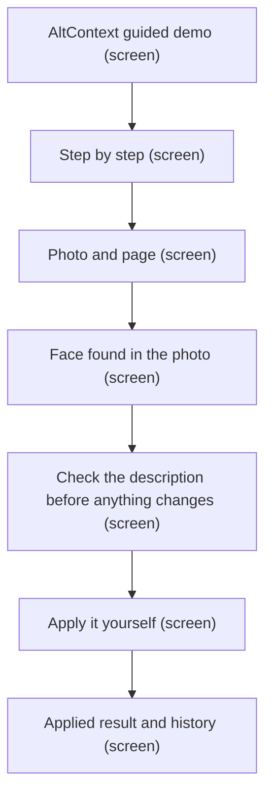
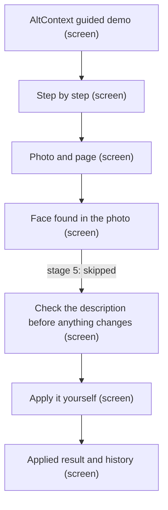
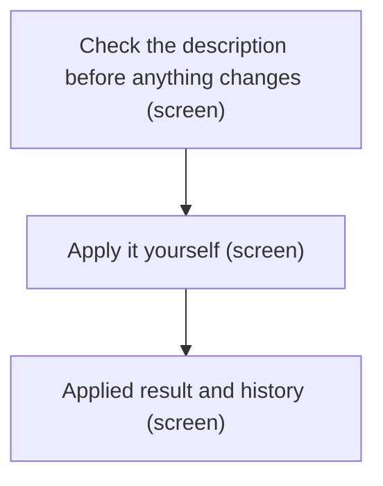
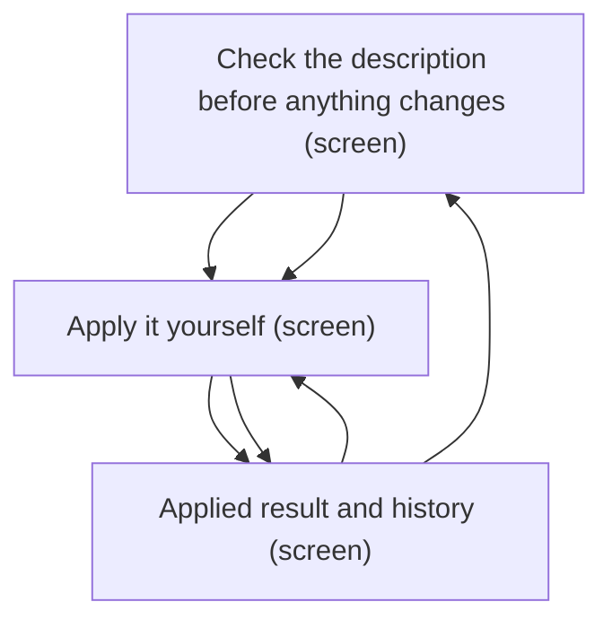
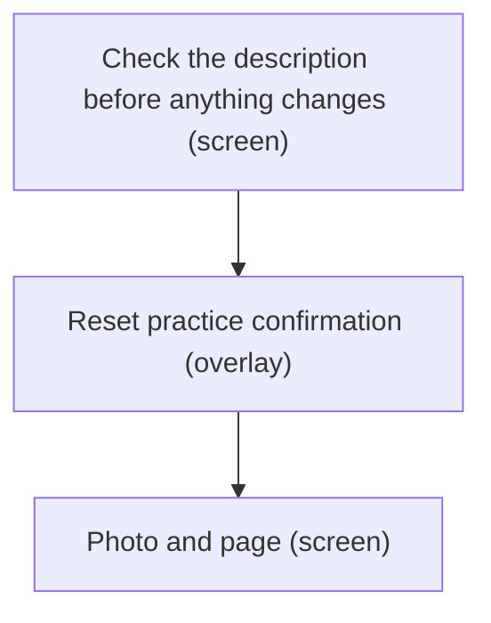
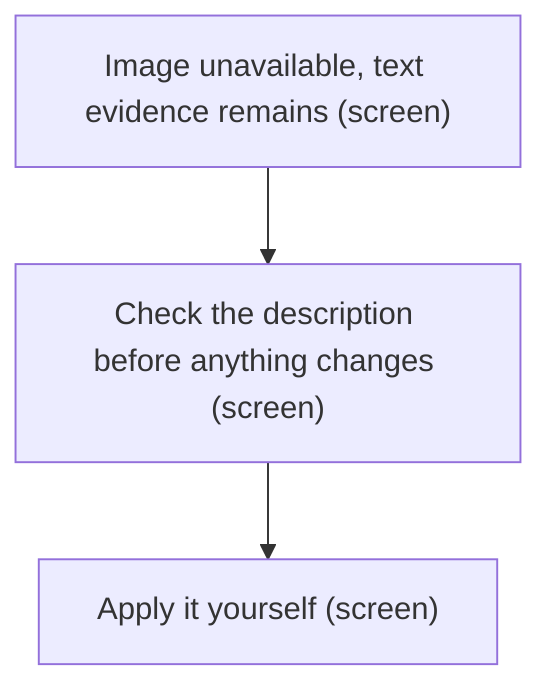

# UX Map — guided-prototype

**Product:** `AltContext — authenticated guided prototype`

## Goals
- Implementation inventory and correction target for feature/guided-prototype-1; one in-memory example inside authenticated WordPress admin, not the public homepage.
- Show visual draft + confirmed identity + page context → named description; editing/rejection never applies automatically.
- Only the saved candidate can be applied; pending text is labelled and must be saved or discarded before Apply.
- Guide navigation reaches its named region; reset dialog preserves edits on cancel; all disappearing actions restore focus.
- Clear illustrative provenance, bundled sample with text fallback, no live inference dependency.
- State variants share one route; refresh resets memory, and the UI explains this.

## Jobs
- `review` — Review identity-informed description and apply to practice copy
- `recover` — Undo or reset practice without hidden losses

## Screens
| id | kind | route | title |
| --- | --- | --- | --- |
| `intro` | screen | `#/guided-prototype` | AltContext guided demo |
| `guide` | screen | `#/guided-prototype` | Step by step |
| `evidence` | screen | `#/guided-prototype` | Photo and page |
| `face` | screen | `#/guided-prototype` | Face found in the photo |
| `draft` | screen | `#/guided-prototype` | Check the description before anything changes |
| `apply` | screen | `#/guided-prototype` | Apply it yourself |
| `result` | screen | `#/guided-prototype` | Applied result and history |
| `reset` | overlay | `#/guided-prototype` | Reset practice confirmation |
| `image-fallback` | screen | `#/guided-prototype` | Image unavailable, text evidence remains |
| `case-study` | exit | `https://darce.xyz/projects/altcontext/` | Authoritative case study |

## Code references
- `screen:intro` — `apps/prototype-wp-alt-context/js/admin/pages/GuidedPrototypeEntrance.tsx`
- `screen:guide` — `apps/prototype-wp-alt-context/js/admin/pages/guided/GuidedPrototypeGuide.tsx`
- `screen:evidence` — `apps/prototype-wp-alt-context/js/admin/pages/guided/GuidedPrototypePage.tsx`
- `screen:face` — `apps/prototype-wp-alt-context/js/admin/pages/guided/GuidedFaceMatchCard.tsx`
- `screen:draft` — `apps/prototype-wp-alt-context/js/admin/pages/guided/GuidedDescriptionReview.tsx`
- `screen:apply` — `apps/prototype-wp-alt-context/js/admin/pages/guided/GuidedDescriptionReview.tsx`
- `screen:result` — `apps/prototype-wp-alt-context/js/admin/pages/guided/GuidedPrototypePage.tsx`
- `screen:reset` — `apps/prototype-wp-alt-context/js/admin/pages/guided/GuidedResetDialog.tsx`
- `screen:image-fallback` — `apps/prototype-wp-alt-context/js/admin/pages/guided/GuidedSamplePhoto.tsx`
- `screen:case-study` — `apps/prototype-wp-alt-context/js/admin/pages/GuidedPrototypeEntrance.tsx`

### AltContext guided demo (`intro`)

```
+------------------------------------------------------------+
| AltContext guided demo  [screen]  #/guided-prototype       |
| Follow one photo from start to finish. AltContext finds a  |
| face, matches it to a person you already named, and puts   |
| that name in the image description. You choose what gets   |
| saved.                                                       |
+------------------------------------------------------------+
| ZONES                                                      |
|   - Guided demo, scope, and current build status (content)  |
|   - Start the demo and read the AltContext case study (nav) |
+------------------------------------------------------------+
| ACTIONS                                                    |
|   [PRIMARY] Start the demo -> guide                       |
|   [secondary] Read the AltContext case study -> case-study |
+------------------------------------------------------------+
| states: default                                            |
+------------------------------------------------------------+
```

### Step by step (`guide`)

```
+------------------------------------------------------------+
| Step by step  [screen]  #/guided-prototype                |
| Five steps show the path from the photo to the description:|
| Look at the photo, Find the face, Confirm the match, Check |
| the description, and Apply it yourself.                   |
+------------------------------------------------------------+
| ZONES                                                      |
|   - Current step, Skip to this step, and Show steps / Hide  |
|     steps (nav)                                             |
|   - Five steps and Close the steps (nav)                   |
+------------------------------------------------------------+
| ACTIONS                                                    |
|   [secondary] Show steps / Hide steps -> guide             |
|   [secondary] Choose a step -> draft                       |
|   [tertiary] Close the steps -> evidence                   |
|   [tertiary] Skip to this step -> evidence                 |
+------------------------------------------------------------+
| states: first_time | default                               |
+------------------------------------------------------------+
```

### Photo and page (`evidence`)

```
+------------------------------------------------------------+
| Photo and page  [screen]  #/guided-prototype               |
| See the photo and the page it sits on. AltContext found a  |
| face and the next step shows the match.                    |
+------------------------------------------------------------+
| ZONES                                                      |
|   - The photo; current alt text; photo credit; and the     |
|     next-step face note (ai_review)                        |
|   - Where this example comes from: Example, Page, and      |
|     Person on file (content)                               |
+------------------------------------------------------------+
| states: default                                            |
+------------------------------------------------------------+
```

### Face found in the photo (`face`)

```
+------------------------------------------------------------+
| Face found in the photo  [screen]  #/guided-prototype      |
| AltContext found a face and matched it to a person you     |
| named before. You choose whether to put the name in the    |
| description.                                               |
+------------------------------------------------------------+
| ZONES                                                      |
|   - Face crop, face count, match, and match strength       |
|     (ai_review)                                            |
|   - How this works list and saved-run disclosure (content) |
|   - Decision status and two name-choice buttons (form)     |
+------------------------------------------------------------+
| ACTIONS                                                    |
|   [secondary] Yes, this is Keanu Reeves -> draft           |
|   [tertiary] Keep the person unnamed -> draft              |
+------------------------------------------------------------+
| states: undecided | confirmed | unnamed                    |
+------------------------------------------------------------+
```

### Check the description before anything changes (`draft`)

```
+------------------------------------------------------------+
| Check the description before anything changes              |
| [screen]  #/guided-prototype                               |
| Read the draft. Edit it or reject it. Nothing changes      |
| until you press Apply.                                     |
+------------------------------------------------------------+
| ZONES                                                      |
|   - Ready for you to check, Edited by you, or Rejected.     |
|     The saved text did not change (form)                   |
|   - Without the name and Draft for you to check; saved      |
|     example, not a live run (ai_review)                    |
|   - Description draft with Save my edit, Discard my edit,  |
|     and Reject this draft (form)                            |
+------------------------------------------------------------+
| ACTIONS                                                    |
|   [PRIMARY] Save my edit -> apply                          |
|   [secondary] Reject this draft -> draft                   |
|   [tertiary] Discard my edit -> draft                      |
+------------------------------------------------------------+
| states: default | error                                    |
+------------------------------------------------------------+
```

### Apply it yourself (`apply`)

```
+------------------------------------------------------------+
| Apply it yourself  [screen]  #/guided-prototype            |
| Nothing changes until you press Apply. Pressing Apply      |
| writes the saved draft to this practice copy only.         |
+------------------------------------------------------------+
| ZONES                                                      |
|   - The practice copy says {appliedText}; pressing Apply    |
|     writes the saved draft to this practice copy only      |
|   - Apply to practice copy and Undo; Apply is off while     |
|     your edit is unsaved                                  |
+------------------------------------------------------------+
| ACTIONS                                                    |
|   [PRIMARY] Apply to practice copy -> result               |
|   [tertiary] Undo -> apply                                  |
+------------------------------------------------------------+
| states: default | error                                    |
+------------------------------------------------------------+
```

### Applied result and history (`result`)

```
+------------------------------------------------------------+
| Applied result and history  [screen]  #/guided-prototype   |
| Applied value is separate from draft; history preserves o… |
+------------------------------------------------------------+
| ZONES                                                      |
|   - Applied description and unchanged original media scop… |
|   - Chronological decision history; empty state before an… |
|   - Reset practice trigger in the workspace header (nav) … |
+------------------------------------------------------------+
| ACTIONS                                                    |
|   [tertiary] Reset practice -> reset                       |
+------------------------------------------------------------+
| states: default | empty                                    |
+------------------------------------------------------------+
```

### Reset practice confirmation (`reset`)

```
+------------------------------------------------------------+
| Reset practice confirmation  [overlay]  #/guided-prototype |
| Radix dialog overlay; safe default Cancel preserves unsav… |
+------------------------------------------------------------+
| ZONES                                                      |
|   - Explicit effects: remove practice changes, preserve o… |
|   - Cancel / Reset practice; Escape cancels (form) states… |
+------------------------------------------------------------+
| ACTIONS                                                    |
|   [PRIMARY] Cancel -> draft                                |
|   [DESTRUCTIVE] Reset practice -> evidence (preview,irrev… |
+------------------------------------------------------------+
| states: default                                            |
+------------------------------------------------------------+
```

### Image unavailable, text evidence remains (`image-fallback`)

```
+------------------------------------------------------------+
| Image unavailable, text evidence remains  [screen]  #/gui… |
| Image load failure does not invent a rendered photograph … |
+------------------------------------------------------------+
| ZONES                                                      |
|   - Visible image unavailable explanation and independent… |
|   - Sample record and text-based review remain available … |
+------------------------------------------------------------+
| states: default                                            |
+------------------------------------------------------------+
```

### Authoritative case study (`case-study`)

```
+------------------------------------------------------------+
| Authoritative case study  [exit]  https://darce.xyz/proje… |
| External destination in a new tab; browser owns network f… |
+------------------------------------------------------------+
| ZONES                                                      |
|   - Case study content (content) states=[default]          |
+------------------------------------------------------------+
| states: default                                            |
+------------------------------------------------------------+
```

## Flows
### You confirm the match, check the description, and apply it (`named`)



### The person stays unnamed and the description stays generic (`unnamed`)



### Save or discard your edit before Apply (`pending`)



### Apply two edits and undo in order (`undo-flow`)



### Cancel or confirm reset safely (`reset-flow`)



### The photo is unavailable, but text lets you keep practising (`image-error`)



## Open questions
- Live recognition: when the demo runs recognition for real, the face card must show a fresh timestamp and drop the saved-run disclosure.
- Which recognition engine produced the saved match? InsightFace.

## Not doing
- Public homepage or marketing deployment
- Guest-session authentication or credentials settings
- Live generation
- Multi-scenario library and production privacy settings
- Full WordPress or screen-reader conformance claim from component-only browser tests
