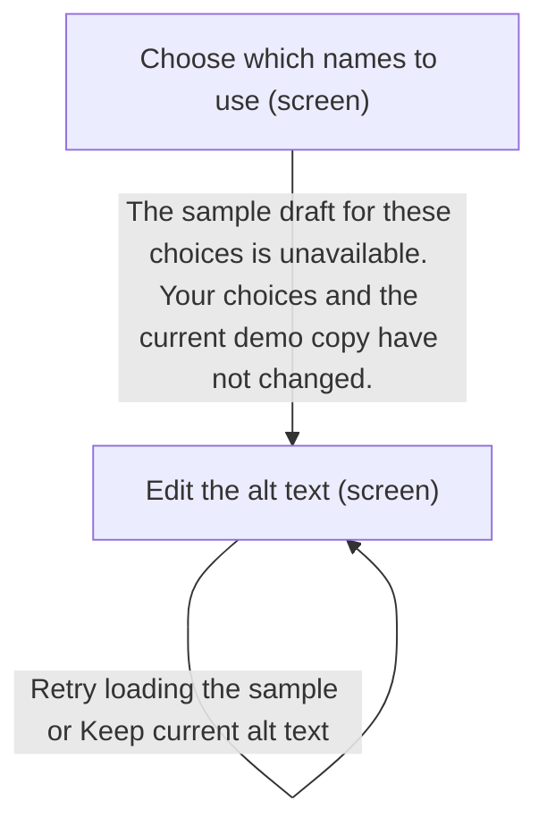
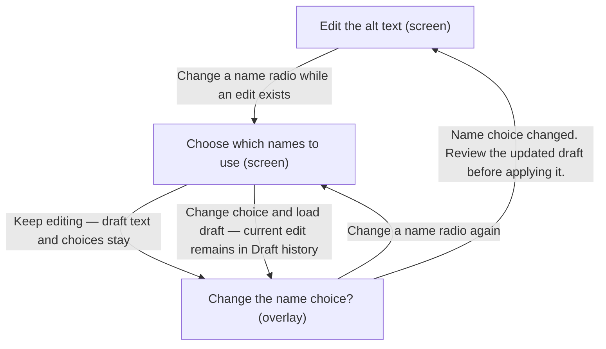
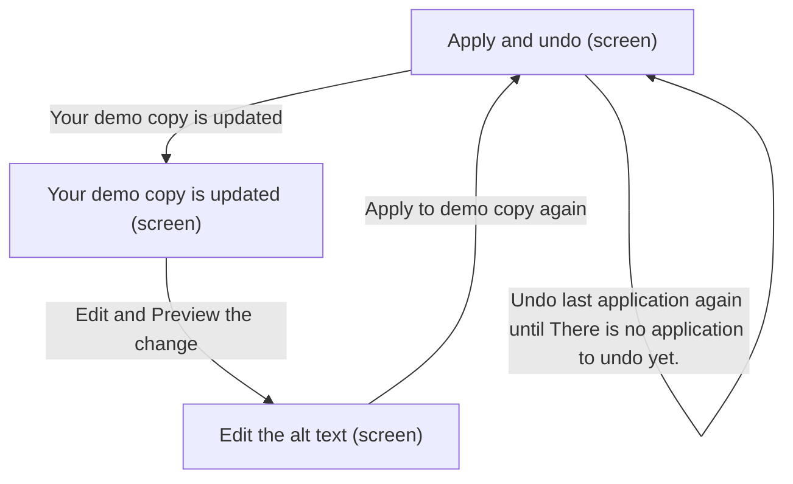
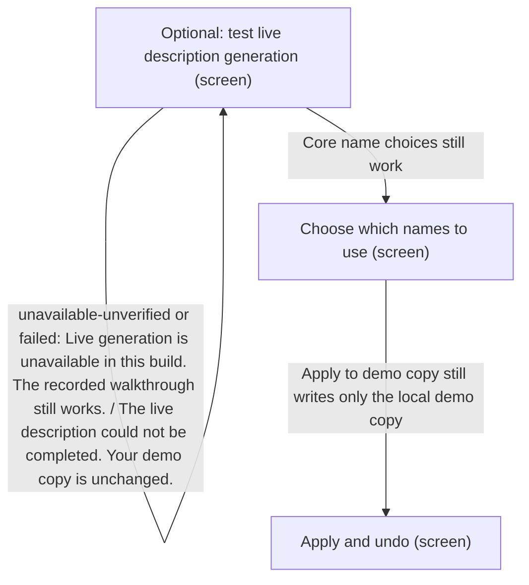

# UX Map — guided-prototype

**Product:** `AltContext — authenticated guided prototype`
**Source fixture:** `apps/prototype-wp-alt-context/js/admin/pages/guided/GuidedPrototypePage.tsx`

## Goals
- Inventory the shipped four-step guided demo after reflow: compact intro plus numbered guide, then context, names, draft, apply, outcome, local history, closed design notes, and optional live test last.
- Every visitor-visible string is catalog copy from copy.en.json, filled with the shipped people names Justin Trudeau (left) and Katy Perry (right).
- Name choices start undecided with native radios and no preselection; omit is a valid completion; live generation never competes with Apply and never writes the demo copy.
- Engine and saved-run provenance stay in notes, not screen copy. Recognition does not run during the walkthrough.

## Jobs
- `review` — Review saved name suggestions and apply a local demo alt text
- `recover` — Undo, keep, reset, or recover a draft without hidden losses

## Screens
| id | kind | route | title |
| --- | --- | --- | --- |
| `entry` | screen | `#/guided-prototype` | Review an AI-assisted alt text draft |
| `context` | screen | `#/guided-prototype` | Understand the page |
| `names` | screen | `#/guided-prototype` | Choose which names to use |
| `draft` | screen | `#/guided-prototype` | Edit the alt text |
| `apply` | screen | `#/guided-prototype` | Apply and undo |
| `outcome` | screen | `#/guided-prototype` | Your demo copy is updated |
| `history` | screen | `#/guided-prototype` | Your demo actions |
| `design-notes` | screen | `#/guided-prototype` | Design notes |
| `names-change` | overlay | `#/guided-prototype` | Change the name choice? |
| `reset` | overlay | `#/guided-prototype` | Reset this demo? |
| `case-study` | exit | `https://darce.xyz/projects/altcontext/` | Read the AltContext case study |
| `live` | screen | `#/guided-prototype` | Optional: test live description generation |

### Review an AI-assisted alt text draft (`entry`)

Purpose: Compact intro plus numbered guide on one page. AltContext guided demo. You are editing a photo in a festival gallery. Review two saved name suggestions, edit the alt text, then apply it to a demo copy. You can leave either person unnamed. This walkthrough uses recorded face suggestions and sample drafts. Your choices change only the demo copy in this tab and reset when you reload. An optional live test at the end runs separately on the server. Start the walkthrough is the one primary CTA. Read the AltContext case study is a secondary link. Demo steps: Step 1 of 4: Understand the page, with Show all steps / Hide steps. Reset demo opens the reset overlay. Route stays #/guided-prototype.

| zone id | label | role | states |
| --- | --- | --- | --- |
| `guided-demo-root` | Page root. AltContext guided demo. Review an AI-assisted alt text draft. You are editing a photo in a festival gallery. Review two saved name suggestions, edit the alt text, then apply it to a demo copy. You can leave either person unnamed. This walkthrough uses recorded face suggestions and sample drafts. Your choices change only the demo copy in this tab and reset when you reload. An optional live test at the end runs separately on the server. | content | default, first_time |
| `entry-cta` | Start the walkthrough (primary) and Read the AltContext case study (secondary link, new tab). | nav | default |
| `guided-demo-stepper` | Demo steps. Step {stepNumber} of 4: {stepTitle}. Show all steps / Hide steps. Numbered buttons: Understand the page; Choose which names to use; Edit the alt text; Apply and undo. Inspection is always allowed; buttons do not change the route hash. | nav | default, first_time |
| `entry-reset` | Reset demo trigger in the workspace header. Opens Reset this demo? | nav | default |

```text
+------------------------------------------------------------+
| Review an AI-assisted alt text draft  [screen]  #/guided-p…|
| Compact intro plus numbered guide on one page. AltContext …|
+------------------------------------------------------------+
| ZONES                                                      |
|   - Page root. AltContext guided demo. Review an AI-assist…|
|   - Start the walkthrough (primary) and Read the AltContex…|
|   - Demo steps. Step {stepNumber} of 4: {stepTitle}. Show …|
|   - Reset demo trigger in the workspace header. Opens Rese…|
+------------------------------------------------------------+
| ACTIONS                                                    |
|   [PRIMARY] Start the walkthrough                          |
|   [secondary] Read the AltContext case study               |
|   [secondary] Show all steps                               |
|   [secondary] Understand the page                          |
|   [secondary] Choose which names to use                    |
|   [secondary] Edit the alt text                            |
|   [secondary] Apply and undo                               |
|   [tertiary] Reset demo                                    |
+------------------------------------------------------------+
| states: default | first_time                               |
+------------------------------------------------------------+
```

### Understand the page (`context`)

Purpose: Step 1 of 4: Understand the page. This photo appears in a festival gallery. Review the existing alt text alongside the photo and its page context. Example page: Tribeca Festival 2026: red carpet photos. Current alt text in the demo copy: Two people at a film festival. Names can be useful in this gallery when the editor has enough evidence to include them. Leaving someone unnamed is also a valid choice. Saved example and image credits is a closed disclosure. Review name suggestions is always enabled.

| zone id | label | role | states |
| --- | --- | --- | --- |
| `guided-section-understand` | Understand the page. This photo appears in a festival gallery. Review the existing alt text alongside the photo and its page context. Example page: Tribeca Festival 2026: red carpet photos. Names can be useful in this gallery when the editor has enough evidence to include them. Leaving someone unnamed is also a valid choice. | content | default |
| `context-photo` | Evidence photo with Current alt text in the demo copy: Two people at a film festival. Photo credit: Colleen Sturtevant, CC BY-SA 4.0, resized. error: image load failure keeps the descriptive alternative visible as text; decisions stay available. | ai_review | default, error |
| `context-provenance` | Saved example and image credits (closed details). When open: Recorded face-match run: 6 September 2026. Recognition is not running during this walkthrough. | content | default |
| `guided-page-feedback` | Single polite status live region for demo events such as Demo reset. WordPress media was not changed. | status | default, empty |

```text
+------------------------------------------------------------+
| Understand the page  [screen]  #/guided-prototype          |
| Step 1 of 4: Understand the page. This photo appears in a …|
+------------------------------------------------------------+
| ZONES                                                      |
|   - Understand the page. This photo appears in a festival …|
|   - Evidence photo with Current alt text in the demo copy:…|
|   - Saved example and image credits (closed details). When…|
|   - Single polite status live region for demo events such …|
+------------------------------------------------------------+
| ACTIONS                                                    |
|   [PRIMARY] Review name suggestions                        |
+------------------------------------------------------------+
| states: default | error                                    |
+------------------------------------------------------------+
```

### Choose which names to use (`names`)

Purpose: Step 2 of 4: Choose which names to use. For each face, compare the saved suggestion with the reference photos. Choose whether to include that name in the sample draft. This is an assisted review of saved suggestions, not an independent identity check. Native fieldsets with no preselection. Review the draft is enabled only when both faces have include or omit. The outer section guided-section-face still wraps the cards; guided-section-identity is the inner cards region.

Action states: both_undecided, left_undecided, right_undecided, include_include, include_omit, omit_include, omit_omit, pending_choice_change

| zone id | label | role | states |
| --- | --- | --- | --- |
| `guided-section-face` | Choose which names to use. For each face, compare the saved suggestion with the reference photos. Choose whether to include that name in the sample draft. This is an assisted review of saved suggestions, not an independent identity check. | content | default, first_time |
| `name-choice-left` | Left face native fieldset. Name choice for the left face. Saved suggestion: Justin Trudeau. Use Justin Trudeau. Leave this person unnamed. No option is preselected. both_undecided or left_undecided: Choose an option for this face. include: The sample draft will use Justin Trudeau. omit: The sample draft will describe this person without a name. Compare the left face and reference photos (closed). All 2 reference photos are shown. | form | first_time, default, edge_input |
| `name-choice-right` | Right face native fieldset. Name choice for the right face. Saved suggestion: Katy Perry. Use Katy Perry. Leave this person unnamed. No option is preselected. both_undecided or right_undecided: Choose an option for this face. include: The sample draft will use Katy Perry. omit: The sample draft will describe this person without a name. Compare the right face and reference photos (closed). 3 of 5 reference photos are included in this demo. | form | first_time, default, edge_input |
| `guided-section-identity` | Review the draft. Disabled with Choose an option for both faces. Leaving a person unnamed counts as a choice. until both faces are include or omit. Radios are disabled while Change the name choice? is open. | nav | default, first_time, edge_input |

```text
+------------------------------------------------------------+
| Choose which names to use  [screen]  #/guided-prototype    |
| Step 2 of 4: Choose which names to use. For each face, com…|
+------------------------------------------------------------+
| ZONES                                                      |
|   - Choose which names to use. For each face, compare the …|
|   - Left face native fieldset. Name choice for the left fa…|
|   - Right face native fieldset. Name choice for the right …|
|   - Review the draft. Disabled with Choose an option for b…|
+------------------------------------------------------------+
| ACTIONS                                                    |
| when both_undecided                                        |
|   [secondary] Use Justin Trudeau                           |
|   [secondary] Leave this person unnamed                    |
|   [secondary] Use Katy Perry                               |
|   [secondary] Leave this person unnamed                    |
| when left_undecided                                        |
|   [secondary] Use Justin Trudeau                           |
|   [secondary] Leave this person unnamed                    |
|   [secondary] Use Katy Perry                               |
|   [secondary] Leave this person unnamed                    |
| when right_undecided                                       |
|   [secondary] Use Justin Trudeau                           |
|   [secondary] Leave this person unnamed                    |
|   [secondary] Use Katy Perry                               |
|   [secondary] Leave this person unnamed                    |
| when include_include                                       |
|   [secondary] Use Justin Trudeau                           |
|   [secondary] Leave this person unnamed                    |
|   [secondary] Use Katy Perry                               |
|   [secondary] Leave this person unnamed                    |
|   [PRIMARY] Review the draft                               |
| when include_omit                                          |
|   [secondary] Use Justin Trudeau                           |
|   [secondary] Leave this person unnamed                    |
|   [secondary] Use Katy Perry                               |
|   [secondary] Leave this person unnamed                    |
|   [PRIMARY] Review the draft                               |
| when omit_include                                          |
|   [secondary] Use Justin Trudeau                           |
|   [secondary] Leave this person unnamed                    |
|   [secondary] Use Katy Perry                               |
|   [secondary] Leave this person unnamed                    |
|   [PRIMARY] Review the draft                               |
| when omit_omit                                             |
|   [secondary] Use Justin Trudeau                           |
|   [secondary] Leave this person unnamed                    |
|   [secondary] Use Katy Perry                               |
|   [secondary] Leave this person unnamed                    |
|   [PRIMARY] Review the draft                               |
| when pending_choice_change                                 |
|   No action (silent)                                       |
+------------------------------------------------------------+
| states: first_time | default | edge_input                  |
+------------------------------------------------------------+
```

### Edit the alt text (`draft`)

Purpose: Step 3 of 4: Edit the alt text. Check the wording against the photo and the page context. Edit anything you would not publish. Preview the change is the one primary action. Keep current alt text is always allowed, including a blocked or missing sample. Draft history is collapsed and only rendered when revisions exist.

Action states: blocked, fixture_missing, preview_invalid, preview_valid

| zone id | label | role | states |
| --- | --- | --- | --- |
| `guided-candidate` | Edit the alt text. Check the wording against the photo and the page context. Edit anything you would not publish. Alt text draft textarea. Sample draft from the recorded example. or Your edit, based on the recorded example. Edits stay in this tab. Nothing is applied until you choose Apply to demo copy. blocked: Choose a name option for both faces to load the sample draft. fixture_missing: The sample draft for these choices is unavailable. Your choices and the current demo copy have not changed. preview_invalid: Enter alt text before reviewing the change. | form | default, empty, error |
| `draft-history` | Draft history (closed; only when revisions exist). Earlier edits are kept in this tab until you reset or reload. Restore earlier draft when choices match. Otherwise: This earlier draft uses different name choices. Change those choices first, or copy the text and review it as a new edit. plus Copy earlier draft. | status | default, empty |

```text
+------------------------------------------------------------+
| Edit the alt text  [screen]  #/guided-prototype            |
| Step 3 of 4: Edit the alt text. Check the wording against …|
+------------------------------------------------------------+
| ZONES                                                      |
|   - Edit the alt text. Check the wording against the photo…|
|   - Draft history (closed; only when revisions exist). Ear…|
+------------------------------------------------------------+
| ACTIONS                                                    |
| when blocked                                               |
|   [tertiary] Keep current alt text                         |
| when fixture_missing                                       |
|   [tertiary] Keep current alt text                         |
|   [PRIMARY] Retry loading the sample                       |
| when preview_invalid                                       |
|   [tertiary] Keep current alt text                         |
|   [tertiary] Restore earlier draft                         |
|   [tertiary] Copy earlier draft                            |
| when preview_valid                                         |
|   [PRIMARY] Preview the change                             |
|   [tertiary] Keep current alt text                         |
|   [tertiary] Restore earlier draft                         |
|   [tertiary] Copy earlier draft                            |
+------------------------------------------------------------+
| states: default | empty | error                            |
+------------------------------------------------------------+
```

### Apply and undo (`apply`)

Purpose: Step 4 of 4: Apply and undo. Compare the current alt text with your draft. Applying changes only the demo image below. Apply to demo copy is enabled only after a current preview that differs from the demo copy. Undo last application restores the previous demo alt text. There is no application to undo yet. when the undo stack is empty.

Action states: apply_disabled_undo_empty, apply_disabled_undo_nonempty, apply_enabled_undo_empty, apply_enabled_undo_nonempty

| zone id | label | role | states |
| --- | --- | --- | --- |
| `guided-section-apply` | Apply and undo. Compare the current alt text with your draft. Applying changes only the demo image below. Current alt text beside Will be applied. The draft changed. Preview it again before applying. The demo copy already uses this text. | content | default, error |
| `demo-applied-image` | Demo image preview. Distinct demo image whose alternative is the current demo copy, starting as Two people at a film festival. | ai_review | default |

```text
+------------------------------------------------------------+
| Apply and undo  [screen]  #/guided-prototype               |
| Step 4 of 4: Apply and undo. Compare the current alt text …|
+------------------------------------------------------------+
| ZONES                                                      |
|   - Apply and undo. Compare the current alt text with your…|
|   - Demo image preview. Distinct demo image whose alternat…|
+------------------------------------------------------------+
| ACTIONS                                                    |
| when apply_disabled_undo_empty                             |
|   No action (silent)                                       |
| when apply_disabled_undo_nonempty                          |
|   [secondary] Undo last application                        |
| when apply_enabled_undo_empty                              |
|   [PRIMARY] Apply to demo copy                             |
| when apply_enabled_undo_nonempty                           |
|   [PRIMARY] Apply to demo copy                             |
|   [secondary] Undo last application                        |
+------------------------------------------------------------+
| states: default | empty | error                            |
+------------------------------------------------------------+
```

### Your demo copy is updated (`outcome`)

Purpose: Completion summary after Apply to demo copy or Keep current alt text. applied: Your demo copy is updated plus Applied to the demo copy in this tab. WordPress media has not been updated. kept: The demo copy is unchanged plus You kept the current alt text. You can return to the draft or inspect the design notes below. Return to the draft is available in both cases. Hidden while the outcome is not finished.

Action states: applied, kept

| zone id | label | role | states |
| --- | --- | --- | --- |
| `demo-outcome` | applied: Your demo copy is updated. Applied to the demo copy in this tab. WordPress media has not been updated. kept: The demo copy is unchanged. You kept the current alt text. You can return to the draft or inspect the design notes below. Return to the draft. | status | default, empty |

```text
+------------------------------------------------------------+
| Your demo copy is updated  [screen]  #/guided-prototype    |
| Completion summary after Apply to demo copy or Keep curren…|
+------------------------------------------------------------+
| ZONES                                                      |
|   - applied: Your demo copy is updated. Applied to the dem…|
+------------------------------------------------------------+
| ACTIONS                                                    |
| when applied                                               |
|   [PRIMARY] Return to the draft                            |
| when kept                                                  |
|   [PRIMARY] Return to the draft                            |
+------------------------------------------------------------+
| states: default | empty                                    |
+------------------------------------------------------------+
```

### Your demo actions (`history`)

Purpose: Local tab history. Your demo actions. This history is local to this tab. It is not a server audit log. empty: Your choices and changes will appear here.

| zone id | label | role | states |
| --- | --- | --- | --- |
| `history-list` | Your demo actions. This history is local to this tab. It is not a server audit log. empty: Your choices and changes will appear here. | status | default, empty |

```text
+------------------------------------------------------------+
| Your demo actions  [screen]  #/guided-prototype            |
| Local tab history. Your demo actions. This history is loca…|
+------------------------------------------------------------+
| ZONES                                                      |
|   - Your demo actions. This history is local to this tab. …|
+------------------------------------------------------------+
| ACTIONS                                                    |
|   No action (silent)                                       |
+------------------------------------------------------------+
| states: default | empty                                    |
+------------------------------------------------------------+
```

### Design notes (`design-notes`)

Purpose: Closed disclosure after local history. Design notes. Recorded recognition keeps the core walkthrough repeatable. Live generation is separate so a slow or unavailable service does not prevent review. A suggested identity and permission to use a name are different decisions. Either person can remain unnamed. Drafting and applying are separate actions. The preview shows exactly what will change, and Undo restores the previous demo alt text. This prototype demonstrates the interaction. It does not establish recognition accuracy, user trust, or full accessibility conformance.

| zone id | label | role | states |
| --- | --- | --- | --- |
| `notes-disclosure` | Design notes (closed). Recorded recognition keeps the core walkthrough repeatable. Live generation is separate so a slow or unavailable service does not prevent review. A suggested identity and permission to use a name are different decisions. Either person can remain unnamed. Drafting and applying are separate actions. The preview shows exactly what will change, and Undo restores the previous demo alt text. This prototype demonstrates the interaction. It does not establish recognition accuracy, user trust, or full accessibility conformance. | content | default |

```text
+------------------------------------------------------------+
| Design notes  [screen]  #/guided-prototype                 |
| Closed disclosure after local history. Design notes. Recor…|
+------------------------------------------------------------+
| ZONES                                                      |
|   - Design notes (closed). Recorded recognition keeps the …|
+------------------------------------------------------------+
| ACTIONS                                                    |
|   No action (silent)                                       |
+------------------------------------------------------------+
| states: default                                            |
+------------------------------------------------------------+
```

### Change the name choice? (`names-change`)

Purpose: Pending choice-change confirmation when a visitor-edited draft would be replaced. Change the name choice? This loads the sample draft for your new choices. Your current edit will remain in Draft history. The demo image will not change until you apply again. Change choice and load draft archives the current edit then loads the matching sample. Keep editing clears the pending change and returns focus to the originating radio.

| zone id | label | role | states |
| --- | --- | --- | --- |
| `names-change-copy` | Change the name choice? This loads the sample draft for your new choices. Your current edit will remain in Draft history. The demo image will not change until you apply again. | content | default |
| `names-change-actions` | Change choice and load draft. Keep editing. | form | default |

```text
+------------------------------------------------------------+
| Change the name choice?  [overlay]  #/guided-prototype     |
| Pending choice-change confirmation when a visitor-edited d…|
+------------------------------------------------------------+
| ZONES                                                      |
|   - Change the name choice? This loads the sample draft fo…|
|   - Change choice and load draft. Keep editing. (form) sta…|
+------------------------------------------------------------+
| ACTIONS                                                    |
|   [PRIMARY] Change choice and load draft                   |
|   [secondary] Keep editing                                 |
+------------------------------------------------------------+
| states: default                                            |
+------------------------------------------------------------+
```

### Reset this demo? (`reset`)

Purpose: Confirm reset. Reset this demo? This clears name choices, drafts and local history, and restores the original demo alt text. A live server job may continue after this reset. only when a live request is waiting. Reset demo is destructive. Keep my work is the safe default and is focused on open.

Action states: idle_reset, live_waiting

| zone id | label | role | states |
| --- | --- | --- | --- |
| `reset-copy` | Reset this demo? This clears name choices, drafts and local history, and restores the original demo alt text. live_waiting: A live server job may continue after this reset. | content | default, degraded |
| `reset-actions` | Keep my work (safe default, focused). Reset demo (destructive). | form | default |

```text
+------------------------------------------------------------+
| Reset this demo?  [overlay]  #/guided-prototype            |
| Confirm reset. Reset this demo? This clears name choices, …|
+------------------------------------------------------------+
| ZONES                                                      |
|   - Reset this demo? This clears name choices, drafts and …|
|   - Keep my work (safe default, focused). Reset demo (dest…|
+------------------------------------------------------------+
| ACTIONS                                                    |
| when idle_reset                                            |
|   [PRIMARY] Keep my work                                   |
|   [destructive] Reset demo                                 |
| when live_waiting                                          |
|   [PRIMARY] Keep my work                                   |
|   [destructive] Reset demo                                 |
+------------------------------------------------------------+
| states: default | degraded                                 |
+------------------------------------------------------------+
```

### Read the AltContext case study (`case-study`)

Purpose: External case study in a new tab. Browser owns network failure. Closing it returns to the demo tab.

| zone id | label | role | states |
| --- | --- | --- | --- |
| `case-study-content` | Read the AltContext case study | content | default |

```text
+------------------------------------------------------------+
| Read the AltContext case study  [exit]  https://darce.xyz/…|
| External case study in a new tab. Browser owns network fai…|
+------------------------------------------------------------+
| ZONES                                                      |
|   - Read the AltContext case study (content) states=[defau…|
+------------------------------------------------------------+
| ACTIONS                                                    |
|   No action (silent)                                       |
+------------------------------------------------------------+
| states: default                                            |
+------------------------------------------------------------+
```

### Optional: test live description generation (`live`)

Purpose: Last screen. Closed by default. Optional: test live description generation. Generate a separate description of this photo on the server. It will not replace your draft or change the demo copy. The server uses its own saved people. Your name choices in the walkthrough do not change this live test. Live generation is unavailable in this build. The recorded walkthrough still works. Face choices are not a prerequisite. A live failure does not block Apply.

Action states: closed, unavailable-unverified, idle, pending, complete, failed, timed_out, stopped, no_result

| zone id | label | role | states |
| --- | --- | --- | --- |
| `guided-live` | Optional: test live description generation (closed details by default). Generate a separate description of this photo on the server. It will not replace your draft or change the demo copy. The server uses its own saved people. Your name choices in the walkthrough do not change this live test. Request details. Live server result (read-only). | content | default |
| `guided-live-status` | closed: disclosure collapsed, no request. unavailable-unverified: Live generation is unavailable in this build. The recorded walkthrough still works. idle: This sends a live description request for the example photo to the configured AltContext service. See Request details before starting. pending: Waiting for the live description. Your demo copy is unchanged. complete: Live description received. Review it separately from the demo draft. failed: The live description could not be completed. Your demo copy is unchanged. timed_out: The wait limit was reached. The server job may still be running. Your demo copy is unchanged. stopped: Stopped waiting for this request. This does not confirm that the server job stopped. no_result: The server returned no description. Your demo copy is unchanged. Status colour is paired with a glyph. | status | default, loading, empty, error, offline, degraded |

```text
+------------------------------------------------------------+
| Optional: test live description generation  [screen]  #/gu…|
| Last screen. Closed by default. Optional: test live descri…|
+------------------------------------------------------------+
| ZONES                                                      |
|   - Optional: test live description generation (closed det…|
|   - closed: disclosure collapsed, no request. unavailable-…|
+------------------------------------------------------------+
| ACTIONS                                                    |
| when closed                                                |
|   No action (silent)                                       |
| when unavailable-unverified                                |
|   No action (silent)                                       |
| when idle                                                  |
|   [PRIMARY] Generate a separate live description           |
| when pending                                               |
|   [PRIMARY] Stop waiting                                   |
| when complete                                              |
|   [PRIMARY] Try live generation again                      |
| when failed                                                |
|   [PRIMARY] Try live generation again                      |
| when timed_out                                             |
|   [PRIMARY] Try live generation again                      |
| when stopped                                               |
|   [PRIMARY] Try live generation again                      |
| when no_result                                             |
|   [PRIMARY] Try live generation again                      |
+------------------------------------------------------------+
| states: default | loading | empty | error | offline        |
| states+: degraded                                          |
+------------------------------------------------------------+
```

## Actions

| id | verb | target | hierarchy | costly | irreversible | preview required | screen id | when (recovery state) |
| --- | --- | --- | --- | --- | --- | --- | --- | --- |
| `start-walkthrough` | Start the walkthrough | `context` | primary | no | no | no | `entry` | always |
| `open-case-study` | Read the AltContext case study | `case-study` | secondary | no | no | no | `entry` | always |
| `toggle-guide` | Show all steps | `entry` | secondary | no | no | no | `entry` | always |
| `select-step-context` | Understand the page | `context` | secondary | no | no | no | `entry` | always |
| `select-step-names` | Choose which names to use | `names` | secondary | no | no | no | `entry` | always |
| `select-step-draft` | Edit the alt text | `draft` | secondary | no | no | no | `entry` | always |
| `select-step-apply` | Apply and undo | `apply` | secondary | no | no | no | `entry` | always |
| `open-reset` | Reset demo | `reset` | tertiary | no | no | no | `entry` | always |
| `continue-to-names` | Review name suggestions | `names` | primary | no | no | no | `context` | always |
| `include-left` | Use Justin Trudeau | `names` | secondary | no | no | no | `names` | both_undecided, left_undecided, right_undecided, include_include, include_omit, omit_include, omit_omit |
| `omit-left` | Leave this person unnamed | `names` | secondary | no | no | no | `names` | both_undecided, left_undecided, right_undecided, include_include, include_omit, omit_include, omit_omit |
| `include-right` | Use Katy Perry | `names` | secondary | no | no | no | `names` | both_undecided, left_undecided, right_undecided, include_include, include_omit, omit_include, omit_omit |
| `omit-right` | Leave this person unnamed | `names` | secondary | no | no | no | `names` | both_undecided, left_undecided, right_undecided, include_include, include_omit, omit_include, omit_omit |
| `continue-to-draft` | Review the draft | `draft` | primary | no | no | no | `names` | include_include, include_omit, omit_include, omit_omit |
| `preview-draft` | Preview the change | `apply` | primary | no | no | yes | `draft` | preview_valid |
| `keep-current` | Keep current alt text | `outcome` | tertiary | no | no | no | `draft` | always |
| `retry-fixture` | Retry loading the sample | `draft` | primary | no | no | no | `draft` | fixture_missing |
| `restore-revision` | Restore earlier draft | `draft` | tertiary | no | no | no | `draft` | preview_valid, preview_invalid |
| `copy-revision` | Copy earlier draft | `draft` | tertiary | no | no | no | `draft` | preview_valid, preview_invalid |
| `demo-apply` | Apply to demo copy | `outcome` | primary | no | no | no | `apply` | apply_enabled_undo_empty, apply_enabled_undo_nonempty |
| `demo-undo` | Undo last application | `apply` | secondary | no | no | no | `apply` | apply_disabled_undo_nonempty, apply_enabled_undo_nonempty |
| `return-to-draft` | Return to the draft | `draft` | primary | no | no | no | `outcome` | always |
| `confirm-choice-change` | Change choice and load draft | `draft` | primary | no | no | no | `names-change` | always |
| `cancel-choice-change` | Keep editing | `names` | secondary | no | no | no | `names-change` | always |
| `reset-cancel` | Keep my work | `entry` | primary | no | no | no | `reset` | always |
| `reset-confirm` | Reset demo | `entry` | destructive | no | yes | yes | `reset` | always |
| `live-submit` | Generate a separate live description | `live` | primary | yes | no | no | `live` | idle |
| `live-stop-waiting` | Stop waiting | `live` | primary | no | no | no | `live` | pending |
| `live-retry` | Try live generation again | `live` | primary | yes | no | no | `live` | complete, failed, timed_out, stopped, no_result |

## Flows
### Network-independent core: start, include both saved names, preview, apply (`core-walkthrough`)

```mermaid
flowchart TD
  %% flow: Network-independent core: start, include both saved names, preview, apply job=review
  %% steps: [{"screen_id":"entry","branch_label":"Start the walkthrough"},{"screen_id":"context","branch_label":"Review name suggestions"},{"screen_id":"names","branch_label":"Use Justin Trudeau and Use Katy Perry (include_include)"},{"screen_id":"draft","branch_label":"Preview the change from the recorded both-names sample"},{"screen_id":"apply","branch_label":"Apply to demo copy"},{"screen_id":"outcome","branch_label":"Your demo copy is updated"}]
  n_entry["Review an AI-assisted alt text draft (screen)"]
  n_context["Understand the page (screen)"]
  n_names["Choose which names to use (screen)"]
  n_draft["Edit the alt text (screen)"]
  n_apply["Apply and undo (screen)"]
  n_outcome["Your demo copy is updated (screen)"]
  n_entry -->|Review name suggestions| n_context
  n_context -->|Use Justin Trudeau and Use Katy Perry (include_include)| n_names
  n_names -->|Preview the change from the recorded both-names sample| n_draft
  n_draft -->|Apply to demo copy| n_apply
  n_apply -->|Your demo copy is updated| n_outcome
```

### One face included, the other omitted (`one-named`)

```mermaid
flowchart TD
  %% flow: One face included, the other omitted job=review
  %% steps: [{"screen_id":"entry","branch_label":"Start the walkthrough"},{"screen_id":"names","branch_label":"Use Justin Trudeau and Leave this person unnamed (include_omit)"},{"screen_id":"draft","branch_label":"Sample draft uses Justin Trudeau; Katy Perry stays unnamed"},{"screen_id":"apply","branch_label":"Apply to demo copy"},{"screen_id":"outcome","branch_label":"Your demo copy is updated"}]
  n_entry["Review an AI-assisted alt text draft (screen)"]
  n_names["Choose which names to use (screen)"]
  n_draft["Edit the alt text (screen)"]
  n_apply["Apply and undo (screen)"]
  n_outcome["Your demo copy is updated (screen)"]
  n_entry -->|Use Justin Trudeau and Leave this person unnamed (include_omit)| n_names
  n_names -->|Sample draft uses Justin Trudeau; Katy Perry stays unnamed| n_draft
  n_draft -->|Apply to demo copy| n_apply
  n_apply -->|Your demo copy is updated| n_outcome
```

### Both faces omitted; visual-only sample draft (`both-omitted`)

```mermaid
flowchart TD
  %% flow: Both faces omitted; visual-only sample draft job=review
  %% steps: [{"screen_id":"entry","branch_label":"Start the walkthrough"},{"screen_id":"names","branch_label":"Leave this person unnamed on both faces (omit_omit)"},{"screen_id":"draft","branch_label":"Sample draft describes both people without names"},{"screen_id":"apply","branch_label":"Apply to demo copy"},{"screen_id":"outcome","branch_label":"Your demo copy is updated"}]
  n_entry["Review an AI-assisted alt text draft (screen)"]
  n_names["Choose which names to use (screen)"]
  n_draft["Edit the alt text (screen)"]
  n_apply["Apply and undo (screen)"]
  n_outcome["Your demo copy is updated (screen)"]
  n_entry -->|Leave this person unnamed on both faces (omit_omit)| n_names
  n_names -->|Sample draft describes both people without names| n_draft
  n_draft -->|Apply to demo copy| n_apply
  n_apply -->|Your demo copy is updated| n_outcome
```

### Missing sample draft does not change choices or the demo copy (`fixture-missing`)



### Cancel keeps the edit; confirm archives it to Draft history (`draft-survives-choice-change`)



### Apply twice and undo in reverse order (`repeated-apply-undo`)



### Live failure leaves the recorded walkthrough and Apply unchanged (`live-failure-does-not-block-core`)



## Open questions
- DOM divergence from ascii-screens.md: the target sketches fill {name} with Jordan Lee / Rowan Ames; the shipped scenario still uses Justin Trudeau (left) and Katy Perry (right). This map follows the DOM.
- Saved-run provenance (notes only, never screen copy): recognition engine InsightFace buffalo_l on the AltContext recognition service (dev build); saved run 2026-09-06; threshold 0.6; Tribeca press photo similarities Justin Trudeau left 0.686 and Katy Perry right 0.742.
- Cluster ids from the dev tenant (notes only): Katy Perry 68adc97c-f81f-42c3-9e5c-061f16770361 and Justin Trudeau fd0d2b5d-108a-42b7-af25-f028e40d5778.
- The bundled scenario currently ships all four sample keys (none, katy-perry, justin-trudeau, both), so fixture_missing is implemented and mapped but not reachable with the seed.
- Shipped live panel hardcodes Keep waiting and two budget sentences that are not in copy.en.json; they are omitted from screen copy here and recorded as a DOM divergence.
- ascii-screens.md places live under Apply on S4; the shipped page mounts the live disclosure last after design notes. This map follows the DOM.
- guided-section-face still wraps the names step in the DOM even though the numbered guide has four steps and focuses guided-section-identity for names.

## Not doing
- Public homepage or marketing deployment
- New routes or endpoints, including /practice
- Copying a live result into the demo candidate or applying it automatically
- WordPress media, roster, settings, or user-preference writes from core actions
- Inventing copy or renaming the shipped people to Jordan Lee, Rowan Ames, or Keanu
- Full WordPress or screen-reader conformance claim from the map alone

## Suggested task-slice decomposition (from map)

1. **Entry + four steps** — compact intro, numbered guide, context → names → draft → apply
2. **Name radios** — no preselection; both undecided, one undecided, four include/omit combinations
3. **Draft recovery** — fixture_missing, pending choice-change (cancel then confirm), preview valid/invalid
4. **Apply / undo / outcome** — enabled vs disabled Apply, empty vs nonempty undo stack, applied vs kept
5. **Live last** — closed by default; unavailable-unverified / pending / complete / failed / timed_out / stopped / no_result do not block core

## Domain state mapping

| domain state(s) | canonical state |
| --- | --- |
| `both_undecided`, `closed`, `idle`, `applied`, `kept`, `preview_valid`, `include_include`, `include_omit`, `omit_include`, `omit_omit`, `idle_reset`, `complete` | `default` |
| `pending` | `loading` |
| `left_undecided`, `right_undecided`, `pending_choice_change` | `edge_input` |
| `blocked`, `undo_empty` | `empty` |
| `fixture_missing`, `preview_invalid`, `failed`, `no_result` | `error` |
| `unavailable-unverified` | `offline` |
| `timed_out`, `stopped`, `live_waiting`, `apply_disabled_undo_empty`, `apply_disabled_undo_nonempty` | `degraded` |

## Parity index

Machine-checked by `js/admin/__tests__/uxmap-parity.test.ts` and
`js/admin/__tests__/uxmap-render-parity.test.ts`: every id, state, and verbatim label
below must exist in the sibling `.uxmap.json`, and no `z-*`/`act-*` id may appear here
that the JSON does not define. Regenerate with `docs/ux-maps/render_ux_maps.py` — never
hand-edit one side.

Zone ids: guided-demo-root entry-cta guided-demo-stepper entry-reset guided-section-understand context-photo context-provenance guided-page-feedback guided-section-face name-choice-left name-choice-right guided-section-identity guided-candidate draft-history guided-section-apply demo-applied-image demo-outcome history-list notes-disclosure names-change-copy names-change-actions reset-copy reset-actions case-study-content guided-live guided-live-status

Action ids: start-walkthrough open-case-study toggle-guide select-step-context select-step-names select-step-draft select-step-apply open-reset continue-to-names include-left omit-left include-right omit-right continue-to-draft preview-draft keep-current retry-fixture restore-revision copy-revision demo-apply demo-undo return-to-draft confirm-choice-change cancel-choice-change reset-cancel reset-confirm live-submit live-stop-waiting live-retry

Zone labels (verbatim; the tables above escape `|` for markdown, this list does not):

- Page root. AltContext guided demo. Review an AI-assisted alt text draft. You are editing a photo in a festival gallery. Review two saved name suggestions, edit the alt text, then apply it to a demo copy. You can leave either person unnamed. This walkthrough uses recorded face suggestions and sample drafts. Your choices change only the demo copy in this tab and reset when you reload. An optional live test at the end runs separately on the server.
- Start the walkthrough (primary) and Read the AltContext case study (secondary link, new tab).
- Demo steps. Step {stepNumber} of 4: {stepTitle}. Show all steps / Hide steps. Numbered buttons: Understand the page; Choose which names to use; Edit the alt text; Apply and undo. Inspection is always allowed; buttons do not change the route hash.
- Reset demo trigger in the workspace header. Opens Reset this demo?
- Understand the page. This photo appears in a festival gallery. Review the existing alt text alongside the photo and its page context. Example page: Tribeca Festival 2026: red carpet photos. Names can be useful in this gallery when the editor has enough evidence to include them. Leaving someone unnamed is also a valid choice.
- Evidence photo with Current alt text in the demo copy: Two people at a film festival. Photo credit: Colleen Sturtevant, CC BY-SA 4.0, resized. error: image load failure keeps the descriptive alternative visible as text; decisions stay available.
- Saved example and image credits (closed details). When open: Recorded face-match run: 6 September 2026. Recognition is not running during this walkthrough.
- Single polite status live region for demo events such as Demo reset. WordPress media was not changed.
- Choose which names to use. For each face, compare the saved suggestion with the reference photos. Choose whether to include that name in the sample draft. This is an assisted review of saved suggestions, not an independent identity check.
- Left face native fieldset. Name choice for the left face. Saved suggestion: Justin Trudeau. Use Justin Trudeau. Leave this person unnamed. No option is preselected. both_undecided or left_undecided: Choose an option for this face. include: The sample draft will use Justin Trudeau. omit: The sample draft will describe this person without a name. Compare the left face and reference photos (closed). All 2 reference photos are shown.
- Right face native fieldset. Name choice for the right face. Saved suggestion: Katy Perry. Use Katy Perry. Leave this person unnamed. No option is preselected. both_undecided or right_undecided: Choose an option for this face. include: The sample draft will use Katy Perry. omit: The sample draft will describe this person without a name. Compare the right face and reference photos (closed). 3 of 5 reference photos are included in this demo.
- Review the draft. Disabled with Choose an option for both faces. Leaving a person unnamed counts as a choice. until both faces are include or omit. Radios are disabled while Change the name choice? is open.
- Edit the alt text. Check the wording against the photo and the page context. Edit anything you would not publish. Alt text draft textarea. Sample draft from the recorded example. or Your edit, based on the recorded example. Edits stay in this tab. Nothing is applied until you choose Apply to demo copy. blocked: Choose a name option for both faces to load the sample draft. fixture_missing: The sample draft for these choices is unavailable. Your choices and the current demo copy have not changed. preview_invalid: Enter alt text before reviewing the change.
- Draft history (closed; only when revisions exist). Earlier edits are kept in this tab until you reset or reload. Restore earlier draft when choices match. Otherwise: This earlier draft uses different name choices. Change those choices first, or copy the text and review it as a new edit. plus Copy earlier draft.
- Apply and undo. Compare the current alt text with your draft. Applying changes only the demo image below. Current alt text beside Will be applied. The draft changed. Preview it again before applying. The demo copy already uses this text.
- Demo image preview. Distinct demo image whose alternative is the current demo copy, starting as Two people at a film festival.
- applied: Your demo copy is updated. Applied to the demo copy in this tab. WordPress media has not been updated. kept: The demo copy is unchanged. You kept the current alt text. You can return to the draft or inspect the design notes below. Return to the draft.
- Your demo actions. This history is local to this tab. It is not a server audit log. empty: Your choices and changes will appear here.
- Design notes (closed). Recorded recognition keeps the core walkthrough repeatable. Live generation is separate so a slow or unavailable service does not prevent review. A suggested identity and permission to use a name are different decisions. Either person can remain unnamed. Drafting and applying are separate actions. The preview shows exactly what will change, and Undo restores the previous demo alt text. This prototype demonstrates the interaction. It does not establish recognition accuracy, user trust, or full accessibility conformance.
- Change the name choice? This loads the sample draft for your new choices. Your current edit will remain in Draft history. The demo image will not change until you apply again.
- Change choice and load draft. Keep editing.
- Reset this demo? This clears name choices, drafts and local history, and restores the original demo alt text. live_waiting: A live server job may continue after this reset.
- Keep my work (safe default, focused). Reset demo (destructive).
- Read the AltContext case study
- Optional: test live description generation (closed details by default). Generate a separate description of this photo on the server. It will not replace your draft or change the demo copy. The server uses its own saved people. Your name choices in the walkthrough do not change this live test. Request details. Live server result (read-only).
- closed: disclosure collapsed, no request. unavailable-unverified: Live generation is unavailable in this build. The recorded walkthrough still works. idle: This sends a live description request for the example photo to the configured AltContext service. See Request details before starting. pending: Waiting for the live description. Your demo copy is unchanged. complete: Live description received. Review it separately from the demo draft. failed: The live description could not be completed. Your demo copy is unchanged. timed_out: The wait limit was reached. The server job may still be running. Your demo copy is unchanged. stopped: Stopped waiting for this request. This does not confirm that the server job stopped. no_result: The server returned no description. Your demo copy is unchanged. Status colour is paired with a glyph.

States (all zones and screens): default first_time error empty edge_input degraded loading offline
