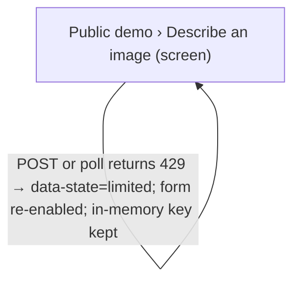
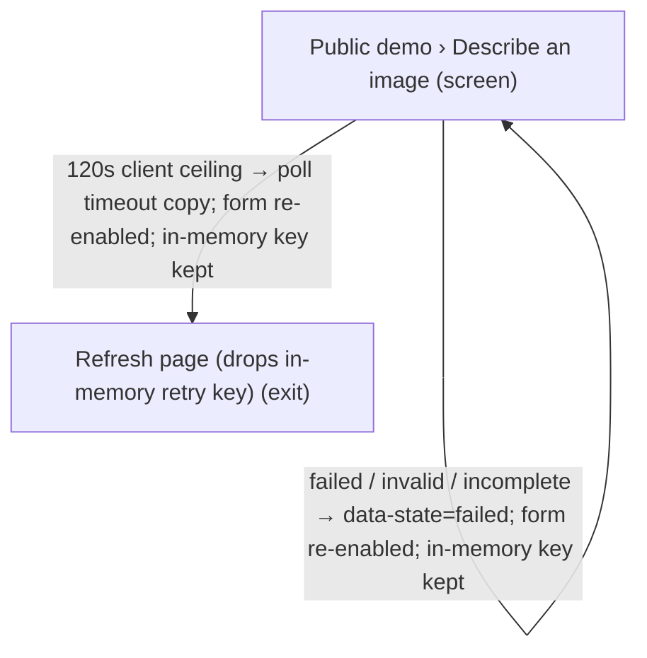
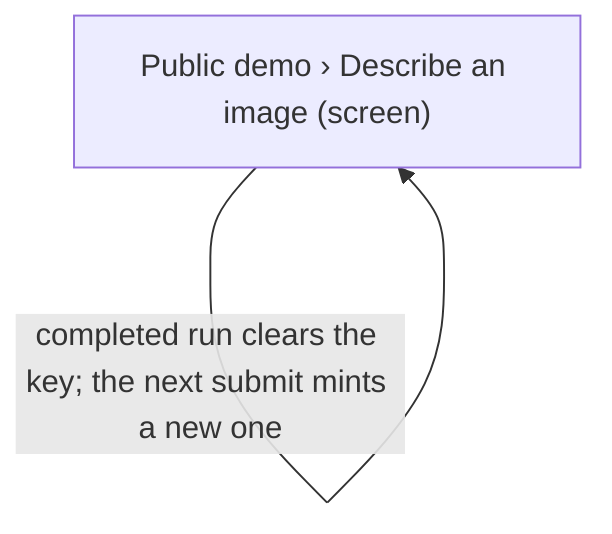

# UX Map — public-demo-describe

**Product:** `alt-context WP plugin public demo — [acx_demo_describe] anonymous describe widget`
**Source fixture:** `apps/prototype-wp-alt-context/src/public/class-public-demo-shortcode.php`

Render status: hand-rendered from the sibling `.uxmap.json` using this repo's `render_ux_maps.py` ASCII/table helpers. Critique 10316 ran the unchanged 8-rule pack via Pydantic `model_validate(extra=allow)` and retained local extensions; official strict `extra=forbid` still fails 4 extras. Do not treat that as an official schema/critique/gate pass. See `public-demo-describe.notes.md`.

## Goals
- Inventory OBSERVED-UI public-demo states from the shortcode and client: idle selection, queued, warming, describing, complete generic alt text, 429 limited, error/failed, and the 120-second poll ceiling (INT-10, RES-02, RES-03).
- Record OBSERVED-FEATURE wire on this branch, not production: completed nonempty public envelopes emit description_tier; the parser and pollRun preserve provisional_cpu | final_gpu | null, and a missing legacy field becomes explicit null. Keep PROPOSED visible-tier labels out of the observed UI inventory. Do not infer from gpu_state (HAI-05, HAI-08, PROV-06, DATA-13, rg-015).
- Keep PROPOSED same-run resume bounded to the existing in-flight owner plus the in-memory idempotency key. Refresh drops that key. Do not invent a new paid job, do not raise the 120-second ceiling, and do not weaken authorization for terminal-run reads (API-02, API-04, RLSE-03).

## Jobs
- `describe-allowlisted-image` — Choose one operator-curated image and receive a generic alt-text draft
- `retry-same-trigger` — Retry the same in-page trigger without minting a new idempotency key

## Screens
| id | kind | route | title |
| --- | --- | --- | --- |
| `public-demo-describe` | screen | `[acx_demo_describe]` | Public demo › Describe an image |
| `public-demo-unavailable` | screen | `[acx_demo_describe]` | Public demo › Unavailable |
| `refresh-page-drops-retry-key` | exit | `[acx_demo_describe] (browser refresh)` | Refresh page (drops in-memory retry key) |

### Public demo › Describe an image (`public-demo-describe`)

Purpose: OBSERVED visitor widget. Domain vocabulary behind canonical states: idle selection = default; queued, warming and describing = loading; no allowlisted images is a different screen; 429 limited = degraded; failed, invalid response, incomplete result and 120s poll timeout = error. Complete UI is generic alt text. On this feature branch the completed envelope may include description_tier; the rendered label does not. Production is not deployed. Serves job describe-allowlisted-image.

Action states: idle, in_flight, completed, failed, limited, timeout

| zone id | label | role | states |
| --- | --- | --- | --- |
| `z-media-choice` | OBSERVED image picker — idle radios are instance-scoped (acx-demo-media-N) and read from the submitting form only. Empty-selection submit stays on this screen as error copy. No images is public-demo-unavailable, not this zone. | form | default, loading, error |
| `z-submit` | OBSERVED primary Describe selected image — enabled in idle, completed, failed, limited and timeout; disabled in in_flight. Same control retries; key reuse is in-memory only. | job | default, loading, error, degraded |
| `z-status` | OBSERVED polite status — idle, queued, warming, describing, completed, limited (HTTP 429), failed, client error, 120s poll timeout. Icon plus token color. Envelope gpu_state is accepted and unused; it is lifecycle telemetry, not DescriptionResultTier. Parsed description_tier does not change this generic completed label. | status | default, loading, error, degraded |
| `z-result` | OBSERVED-UI completed result is generic alt_text_draft with focus move and the generic completed label. OBSERVED-FEATURE completed envelopes carry description_tier (provisional_cpu \| final_gpu \| null; missing legacy is null) unused by presentation. OBSERVED-PRODUCTION is not deployed and has no Qwen proof. PROPOSED visible-tier labels are absent and must not be inferred from gpu_state. | ai_review | default, empty |

```
+------------------------------------------------------------+
| Public demo › Describe an image  [screen]  [acx_demo_descr…|
| OBSERVED visitor widget. Domain vocabulary behind canonica…|
+------------------------------------------------------------+
| ZONES                                                      |
|   - OBSERVED image picker — idle radios are instance-scope…|
|   - OBSERVED primary Describe selected image — enabled in …|
|   - OBSERVED polite status — idle, queued, warming, descri…|
|   - OBSERVED completed result is generic alt_text_draft wi…|
+------------------------------------------------------------+
| ACTIONS                                                    |
| when idle                                                  |
|   [PRIMARY] Describe selected image                        |
| when in_flight                                             |
|   No action (silent)                                       |
| when completed                                             |
|   [PRIMARY] Describe selected image                        |
| when failed                                                |
|   [PRIMARY] Describe selected image                        |
| when limited                                               |
|   [PRIMARY] Describe selected image                        |
| when timeout                                               |
|   [PRIMARY] Describe selected image                        |
+------------------------------------------------------------+
| states: default | loading | error | degraded               |
+------------------------------------------------------------+
```

### Public demo › Unavailable (`public-demo-unavailable`)

Purpose: OBSERVED PHP shortcode substitutes when the widget cannot run. Demo flag off = degraded limited copy. Allowlist empty or unreadable = error copy. No form, no client, no paid dispatch. Serves neither job until an operator enables the demo and curates media.

| zone id | label | role | states |
| --- | --- | --- | --- |
| `z-unavailable-status` | OBSERVED substitute status — limited when the demo is disabled; error when no demo images are available. Not a describe-run phase. | status | error, degraded |

```
+------------------------------------------------------------+
| Public demo › Unavailable  [screen]  [acx_demo_describe]   |
| OBSERVED PHP shortcode substitutes when the widget cannot …|
+------------------------------------------------------------+
| ZONES                                                      |
|   - OBSERVED substitute status — limited when the demo is …|
+------------------------------------------------------------+
| ACTIONS                                                    |
|   No action (silent)                                       |
+------------------------------------------------------------+
| states: error | degraded                                   |
+------------------------------------------------------------+
```

### Refresh page (drops in-memory retry key) (`refresh-page-drops-retry-key`)

Purpose: OBSERVED: a full page load drops the in-memory idempotency key and the in-memory run_id. Timeout copy currently tells the visitor to refresh. PROPOSED durable resume is not this exit and is not implemented.

| zone id | label | role | states |
| --- | --- | --- | --- |
| `z-refresh-consequence` | OBSERVED refresh consequence — in-memory retry key is gone. Same-page retry would have retained it. Do not claim a new paid job is proven or disproven after refresh. | status | default |

```
+------------------------------------------------------------+
| Refresh page (drops in-memory retry key)  [exit]  [acx_dem…|
| OBSERVED: a full page load drops the in-memory idempotency…|
+------------------------------------------------------------+
| ZONES                                                      |
|   - OBSERVED refresh consequence — in-memory retry key is …|
+------------------------------------------------------------+
| ACTIONS                                                    |
|   No action (silent)                                       |
+------------------------------------------------------------+
| states: default                                            |
+------------------------------------------------------------+
```

## Actions

| id | verb | target | hierarchy | costly | irreversible | preview required | screen id | when (recovery state) |
| --- | --- | --- | --- | --- | --- | --- | --- | --- |
| `submit-describe` | Describe selected image | `POST /acx/v1/public/demo/describe` | primary | yes | no | no | `public-demo-describe` | idle, completed, failed, limited, timeout |

## Flows
### OBSERVED: select image, wait, generic alt text (`observed-happy-path`)

```mermaid
flowchart TD
  %% flow: OBSERVED: select image, wait, generic alt text job=describe-allowlisted-image
  %% steps: [{"screen_id":"public-demo-describe","branch_label":"idle selection (instance-scoped radio in this form) → POST describe"},{"screen_id":"public-demo-describe","branch_label":"queued → warming → describing (client poll, 120s ceiling)"},{"screen_id":"public-demo-describe","branch_label":"completed generic UI label and alt text; envelope description_tier is not shown"}]
  n_public_demo_describe["Public demo › Describe an image (screen)"]
  n_public_demo_describe -->|idle selection (instance-scoped radio in this form) → POST describe| n_public_demo_describe
  n_public_demo_describe -->|queued → warming → describing (client poll, 120s ceiling)| n_public_demo_describe
  n_public_demo_describe -->|completed generic UI label and alt text; envelope description_tier is not shown| n_public_demo_describe
```

### OBSERVED: HTTP 429 bulkhead or rate limit (`observed-429-limited`)



### OBSERVED: failed pipeline, invalid envelope, or 120s poll timeout (`observed-error-or-timeout`)



### OBSERVED: same-page retry reuses the in-memory key (`observed-same-page-retry`)



## Open questions
- PROPOSED UI, not implemented: show typed complete labels from parsed description_tier (final_gpu → GPU description complete; provisional_cpu → CPU fallback draft, not GPU final; null → Description complete, processing tier unavailable). Description text stays separate. Live polite and focus stay. Never from gpu_state. OBSERVED-FEATURE wire exists on this branch; OBSERVED-PRODUCTION is not deployed and has no Qwen proof.
- PROPOSED INT-07, not implemented: a clearly marked illustrative example before the visitor explicitly chooses Describe. Not a fake live or GPU receipt. Never substitute the example for the actual result. Keep submit-describe.preview_required false until that ships; allowlist thumbnails are input choices, not outcome samples.
- PROPOSED, not implemented: same-run resume after refresh or after the 120s poll ceiling. Bound remains existing inflight owner + idempotency; not a new paid job; 120s per-poll ceiling stays; bulkhead and nonce/allowlist stay.
- Design question, not a slice: how can a visitor securely re-read a terminal run after inflight is released (status today returns 403 run_not_available) without weakening authorization? A durable handle must not become an unauthenticated run oracle.

## Suggested task-slice decomposition (from map)

1. PROPOSED UI follow-up, not this map: render the three visible-tier labels from parsed description_tier. Do not derive from gpu_state. Do not treat the on-feature wire as production or as shipped UI.
2. PROPOSED INT-07 follow-up, not this map: a clearly marked illustrative example before explicit live Describe. Not a fake live or GPU receipt. Never substitute the example for the actual result. Keep submit-describe.preview_required false until that ships.
3. PROPOSED follow-up, not this map: same-run resume using existing owner plus idempotency only. Keep the 120s ceiling, inflight bulkhead, nonce, and allowlist.
4. Design-question follow-up, not this map: secure durable handle for terminal-run read after inflight release. No authorization weakening.

## Domain state mapping

| domain state(s) | canonical state |
| --- | --- |
| `idle`, `completed` | `default` |
| `queued`, `warming`, `describing`, `in_flight` | `loading` |
| `limited` | `degraded` |
| `failed`, `error`, `timeout` | `error` |

## Parity index

Consumer-checked (not official `ux-map` / Pydantic schema) by
`js/admin/__tests__/uxmap-parity.test.ts` and
`js/admin/__tests__/uxmap-render-parity.test.ts` after this slice's enrollment: every id,
state, and verbatim label below must exist in the sibling `.uxmap.json`, and no `z-*`/`act-*`
id may appear here that the JSON does not define. Critique 10316 used extra=allow; official
strict extra=forbid still fails 4 extras. Do not treat this index as a RULE_PACK or schema
pass. Hand-rendered; regenerate with `docs/ux-maps/render_ux_maps.py` once the canvas package
is available — never hand-edit one side.

Zone ids: z-media-choice z-submit z-status z-result z-unavailable-status z-refresh-consequence

Action ids: submit-describe

Zone labels (verbatim; the tables above escape `|` for markdown, this list does not):

- OBSERVED image picker — idle radios are instance-scoped (acx-demo-media-N) and read from the submitting form only. Empty-selection submit stays on this screen as error copy. No images is public-demo-unavailable, not this zone.
- OBSERVED primary Describe selected image — enabled in idle, completed, failed, limited and timeout; disabled in in_flight. Same control retries; key reuse is in-memory only.
- OBSERVED polite status — idle, queued, warming, describing, completed, limited (HTTP 429), failed, client error, 120s poll timeout. Icon plus token color. Envelope gpu_state is accepted and unused; it is lifecycle telemetry, not DescriptionResultTier. Parsed description_tier does not change this generic completed label.
- OBSERVED-UI completed result is generic alt_text_draft with focus move and the generic completed label. OBSERVED-FEATURE completed envelopes carry description_tier (provisional_cpu | final_gpu | null; missing legacy is null) unused by presentation. OBSERVED-PRODUCTION is not deployed and has no Qwen proof. PROPOSED visible-tier labels are absent and must not be inferred from gpu_state.
- OBSERVED substitute status — limited when the demo is disabled; error when no demo images are available. Not a describe-run phase.
- OBSERVED refresh consequence — in-memory retry key is gone. Same-page retry would have retained it. Do not claim a new paid job is proven or disproven after refresh.

States (all zones and screens): default loading error degraded empty

## Not doing
- Do not treat this map as the admin describe-gpu-tier map. Admin GPU chip, provisional/final badges, and gpu_state presentation are operator SPA, not public demo.
- Do not infer CPU-fallback, GPU-final, or unknown description-tier UI from envelope gpu_state. That field is optional lifecycle telemetry and is unused by presentation.
- Do not treat the on-feature description_tier wire as shipped UI or as production. Production is not deployed and there is no Qwen-on-GPU proof.
- Do not set submit-describe.preview_required true until an illustrative-example preview is implemented. Allowlist thumbnails are input, not outcome samples (INT-07).
- Do not invent extra states on the refresh exit. kind=exit and states=default are correct; RLSE-04 warning is a scope mismatch, not a missing journey (RLSE-04).
- Do not claim official ux-map critique, schema, or gate passed. Critique 10316 used extra=allow; official strict extra=forbid still fails 4 local extras.
- Do not claim refresh-safe resume is implemented. Refresh drops the in-memory retry key and run_id.
- Do not claim same-page retry already proven to create duplicate paid jobs. Same-page retry reuses the key; duplicate-dispatch behaviour after refresh is not claimed here.
- Do not raise the public 120-second poll ceiling to the server warmup-plus-inference deadline.
- Do not add a new paid job, upload field, or URL input to resume or retry.
- Do not weaken public status authorization to read arbitrary run_ids after inflight release.
