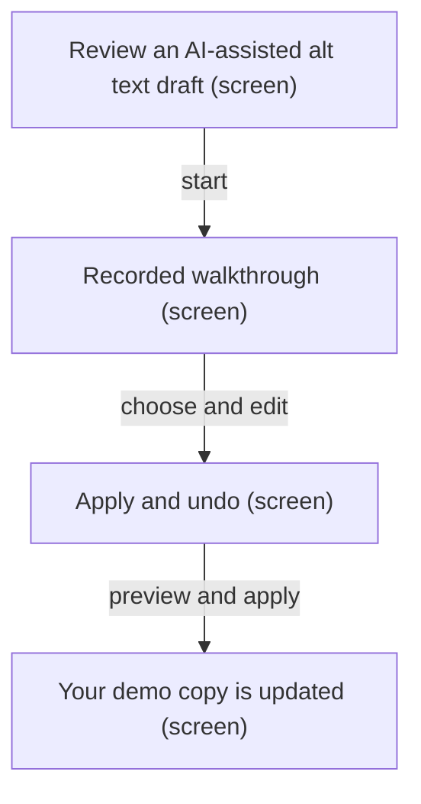
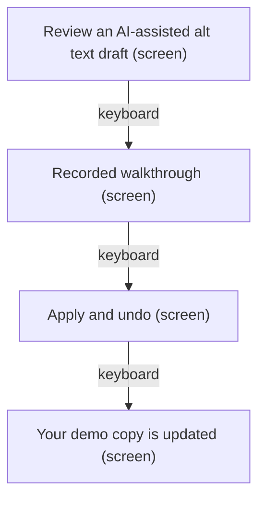
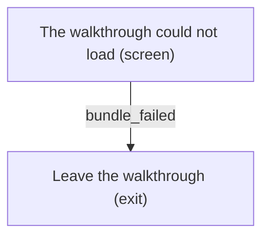
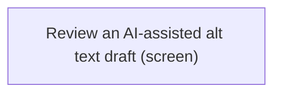

# UX Map — public-guide

**Product:** `AltContext — signed-out public recorded guide`
**Source fixture:** `apps/prototype-wp-alt-context/js/guide/main.tsx`

## Goals
- Anyone can try the recorded review workflow at /guide/ signed-out; live generation and WordPress writes stay on the authenticated admin route.
- NAV-08: the first screen shows three plain-language entry actions — Start the walkthrough, Watch the recording, Read the case study.
- NAV-07: public scope renders an escape-hatch link to the site home and to the case study.
- SECD-02/03: the public route performs no REST calls; /acx/v1/public/demo/describe stays gated by acx_public_demo_enabled and is expected off unless retained.
- Bundle-failure still returns 200 with canonical and the fallback paragraph from publicGuideCopy.ts.

## Jobs
- `try-recorded` — Try the recorded review workflow signed-out
- `leave-safely` — Leave the walkthrough without authenticating

## Screens
| id | kind | route | title |
| --- | --- | --- | --- |
| `entry` | screen | `/guide/` | Review an AI-assisted alt text draft |
| `walkthrough` | screen | `/guide/` | Recorded walkthrough |
| `apply` | screen | `/guide/` | Apply and undo |
| `outcome` | screen | `/guide/` | Your demo copy is updated |
| `fallback` | screen | `/guide/` | The walkthrough could not load |
| `escape` | exit | `/` | Leave the walkthrough |

### Review an AI-assisted alt text draft (`entry`)

Purpose: Signed-out public entrance. Scope copy, key scope.public: Try the review workflow using a recorded example. Your changes affect only the demo copy in this tab. Three entry actions (NAV-08): Start the walkthrough, Watch the recording, Read the case study. Escape hatch (NAV-07): Home and Case study. first_time is the first visit with no in-tab state. error is domain disabled_404: AltContext\PublicSite\PublicGuideRoute returns the theme 404 when acx_public_guide_enabled is off — never this guide.

| zone id | label | role | states |
| --- | --- | --- | --- |
| `public-escape` | Leave the walkthrough. Home. Case study. | nav | default, first_time |
| `guided-scope` | Try the review workflow using a recorded example. Your changes affect only the demo copy in this tab. | content | default, first_time |
| `entry-cta` | Start the walkthrough (primary). Watch the recording. Read the case study. | nav | default, first_time |

```
+------------------------------------------------------------+
| Review an AI-assisted alt text draft  [screen]  /guide/    |
| Signed-out public entrance.                                |
+------------------------------------------------------------+
| ZONES                                                      |
|   - Leave the walkthrough. Home. Case study. (nav) states=…|
|   - Try the review workflow using a recorded example. Your…|
|   - Start the walkthrough (primary). Watch the recording. …|
+------------------------------------------------------------+
| ACTIONS                                                    |
|   [PRIMARY] Start the walkthrough -> walkthrough           |
|   [secondary] Watch the recording -> escape                |
|   [secondary] Read the case study -> escape                |
+------------------------------------------------------------+
| states: default | first_time | error                       |
+------------------------------------------------------------+
```

### Recorded walkthrough (`walkthrough`)

Purpose: RecordedWalkthrough scope=public: understand the page, choose names, edit the sample draft. Bundled example plus in-tab state. No import path from js/guide/** may reach js/admin/api/** or GuidedLiveDescriptionPanel. edge_input: a face is still undecided. error: sample draft unavailable. Keyboard completes choose → edit → preview.

| zone id | label | role | states |
| --- | --- | --- | --- |
| `guided-demo-root` | Public mount. data-scope=public. Recorded example only; changes stay in this tab. | content | default, edge_input, error |
| `guided-section-understand` | Understand the page. Festival photo, page context, current demo alt text. Review name suggestions. | content | default |
| `name-choice-left` | Left face native fieldset. Use Justin Trudeau. Leave this person unnamed. No preselection. edge_input: Choose an option for this face. | form | default, edge_input |
| `name-choice-right` | Right face native fieldset. Use Katy Perry. Leave this person unnamed. No preselection. edge_input: Choose an option for this face. | form | default, edge_input |
| `guided-candidate` | Edit the alt text. Sample draft from the recorded example. Preview the change. error: The sample draft for these choices is unavailable. | form | default, error |

```
+------------------------------------------------------------+
| Recorded walkthrough  [screen]  /guide/                    |
| RecordedWalkthrough scope=public: understand the page, cho…|
+------------------------------------------------------------+
| ZONES                                                      |
|   - Public mount. data-scope=public. Recorded example only…|
|   - Understand the page. Festival photo, page context, cur…|
|   - Left face native fieldset. Use Justin Trudeau. Leave t…|
|   - Right face native fieldset. Use Katy Perry. Leave this…|
|   - Edit the alt text. Sample draft from the recorded exam…|
+------------------------------------------------------------+
| ACTIONS                                                    |
|   [PRIMARY] Review name suggestions -> apply               |
|   [secondary] Preview the change -> apply (preview)        |
+------------------------------------------------------------+
| states: default | edge_input | error                       |
+------------------------------------------------------------+
```

### Apply and undo (`apply`)

Purpose: Compare current alt text with the draft. Apply to demo copy changes only the in-tab demo image. Undo last application restores the previous demo alt text. empty: there is no application to undo yet, or no differing preview. error: stale preview — The draft changed. Preview it again before applying.

| zone id | label | role | states |
| --- | --- | --- | --- |
| `guided-section-apply` | Apply and undo. Current alt text beside Will be applied. Apply to demo copy. Undo last application. | content | default, empty, error |
| `demo-applied-image` | Demo image preview. Distinct demo image whose alternative is the current demo copy. | ai_review | default |

```
+------------------------------------------------------------+
| Apply and undo  [screen]  /guide/                          |
| Compare current alt text with the draft.                   |
+------------------------------------------------------------+
| ZONES                                                      |
|   - Apply and undo. Current alt text beside Will be applie…|
|   - Demo image preview. Distinct demo image whose alternat…|
+------------------------------------------------------------+
| ACTIONS                                                    |
|   [PRIMARY] Apply to demo copy -> outcome (preview)        |
|   [secondary] Undo last application -> apply               |
+------------------------------------------------------------+
| states: default | empty | error                            |
+------------------------------------------------------------+
```

### Your demo copy is updated (`outcome`)

Purpose: Completion summary after Apply to demo copy. Applied to the demo copy in this tab. WordPress media has not been updated. Direct refresh of /guide/ restores first-visit state; in-tab history is not persisted.

| zone id | label | role | states |
| --- | --- | --- | --- |
| `demo-outcome` | Your demo copy is updated. Applied to the demo copy in this tab. WordPress media has not been updated. Return to the draft. | status | default |

```
+------------------------------------------------------------+
| Your demo copy is updated  [screen]  /guide/               |
| Completion summary after Apply to demo copy.               |
+------------------------------------------------------------+
| ZONES                                                      |
|   - Your demo copy is updated. Applied to the demo copy in…|
+------------------------------------------------------------+
| ACTIONS                                                    |
|   [PRIMARY] Return to the draft -> walkthrough             |
+------------------------------------------------------------+
| states: default                                            |
+------------------------------------------------------------+
```

### The walkthrough could not load (`fallback`)

Purpose: Domain bundle_failed mapped to error. js/guide/main.tsx hides .acx-public-guide__fallback on mount; if ViteManifest entry_assets returns null the template still renders 200 plus canonical and the paragraph stays visible. Copy from publicGuideCopy.ts PUBLIC_GUIDE_FALLBACK.

| zone id | label | role | states |
| --- | --- | --- | --- |
| `public-guide-fallback` | The walkthrough could not load. Reload the page, or watch the recorded video on the case study page. | status | error |

```
+------------------------------------------------------------+
| The walkthrough could not load  [screen]  /guide/          |
| Domain bundle_failed mapped to error.                      |
+------------------------------------------------------------+
| ZONES                                                      |
|   - The walkthrough could not load. Reload the page, or wa…|
+------------------------------------------------------------+
| ACTIONS                                                    |
|   [PRIMARY] Reload the page -> entry                       |
|   [secondary] Watch the recorded video on the case study p…|
+------------------------------------------------------------+
| states: error                                              |
+------------------------------------------------------------+
```

### Leave the walkthrough (`escape`)

Purpose: NAV-07 escape hatch from public scope: Home uses escapeHref (site home). Case study uses CASE_STUDY_URL in publicGuideCopy.ts. No authentication required.

| zone id | label | role | states |
| --- | --- | --- | --- |
| `escape-home` | Home | nav | default |
| `escape-case-study` | Case study | nav | default |

```
+------------------------------------------------------------+
| Leave the walkthrough  [exit]  /                           |
| NAV-07 escape hatch from public scope: Home uses escapeHre…|
+------------------------------------------------------------+
| ZONES                                                      |
|   - Home (nav) states=[default]                            |
|   - Case study (nav) states=[default]                      |
+------------------------------------------------------------+
| ACTIONS                                                    |
|   [PRIMARY] Home -> escape                                 |
|   [secondary] Case study -> escape                         |
+------------------------------------------------------------+
| states: default                                            |
+------------------------------------------------------------+
```

## Actions

| id | verb | target | hierarchy | costly | irreversible | preview required | screen id |
| --- | --- | --- | --- | --- | --- | --- | --- |
| `start-walkthrough` | Start the walkthrough | `walkthrough` | primary | no | no | no | `entry` |
| `watch-recording` | Watch the recording | `escape` | secondary | no | no | no | `entry` |
| `read-case-study` | Read the case study | `escape` | secondary | no | no | no | `entry` |
| `continue-walkthrough` | Review name suggestions | `apply` | primary | no | no | no | `walkthrough` |
| `preview-draft` | Preview the change | `apply` | secondary | no | no | yes | `walkthrough` |
| `demo-apply` | Apply to demo copy | `outcome` | primary | no | no | yes | `apply` |
| `demo-undo` | Undo last application | `apply` | secondary | no | no | no | `apply` |
| `return-to-draft` | Return to the draft | `walkthrough` | primary | no | no | no | `outcome` |
| `reload-guide` | Reload the page | `entry` | primary | no | no | no | `fallback` |
| `watch-from-fallback` | Watch the recorded video on the case study page | `escape` | secondary | no | no | no | `fallback` |
| `go-home` | Home | `escape` | primary | no | no | no | `escape` |
| `go-case-study` | Case study | `escape` | secondary | no | no | no | `escape` |

## Flows

### Signed-out choose → edit → preview → apply → undo (`signed-out-core`)



### Direct reload of /guide/ keeps the page working (`direct-refresh`)


### Pixel 7 keyboard-only completion (`mobile-keyboard`)



### Guide bundle aborted; fallback paragraph stays visible (`bundle-failure`)



### acx_public_guide_enabled off: theme 404, never the guide (`disabled-route-404`)



## Open questions
- Does a signed-out visitor who bookmarks /guide/#state deep-link anywhere, or is in-tab state always first_time after refresh?
- Should Watch the recording deep-link a timestamp on the case-study video, or only the case-study URL?

## Suggested task-slice decomposition (from map)

1. Enable route with acx_public_guide_enabled and rewrite flush (deploy-enable).
2. Public RecordedWalkthrough scope with escape hatch and three entry actions (sibling TS lane).
3. PHP PublicGuideRoute 404 when disabled; standalone template when on (sibling PHP lane).
4. Signed-out Playwright acceptance under project public-guide.

## Domain state mapping

| domain state(s) | canonical state |
| --- | --- |
| `disabled_404` | `error` |
| `bundle_failed` | `error` |

## Parity index

Machine-checked by `js/admin/__tests__/uxmap-parity.test.ts` and
`js/admin/__tests__/uxmap-render-parity.test.ts`: every id, state, and verbatim label
below must exist in the sibling `.uxmap.json`, and no `z-*`/`act-*` id may appear here
that the JSON does not define. Regenerate with `docs/ux-maps/render_ux_maps.py` — never
hand-edit one side.

Zone ids: public-escape guided-scope entry-cta guided-demo-root guided-section-understand name-choice-left name-choice-right guided-candidate guided-section-apply demo-applied-image demo-outcome public-guide-fallback escape-home escape-case-study

Action ids: start-walkthrough watch-recording read-case-study continue-walkthrough preview-draft demo-apply demo-undo return-to-draft reload-guide watch-from-fallback go-home go-case-study

Zone labels (verbatim; the tables above escape `|` for markdown, this list does not):

- Leave the walkthrough. Home. Case study.
- Try the review workflow using a recorded example. Your changes affect only the demo copy in this tab.
- Start the walkthrough (primary). Watch the recording. Read the case study.
- Public mount. data-scope=public. Recorded example only; changes stay in this tab.
- Understand the page. Festival photo, page context, current demo alt text. Review name suggestions.
- Left face native fieldset. Use Justin Trudeau. Leave this person unnamed. No preselection. edge_input: Choose an option for this face.
- Right face native fieldset. Use Katy Perry. Leave this person unnamed. No preselection. edge_input: Choose an option for this face.
- Edit the alt text. Sample draft from the recorded example. Preview the change. error: The sample draft for these choices is unavailable.
- Apply and undo. Current alt text beside Will be applied. Apply to demo copy. Undo last application.
- Demo image preview. Distinct demo image whose alternative is the current demo copy.
- Your demo copy is updated. Applied to the demo copy in this tab. WordPress media has not been updated. Return to the draft.
- The walkthrough could not load. Reload the page, or watch the recorded video on the case study page.
- Home
- Case study

States (all zones and screens): default first_time error edge_input empty

## Not doing
- Live generation or GuidedLiveDescriptionPanel on the public route.
- REST calls from js/guide/** to acx/v1, including /public/demo/describe.
- Implicit enable of acx_public_guide_enabled from deploy-demo.
- Creating AltContext\PublicSite\PublicGuideRoute in this lane (sibling owns src/public/class-public-guide-route.php).
