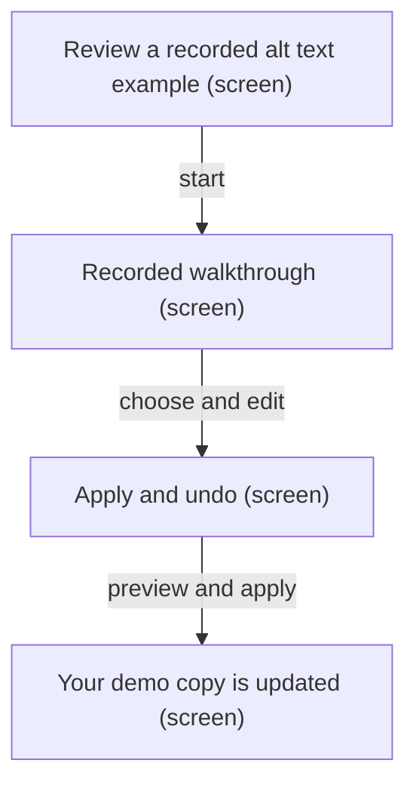
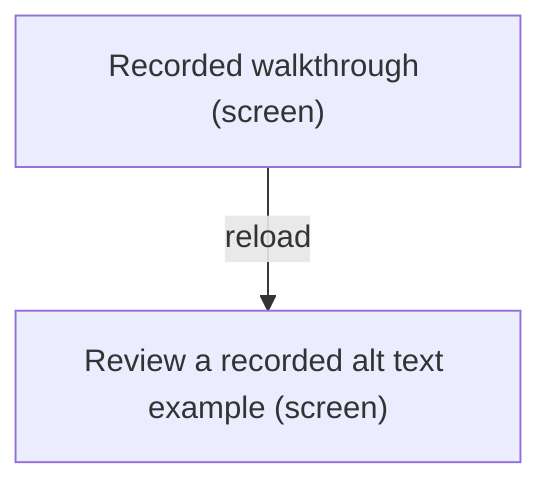
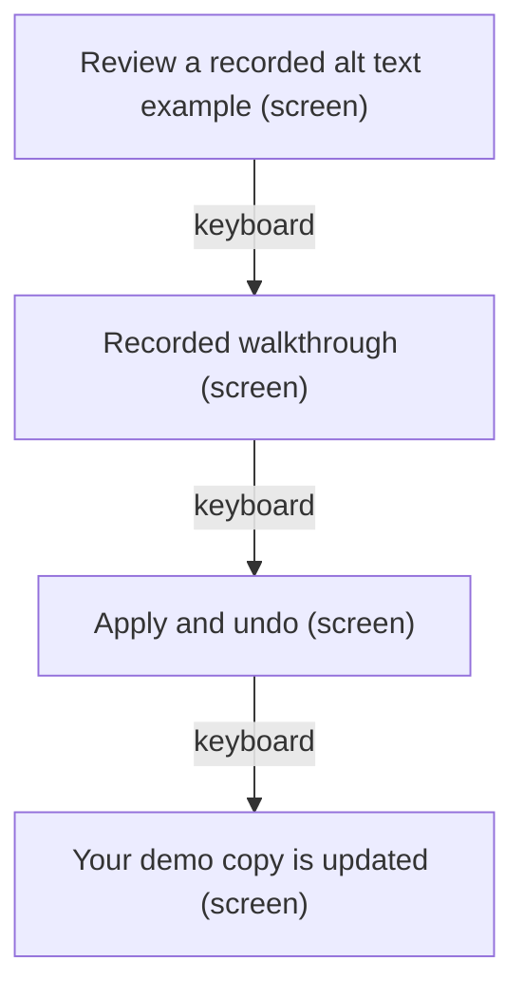
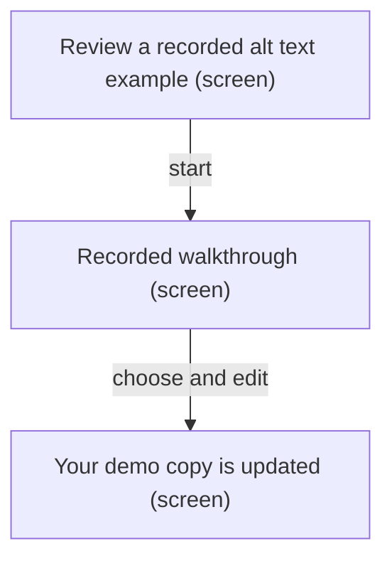
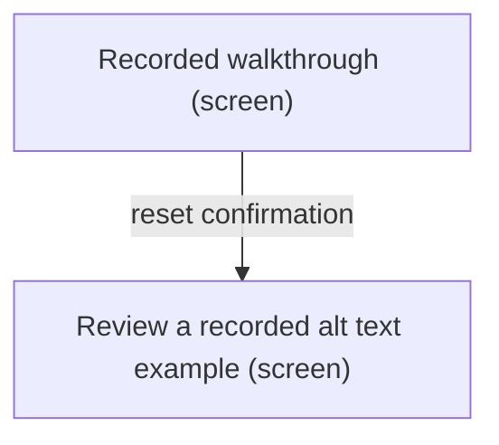
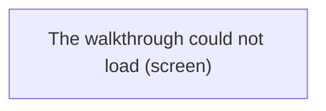
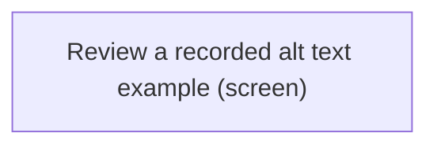

# UX Map — public-guide

**Product:** `AltContext — signed-out public recorded guide`
**Source fixture:** `apps/prototype-wp-alt-context/js/guide/main.tsx`

## Goals
- Anyone can try the recorded review workflow at /guide/ signed-out; live generation and WordPress writes stay on the authenticated admin route.
- NAV-08: the first screen shows two plain-language entry actions — Start the walkthrough and Read the case study.
- NAV-07: public scope renders a fixed pair of external product links — Home at https://altcontext.com/ and the case study at https://darce.xyz/projects/altcontext/.
- SECD-02/03: the public route performs no REST calls; /acx/v1/public/demo/describe stays gated by acx_public_demo_enabled and is expected off unless retained.
- Bundle-failure still returns 200 with canonical and the PUBLIC_GUIDE_FALLBACK paragraph.
- Detailed engine metadata stays in the notes while the recorded provenance summary is visible on screen in the section footer.

## Jobs
- `try-recorded` — Try the recorded review workflow signed-out
- `leave-safely` — Leave the walkthrough without authenticating

## Screens
| id | kind | route | title |
| --- | --- | --- | --- |
| `entry` | screen | `/guide/` | Review a recorded alt text example |
| `walkthrough` | screen | `/guide/` | Recorded walkthrough |
| `apply` | screen | `/guide/` | Apply and undo |
| `outcome` | screen | `/guide/` | Your demo copy is updated |
| `fallback` | screen | `/guide/` | The walkthrough could not load |
| `escape` | exit | `/` | Leave the walkthrough |

### Review a recorded alt text example (`entry`)

Purpose: Signed-out public entrance. Public title and introduction explain the supplied festival example; scope.public: This is a supplied example roster with recorded drafts. Your choices change only the demo copy in this tab; they do not update WordPress or a server roster. Two entry actions (NAV-08): Start the walkthrough and Read the case study. Escape hatch (NAV-07): Home and Case study. first_time is the first visit with no in-tab state. error is domain disabled_404: AltContext\PublicSite\PublicGuideRoute returns the theme 404 when acx_public_guide_enabled is off — never this guide.

| zone id | label | role | states |
| --- | --- | --- | --- |
| `public-escape` | Leave the walkthrough. Home. Case study. | nav | default, first_time |
| `guided-scope` | Supplied example roster with recorded drafts. Choices affect only the demo copy in this tab; no WordPress or server roster update. | content | default, first_time |
| `entry-cta` | Start the walkthrough (primary). Read the case study. | nav | default, first_time |

```
+------------------------------------------------------------+
| Review a recorded alt text example  [screen]  /guide/      |
| Signed-out public entrance. Public title and introduction… |
+------------------------------------------------------------+
| ZONES                                                      |
|   - Leave the walkthrough. Home. Case study. (nav) states… |
|   - Supplied example roster with recorded drafts. Choices… |
|   - Start the walkthrough (primary). Read the case study.… |
+------------------------------------------------------------+
| ACTIONS                                                    |
|   [PRIMARY] Start the walkthrough -> walkthrough           |
|   [secondary] Read the case study -> escape                |
+------------------------------------------------------------+
| states: default | first_time | error                       |
+------------------------------------------------------------+
```

### Recorded walkthrough (`walkthrough`)

Purpose: RecordedWalkthrough scope=public: understand the supplied page context, then review the two bundled press photos stacked in .acx-guided-page__media-list. Each figure has a 1 / 1 image frame, visible Photo credit, one collapsed AltText.ai comparison disclosure, and its own current description in the sample image alt. One "People recognised in this photo" article sits in the .acx-guided-page__faces column on the right with both people's name choices; this column moves below the photo below 56.25rem. Face outlines pin on click. The three-paragraph provenance footer sits below the figures. After name choices, the public editor shows the current description and one editable draft for each photo; the sample image is the demo image and there is no second applied-preview image. Changes stay in the tab. Recognition and GPU generation are cached and never run per visitor. No import path from js/guide/** may reach js/admin/api/** or GuidedLiveDescriptionPanel. edge_input: a name choice is still undecided. error: a photo's sample draft unavailable. Keyboard completes choose → edit → use.

| zone id | label | role | states |
| --- | --- | --- | --- |
| `guided-demo-root` | Public mount. data-scope=public. Supplied roster and recorded drafts only; changes stay in this tab. | content | default, edge_input, error |
| `guided-section-understand` | Understand the page and provenance. The context paragraph appears above .acx-guided-page__media-list, where Tribeca and Coachella are stacked. Each figure has one 1 / 1 sample image whose alt is the current description, a visible Photo credit, one collapsed AltText.ai comparison disclosure, and a right-hand "People recognised in this photo" article with both name choices. The faces column moves below the photo below 56.25rem. Face outlines pin on click. The three-paragraph provenance footer follows the figures. Review the current image descriptions, comparison captions, credits, and recorded source details. | content | default |
| `name-choice-tribeca-left` | Justin Trudeau roster entry for the Tribeca figure's "People recognised in this photo" article in the right-hand .acx-guided-page__faces column. Use Justin Trudeau. Leave this person unnamed. No preselection. edge_input: Choose an option for this person. One Tribeca 89.4% strong crop is visible. | form | default, edge_input |
| `name-choice-tribeca-right` | Katy Perry roster entry for the Tribeca figure's "People recognised in this photo" article in the right-hand .acx-guided-page__faces column. Use Katy Perry. Leave this person unnamed. No preselection. edge_input: Choose an option for this person. One Tribeca 100.0% strong cluster-anchor crop is visible. | form | default, edge_input |
| `name-choice-coachella-left` | Justin Trudeau roster entry for the Coachella figure's "People recognised in this photo" article in the right-hand .acx-guided-page__faces column. Use Justin Trudeau. Leave this person unnamed. No preselection. edge_input: Choose an option for this person. One Coachella 70.2% strong crop is visible. | form | default, edge_input |
| `name-choice-coachella-right` | Katy Perry roster entry for the Coachella figure's "People recognised in this photo" article in the right-hand .acx-guided-page__faces column. Use Katy Perry. Leave this person unnamed. No preselection. edge_input: Choose an option for this person. One Coachella 56.7% weak crop is below the 60.0% displayed threshold and is still grouped by the production clusterer. | form | default, edge_input |

```
+------------------------------------------------------------+
| Recorded walkthrough  [screen]  /guide/                    |
| RecordedWalkthrough scope=public: understand the supplied… |
+------------------------------------------------------------+
| ZONES                                                      |
|   - Public mount. data-scope=public. Supplied roster and … |
|   - Understand the page and provenance. The context parag… |
|   - Justin Trudeau roster entry for the Tribeca figure's … |
|   - Katy Perry roster entry for the Tribeca figure's "Peo… |
|   - Justin Trudeau roster entry for the Coachella figure'… |
|   - Katy Perry roster entry for the Coachella figure's "P… |
+------------------------------------------------------------+
| ACTIONS                                                    |
|   [PRIMARY] Review name suggestions -> apply               |
|   [secondary] Keep current alt text -> outcome             |
|   [secondary] Preview the change -> apply (preview)        |
|   [secondary] Reset demo -> walkthrough (irreversible)     |
+------------------------------------------------------------+
| states: default | edge_input | error                       |
+------------------------------------------------------------+
```

### Apply and undo (`apply`)

Purpose: For each photo, review the current description beside its editable recorded draft. Use this description updates that sample photo's alt in this tab; Undo this change restores its previous description. The public editor has no separate applied-preview image. empty: there is no change to undo. error: the draft is empty or unchanged, or its recorded sample is unavailable.

| zone id | label | role | states |
| --- | --- | --- | --- |
| `guided-section-apply` | Review and edit the current description for each photo. Use this description changes only that sample photo's alt text in this tab. Undo restores that photo's previous description. The full-size sample photo above is the demo image; the public editor does not render a second preview image. | content | default, empty, error |
| `guided-photo-tribeca` | Tribeca sample photo. Its alt text is the current Tribeca description. This is the public demo image and the same image changes when the visitor uses or undoes a description. | content | default |
| `guided-photo-coachella` | Coachella sample photo. Its alt text is the current Coachella description. This is the public demo image and the same image changes when the visitor uses or undoes a description. | content | default |

```
+------------------------------------------------------------+
| Apply and undo  [screen]  /guide/                          |
| For each photo, review the current description beside its… |
+------------------------------------------------------------+
| ZONES                                                      |
|   - Review and edit the current description for each phot… |
|   - Tribeca sample photo. Its alt text is the current Tri… |
|   - Coachella sample photo. Its alt text is the current C… |
+------------------------------------------------------------+
| ACTIONS                                                    |
|   [PRIMARY] Apply to demo copy -> outcome (preview)        |
|   [secondary] Undo last application -> apply               |
+------------------------------------------------------------+
| states: default | empty | error                            |
+------------------------------------------------------------+
```

### Your demo copy is updated (`outcome`)

Purpose: Completion summary after Apply to demo copy or Keep current alt text. Applied and kept outcomes affect only the demo copy in this tab; WordPress media, a server roster, and a saved library are not updated. A next batch would use another supplied image and page context. Direct refresh of /guide/ restores first-visit state; in-tab history is not persisted.

| zone id | label | role | states |
| --- | --- | --- | --- |
| `demo-outcome` | Your demo copy is updated or unchanged after Keep. Result applies only in this tab; no WordPress media, server roster, or saved library update. A next batch would use another supplied image and page context. | status | default, empty |

```
+------------------------------------------------------------+
| Your demo copy is updated  [screen]  /guide/               |
| Completion summary after Apply to demo copy or Keep curre… |
+------------------------------------------------------------+
| ZONES                                                      |
|   - Your demo copy is updated or unchanged after Keep. Re… |
+------------------------------------------------------------+
| ACTIONS                                                    |
|   [PRIMARY] Return to the draft -> walkthrough             |
+------------------------------------------------------------+
| states: default | empty                                    |
+------------------------------------------------------------+
```

### The walkthrough could not load (`fallback`)

Purpose: Domain bundle_failed maps to error. The mounted guide hides .acx-public-guide__fallback; if ViteManifest entry_assets returns null, the template still renders 200 plus canonical content and PUBLIC_GUIDE_FALLBACK remains visible.

| zone id | label | role | states |
| --- | --- | --- | --- |
| `public-guide-fallback` | The walkthrough could not load. Reload the page and try again. | status | error |

```
+------------------------------------------------------------+
| The walkthrough could not load  [screen]  /guide/          |
| Domain bundle_failed maps to error. The mounted guide hid… |
+------------------------------------------------------------+
| ZONES                                                      |
|   - The walkthrough could not load. Reload the page and t… |
+------------------------------------------------------------+
| ACTIONS                                                    |
|   [PRIMARY] Reload the page -> entry                       |
+------------------------------------------------------------+
| states: error                                              |
+------------------------------------------------------------+
```

### Leave the walkthrough (`escape`)

Purpose: NAV-07 escape hatch from public scope: Home is an external link to altcontext.com via escapeHref. Case study uses CASE_STUDY_URL. No authentication required.

| zone id | label | role | states |
| --- | --- | --- | --- |
| `escape-home` | Home | nav | default |
| `escape-case-study` | Case study | nav | default |

```
+------------------------------------------------------------+
| Leave the walkthrough  [exit]  /                           |
| NAV-07 escape hatch from public scope: Home is an externa… |
+------------------------------------------------------------+
| ZONES                                                      |
|   - Home (nav) states=[default]                            |
|   - Case study (nav) states=[default]                      |
+------------------------------------------------------------+
| ACTIONS                                                    |
|   [PRIMARY] Home -> escape                                 |
|   [secondary] Case study -> escape                         |
+------------------------------------------------------------+
| states: default                                            |
+------------------------------------------------------------+
```

## Actions

| id | verb | target | hierarchy | costly | irreversible | preview required | screen id |
| --- | --- | --- | --- | --- | --- | --- | --- |
| `start-walkthrough` | Start the walkthrough | `walkthrough` | primary | no | no | no | `entry` |
| `read-case-study` | Read the case study | `escape` | secondary | no | no | no | `entry` |
| `continue-walkthrough` | Review name suggestions | `apply` | primary | no | no | no | `walkthrough` |
| `preview-draft` | Preview the change | `apply` | secondary | no | no | yes | `walkthrough` |
| `keep-current-alt-text` | Keep current alt text | `outcome` | secondary | no | no | no | `walkthrough` |
| `reset-demo` | Reset demo | `walkthrough` | secondary | no | yes | no | `walkthrough` |
| `demo-apply` | Apply to demo copy | `outcome` | primary | no | no | yes | `apply` |
| `demo-undo` | Undo last application | `apply` | secondary | no | no | no | `apply` |
| `return-to-draft` | Return to the draft | `walkthrough` | primary | no | no | no | `outcome` |
| `reload-guide` | Reload the page | `entry` | primary | no | no | no | `fallback` |
| `go-home` | Home | `escape` | primary | no | no | no | `escape` |
| `go-case-study` | Case study | `escape` | secondary | no | no | no | `escape` |

## Flows
### Signed-out choose → edit → preview → apply → undo (`signed-out-core`)



### Direct reload of /guide/ keeps the page working (`direct-refresh`)



### Pixel 7 keyboard-only completion (`mobile-keyboard`)



### choose → edit → keep with bounded tab-only outcome (`kept-completion`)



### reset clears local choices and draft state (`reset-local-state`)



### Guide bundle aborted; fallback paragraph stays visible (`bundle-failure`)



### acx_public_guide_enabled off: theme 404, never the guide (`disabled-route-404`)



## Open questions
- Does a signed-out visitor who bookmarks /guide/#state deep-link anywhere, or is in-tab state always first_time after refresh?
- Should the optional workflow-discussion destination be enabled once a verified main-site contact section is available?

## Parity index

Machine-checked by `js/admin/__tests__/uxmap-parity.test.ts` and
`js/admin/__tests__/uxmap-render-parity.test.ts`: every id, state, and verbatim label
below must exist in the sibling `.uxmap.json`, and no `z-*`/`act-*` id may appear here
that the JSON does not define. Regenerate with `docs/ux-maps/render_ux_maps.py` — never
hand-edit one side.

Zone ids: public-escape guided-scope entry-cta guided-demo-root guided-section-understand name-choice-tribeca-left name-choice-tribeca-right name-choice-coachella-left name-choice-coachella-right guided-section-apply guided-photo-tribeca guided-photo-coachella demo-outcome public-guide-fallback escape-home escape-case-study

Action ids: start-walkthrough read-case-study continue-walkthrough preview-draft keep-current-alt-text reset-demo demo-apply demo-undo return-to-draft reload-guide go-home go-case-study

Zone labels (verbatim; the tables above escape `|` for markdown, this list does not):

- Leave the walkthrough. Home. Case study.
- Supplied example roster with recorded drafts. Choices affect only the demo copy in this tab; no WordPress or server roster update.
- Start the walkthrough (primary). Read the case study.
- Public mount. data-scope=public. Supplied roster and recorded drafts only; changes stay in this tab.
- Understand the page and provenance. The context paragraph appears above .acx-guided-page__media-list, where Tribeca and Coachella are stacked. Each figure has one 1 / 1 sample image whose alt is the current description, a visible Photo credit, one collapsed AltText.ai comparison disclosure, and a right-hand "People recognised in this photo" article with both name choices. The faces column moves below the photo below 56.25rem. Face outlines pin on click. The three-paragraph provenance footer follows the figures. Review the current image descriptions, comparison captions, credits, and recorded source details.
- Justin Trudeau roster entry for the Tribeca figure's "People recognised in this photo" article in the right-hand .acx-guided-page__faces column. Use Justin Trudeau. Leave this person unnamed. No preselection. edge_input: Choose an option for this person. One Tribeca 89.4% strong crop is visible.
- Katy Perry roster entry for the Tribeca figure's "People recognised in this photo" article in the right-hand .acx-guided-page__faces column. Use Katy Perry. Leave this person unnamed. No preselection. edge_input: Choose an option for this person. One Tribeca 100.0% strong cluster-anchor crop is visible.
- Justin Trudeau roster entry for the Coachella figure's "People recognised in this photo" article in the right-hand .acx-guided-page__faces column. Use Justin Trudeau. Leave this person unnamed. No preselection. edge_input: Choose an option for this person. One Coachella 70.2% strong crop is visible.
- Katy Perry roster entry for the Coachella figure's "People recognised in this photo" article in the right-hand .acx-guided-page__faces column. Use Katy Perry. Leave this person unnamed. No preselection. edge_input: Choose an option for this person. One Coachella 56.7% weak crop is below the 60.0% displayed threshold and is still grouped by the production clusterer.
- Review and edit the current description for each photo. Use this description changes only that sample photo's alt text in this tab. Undo restores that photo's previous description. The full-size sample photo above is the demo image; the public editor does not render a second preview image.
- Tribeca sample photo. Its alt text is the current Tribeca description. This is the public demo image and the same image changes when the visitor uses or undoes a description.
- Coachella sample photo. Its alt text is the current Coachella description. This is the public demo image and the same image changes when the visitor uses or undoes a description.
- Your demo copy is updated or unchanged after Keep. Result applies only in this tab; no WordPress media, server roster, or saved library update. A next batch would use another supplied image and page context.
- The walkthrough could not load. Reload the page and try again.
- Home
- Case study

States (all zones and screens): default first_time error edge_input empty

## Not doing
- Live generation or GuidedLiveDescriptionPanel on the public route.
- REST calls from js/guide/** to acx/v1, including /public/demo/describe.
- Implicit enable of acx_public_guide_enabled from deploy-demo.
- Creating AltContext\PublicSite\PublicGuideRoute in this lane (sibling owns src/public/class-public-guide-route.php).
- Public WordPress toolbar, implementation design notes, or action-history panel.
- A second required full-photo exercise; independent roster reference captures support the existing name decision.
