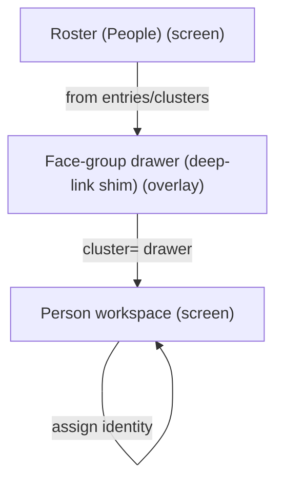
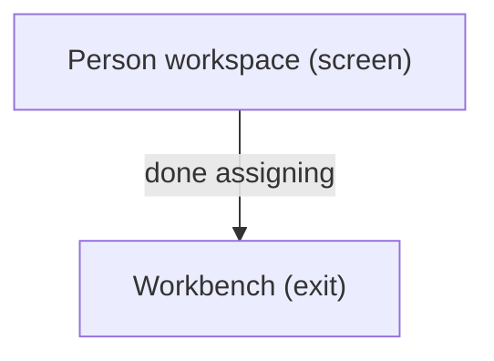

# UX Map — roster-people

**Product:** `prototype-wp-alt-context`
**Source fixture:** `apps/prototype-wp-alt-context/docs/ux-maps/roster-people.uxmap.json`

## Goals
- Six ACX submenus are MECE and frequency-ordered (NAV-05/NAV-06): Overview orients; Review Queue is the one home to name a person from a photo (highest-frequency demo task); People manages named people only; Description Runs is the one home to see what the describer did; Data Retention is keep/delete/export policy (not description history); Settings configures the service (rare, last). WordPress parent slug stays Overview.
- One primary action per screen (NAV-01), reachable from zero state (rg-003); other CTAs are secondary.
- Operator manages named people and person workspace without losing roster place
- Decompose Roster UI tasks from screens/zones/states/flows (people-first surface; clusters tab retired)

## Jobs
- `job-manage-person` — Open person workspace / manage entry
- `job-cluster-review` — Review face-group deep-link (shim)

## Vocabulary (say / don't say)

Controlled vocabulary for all Roster surfaces (NAV-13), enforced by `js/admin/__tests__/banned-vocabulary.test.tsx`:

| Say | Don't say |
| --- | --- |
| face / faces | identity / identities, instance / instances, projected instances |
| face group | cluster (unnamed recognition grouping) |
| person | identity, roster entry (in operator copy) |
| review queue (Workbench) | needs-assignment rail |

Backend write units stay `cluster`/`identity` in code and API contracts; only operator-facing copy uses the plain-language nouns.

## Screens
| id | kind | route | title | url_params |
| --- | --- | --- | --- | --- |
| `roster-shell` | screen | `#/roster` | Roster (People) | `person`, `personFilter`, `queue`, `face`, `cluster` |
| `roster-person-workspace` | screen | `#/roster?person=` | Person workspace | `person`, `queue`, `face` |
| `roster-cluster-drawer` | overlay | `#/roster?cluster=` | Face-group drawer (deep-link shim) | `cluster` |
| `roster-face-lightbox` | overlay | `#/roster?person= (in-panel dialog; no dedicated route)` | Face evidence lightbox | — |
| `exit-workbench` | exit | `#/workbench` | Workbench | `tab`, `panel`, `media` |

### Roster (People) (`roster-shell`)

Purpose: People-first roster: entries table, Workbench review CTA, person workspace host, face-group drawer shim

url_params: `person`, `personFilter`, `queue`, `face`, `cluster`

| zone id | label | role | states |
| --- | --- | --- | --- |
| `z-entries` | Roster entries table | content | default, loading, empty, error |
| `z-review-cta` | Unnamed faces CTA → Workbench review queue | content | default, loading, empty |
| `z-projection-gate` | Projection status gate notices | status | default, loading, error, degraded |
| `z-person-host` | Person workspace host | other | default, empty |
| `z-cluster-host` | Face-group drawer host (cluster= shim) | other | default, empty, loading, error |

```
+------------------------------------------------------------+
| Roster (People)  [screen]  #/roster                        |
| People-first roster: entries table, Workbench review CTA,  |
| person workspace host, face-group drawer shim              |
+------------------------------------------------------------+
| ZONES                                                      |
|   - Roster entries table (content)                         |
|   - Unnamed faces CTA → Workbench review queue (content)   |
|   - Projection status gate notices (status)                |
|   - Person workspace host (other)                          |
|   - Face-group drawer host (cluster= shim) (other)         |
+------------------------------------------------------------+
| ACTIONS                                                    |
|   [PRIMARY] Add Person -> roster-shell                     |
|   [secondary] Open person workspace -> roster-person-worksp… |
|   [secondary] Go to Workbench -> exit-workbench            |
|   [secondary] Open face-group drawer -> roster-cluster-dr… |
+------------------------------------------------------------+
| states: default | loading | empty | error | degraded       |
| states+: first_time                                        |
+------------------------------------------------------------+
```

### Person workspace (`roster-person-workspace`)

Purpose: Deep-linked person panel: faces, media, gated when data status is not current

url_params: `person`, `queue`, `face`

| zone id | label | role | states |
| --- | --- | --- | --- |
| `z-person-header` | Person header | content | default, loading |
| `z-person-identities` | Linked faces | ai_review | default, loading, empty, error, degraded |
| `z-person-evidence` | Cluster evidence thumbnails (cropped face crop; raw media fallback for uncroppable bbox; labelled visible no-image state) | ai_review | default, loading, empty, error, degraded |
| `z-person-actions` | Save / assign / open queue | form | default, loading, empty, error, degraded |

```
+------------------------------------------------------------+
| Person workspace  [screen]  #/roster?person=               |
| Deep-linked person panel: faces, media, gated when data    |
| status is not current                                      |
+------------------------------------------------------------+
| ZONES                                                      |
|   - Person header (content)                                |
|   - Linked faces (ai_review)                               |
|   - Cluster evidence thumbnails (cropped face crop; raw    |
|     media fallback for uncroppable bbox; labelled visible  |
|     no-image state) (ai_review)                            |
|   - Save / assign / open queue (form)                      |
+------------------------------------------------------------+
| ACTIONS                                                    |
|   [PRIMARY] Save person changes -> roster-person-workspac… |
|   [secondary] Open evidence lightbox -> roster-face-light… |
+------------------------------------------------------------+
| states: default | loading | empty | error | degraded       |
+------------------------------------------------------------+
```

### Face-group drawer (deep-link shim) (`roster-cluster-drawer`)

Purpose: Person-first face-group sample drawer (clusters tab retired; cluster= shim opens drawer)

url_params: `cluster`

| zone id | label | role | states |
| --- | --- | --- | --- |
| `z-cluster-samples` | Sample faces | forced_choice | default, loading, empty, error |
| `z-cluster-actions` | Assign / dismiss drawer | form | default, loading, empty, error |

```
+------------------------------------------------------------+
| Face-group drawer (deep-link shim)  [overlay]              |
| #/roster?cluster=                                          |
| Person-first face-group sample drawer (clusters tab        |
| retired; cluster= shim opens drawer)                       |
+------------------------------------------------------------+
| ZONES                                                      |
|   - Sample faces (forced_choice)                           |
|   - Assign / dismiss drawer (form)                         |
+------------------------------------------------------------+
| ACTIONS                                                    |
|   [PRIMARY] Assign face group to person (costly,preview)   |
+------------------------------------------------------------+
| states: default | loading | empty | error                  |
+------------------------------------------------------------+
```

### Face evidence lightbox (`roster-face-lightbox`)

Purpose: Full-size face/media evidence dialog opened from workspace evidence thumbnails; closes via dialog affordance and resets when the selected person identity changes

| zone id | label | role | states |
| --- | --- | --- | --- |
| `z-lightbox-media` | Enlarged evidence media with accessible ordinal name | ai_review | default, error |
| `z-lightbox-controls` | Close affordance | form | default, error |

```
+------------------------------------------------------------+
| Face evidence lightbox  [overlay]  #/roster?person= (in-p… |
| Full-size face/media evidence dialog opened from workspac… |
+------------------------------------------------------------+
| ZONES                                                      |
|   - Enlarged evidence media with accessible ordinal name   |
|   - Close affordance (form)                                |
+------------------------------------------------------------+
| ACTIONS                                                    |
|   [secondary] Close lightbox -> roster-person-workspace    |
+------------------------------------------------------------+
| states: default | error                                    |
+------------------------------------------------------------+
```

### Workbench (`exit-workbench`)

Purpose: Return to media queue / scan after assignment

url_params: `tab`, `panel`, `media`

| zone id | label | role | states |
| --- | --- | --- | --- |
| `z-wb-entry` | Workbench entry | nav | default |

```
+------------------------------------------------------------+
| Workbench  [exit]  #/workbench                             |
| Return to media queue / scan after assignment              |
+------------------------------------------------------------+
| ZONES                                                      |
|   - Workbench entry (nav)                                  |
+------------------------------------------------------------+
| states: default | loading | error                          |
+------------------------------------------------------------+
```

## Actions

| id | verb | target | hierarchy | costly | irreversible | preview required | screen id |
| --- | --- | --- | --- | --- | --- | --- | --- |
| `act-add-person` | Add Person | `roster-shell` | primary | no | no | no | `roster-shell` |
| `act-open-person` | Open person workspace | `roster-person-workspace` | secondary | no | no | no | `roster-shell` |
| `act-save-person` | Save person changes | `roster-person-workspace` | primary | yes | no | yes | `roster-person-workspace` |
| `act-open-cluster` | Open face-group drawer | `roster-cluster-drawer` | secondary | no | no | no | `roster-shell` |
| `act-assign-cluster` | Assign face group to person | `person` | primary | yes | no | yes | `roster-cluster-drawer` |
| `act-goto-workbench` | Go to Workbench | `exit-workbench` | secondary | no | no | no | `roster-shell` |
| `act-open-lightbox` | Open evidence lightbox | `roster-face-lightbox` | secondary | no | no | no | `roster-person-workspace` |
| `act-close-lightbox` | Close lightbox | `roster-person-workspace` | primary | no | no | no | `roster-face-lightbox` |

## Flows
### Open face-group drawer → assign → person workspace (`flow-cluster-to-person`)



### Roster → Workbench continue scan (`flow-return-workbench`)



## Open questions
- Is person workspace a route-owned screen or always an in-page panel? (modeled as deep-linkable screen with person=)
- Face-group drawer max_candidates=8 — confirm product top-k policy

## Parity index

Machine-checked by `js/admin/__tests__/uxmap-parity.test.ts` and
`js/admin/__tests__/uxmap-render-parity.test.ts`: every id, state, and verbatim label
below must exist in the sibling `.uxmap.json`, and no `z-*`/`act-*` id may appear here
that the JSON does not define. Regenerate with `docs/ux-maps/render_ux_maps.py` — never
hand-edit one side.

Zone ids: z-entries z-review-cta z-projection-gate z-person-host z-cluster-host z-person-header z-person-identities z-person-evidence z-person-actions z-cluster-samples z-cluster-actions z-lightbox-media z-lightbox-controls z-wb-entry

Action ids: act-add-person act-open-person act-save-person act-open-cluster act-assign-cluster act-goto-workbench act-open-lightbox act-close-lightbox

Zone labels (verbatim; the tables above escape `|` for markdown, this list does not):

- Roster entries table
- Unnamed faces CTA → Workbench review queue
- Projection status gate notices
- Person workspace host
- Face-group drawer host (cluster= shim)
- Person header
- Linked faces
- Cluster evidence thumbnails (cropped face crop; raw media fallback for uncroppable bbox; labelled visible no-image state)
- Save / assign / open queue
- Sample faces
- Assign / dismiss drawer
- Enlarged evidence media with accessible ordinal name
- Close affordance
- Workbench entry

States (all zones and screens): default loading empty error degraded first_time

## Not doing
- Resurrect Clusters tab surface (retired; cluster= drawer only)
- Dashboard map (separate map_ref later)
- Pixel/token design in this map
- REST sequence diagrams
