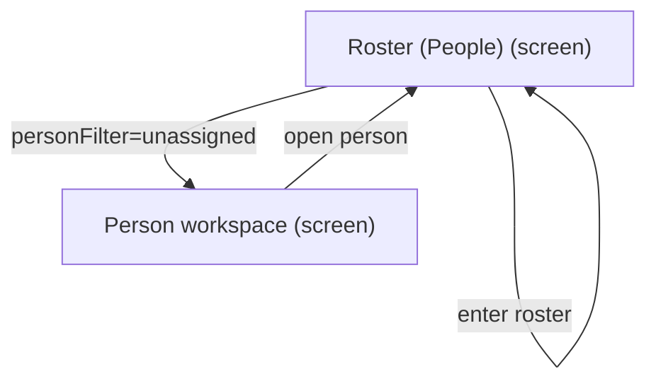
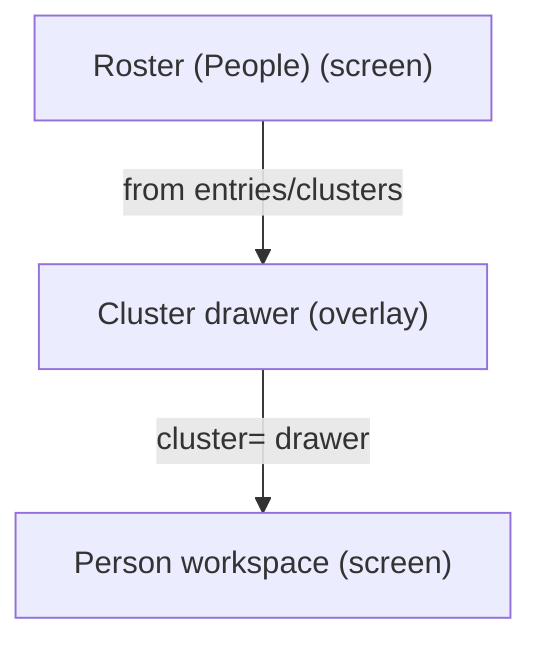
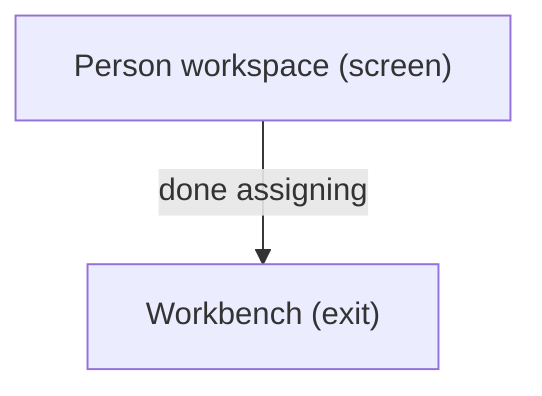

# UX Map — roster-people

**Product:** `prototype-wp-alt-context`
**Source fixture:** `packages/mcp-workbay-canvas/tests/fixtures/ux_maps/roster-people.uxmap.json`

## Goals
- Operator assigns unassigned faces and manages person workspace without losing roster place
- Decompose Roster UI tasks from screens/zones/states/flows (people-first surface; clusters tab retired)

## Jobs
- `job-assign-faces` — Assign unassigned faces to people
- `job-manage-person` — Open person workspace / manage entry
- `job-cluster-review` — Review recognition cluster in drawer

## Vocabulary (say / don't say)

Controlled vocabulary for all Roster surfaces (NAV-13), enforced by `js/admin/__tests__/banned-vocabulary.test.tsx`:

| Say | Don't say |
| --- | --- |
| face / faces | identity / identities, instance / instances, projected instances |
| face group | cluster (unnamed recognition grouping) |
| person | identity, roster entry (in operator copy) |
| review queue (Workbench) | needs-assignment rail |

Backend write units stay `cluster`/`identity` in code and API contracts; only operator-facing copy uses the plain-language nouns.

## Screens
| id | kind | route | title |
| --- | --- | --- | --- |
| `roster-shell` | screen | `#/roster` | Roster (People) |
| `roster-person-workspace` | screen | `#/roster?person=` | Person workspace |
| `roster-cluster-drawer` | overlay | `#/roster?cluster=` | Cluster drawer |
| `roster-face-lightbox` | overlay | `#/roster?person= (in-panel dialog; no dedicated route)` | Face evidence lightbox |
| `exit-workbench` | exit | `#/workbench` | Workbench |

### Roster (People) (`roster-shell`)

```
+------------------------------------------------------------+
| Roster (People)  [screen]  #/roster                        |
| People-first roster: entries table + Workbench review CTA  |
+------------------------------------------------------------+
| ZONES                                                      |
|   - Roster entries table (content) states=[default,loadin… |
|   - Unnamed faces CTA -> Workbench review queue (content)  |
|     (needs-assignment rail RETIRED UXW2-4; queue lives in  |
|     the Workbench, Roster links out with server count)     |
|   - Projection status gate notices (status) states=[defau… |
|   - Person workspace host (other) states=[default,empty]   |
|   - Cluster drawer host (other) states=[default,empty]     |
+------------------------------------------------------------+
| ACTIONS                                                    |
|   [PRIMARY] Filter unassigned -> personFilter=unassigned   |
|   [PRIMARY] Open person workspace -> roster-person-worksp… |
|   [secondary] Go to Workbench -> exit-workbench            |
|   [secondary] Open cluster drawer -> roster-cluster-drawer |
+------------------------------------------------------------+
| states: default | loading | empty | error | degraded | fi… |
+------------------------------------------------------------+
```

### Person workspace (`roster-person-workspace`)

```
+------------------------------------------------------------+
| Person workspace  [screen]  #/roster?person=               |
| Deep-linked person panel: identities, media, projection-g… |
+------------------------------------------------------------+
| ZONES                                                      |
|   - Person identity header (content) states=[default,load… |
|   - Linked identities / faces (ai_review) states=[default… |
|   - Cluster evidence thumbnails (cropped face crop; raw m… |
|   - Save / assign / open queue (form) states=[default,err… |
+------------------------------------------------------------+
| ACTIONS                                                    |
|   [PRIMARY] Save person changes -> roster-person-workspac… |
|   [secondary] Open evidence lightbox -> roster-face-light… |
+------------------------------------------------------------+
| states: default | loading | empty | error | degraded       |
+------------------------------------------------------------+
```

### Cluster drawer (`roster-cluster-drawer`)

```
+------------------------------------------------------------+
| Cluster drawer  [overlay]  #/roster?cluster=               |
| Person-first cluster sample identities drawer (clusters t… |
+------------------------------------------------------------+
| ZONES                                                      |
|   - Sample identities (forced_choice) states=[default,loa… |
|   - Assign / dismiss drawer (form) states=[default]        |
+------------------------------------------------------------+
| ACTIONS                                                    |
|   [PRIMARY] Assign cluster identity -> person (costly,pre… |
+------------------------------------------------------------+
| states: default | loading | empty | error                  |
+------------------------------------------------------------+
```

### Face evidence lightbox (`roster-face-lightbox`)

```
+------------------------------------------------------------+
| Face evidence lightbox  [overlay]  #/roster?person= (in-p… |
| Full-size face/media evidence dialog opened from workspac… |
+------------------------------------------------------------+
| ZONES                                                      |
|   - Enlarged evidence media with accessible ordinal name … |
|   - Close affordance (form) states=[default]               |
+------------------------------------------------------------+
| ACTIONS                                                    |
|   [secondary] Close lightbox -> roster-person-workspace    |
+------------------------------------------------------------+
| states: default | error                                    |
+------------------------------------------------------------+
```

### Workbench (`exit-workbench`)

```
+------------------------------------------------------------+
| Workbench  [exit]  #/workbench                             |
| Return to media queue / scan after assignment              |
+------------------------------------------------------------+
| ZONES                                                      |
|   - Workbench entry (nav) states=[default]                 |
+------------------------------------------------------------+
| states: default | loading | error                          |
+------------------------------------------------------------+
```

## Flows
### Filter unassigned → open person → save assignment (`flow-assign-unassigned`)



### Open cluster drawer → assign → person workspace (`flow-cluster-to-person`)



### Roster → Workbench continue scan (`flow-return-workbench`)



## Open questions
- Is person workspace a route-owned screen or always an in-page panel? (modeled as deep-linkable screen with person=)
- ~~Should needs-assignment be its own screen_id or remain a zone on roster-shell?~~ Resolved (UXW2-4): rail retired; needs-assignment lives only in the Workbench review queue (`#/workbench?tab=scan&rq=assignment.all.0`), Roster keeps a CTA card.
- Cluster drawer max_candidates=8 — confirm product top-k policy

## Not doing
- Resurrect Clusters tab surface (retired; cluster= drawer only)
- Dashboard map (separate map_ref later)
- Pixel/token design in this map
- REST sequence diagrams
