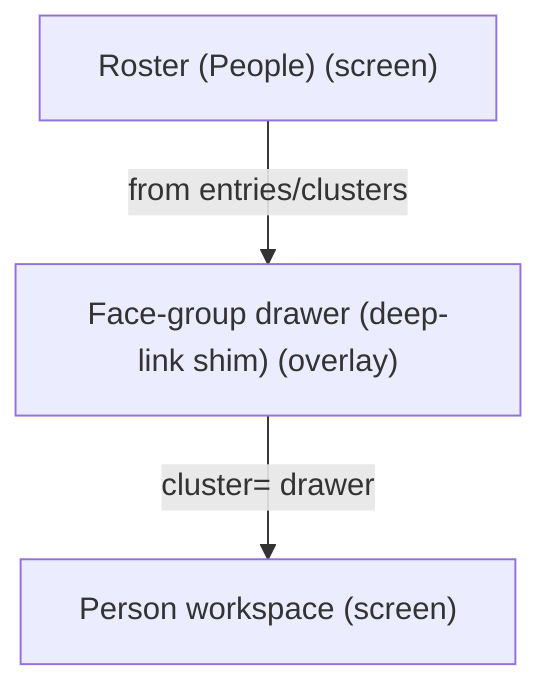
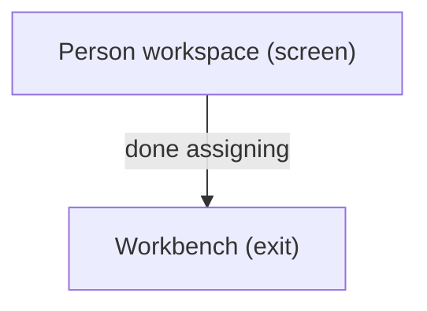
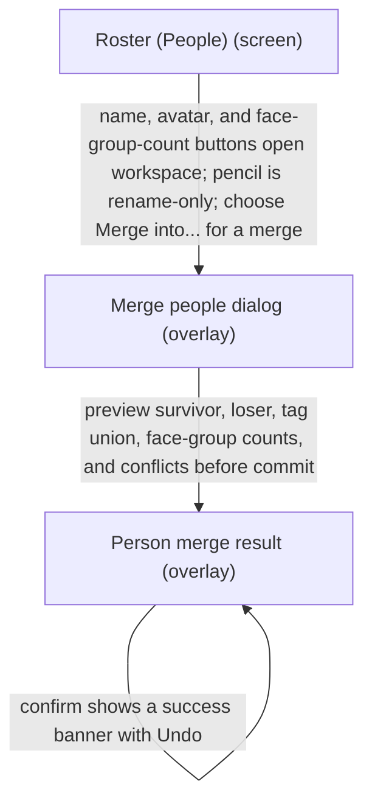

# UX Map — roster-people

**Product:** `prototype-wp-alt-context`
**Source fixture:** `apps/prototype-wp-alt-context/js/admin/pages/RosterPage.tsx`

## Goals
- Six ACX submenus are MECE and frequency-ordered (NAV-05/NAV-06): Overview orients; Review Queue is the one home to name a person from a photo (highest-frequency demo task); People manages named people only; Description Runs is the one home to see what the describer did; Data Retention is keep/delete/export policy (not description history); Settings configures the service (rare, last). WordPress parent slug stays Overview.
- One primary action per screen (NAV-01), reachable from zero state (rg-003); other CTAs are secondary.
- Operator manages named people and person workspace without losing roster place
- Name, avatar, and face-group-count buttons open the person workspace; the pencil is the only rename entry point.
- Preview a person merge with survivor, loser, tag union, face-group counts, and conflicts before confirming; keep the success banner reversible with Undo.
- Decompose Roster UI tasks from screens/zones/states/flows (people-first surface; clusters tab retired)

## Jobs
- `job-manage-person` — Open person workspace / manage entry
- `job-cluster-review` — Review face-group deep-link (shim)
- `job-merge-people` — Preview, confirm, and undo a person merge

## Vocabulary (say / don't say)

Controlled vocabulary for all Roster surfaces (NAV-13), enforced by `js/admin/__tests__/banned-vocabulary.test.tsx`:

| Say | Don't say |
| --- | --- |
| face / faces | identity / identities, instance / instances, projected instances |
| face group | cluster (unnamed recognition grouping) |
| person | identity, roster entry (in operator copy) |
| review queue (Workbench) | needs-assignment rail |

Backend write units stay `cluster`/`identity` in code and API contracts; only operator-facing copy uses the plain-language nouns.

## Screens
| id | kind | route | title |
| --- | --- | --- | --- |
| `roster-shell` | screen | `#/roster` | Roster (People) |
| `roster-person-workspace` | screen | `#/roster?person=` | Person workspace |
| `roster-cluster-drawer` | overlay | `#/roster?cluster=` | Face-group drawer (deep-link shim) |
| `roster-face-lightbox` | overlay | `#/roster?person= (in-panel dialog; no dedicated route)` | Face evidence lightbox |
| `exit-workbench` | exit | `#/workbench` | Workbench |
| `roster-person-merge-dialog` | overlay | `#/roster?person=&mergeInto=` | Merge people dialog |
| `roster-person-merge-success` | overlay | `#/roster?person=&mergeResult=` | Person merge result |

### Roster (People) (`roster-shell`)

Purpose: People-first roster: entries table, Workbench review CTA, person workspace host, face-group drawer shim

url_params: `person`, `personFilter`, `queue`, `face`, `cluster`

| zone id | label | role | states |
| --- | --- | --- | --- |
| `z-entries` | Roster entries table (name, avatar, and face-group-count buttons open person workspace; rename is pencil-only; Merge into... is a row action) | content | default, loading, empty, error |
| `z-review-cta` | Unnamed faces CTA → Workbench review queue | content | default, loading, empty |
| `z-projection-gate` | Projection status gate notices | status | default, loading, error, degraded |
| `z-person-host` | Person workspace host | other | default, empty |
| `z-cluster-host` | Face-group drawer host (cluster= shim) | other | default, empty, loading, error |

```
+------------------------------------------------------------+
| Roster (People)  [screen]  #/roster                        |
| People-first roster: entries table, Workbench review CTA,… |
+------------------------------------------------------------+
| ZONES                                                      |
|   - Roster entries table (name, avatar, and face-group-co… |
|   - Unnamed faces CTA → Workbench review queue (content) … |
|   - Projection status gate notices (status) states=[defau… |
|   - Person workspace host (other) states=[default,empty]   |
|   - Face-group drawer host (cluster= shim) (other) states… |
+------------------------------------------------------------+
| ACTIONS                                                    |
|   [PRIMARY] Add Person -> roster-shell                     |
|   [secondary] Go to Workbench -> exit-workbench            |
|   [secondary] Open face-group drawer -> roster-cluster-dr… |
|   [secondary] Open person workspace -> roster-person-work… |
|   [secondary] Open person workspace from avatar button ->… |
|   [secondary] Open person workspace from face-group-count… |
|   [secondary] Open person workspace from name button -> r… |
|   [secondary] Merge into... -> roster-person-merge-dialog  |
|   [secondary] Rename person via pencil -> roster-person-w… |
+------------------------------------------------------------+
| states: default | loading | empty | error | degraded       |
| states+: first_time                                        |
+------------------------------------------------------------+
```

### Person workspace (`roster-person-workspace`)

Purpose: Deep-linked person panel: faces, media, gated when data status is not current

url_params: `person`, `queue`, `face`

| zone id | label | role | states |
| --- | --- | --- | --- |
| `z-person-header` | Person header | content | default, loading |
| `z-person-identities` | Linked faces | ai_review | default, loading, empty, error, degraded |
| `z-person-evidence` | Cluster evidence thumbnails (cropped face crop; raw media fallback for uncroppable bbox; labelled visible no-image state) | ai_review | default, loading, empty, error, degraded |
| `z-person-actions` | Save / assign / open queue | form | default, loading, empty, error, degraded |

```
+------------------------------------------------------------+
| Person workspace  [screen]  #/roster?person=               |
| Deep-linked person panel: faces, media, gated when data s… |
+------------------------------------------------------------+
| ZONES                                                      |
|   - Person header (content) states=[default,loading]       |
|   - Linked faces (ai_review) states=[default,loading,empt… |
|   - Cluster evidence thumbnails (cropped face crop; raw m… |
|   - Save / assign / open queue (form) states=[default,loa… |
+------------------------------------------------------------+
| ACTIONS                                                    |
|   [PRIMARY] Save person changes -> roster-person-workspac… |
|   [secondary] Open evidence lightbox -> roster-face-light… |
+------------------------------------------------------------+
| states: default | loading | empty | error | degraded       |
+------------------------------------------------------------+
```

### Face-group drawer (deep-link shim) (`roster-cluster-drawer`)

Purpose: Person-first face-group sample drawer (clusters tab retired; cluster= shim opens drawer)

url_params: `cluster`

| zone id | label | role | states |
| --- | --- | --- | --- |
| `z-cluster-samples` | Sample faces | forced_choice | default, loading, empty, error |
| `z-cluster-actions` | Assign / dismiss drawer | form | default, loading, empty, error |

```
+------------------------------------------------------------+
| Face-group drawer (deep-link shim)  [overlay]  #/roster?c… |
| Person-first face-group sample drawer (clusters tab retir… |
+------------------------------------------------------------+
| ZONES                                                      |
|   - Sample faces (forced_choice) states=[default,loading,… |
|   - Assign / dismiss drawer (form) states=[default,loadin… |
+------------------------------------------------------------+
| ACTIONS                                                    |
|   [PRIMARY] Assign face group to person -> person (costly… |
+------------------------------------------------------------+
| states: default | loading | empty | error                  |
+------------------------------------------------------------+
```

### Face evidence lightbox (`roster-face-lightbox`)

Purpose: Full-size face/media evidence dialog opened from workspace evidence thumbnails; closes via dialog affordance and resets when the selected person identity changes

| zone id | label | role | states |
| --- | --- | --- | --- |
| `z-lightbox-media` | Enlarged evidence media with accessible ordinal name | ai_review | default, error |
| `z-lightbox-controls` | Close affordance | form | default, error |

```
+------------------------------------------------------------+
| Face evidence lightbox  [overlay]  #/roster?person= (in-p… |
| Full-size face/media evidence dialog opened from workspac… |
+------------------------------------------------------------+
| ZONES                                                      |
|   - Enlarged evidence media with accessible ordinal name … |
|   - Close affordance (form) states=[default,error]         |
+------------------------------------------------------------+
| ACTIONS                                                    |
|   [PRIMARY] Close lightbox -> roster-person-workspace      |
+------------------------------------------------------------+
| states: default | error                                    |
+------------------------------------------------------------+
```

### Workbench (`exit-workbench`)

Purpose: Return to media queue / scan after assignment

url_params: `tab`, `panel`, `media`

| zone id | label | role | states |
| --- | --- | --- | --- |
| `z-wb-entry` | Workbench entry | nav | default |

```
+------------------------------------------------------------+
| Workbench  [exit]  #/workbench                             |
| Return to media queue / scan after assignment              |
+------------------------------------------------------------+
| ZONES                                                      |
|   - Workbench entry (nav) states=[default]                 |
+------------------------------------------------------------+
| states: default | loading | error                          |
+------------------------------------------------------------+
```

### Merge people dialog (`roster-person-merge-dialog`)

Purpose: PersonMergeDialog previews the survivor, loser, tag union, face-group counts, and conflicts before the operator confirms a reversible merge.

url_params: `person`, `mergeInto`

Action states: ready, preview_ready, conflict, committing

| zone id | label | role | states |
| --- | --- | --- | --- |
| `z-person-merge-preview` | Merge preview (survivor, loser, tag union, face-group counts, and conflicts) | forced_choice | default, loading, error, degraded |
| `z-person-merge-confirm` | Confirm merge only after the preview is current; cancel leaves both people unchanged | form | default, loading, error |
| `z-person-merge-conflicts` | Conflict details (tag or face-group conflict blocks an unreviewed commit) | status | default, error, degraded |

```
+------------------------------------------------------------+
| Merge people dialog  [overlay]  #/roster?person=&mergeInt… |
| PersonMergeDialog previews the survivor, loser, tag union… |
+------------------------------------------------------------+
| ZONES                                                      |
|   - Merge preview (survivor, loser, tag union, face-group… |
|   - Confirm merge only after the preview is current; canc… |
|   - Conflict details (tag or face-group conflict blocks a… |
+------------------------------------------------------------+
| ACTIONS                                                    |
| when ready                                                 |
|   [PRIMARY] Preview person merge                           |
|   [secondary] Cancel merge                                 |
| when preview_ready                                         |
|   [PRIMARY] Confirm person merge                           |
|   [secondary] Cancel merge                                 |
| when conflict                                              |
|   [secondary] Retry merge preview                          |
|   [secondary] Cancel merge                                 |
| when committing                                            |
|   No action (silent)                                       |
+------------------------------------------------------------+
| states: default | loading | error | degraded               |
+------------------------------------------------------------+
```

### Person merge result (`roster-person-merge-success`)

Purpose: Success banner confirms the person merge and offers Undo; the undone state restores the prior survivor, loser, tags, and face-group bindings.

url_params: `person`, `mergeResult`

Action states: success, undoing, undone, error

| zone id | label | role | states |
| --- | --- | --- | --- |
| `z-person-merge-success-banner` | Success banner (people merged) with Undo | status | default, loading, error |
| `z-person-merge-undo` | Undo merge restores the prior person and face-group bindings | form | default, loading, error |
| `z-person-merge-undone` | Undone state (original people, tags, and face-group counts are visible again) | content | default, error, degraded |

```
+------------------------------------------------------------+
| Person merge result  [overlay]  #/roster?person=&mergeRes… |
| Success banner confirms the person merge and offers Undo;… |
+------------------------------------------------------------+
| ZONES                                                      |
|   - Success banner (people merged) with Undo (status) sta… |
|   - Undo merge restores the prior person and face-group b… |
|   - Undone state (original people, tags, and face-group c… |
+------------------------------------------------------------+
| ACTIONS                                                    |
| when success                                               |
|   [secondary] Undo merge                                   |
|   [tertiary] Close merge result                            |
| when undoing                                               |
|   No action (silent)                                       |
| when undone                                                |
|   [tertiary] Close merge result                            |
| when error                                                 |
|   [tertiary] Close merge result                            |
+------------------------------------------------------------+
| states: default | loading | error | degraded               |
+------------------------------------------------------------+
```

## Actions

| id | verb | target | hierarchy | costly | irreversible | preview required | screen id | when (recovery state) |
| --- | --- | --- | --- | --- | --- | --- | --- | --- |
| `act-add-person` | Add Person | `roster-shell` | primary | no | no | no | `roster-shell` | always |
| `act-open-person` | Open person workspace | `roster-person-workspace` | secondary | no | no | no | `roster-shell` | always |
| `act-open-person-from-name` | Open person workspace from name button | `roster-person-workspace` | secondary | no | no | no | `roster-shell` | always |
| `act-open-person-from-avatar` | Open person workspace from avatar button | `roster-person-workspace` | secondary | no | no | no | `roster-shell` | always |
| `act-open-person-from-face-group-count` | Open person workspace from face-group-count button | `roster-person-workspace` | secondary | no | no | no | `roster-shell` | always |
| `act-rename-person-pencil` | Rename person via pencil | `roster-person-workspace` | secondary | yes | no | yes | `roster-shell` | always |
| `act-open-person-merge` | Merge into... | `roster-person-merge-dialog` | secondary | no | no | no | `roster-shell` | always |
| `act-save-person` | Save person changes | `roster-person-workspace` | primary | yes | no | yes | `roster-person-workspace` | always |
| `act-open-cluster` | Open face-group drawer | `roster-cluster-drawer` | secondary | no | no | no | `roster-shell` | always |
| `act-assign-cluster` | Assign face group to person | `person` | primary | yes | no | yes | `roster-cluster-drawer` | always |
| `act-goto-workbench` | Go to Workbench | `exit-workbench` | secondary | no | no | no | `roster-shell` | always |
| `act-open-lightbox` | Open evidence lightbox | `roster-face-lightbox` | secondary | no | no | no | `roster-person-workspace` | always |
| `act-close-lightbox` | Close lightbox | `roster-person-workspace` | primary | no | no | no | `roster-face-lightbox` | always |
| `act-preview-person-merge` | Preview person merge | `roster-person-merge-dialog` | primary | no | no | no | `roster-person-merge-dialog` | ready |
| `act-retry-person-merge-preview` | Retry merge preview | `roster-person-merge-dialog` | secondary | no | no | no | `roster-person-merge-dialog` | conflict |
| `act-confirm-person-merge` | Confirm person merge | `roster-person-merge-success` | primary | yes | no | yes | `roster-person-merge-dialog` | preview_ready |
| `act-cancel-person-merge` | Cancel merge | `roster-shell` | secondary | no | no | no | `roster-person-merge-dialog` | ready, preview_ready, conflict |
| `act-undo-person-merge` | Undo merge | `roster-person-merge-success` | secondary | yes | no | no | `roster-person-merge-success` | success |
| `act-dismiss-person-merge-result` | Close merge result | `roster-shell` | tertiary | no | no | no | `roster-person-merge-success` | success, undone, error |

## Flows
### Open face-group drawer → assign → person workspace (`flow-cluster-to-person`)



### Roster → Workbench continue scan (`flow-return-workbench`)



### Roster row → preview person merge → confirm → Undo (`flow-person-merge-undo`)



## Open questions
- Is person workspace a route-owned screen or always an in-page panel? (modeled as deep-linkable screen with person=)
- Face-group drawer max_candidates=8 — confirm product top-k policy

## Parity index

Machine-checked by `js/admin/__tests__/uxmap-parity.test.ts` and
`js/admin/__tests__/uxmap-render-parity.test.ts`: every id, state, and verbatim label
below must exist in the sibling `.uxmap.json`, and no `z-*`/`act-*` id may appear here
that the JSON does not define. Regenerate with `docs/ux-maps/render_ux_maps.py` — never
hand-edit one side.

Zone ids: z-entries z-review-cta z-projection-gate z-person-host z-cluster-host z-person-header z-person-identities z-person-evidence z-person-actions z-cluster-samples z-cluster-actions z-lightbox-media z-lightbox-controls z-wb-entry z-person-merge-preview z-person-merge-confirm z-person-merge-conflicts z-person-merge-success-banner z-person-merge-undo z-person-merge-undone

Action ids: act-add-person act-open-person act-open-person-from-name act-open-person-from-avatar act-open-person-from-face-group-count act-rename-person-pencil act-open-person-merge act-save-person act-open-cluster act-assign-cluster act-goto-workbench act-open-lightbox act-close-lightbox act-preview-person-merge act-retry-person-merge-preview act-confirm-person-merge act-cancel-person-merge act-undo-person-merge act-dismiss-person-merge-result

Zone labels (verbatim; the tables above escape `|` for markdown, this list does not):

- Roster entries table (name, avatar, and face-group-count buttons open person workspace; rename is pencil-only; Merge into... is a row action)
- Unnamed faces CTA → Workbench review queue
- Projection status gate notices
- Person workspace host
- Face-group drawer host (cluster= shim)
- Person header
- Linked faces
- Cluster evidence thumbnails (cropped face crop; raw media fallback for uncroppable bbox; labelled visible no-image state)
- Save / assign / open queue
- Sample faces
- Assign / dismiss drawer
- Enlarged evidence media with accessible ordinal name
- Close affordance
- Workbench entry
- Merge preview (survivor, loser, tag union, face-group counts, and conflicts)
- Confirm merge only after the preview is current; cancel leaves both people unchanged
- Conflict details (tag or face-group conflict blocks an unreviewed commit)
- Success banner (people merged) with Undo
- Undo merge restores the prior person and face-group bindings
- Undone state (original people, tags, and face-group counts are visible again)

States (all zones and screens): default loading empty error degraded first_time

## Not doing
- Resurrect Clusters tab surface (retired; cluster= drawer only)
- Dashboard map (separate map_ref later)
- Pixel/token design in this map
- REST sequence diagrams
