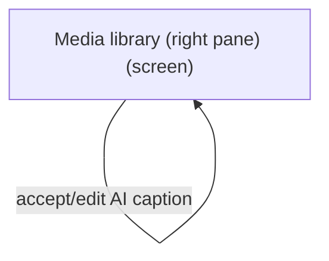
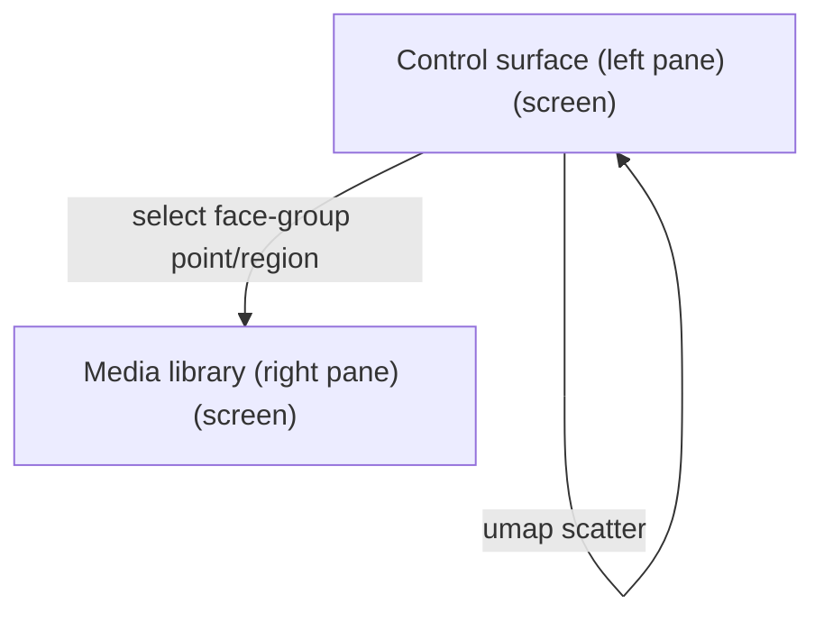
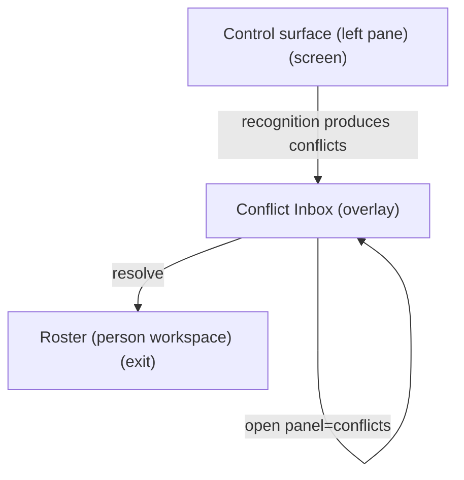
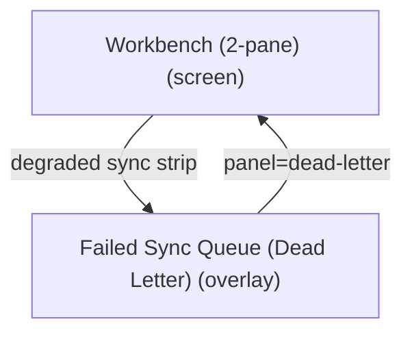

# UX Map — workbench-2pane

**Product:** `prototype-wp-alt-context`
**Source fixture:** `apps/prototype-wp-alt-context/docs/ux-maps/workbench-2pane.uxmap.json`

## Goals
- Five ACX submenus are MECE and frequency-ordered (NAV-05/NAV-06): Overview orients; Review Queue is the one home to name a person from a photo (highest-frequency demo task); People manages named people only; Description Runs is the one home to see what the describer did; Settings configures the service (rare, last) and hosts Data & retention as a section (#/settings?section=retention; the standalone Data Retention submenu is retired, E1). WordPress parent slug stays Overview.
- One primary action per screen (NAV-01), reachable from zero state (rg-003); other CTAs are secondary. In the library footer the single primary is Describe — recognition is a global Settings toggle disclosed under the button, never a second competing CTA (INT-05, COG-03).
- Operator runs the full recognize -> name -> curate loop and edits alt-text/descriptions without leaving one surface (control-left, library-right)
- Read face-group status at a glance in the control pane and act on the selection in the same viewport
- Decompose the 2-pane redesign from screens/zones/states/flows instead of inventing IA mid-plan

## Jobs
- `job-cluster-recognize` — Build & recognize face groups (refresh groups, run recognition)
- `job-name-curate` — Name & curate people (confirm/correct/merge/split, assign names)
- `job-caption-library` — Caption & describe media (alt-text + long description on library rows)
- `job-triage-sync` — Triage people conflicts / failed sync (overlays)

## Screens
| id | kind | route | title |
| --- | --- | --- | --- |
| `workbench-2pane-shell` | screen | `#/workbench` | Workbench (2-pane) |
| `workbench-control` | screen | `#/workbench` | Control surface (left pane) |
| `workbench-library` | screen | `#/workbench` | Media library (right pane) |
| `workbench-conflicts` | overlay | `#/workbench?panel=conflicts` | Conflict Inbox |
| `workbench-dead-letter` | overlay | `#/workbench?panel=dead-letter` | Failed Sync Queue (Dead Letter) |
| `exit-roster` | exit | `#/roster` | Roster (person workspace) |
| `exit-settings` | exit | `#/settings` | Settings / service health |

### Workbench (2-pane) (`workbench-2pane-shell`)

```
+------------------------------------------------------------+
| Workbench (2-pane)  [screen]  #/workbench                  |
| Two-pane operator surface: left control (face-group/recog… |
+------------------------------------------------------------+
| ZONES                                                      |
|   - Workbench header + recognition endpoint (read-only st… |
|   - Left pane host (control surface) (content) states=[de… |
|   - Pane divider / collapse-left control (other) states=[… |
|   - Right pane host (media library) (content) states=[def… |
|   - Overlay host (conflicts | dead-letter) (other) states… |
+------------------------------------------------------------+
| ACTIONS                                                    |
|   [PRIMARY] Scan media queue (topbar; folded into the foo… |
|   [secondary] Open Conflict Inbox -> workbench-conflicts   |
|   [secondary] Open Failed Sync Queue -> workbench-dead-le… |
+------------------------------------------------------------+
| states: default | loading | error | degraded | offline     |
+------------------------------------------------------------+
```

### Control surface (left pane) (`workbench-control`)

```
+------------------------------------------------------------+
| Control surface (left pane)  [screen]  #/workbench         |
| Recognize, name, and curate: recognition endpoint + healt… |
+------------------------------------------------------------+
| ZONES                                                      |
|   - Recognition endpoint + health (read-only: InsightFace… |
|   - Face-group/recognition controls (run, refresh, thresh… |
|   - Face-group status (scan/sync health; not a 2D scatter… |
|   - Face-group list / selection (size, confidence, unname… |
|   - Name this person (NameFaceControl; confirm / correct … |
+------------------------------------------------------------+
| ACTIONS                                                    |
|   [PRIMARY] Run / refresh recognition + grouping -> job-p… |
|   [secondary] Go to Roster -> exit-roster                  |
|   [secondary] Save name (NameFaceControl) -> identity-sto… |
|   [secondary] Select face group (list) -> workbench-libra… |
|   [secondary] View / change recognition endpoint + recogn… |
|   [secondary] Keep twin separate (IdentityClusterItem.tsx… |
|   [DESTRUCTIVE] Merge / split / correct group -> identity… |
|   [DESTRUCTIVE] Merge twin into labeled survivor (Identit… |
+------------------------------------------------------------+
| states: default | loading | empty | error | first_time | … |
+------------------------------------------------------------+
```

### Media library (right pane) (`workbench-library`)

```
+------------------------------------------------------------+
| Media library (right pane)  [screen]  #/workbench          |
| Media library table with alt-text caption and long-descri… |
+------------------------------------------------------------+
| ZONES                                                      |
|   - Library filters (status, has-alt, has-description, fa… |
|   - Media library table (thumb | title | status | alt-tex… |
|   - Inline person naming (NameFaceControl) + alt-text / l… |
|   - AI name / caption suggestions (evidence-linked; edita… |
|   - Footer job zone (MediaSelection.tsx footer): ONE job … |
+------------------------------------------------------------+
| ACTIONS                                                    |
|   [PRIMARY] Edit alt-text inline -> media-store            |
|   [PRIMARY] Describe N selected (footer primary; runs rec… |
|   [secondary] Accept AI caption/description (editable) ->… |
|   [secondary] Edit long description inline -> media-store  |
+------------------------------------------------------------+
| states: default | loading | empty | error | first_time | … |
+------------------------------------------------------------+
```

### Conflict Inbox (`workbench-conflicts`)

```
+------------------------------------------------------------+
| Conflict Inbox  [overlay]  #/workbench?panel=conflicts     |
| Review people conflicts; commit human judgment with evide… |
+------------------------------------------------------------+
| ZONES                                                      |
|   - Conflict list (queue) states=[default,loading,empty,e… |
|   - Conflict detail / candidates (forced_choice) states=[… |
|   - Resolve / defer actions (form) states=[default,loadin… |
+------------------------------------------------------------+
| ACTIONS                                                    |
|   [PRIMARY] Resolve conflict -> identity-store (costly,pr… |
+------------------------------------------------------------+
| states: default | loading | empty | error                  |
+------------------------------------------------------------+
```

### Failed Sync Queue (Dead Letter) (`workbench-dead-letter`)

```
+------------------------------------------------------------+
| Failed Sync Queue (Dead Letter)  [overlay]  #/workbench?p… |
| Inspect failed sync ops; retry or discard                  |
+------------------------------------------------------------+
| ZONES                                                      |
|   - Dead-letter items (queue) states=[default,loading,emp… |
|   - Retry / discard (form) states=[default,loading,empty,… |
+------------------------------------------------------------+
| ACTIONS                                                    |
|   [PRIMARY] Retry failed op -> sync (costly,preview)       |
|   [DESTRUCTIVE] Discard failed op -> sync (costly,preview… |
+------------------------------------------------------------+
| states: default | loading | empty | error                  |
+------------------------------------------------------------+
```

### Roster (person workspace) (`exit-roster`)

```
+------------------------------------------------------------+
| Roster (person workspace)  [exit]  #/roster                |
| Manage identified persons after naming/curating in Workbe… |
+------------------------------------------------------------+
| ZONES                                                      |
|   - Roster entry (nav) states=[default]                    |
+------------------------------------------------------------+
| states: default | loading | empty | error                  |
+------------------------------------------------------------+
```

### Settings / service health (`exit-settings`)

```
+------------------------------------------------------------+
| Settings / service health  [exit]  #/settings              |
| Configure the service: recognition endpoint + connection … |
+------------------------------------------------------------+
| ZONES                                                      |
|   - Settings form + test connection (form) states=[defaul… |
|   - Recognition toggle (acx_recognition_enabled; default … |
|   - Data & retention section (RetentionPage.tsx Retention… |
+------------------------------------------------------------+
| states: default | loading | error                          |
+------------------------------------------------------------+
```

## Flows
### Run recognition -> select face group -> name/curate -> library people column updates (`flow-recognize-name-curate`)

```mermaid
flowchart TD
  %% flow: Run recognition -> select face group -> name/curate -> library people column updates job=job-name-curate
  n_workbench_2pane_shell["Workbench (2-pane) (screen)"]
  n_workbench_control["Control surface (left pane) (screen)"]
  n_workbench_2pane_shell -->|enter| n_workbench_control
  n_workbench_control -->|run recognition (preview cost)| n_workbench_control
  n_workbench_control -->|select face group (umap/list)| n_workbench_control
  n_workbench_library["Media library (right pane) (screen)"]
  n_workbench_control -->|name / curate| n_workbench_library
```

### Filter needs-alt -> accept/edit AI caption -> edit long description (`flow-caption-library`)



### UMAP scatter -> select face group -> right library filters to face-group media (`flow-umap-select-to-library`)



### Recognition produces conflicts -> conflict overlay -> resolve -> roster if needed (`flow-scan-to-conflict`)



### Sync failure -> dead letter -> retry/discard (`flow-dead-letter-recover`)



## Open questions
- OPEN: long-description has no data field yet (media items have only alt text). Ship the alt-text column first, long-description behind a new field? [FORM]
- OPEN: no 2D projection data exists (only bbox + 3D head pose). Ship the left pane as a face-group list first; scatter map is a fast-follow once a projection endpoint exists? [VIZ-01,VIZ-15]
- RESOLVED: operator vocab is group / person / face — never cluster / identities / embeddings. Enforced by the banned-vocabulary sweep.
- OPEN: Selecting a face group in the map/list: filter the right library pane, open the naming form, or both (coordinated views)? [VIZ-15]
- RESOLVED: one naming surface (NameFaceControl) with a single-gesture Save name; overlay candidates and confirm share that control.
- OPEN: Endpoint switch (InsightFace vs FIR/SFace) changes the recognition model server-side; do existing face groups invalidate and need a fresh grouping on switch? [HAI-02]
- OPEN: Left/right min-width + left-collapse on narrow (<1100px) viewports; control collapses to a drawer, library stays reachable? [NAV-08,A11Y-08]
- OPEN: Alt-text vs long-description: two fixed columns or one expandable row-detail? [PERC-01,UI-04]
- RESOLVED (WBUX-6): 'Describe selected' vs 'Analyze selected' unified into one Describe CTA; recognition on/off is a GLOBAL Settings toggle (default ON), not a per-image choice — one decision per operator, per-image override deferred until a real demand appears (COG-03, INT-05).
- OPEN: Bulk-describe cost preview granularity: per-image cost surfaced before start? [INT-07]

## Not doing
- Clusters tab inside Roster (retired; cluster structure lives in Workbench left pane now)
- UI toggle for the recognition endpoint (server-resolved per RECOG-1; topbar is read-only status)
- Pixel/token values (design tokens referenced --acx-*, not specified here)
- Attachment-edit SPA (separate map_ref)
- Big-bang removal of the current tabbed shell (migration path, not in this map)
- REST sequence diagrams (see docs/workbench-data-flow.mmd)
- Per-image recognition opt-out on the library row (global Settings toggle only; revisit if operators ask)
- Standalone Data Retention admin submenu (retired into Settings ?section=retention)
