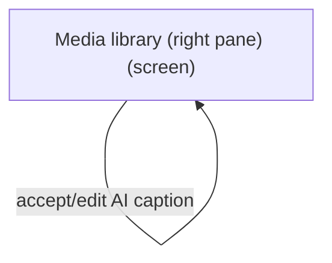
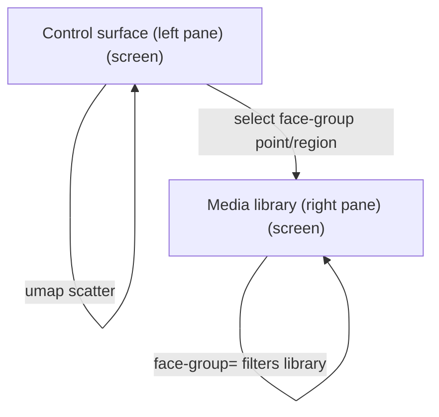
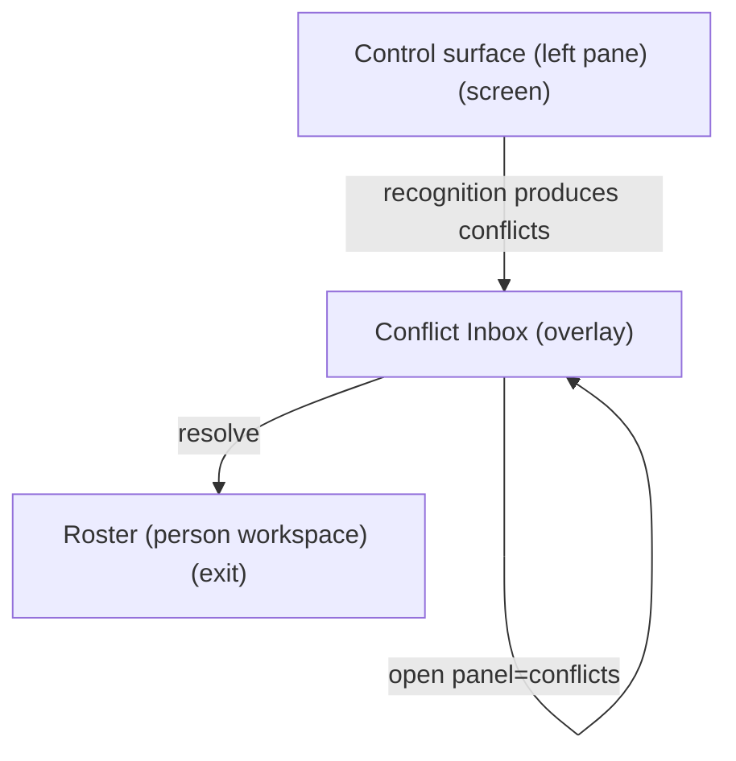
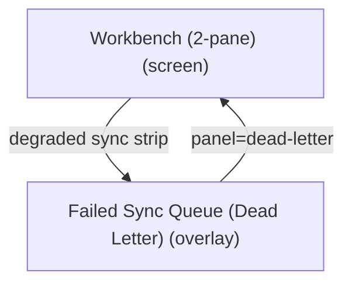

# UX Map — workbench-2pane

**Product:** `prototype-wp-alt-context`
**Source fixture:** `apps/prototype-wp-alt-context/docs/ux-maps/workbench-2pane.uxmap.json`

## Goals

- Operator runs the full recognize -> name -> curate loop and edits alt-text/descriptions without leaving one surface (control-left, library-right)
- Read face-group structure at a glance via a UMAP scatter and act on the selection in the same viewport
- Decompose the 2-pane redesign from screens/zones/states/flows instead of inventing IA mid-plan

## Vocabulary

Controlled say/don't-say list for operator-facing workbench copy (UXW2-3; NAV-13/NAV-14).
Engineering terms stay legal in code identifiers, `acx_*` CSS classes, and job ids — never in
rendered strings on the review surfaces. Roster page and dashboard/jobs/ops surfaces are owned
by other lanes and are not yet covered by this list.

| Don't say | Say | Notes |
| --- | --- | --- |
| cluster | face group (unnamed) / person (once named) | A cluster the operator has not named yet is "these faces" / "this face group"; after naming it is the person |
| identities / instances | faces | Members of a group are faces |
| Review Cluster | Review these faces | Panel headline + review triggers |
| %d faces in cluster | %d faces | Count of member faces on a review card |
| Skip this cluster for now | Skip these faces for now | |
| Unnamed cluster | Unnamed face group | Merge suggestion sides |
| first/second cluster | first/second group | Merge suggestion alt text + context |
| This cluster is no longer available. | These faces are no longer available. | Queue empty-item fallback |
| Cluster member / Remove from cluster | Face / Remove this face | Review panel member rows + removal dialog |
| Just label — don't add to roster | (removed) | Naming always creates/binds a roster person; the roster is a consequence, not a decision |

## Jobs

- `job-cluster-recognize` — Build & recognize face groups (refresh groups, run recognition)
- `job-name-curate` — Name & curate people (confirm/correct/merge/split, assign names)
- `job-caption-library` — Caption & describe media (alt-text + long description on library rows)
- `job-triage-sync` — Triage people conflicts / failed sync (overlays)

## Screens

| id                      | kind    | route                           | title                           |
| ----------------------- | ------- | ------------------------------- | ------------------------------- |
| `workbench-2pane-shell` | screen  | `#/workbench`                   | Workbench (2-pane)              |
| `workbench-control`     | screen  | `#/workbench?pane=control`      | Control surface (left pane)     |
| `workbench-library`     | screen  | `#/workbench?pane=library`      | Media library (right pane)      |
| `workbench-conflicts`   | overlay | `#/workbench?panel=conflicts`   | Conflict Inbox                  |
| `workbench-dead-letter` | overlay | `#/workbench?panel=dead-letter` | Failed Sync Queue (Dead Letter) |
| `exit-roster`           | exit    | `#/roster`                      | Roster (person workspace)       |
| `exit-settings`         | exit    | `#/settings`                    | Settings / service health       |

### Workbench (2-pane) (`workbench-2pane-shell`)

```
+------------------------------------------------------------+
| Workbench (2-pane)  [screen]  #/workbench                  |
| Two-pane operator surface: left control (face-group/recog… |
+------------------------------------------------------------+
| ZONES                                                      |
|   - Workbench header + recognition endpoint (read-only st… |
|   - Left pane host (control surface) (content) states=[de… |
|   - Pane divider / collapse-left control (other) states=[… |
|   - Right pane host (media library) (content) states=[def… |
|   - Overlay host (conflicts | dead-letter) (other) states… |
+------------------------------------------------------------+
| ACTIONS                                                    |
|   [PRIMARY] Run / refresh recognition + grouping -> job-p… |
|   [secondary] Open Conflict Inbox -> workbench-conflicts   |
|   [secondary] Open Failed Sync Queue -> workbench-dead-le… |
+------------------------------------------------------------+
| states: default | loading | error | degraded | offline     |
+------------------------------------------------------------+
```

### Control surface (left pane) (`workbench-control`)

```
+------------------------------------------------------------+
| Control surface (left pane)  [screen]  #/workbench?pane=c… |
| Recognize, name, and curate: recognition endpoint + healt… |
+------------------------------------------------------------+
| ZONES                                                      |
|   - Recognition endpoint + health (read-only: InsightFace… |
|   - Face-group/recognition controls (run, refresh, thresh… |
|   - UMAP face-group scatter (2D projection of faces)       |
|   - Face-group list / selection + NameFaceControl (queue)  |
|   - Name this person (NameFaceControl) (forced_choice)     |
+------------------------------------------------------------+
| ACTIONS                                                    |
|   [PRIMARY] Run / refresh recognition + grouping -> job-p… |
|   [PRIMARY] Save name (NameFaceControl) -> identity-store  |
|   [PRIMARY] Select face group (UMAP or list) -> library    |
|   [secondary] Go to Roster -> exit-roster                  |
|   [secondary] View / change recognition endpoint (Setting… |
|   [DESTRUCTIVE] Merge / split / correct group -> identity… |
+------------------------------------------------------------+
| states: default | loading | empty | error | first_time | … |
+------------------------------------------------------------+
```

### Media library (right pane) (`workbench-library`)

```
+------------------------------------------------------------+
| Media library (right pane)  [screen]  #/workbench?pane=li… |
| Media library table with alt-text caption and long-descri… |
+------------------------------------------------------------+
| ZONES                                                      |
|   - Library filters (status, has-alt, has-description, fa… |
|   - Media library table (thumb | title | status | alt-tex… |
|   - Inline person naming (NameFaceControl) + alt editor    |
|   - AI name / caption suggestions (ai_review)              |
|   - Bulk describe / scan CTAs + job progress (job) states… |
+------------------------------------------------------------+
| ACTIONS                                                    |
|   [PRIMARY] Edit alt-text inline -> media-store            |
|   [PRIMARY] Bulk describe selected media -> job-pipeline … |
|   [PRIMARY] Edit long description inline -> media-store    |
|   [secondary] Accept AI caption/description (editable) ->… |
+------------------------------------------------------------+
| states: default | loading | empty | error | first_time | … |
+------------------------------------------------------------+
```

### Conflict Inbox (`workbench-conflicts`)

```
+------------------------------------------------------------+
| Conflict Inbox  [overlay]  #/workbench?panel=conflicts     |
| Review people conflicts; commit human judgment with evide… |
+------------------------------------------------------------+
| ZONES                                                      |
|   - Conflict list (queue) states=[default,loading,empty]   |
|   - Conflict detail / candidates (forced_choice) states=[… |
|   - Resolve / defer actions (form) states=[default]        |
+------------------------------------------------------------+
| ACTIONS                                                    |
|   [PRIMARY] Resolve conflict -> identity-store (costly,pr… |
+------------------------------------------------------------+
| states: default | loading | empty | error                  |
+------------------------------------------------------------+
```

### Failed Sync Queue (Dead Letter) (`workbench-dead-letter`)

```
+------------------------------------------------------------+
| Failed Sync Queue (Dead Letter)  [overlay]  #/workbench?p… |
| Inspect failed sync ops; retry or discard                  |
+------------------------------------------------------------+
| ZONES                                                      |
|   - Dead-letter items (queue) states=[default,loading,emp… |
|   - Retry / discard (form) states=[default]                |
+------------------------------------------------------------+
| ACTIONS                                                    |
|   [PRIMARY] Retry failed op -> sync (costly,preview)       |
|   [DESTRUCTIVE] Discard failed op -> sync (costly,preview… |
+------------------------------------------------------------+
| states: default | loading | empty | error                  |
+------------------------------------------------------------+
```

### Roster (person workspace) (`exit-roster`)

```
+------------------------------------------------------------+
| Roster (person workspace)  [exit]  #/roster                |
| Manage identified persons after naming/curating in Workbe… |
+------------------------------------------------------------+
| ZONES                                                      |
|   - Roster entry (nav) states=[default]                    |
+------------------------------------------------------------+
| states: default | loading | empty | error                  |
+------------------------------------------------------------+
```

### Settings / service health (`exit-settings`)

```
+------------------------------------------------------------+
| Settings / service health  [exit]  #/settings              |
| Configure recognition target and connection health         |
+------------------------------------------------------------+
| ZONES                                                      |
|   - Settings form + test connection (form) states=[defaul… |
+------------------------------------------------------------+
| states: default | loading | error                          |
+------------------------------------------------------------+
```

## Flows

### Run recognition -> select face group -> name/curate -> library people column updates (`flow-recognize-name-curate`)

```mermaid
flowchart TD
  %% flow: Run recognition -> select face group -> name/curate -> library people column updates job=job-name-curate
  n_workbench_2pane_shell["Workbench (2-pane) (screen)"]
  n_workbench_control["Control surface (left pane) (screen)"]
  n_workbench_2pane_shell -->|enter| n_workbench_control
  n_workbench_control -->|run recognition (preview cost)| n_workbench_control
  n_workbench_control -->|select face group (umap/list)| n_workbench_control
  n_workbench_library["Media library (right pane) (screen)"]
  n_workbench_control -->|name / curate| n_workbench_library
```

### Filter needs-alt -> accept/edit AI caption -> edit long description (`flow-caption-library`)



### UMAP scatter -> select face group -> right library filters to face-group media (`flow-umap-select-to-library`)



### Recognition produces conflicts -> conflict overlay -> resolve -> roster if needed (`flow-scan-to-conflict`)



### Sync failure -> dead letter -> retry/discard (`flow-dead-letter-recover`)



## Open questions

- DEP: long-description has no data field yet (WorkbenchMediaItem has only altText). The long-description column depends on a new media schema field + REST + backend. Ship alt-text column first, long-description behind the field? [FORM]
- DEP: no 2D projection data exists (only bbox + 3D head pose; 'embeddings' is banned UI vocab). The cluster-map scatter depends on a new backend 2D-projection endpoint. Ship left pane as cluster LIST first, scatter as fast-follow? [VIZ-01,VIZ-15]
- Cluster-map label: user-facing name must avoid 'embeddings' (banned vocab) — 'cluster map' / 'face map'? [copy]
- Selecting a cluster in the map/list: filter the right library pane, open the naming form, or both (coordinated views)? [VIZ-15]
- Naming form ordering: adopt commit-before-reveal (operator judges before model candidates shown) or reveal-first? confirm-only logs agreement, not verification [HAI-15]
- Endpoint switch (:10010 InsightFace 512d vs FIR/SFace 128d) changes embedding dimensionality server-side; do existing clusters invalidate + need re-projection on switch? [HAI-02]
- Left/right min-width + left-collapse on narrow (<1100px) viewports; control collapses to a drawer, library stays reachable? [NAV-08,A11Y-08]
- Alt-text vs long-description: two fixed columns or one expandable row-detail? column-width vs scannability [PERC-01,UI-04]
- Bulk-describe cost preview granularity: per-image cost surfaced before start? [INT-07]

## Not doing

- Clusters tab inside Roster (retired; cluster structure lives in Workbench left pane now)
- UI toggle for the recognition endpoint (server-resolved per RECOG-1; topbar is read-only status)
- Pixel/token values (design tokens referenced --acx-\*, not specified here)
- Attachment-edit SPA (separate map_ref)
- Big-bang removal of the current tabbed shell (migration path, not in this map)
- REST sequence diagrams (see docs/workbench-data-flow.mmd)
