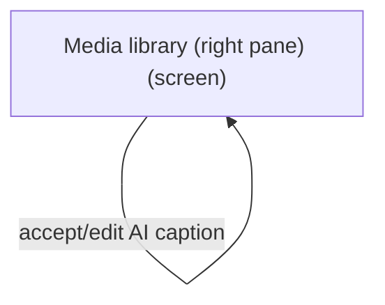
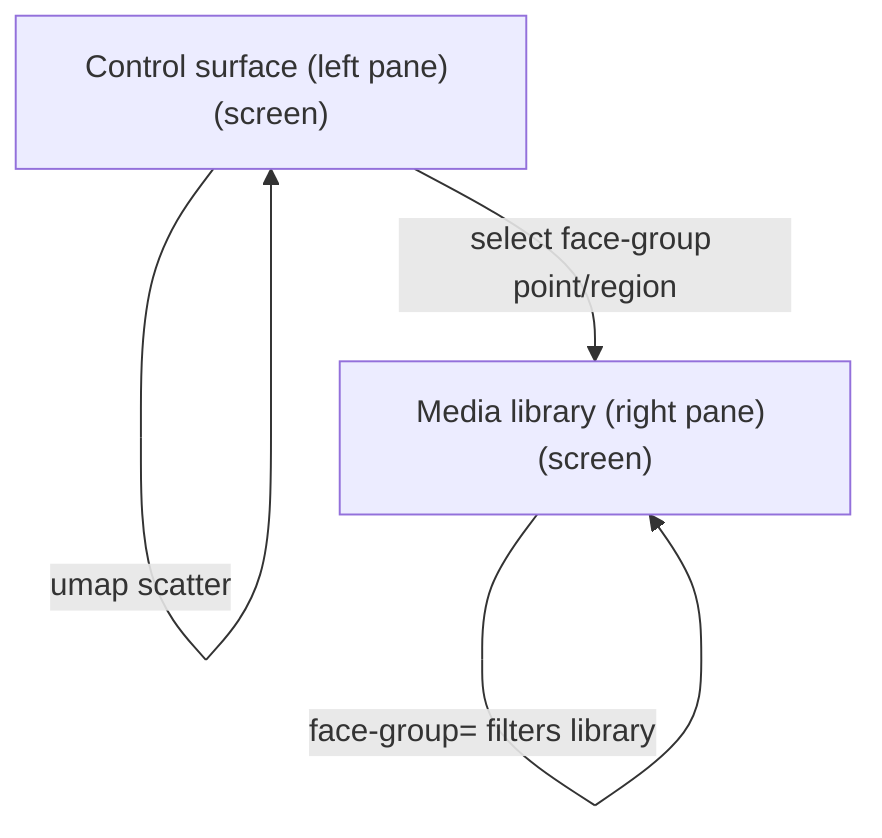
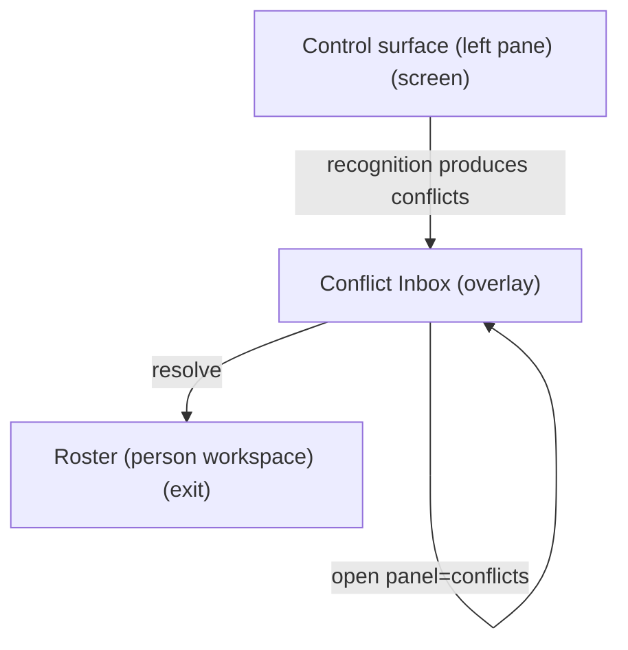
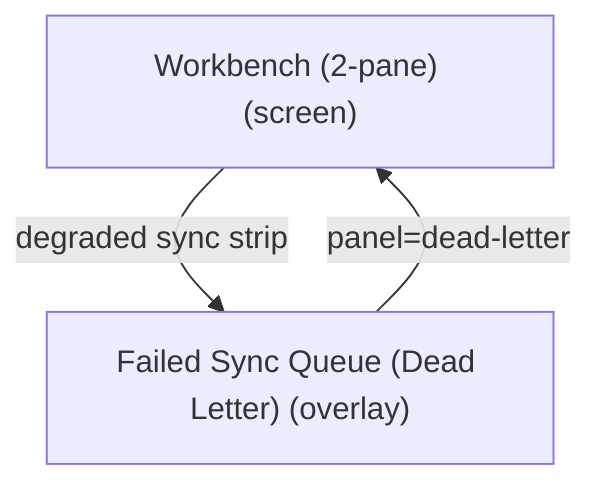

# UX Map — workbench-2pane

**Product:** `prototype-wp-alt-context`
**Source fixture:** `apps/prototype-wp-alt-context/docs/ux-maps/workbench-2pane.uxmap.json`

## Goals

- Five ACX submenus are MECE and frequency-ordered (NAV-05/NAV-06): Overview orients; Review Queue is the one home to name a person from a photo (highest-frequency demo task); People manages named people only; Description Runs is the one home to see what the describer did; Settings configures the service (rare, last) and owns Data Retention keep/delete/export policy (NAV-14: no orphan retention menu; COG-03 one save-policy action). WordPress parent slug stays Overview.
- One primary action per screen (NAV-01), reachable from zero state (rg-003); other CTAs are secondary.
- Operator runs the full recognize -> name -> curate loop and edits alt-text/descriptions without leaving one surface (control-left, library-right)
- Read face-group status at a glance in the control pane and act on the selection in the same viewport
- Decompose the 2-pane redesign from screens/zones/states/flows instead of inventing IA mid-plan

## Vocabulary

Controlled say/don't-say list for operator-facing workbench copy (UXW2-3; NAV-13/NAV-14).
Engineering terms stay legal in code identifiers, `acx_*` CSS classes, and job ids — never in
rendered strings on the review surfaces. Roster page and dashboard/jobs/ops surfaces are owned
by other lanes and are not yet covered by this list.

| Don't say | Say | Notes |
| --- | --- | --- |
| cluster | face group (unnamed) / person (once named) | A cluster the operator has not named yet is "these faces" / "this face group"; after naming it is the person |
| identities / instances | faces | Members of a group are faces |
| Review Cluster | Review these faces | Panel headline + review triggers |
| %d faces in cluster | %d faces | Count of member faces on a review card |
| Skip this cluster for now | Skip these faces for now | |
| Unnamed cluster | Unnamed face group | Merge suggestion sides |
| first/second cluster | first/second group | Merge suggestion alt text + context |
| This cluster is no longer available. | These faces are no longer available. | Queue empty-item fallback |
| Cluster member / Remove from cluster | Face / Remove this face | Review panel member rows + removal dialog |
| Just label — don't add to roster | (removed) | Naming always creates/binds a roster person; the roster is a consequence, not a decision |

## Jobs

- `job-cluster-recognize` — Build & recognize face groups (refresh groups, run recognition)
- `job-name-curate` — Name & curate people (confirm/correct/merge/split, assign names)
- `job-caption-library` — Caption & describe media (alt-text + long description on library rows)
- `job-triage-sync` — Triage people conflicts / failed sync (overlays)

## Screens

| id                      | kind    | route                           | title                           |
| ----------------------- | ------- | ------------------------------- | ------------------------------- |
| `workbench-2pane-shell` | screen  | `#/workbench`                   | Workbench (2-pane)              |
| `workbench-control`     | screen  | `#/workbench`                   | Control surface (left pane)     |
| `workbench-library`     | screen  | `#/workbench`                   | Media library (right pane)      |
| `workbench-conflicts`   | overlay | `#/workbench?panel=conflicts`   | Conflict Inbox                  |
| `workbench-dead-letter` | overlay | `#/workbench?panel=dead-letter` | Failed Sync Queue (Dead Letter) |
| `exit-roster`           | exit    | `#/roster`                      | Roster (person workspace)       |
| `exit-settings`         | exit    | `#/settings`                    | Settings / service health       |

### Workbench (2-pane) (`workbench-2pane-shell`)

Purpose: Two-pane operator surface: left control (face-group/recognize/name/curate), right media library (alt-text + long-description). Overlays host conflicts and dead-letter.

url_params: `panes`, `cluster`, `media`, `panel`, `status`, `endpoint`, `s`, `p`, `perPage`

| zone id | label | role | states |
| --- | --- | --- | --- |
| `z-topbar` | Workbench header + recognition endpoint (read-only status; server-resolved) + sync/projection status strip | status | default, loading, error, degraded |
| `z-left-host` | Left pane host (control surface) | content | default, loading, empty, error |
| `z-splitter` | Pane divider / collapse-left control | other | default |
| `z-right-host` | Right pane host (media library) | content | default, loading, empty, error |
| `z-overlay-host` | Overlay host (conflicts \| dead-letter) | other | default, empty |

```
+------------------------------------------------------------+
| Workbench (2-pane)  [screen]  #/workbench                  |
| Two-pane operator surface: left control (face-group/recog… |
+------------------------------------------------------------+
| ZONES                                                      |
|   - Workbench header + recognition endpoint (read-only st… |
|   - Left pane host (control surface) (content) states=[de… |
|   - Pane divider / collapse-left control (other) states=[… |
|   - Right pane host (media library) (content) states=[def… |
|   - Overlay host (conflicts | dead-letter) (other) states… |
+------------------------------------------------------------+
| ACTIONS                                                    |
|   [PRIMARY] Run / refresh recognition + grouping -> job-p… |
|   [secondary] Open Conflict Inbox -> workbench-conflicts   |
|   [secondary] Open Failed Sync Queue -> workbench-dead-le… |
+------------------------------------------------------------+
| states: default | loading | error | degraded | offline     |
+------------------------------------------------------------+
```

### Control surface (left pane) (`workbench-control`)

Purpose: Recognize, name, and curate: recognition endpoint + health, face-group status region, face-group list, run/refresh controls, and the name/curate forced-choice form.

url_params: `panes`, `cluster`, `endpoint`

| zone id | label | role | states |
| --- | --- | --- | --- |
| `z-endpoint` | Recognition endpoint + health (read-only: InsightFace :10010 interim; FIR when stable; target is server-resolved via ACX_RECOGNITION_URL, no UI toggle per RECOG-1) | status | default, loading, error, degraded |
| `z-recognition-controls` | Face-group/recognition controls (run, refresh, threshold) | job | default, loading, error |
| `z-cluster-umap` | Face-group status (scan/sync health; not a 2D scatter) | status | default, loading, empty, error, first_time, degraded |
| `z-cluster-list` | Face-group list / selection (size, confidence, unnamed-first) + NameFaceControl (loading = in-flight name write; the suggestions disclosure being open or closed is part of default) | queue | default, loading, empty, error, first_time, degraded |
| `z-name-curate` | Name this person (NameFaceControl; confirm / correct / merge / split; forced-choice; loading = pending roster write; error = roster write failed; edge_input = ambiguous candidate set or duplicate-name guard; default = overlay closed or suggestions open) | forced_choice | default, loading, error, edge_input |

```
+------------------------------------------------------------+
| Control surface (left pane)  [screen]  #/workbench?panes=c… |
| Recognize, name, and curate: recognition endpoint + healt… |
+------------------------------------------------------------+
| ZONES                                                      |
|   - Recognition endpoint + health (read-only: InsightFace… |
|   - Face-group/recognition controls (run, refresh, thresh… |
|   - Face-group status (scan/sync health; not a 2D scatter) |
|   - Face-group list / selection + NameFaceControl (queue)  |
|   - Name this person (NameFaceControl) (forced_choice)     |
|     z-name-curate states=[default,loading,error,edge_input] |
+------------------------------------------------------------+
| ACTIONS                                                    |
|   [PRIMARY] Run / refresh recognition + grouping -> job-p… |
|   [secondary] Save name (NameFaceControl) -> identity-store  |
|   [secondary] Select face group (list) -> library            |
|   [secondary] Go to Roster -> exit-roster                  |
|   [secondary] View / change recognition endpoint (Setting… |
|   [DESTRUCTIVE] Merge / split / correct group -> identity… |
+------------------------------------------------------------+
| states: default | loading | empty | error | first_time | … |
+------------------------------------------------------------+
```

### Media library (right pane) (`workbench-library`)

Purpose: Media library table with alt-text caption and long-description columns; inline editing, AI-suggested captions/descriptions (editable before accept), and bulk describe/scan.

url_params: `panes`, `media`, `cluster`, `status`, `s`, `p`, `perPage`

| zone id | label | role | states |
| --- | --- | --- | --- |
| `z-lib-filters` | Library filters (status, has-alt, has-description, face group, search) | form | default, loading, error |
| `z-lib-table` | Media library table (thumb \| title \| status \| alt-text \| long description \| people) | queue | default, loading, empty, error, first_time, edge_input |
| `z-lib-inline-edit` | Inline person naming (NameFaceControl) + alt-text / long-description editor (loading = pending save; the suggestions disclosure being open or closed is part of default) | form | default, loading, error, edge_input |
| `z-lib-ai-suggest` | AI name / caption suggestions (evidence-linked; editable before accept; loading = suggestion request in flight; the suggestions disclosure being open or closed is part of default) | ai_review | default, loading, empty, error |
| `z-lib-actions` | Bulk describe / scan CTAs + job progress | job | default, loading, error |

```
+------------------------------------------------------------+
| Media library (right pane)  [screen]  #/workbench?panes=li… |
| Media library table with alt-text caption and long-descri… |
+------------------------------------------------------------+
| ZONES                                                      |
|   - Library filters (status, has-alt, has-description, fa… |
|   - Media library table (thumb | title | status | alt-tex… |
|   - Inline person naming (NameFaceControl) + alt editor    |
|   - AI name / caption suggestions (ai_review)              |
|   - Bulk describe / scan CTAs + job progress (job) states… |
+------------------------------------------------------------+
| ACTIONS                                                    |
|   [PRIMARY] Edit alt-text inline -> media-store            |
|   [secondary] Bulk describe selected media -> job-pipeline … |
|   [secondary] Edit long description inline -> media-store    |
|   [secondary] Accept AI caption/description (editable) ->… |
+------------------------------------------------------------+
| states: default | loading | empty | error | first_time | … |
+------------------------------------------------------------+
```

### Conflict Inbox (`workbench-conflicts`)

Purpose: Review people conflicts; commit human judgment with evidence

url_params: `panel`

| zone id | label | role | states |
| --- | --- | --- | --- |
| `z-conflict-list` | Conflict list | queue | default, loading, empty, error |
| `z-conflict-detail` | Conflict detail / candidates | forced_choice | default, loading, empty, error |
| `z-conflict-actions` | Resolve / defer actions | form | default, loading, empty, error |

```
+------------------------------------------------------------+
| Conflict Inbox  [overlay]  #/workbench?panel=conflicts     |
| Review people conflicts; commit human judgment with evide… |
+------------------------------------------------------------+
| ZONES                                                      |
|   - Conflict list (queue) states=[default,loading,empty,error] |
|   - Conflict detail / candidates (forced_choice) states=[… |
|   - Resolve / defer actions (form) states=[default,loading,empty,error] |
+------------------------------------------------------------+
| ACTIONS                                                    |
|   [PRIMARY] Resolve conflict -> identity-store (costly,pr… |
+------------------------------------------------------------+
| states: default | loading | empty | error                  |
+------------------------------------------------------------+
```

### Failed Sync Queue (Dead Letter) (`workbench-dead-letter`)

Purpose: Inspect failed sync ops; retry or discard

url_params: `panel`

| zone id | label | role | states |
| --- | --- | --- | --- |
| `z-dl-list` | Dead-letter items | queue | default, loading, empty, error |
| `z-dl-actions` | Retry / discard | form | default, loading, empty, error |

```
+------------------------------------------------------------+
| Failed Sync Queue (Dead Letter)  [overlay]  #/workbench?p… |
| Inspect failed sync ops; retry or discard                  |
+------------------------------------------------------------+
| ZONES                                                      |
|   - Dead-letter items (queue) states=[default,loading,emp… |
|   - Retry / discard (form) states=[default,loading,empty,error] |
+------------------------------------------------------------+
| ACTIONS                                                    |
|   [PRIMARY] Retry failed op -> sync (costly,preview)       |
|   [DESTRUCTIVE] Discard failed op -> sync (costly,preview… |
+------------------------------------------------------------+
| states: default | loading | empty | error                  |
+------------------------------------------------------------+
```

### Roster (person workspace) (`exit-roster`)

Purpose: Manage identified persons after naming/curating in Workbench

url_params: `personFilter`, `person`

| zone id | label | role | states |
| --- | --- | --- | --- |
| `z-roster-entry` | Roster entry | nav | default |

```
+------------------------------------------------------------+
| Roster (person workspace)  [exit]  #/roster                |
| Manage identified persons after naming/curating in Workbe… |
+------------------------------------------------------------+
| ZONES                                                      |
|   - Roster entry (nav) states=[default]                    |
+------------------------------------------------------------+
| states: default | loading | empty | error                  |
+------------------------------------------------------------+
```

### Settings / service health (`exit-settings`)

Purpose: Configure recognition target, connection health, and data retention (NAV-05: one place per concern; retention is the last Settings section, not a top-level destination).

url_params: `section`

| zone id | label | role | states |
| --- | --- | --- | --- |
| `z-settings-form` | Settings form + test connection | form | default, loading, error |
| `data_retention` | Data & retention (keep/delete/export policy; last Settings section; loading = saving) | form | default, loading, error |

```
+------------------------------------------------------------+
| Settings / service health  [exit]  #/settings              |
| Configure recognition target, connection health, and data  |
| retention (last section; save_retention = Save policy)     |
+------------------------------------------------------------+
| ZONES                                                      |
|   - Settings form + test connection (form) states=[defaul… |
|   - Data & retention (keep/delete/export policy; last Set… |
+------------------------------------------------------------+
| states: default | loading | error                          |
+------------------------------------------------------------+
```

## Flows

### Run recognition -> select face group -> name/curate -> library people column updates (`flow-recognize-name-curate`)

```mermaid
flowchart TD
  %% flow: Run recognition -> select face group -> name/curate -> library people column updates job=job-name-curate
  n_workbench_2pane_shell["Workbench (2-pane) (screen)"]
  n_workbench_control["Control surface (left pane) (screen)"]
  n_workbench_2pane_shell -->|enter| n_workbench_control
  n_workbench_control -->|run recognition (preview cost)| n_workbench_control
  n_workbench_control -->|select face group (umap/list)| n_workbench_control
  n_workbench_library["Media library (right pane) (screen)"]
  n_workbench_control -->|name / curate| n_workbench_library
```

### Filter needs-alt -> accept/edit AI caption -> edit long description (`flow-caption-library`)



### UMAP scatter -> select face group -> right library filters to face-group media (`flow-umap-select-to-library`)



### Recognition produces conflicts -> conflict overlay -> resolve -> roster if needed (`flow-scan-to-conflict`)



### Sync failure -> dead letter -> retry/discard (`flow-dead-letter-recover`)



## Open questions

- OPEN: long-description has no data field yet (media items have only alt text). Ship the alt-text column first, long-description behind a new field? [FORM]
- OPEN: no 2D projection data exists (only bbox + 3D head pose). Ship the left pane as a face-group list first; scatter map is a fast-follow once a projection endpoint exists? [VIZ-01,VIZ-15]
- RESOLVED: operator vocab is group / person / face — never cluster / identities / embeddings. Enforced by the banned-vocabulary sweep.
- OPEN: Selecting a face group in the map/list: filter the right library pane, open the naming form, or both (coordinated views)? [VIZ-15]
- RESOLVED: one naming surface (NameFaceControl) with a single-gesture Save name; overlay candidates and confirm share that control.
- OPEN: Endpoint switch (InsightFace vs FIR/SFace) changes the recognition model server-side; do existing face groups invalidate and need a fresh grouping on switch? [HAI-02]
- OPEN: Left/right min-width + left-collapse on narrow (<1100px) viewports; control collapses to a drawer, library stays reachable? [NAV-08,A11Y-08]
- OPEN: Alt-text vs long-description: two fixed columns or one expandable row-detail? [PERC-01,UI-04]
- OPEN: Bulk-describe cost preview granularity: per-image cost surfaced before start? [INT-07]

## Parity index

Zone ids: z-topbar z-left-host z-splitter z-right-host z-overlay-host z-endpoint z-recognition-controls z-cluster-umap z-cluster-list z-name-curate z-lib-filters z-lib-table z-lib-inline-edit z-lib-ai-suggest z-lib-actions z-conflict-list z-conflict-detail z-conflict-actions z-dl-list z-dl-actions z-roster-entry z-settings-form

Action ids: act-scan-media-queue act-run-recognition act-select-cluster act-name-cluster act-curate-cluster act-view-endpoint-settings act-edit-alt act-edit-desc act-accept-ai-caption act-bulk-describe act-open-conflicts act-open-dead-letter act-resolve-conflict act-retry-dead-letter act-discard-dead-letter act-goto-roster

Zone labels (verbatim; the tables above escape `|` for markdown, this list does not):

- Workbench header + recognition endpoint (read-only status; server-resolved) + sync/projection status strip
- Left pane host (control surface)
- Pane divider / collapse-left control
- Right pane host (media library)
- Overlay host (conflicts | dead-letter)
- Recognition endpoint + health (read-only: InsightFace :10010 interim; FIR when stable; target is server-resolved via ACX_RECOGNITION_URL, no UI toggle per RECOG-1)
- Face-group/recognition controls (run, refresh, threshold)
- Face-group status (scan/sync health; not a 2D scatter)
- Face-group list / selection (size, confidence, unnamed-first) + NameFaceControl (loading = in-flight name write; the suggestions disclosure being open or closed is part of default)
- Name this person (NameFaceControl; confirm / correct / merge / split; forced-choice; loading = pending roster write; error = roster write failed; edge_input = ambiguous candidate set or duplicate-name guard; default = overlay closed or suggestions open)
- Library filters (status, has-alt, has-description, face group, search)
- Media library table (thumb | title | status | alt-text | long description | people)
- Inline person naming (NameFaceControl) + alt-text / long-description editor (loading = pending save; the suggestions disclosure being open or closed is part of default)
- AI name / caption suggestions (evidence-linked; editable before accept; loading = suggestion request in flight; the suggestions disclosure being open or closed is part of default)
- Bulk describe / scan CTAs + job progress
- Conflict list
- Conflict detail / candidates
- Resolve / defer actions
- Dead-letter items
- Retry / discard
- Roster entry
- Settings form + test connection
- Data & retention (keep/delete/export policy; last Settings section; loading = saving)

States (all zones): default loading empty error offline first_time edge_input degraded

## Not doing

- Clusters tab inside Roster (retired; cluster structure lives in Workbench left pane now)
- UI toggle for the recognition endpoint (server-resolved per RECOG-1; topbar is read-only status)
- Pixel/token values (design tokens referenced --acx-\*, not specified here)
- Attachment-edit SPA (separate map_ref)
- Big-bang removal of the current tabbed shell (migration path, not in this map)
- REST sequence diagrams (see docs/workbench-data-flow.mmd)
