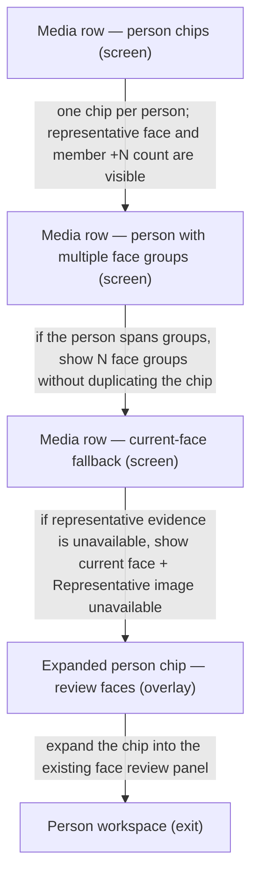

# UX Map — workbench-identity-chips

**Product:** `prototype-wp-alt-context`
**Source fixture:** `apps/prototype-wp-alt-context/js/admin/pages/workbench/identity-clusters/IdentityClusterList.tsx`

## Goals
- Show one person chip per person in each media row; a person's face-group membership stays in the +N count instead of becoming duplicate chips.
- Render the store's representative face crop before the person label (HAI-01/HAI-17); use the current face only when representative evidence is unavailable.
- Keep optional person_id and representative_face absence unresolved and visible without fabricating a person or representative image (rg-015, DDIA).
- Keep ungrouped residue in one Not yet grouped (N) section with every unresolved face; never render N Unnamed person cards or visually deduplicate faces (GPUFLOW-2 C5).
- Expose an N face groups badge when one person spans more than one face group, and let the chip expand into the existing face review panel.
- Let chip name, avatar, and face-group-count buttons open the person workspace while preserving reversible roster merge behavior (INT-07, INT-09).

## Jobs
- `job-media-person-chips` — Read person chips in a media row and verify face evidence
- `job-review-person-evidence` — Expand a person chip into face-group review or the person workspace

## Screens
| id | kind | route | title |
| --- | --- | --- | --- |
| `workbench-media-row-person-chips` | screen | `#/workbench?media=` | Media row — person chips |
| `workbench-media-row-face-group-badge` | screen | `#/workbench?media=` | Media row — person with multiple face groups |
| `workbench-media-row-current-face-fallback` | screen | `#/workbench?media=` | Media row — current-face fallback |
| `workbench-person-chip-expanded` | overlay | `#/workbench?media=&cluster=` | Expanded person chip — review faces |
| `exit-roster` | exit | `#/roster?person=` | Person workspace |

### Media row — person chips (`workbench-media-row-person-chips`)

Purpose: A media row renders one chip per resolved person: the representative face evidence comes first, followed by the person label and member +N count; unresolved faces remain available for face-group review in one Not yet grouped (N) section.

url_params: `media`

| zone id | label | role | states |
| --- | --- | --- | --- |
| `z-media-row` | Selected media row (title, description status, and person chip rail) | content | default, loading, empty, error |
| `z-person-chip-rail` | One person chip per person (no duplicate chip for each face group) | ai_review | default, loading, empty, error, degraded |
| `z-ungrouped-residue` | Not yet grouped section (every unresolved face, never N Unnamed person cards) | ai_review | default, error, degraded |
| `z-representative-avatar` | Representative face avatar (store reference crop rendered before the person's label) | ai_review | default, error, degraded |
| `z-member-count` | Member count (+N faces on this person chip) | status | default, loading, empty, error |
| `z-chip-actions` | Person chip buttons (expand face-group review or open person workspace) | form | default, loading, error |

```
+------------------------------------------------------------+
| Media row — person chips  [screen]  #/workbench?media=     |
| A media row renders one chip per resolved person: the rep… |
+------------------------------------------------------------+
| ZONES                                                      |
|   - Selected media row (title, description status, and pe… |
|   - One person chip per person (no duplicate chip for eac… |
|   - Not yet grouped section (every unresolved face, never… |
|   - Representative face avatar (store reference crop rend… |
|   - Member count (+N faces on this person chip) (status) … |
|   - Person chip buttons (expand face-group review or open… |
+------------------------------------------------------------+
| ACTIONS                                                    |
|   [secondary] Expand face-group review -> workbench-perso… |
|   [secondary] Open person workspace -> exit-roster         |
+------------------------------------------------------------+
| states: default | loading | empty | error | degraded       |
+------------------------------------------------------------+
```

### Media row — person with multiple face groups (`workbench-media-row-face-group-badge`)

Purpose: The same person keeps one chip when person_id spans several face groups; the chip adds an N face groups badge while retaining the representative avatar and member +N count.

url_params: `media`

| zone id | label | role | states |
| --- | --- | --- | --- |
| `z-multi-group-chip` | One person chip spanning multiple face groups (person_id is the grouping key) | ai_review | default, loading, error, degraded |
| `z-face-group-badge` | N face groups badge when the person spans more than one face group | status | default, error, degraded |
| `z-multi-group-avatar` | Representative face avatar shared by the person chip | ai_review | default, error, degraded |
| `z-multi-group-member-count` | Member count (+N faces across this person's face groups) | status | default, loading, error |
| `z-multi-group-actions` | Person chip buttons (review the face groups or open the person workspace) | form | default, loading, error |

```
+------------------------------------------------------------+
| Media row — person with multiple face groups  [screen]  #… |
| The same person keeps one chip when person_id spans sever… |
+------------------------------------------------------------+
| ZONES                                                      |
|   - One person chip spanning multiple face groups (person… |
|   - N face groups badge when the person spans more than o… |
|   - Representative face avatar shared by the person chip … |
|   - Member count (+N faces across this person's face grou… |
|   - Person chip buttons (review the face groups or open t… |
+------------------------------------------------------------+
| ACTIONS                                                    |
|   [secondary] Open person workspace -> exit-roster         |
|   [secondary] Review N face groups -> workbench-person-ch… |
+------------------------------------------------------------+
| states: default | loading | error | degraded               |
+------------------------------------------------------------+
```

### Media row — current-face fallback (`workbench-media-row-current-face-fallback`)

Purpose: When representative_face is absent or its image fields are unavailable, show the current face as a fallback and expose the representativeVocabulary copy “Representative image unavailable”; never synthesize representative evidence.

url_params: `media`

| zone id | label | role | states |
| --- | --- | --- | --- |
| `z-current-face-avatar` | Current face fallback avatar (used only when representative evidence is unavailable) | ai_review | default, loading, error, degraded |
| `z-representative-unavailable-copy` | Fallback copy: Representative image unavailable (canonical representativeVocabulary text) | status | default, error, degraded |
| `z-fallback-member-count` | Member count remains visible (+N faces) while representative evidence is unavailable | status | default, loading, error |
| `z-fallback-actions` | Fallback chip buttons (expand face-group review or open person workspace) | form | default, loading, error |

```
+------------------------------------------------------------+
| Media row — current-face fallback  [screen]  #/workbench?… |
| When representative_face is absent or its image fields ar… |
+------------------------------------------------------------+
| ZONES                                                      |
|   - Current face fallback avatar (used only when represen… |
|   - Fallback copy: Representative image unavailable (cano… |
|   - Member count remains visible (+N faces) while represe… |
|   - Fallback chip buttons (expand face-group review or op… |
+------------------------------------------------------------+
| ACTIONS                                                    |
|   [secondary] Open person workspace -> exit-roster         |
|   [secondary] Review current face evidence -> workbench-p… |
+------------------------------------------------------------+
| states: default | loading | error | degraded               |
+------------------------------------------------------------+
```

### Expanded person chip — review faces (`workbench-person-chip-expanded`)

Purpose: The expanded chip enters the existing member review panel so the operator can inspect face evidence, show all members, remove a face, close the panel, or open the person workspace.

url_params: `media`, `cluster`

| zone id | label | role | states |
| --- | --- | --- | --- |
| `z-expanded-face-evidence` | Expanded face evidence (representative and current faces remain linked to their media) | ai_review | default, loading, empty, error, degraded |
| `z-expanded-face-members` | Expanded face members (show all members or remove this face) | forced_choice | default, loading, empty, error, degraded |
| `z-expanded-actions` | Close face review / open person workspace | form | default, loading, error |

```
+------------------------------------------------------------+
| Expanded person chip — review faces  [overlay]  #/workben… |
| The expanded chip enters the existing member review panel… |
+------------------------------------------------------------+
| ZONES                                                      |
|   - Expanded face evidence (representative and current fa… |
|   - Expanded face members (show all members or remove thi… |
|   - Close face review / open person workspace (form) stat… |
+------------------------------------------------------------+
| ACTIONS                                                    |
|   [secondary] Close face review -> workbench-media-row-pe… |
|   [secondary] Open person workspace -> exit-roster         |
+------------------------------------------------------------+
| states: default | loading | empty | error | degraded       |
+------------------------------------------------------------+
```

### Person workspace (`exit-roster`)

Purpose: Person chip name, avatar, or face-group-count button opens the named person's workspace and preserves the media-row context when the operator returns.

url_params: `person`, `media`

| zone id | label | role | states |
| --- | --- | --- | --- |
| `z-roster-person-entry` | Person workspace entry from a chip button | nav | default |

```
+------------------------------------------------------------+
| Person workspace  [exit]  #/roster?person=                 |
| Person chip name, avatar, or face-group-count button open… |
+------------------------------------------------------------+
| ZONES                                                      |
|   - Person workspace entry from a chip button (nav) state… |
+------------------------------------------------------------+
| states: default | loading | error                          |
+------------------------------------------------------------+
```

## Actions

| id | verb | target | hierarchy | costly | irreversible | preview required | screen id |
| --- | --- | --- | --- | --- | --- | --- | --- |
| `act-expand-person-chip` | Expand face-group review | `workbench-person-chip-expanded` | secondary | no | no | no | `workbench-media-row-person-chips` |
| `act-open-person-workspace-from-chip` | Open person workspace | `exit-roster` | secondary | no | no | no | `workbench-media-row-person-chips` |
| `act-review-multi-group-person` | Review N face groups | `workbench-person-chip-expanded` | secondary | no | no | no | `workbench-media-row-face-group-badge` |
| `act-open-person-workspace-from-multi-group-chip` | Open person workspace | `exit-roster` | secondary | no | no | no | `workbench-media-row-face-group-badge` |
| `act-review-current-face-fallback` | Review current face evidence | `workbench-person-chip-expanded` | secondary | no | no | no | `workbench-media-row-current-face-fallback` |
| `act-open-person-workspace-from-fallback` | Open person workspace | `exit-roster` | secondary | no | no | no | `workbench-media-row-current-face-fallback` |
| `act-close-person-chip-review` | Close face review | `workbench-media-row-person-chips` | secondary | no | no | no | `workbench-person-chip-expanded` |
| `act-open-person-workspace-from-review` | Open person workspace | `exit-roster` | secondary | no | no | no | `workbench-person-chip-expanded` |

## Flows
### Media row person chip → evidence review → person workspace (`flow-person-chip-evidence`)



## Open questions
- When person_id is absent, should the unresolved face-group result show a neutral chip action or remain only in the review queue?
- Should returning from the person workspace restore the expanded face review panel or only the media row scroll position?

## Suggested task-slice decomposition (from map)

1. Group media identities by optional person_id while preserving unresolved face groups
2. Render representative face evidence, N face groups, and member +N chip states
3. Render current-face fallback with canonical Representative image unavailable copy
4. Connect chip actions to face review and the person workspace
5. Collapse ungrouped residue into one Not yet grouped (N) section without visually deduplicating faces

## Parity index

Machine-checked by `js/admin/__tests__/uxmap-parity.test.ts` and
`js/admin/__tests__/uxmap-render-parity.test.ts`: every id, state, and verbatim label
below must exist in the sibling `.uxmap.json`, and no `z-*`/`act-*` id may appear here
that the JSON does not define. Regenerate with `docs/ux-maps/render_ux_maps.py` — never
hand-edit one side.

Zone ids: z-media-row z-person-chip-rail z-ungrouped-residue z-representative-avatar z-member-count z-chip-actions z-multi-group-chip z-face-group-badge z-multi-group-avatar z-multi-group-member-count z-multi-group-actions z-current-face-avatar z-representative-unavailable-copy z-fallback-member-count z-fallback-actions z-expanded-face-evidence z-expanded-face-members z-expanded-actions z-roster-person-entry

Action ids: act-expand-person-chip act-open-person-workspace-from-chip act-review-multi-group-person act-open-person-workspace-from-multi-group-chip act-review-current-face-fallback act-open-person-workspace-from-fallback act-close-person-chip-review act-open-person-workspace-from-review

Zone labels (verbatim; the tables above escape `|` for markdown, this list does not):

- Selected media row (title, description status, and person chip rail)
- One person chip per person (no duplicate chip for each face group)
- Not yet grouped section (every unresolved face, never N Unnamed person cards)
- Representative face avatar (store reference crop rendered before the person's label)
- Member count (+N faces on this person chip)
- Person chip buttons (expand face-group review or open person workspace)
- One person chip spanning multiple face groups (person_id is the grouping key)
- N face groups badge when the person spans more than one face group
- Representative face avatar shared by the person chip
- Member count (+N faces across this person's face groups)
- Person chip buttons (review the face groups or open the person workspace)
- Current face fallback avatar (used only when representative evidence is unavailable)
- Fallback copy: Representative image unavailable (canonical representativeVocabulary text)
- Member count remains visible (+N faces) while representative evidence is unavailable
- Fallback chip buttons (expand face-group review or open person workspace)
- Expanded face evidence (representative and current faces remain linked to their media)
- Expanded face members (show all members or remove this face)
- Close face review / open person workspace
- Person workspace entry from a chip button

States (all zones and screens): default loading empty error degraded

## Not doing
- Creating one person chip per face group
- Showing a guessed representative image when representative_face is absent
- Auto-merging people from a matching label without a preview
- Pixel or token design; implementation uses the existing --acx-* system
