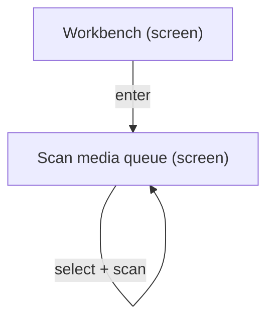
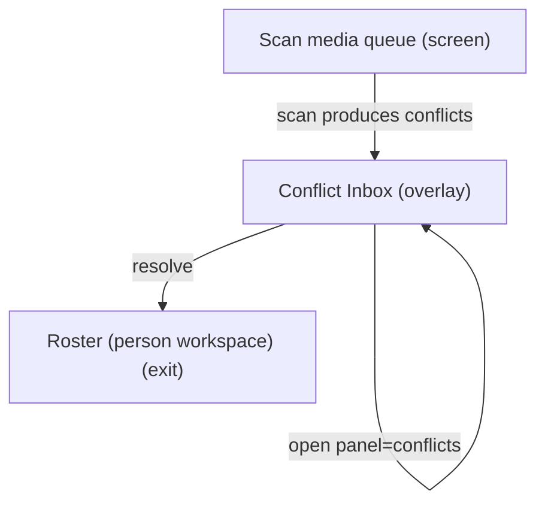
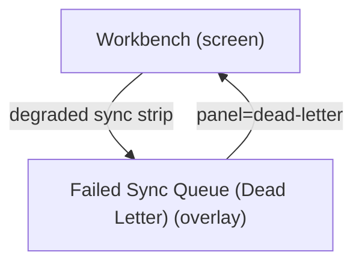

# UX Map — workbench-operator-loop

**Product:** `prototype-wp-alt-context`
**Source fixture:** `packages/mcp-workbay-canvas/tests/fixtures/ux_maps/workbench-operator-loop.uxmap.json`

## Goals

- Operator clears media queue via Scan and resolves identity conflicts without losing place
- Decompose Workbench UI tasks from screens/zones/states/flows instead of inventing IA mid-plan

## Jobs

- `job-clear-queue` — Clear media queue (scan / describe)
- `job-resolve-conflicts` — Resolve identity conflicts
- `job-recover-sync` — Recover from sync / dead-letter failures
- `job-assign-people` — Assign people (exit to Roster)

## Screens

| id | kind | route | title | url_params |
| --- | --- | --- | --- | --- |
| `workbench-shell` | screen | `#/workbench` | Workbench | `tab`, `panel`, `advanced`, `status`, `media`, `rq`, `queue`, `face`, `cluster` |
| `workbench-scan` | screen | `#/workbench?tab=scan` | Scan media queue | `tab`, `status`, `media`, `s`, `p`, `perPage`, `panel`, `cluster` |
| `workbench-review-panel` | screen | `#/workbench?tab=scan&panel=review&cluster=` | Review these faces | `tab`, `panel`, `cluster`, `rq` |
| `workbench-conflicts` | overlay | `#/workbench?panel=conflicts` | Conflict Inbox | `panel` |
| `workbench-dead-letter` | overlay | `#/workbench?panel=dead-letter` | Failed Sync Queue (Dead Letter) | `panel` |
| `exit-roster` | exit | `#/roster` | Roster (person workspace) | `personFilter`, `person` |
| `exit-settings` | exit | `#/settings` | Settings / service health | — |

### Workbench (`workbench-shell`)

Purpose: Operator surface for media queue scan, job pipeline, sync health, and review overlays

url_params: `tab`, `panel`, `advanced`, `status`, `media`, `rq`, `queue`, `face`, `cluster`

| zone id | label | role | states |
| --- | --- | --- | --- |
| `z-tabs` | Workbench steps tabs | nav | default |
| `z-sync` | Sync / projection status strip | status | default, loading, error, degraded |
| `z-overlay-host` | Overlay host (conflicts \| dead-letter) | other | default, empty |
| `z-main-tab` | Active tab content (Scan) | content | default, loading, empty, error |
| `z-advanced` | Advanced drawer | form | default, empty |

```
+------------------------------------------------------------+
| Workbench  [screen]  #/workbench                           |
| Operator surface for media queue scan, job pipeline, sync  |
| health, and review overlays                                |
+------------------------------------------------------------+
| ZONES                                                      |
|   - Workbench steps tabs (nav)                             |
|   - Sync / projection status strip (status)                |
|   - Overlay host (conflicts | dead-letter) (other)         |
|   - Active tab content (Scan) (content)                    |
|   - Advanced drawer (form)                                 |
+------------------------------------------------------------+
| ACTIONS                                                    |
|   [PRIMARY] Open Scan -> workbench-scan                    |
|   [secondary] Open Conflict Inbox -> workbench-conflicts   |
|   [secondary] Open Failed Sync Queue -> workbench-dead-le… |
|   [secondary] Retry projection sync -> projection (costly… |
+------------------------------------------------------------+
| states: default | loading | error | degraded | offline     |
+------------------------------------------------------------+
```

### Scan media queue (`workbench-scan`)

Purpose: Filter and select library media; run scan faces / describe pipeline

url_params: `tab`, `status`, `media`, `s`, `p`, `perPage`, `rq`, `panel`, `cluster`

| zone id | label | role | states |
| --- | --- | --- | --- |
| `z-review-queue` | Review queue header / count with kind+band filter chips, card-at-a-time (rq= URL is the single owner of chip state) | queue | default, loading, empty, filtered_empty, drained, error |
| `z-review-panel` | Face-group review panel (panel=review&cluster=) | ai_review | default, loading, error, empty |
| `z-filters` | Status / search filters | form | default, edge_input |
| `z-media-queue` | Media selection table | queue | default, loading, empty, error |
| `z-job-cta` | Scan / analyze CTAs + job progress | job | default, loading, error |
| `z-identity-preview` | Identity / findings preview (AI-assisted) | ai_review | default, empty, loading |

```
+------------------------------------------------------------+
| Scan media queue  [screen]  #/workbench?tab=scan           |
| Filter and select library media; run scan faces / describe |
| pipeline                                                   |
+------------------------------------------------------------+
| ZONES                                                      |
|   - Review queue header / count with kind+band filter ch… |
|   - Face-group review panel (panel=review&cluster=) (ai_… |
|   - Status / search filters (form) states=[default,edge_i… |
|   - Media selection table (queue) states=[default,loading… |
|   - Scan / analyze CTAs + job progress (job) states=[defa… |
|   - Identity / findings preview (AI-assisted) (ai_review)  |
|     states=[default,empty,loading,error,degraded,          |
|             unavailable,repair,zero_evidence]              |
|     code_ref=WorkbenchFindingsPanel.tsx                    |
|   - Review Suggestions queue header / count (status)       |
|     states=[default,loading,empty,error,filtered,repair]   |
|     code_ref=ReviewQueue.tsx                               |
|   - Top-of-queue group card (ai_review)                    |
|     states=[default,suggested_label,busy,read_only,        |
|             missing_image]                                 |
|     code_ref=TopClusterCard.tsx                            |
+------------------------------------------------------------+
| ACTIONS                                                    |
|   [PRIMARY] Scan selected media -> job-pipeline (costly,p… |
|   [secondary] Go to Roster -> exit-roster                  |
+------------------------------------------------------------+
| states: default | loading | empty | error | first_time | edge_input | reviewing |
+------------------------------------------------------------+
```

### Review these faces (`workbench-review-panel`)

Purpose: Review the faces in one unnamed group; Back returns to Review Suggestions

url_params: `tab`, `panel`, `cluster`, `rq`

code_ref: ClusterReviewPanel.tsx (header + Back, faces grid, show-all, remove-confirm modal; no name input)

| zone id | label | role | states |
| --- | --- | --- | --- |
| `z-review-header` | Header + Back | nav | default |
| `z-review-faces` | Faces grid | ai_review | default, loading, error, empty |

```
+------------------------------------------------------------+
| Review these faces  [screen]                               |
| #/workbench?tab=scan&panel=review&cluster=                 |
| Review the faces in one unnamed group; Back returns to     |
| Review Suggestions                                         |
+------------------------------------------------------------+
| ZONES                                                      |
|   - Header + Back (nav)                                    |
|   - Faces grid (ai_review)                                 |
+------------------------------------------------------------+
| ACTIONS                                                    |
|   [PRIMARY] Back to Review Suggestions -> workbench-scan   |
+------------------------------------------------------------+
| states: default | loading | error | empty                  |
| code_ref: ClusterReviewPanel.tsx                           |
+------------------------------------------------------------+
```

### Conflict Inbox (`workbench-conflicts`)

Purpose: Review identity conflicts; commit human judgment with evidence

url_params: `panel`

| zone id | label | role | states |
| --- | --- | --- | --- |
| `z-conflict-list` | Conflict list | queue | default, loading, empty |
| `z-conflict-detail` | Conflict detail / candidates | forced_choice | default, loading, empty |
| `z-conflict-actions` | Resolve / defer actions | form | default |

```
+------------------------------------------------------------+
| Conflict Inbox  [overlay]  #/workbench?panel=conflicts     |
| Review identity conflicts; commit human judgment with evi… |
+------------------------------------------------------------+
| ZONES                                                      |
|   - Conflict list (queue)                                  |
|   - Conflict detail / candidates (forced_choice)           |
|   - Resolve / defer actions (form)                         |
+------------------------------------------------------------+
| ACTIONS                                                    |
|   [PRIMARY] Resolve conflict -> identity-store (costly,pr… |
+------------------------------------------------------------+
| states: default | loading | empty | error                  |
+------------------------------------------------------------+
```

### Failed Sync Queue (Dead Letter) (`workbench-dead-letter`)

Purpose: Inspect failed sync ops; retry or discard

url_params: `panel`

| zone id | label | role | states |
| --- | --- | --- | --- |
| `z-dl-list` | Dead-letter items | queue | default, loading, empty |
| `z-dl-actions` | Retry / discard | form | default |

```
+------------------------------------------------------------+
| Failed Sync Queue (Dead Letter)  [overlay]  #/workbench?p… |
| Inspect failed sync ops; retry or discard                  |
+------------------------------------------------------------+
| ZONES                                                      |
|   - Dead-letter items (queue)                              |
|   - Retry / discard (form)                                 |
+------------------------------------------------------------+
| ACTIONS                                                    |
|   [PRIMARY] Retry failed op -> sync (costly,preview)       |
|   [DESTRUCTIVE] Discard failed op -> sync (costly,preview… |
+------------------------------------------------------------+
| states: default | loading | empty | error                  |
+------------------------------------------------------------+
```

### Roster (person workspace) (`exit-roster`)

Purpose: Assign unassigned faces / manage identities after scan or conflict

url_params: `personFilter`, `person`

| zone id | label | role | states |
| --- | --- | --- | --- |
| `z-roster-main` | Entries / clusters workspace | content | default, empty |

```
+------------------------------------------------------------+
| Roster (person workspace)  [exit]  #/roster                |
| Assign unassigned faces / manage identities after scan or… |
+------------------------------------------------------------+
| ZONES                                                      |
|   - Entries / clusters workspace (content)                 |
+------------------------------------------------------------+
| states: default | loading | empty | error                  |
+------------------------------------------------------------+
```

### Settings / service health (`exit-settings`)

Purpose: Configure recognition target and connection health

| zone id | label | role | states |
| --- | --- | --- | --- |
| `z-settings-form` | Settings form + test connection | form | default, error |

```
+------------------------------------------------------------+
| Settings / service health  [exit]  #/settings              |
| Configure recognition target and connection health         |
+------------------------------------------------------------+
| ZONES                                                      |
|   - Settings form + test connection (form)                 |
+------------------------------------------------------------+
| states: default | loading | error                          |
+------------------------------------------------------------+
```

## Flows

### Select media → scan → continue (`flow-scan-happy`)



### Scan → conflict overlay → resolve → roster if needed (`flow-scan-to-conflict`)



### Sync failure → dead letter → retry/discard (`flow-dead-letter-recover`)



## Open questions

- Should Scan CTAs require selection count preview on the same surface before start? ([INT-07])
- Conflict shortlist max_candidates=5 — confirm product policy vs model top-k
- Does empty media queue show first_time guidance or empty-only copy?

## Not doing

- Resurrect confirm tab (E21-10)
- Pixel/token design in this map
- Attachment-edit SPA (separate map_ref later)
- REST sequence diagrams (see docs/workbench-data-flow.mmd)
