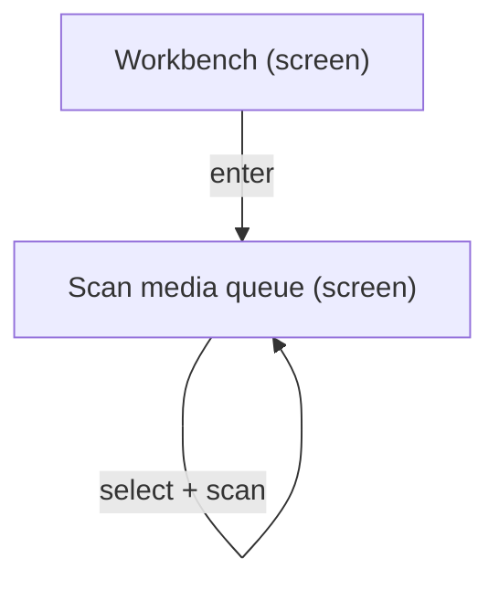
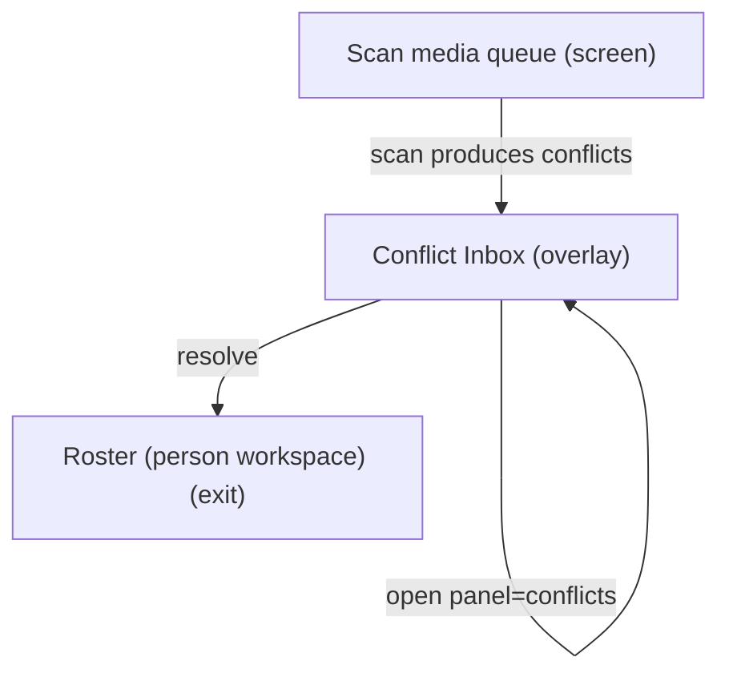
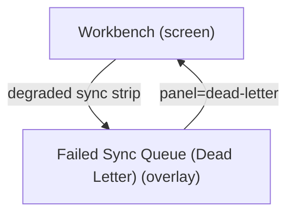

# UX Map — workbench-operator-loop

**Product:** `prototype-wp-alt-context`
**Source fixture:** `packages/mcp-workbay-canvas/tests/fixtures/ux_maps/workbench-operator-loop.uxmap.json`

## Goals

- Operator clears media queue via Scan and resolves identity conflicts without losing place
- Decompose Workbench UI tasks from screens/zones/states/flows instead of inventing IA mid-plan

## Jobs

- `job-clear-queue` — Clear media queue (scan / describe)
- `job-resolve-conflicts` — Resolve identity conflicts
- `job-recover-sync` — Recover from sync / dead-letter failures
- `job-assign-people` — Assign people (exit to Roster)

## Screens

| id                      | kind    | route                           | title                           |
| ----------------------- | ------- | ------------------------------- | ------------------------------- |
| `workbench-shell`       | screen  | `#/workbench`                   | Workbench                       |
| `workbench-scan`        | screen  | `#/workbench?tab=scan`          | Scan media queue                |
| `workbench-conflicts`   | overlay | `#/workbench?panel=conflicts`   | Conflict Inbox                  |
| `workbench-dead-letter` | overlay | `#/workbench?panel=dead-letter` | Failed Sync Queue (Dead Letter) |
| `exit-roster`           | exit    | `#/roster`                      | Roster (person workspace)       |
| `exit-settings`         | exit    | `#/settings`                    | Settings / service health       |

### Workbench (`workbench-shell`)

```
+------------------------------------------------------------+
| Workbench  [screen]  #/workbench                           |
| Operator surface for media queue scan, job pipeline, sync… |
+------------------------------------------------------------+
| ZONES                                                      |
|   - Workbench steps tabs (nav) states=[default]            |
|   - Sync / projection status strip (status) states=[defau… |
|   - Overlay host (conflicts | dead-letter) (other) states… |
|   - Active tab content (Scan) (content) states=[default,l… |
|   - Advanced drawer (form) states=[default,empty]          |
+------------------------------------------------------------+
| ACTIONS                                                    |
|   [PRIMARY] Open Scan -> workbench-scan                    |
|   [secondary] Open Conflict Inbox -> workbench-conflicts   |
|   [secondary] Open Failed Sync Queue -> workbench-dead-le… |
|   [secondary] Retry projection sync -> projection (costly… |
+------------------------------------------------------------+
| states: default | loading | error | degraded | offline     |
+------------------------------------------------------------+
```

### Scan media queue (`workbench-scan`)

```
+------------------------------------------------------------+
| Scan media queue  [screen]  #/workbench?tab=scan           |
| Filter and select library media; run scan faces / describ… |
+------------------------------------------------------------+
| ZONES                                                      |
|   - Review queue (queue) states=[default,filtered_empty,… |
|   - Status / search filters (form) states=[default,edge_i… |
|   - Media selection table (queue) states=[default,loading… |
|   - Scan / analyze CTAs + job progress (job) states=[defa… |
|   - Identity / findings preview (AI-assisted) (ai_review)… |
+------------------------------------------------------------+
| ACTIONS                                                    |
|   [PRIMARY] Scan selected media -> job-pipeline (costly,p… |
|   [secondary] Go to Roster -> exit-roster                  |
+------------------------------------------------------------+
| states: default | loading | empty | error | first_time | … |
+------------------------------------------------------------+
```

### Conflict Inbox (`workbench-conflicts`)

```
+------------------------------------------------------------+
| Conflict Inbox  [overlay]  #/workbench?panel=conflicts     |
| Review identity conflicts; commit human judgment with evi… |
+------------------------------------------------------------+
| ZONES                                                      |
|   - Conflict list (queue) states=[default,loading,empty]   |
|   - Conflict detail / candidates (forced_choice) states=[… |
|   - Resolve / defer actions (form) states=[default]        |
+------------------------------------------------------------+
| ACTIONS                                                    |
|   [PRIMARY] Resolve conflict -> identity-store (costly,pr… |
+------------------------------------------------------------+
| states: default | loading | empty | error                  |
+------------------------------------------------------------+
```

### Failed Sync Queue (Dead Letter) (`workbench-dead-letter`)

```
+------------------------------------------------------------+
| Failed Sync Queue (Dead Letter)  [overlay]  #/workbench?p… |
| Inspect failed sync ops; retry or discard                  |
+------------------------------------------------------------+
| ZONES                                                      |
|   - Dead-letter items (queue) states=[default,loading,emp… |
|   - Retry / discard (form) states=[default]                |
+------------------------------------------------------------+
| ACTIONS                                                    |
|   [PRIMARY] Retry failed op -> sync (costly,preview)       |
|   [DESTRUCTIVE] Discard failed op -> sync (costly,preview… |
+------------------------------------------------------------+
| states: default | loading | empty | error                  |
+------------------------------------------------------------+
```

### Roster (person workspace) (`exit-roster`)

```
+------------------------------------------------------------+
| Roster (person workspace)  [exit]  #/roster                |
| Assign unassigned faces / manage identities after scan or… |
+------------------------------------------------------------+
| ZONES                                                      |
|   - Entries / clusters workspace (content) states=[defaul… |
+------------------------------------------------------------+
| states: default | loading | empty | error                  |
+------------------------------------------------------------+
```

### Settings / service health (`exit-settings`)

```
+------------------------------------------------------------+
| Settings / service health  [exit]  #/settings              |
| Configure recognition target and connection health         |
+------------------------------------------------------------+
| ZONES                                                      |
|   - Settings form + test connection (form) states=[defaul… |
+------------------------------------------------------------+
| states: default | loading | error                          |
+------------------------------------------------------------+
```

## Flows

### Select media → scan → continue (`flow-scan-happy`)



### Scan → conflict overlay → resolve → roster if needed (`flow-scan-to-conflict`)



### Sync failure → dead letter → retry/discard (`flow-dead-letter-recover`)



## Open questions

- Should Scan CTAs require selection count preview on the same surface before start? ([INT-07])
- Conflict shortlist max_candidates=5 — confirm product policy vs model top-k
- Does empty media queue show first_time guidance or empty-only copy?

## Not doing

- Resurrect confirm tab (E21-10)
- Pixel/token design in this map
- Attachment-edit SPA (separate map_ref later)
- REST sequence diagrams (see docs/workbench-data-flow.mmd)
