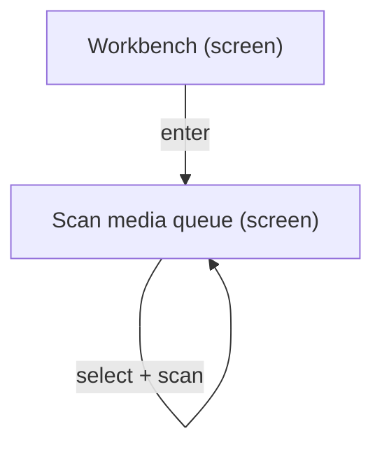
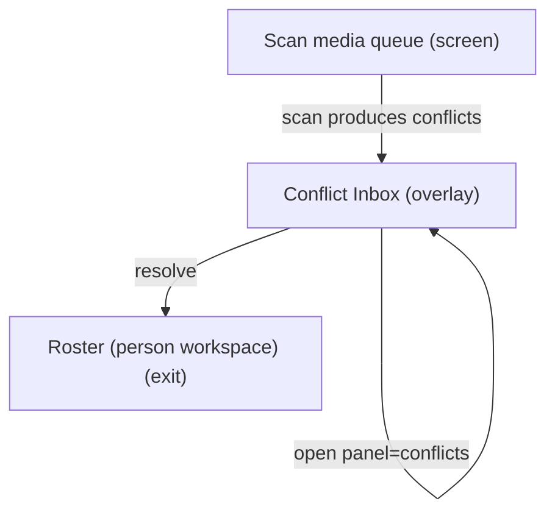
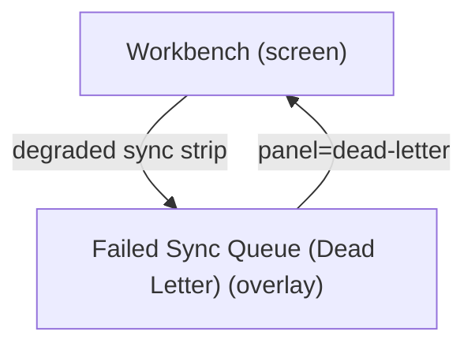
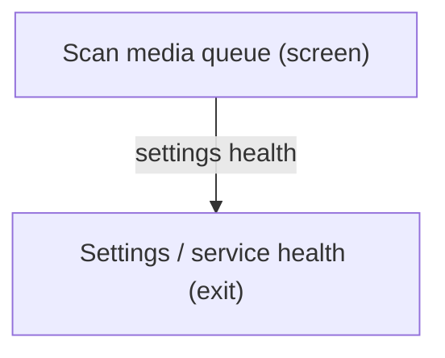

# UX Map — workbench-operator-loop

**Product:** `prototype-wp-alt-context`
**Source fixture:** `apps/prototype-wp-alt-context/js/admin/pages/WorkbenchPage.tsx`

## Goals

- Six ACX submenus are MECE and frequency-ordered (NAV-05/NAV-06): Overview orients; Review Queue is the one home to name a person from a photo (highest-frequency demo task); People manages named people only; Description Runs is the one home to see what the describer did; Data Retention is keep/delete/export policy (not description history); Settings configures the service (rare, last). WordPress parent slug stays Overview.
- One primary action per screen (NAV-01), reachable from zero state (rg-003); other CTAs are secondary.
- Operator clears media queue via Scan and resolves identity conflicts without losing place
- Decompose Workbench UI tasks from screens/zones/states/flows instead of inventing IA mid-plan

## Jobs

- `job-clear-queue` — Clear media queue (scan / describe)
- `job-resolve-conflicts` — Resolve identity conflicts
- `job-recover-sync` — Recover from sync / dead-letter failures
- `job-assign-people` — Assign people (exit to Roster)

## Screens

| id | kind | route | title | url_params |
| --- | --- | --- | --- | --- |
| `workbench-shell` | screen | `#/workbench` | Workbench | `tab`, `panel`, `advanced`, `status`, `media`, `rq`, `queue`, `face`, `cluster` |
| `workbench-scan` | screen | `#/workbench?tab=scan` | Scan media queue | `tab`, `status`, `media`, `s`, `p`, `perPage`, `rq`, `panel`, `cluster` |
| `workbench-review-panel` | screen | `#/workbench?tab=scan&panel=review&cluster=` | Review these faces | `tab`, `panel`, `cluster`, `rq` |
| `workbench-conflicts` | overlay | `#/workbench?panel=conflicts` | Conflict Inbox | `panel` |
| `workbench-dead-letter` | overlay | `#/workbench?panel=dead-letter` | Failed Sync Queue (Dead Letter) | `panel` |
| `exit-roster` | exit | `#/roster` | Roster (person workspace) | `personFilter`, `person` |
| `exit-settings` | exit | `#/settings` | Settings / service health | — |

### Workbench (`workbench-shell`)

Purpose: Operator surface for media queue scan, job pipeline, sync health, and review overlays

url_params: `tab`, `panel`, `advanced`, `status`, `media`, `rq`, `queue`, `face`, `cluster`

| zone id | label | role | states |
| --- | --- | --- | --- |
| `z-tabs` | Workbench steps tabs | nav | default |
| `z-sync` | Sync / projection status strip | status | default, loading, error, degraded |
| `z-overlay-host` | Overlay host (conflicts \| dead-letter) | other | default, empty |
| `z-main-tab` | Active tab content (Scan) | content | default, loading, empty, error |
| `z-advanced` | Advanced drawer | form | default, empty |

```
+------------------------------------------------------------+
| Workbench  [screen]  #/workbench                           |
| Operator surface for media queue scan, job pipeline, sync  |
| health, and review overlays                                |
+------------------------------------------------------------+
| ZONES                                                      |
|   - Workbench steps tabs (nav)                             |
|   - Sync / projection status strip (status)                |
|   - Overlay host (conflicts | dead-letter) (other)         |
|   - Active tab content (Scan) (content)                    |
|   - Advanced drawer (form)                                 |
+------------------------------------------------------------+
| ACTIONS                                                    |
|   [PRIMARY] Open Scan -> workbench-scan                    |
|   [secondary] Open Conflict Inbox -> workbench-conflicts   |
|   [secondary] Open Failed Sync Queue -> workbench-dead-le… |
|   [secondary] Retry projection sync -> projection (costly… |
+------------------------------------------------------------+
| states: default | loading | error | degraded | offline     |
+------------------------------------------------------------+
```

### Scan media queue (`workbench-scan`)

Purpose: Filter and select library media; run scan faces / describe pipeline (default also covers the reviewing state: a face group loaded in the review panel)

url_params: `tab`, `status`, `media`, `s`, `p`, `perPage`, `rq`, `panel`, `cluster`

| zone id | label | role | states |
| --- | --- | --- | --- |
| `z-review-queue` | Review queue header / count with kind+band filter chips, card-at-a-time (rq= URL is the single owner of chip state; empty covers both a filter-empty queue and a fully drained one) | queue | default, loading, empty, error, first_time, edge_input |
| `z-review-panel` | Face-group review panel (panel=review&cluster=) | ai_review | default, loading, empty, error, first_time, edge_input |
| `z-filters` | Status / search filters | form | default, loading, error |
| `z-media-queue` | Media selection table | queue | default, loading, empty, error, first_time, edge_input |
| `z-job-cta` | Scan / analyze CTAs + job progress | job | default, loading, error |
| `z-identity-preview` | Identity / findings preview (AI-assisted; offline = recognition service unreachable; degraded = repair / reduced-capability mode; empty = zero evidence rows) | ai_review | default, empty, loading, error, degraded, offline |
| `z-review-suggestions-header` | Review Suggestions queue header / count (default also covers the filter-narrowed count; degraded = repair / reduced-capability mode) | status | default, loading, empty, error, degraded |
| `z-review-suggestions-group-card` | Top-of-queue group card + Name this person (NameFaceControl; default also covers an AI-suggested label and the open suggestions disclosure; loading = save in flight; degraded = read-only card; edge_input = missing or uncroppable face image) | ai_review | default, loading, degraded, edge_input |

```
+------------------------------------------------------------+
| Scan media queue  [screen]  #/workbench?tab=scan           |
| Filter and select library media; run scan faces / describe |
| pipeline (default also covers the reviewing state: a face  |
| group loaded in the review panel)                          |
+------------------------------------------------------------+
| ZONES                                                      |
|   - Review queue header / count with kind+band filter ch…  |
|     (queue) states=[default,loading,empty,error,first_time…|
|   - Face-group review panel (panel=review&cluster=)        |
|     (ai_review) states=[default,loading,empty,error,first_…|
|   - Status / search filters (form)                         |
|     states=[default,loading,empty,error,first_time,edge_in…|
|   - Media selection table (queue)                          |
|     states=[default,loading,empty,error,first_time,edge_in…|
|   - Scan / analyze CTAs + job progress (job)               |
|     states=[default,loading,error]                         |
|   - Identity / findings preview (AI-assisted; offline = r… |
|     (ai_review)                                            |
|     states=[default,empty,loading,error,degraded,offline]  |
|   - Review Suggestions queue header / count (default also… |
|     (status) states=[default,loading,empty,error,degraded] |
|   - Top-of-queue group card + Name this person (NameFace…  |
|     (ai_review)                                            |
|     states=[default,loading,degraded,edge_input]           |
+------------------------------------------------------------+
| ACTIONS                                                    |
|   [PRIMARY] Scan selected media -> job-pipeline (costly,p… |
|   [secondary] Go to Roster -> exit-roster                  |
+------------------------------------------------------------+
| states: default | loading | empty | error | first_time     |
| states+: edge_input                                        |
+------------------------------------------------------------+
```

### Review these faces (`workbench-review-panel`)

Purpose: Review the faces in one unnamed group; Back returns to Review Suggestions

url_params: `tab`, `panel`, `cluster`, `rq`

code_ref: ClusterReviewPanel.tsx (header + Back, faces grid, show-all, remove-confirm modal; no name input)

| zone id | label | role | states |
| --- | --- | --- | --- |
| `z-review-header` | Header + Back | nav | default |
| `z-review-faces` | Faces grid | ai_review | default, loading, error, empty |

```
+------------------------------------------------------------+
| Review these faces  [screen]                               |
| #/workbench?tab=scan&panel=review&cluster=                 |
| Review the faces in one unnamed group; Back returns to     |
| Review Suggestions                                         |
+------------------------------------------------------------+
| ZONES                                                      |
|   - Header + Back (nav)                                    |
|   - Faces grid (ai_review)                                 |
+------------------------------------------------------------+
| ACTIONS                                                    |
|   [PRIMARY] Back to Review Suggestions -> workbench-scan   |
+------------------------------------------------------------+
| states: default | loading | error | empty                  |
| code_ref: ClusterReviewPanel.tsx                           |
+------------------------------------------------------------+
```

### Conflict Inbox (`workbench-conflicts`)

Purpose: Review identity conflicts; commit human judgment with evidence

url_params: `panel`

| zone id | label | role | states |
| --- | --- | --- | --- |
| `z-conflict-list` | Conflict list | queue | default, loading, empty, error |
| `z-conflict-detail` | Conflict detail / candidates | forced_choice | default, loading, empty, error |
| `z-conflict-actions` | Resolve / defer actions | form | default, loading, empty, error |

```
+------------------------------------------------------------+
| Conflict Inbox  [overlay]  #/workbench?panel=conflicts     |
| Review identity conflicts; commit human judgment with evi… |
+------------------------------------------------------------+
| ZONES                                                      |
|   - Conflict list (queue)                                  |
|   - Conflict detail / candidates (forced_choice)           |
|   - Resolve / defer actions (form)                         |
+------------------------------------------------------------+
| ACTIONS                                                    |
|   [PRIMARY] Resolve conflict -> identity-store (costly,pr… |
+------------------------------------------------------------+
| states: default | loading | empty | error                  |
+------------------------------------------------------------+
```

### Failed Sync Queue (Dead Letter) (`workbench-dead-letter`)

Purpose: Inspect failed sync ops; retry or discard

url_params: `panel`

| zone id | label | role | states |
| --- | --- | --- | --- |
| `z-dl-list` | Dead-letter items | queue | default, loading, empty, error |
| `z-dl-actions` | Retry / discard | form | default, loading, empty, error |

```
+------------------------------------------------------------+
| Failed Sync Queue (Dead Letter)  [overlay]  #/workbench?p… |
| Inspect failed sync ops; retry or discard                  |
+------------------------------------------------------------+
| ZONES                                                      |
|   - Dead-letter items (queue)                              |
|   - Retry / discard (form)                                 |
+------------------------------------------------------------+
| ACTIONS                                                    |
|   [PRIMARY] Retry failed op -> sync (costly,preview)       |
|   [DESTRUCTIVE] Discard failed op -> sync (costly,preview… |
+------------------------------------------------------------+
| states: default | loading | empty | error                  |
+------------------------------------------------------------+
```

### Roster (person workspace) (`exit-roster`)

Purpose: Manage named people after dashboard identity guidance. Unnamed faces are named in Review Queue, not here (NAV-05).

url_params: `personFilter`, `person`

| zone id | label | role | states |
| --- | --- | --- | --- |
| `z-roster-main` | Entries / clusters workspace | content | default, empty |

```
+------------------------------------------------------------+
| Roster (person workspace)  [exit]  #/roster                |
| Manage named people after dashboard identity guidance.     |
| Unnamed faces are named in Review Queue, not here (NAV-05).|
+------------------------------------------------------------+
| ZONES                                                      |
|   - Entries / clusters workspace (content)                 |
+------------------------------------------------------------+
| states: default | loading | empty | error                  |
+------------------------------------------------------------+
```

### Settings / service health (`exit-settings`)

Purpose: Configure recognition target and connection health

| zone id | label | role | states |
| --- | --- | --- | --- |
| `z-settings-form` | Settings form + test connection | form | default, loading, error |

```
+------------------------------------------------------------+
| Settings / service health  [exit]  #/settings              |
| Configure recognition target and connection health         |
+------------------------------------------------------------+
| ZONES                                                      |
|   - Settings form + test connection (form)                 |
+------------------------------------------------------------+
| states: default | error                                    |
+------------------------------------------------------------+
```

## Operator interaction contract

Deep-link param SSOT: `js/admin/navigation/appLinks.ts` (`APP_LINK_PARAMS`).

The Review Suggestions header announces `position: 1 of N on this page`. The top group card reports `N of M faces shown` and presents `Is this <name>? Yes/No` when a suggested label is available. While a save is in flight, `busy disables actions`; in the empty-representative edge case, `zero reps still render (Avatar, not empty)`.

Component pointers:

- `apps/prototype-wp-alt-context/js/admin/pages/workbench/identity-clusters/WorkbenchFindingsPanel.tsx`
- `apps/prototype-wp-alt-context/js/admin/pages/workbench/identity-clusters/TopClusterCard.tsx`

Suggested task slice: **Deep-link parity** — panel/tab/status round-trip via `appLinks` ([NAV-11]).

## Actions

| id | verb | target | hierarchy | costly | irreversible | preview required | screen id |
| --- | --- | --- | --- | --- | --- | --- | --- |
| `act-open-scan` | Open Scan | `workbench-scan` | primary | no | no | no | `workbench-shell` |
| `act-scan-selected` | Scan selected media | `job-pipeline` | primary | yes | no | yes | `workbench-scan` |
| `act-open-conflicts` | Open Conflict Inbox | `workbench-conflicts` | secondary | no | no | no | `workbench-shell` |
| `act-open-dead-letter` | Open Failed Sync Queue | `workbench-dead-letter` | secondary | no | no | no | `workbench-shell` |
| `act-resolve-conflict` | Resolve conflict | `identity-store` | primary | yes | no | yes | `workbench-conflicts` |
| `act-retry-dead-letter` | Retry failed op | `sync` | primary | yes | no | yes | `workbench-dead-letter` |
| `act-discard-dead-letter` | Discard failed op | `sync` | destructive | yes | yes | yes | `workbench-dead-letter` |
| `act-review-back` | Back to Review Suggestions | `workbench-scan` | primary | no | no | no | `workbench-review-panel` |
| `act-goto-roster` | Go to Roster | `exit-roster` | secondary | no | no | no | `workbench-scan` |
| `act-retry-projection` | Retry projection sync | `projection` | secondary | yes | no | yes | `workbench-shell` |

## Flows

### Select media → scan → continue (`flow-scan-happy`)



### Scan → conflict overlay → resolve → roster if needed (`flow-scan-to-conflict`)



### Sync failure → dead letter → retry/discard (`flow-dead-letter-recover`)



### Scan → settings health (`flow-scan-to-settings`)



## Open questions

- Should Scan CTAs require selection count preview on the same surface before start? ([INT-07])
- Conflict shortlist max_candidates=5 — confirm product policy vs model top-k
- Does empty media queue show first_time guidance or empty-only copy?

## Domain state mapping

| domain state(s) | canonical state |
| --- | --- |
| `unavailable` | `offline` |
| `repair`, `read_only` | `degraded` |
| `zero_evidence` | `empty` |
| `busy` | `loading` |
| `filtered`, `suggested_label` | `default` |
| `missing_image` | `edge_input` |

## Parity index

Machine-checked by `js/admin/__tests__/uxmap-parity.test.ts` and
`js/admin/__tests__/uxmap-render-parity.test.ts`: every id, state, and verbatim label
below must exist in the sibling `.uxmap.json`, and no `z-*`/`act-*` id may appear here
that the JSON does not define. Regenerate with `docs/ux-maps/render_ux_maps.py` — never
hand-edit one side.

Zone ids: z-tabs z-sync z-overlay-host z-main-tab z-advanced z-review-queue z-review-panel z-filters z-media-queue z-job-cta z-identity-preview z-review-suggestions-header z-review-suggestions-group-card z-conflict-list z-conflict-detail z-conflict-actions z-dl-list z-dl-actions z-review-header z-review-faces z-roster-main z-settings-form

Action ids: act-open-scan act-scan-selected act-open-conflicts act-open-dead-letter act-resolve-conflict act-retry-dead-letter act-discard-dead-letter act-review-back act-goto-roster act-retry-projection

Zone labels (verbatim; the tables above escape `|` for markdown, this list does not):

- Workbench steps tabs
- Sync / projection status strip
- Overlay host (conflicts | dead-letter)
- Active tab content (Scan)
- Advanced drawer
- Review queue header / count with kind+band filter chips, card-at-a-time (rq= URL is the single owner of chip state; empty covers both a filter-empty queue and a fully drained one)
- Face-group review panel (panel=review&cluster=)
- Status / search filters
- Media selection table
- Scan / analyze CTAs + job progress
- Identity / findings preview (AI-assisted; offline = recognition service unreachable; degraded = repair / reduced-capability mode; empty = zero evidence rows)
- Review Suggestions queue header / count (default also covers the filter-narrowed count; degraded = repair / reduced-capability mode)
- Top-of-queue group card + Name this person (NameFaceControl; default also covers an AI-suggested label and the open suggestions disclosure; loading = save in flight; degraded = read-only card; edge_input = missing or uncroppable face image)
- Conflict list
- Conflict detail / candidates
- Resolve / defer actions
- Dead-letter items
- Retry / discard
- Header + Back
- Faces grid
- Entries / clusters workspace
- Settings form + test connection

States (all zones and screens): default loading error degraded offline empty first_time edge_input

## Not doing

- Resurrect confirm tab (E21-10)
- Pixel/token design in this map
- Attachment-edit SPA (separate map_ref later)
- REST sequence diagrams (see docs/workbench-data-flow.mmd)
