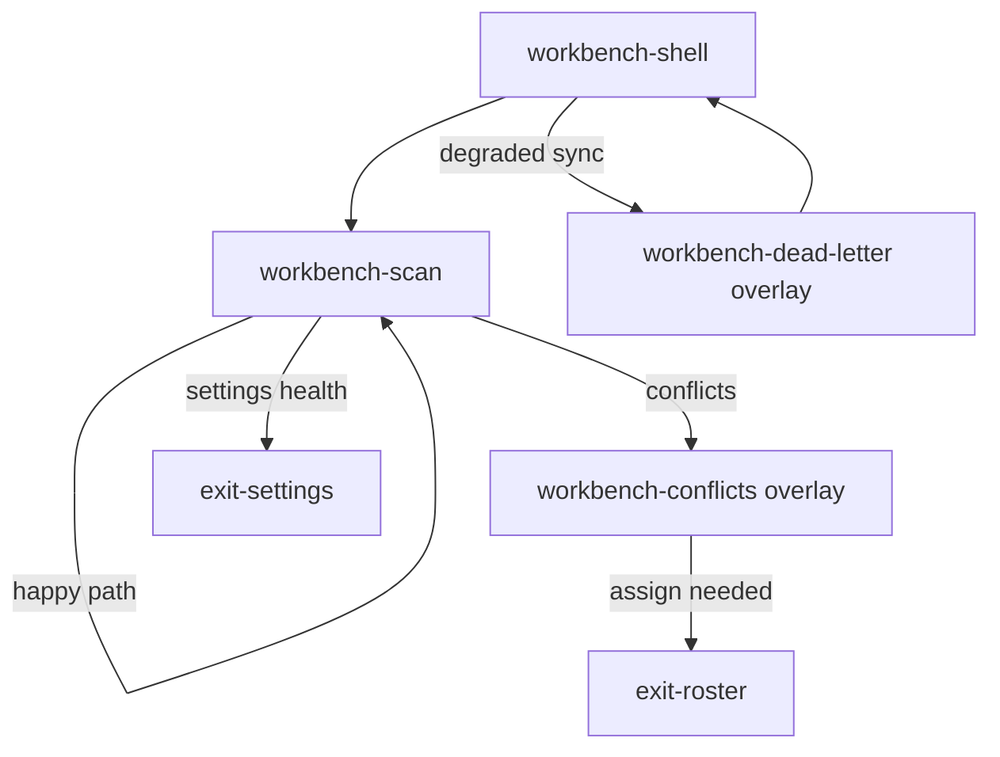

# UX Map — Workbench operator loop

> Starter inventory for `map_ref: workbench-operator-loop`  
> Source: `workbench-operator-loop.uxmap.json`  
> Plan: WorkBay `docs/tasks/WB-UX-MAP-01-ux-ui-workflow-map-task-plan.md`  
> `code_ref` paths are relative to the **context-alt-text monorepo root**.

## Jobs

| Job                        | Primary screens                  |
| -------------------------- | -------------------------------- |
| Clear media queue          | Workbench Scan                   |
| Resolve identity conflicts | Conflict Inbox overlay           |
| Recover sync / dead-letter | Dead Letter overlay + sync strip |
| Assign people              | Exit → Roster                    |

## Screens

| id                    | kind    | route                           | code_ref                          |
| --------------------- | ------- | ------------------------------- | --------------------------------- |
| workbench-shell       | screen  | `#/workbench`                   | `…/pages/WorkbenchPage.tsx`       |
| workbench-scan        | screen  | `#/workbench?tab=scan`          | `…/workbench/ScanTabContent.tsx`  |
| workbench-conflicts   | overlay | `#/workbench?panel=conflicts`   | `…/workbench/ConflictInbox.tsx`   |
| workbench-dead-letter | overlay | `#/workbench?panel=dead-letter` | `…/workbench/DeadLetterPanel.tsx` |
| exit-roster           | exit    | `#/roster`                      | `…/pages/RosterPage.tsx`          |
| exit-settings         | exit    | `#/settings`                    | `…/pages/SettingsPage.tsx`        |

Deep-link param SSOT: `js/admin/navigation/appLinks.ts` (`APP_LINK_PARAMS`).

## ASCII — Scan (structural)

```
+--------------------------------------------------------------+
| WORKBENCH  tabs: [ Scan ]                    advanced: [ ]   |
+--------------------------------------------------------------+
| SYNC STRIP  projection state | error? | [Retry projection]   |
+--------------------------------------------------------------+
| Filters: status [ v ]  search [........]                     |
|--------------------------------------------------------------|
| MEDIA QUEUE                                      empty|list  |
| [ ] thumb | title | status | ...                             |
| [ ] ...                                                      |
|--------------------------------------------------------------|
| PRIMARY: [ Scan selected ]   secondary: [ Open conflicts ]   |
| job progress: idle | running | error                         |
|--------------------------------------------------------------|
| AI findings preview (evidence-linked)                        |
| states: default | empty | loading | error | degraded         |
|         | unavailable | repair | zero_evidence               |
| code_ref: WorkbenchFindingsPanel.tsx                         |
|--------------------------------------------------------------|
| REVIEW SUGGESTIONS HEADER  N left to review on this page     |
| position: 1 of N on this page | kind chips | band chips      |
| states: default | loading | empty | error | filtered         |
|--------------------------------------------------------------|
| TOP GROUP CARD  N faces | N of M faces shown                 |
| Name this person | Review | (thumbs, missing hidden at 39px) |
| states: default | loading | empty | error | filtered         |
+--------------------------------------------------------------+
states: default | loading | empty | error | first_time | edge_input
```

## Mermaid — primary flows



## Suggested task-slice decomposition (from map)

1. **Scan queue empty/first-time** — design empty + first_time states on `z-media-queue` / CTAs
2. **Scan costly action preview** — `act-scan-selected` requires preview_required surface
3. **Conflict forced-choice bound** — `z-conflict-detail` max_candidates=5 + evidence
4. **Dead-letter discard confirm** — destructive + irreversible path
5. **Deep-link parity** — panel/tab/status round-trip via `appLinks` ([NAV-11])

## Not doing (map-level)

- Confirm tab
- Pixel design / tokens
- Attachment-edit SPA
- REST sequence diagrams (use existing `workbench-data-flow.mmd`)
