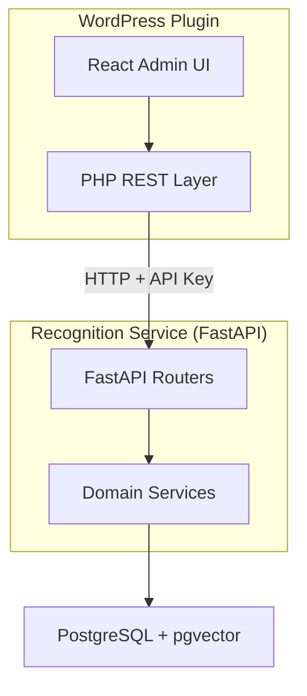

# Agent Bootstrap Guide

> **Single entry point for coding agents working in this monorepo.**

This document provides immediate context routing for agents starting a task. Read this first to understand where to find relevant context and avoid wasting tokens searching.

---

## 🗺️ System Overview



**Full diagram:** [diagrams/system-overview.mmd](diagrams/system-overview.mmd)

---

## 🎯 Role Selection

Choose your domain to get targeted context:

| Role                          | Context Map                                | Key Entry Points                      |
| ----------------------------- | ------------------------------------------ | ------------------------------------- |
| **Backend (Python)**          | [maps/backend.md](maps/backend.md)         | `apps/prototype-description-service/` |
| **Frontend (React/TS)**       | [maps/frontend.md](maps/frontend.md)       | `apps/prototype-wp-alt-context/js/`   |
| **PHP Plugin**                | [maps/php-plugin.md](maps/php-plugin.md)   | `apps/prototype-wp-alt-context/src/`  |
| **Cross-Service Integration** | [maps/integration.md](maps/integration.md) | `docs/agentic/contracts/`             |

---

## 📜 Mandatory Rules

Before making ANY changes, internalize these:

1. **[instructions.md](instructions.md)** — Engineering principles, TDD workflow, code standards
2. **[contracts/](contracts/)** — API contracts between WordPress and Recognition Service
3. **Plugin Boundary Rule** — ONLY modify files within this monorepo (never WordPress core)

---

## 🔑 Quick Context by Task Type

### API Changes (WordPress ↔ Python)

```
Context: docs/agentic/contracts/clustering-api.md
Test ref: apps/prototype-description-service/recognition/tests/api/
Diagram: docs/agentic/diagrams/backend-uml/agent-quick-start.mmd
```

### Backend Service Implementation

```
Context: docs/agentic/maps/backend.md
Tests: apps/prototype-description-service/recognition/tests/
Entry: apps/prototype-description-service/api/
```

### Frontend React Components

```
Context: docs/agentic/maps/frontend.md
Tests: apps/prototype-wp-alt-context/js/admin/hooks/__tests__/
Entry: apps/prototype-wp-alt-context/js/admin/
```

### Database/Schema Changes

```
Baseline: apps/prototype-description-service/db/migrations/versions/001_identity_schema.py
Models: apps/prototype-description-service/db/models.py
Rule: Greenfield policy — modify baseline directly, no incremental migrations
```

---

## 📁 Directory Structure

```
docs/agentic/                    # ← YOU ARE HERE
├── BOOTSTRAP.md                 # This file (agent entry point)
├── instructions.md              # Engineering rules & standards
├── contracts/                   # API contracts (human-readable)
│   ├── README.md
│   ├── clustering-api.md        # WP REST → FastAPI proxy
│   ├── recognition-clustering.md# FastAPI endpoints
│   └── security.md              # Auth & tenant isolation
├── diagrams/                    # Architecture diagrams
│   ├── backend-uml/             # Recognition service diagrams
│   ├── frontend-uml/            # WordPress plugin diagrams
│   └── system-overview.mmd      # High-level system map
├── maps/                        # Context maps (5-10 key files per domain)
│   ├── backend.md
│   ├── frontend.md
│   ├── php-plugin.md
│   └── integration.md
└── rules/                       # Additional guidelines
    └── RADIX_UI_COMPONENT_GUIDE.md

docs/tasks/                      # Active task breakdowns
├── 4.0/4.10.3/                  # Current version tasks
│   ├── task.md                  # Implementation checklist
│   ├── cleanup.md               # Code quality issues
│   └── batch-processing-resilience-plan.md
└── README.md

packages/shared-contracts/       # Machine-readable schemas (JSON Schema)
├── schemas/                     # Code generators consume these
└── recognition/                 # Sample payloads
```

---

## 🧪 Testing Commands

```bash
# Backend (Python)
cd apps/prototype-description-service
pytest recognition/tests/api/        # API tests
pytest recognition/tests/integration/ # Integration tests (DB)
pytest recognition/tests/unit/       # Unit tests
ruff check . && mypy .               # Lint + types

# Frontend (TypeScript/React)
cd apps/prototype-wp-alt-context
npm run test                         # Vitest
npm run lint                         # ESLint
npm run typecheck                    # TypeScript

# PHP
cd apps/prototype-wp-alt-context
composer test                        # PHPUnit
composer phpstan                     # Static analysis
```

---

## 🤖 MCP Server (Agent Tooling)

The unified MCP server provides code intelligence tools for agents across all parts of the monorepo.

### Quick Start

```bash
# From monorepo root
make mcp-start        # Start in background
make mcp-stop         # Stop the server
make mcp-status       # Check if running
make mcp-run          # Run in foreground (debug)

# Or use the script directly
./scripts/mcp/mcp-server.sh start
```

### VS Code Configuration (GitHub Copilot)

For GitHub Copilot in VS Code 1.99+, create `.vscode/mcp.json` in the repo root:

```json
{
  "servers": {
    "context-alt-text": {
      "command": "/Users/daniel/.pyenv/versions/description-service/bin/python",
      "args": ["${workspaceFolder}/scripts/mcp/unified_server.py"],
      "env": {
        "PATH": "/opt/homebrew/bin:/usr/local/bin:${env:PATH}"
      }
    }
  }
}
```

> **Note**: Replace the Python path with your own pyenv virtualenv path. The `PATH` env ensures ripgrep and other CLI tools are available.

**Validation**: Command Palette → `MCP: List Servers` should show "context-alt-text" with 18 tools discovered.

#### For Other MCP Clients (Gemini for VS Code, etc.)

Use VS Code user settings with `mcp.servers` key:

```json
{
  "mcp.servers": {
    "context-alt-text": {
      "command": "~/.pyenv/versions/description-service/bin/python",
      "args": ["scripts/mcp/unified_server.py"],
      "cwd": "/path/to/context-alt-text-monorepo"
    }
  }
}
```

#### MCP Availability Checklist

MCP tools are available when **all** of these are true:

- VS Code 1.99+ with MCP-capable client (Copilot or Gemini)
- `.vscode/mcp.json` configured (for Copilot) or `mcp.servers` setting (for Gemini)
- Python virtualenv exists at the configured path
- Ripgrep installed (`brew install ripgrep` on macOS)

### Available Tools (18 total)

| Category        | Tool                   | When to Use                                       |
| --------------- | ---------------------- | ------------------------------------------------- |
| **Search**      | `search_code`          | Find code patterns across entire monorepo         |
|                 | `find_definition`      | Locate where a symbol is defined                  |
|                 | `semantic_search`      | Natural language code search (keyword fallback)   |
| **Navigation**  | `read_file`            | Read file contents with line numbers              |
|                 | `list_directory`       | Browse directory structure                        |
| **Context**     | `get_context_map`      | Load domain context (backend/frontend/php)        |
|                 | `get_api_contract`     | Load API contract documentation                   |
|                 | `get_instructions`     | Load engineering instructions                     |
| **Cross-Layer** | `trace_api_endpoint`   | Trace endpoint across PHP→Python→TS layers        |
| **Diagnostics** | `get_diagnostics`      | Run linters (ruff/eslint/phpstan) on a file       |
|                 | `get_type_info`        | Get type info via Pyright/tsc                     |
| **React/TS**    | `find_react_component` | Find React component definitions                  |
|                 | `find_react_hook`      | Find custom React hooks                           |
|                 | `list_frontend_tests`  | List test files, optionally filtered by component |
| **PHP/WP**      | `find_wp_action`       | Find WordPress action/filter hooks                |
|                 | `find_wp_rest_route`   | Find REST API route registrations                 |
|                 | `find_php_class`       | Find PHP class definitions                        |
| **Debug**       | `debug_subprocess`     | Test subprocess execution (for troubleshooting)   |

**Full documentation:** [instructions.md#mcplsp-tooling-for-agents](instructions.md#mcplsp-tooling-for-agents)

---

## 📊 Context Value Hierarchy

| Asset                 | Cold Start Value | When to Use                                   |
| --------------------- | ---------------- | --------------------------------------------- |
| **Contracts**         | 🔥 Highest       | Cross-boundary work, API changes              |
| **Python API Tests**  | 🔥 High          | Service implementation, behavior verification |
| **Integration Tests** | 🔥 High          | Database patterns, RLS, repository queries    |
| **Frontend Hooks**    | 🌤️ Medium        | Job state, SSE, multi-tab coordination        |
| **UML Diagrams**      | 🌤️ Medium        | Architecture understanding, flow questions    |
| **PHP Tests**         | 🌙 Low           | Currently scaffolding only                    |

---

## ⚠️ Critical Reminders

1. **Scaffolding First** — Write function signatures with docstrings before implementation
2. **TDD Mandatory** — Red → Green → Refactor for every change
3. **No Fabricated Data** — Never invent metrics or benchmark numbers
4. **Greenfield Policy** — No backward compatibility needed, clean rewrites preferred
5. **Conventional Commits** — `feat:`, `fix:`, `docs:`, `test:`, `refactor:`, `chore:`
6. **Check Active Tasks** — See `docs/tasks/` for current implementation plans
7. **Use Makefile Commands** — Never use naked `pip install`; use `make setup` for Python deps
