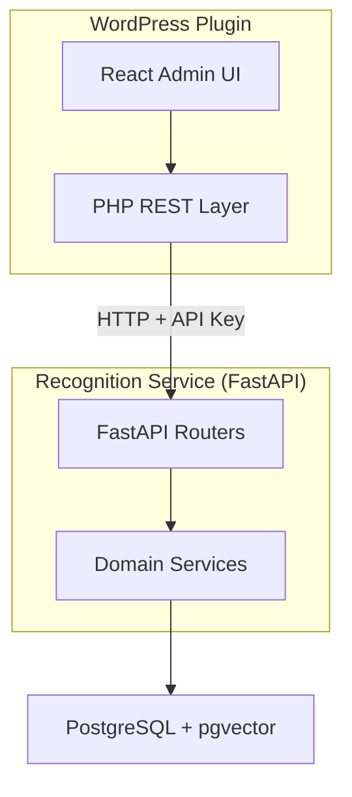

# Agent Bootstrap Guide

> **Single entry point for coding agents working in this monorepo.**

This document provides immediate context routing for agents starting a task. Read this first to understand where to find relevant context and avoid wasting tokens searching.

---

## 🗺️ System Overview



**Full diagram:** [diagrams/system-overview.mmd](diagrams/system-overview.mmd)

---

## 🎯 Role Selection

Choose your domain to get targeted context:

| Role                          | Context Map                                | Key Entry Points                      |
| ----------------------------- | ------------------------------------------ | ------------------------------------- |
| **Backend (Python)**          | [maps/backend.md](maps/backend.md)         | `apps/prototype-description-service/` |
| **Frontend (React/TS)**       | [maps/frontend.md](maps/frontend.md)       | `apps/prototype-wp-alt-context/js/`   |
| **PHP Plugin**                | [maps/php-plugin.md](maps/php-plugin.md)   | `apps/prototype-wp-alt-context/src/`  |
| **Cross-Service Integration** | [maps/integration.md](maps/integration.md) | `docs/agentic/contracts/`             |

---

## 📜 Mandatory Rules

Before making ANY changes, internalize these:

1. **[instructions.md](instructions.md)** — Engineering principles, TDD workflow, code standards
2. **[contracts/](contracts/)** — API contracts between WordPress and Recognition Service
3. **Plugin Boundary Rule** — ONLY modify files within this monorepo (never WordPress core)

---

## 🔑 Quick Context by Task Type

### API Changes (WordPress ↔ Python)

```
Context: docs/agentic/contracts/clustering-api.md
Test ref: apps/prototype-description-service/recognition/tests/api/
Diagram: docs/agentic/diagrams/backend-uml/agent-quick-start.mmd
```

### Backend Service Implementation

```
Context: docs/agentic/maps/backend.md
Tests: apps/prototype-description-service/recognition/tests/
Entry: apps/prototype-description-service/api/
```

### Frontend React Components

```
Context: docs/agentic/maps/frontend.md
Tests: apps/prototype-wp-alt-context/js/
Entry: apps/prototype-wp-alt-context/js/src/
```

### Database/Schema Changes

```
Baseline: apps/prototype-description-service/db/migrations/versions/001_identity_schema.py
Models: apps/prototype-description-service/db/models.py
Rule: Greenfield policy — modify baseline directly, no incremental migrations
```

---

## 📁 Directory Structure

```
docs/agentic/                    # ← YOU ARE HERE
├── BOOTSTRAP.md                 # This file (agent entry point)
├── instructions.md              # Engineering rules & standards
├── contracts/                   # API contracts (human-readable)
│   ├── README.md
│   ├── clustering-api.md        # WP REST → FastAPI proxy
│   ├── recognition-clustering.md# FastAPI endpoints
│   └── security.md              # Auth & tenant isolation
├── diagrams/                    # Architecture diagrams
│   ├── backend-uml/             # Recognition service diagrams
│   ├── frontend-uml/            # WordPress plugin diagrams
│   └── system-overview.mmd      # High-level system map
├── maps/                        # Context maps (5-10 key files per domain)
│   ├── backend.md
│   ├── frontend.md
│   ├── php-plugin.md
│   └── integration.md
└── blackboard/                  # Agent working memory
    ├── current_task_state.md
    └── implementation_plan.md

packages/shared-contracts/       # Machine-readable schemas (JSON Schema)
├── schemas/                     # Code generators consume these
└── recognition/                 # Sample payloads
```

---

## 🧪 Testing Commands

```bash
# Backend (Python)
cd apps/prototype-description-service
pytest recognition/tests/api/        # API tests
pytest recognition/tests/unit/       # Unit tests
ruff check . && mypy .               # Lint + types

# Frontend (TypeScript/React)
cd apps/prototype-wp-alt-context
npm run test                         # Vitest
npm run lint                         # ESLint
npm run typecheck                    # TypeScript

# PHP
cd apps/prototype-wp-alt-context
composer test                        # PHPUnit
composer phpstan                     # Static analysis
```

---

## 📊 Context Value Hierarchy

| Asset            | Cold Start Value | When to Use                                   |
| ---------------- | ---------------- | --------------------------------------------- |
| **Contracts**    | 🔥 Highest       | Cross-boundary work, API changes              |
| **Python Tests** | 🔥 High          | Service implementation, behavior verification |
| **UML Diagrams** | 🌤️ Medium        | Architecture understanding, flow questions    |
| **PHP Tests**    | 🌙 Low           | Currently scaffolding only                    |

---

## ⚠️ Critical Reminders

1. **Scaffolding First** — Write function signatures with docstrings before implementation
2. **TDD Mandatory** — Red → Green → Refactor for every change
3. **No Fabricated Data** — Never invent metrics or benchmark numbers
4. **Greenfield Policy** — No backward compatibility needed, clean rewrites preferred
5. **Conventional Commits** — `feat:`, `fix:`, `docs:`, `test:`, `refactor:`, `chore:`
