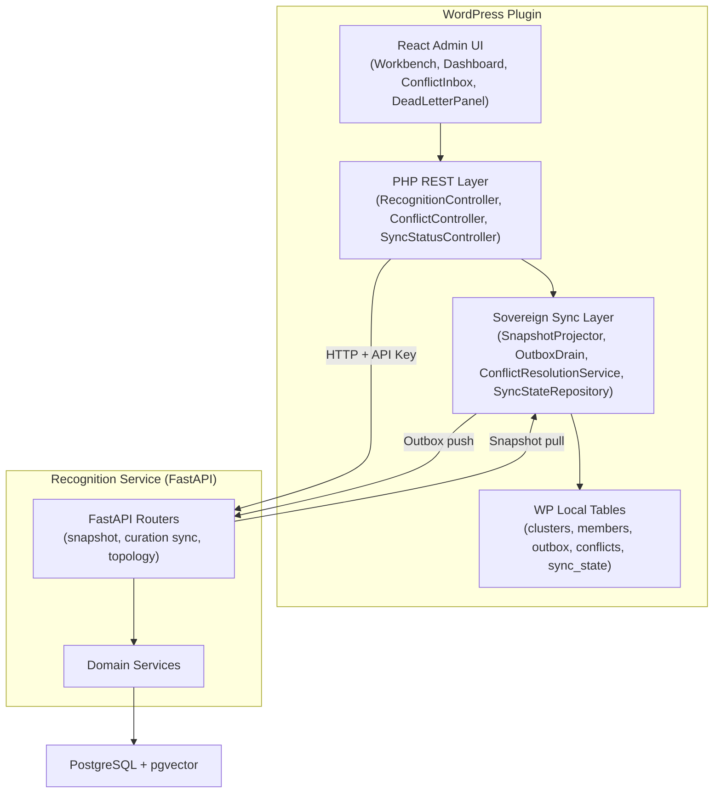

# Development Instructions

> **Cold-start document for coding agents.** Universal rules that cannot be deduced from code, configs, or linters. Domain-specific guidelines load via the routing table below.

> **On first load / cold start**: also read [BOOTSTRAP.md](BOOTSTRAP.md) for testing commands, MCP server setup, and handoff state defaults.

**Epic**: `docs/epics/v0.2.0/remaining-sync-workbench-and-retention-epic.md` · **Roadmap**: `docs/roadmaps/roadmap-v4.md`

---

## Document Maintenance (ACE Playbook Evolution)

This document follows Autonomous Coding Engine principles for minimal, self-correcting agent instructions. Each rule is a strategy bullet tracked with evidence counters (`helpful` / `harmful`) to drive retention and pruning.

**Inclusion criteria** -- a rule belongs here only if:

1. It cannot be deduced from code, configs, linters, or static analysis
2. Violating it has caused a real failure in this project (not hypothetical)
3. It applies universally across all domains (domain-specific rules go in sub-documents)

### Reflection triggers

A reflection cycle runs when:

1. A branch review finding references a rule (daemon detects and logs automatically; run `make ace-reflect TASK=<task-ref>` from the orchestrator root to apply pending counter updates)
2. A branch review finding contradicts a rule (daemon detects and logs automatically; run `make ace-reflect TASK=<task-ref>` from the orchestrator root to apply pending counter updates)
3. A new failure mode is discovered that no existing rule covers (add new bullet)
4. A library version upgrade invalidates a rule (remove; ctx7 serves current docs)

### Curation rules

- Rules with `helpful=0 harmful>=2` are pruning candidates; delete on next review.
- Rules that restate a linter/config check get deleted immediately (tool is source of truth).
- New rules require a real failure reference (issue, commit, or branch review finding ID).
- Delta updates only; never rewrite a section from scratch (prevents context collapse).
- Never duplicate content between this file and linked sub-documents; use links.

### Periodic Pruning Workflow

Run a pruning pass:

1. after each epic phase completion
2. after any task with 5+ review findings that reference rules or skills
3. after 30 calendar days without a pruning pass

Workflow:

1. Run `get_metrics_summary` for the active process-hardening task to inspect process-health and handoff-memory signals.
2. Run `make ace-reflect TASK=<task-ref>` from the orchestrator root so pending `helpful` / `harmful` counters are applied before evaluating candidates.
3. Review rule pruning candidates: any rule with `helpful=0 harmful>=2` is an automatic candidate for deletion or demotion.
4. For each candidate, inspect recent handoff decisions and findings for the rule ID before changing the guidance. Delete confirmed dead rules; demote marginal rules to a watch note when evidence is mixed.
5. Review skills for overlap and coverage. Skills referenced in 0 decisions or findings over the evaluation window are candidates for retirement, consolidation, or scope reduction.
6. Record the pruning outcome in MCP with a structured decision summarizing what was deleted, what was kept, and what remains under watch.

Evidence thresholds:

- `helpful=0 harmful>=2`: automatic pruning candidate
- `helpful>=3 harmful=0`: confirmed keeper
- everything else: review on case merit against recent findings and decisions

Skill evaluation criteria:

- trigger frequency: does the skill appear in decisions/findings often enough to justify the maintenance cost?
- coverage: is the skill covering a unique workflow, or overlapping another skill?
- freshness: does the skill reference current tooling, commands, and runtime surfaces?
- convergence: do sessions using the skill reach completion more cleanly or quickly?

Use the curation rules above as the per-rule decision policy, and use this workflow as the cadence and evidence loop.

---

## System Overview



**Full diagram:** [diagrams/system-overview.mmd](diagrams/system-overview.mmd)

---

## Role Selection

Choose your domain to load targeted context. **Always load the testing guide** alongside your role guidelines — we practice TDD.

| Role                          | Context Map                                | Guidelines                                                               | Testing Guide                                              | Tech Stack (ctx7)                                                          | Key Entry Points                      |
| ----------------------------- | ------------------------------------------ | ------------------------------------------------------------------------ | ---------------------------------------------------------- | -------------------------------------------------------------------------- | ------------------------------------- |
| **Backend (Python)**          | [maps/backend.md](maps/backend.md)         | [rules/backend-python-guidelines.md](rules/backend-python-guidelines.md) | [rules/testing-python.md](rules/testing-python.md)         | [maps/tech-stack.md#backend-python](maps/tech-stack.md#backend-python)     | `apps/prototype-description-service/` |
| **Frontend (React/TS)**       | [maps/frontend.md](maps/frontend.md)       | [rules/frontend-guidelines.md](rules/frontend-guidelines.md)             | [rules/testing-typescript.md](rules/testing-typescript.md) | [maps/tech-stack.md#frontend-reactts](maps/tech-stack.md#frontend-reactts) | `apps/prototype-wp-alt-context/js/`   |
| **PHP Plugin**                | [maps/php-plugin.md](maps/php-plugin.md)   | [rules/backend-php-guidelines.md](rules/backend-php-guidelines.md)       | [rules/testing-php.md](rules/testing-php.md)               | [maps/tech-stack.md#php-plugin](maps/tech-stack.md#php-plugin)             | `apps/prototype-wp-alt-context/src/`  |
| **Cross-Service Integration** | [maps/integration.md](maps/integration.md) | [contracts/](contracts/)                                                 | [rules/testing-principles.md](rules/testing-principles.md) | [maps/tech-stack.md#orchestration](maps/tech-stack.md#orchestration)       | `docs/agentic/contracts/`             |

### Additional Routing

| Working on...                        | Load                                                                                                        |
| ------------------------------------ | ----------------------------------------------------------------------------------------------------------- |
| Writing tests (any language)         | [rules/testing-principles.md](rules/testing-principles.md) + language-specific guide                        |
| React/TypeScript tests (Vitest)      | [rules/testing-typescript.md](rules/testing-typescript.md)                                                  |
| Python tests (pytest)                | [rules/testing-python.md](rules/testing-python.md)                                                          |
| PHP tests (PHPUnit)                  | [rules/testing-php.md](rules/testing-php.md)                                                                |
| Workflow, commits, scaffolding       | [rules/development-workflow.md](rules/development-workflow.md)                                              |
| Branch review                        | [rules/branch-review-guide.md](rules/branch-review-guide.md)                                                |
| Planning document review             | [rules/planning-review-guide.md](rules/planning-review-guide.md)                                            |
| Component architecture patterns      | [rules/component-architecture-patterns.md](rules/component-architecture-patterns.md)                        |
| Radix UI / accessibility primitives  | [rules/RADIX_UI_COMPONENT_GUIDE.md](rules/RADIX_UI_COMPONENT_GUIDE.md)                                      |
| Roster auto-resolve vs pending       | [rules/roster_auto_resolve_behavior.md](rules/roster_auto_resolve_behavior.md)                              |
| Embedding search evolution           | [rules/search_optimizations.md](rules/search_optimizations.md)                                              |
| Detection vs identification boundary | [rules/why-identify-endpoint-exists.md](rules/why-identify-endpoint-exists.md)                              |
| Face/Identity nomenclature (ADR)     | [ADR-001-face-identity-nomenclature.md](ADR-001-face-identity-nomenclature.md)                              |
| MCP tooling / testing commands       | [BOOTSTRAP.md](BOOTSTRAP.md)                                                                                |
| Codex custom MCP attachment          | [codex-custom-mcp-playbook.md](codex-custom-mcp-playbook.md)                                                |
| Lane decomposition / orchestration   | [worktree-codex-playbook.md](worktree-codex-playbook.md) + [lane-scoped-context.md](lane-scoped-context.md) |

## Agent Startup Protocol

Use this checklist at session start, whether you are entering from a cold start, resuming a task mid-slice, or inheriting a lane from another agent.

1. Query MCP handoff state first. Load the current task objective, open blockers, latest verification, and latest decisions with `get_handoff_state(task_ref="<task>")`.
2. If you are working in a lane, load the lane inbox before editing. Use `make lane-inbox`, lane activity MCP reads, or the equivalent lane-status helper to pick up routed findings, blockers, and dispatch messages.
3. Load role routing next. Choose the domain from the Role Selection table and read the linked context map, guidelines, and testing guide before touching code.
4. Check open findings before proposing or repeating a fix. Use `list_review_findings(status="open")` so you do not re-raise known issues or miss already-assigned follow-up work.
5. Verify the contract surface before implementation. If the task touches a service, language, schema, or MCP boundary, confirm the owning contract exists in [contracts/](contracts/) and load it before writing code. If no contract exists for the boundary, follow the Cross-Boundary Change Protocol in [rules/development-workflow.md](rules/development-workflow.md) to scaffold one before proceeding.
6. Decide whether `ctx7` is needed. If the slice depends on upstream library or framework behavior, apply the `ctx7` entry criteria below before relying on memory or stale local notes.

Cold start vs. mid-task re-entry:

- Cold start: if no handoff state exists yet, initialize it, then continue through the checklist in order.
- Mid-task re-entry: after loading hot state, use targeted `search_handoff` queries to recover prior slice summaries, earlier decisions, or older findings relevant to the current change. Do not replay the full task history into prompt context.

If MCP handoff is unavailable:

- Read `CURRENT_TASK.md` only as a stale human-readable fallback.
- Treat the missing MCP path as a blocker and record or report that unavailability as soon as MCP access returns.

---

## Critical Rules

These rules are **universal** and apply to every task regardless of domain.

### Plugin Boundary Rule

> **You may ONLY modify files within this monorepo.**

**Allowed paths:**

- `apps/prototype-wp-alt-context/`
- `apps/prototype-description-service/`
- `packages/`
- `docs/`
- `scripts/`

**Never modify:**

- WordPress core files (`wp-config.php`, `.htaccess`, etc.)
- LocalWP configuration
- Files in `~/Local Sites/` or any WordPress installation directory
- System configuration files

If a task seems to require external changes, STOP and propose an alternative within plugin boundaries.

### Greenfield Policy

> [!IMPORTANT]
> This is a **greenfield project** with NO production users and NO existing data that must be preserved.

- **No Data Migrations**: Storage surfaces (database tables, options, caches) are disposable.
- **Baseline Only**: Schema changes directly in the baseline migration file (`apps/prototype-description-service/db/migrations/versions/001_identity_schema.py`).
- **Clean Rewrites > backward-compatibility shims. Delete-over-flag.**

### Short Rules

<!-- ACE playbook: each rule is a strategy bullet with evidence counters.
     helpful = times this rule prevented a real failure
     harmful = times this rule caused unnecessary friction or was wrong
     Rules with helpful=0 harmful>=2 are pruning candidates.
     Worker daemon auto-detects rule references in findings and logs them to
     .task-state/ace_reflect_log.jsonl. Run 'make ace-reflect TASK=<ref>' to apply. -->

- [sr-001] helpful=2 harmful=0 :: Do not relax compliance/lint scripts to silence violations. Fix the offending code.
- [sr-002] helpful=1 harmful=0 :: Every `composer`/`npm` gate script must succeed on invocation, not just be defined.
- [sr-003] helpful=1 harmful=0 :: **npm** for Node.js (not pnpm). **Composer** for PHP.
- [sr-004] helpful=2 harmful=0 :: When editing CSS/SCSS, use existing design tokens (`--acx-*` custom properties) for colors, typography, elevation, radius, and font-weight instead of raw literals. If a needed token does not exist, add it to the shared token surface first. Specifically: `--acx-color-*` or `--acx-gray-*` for colors (no hex literals); `--acx-text-*` for font sizes; `--acx-shadow-*` for box-shadows; `--acx-radius-*` for border-radius; `--acx-font-weight-*` for font weights. Status indicators must pair color with an icon; do not rely on color alone.
- [sr-005] helpful=2 harmful=0 :: In TypeScript, use assertion helpers (`asserts value is ...`) for internal invariants and unreachable branches instead of `console.assert` or non-null assertions on API data. Do not use assertion helpers for request/input validation; validate boundary data explicitly.
- [sr-006] helpful=1 harmful=0 :: In Python, use `assert` only for narrow internal invariants during development and tests. Do not use `assert` for request validation, external data checks, or behavior that must always execute in production; raise explicit exceptions or HTTP errors instead.
- [sr-007] helpful=2 harmful=0 :: Centralize domain status values as enums or `as const` objects (TypeScript), PHP backed enums, or Python `StrEnum`/`IntEnum`. Do not scatter magic string comparisons (`=== 'completed'`, `=== 'clustering'`) across files; import from a single canonical definition and use exhaustive switches where applicable.
- [sr-008] helpful=1 harmful=0 :: When a hook, function, or constructor takes more than 8 destructured parameters, group them into 2-3 cohesive typed objects (e.g., state, actions, mutations). This prevents the "parameter slippery slope" that compounds with each new feature.
- [sr-009] helpful=1 harmful=0 :: PHP controller methods that run transactions must use a shared `run_transactional(callable)` wrapper instead of inlining START TRANSACTION / COMMIT / ROLLBACK boilerplate.
- [sr-010] helpful=1 harmful=0 :: For a full local-only development reset of both databases, use `make reset-local WP_PATH="<wordpress>/app/public" CONFIRM_LOCAL_RESET="RESET"` from the repo root. `WP_PATH` must point to the WordPress directory containing `wp-load.php` (for LocalWP here, typically `/Users/daniel/Development/wp-context-alt-text/app/public`). Never use this against non-local environments.

### Cross-Branch Regression Guards

<!-- ACE playbook: regression guards from real failures in this project.
     helpful = times this guard caught a regression before merge
     harmful = times this guard caused unnecessary friction or false positive
     Rules with helpful=0 harmful>=2 are pruning candidates. -->

- [rg-001] helpful=1 harmful=0 :: **No type-shim masking.** New import? Update `package.json`/`composer.json` and verify with a real build.
- [rg-002] helpful=1 harmful=0 :: **Preserve atomic write paths.** Do not split a backend atomic operation into multiple frontend mutations.
- [rg-003] helpful=1 harmful=0 :: **Primary controls reachable from zero state.** Never gate primary actions behind non-zero selection.
- [rg-004] helpful=1 harmful=0 :: **Role semantics match behavior.** Controlled dialogs must wire `onOpenChange`.
- [rg-005] helpful=1 harmful=0 :: **Schema/contract parity.** Validate SQL column names against real schema before merge.
- [rg-006] helpful=1 harmful=0 :: **Documented commands must run as written.** Broken copy-paste syntax is a bug.
- [rg-007] helpful=1 harmful=0 :: **Long-running loops: bounded stall detection.** Daemon/loop code that processes multiple independent units must track per-unit no-progress cycles and exit non-zero after a bounded threshold. A single unit's failure must not halt processing of other units in the same cycle.
- [rg-008] helpful=1 harmful=0 :: **Config files: validate at load time.** JSON/YAML config consumed by multiple modules must be structurally validated at load time. Fail fast on missing or malformed required keys instead of silently returning empty defaults.
- [rg-009] helpful=1 harmful=0 :: **No task-specific logic in generic modules.** If a generic utility contains `if task_ref == "some-task"` or hardcoded domain strings for a specific task, extract that logic to a config-driven policy module or the task's manifest. It becomes dead code once the task is done.
- [rg-010] helpful=1 harmful=0 :: **IDE tool output may be stale after external writes.** Editor-integrated `read_file` and `grep_search` tools read from the IDE's in-memory file model, not from disk. After git operations (rebase, cherry-pick, merge, worktree intake) or edits by other agents/terminals, the model can lag behind the filesystem. When a review finding seems surprising, cross-check with a terminal command (`grep -n`, `wc -l`, `sed -n`) before recording it. This caused an entire review cycle of false positives against `scripts/mcp/orchestrator_daemon.py` (IDE showed ~700 lines, disk had 850).
- [rg-013] helpful=1 harmful=0 :: **core.py must remain pure handoff-state CRUD.** No orchestration imports, no subprocess calls, no lock management. Enforce during code review.
- [rg-014] helpful=1 harmful=0 :: **Orchestration modules must use late-binding imports** (function-level) for `agent_handoff_mcp` symbols to preserve the clean split seam and avoid load-time coupling.
- [rg-015] helpful=1 harmful=0 :: **Boundary adapters must not invent contract metadata.** When a controller/client/adapter wraps or normalizes remote payloads, every envelope field (`limit`, `offset`, `total`, `data_source`, status/projection metadata) must come from the request, the upstream payload, or an explicitly documented fallback. Never fabricate pagination or provenance metadata from convenience guesses like `count(payload)` unless the contract explicitly defines that derivation. If the upstream shape violates the expected contract, return an explicit error instead of silently supporting both shapes.
- [rg-016] helpful=0 harmful=0 :: **PHP runtime autoload parity must match tests.** New runtime classes added under `apps/prototype-wp-alt-context/src/` with WordPress-style filenames (`class-*.php`, `interface-*.php`) are not PSR-4 autoloadable via Composer by default. When a new class is introduced in this naming scheme, either add the explicit `require_once` from the owning runtime entrypoint or use a PSR-4-compliant filename, and verify with a real runtime-style check such as `php -r "require 'vendor/autoload.php'; var_export(class_exists('AltContext\\\\Foo\\\\Bar'));"`

### Tool Selection Discipline

> **Enforcement layer**: `.github/copilot-instructions.md` contains the mandatory decision tree and is auto-injected into every VS Code Copilot session. `.github/hooks/terminal-guard.py` intercepts `run_in_terminal` calls at the PreToolUse hook and asks for confirmation when a native tool equivalent exists.

Agents in this project run in two environments with different tool surfaces. Using the wrong tool for the environment wastes tokens and causes retries. This section exists because repeated terminal-output bloat (16 KB+ of stale scrollback per command) caused entire review sessions to choke on scope discovery that native tools could have resolved in one call.

**VS Code agents** (GitHub Copilot, Copilot Chat, VS Code extensions) have native tools that bypass the terminal entirely:

| Task                            | Use this                                              | Not this                            |
| ------------------------------- | ----------------------------------------------------- | ----------------------------------- |
| List changed files / read diffs | `get_changed_files` (VS Code SCM)                     | `git diff` in terminal              |
| Read file contents              | `read_file`                                           | `cat` / `sed -n` in terminal        |
| Search code                     | `grep_search` / `semantic_search` / `search_subagent` | `grep -rn` in terminal              |
| Lint / type errors              | `get_errors`                                          | `npm run lint` / `mypy` in terminal |
| Multi-file exploration          | `Explore` subagent                                    | Sequential terminal commands        |

Reserve terminal for operations with no native-tool equivalent: test execution, `make` targets, `pyenv` commands, `git commit`/`push`/`rebase`.

**Codex agents** (OpenAI Codex harness, `codex exec`, `codex-subagent-bridge`) run in sandboxed Linux containers with terminal + filesystem + MCP only. They do **not** have VS Code extension tools (`get_changed_files`, `get_errors`, `grep_search`, `semantic_search`, `read_file` as a VS Code API). Codex agents must use terminal equivalents with output discipline:

| Task               | Codex equivalent                                | Output discipline                      |
| ------------------ | ----------------------------------------------- | -------------------------------------- |
| List changed files | `git diff --name-only HEAD`                     | Pipe through `head -50` if large       |
| Read diffs         | `git diff HEAD -- <path>`                       | Target specific files, not whole-tree  |
| Read file contents | `cat <file>` or `sed -n '<range>p' <file>`      | Read targeted ranges, not entire files |
| Search code        | `grep -rn '<pattern>' <path>`                   | Scope to directory, limit with `head`  |
| Lint / type errors | `PYENV_VERSION=description-service mypy <path>` | Filter to errors only                  |
| Diff stats         | `git diff --shortstat HEAD`                     | One-line output                        |

**Terminal output discipline** (both environments, when terminal is required):

- Always pipe through `tail -n 30`, `head -n 50`, or `grep -E '<pattern>'` for commands that may produce unbounded output.
- **Test runs (MANDATORY pattern):** Always use `tee` to capture output to a deterministic `/tmp/` path, then read the file with `read_file`. This avoids stale-scrollback pollution entirely. Do NOT rely on terminal output alone for test results.
  - Python: `cd <app-dir> && pyenv exec python -m pytest <path> -q 2>&1 | tee /tmp/pytest_<suite>.txt`
  - Vitest: `cd <app-dir> && npx vitest run <path> 2>&1 | tee /tmp/vitest_<suite>.txt`
  - PHP: `cd <app-dir> && vendor/bin/phpunit <path> 2>&1 | tee /tmp/phpunit_<suite>.txt`
  - Then immediately: `read_file("/tmp/pytest_<suite>.txt")` to get clean output. Never `cat` the file in terminal.
  - If initial terminal output looks truncated or polluted, skip re-running; just `read_file` the `/tmp/` capture.
- If output exceeds expectations, redirect to `/tmp/<descriptive-name>.txt` and read with `read_file` (VS Code) or `sed -n` (Codex); do not re-run the command.
- Long-lived terminal sessions accumulate scrollback. A new `run_in_terminal` call in a polluted session can return 16 KB+ of stale output from prior commands. Prefer short, filtered commands over long pipelines.
- **Background terminals lack pyenv virtualenv activation.** Only use the foreground terminal (or a terminal where `pyenv activate` has been run) for Python test commands. If the foreground session has stale scrollback, the `tee /tmp/` pattern above solves it without needing a new terminal.

### Task Document Rules

- Consolidate all checklists at the **bottom** of task documents. No scattered `- [ ]` items. No time estimates.
- Planning docs must stay internally consistent (current state vs checklist vs success criteria vs ADR terms).
- When reviewing task plans, epics, roadmaps, ADRs, or other planning documents for gaps, bugs, obsolete assumptions, or unnecessary complexity, record every finding in MCP handoff before presenting it in chat.
- Do not log branch-review or plan-review findings, `finding_id`s, or fix-status notes into task plans. MCP handoff is the canonical store for review results, and `CURRENT_TASK.md` is the generated human-readable mirror when review state needs to be surfaced.
- Reference code locations by **function/target name**, not line numbers. Line numbers go stale; names survive refactors.
- Every pseudocode function or CLI command in a plan must map to an existing API/import or be explicitly marked as "new, to be created." Unresolved pseudocode references cause implementation ambiguity.
- Validate enum values, status strings, and filter parameters used in plans against the actual API or schema. Using a status value that the API rejects (e.g., `done` when valid values are `planned/active/blocked/review/merged/closed`) is a plan bug.
- Do not list a file in "Functions to Change" unless it actually requires modification. If a file only needs verification (no code changes), mark it as verification-only.
- For MCP write tools, the live tool schema is authoritative over examples, templates, or prior-session memory. Prefer the minimal valid payload for common writes instead of copying rich historical examples with optional fields.
- If an MCP write fails validation because a documented example or template drifted from the live signature, retry once with the minimal live-valid payload and update the stale guidance surface in the same slice.

### Naming Convention: acx\_\* / ACX\_\* Prefix

| Surface                        | Prefix        | Example                          |
| ------------------------------ | ------------- | -------------------------------- |
| WordPress options/meta         | `acx_*`       | `acx_persons`, `acx_version`     |
| PHP constants (plugin-defined) | `ACX_*`       | `ACX_PLUGIN_FILE`, `ACX_VERSION` |
| PHP constants (deployment)     | `ACX_*`       | `ACX_RECOGNITION_URL`            |
| REST API namespace             | `acx/v1/`     |                                  |
| PHP namespace                  | `AltContext\` |                                  |
| Text domain / slug             | `alt-context` |                                  |
| Filter hooks                   | `acx_*`       | `acx_recognition_base_url`       |

> [!WARNING]
> The `cat_*` and `alt_context_*` prefixes are **legacy**. If encountered in code or documentation, update them to `acx_*`.

### MCP Handoff Contract (MANDATORY)

You are one of multiple concurrent agents. MCP handoff tools are required for task state coordination.

- Every code change must be logged to MCP handoff with a decision entry before review or completion. The decision must summarize what changed and how it was verified so handoff remains the canonical review trail.

## Selective Handoff Loading

Treat handoff state as a tiered memory system. Load only what is needed for the current slice.

- Hot state: always load at startup. This includes the current objective, open findings, open blockers, latest verification, and latest 3 decisions.
- Warm state: load on demand when the current slice needs it. This includes recent worker reports, recent lane activity, active artifacts tied to the current slice, and nearby plan-cursor history.
- Cold state: retrieve only through targeted search. This includes archived findings, superseded plan cursors, verbose logs, and large artifacts.

Loading rules:

- Do not replay full handoff history into prompt context. Use `search_handoff` or targeted artifact lookup for older records.
- After recording a decision, finding, blocker, or test result, do not immediately re-read the full task state just to confirm it. Trust the write confirmation unless a later step needs fresh state.
- When resuming a task, start with hot state, then expand to warm or cold state only if the active slice cannot be completed from the smaller working set.

Canonical handoff runtime:

- Use `agent-handoff-mcp` exclusively for handoff state.
- Do not use handoff tools or CLI subcommands from `scripts/mcp/unified_server.py`; they are deprecated and fail by design.
- The legacy unified server is now repo-intel-only.

Primary binary shape:

- `agent-handoff-mcp --workspace-root <repo> serve-stdio`
- `agent-handoff-mcp --workspace-root <repo> doctor`
- `agent-handoff-mcp --workspace-root <repo> state`
- `agent-handoff-mcp --workspace-root <repo> task <task_ref>`
- `agent-handoff-mcp --workspace-root <repo> switch <task_ref>`

## ctx7 Entry Criteria

Use `ctx7` for current upstream documentation when implementation depends on library or framework behavior that may have drifted since the repo docs were written.

Use `ctx7` when:

- modifying code that depends on an upstream framework or library API such as FastAPI, SQLAlchemy, Radix UI, WordPress hooks, React, or MCP SDK behavior
- verifying version-specific behavior, migration guidance, or deprecation details that are not stable enough to trust from memory
- confirming the current supported API surface for a dependency named in [maps/tech-stack.md](maps/tech-stack.md)

Do not use `ctx7` for:

- repo-local rules, contracts, task plans, handoff state, or architecture decisions
- facts already owned by repo documents such as [instructions.md](instructions.md), [contracts/](contracts/), or [maps/tech-stack.md](maps/tech-stack.md)
- broad context assignment when a targeted local document answers the question

Fallback and caching:

- If `ctx7` is unavailable, use [maps/tech-stack.md](maps/tech-stack.md) as the static version manifest and note the `ctx7` gap in handoff when it materially affects confidence.
- Before issuing a new `ctx7` lookup for a dependency, search recent handoff decisions for the package name, resolved library id, or prior query so you can reuse an existing answer when it is still relevant.
- When a `ctx7` lookup materially changes an implementation decision, record the resolved library id and the query in the handoff decision so later agents do not spend tokens rediscovering the same upstream detail.
- Use this cache format inside the decision rationale when relevant:
  - `ctx7 library id: /org/project[/version]`
  - `ctx7 query: <targeted question>`
  - `ctx7 impact: <what changed in implementation or review scope>`
- Do not bulk-copy upstream docs into repo documents just because a `ctx7` lookup was used. Cache the pointer and the decision impact, not a prose dump of the source.

## Handoff Memory Health

Evaluate selective-memory health during the periodic pruning workflow.

Ask:

- Is hot-state load cost growing?
  - measure with `handoff_memory.hot_state_size_bytes` from `get_metrics_summary`
- Are sessions resolving from hot state plus targeted search, or replaying more than they need?
  - compare targeted `search_handoff` use against repeated broad `get_handoff_state` reloads in recent worker activity/logs when available
- Are stale artifacts being archived instead of accumulating forever?
  - inspect artifact counts and age distribution before deciding whether to archive or purge
- Is context rediscovery happening?
  - look for repeated `ctx7 library id:` entries or repeated handoff searches for the same dependency across decisions in the same task

Healthy pattern:

- hot state stays compact
- older context is recovered via search, not replay
- artifacts are archived or purged when they stop serving active work
- repeated upstream doc lookups are reused from prior decisions instead of rediscovered

Unhealthy pattern:

- hot-state size grows without bound
- agents repeatedly reload full state instead of using targeted retrieval
- stale artifacts accumulate with no archival discipline
- the same dependency is re-looked-up across nearby slices because earlier decisions did not cache the resolved `ctx7` pointer

If handoff-memory health regresses, treat that as a process issue: simplify guidance, archive stale state, or tighten retrieval discipline instead of normalizing around larger prompt loads.

## ctx7 Adoption Evaluation

Review `ctx7` usage during the periodic pruning workflow.

Ask:

- are resolved library ids being reused across sessions?
  - search recent decisions for `ctx7 library id:` and repeated package names
- are bulk upstream doc copies still appearing in repo docs or plans?
  - review instruction-file and task-plan changes for pasted vendor docs instead of targeted references
- is targeted retrieval preferred over broad browsing?
  - check whether recent decisions captured a narrow `ctx7 query:` and impact note instead of generic “looked it up” prose

Keep `ctx7` usage targeted:

- reuse prior library ids and questions when still relevant
- record the impact, not the upstream prose
- prefer repo-owned docs for local process and architecture decisions

Token-cost boundary:

- Treat `ctx7` token-cost reduction as a qualitative process goal unless a tool explicitly records prompt/tool token savings.
- The current repo can measure `ctx7` adoption and reuse from handoff decisions; it cannot credibly measure prompt-token savings from those lookups yet.

## Data Pattern and Latency Review

Review data-pattern and latency health during the periodic pruning workflow.

Ask:

- are fabricated-field incidents recurring?
  - scan recent findings for `ANTIPATTERN` categories involving made-up fields, inferred payload properties, or contract drift hidden behind fallback values
- are dual-write exceptions being left undocumented?
  - compare recent boundary-touching changes against contract co-change evidence and recorded boundary decisions
- are queue or worker saturation signals rising?
  - inspect context pressure, worker daemon logs, and retry/backpressure notes for repeated saturation patterns
- are tail-latency regressions being distinguished from average-latency improvements?
  - compare `phase_timing` trends and recorded verification notes for mean-only claims without max/tail evidence

Healthy pattern:

- boundary changes record contract evidence and do not fabricate fallback fields
- dual-write or reconciliation exceptions are explicit and time-bounded
- saturation and queue health are reviewed as reliability signals, not only speed signals
- latency claims distinguish average improvements from degraded tails or saturation behavior

Unhealthy pattern:

- fabricated fields reappear because contract drift is absorbed into adapters or UI placeholders
- boundary exceptions are treated as implementation detail rather than reviewed process risk
- workers repeatedly show pressure or retry behavior with no follow-up note
- average latency is reported as “faster” while tail behavior regresses or remains unknown

Before any code exploration:

Follow the Agent Startup Protocol above. The steps below assume MCP state is already loaded.

During work:

1. Record non-trivial decisions with `record_decision(..., actor={ agent?, branch?, commit_sha? })`. After recording, call `generate_current_task_md(...)` so the human-readable mirror stays current; do not defer this to session end.
2. Add/update/complete task steps with `update_next_actions(..., actor={ ... })`.
3. Record blockers immediately with `report_blocker(..., actor={ ... })`.
4. Record verification commands with `record_test_result(..., actor={ ... })`.
5. Record/code-review findings with `record_review_finding(..., details={ line_start?, line_end?, fix? }, actor={ ... })`.
6. Update finding status with `update_review_finding(..., actor={ ... })`.
7. Validate review state using `get_review_findings_summary(...)` and `list_review_findings(...)` (not direct `sqlite3` queries).

Write-tool targeting rule:

- Write tools target the **active task only** by default.
- To switch between tasks, use `switch_task(task_ref)`. It auto-archives the outgoing task and restores the target's objective from its archive. This replaces the multi-step `archive_task_state` + `set_handoff_state` workflow.
- For in-place updates to the _current_ task (status, objective change), use `set_handoff_state(...)` directly.
- **Exception — review finding tools**: `update_review_finding`, `reopen_review_finding`, `get_review_finding`, `list_review_findings`, and `get_review_findings_summary` accept an optional `task_ref` parameter. Pass it explicitly to read or write findings on a non-active task without switching active state. This avoids the disruptive active-task switching that multi-task verification workflows otherwise require.

Before final response:

1. Mark completed/skipped actions via `update_next_actions(...)`.
2. Record a **slice completion summary** via `record_decision(decision="slice_complete_<short_label>", rationale=<summary>, actor={ ... })`. The rationale is the canonical artifact for multi-turn task continuation; a future agent told to "review the last N slices" will read these decisions in reverse chronological order. Use this structured format:

   ```
   ## Changes
   - <file_path>: <function_or_class_name> ; <what changed>
   - <file_path>: <route_or_endpoint> ; <what changed>

   ## Verification
   - pytest <path>: <N> passed
   - vitest <path>: <N> passed
   - mypy: <N> source files clean

   ## Schema / Contract Changes
   - <table.column> added/removed/renamed
   - <REST route> added/removed ; <method> <path>
   - <TypeScript type> field added: <field_name>: <type>

   ## Open Threads
   - <what the next agent should pick up>
   ```

   Rules: (a) list every changed file with the specific function, class, route, or hook that was modified; (b) include concrete test counts, not just "tests pass"; (c) list schema column names, REST routes, TypeScript type changes, and PHP hook names explicitly so downstream agents can grep for them; (d) note any open threads or follow-ups; (e) if a section has no entries, write `- none.` instead of omitting the section; (f) freeform prose-only slice decisions are not acceptable.

3. Treat the slice-completion format as a gate, not a suggestion. If a slice changes files and you cannot yet populate the structured decision with concrete changes, verification, and open threads, the slice is not ready to mark complete in handoff.
4. Update singleton state via `set_handoff_state(..., expected_revision=<current>, actor={ ... })`.
5. Regenerate `CURRENT_TASK.md` using `generate_current_task_md(...)`.
6. Include a one-line status marker in the response: `Handoff updated: yes`.

Read discipline:

- Do not query `.task-state/handoff.db` directly when MCP tools are available.
- Use `get_handoff_state` for active-task snapshot, `get_review_findings_summary` for counts, and `list_review_findings`/`get_review_finding` for detailed review verification.
- `get_review_finding` accepts either `finding_db_id` (integer PK) or `finding_id` (human-readable string like `"H-OCI-28"`). Prefer `finding_id` when referencing findings from review output.
- `get_review_finding`, `list_review_findings`, and `get_review_findings_summary` accept an optional `task_ref` to query findings on a non-active task. Use this instead of switching active state when verifying findings across multiple tasks.
- Do **not** use legacy `scripts/mcp/unified_server.py` handoff tools or CLI subcommands. The only supported handoff surface is the packaged `agent-handoff-mcp` binary described in [contracts/agent-handoff-mcp.md](contracts/agent-handoff-mcp.md).

State integrity invariants:

- Treat import/restore payloads as untrusted input. Validate payload shape and required object types before writes; malformed payloads must return `ok: false` (never silent success/no-op).
- Preserve write provenance on mutable records (for example review findings): creation metadata (`agent`, `branch`, `commit_sha`) is immutable once set; status updates may fill missing fields but must not overwrite recorded provenance.

Failure policy:

- If MCP handoff tools are unavailable, stop normal implementation work.
- Record/report the blocker, and include: `Handoff updated: no (tool unavailable)`.

- Use `templates/CURRENT_TASK.template.md` only as fallback when MCP handoff is unavailable.

Completion gate:

- A task response is incomplete if MCP handoff was not updated.

### Multi-Agent Worktree Orchestration (MANDATORY for delegated implementation)

Use this pattern when a user explicitly asks for parallel agents/worktrees, or when the task naturally splits into independent backend/frontend/PHP lanes with clear contracts.

Decomposition rules for the orchestrating agent:

1. Keep the orchestrator in the current repo root/branch. Worker agents implement in sibling Git worktrees on `codex/*` branches.
2. Split work only along stable seams: path ownership, API contract ownership, or test ownership. Do not delegate two workers to the same file set unless the user explicitly accepts merge churn.
3. Give each worker lane a bounded brief: objective, owned paths, required contracts/docs, required tests, explicit non-goals, and merge readiness criteria.
4. Keep shared plan/checklist truth centralized. The orchestrator owns final checklist updates, MCP review triage, cross-lane decisions, and merge order unless a worker is explicitly assigned one documentation block.
5. Prefer lanes that can be verified independently. Good seams in this repo are backend domain/schema, backend HTTP, WordPress proxy, frontend UI, and orchestrator-root review dispatch.
6. Treat workflow tooling as orchestrator-owned. When the root `Makefile`, lane helper scripts, worker playbook, or task lane manifest changes, propagate them into worker lanes with `make lane-refresh` instead of hand-copying files.
7. Define task-aware lane orchestration in `config/lane-orchestration/<task-ref>.json`. Do not hardcode new task routing tables into the Makefile or dispatch scripts. Start from `make lane-manifest-init TASK=<task-ref> LANE_IDS='lane-a lane-b' [TASK_PLAN=docs/tasks/...md]` so the manifest creation path stays generic across tasks.
8. Manifest scaffolds must emit every field the runtime reads, even if initially empty (e.g., `guidance_fallbacks`, `tooling_paths`). An omitted field is invisible to operators and silently breaks runtime consumers.
9. Derive computable manifest fields at load time instead of requiring manual duplication. `commit_paths` is derived from `owned_paths` (strip `/**` suffixes); `routing` is derived from `owned_paths` (strip `**`, ensure trailing `/`). Maintaining both independently invites drift.

Worktree setup and switching:

```bash
git worktree add ../context-alt-text-monorepo-<lane> -b codex/<task>-<lane>
git worktree list
cd ../context-alt-text-monorepo-<lane>
git status -sb
```

Preferred operator entrypoint:

```bash
make lane-open TASK=phase-5-retention-export-and-audit-controls LANE=frontend
```

That target creates or refreshes the worktree lane registration, hard-fails if the existing worktree is on the wrong branch, prints the ready-to-paste worker brief, polls the lane inbox, and opens an interactive subshell in the worktree by default. Use `ENTER_SHELL=0` if you want setup without switching into the worker shell. Use `make lane-inbox`, `make lane-refresh`, `make lane-handoff`, and `make lane-reset` for the common follow-on operations.

- Create worktrees as siblings of the main repo, not nested inside it.
- Use lane names that match ownership (`backend-domain`, `backend-http`, `wp-proxy`, `frontend`).
- The orchestrator may inspect any lane without switching shells by using `git -C /abs/path/to/worktree status -sb` and `git -C /abs/path/to/worktree diff --stat`.
- If local dependency directories must be shared into a worker worktree, keep them ignored via local exclude config so they never appear in review or staging output.

Required domain boundaries per default Phase 5 lane split:

- `backend-domain`: only `apps/prototype-description-service/db/**`, `apps/prototype-description-service/recognition/domain/**`, `apps/prototype-description-service/recognition/infrastructure/**`, `apps/prototype-description-service/recognition/tests/unit/**`, `apps/prototype-description-service/scripts/reset_dev_db.sh`, and the active task plan when backend review findings require checklist or verification updates
- `backend-http`: only `apps/prototype-description-service/recognition/interface_adapters/http/**`
- `wp-proxy`: only `apps/prototype-wp-alt-context/src/**` and `apps/prototype-wp-alt-context/tests/Unit/**`
- `frontend`: only `apps/prototype-wp-alt-context/js/**`
- Shared docs/contracts/checklists remain orchestrator-owned unless a worker is explicitly assigned one documentation block

Domain guardrails for worker lanes:

1. Workers may edit only files inside their lane's owned paths.
2. If a required fix falls outside the lane's owned paths, record a blocker or lane message for the orchestrator instead of editing another domain.
3. Workers must not "helpfully" patch sibling-lane files, shared contracts, or checklist truth unless explicitly assigned.
4. Before handoff, workers should verify changed files with `git diff --name-only` from their worktree and confirm the list stays inside lane scope.
5. Orchestrators should reject or selectively intake any out-of-scope file changes during merge review.
6. Merge-ready worker handoff must be commit-based. Dirty worktrees are not a valid handoff artifact; commit or stash lane work before reporting it.
7. If a lane needs to catch up with orchestrator changes, use `make lane-refresh` instead of copying files across worktrees.
8. `make lane-refresh` now updates worker lanes from committed orchestrator branch state only. If root workflow tooling is still uncommitted, commit it on the orchestrator branch before refreshing workers.

How a worker self-queries its own lane and scope:

1. Assume lane identity is discoverable from MCP, not only from chat memory.
2. Query the shared handoff state and lane registry before doing substantive work:

```bash
agent-handoff-mcp --workspace-root <current-worktree> --state-dir <orchestrator>/.task-state --current-task-path <orchestrator>/CURRENT_TASK.md --exports-dir <orchestrator>/.task-state/exports state
agent-handoff-mcp --workspace-root <current-worktree> --state-dir <orchestrator>/.task-state --current-task-path <orchestrator>/CURRENT_TASK.md --exports-dir <orchestrator>/.task-state/exports lane-list --status all
agent-handoff-mcp --workspace-root <current-worktree> --state-dir <orchestrator>/.task-state --current-task-path <orchestrator>/CURRENT_TASK.md --exports-dir <orchestrator>/.task-state/exports lane-activity --lane-id <lane>
```

3. Use the returned `lane_id`, `branch`, `worktree_path`, notes, messages, and recent reports as the worker's source of truth for the current slice.
4. Preferred polling command: run `make lane-inbox` from the worker worktree. It shows open orchestrator-to-worker dispatch messages first, then the latest worker report, then lane activity and git status.
5. Preferred prompt bridge: run `make lane-prompt` to turn the current lane inbox into a concise actionable worker prompt. This is the stable interface for launching fresh worker sessions from MCP state.
6. If no lane exists for the current worktree, the orchestrator should create one with `lane-upsert` before implementation continues.
7. Workers should include `actor.lane_id` on MCP writes whenever possible so decisions, tests, blockers, actions, and findings remain attributable to the lane.

How workers communicate with the orchestrator:

1. Assume Codex sessions do **not** talk directly to one another. The canonical shared channels are MCP handoff state, Git branch/worktree state, and generated `CURRENT_TASK.md`.
2. Orchestrators should assign work with `make lane-dispatch TASK=<task> LANE=<lane> MESSAGE="..." [SUBJECT="..."]`. This records an open `orchestrator_to_worker` lane message and refreshes `CURRENT_TASK.md`.
3. Workers should poll `make lane-inbox`, not `CURRENT_TASK.md`, as their actionable inbox. `CURRENT_TASK.md` is a human-readable mirror only.
4. Agents performing review should do it from the orchestrator root, record findings in MCP handoff, and let the orchestrator route them with `make handoff-dispatch` so the owning worker lane sees both the dispatch message and the lane-stamped findings. The same command also stamps routeable open blockers and pending next actions onto their owning lanes.
5. At worker start, record a decision noting lane ownership and actor metadata (`agent`, `branch`, `commit_sha` when available). If the orchestrator assigned next actions, do not rewrite sibling lanes.
6. During work, record blockers, targeted test results, and review findings in MCP as they occur. Workers should report lane-local facts only; the orchestrator synthesizes cross-lane conclusions.
7. Before handing work back, record one decision using the slice completion summary format (`decision="slice_complete_<short_label>"`) with the structured rationale template (see "Before final response" section above). Include:
   - files changed (with function/class/route names)
   - test counts per suite
   - schema or contract changes (column names, REST routes, TypeScript types)
   - assumptions made
   - blockers or follow-ups
   - whether the lane is merge-ready
8. Preferred worker command: run `make lane-handoff` from the worktree root (or any app Makefile -- they auto-forward all `lane-*` targets to root via a pattern rule). It verifies lane scope, stages the lane-owned paths, creates a default commit whose subject begins with the lane name, shows lane status, and then submits the merge-ready report using inferred `TASK`, `LANE`, and default `SESSION` values.
9. Worker handoff should be message-first. When a lane is merge-ready, `lane-handoff` now auto-sends an open `worker_to_orchestrator` lane message even if no explicit `MESSAGE` was passed.
10. When a lane needs further guidance, submit a worker report with `STATUS=blocked` and a summary or blocker text that explains the ask. This blocked guidance path is allowed even when no lane commits exist yet, which is the correct behavior for read-only sandboxes or environment failures. The worker report path auto-sends an open `worker_to_orchestrator` message for that guidance request.
11. When a slice is done but the overall task is not, update the lane status to `review`, submit a `lane-report --merge-ready`, and let the orchestrator intake it. Do **not** mark the whole task `done`.
12. Workers do not close the overall implementation task unless they are explicitly acting as the orchestrator. They close only their assigned actions/findings.
13. When a worker receives review work through MCP, the open lane message is the assignment and the lane-stamped open review findings are the actionable checklist. Fix or disposition those findings in-lane before handing work back.
14. `make lane-check` is the preferred verification command because it records each configured test command into MCP with lane attribution, not just into terminal scrollback.

How the orchestrator should monitor and delegate:

1. Create or reuse the active MCP task before opening worker lanes.
2. Record lane assignments in MCP decisions/next actions with the owning branch and worktree path.
3. Dispatch worker instructions through lane messages with `make lane-dispatch ...`; do not rely on chat memory alone.
4. Poll worker handoff messages from the orchestrator root with `make handoff-inbox TASK=<task-ref>`. That inbox is the canonical place to see merge-ready handoffs and worker guidance requests across lanes.
5. Perform code reviews from the orchestrator root, log findings into MCP handoff, then run `make handoff-dispatch TASK=<task-ref>` so routeable open findings, blockers, and next actions are routed to the correct worker lanes.
6. Review each worker branch against [rules/branch-review-guide.md](rules/branch-review-guide.md) before intake.
7. Merge lanes in dependency order: schema/domain before HTTP, backend contract before WordPress proxy, proxy before frontend, then run cross-lane integration checks in the orchestrator root.
8. After each accepted lane, regenerate `CURRENT_TASK.md` so the next worker sees current state without reading every branch diff.
9. Keep the orchestrator root clean. If `git status` is dirty, do not intake. Stash or commit root-local work first.
10. If a lane becomes stale, refresh the whole lane with `make lane-refresh` instead of manually copying individual files into the worktree.

How to merge worker worktree changes into the current branch:

Preferred whole-slice intake:

```bash
git -C ../context-alt-text-monorepo-<lane> log --oneline --decorate -n 5
git cherry-pick <worker-commit-sha>
```

Preferred automated intake from the orchestrator root:

```bash
make lane-commits TASK=phase-5-retention-export-and-audit-controls LANE=backend-domain
make lane-intake TASK=phase-5-retention-export-and-audit-controls LANE=backend-domain
```

- `make lane-commits` previews the commits on the lane branch that are not yet on the current orchestrator branch.
- `make lane-intake` prints the latest merge-ready worker report, stages the intake in a scratch worktree, runs lane-local verification there, and only fast-forwards the orchestrator branch if the scratch intake is clean.
- Conflicts during `lane-intake` must leave the orchestrator root untouched. Resolve them in the lane after `make lane-refresh`, not by hand in the orchestrator branch.
- Use `DRY_RUN=1` on `make lane-intake` to preview the exact scratch-intake flow before applying it.
- Run these only from the orchestrator root, never from a worker worktree.

Worktree maintenance helpers:

```bash
make lane-refresh TASK=phase-5-retention-export-and-audit-controls LANE=backend-http
make lane-clean TASK=phase-5-retention-export-and-audit-controls LANE=backend-http
```

- `make lane-refresh` syncs a worker lane against the current orchestrator branch. If the lane has no unique commits, it hard-resets to orchestrator `HEAD`; otherwise it rebases the lane commits onto orchestrator `HEAD`. Dirty lane state is auto-stashed before refresh and auto-popped afterward; if the pop conflicts, the stash is preserved and a warning is printed. It does not copy live files from the orchestrator working tree into the lane.
- If you change lane workflow docs or helper tooling in the orchestrator root, commit those changes on the orchestrator branch first, then run `make lane-refresh TASK=<task> LANE=<lane>` so workers pick them up cleanly through git.
- `make lane-refresh` refuses to run when orchestrator workflow tooling is locally dirty. That is intentional: worker lanes should stay clean and should not inherit uncommitted root tooling edits.
- `make lane-clean` removes legacy copied tooling drift (Makefiles, templates, helper scripts) from a worker lane without touching lane-owned product files.
- `make lane-commit` still ignores those tooling paths during its out-of-scope guard so older lane refreshes do not block product commits.
- `make lane-inbox` is the worker polling command. It reads open `orchestrator_to_worker` lane messages from MCP, then shows the latest worker report, recent lane activity, and git status.
- `make lane-prompt` renders the actionable lane inbox as a deterministic worker prompt. Use it when starting or re-starting a worker session from current MCP state.
- `make lane-run` launches a fresh `codex exec` in the lane worktree using that generated prompt. It now expects a structured final handoff payload from the worker and auto-submits either `make lane-handoff` or a blocked `make lane-report` based on that result. This is the robust automation path because it avoids trying to inject text into an already-running interactive session and avoids hand-copying blocked-report text. Set `BACKEND=codex-subagent` and `MODEL=gpt-5.4-mini` to control execution backend and model.
- `make worker-daemon` is the continuous worker-side polling loop. Run it from the worker worktree root with `make worker-daemon TASK=<task-ref> LANE=<lane>`. Set `BACKEND=codex-subagent` to switch execution transport without changing the handoff/worktree model. Set `MODEL=gpt-5.4-mini` to override the lane manifest's `preferred_model`. If you are inside an app subdirectory and that checkout has not yet refreshed a forwarding `worker-daemon` target, use `make -C "$$(git rev-parse --show-toplevel)" worker-daemon TASK=<task-ref> LANE=<lane>` instead.
- `make worker-daemon-status`, `make worker-daemon-stop [FORCE=1]`, `make worker-daemon-resume`, and `make worker-daemon-tail` are the lane-local management commands. They look in the shared orchestrator root for the lock and JSONL log, so you do not need to guess the correct `.task-state` path from inside a worktree.
- `make orchestrator-daemon` is the shared singleton root-side loop. It does more than polling: it dispatches open handoff items, polls merge-ready reports, intakes eligible lanes, refreshes downstream lanes, and runs verification. Start it from any worktree and it still resolves the same shared orchestrator root state. Use `make handoff-dispatch` when you only want to fan out open work without triggering intake behavior. Set `BACKEND=codex-subagent` and `MODEL=gpt-5.4-mini` to control the execution backend and model.
- `make daemon-pause`, `make daemon-resume`, and `make daemon-status` all operate on that same singleton orchestrator state under `$(git rev-parse --git-common-dir)/..`. `make daemon-status` reports the shared state/log paths so you can see exactly which orchestrator root owns the daemon.
- In MCP-capable hosts, `agent-handoff-mcp` now exposes orchestration commands as an alternative to shell-first Make targets: `orchestrator_start`, `orchestrator_status`, `orchestrator_stop`, `orchestrator_pause`, `orchestrator_resume`, and `run_structured_turn`. Use those when an in-app agent already has MCP access and should control orchestration without `run_in_terminal`. `run_structured_turn` is bridge-only and is not a synchronous wrapper for `codex exec`.
- Worker daemon progress after `cycle_start` is written to `logs/worker-daemon/worker-<lane>.jsonl`. The foreground terminal now also shows `exec_start`, `exec_spawned`, and periodic `exec_heartbeat` lines so operators can tell a long-running worker is still alive without tailing logs.
- `make handoff-inbox` is the orchestrator polling command. It reads open `worker_to_orchestrator` lane messages from MCP and the latest merge-ready or blocked worker reports across lanes.
- `make lane-dispatch` is the orchestrator assignment command. It writes an open lane message for a specific worker lane and regenerates `CURRENT_TASK.md` so the dispatch is mirrored for humans.
- `make handoff-dispatch` is the orchestrator handoff-routing command. It reads open handoff review findings, blockers, and next actions from the root, stamps any routeable unassigned items onto the owning lane, and sends lane messages so the correct worktree sees the queue in `make lane-inbox`.
- `make review-dispatch` remains as a compatibility alias when older docs or sessions still refer to the review-only name.
- Backend Python lanes should prefer `PYENV_VERSION=description-service <command>` for non-interactive verification commands. `pyenv activate description-service` only works when `pyenv init` and `pyenv virtualenv-init` have been loaded into the current shell first.

Selective file intake when a worker branch contains extra churn:

```bash
git checkout codex/<task>-<lane> -- path/to/file1 path/to/file2
git status -sb
```

- Prefer `git cherry-pick` for coherent reviewed commits.
- Use `git checkout <branch> -- <paths>` only when intentionally taking a subset of a lane.
- Never copy files by hand between worktrees.
- After intake, run the lane's required tests from the orchestrator root, then update MCP decisions/actions/findings and regenerate `CURRENT_TASK.md`.

How `agent-handoff-mcp` helps this process today:

- It provides the single active task, next-action queue, blocker log, decision log, review findings, and test history across independent sessions.
- It makes worker reports queryable without opening each worktree first.
- It lets the orchestrator verify that review findings are actually closed before merge.
- It keeps `CURRENT_TASK.md` as a generated summary for humans and newly opened agent sessions, including a mirrored lane-dispatch section. Workers should still poll MCP via `make lane-inbox` for actionable assignments.

Recommended Codex skills for this workflow:

- `worktree-orchestrator`: decompose a plan into lanes, create worker briefs, assign merge order, and prepare integration checks.
- `worktree-worker`: self-query lane scope, implement only the delegated slice, and hand the lane back with a merge-ready report.
- `commit2git`: split the current dirty branch into completed sub-feature commits and prefix commit subjects with the worktree name when operating from a linked worktree.
- Merge intake remains orchestrator-owned and is executed through the review/merge steps above plus `scripts/worktree-lane`.

Repo-owned skill sources and templates:

- skill sources live under [docs/agentic/skills/](skills/)
- brief/report templates live under [docs/agentic/templates/](templates/)
- `scripts/worktree-lane` is the supported helper for creating lanes, rendering briefs, self-querying lane scope, and submitting worker reports/messages
- the root [Makefile](../Makefile) provides task-aware wrappers that enumerate the supported lanes and their default scope/tests

Operational note:

- Repo-owned skills are versioned here so they can be reviewed and evolved with the codebase.
- If you want auto-discoverable Codex skills in `$CODEX_HOME/skills`, install or symlink these repo-owned skill folders there manually; do not maintain a second divergent copy.

Current `agent-handoff-mcp` capabilities that support this workflow:

- worktree lane records with `lane_id`, `worktree_path`, `branch`, `owner_agent`, and `status`
- worker reports that link changed files, test commands, blockers, and merge readiness to a specific lane
- lane-scoped activity queries so the orchestrator can inspect one worker lane without sifting the full task history
- explicit lane messages for orchestrator-to-worker and worker-to-orchestrator communication when sessions cannot chat directly

Still-useful future `agent-handoff-mcp` improvements:

- lane-scoped dashboard rollups and close-check rules for tasks that intentionally stay split across multiple long-lived worktrees

### Automated Orchestration via Codex Subagents

When the Codex harness is detected (i.e. `agent-handoff-mcp` is running in an MCP-capable host with `codex-subagent-bridge` available), orchestration should prefer MCP worker lifecycle tools over manual shell commands:

1. **Start workers through MCP**: Use `worker_start(task_ref, lane_id, backend="codex-subagent", model="gpt-5.4-mini")` or `worker_start_all(task_ref, backend="codex-subagent", model="gpt-5.4-mini")` instead of `make worker-daemon`. The MCP tools return pid, lock path, and log path for inspection.
2. **Monitor through MCP**: Use `worker_status(task_ref, lane_id)` instead of `make worker-daemon-status`. Use `orchestrator_status()` instead of `make daemon-status`.
3. **Control through MCP**: Use `worker_stop(task_ref, lane_id)`, `orchestrator_pause()`, `orchestrator_resume()` instead of Make targets.
4. **Structured turns**: Use `run_structured_turn(task_ref, lane_id, prompt, backend, model)` for one-shot lane execution when a full daemon loop is not needed.
5. **Cross-lane briefs**: Use `record_lane_brief(lane_id, subject, payload)` to pass structured dependency summaries between lanes instead of free-form lane messages.

The Make targets remain as fallbacks for shell-only environments and human operators. MCP tools are preferred when the agent has MCP access because they avoid terminal output pollution and keep state changes atomic.

For lane-scoped context construction and prompt budgets, see [lane-scoped-context.md](lane-scoped-context.md). For the full operational playbook, see [worktree-codex-playbook.md](worktree-codex-playbook.md).

### Branch Review Trigger (MANDATORY)

When a user request matches any of these patterns, **load and follow** [rules/branch-review-guide.md](rules/branch-review-guide.md) before starting the review:

- "review" + ("implementation" | "code" | "changes" | "branch" | "PR" | "diff")
- "audit" + ("branch" | "code")
- "propose improvements" | "flag gaps" | "flag bugs"
- Any request to evaluate uncommitted or branch-scoped changes for quality

**Procedure:**

1. Read `rules/branch-review-guide.md` (process + checklist + report template).
2. Read the relevant stack guide(s) based on files in the diff.
3. Walk the common checklist + stack-specific checklist, citing files and lines.
4. Classify each finding using the defined categories (ANTIPATTERN / DEAD_CODE / COMPLEXITY / GAP) and severities (HIGH / MEDIUM / LOW).
5. Call `record_review_finding(..., details={ line_start?, line_end?, fix? }, actor={ ... })` for each finding.
6. Produce the markdown report using the template.
7. Call `record_decision(..., actor={ ... })` summarizing the review + `generate_current_task_md(...)`.

**Do NOT** perform ad-hoc reviews. The guide exists to ensure consistent, structured, cross-agent-visible output.

### Planning Document Review Rule (MANDATORY)

When a user asks to review a task plan, epic, roadmap, ADR, or other planning document:

1. Review the document against the current codebase and adjacent planning docs.
2. Record each finding in MCP handoff before presenting it.
3. Focus findings on obsolete assumptions, implementation gaps, contradictory scope, contract mismatches, rollout/test gaps, and unnecessary complexity.
4. Treat the recorded handoff finding as the canonical review artifact even if no separate report file is requested.

Branch review guidance is code-change specific. Planning-document reviews still require handoff recording, but should use planning-specific judgment rather than forcing the branch-diff checklist onto docs.

### Planning Review Trigger (MANDATORY)

When a user request matches any of these patterns, **load and follow** [rules/planning-review-guide.md](rules/planning-review-guide.md) before starting the review:

- "review" + ("task plan" | "epic" | "roadmap" | "ADR" | "planning document")
- "flag issues" | "flag gaps" | "flag obsolete assumptions" on a doc under `docs/`
- "audit" + ("plan" | "epic" | "roadmap")
- Any request to evaluate implementation realism, dependencies, or checklist consistency in planning docs

Procedure:

1. Read `rules/planning-review-guide.md`.
2. Review the document against the current codebase and adjacent planning/contracts.
3. Record each finding in MCP handoff before presenting it.
4. Cite both the planning-doc lines and the current code/contract lines that justify the finding.
5. If asked to patch the document, resolve the recorded findings and then update their status.

Do not use the branch review guide as a substitute for planning reviews.

---

## Core Engineering Principles

Brief summaries of mandatory principles. Full details with code examples are in the linked domain guides.

### 1. Test-Driven Development

**Red -> Green -> Refactor** for every meaningful change. Do NOT write tests just to verify you wrote the code you wrote. Full details: [rules/testing-principles.md](rules/testing-principles.md) + your language-specific guide ([TypeScript](rules/testing-typescript.md), [Python](rules/testing-python.md), [PHP](rules/testing-php.md))

### 2. Scaffolding First (MANDATORY)

Before writing any implementation or tests, scaffold all interfaces and contracts. Full details: [rules/development-workflow.md](rules/development-workflow.md#scaffolding-first-mandatory)

### 3. User Consent for Remote Operations

Never call remote recognition services or sync operations without explicit user action. Provide immediate feedback on success/failure.

### 4. No Fabricated Data

Never fabricate benchmark numbers, latency claims, or metrics. If data is unavailable, return an explicit empty state or error.

### 5. No False Claims of Bug Fixes

Never claim a bug is fixed without verifying in production/staging logs. A unit test passing does NOT prove a bug is fixed in production.

### 6. Curation-First Precedence

User curation decisions are ground truth. Never use time-based heuristics to override them. The correct gate is always a **data delta**: did the underlying evidence change since the user's decision? If yes, surface as a new proposal. If no, respect the decision indefinitely.

### 7. User-Recoverable Remote Flows

Remote-dependent UI states must remain recoverable when automation fails or stalls.

- Stale/offline states MUST expose at least one explicit user-triggered recovery action (for example, `Sync now`).
- Auto-retry logic (visibility/focus/interval) MUST be bounded per stale cycle and must re-arm only on explicit state transitions.
- Interactive recognition API calls MUST use explicit timeout budgets via a shared timeout helper; do not leave outlier calls unbounded.

---

## Documentation Conventions

> Templates and file organization are discoverable from `docs/agentic/templates/`. Formatting rules are in linter configs (`tsconfig`, `phpcs.xml`, `pyproject.toml`, `prettier`).

- **`.mmd` files: raw Mermaid syntax only -- NO code fences**
- `.md` files: use fenced code blocks
- Maximum 12 classes per diagram
- Use language-agnostic types: `string`, `int`, `bool`, `array<T>`
- **ASCII only** in documentation. No emoji.
- **Internationalization**: all user-facing strings through `__()`, `_x()`, `_n()` with text domain `alt-context`.
