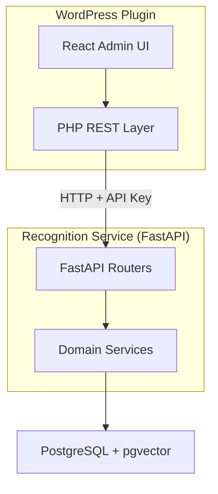

# Development Instructions

> **Cold-start document for coding agents.** Read this first. It contains universal rules that apply to ALL tasks, then routes you to domain-specific guidelines.

**Epic**: `docs/epics/v0.1.0/wp-sovereign-cluster-epic.md` · **Roadmap vision**: `docs/roadmaps/roadmap-v3.hybrid.md`

---

## System Overview



**Full diagram:** [diagrams/system-overview.mmd](diagrams/system-overview.mmd)

---

## Role Selection

Choose your domain to load targeted context. **Always load the testing guide** alongside your role guidelines — we practice TDD.

| Role                          | Context Map                                | Guidelines                                                               | Testing Guide                                              | Key Entry Points                      |
| ----------------------------- | ------------------------------------------ | ------------------------------------------------------------------------ | ---------------------------------------------------------- | ------------------------------------- |
| **Backend (Python)**          | [maps/backend.md](maps/backend.md)         | [rules/backend-python-guidelines.md](rules/backend-python-guidelines.md) | [rules/testing-python.md](rules/testing-python.md)         | `apps/prototype-description-service/` |
| **Frontend (React/TS)**       | [maps/frontend.md](maps/frontend.md)       | [rules/frontend-guidelines.md](rules/frontend-guidelines.md)             | [rules/testing-typescript.md](rules/testing-typescript.md) | `apps/prototype-wp-alt-context/js/`   |
| **PHP Plugin**                | [maps/php-plugin.md](maps/php-plugin.md)   | [rules/backend-php-guidelines.md](rules/backend-php-guidelines.md)       | [rules/testing-php.md](rules/testing-php.md)               | `apps/prototype-wp-alt-context/src/`  |
| **Cross-Service Integration** | [maps/integration.md](maps/integration.md) | [contracts/](contracts/)                                                 | [rules/testing-principles.md](rules/testing-principles.md) | `docs/agentic/contracts/`             |

### Additional Routing

| Working on...                        | Load                                                                                 |
| ------------------------------------ | ------------------------------------------------------------------------------------ |
| Writing tests (any language)         | [rules/testing-principles.md](rules/testing-principles.md) + language-specific guide |
| React/TypeScript tests (Vitest)      | [rules/testing-typescript.md](rules/testing-typescript.md)                           |
| Python tests (pytest)                | [rules/testing-python.md](rules/testing-python.md)                                   |
| PHP tests (PHPUnit)                  | [rules/testing-php.md](rules/testing-php.md)                                         |
| Workflow, commits, scaffolding       | [rules/development-workflow.md](rules/development-workflow.md)                       |
| Branch review                        | [rules/branch-review-guide.md](rules/branch-review-guide.md)                         |
| Component architecture patterns      | [rules/component-architecture-patterns.md](rules/component-architecture-patterns.md) |
| Radix UI / accessibility primitives  | [rules/RADIX_UI_COMPONENT_GUIDE.md](rules/RADIX_UI_COMPONENT_GUIDE.md)               |
| Roster auto-resolve vs pending       | [rules/roster_auto_resolve_behavior.md](rules/roster_auto_resolve_behavior.md)       |
| Embedding search evolution           | [rules/search_optimizations.md](rules/search_optimizations.md)                       |
| Detection vs identification boundary | [rules/why-identify-endpoint-exists.md](rules/why-identify-endpoint-exists.md)       |
| Face/Identity nomenclature (ADR)     | [ADR-001-face-identity-nomenclature.md](ADR-001-face-identity-nomenclature.md)       |
| MCP tooling / testing commands       | [BOOTSTRAP.md](BOOTSTRAP.md)                                                         |
| **Antigravity Agents (`/` cmds)**    | **See `.agent/workflows/` for environment-specific fallbacks and orchestration.**    |

---

## Monorepo Layout

```text
context-alt-text-monorepo/
    apps/
        prototype-wp-alt-context/     # WordPress plugin (frontend + PHP)
        prototype-description-service/ # FastAPI recognition service (backend)
    packages/
        shared-contracts/             # Shared API contracts and schemas
        wp-testing-helpers/           # Test utilities
    docs/
        agentic/                      # Agent-optimized documentation
            contracts/                # API schemas and fixtures
            diagrams/                 # Architecture diagrams (Mermaid)
            maps/                     # Context maps per domain
            rules/                    # Domain-specific guidelines
            templates/                # Reusable templates
        roadmaps/                     # Project roadmaps
        tasks/                        # Task breakdowns by version
    scripts/                          # Utility scripts
```

---

## Critical Rules

These rules are **universal** and apply to every task regardless of domain.

### Plugin Boundary Rule

> **You may ONLY modify files within this monorepo.**

**Allowed paths:**

- `apps/prototype-wp-alt-context/`
- `apps/prototype-description-service/`
- `packages/`
- `docs/`
- `scripts/`

**Never modify:**

- WordPress core files (`wp-config.php`, `.htaccess`, etc.)
- LocalWP configuration
- Files in `~/Local Sites/` or any WordPress installation directory
- System configuration files

If a task seems to require external changes, STOP and propose an alternative within plugin boundaries.

### Architecture Tooling Guardrail

Do not relax or edit compliance/lint scripts (e.g., `scripts/check-architecture-compliance.js`) to silence violations. Fix the offending code or update the documented rules instead.

### Greenfield Policy

> [!IMPORTANT]
> This is a **greenfield project** with NO production users and NO existing data that must be preserved.

- **No Data Migrations**: Storage surfaces (database tables, options, caches) are disposable.
- **Baseline Only**: All schema changes must be applied directly to the baseline migration file (`apps/prototype-description-service/db/migrations/versions/001_identity_schema.py`).
- **Clean Rewrites**: Prefer clean rewrites of logic and schema over backward-compatibility shims.
- **No Feature Flags**: Full latitude to delete experimental features. Prefer removal over long-lived feature flags.

### Remove Over Flag

Delete-over-flag is the default. Re-introduce features behind tests only when truly needed.

### Quality Gates Must Be Invocable

Every `composer`/`npm` verification gate script must be tested for invocability -- not just defined. A script that fails on invocation (wrong arguments, missing targets) rather than on real violations is invisible rot.

### No Debug Artifacts in Version Control

Do not track debug output files (`test_output.txt`, log dumps, etc.) in Git. Add them to `.gitignore`.

### Consolidated Checklists in Task Documents

All task/planning documents MUST consolidate checklists at the **bottom** of the document.

- Prevents checklist sprawl across sections
- Single source of truth for progress tracking
- **Do NOT include time estimates** on phases
- **Enforcement:** Do not scatter `- [ ]` items throughout narrative sections

### Naming Convention: acx\_\* / ACX\_\* Prefix

| Surface                        | Prefix        | Example                          |
| ------------------------------ | ------------- | -------------------------------- |
| WordPress options/meta         | `acx_*`       | `acx_persons`, `acx_version`     |
| PHP constants (plugin-defined) | `ACX_*`       | `ACX_PLUGIN_FILE`, `ACX_VERSION` |
| PHP constants (deployment)     | `ACX_*`       | `ACX_RECOGNITION_URL`            |
| REST API namespace             | `acx/v1/`     |                                  |
| PHP namespace                  | `AltContext\` |                                  |
| Text domain / slug             | `alt-context` |                                  |
| Filter hooks                   | `acx_*`       | `acx_recognition_base_url`       |

> [!WARNING]
> The `cat_*` and `alt_context_*` prefixes are **legacy**. If encountered in code or documentation, update them to `acx_*`.

### MCP Handoff Contract (MANDATORY)

You are one of multiple concurrent agents. MCP handoff tools are required for task state coordination.

Before any code exploration:

1. Call `get_handoff_state(task_ref="<task>")`.
2. If no active state exists, call `set_handoff_state(...)` to initialize it.
3. Do not use manual edits to `CURRENT_TASK.md` for state tracking.

During work:

1. Record non-trivial decisions with `record_decision(..., actor={ agent?, branch?, commit_sha? })`.
2. Add/update/complete task steps with `update_next_actions(..., actor={ ... })`.
3. Record blockers immediately with `report_blocker(..., actor={ ... })`.
4. Record verification commands with `record_test_result(..., actor={ ... })`.
5. Record/code-review findings with `record_review_finding(..., details={ line_start?, line_end?, fix? }, actor={ ... })`.
6. Update finding status with `update_review_finding(..., actor={ ... })`.
7. Validate review state using `get_review_findings_summary(...)` and `list_review_findings(...)` (not direct `sqlite3` queries).

Write-tool targeting rule:

- Write tools target the **active task only**.
- To write against a different task, switch active state first via `set_handoff_state(...)`.

Before final response:

1. Mark completed/skipped actions via `update_next_actions(...)`.
2. Update singleton state via `set_handoff_state(..., expected_revision=<current>, actor={ ... })`.
3. Regenerate `CURRENT_TASK.md` using `generate_current_task_md(...)`.
4. Include a one-line status marker in the response: `Handoff updated: yes`.

Read discipline:

- Do not query `.task-state/handoff.db` directly when MCP tools are available.
- Use `get_handoff_state` for active-task snapshot, `get_review_findings_summary` for counts, and `list_review_findings`/`get_review_finding` for detailed review verification.
- `get_review_finding` accepts either `finding_db_id` (integer PK) or `finding_id` (human-readable string like `"H-OCI-28"`). Prefer `finding_id` when referencing findings from review output.
- Do **not** use `scripts/mcp/unified_server.py` CLI subcommands when MCP tools are available; those CLI endpoints are fallback-only for environments that cannot attach to MCP.

State integrity invariants:

- Treat import/restore payloads as untrusted input. Validate payload shape and required object types before writes; malformed payloads must return `ok: false` (never silent success/no-op).
- Preserve write provenance on mutable records (for example review findings): creation metadata (`agent`, `branch`, `commit_sha`) is immutable once set; status updates may fill missing fields but must not overwrite recorded provenance.

Failure policy:

- If MCP handoff tools are unavailable, stop normal implementation work.
- Record/report the blocker, and include: `Handoff updated: no (tool unavailable)`.
- **Antigravity Agents ONLY**: Use predefined terminal commands in `.agent/workflows/` (e.g., `make task`, `make dashboard`) to query/orchestrate task state if native MCP tools are unconfigured. These CLI-style fallbacks exist only for MCP-constrained environments. Do not attempt raw SQLite writes.
- Use `templates/CURRENT_TASK.template.md` only as fallback when MCP handoff is unavailable.

Completion gate:

- A task response is incomplete if MCP handoff was not updated.

### Branch Review Trigger (MANDATORY)

When a user request matches any of these patterns, **load and follow** [rules/branch-review-guide.md](rules/branch-review-guide.md) before starting the review:

- "review" + ("implementation" | "code" | "changes" | "branch" | "PR" | "diff")
- "audit" + ("branch" | "code")
- "propose improvements" | "flag gaps" | "flag bugs"
- Any request to evaluate uncommitted or branch-scoped changes for quality

**Procedure:**

1. Read `rules/branch-review-guide.md` (process + checklist + report template).
2. Read the relevant stack guide(s) based on files in the diff.
3. Walk the common checklist + stack-specific checklist, citing files and lines.
4. Classify each finding using the defined categories (ANTIPATTERN / DEAD_CODE / COMPLEXITY / GAP) and severities (HIGH / MEDIUM / LOW).
5. Call `record_review_finding(..., details={ line_start?, line_end?, fix? }, actor={ ... })` for each finding.
6. Produce the markdown report using the template.
7. Call `record_decision(..., actor={ ... })` summarizing the review + `generate_current_task_md(...)`.

**Do NOT** perform ad-hoc reviews. The guide exists to ensure consistent, structured, cross-agent-visible output.

---

## Core Engineering Principles

Brief summaries of mandatory principles. Full details with code examples are in the linked domain guides.

### 1. Test-Driven Development

**Red -> Green -> Refactor** for every meaningful change. Do NOT write tests just to verify you wrote the code you wrote. Full details: [rules/testing-principles.md](rules/testing-principles.md) + your language-specific guide ([TypeScript](rules/testing-typescript.md), [Python](rules/testing-python.md), [PHP](rules/testing-php.md))

### 2. Scaffolding First (MANDATORY)

Before writing any implementation or tests, scaffold all interfaces and contracts. Full details: [rules/development-workflow.md](rules/development-workflow.md#scaffolding-first-mandatory)

### 3. Small Vertical Slices

Implement only the minimum needed to make the current test pass. Avoid speculative features.

### 4. Explicit Interfaces

Introduce abstractions (providers, services, interfaces) before integrating remote or hard-to-mock concerns.

### 5. Deterministic Tests

No network calls, randomness, or time-based logic without controlled seams/mocks. Tests must produce identical results on every run.

### 6. User Consent for Remote Operations

Never call remote recognition services or sync operations without explicit user action. Provide immediate feedback on success/failure.

### 7. No Fabricated Data

Never fabricate benchmark numbers, latency claims, or metrics. If data is unavailable, return an explicit empty state or error.

### 8. No False Claims of Bug Fixes

Never claim a bug is fixed without verifying in production/staging logs. A unit test passing does NOT prove a bug is fixed in production.

### 9. Curation-First Precedence

User curation decisions are ground truth. Never use time-based heuristics to override them. The correct gate is always a **data delta**: did the underlying evidence change since the user's decision? If yes, surface as a new proposal. If no, respect the decision indefinitely.

### 10. User-Recoverable Remote Flows

Remote-dependent UI states must remain recoverable when automation fails or stalls.

- Stale/offline states MUST expose at least one explicit user-triggered recovery action (for example, `Sync now`).
- Auto-retry logic (visibility/focus/interval) MUST be bounded per stale cycle and must re-arm only on explicit state transitions.
- Interactive recognition API calls MUST use explicit timeout budgets via a shared timeout helper; do not leave outlier calls unbounded.

---

## Code Style

### Package Management

- **npm** for Node.js (not pnpm)
- **Composer** for PHP

### Formatting

- 4-space indentation (PHP, TypeScript, SCSS)
- 2-space indentation (JSON, YAML, Markdown)
- Prettier for auto-formatting (frontend)
- PHP_CodeSniffer for PHP
- `ruff format` for Python

### TypeScript

- `strict: true` in tsconfig
- Arrow functions for components and utilities
- No `any` types without documented justification

### Python

- Type hints on all functions
- Google-style docstrings
- 120 character line length
- Double quotes for strings

---

## Documentation Standards

### File Organization

- Architecture docs in `docs/agentic/`
- Task breakdowns in `docs/tasks/{version}/`
- Roadmaps in `docs/roadmaps/`
- Use descriptive filenames (avoid generic `implementation-plan.md`)

### Templates

| Template                                                                 | When to Use                                                                                |
| ------------------------------------------------------------------------ | ------------------------------------------------------------------------------------------ |
| [templates/TASK_PLAN.template.md](templates/TASK_PLAN.template.md)       | New implementation plan under `docs/tasks/`                                                |
| [templates/EPIC.template.md](templates/EPIC.template.md)                 | Bounded multi-phase capability epic under `docs/epics/`                                    |
| [templates/ROADMAP.template.md](templates/ROADMAP.template.md)           | Multi-phase architectural roadmap under `docs/roadmaps/`                                   |
| [templates/CURRENT_TASK.template.md](templates/CURRENT_TASK.template.md) | Fallback template for manual multi-session tracking when MCP handoff tools are unavailable |

### Implementation Plan Requirements

All implementation plans in `docs/tasks/` MUST use [TASK_PLAN.template.md](templates/TASK_PLAN.template.md) and include:

1. **Problem Statement** -- What user-visible behavior needs to change
2. **Current State Analysis** -- What works, what's broken, what's missing
3. **Patterns to Follow** -- Code snippets showing the pattern to implement
4. **Functions to Change** -- Table with file paths, line numbers, and specific changes
5. **Related Files** -- Complete list of files that will be touched
6. **Consolidated Task Checklist** -- Phased checkboxes at the bottom

Epics under `docs/epics/` MUST use [EPIC.template.md](templates/EPIC.template.md). Epics are bounded capabilities with phased delivery, status tracking, and links to concrete task plans.

Roadmaps under `docs/roadmaps/` MUST use [ROADMAP.template.md](templates/ROADMAP.template.md). Roadmaps describe **what** and **why**; individual phases spawn task plans for **how**.

### Mermaid Diagrams

- **`.mmd` files: raw Mermaid syntax only -- NO code fences**
- `.md` files: use fenced code blocks
- Maximum 12 classes per diagram
- Use language-agnostic types: `string`, `int`, `bool`, `array<T>`

### ASCII Only

Use ASCII characters only in documentation. No emoji. Rationale: encoding issues across terminals and CI systems.

### Internationalization

All user-facing strings through `__()`, `_x()`, `_n()` with text domain `alt-context`.

---

## Quick Reference

### Key Files

| Purpose          | Location                                               |
| ---------------- | ------------------------------------------------------ |
| Roadmap (active) | `docs/roadmaps/v0.1.0/wp-sovereign-cluster-roadmap.md` |
| Roadmap (vision) | `docs/roadmaps/roadmap-v3.hybrid.md`                   |
| API Contracts    | `docs/agentic/contracts/`                              |
| Component Guide  | `docs/agentic/rules/RADIX_UI_COMPONENT_GUIDE.md`       |
| Backend UML      | `docs/agentic/diagrams/backend-uml/`                   |
| Frontend UML     | `docs/agentic/diagrams/frontend-uml/`                  |
| Active Tasks     | `docs/tasks/`                                          |

### Getting Help

1. Check the roadmap for context on current work
2. Review existing patterns in the codebase
3. Consult architecture docs for design decisions
4. Ask for clarification before making assumptions
