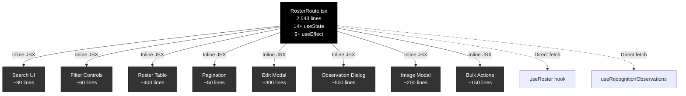
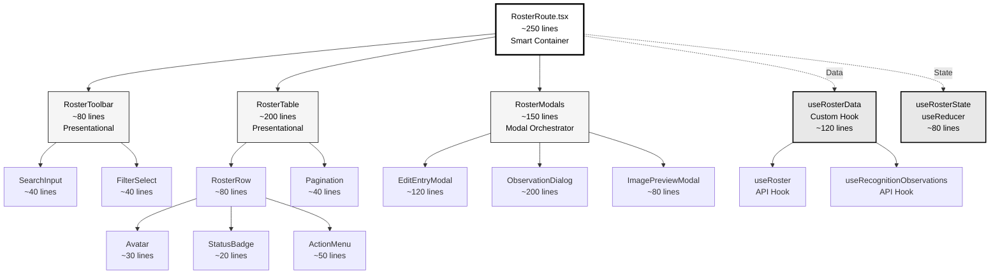
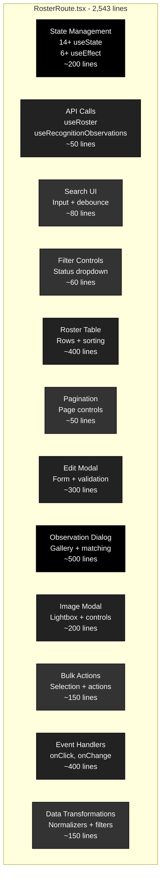
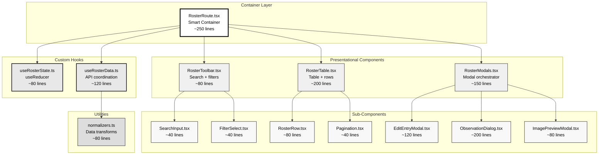

# Component Architecture Patterns

This document illustrates ideal component architecture patterns vs anti-patterns, with concrete examples from the codebase.

## Table of Contents

1. [Component Size & Composition](#component-size--composition)
2. [State Management Patterns](#state-management-patterns)
3. [Data Fetching Architecture](#data-fetching-architecture)
4. [Refactoring Case Study: RosterRoute](#refactoring-case-study-rosterroute)

---

## Component Size & Composition

### Anti-Pattern: God Component (Current)



**Problems:**

- All UI logic in one 2,543-line file
- 14+ `useState` hooks managing disparate concerns
- 6+ `useEffect` hooks creating complex dependencies
- Impossible to test components in isolation
- Changes to search affect modal logic (tight coupling)

---

### Ideal: Composed Architecture



**Benefits:**

- Each component < 300 lines (most < 150)
- Single responsibility per component
- State managed in dedicated hook (`useRosterState`)
- Data fetching isolated in custom hook (`useRosterData`)
- Components testable in isolation (Storybook-ready)
- Changes to search don't affect modals

---

## State Management Patterns

### Anti-Pattern: useState Explosion

```tsx
// RosterRoute.tsx - Current (2,543 lines)
export const RosterRoute = ({ bootstrap, config }) => {
  // 14+ useState hooks managing unrelated concerns
  const [searchInput, setSearchInput] = useState("");
  const [search, setSearch] = useState(null);
  const [page, setPage] = useState(1);
  const [perPage, setPerPage] = useState(20);
  const [editing, setEditing] = useState(null);
  const [isSubmitting, setIsSubmitting] = useState(false);
  const [statusFilter, setStatusFilter] = useState(null);
  const [draftValues, setDraftValues] = useState(null);
  const [observationPrompt, setObservationPrompt] = useState(null);
  const [selection, setSelection] = useState({});
  const [assigningId, setAssigningId] = useState(null);
  // ... 3+ more useState

  // 6+ useEffect hooks creating dependency chains
  useEffect(() => {
    /* debounce search */
  }, [searchInput]);
  useEffect(() => {
    /* reset page on filter */
  }, [statusFilter]);
  useEffect(() => {
    /* deep link handling */
  }, [location]);
  useEffect(() => {
    /* observation polling */
  }, [observationPrompt]);
  useEffect(() => {
    /* modal sync */
  }, [editing]);
  useEffect(() => {
    /* cleanup */
  }, []);

  // 2,000+ lines of JSX and event handlers
};
```

**Problems:**

- Related state scattered across 14+ hooks
- Effects synchronize state → waterfall updates
- Hard to reason about state transitions
- Difficult to debug which state caused a render

---

### Ideal: useReducer + Custom Hook

```tsx
// hooks/useRosterState.ts (~80 lines)
interface RosterState {
  // Pagination
  page: number;
  perPage: number;

  // Filtering
  searchInput: string;
  searchTerm: string | null;
  statusFilter: "verified" | "pending" | null;

  // Modals
  editing: RosterEntry | null;
  observationDialog: ObservationDialogState | null;
  imagePreview: ImagePreviewState | null;

  // UI State
  selection: Set<string>;
  isSubmitting: boolean;
}

type RosterAction =
  | { type: "SET_PAGE"; page: number }
  | { type: "SET_SEARCH"; searchInput: string }
  | { type: "APPLY_SEARCH"; searchTerm: string }
  | { type: "SET_FILTER"; filter: RosterState["statusFilter"] }
  | { type: "OPEN_EDIT_MODAL"; entry: RosterEntry }
  | { type: "CLOSE_EDIT_MODAL" }
  | { type: "TOGGLE_SELECTION"; entryId: string }
  | { type: "SUBMIT_START" }
  | { type: "SUBMIT_SUCCESS" };

const reducer = (state: RosterState, action: RosterAction): RosterState => {
  switch (action.type) {
    case "SET_SEARCH":
      return { ...state, searchInput: action.searchInput };

    case "APPLY_SEARCH":
      // When search is applied, reset to page 1
      return {
        ...state,
        searchTerm: action.searchTerm,
        page: 1,
      };

    case "SET_FILTER":
      // When filter changes, reset to page 1
      return {
        ...state,
        statusFilter: action.filter,
        page: 1,
      };

    case "OPEN_EDIT_MODAL":
      return {
        ...state,
        editing: action.entry,
        observationDialog: null, // Close other modals
      };

    // ... other actions
  }
};

export const useRosterState = (initialState: Partial<RosterState>) => {
  const [state, dispatch] = useReducer(reducer, {
    page: 1,
    perPage: 20,
    searchInput: "",
    searchTerm: null,
    statusFilter: null,
    editing: null,
    observationDialog: null,
    imagePreview: null,
    selection: new Set(),
    isSubmitting: false,
    ...initialState,
  });

  // Debounced search effect (only effect needed)
  useEffect(() => {
    const timer = setTimeout(() => {
      if (state.searchInput !== state.searchTerm) {
        dispatch({
          type: "APPLY_SEARCH",
          searchTerm: state.searchInput || null,
        });
      }
    }, 300);

    return () => clearTimeout(timer);
  }, [state.searchInput, state.searchTerm]);

  return { state, dispatch };
};
```

```tsx
// components/roster/RosterRoute.tsx (~250 lines)
export const RosterRoute = ({ bootstrap, config }) => {
  // Single custom hook manages all state
  const { state, dispatch } = useRosterState({
    page: bootstrap.pagination?.page,
    perPage: bootstrap.pagination?.perPage,
  });

  // Separate hook for data fetching
  const { entries, observations, isLoading } = useRosterData({
    page: state.page,
    perPage: state.perPage,
    search: state.searchTerm,
    statusFilter: state.statusFilter,
  });

  // No useEffect needed - all state transitions in reducer

  return (
    <div>
      <RosterToolbar
        searchInput={state.searchInput}
        onSearchChange={(value) =>
          dispatch({ type: "SET_SEARCH", searchInput: value })
        }
        statusFilter={state.statusFilter}
        onFilterChange={(filter) => dispatch({ type: "SET_FILTER", filter })}
      />

      <RosterTable
        entries={entries}
        selection={state.selection}
        onToggleSelection={(id) =>
          dispatch({ type: "TOGGLE_SELECTION", entryId: id })
        }
        onEdit={(entry) => dispatch({ type: "OPEN_EDIT_MODAL", entry })}
      />

      <RosterModals
        editing={state.editing}
        onCloseEdit={() => dispatch({ type: "CLOSE_EDIT_MODAL" })}
        observationDialog={state.observationDialog}
        // ...
      />
    </div>
  );
};
```

**Benefits:**

- All state in one place (single source of truth)
- State transitions are explicit and testable
- No useEffect chains (only 1 for debounce)
- Easy to add time-travel debugging
- Reducer can be unit tested independently

---

## Data Fetching Architecture

### Anti-Pattern: Hooks Called Directly in Component

```tsx
// RosterRoute.tsx - Current
export const RosterRoute = ({ bootstrap, config }) => {
  const [page, setPage] = useState(1);
  const [search, setSearch] = useState(null);
  const [statusFilter, setStatusFilter] = useState(null);

  // Multiple API hooks called directly
  const {
    data: rosterData,
    isLoading: rosterLoading,
    error: rosterError,
    refetch: refetchRoster,
  } = useRoster({ page, perPage: 20, search, status: statusFilter });

  const {
    data: observationsData,
    isLoading: observationsLoading,
    error: observationsError,
    refetch: refetchObservations,
  } = useRecognitionObservations({ page, perPage: 20 });

  // Manual coordination of loading states
  const isLoading = rosterLoading || observationsLoading;
  const hasError = rosterError || observationsError;

  // Manual coordination of refetch
  const handleRefresh = () => {
    refetchRoster();
    refetchObservations();
  };

  // Manual data transformation
  const entries = rosterData?.entries ?? [];
  const observations = observationsData?.records ?? [];

  // 2,000+ more lines...
};
```

**Problems:**

- Component knows about multiple API endpoints
- Manual loading/error state coordination
- Manual data transformation in component
- Hard to mock for testing
- Duplicated logic if another component needs same data

---

### Ideal: Custom Data Hook

```tsx
// hooks/useRosterData.ts (~120 lines)
interface UseRosterDataOptions {
  page: number;
  perPage: number;
  search: string | null;
  statusFilter: "verified" | "pending" | null;
}

export const useRosterData = (options: UseRosterDataOptions) => {
  const { page, perPage, search, statusFilter } = options;

  // Fetch roster entries
  const rosterQuery = useRoster({
    page,
    perPage,
    search,
    status: statusFilter,
  });

  // Fetch observations (if needed)
  const observationsQuery = useRecognitionObservations({
    page,
    perPage,
  });

  // Derived loading state
  const isLoading = rosterQuery.isLoading || observationsQuery.isLoading;
  const isError = rosterQuery.isError || observationsQuery.isError;

  // Combined error
  const error = rosterQuery.error || observationsQuery.error;

  // Transformed data
  const entries = useMemo(() => {
    const raw = rosterQuery.data?.entries ?? [];
    // Apply any client-side transformations
    return raw.map(normalizeRosterEntry);
  }, [rosterQuery.data]);

  const observations = useMemo(() => {
    const raw = observationsQuery.data?.records ?? [];
    // Apply any client-side transformations
    return raw.map(normalizeObservation);
  }, [observationsQuery.data]);

  // Coordinated refetch
  const refetch = useCallback(() => {
    rosterQuery.refetch();
    observationsQuery.refetch();
  }, [rosterQuery, observationsQuery]);

  return {
    // Data
    entries,
    observations,

    // State
    isLoading,
    isError,
    error,

    // Actions
    refetch,
  };
};
```

```tsx
// components/roster/RosterRoute.tsx (~250 lines)
export const RosterRoute = ({ bootstrap, config }) => {
  const { state, dispatch } = useRosterState(/* ... */);

  // Single hook provides all data
  const { entries, observations, isLoading, refetch } = useRosterData({
    page: state.page,
    perPage: state.perPage,
    search: state.searchTerm,
    statusFilter: state.statusFilter,
  });

  // Component only handles UI logic
  return (
    <div>
      {isLoading ? (
        <LoadingSpinner />
      ) : (
        <RosterTable entries={entries} /* ... */ />
      )}
    </div>
  );
};
```

**Benefits:**

- Component doesn't know about API endpoints
- Data transformation logic centralized
- Loading/error states coordinated automatically
- Easy to mock `useRosterData` in tests
- Reusable across multiple components
- Can add caching, polling, optimistic updates in one place

---

## Refactoring Case Study: RosterRoute

### Current Structure (2,543 lines) - AVOID



### Refactored Structure (8 files, ~1,200 lines total) - TARGET



### Refactoring Steps

```mermaid
graph LR
    Start["RosterRoute.tsx<br/>2,543 lines"] --> Step1

    Step1["1. Extract State Hook<br/>useRosterState<br/>Reducer + 1 effect<br/>-200 lines"] --> Step2

    Step2["2. Extract Data Hook<br/>useRosterData<br/>API coordination<br/>-150 lines"] --> Step3

    Step3["3. Extract Toolbar<br/>Search + Filters<br/>-140 lines"] --> Step4

    Step4["4. Extract Table<br/>RosterTable + Row<br/>-480 lines"] --> Step5

    Step5["5. Extract Modals<br/>Edit + Observation + Image<br/>-1,000 lines"] --> Step6

    Step6["6. Extract Normalizers<br/>Data transformation utils<br/>-150 lines"] --> Done

    Done["RosterRoute.tsx<br/>~250 lines<br/>Maintainable"]

    style Start fill:#000,stroke:#000,color:#fff,stroke-width:3px
    style Done fill:#fff,stroke:#000,color:#000,stroke-width:3px
    style Step1 fill:#e8e8e8,stroke:#000,color:#000
    style Step2 fill:#e8e8e8,stroke:#000,color:#000
    style Step3 fill:#e8e8e8,stroke:#000,color:#000
    style Step4 fill:#e8e8e8,stroke:#000,color:#000
    style Step5 fill:#e8e8e8,stroke:#000,color:#000
    style Step6 fill:#e8e8e8,stroke:#000,color:#000
```



### File Structure After Refactoring

```
components/roster/
├── RosterRoute.tsx              # 250 lines - Smart container
├── RosterToolbar.tsx            # 80 lines - Search + filters UI
├── RosterTable.tsx              # 200 lines - Table + pagination
├── RosterModals.tsx             # 150 lines - Modal orchestration
├── components/
│   ├── SearchInput.tsx          # 40 lines - Reusable search
│   ├── FilterSelect.tsx         # 40 lines - Status filter
│   ├── RosterRow.tsx            # 80 lines - Table row + actions
│   ├── Pagination.tsx           # 40 lines - Reusable pagination
│   ├── EditEntryModal.tsx       # 120 lines - Edit form
│   ├── ObservationDialog.tsx    # 200 lines - Recognition gallery
│   └── ImagePreviewModal.tsx    # 80 lines - Image lightbox

hooks/
├── useRosterState.ts            # 80 lines - State management
└── useRosterData.ts             # 120 lines - Data fetching

utils/
└── roster-normalizers.ts        # 80 lines - Data transforms

Total: ~1,260 lines (vs 2,543 lines = 50% reduction)
```

---

## Testing Benefits

### Before: Untestable Monolith

```tsx
// Impossible to test in isolation
describe("RosterRoute", () => {
  it("should handle search", () => {
    // Need to mock:
    // - useRoster hook
    // - useRecognitionObservations hook
    // - React Router (useLocation, useNavigate)
    // - All 14+ state interactions
    // - All modal logic
    // - All table logic
    // Test becomes 500+ lines
  });
});
```

### After: Isolated Unit Tests

```tsx
// Test reducer independently
describe("useRosterState reducer", () => {
  it("resets to page 1 when search changes", () => {
    const state = { page: 5, searchTerm: "old" };
    const action = { type: "APPLY_SEARCH", searchTerm: "new" };

    const result = reducer(state, action);

    expect(result.page).toBe(1);
    expect(result.searchTerm).toBe("new");
  });
});

// Test data hook independently
describe("useRosterData", () => {
  it("combines roster and observation data", () => {
    mockUseRoster.mockReturnValue({ data: mockRoster });
    mockUseRecognitionObservations.mockReturnValue({ data: mockObs });

    const { result } = renderHook(() => useRosterData(options));

    expect(result.current.entries).toHaveLength(10);
    expect(result.current.observations).toHaveLength(5);
  });
});

// Test components in Storybook
export const Default = () => (
  <RosterTable
    entries={mockEntries}
    selection={new Set()}
    onToggleSelection={action("toggle")}
  />
);
```

---

## Summary: Key Architectural Principles

1. **Single Responsibility**: Each file/component does ONE thing well
2. **Composition Over Monoliths**: Build complex UIs from simple pieces
3. **Extract Early**: Don't wait for 2,543 lines — extract at 250
4. **State in Hooks**: Move complex state to `useReducer` + custom hooks
5. **Data Isolation**: Wrap API calls in custom hooks that coordinate and transform
6. **Presentational/Container**: Separate "smart" data components from "dumb" UI components
7. **Test Boundaries**: Each extracted piece is a testable unit
