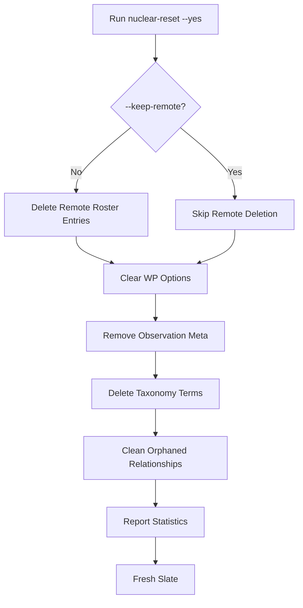

# Nuclear Reset Command — Development Guide

## Overview

The `wp cat-roster nuclear-reset` command provides a comprehensive way to completely wipe all recognition and roster data from WordPress. This is a **development-only** command designed for situations where you need a completely clean slate.

## When to Use

### ✅ Good Use Cases

- **Fresh start during development** after significant data structure changes
- **Testing recognition workflow** from scratch with known data
- **Cleaning up test data** after experimenting with recognition features
- **Resetting after bugs** that corrupted recognition/roster data
- **Before major migrations** to ensure clean state

### ❌ DO NOT Use In Production

This command is **DESTRUCTIVE** and will permanently delete data. Never run this on:

- Production websites
- Sites with real user roster data
- Sites where recognition history needs to be preserved

## What Gets Deleted

### 1. WordPress Options

| Option Key | Description |
|-----------|-------------|
| `cat_roster_entries` | All local roster entries |
| `cat_roster_entries_archived` | Archive of deleted entries |
| `cat_roster_sync_state` | Sync timestamps and metrics |
| `cat_recognition_observation_index` | Observation index for quick lookups |
| `cat_recognition_retry_log` | Recognition retry tracking |

### 2. Post Meta

| Meta Key | Description |
|----------|-------------|
| `_cat_recognition_observations` | Recognition results and observations |
| `_cat_recognition_roster_ids` | Roster IDs assigned to attachments |
| `_context_alt_text_recognition_observations` | Legacy observation data |

### 3. Taxonomy

- **All terms** in `cat_roster_entity` taxonomy
- **All term relationships** linking attachments to roster entities
- **Orphaned relationships** that may exist from bugs

### 4. Remote Backend (Optional)

With default behavior (no `--keep-remote` flag):

- **Roster entries** deleted from recognition service
- **Embeddings** removed from vector store
- **Reference images** deleted from backend storage

## Command Syntax

```bash
wp cat-roster nuclear_reset --yes [--keep-remote]
```

### Required Flags

- `--yes` — Must be provided to confirm destructive operation (prevents accidental execution)

### Optional Flags

- `--keep-remote` — Preserve remote backend roster data, only clean WordPress

## Usage Examples

### Complete Reset (Local + Remote)

```bash
wp cat-roster nuclear_reset --yes
```

Deletes everything from both WordPress and the remote recognition service.

**Output:**

```text
Starting nuclear reset...
Deleting remote roster entries...
  Deleted 15 remote roster entries
Clearing WordPress options...
  Cleared 5 WordPress options
Removing recognition observations from attachments...
  Removed 48 observation meta entries
Deleting roster taxonomy terms...
  Deleted 15 taxonomy terms
Cleaning orphaned taxonomy relationships...
  Removed 3 orphaned relationships

Nuclear reset completed:
  Roster entries deleted: 15
  Remote entries deleted: 15
  Observation meta entries removed: 48
  Taxonomy terms deleted: 15
  WordPress options cleared: 5

Success: All recognition and roster data has been deleted. You can now start fresh.
```

### Local-Only Reset

```bash
wp cat-roster nuclear_reset --yes --keep-remote
```

Cleans WordPress data but preserves backend roster. Useful when:

- Backend has correct data you want to re-sync
- Testing WordPress integration without losing embeddings
- Resetting after local corruption but backend is healthy

**Output includes:**

```text
Remote entries preserved (--keep-remote)
```

## Recovery Workflow

After running nuclear reset, follow these steps to rebuild your data:

### Option 1: Start Fresh (Complete Reset)

1. **Upload new reference images** via Roster Manager UI
2. **Process images** to generate new embeddings
3. **Run recognition** on attachments to create observations
4. **Taxonomy recreates** automatically as observations are matched

### Option 2: Re-sync from Backend (--keep-remote)

1. **Sync roster entries** from backend:

   ```bash
   wp cat-roster sync
   ```

2. **Re-run recognition** on attachments to rebuild observations
3. **Verify taxonomy** was recreated correctly:

   ```bash
   wp term list cat_roster_entity
   ```

## Data Flow Diagram



## Technical Details

### Deletion Order

The command deletes data in a specific order to minimize orphaned references:

1. **Remote entries first** (if not `--keep-remote`) — removes embeddings from backend
2. **WordPress options** — clears roster and sync state
3. **Post meta** — removes all observation data
4. **Taxonomy terms** — deletes roster entity terms
5. **Orphaned relationships** — belt-and-suspenders cleanup

### Error Handling

The command handles errors gracefully:

- **Remote deletion failures** are logged as warnings but don't stop execution
- **Missing functions** (e.g., in test environments) skip that step with warning
- **Database errors** are caught and reported but allow other steps to continue

### Statistics Tracking

The command tracks and reports:

- `roster_entries_deleted` — Local roster entries removed
- `remote_entries_deleted` — Backend entries deleted (0 if `--keep-remote`)
- `observations_removed` — Post meta rows deleted
- `taxonomy_terms_deleted` — Terms removed from taxonomy
- `options_cleared` — WordPress options deleted

## Safety Features

### Confirmation Required

The `--yes` flag is **required** to prevent accidental execution:

```bash
# This will error without --yes
wp cat-roster nuclear_reset

# Error: Add --yes flag to confirm this destructive operation.
```

### Warning Messages

The command outputs clear warnings:

```text
Starting nuclear reset...
```

### Statistics Summary

Always shows exactly what was deleted so you can verify:

```text
Nuclear reset completed:
  Roster entries deleted: 15
  ...
```

## Alternatives to Nuclear Reset

Before using nuclear reset, consider these less destructive alternatives:

### Update Roster Entries

Instead of deleting, update existing entries with new references:

```php
// Via REST API
PATCH /cat/v1/roster/{remoteId}
```

### Repair Taxonomy

If only taxonomy is broken:

```bash
wp cat-roster repair-taxonomy
```

### Selective Deletion

Delete specific roster entries via UI or:

```bash
wp eval 'context_alt_text_roster_service()->deleteAndArchive("remote-id");'
```

### Re-sync Only

If data is just out of sync:

```bash
wp cat-roster sync
```

## FAQ

### Q: Can I undo a nuclear reset?

**A:** No. The operation is permanent. Make database backups before using this command if you might need to recover data.

### Q: Will this affect my media files?

**A:** No. Only metadata (post meta, taxonomy) is deleted. The actual image files in `wp-content/uploads/` are untouched.

### Q: What about alt text generated by recognition?

**A:** Alt text stored in `_wp_attachment_image_alt` is **not** deleted. Only recognition observation data is removed.

### Q: Can I use this in a script?

**A:** Yes, the `--yes` flag makes it scriptable:

```bash
#!/bin/bash
wp cat-roster nuclear_reset --yes --keep-remote
wp cat-roster sync
```

### Q: How long does it take?

**A:** Usually < 10 seconds for most sites. Time depends on:

- Number of roster entries (remote deletion is slowest)
- Number of attachments with observations
- Database query performance

### Q: Is there a dry-run mode?

**A:** No. The command is destructive by design. Use `wp cat-roster status` to see what data exists before deleting.

## See Also

- [`roster_taxonomy_guide.md`](./roster_taxonomy_guide.md) — Full taxonomy documentation
- [`face_recognition_tasks.md`](./face_recognition_tasks.md) — Recognition workflow overview
- [`roster_auto_resolve_behavior.md`](./roster_auto_resolve_behavior.md) — Auto-matching behavior

## Support

For issues or questions:

1. Check logs: `wp cat-roster status` and `tail -f wp-content/debug.log`
2. Verify data: `wp term list cat_roster_entity --format=count`
3. Report bugs with command output and error messages
