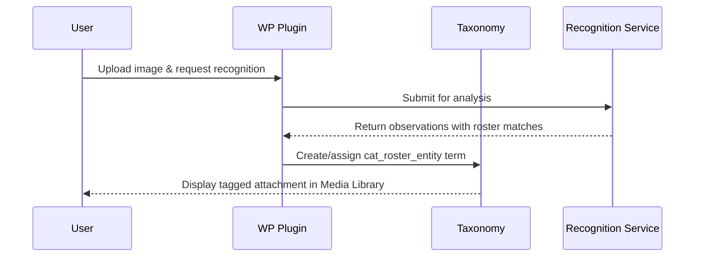

# Roster Taxonomy (`cat_roster_entity`) — Admin & Operations Guide

## Overview

The `cat_roster_entity` taxonomy provides a WordPress-native way to organize and categorize media attachments by their associated roster entries (recognized faces and entities). It replaces the legacy `post_tag` approach with a dedicated taxonomy that offers better control, REST API integration, and capability management.

## Key Features

- **Dedicated taxonomy** for roster entity associations
- **REST API enabled** at `wp-json/wp/v2/cat-roster-entities`
- **Capability-based access control** restricting management to administrators
- **Attachment-specific** — only applies to media library items
- **Bidirectional sync** with remote recognition service roster

## Taxonomy Configuration

### Registration Details

```php
Taxonomy ID: cat_roster_entity
Object Type: attachment
REST Base: cat-roster-entities
```

### Capabilities

| Operation | Required Capability | Default Role |
|-----------|-------------------|--------------|
| Manage terms (create/edit/delete) | `manage_options` | Administrator |
| Assign terms to attachments | `upload_files` | Editor, Author, Contributor |

**Important**: Only administrators can create, edit, or delete roster entity terms. Other roles with media upload permissions can assign existing terms to attachments.

### Labels

- **Name**: Roster Entities
- **Singular**: Roster Entity
- **Menu**: Roster Entities
- **Search**: Search Roster Entities
- **All Items**: All Roster Entities
- **Edit**: Edit Roster Entity
- **Update**: Update Roster Entity
- **Add New**: Add New Roster Entity

## Usage

### Programmatic Access

#### Check if Taxonomy Exists

```php
if (taxonomy_exists('cat_roster_entity')) {
    // Taxonomy is registered
}
```

#### Get All Roster Entity Terms

```php
$terms = get_terms([
    'taxonomy' => 'cat_roster_entity',
    'hide_empty' => false,
]);
```

#### Assign Roster Entity to Attachment

```php
$attachment_id = 123;
$term_ids = [45, 67]; // Roster entity term IDs

wp_set_object_terms($attachment_id, $term_ids, 'cat_roster_entity');
```

#### Query Attachments by Roster Entity

```php
$args = [
    'post_type' => 'attachment',
    'tax_query' => [
        [
            'taxonomy' => 'cat_roster_entity',
            'field' => 'slug',
            'terms' => 'alice-example',
        ],
    ],
];

$query = new WP_Query($args);
```

### REST API Access

#### Retrieve All Roster Entities

```bash
GET /wp-json/wp/v2/cat-roster-entities
```

**Authentication**: WordPress nonce or application password required

**Response**: Array of term objects with standard WordPress taxonomy fields

#### Filter Attachments by Roster Entity

```bash
GET /wp-json/wp/v2/media?cat-roster-entities=45
```

Replace `45` with the term ID of the roster entity.

### WP-CLI Commands

#### Check Roster Status

```bash
wp cat-roster status
```

Displays sync metrics and roster entry counts.

#### Migrate Legacy Tags

```bash
wp cat-roster migrate-tags [--keep-legacy]
```

Migrates existing `post_tag` terms with `cat_roster_` or `cat-recognition-` prefixes to the `cat_roster_entity` taxonomy.

**Options**:

- `--keep-legacy`: Retain original post tags after migration (for editorial discovery)
- Default: Legacy tags are removed after successful migration

**What it does**:

1. Scans for legacy post tags matching roster prefixes
2. Creates equivalent `cat_roster_entity` terms
3. Re-links attachment relationships
4. Optionally removes legacy tags

**Output**:

```text
Processed: 42 terms
Created: 38 new roster entities
Updated: 4 existing entities
Migrated relationships: 156 attachments
Skipped: 0 terms
Legacy tags removed: 42 (or kept if --keep-legacy flag used)
```

#### Repair Taxonomy Assignments

```bash
wp cat-roster repair-taxonomy
```

Re-syncs roster entity taxonomy terms for attachments that have recognition observations with matched status. Useful after bug fixes or to retroactively apply taxonomy to previously processed images.

**What it does**:

1. Finds all attachments with recognition observations
2. Filters for those with matched status
3. Re-triggers taxonomy sync for each matched attachment
4. Reports counts of processed, fixed, and skipped items

**Use when**:

- After fixing taxonomy assignment bugs
- To retroactively apply taxonomy to old recognitions
- To verify taxonomy sync is working correctly

#### Nuclear Reset (Development Only)

```bash
wp cat-roster nuclear_reset --yes [--keep-remote]
```

**⚠️ DESTRUCTIVE OPERATION** — Deletes all recognition and roster data. Use only in development when you need a completely clean slate.

**Options**:

- `--yes`: Required flag to confirm the destructive operation
- `--keep-remote`: Preserve remote backend roster entries (only clean local WordPress data)

**What it deletes**:

1. **Roster entries**: All local roster entries (and remote unless `--keep-remote`)
2. **Recognition observations**: All recognition data from attachments
3. **Taxonomy terms**: All `cat_roster_entity` terms and relationships
4. **WordPress options**: Sync state, indexes, retry logs
5. **Postmeta**: All `_cat_recognition_*` and roster-related meta keys

**Output**:

```text
Nuclear reset completed:
  Roster entries deleted: 15
  Remote entries deleted: 15 (or "preserved" with --keep-remote)
  Observation meta entries removed: 48
  Taxonomy terms deleted: 15
  WordPress options cleared: 5
```

**Use cases**:

- Fresh start during development after significant data structure changes
- Testing recognition workflow from scratch
- Cleaning up after testing with bad/incorrect data
- Resetting after manual database corruption

**Recovery**:

After nuclear reset:

1. Re-upload reference images via Roster Manager
2. Run `wp cat-roster sync` to pull from backend (if using `--keep-remote`)
3. Re-run recognition on attachments to rebuild observations
4. Taxonomy will be automatically recreated as recognitions are matched

## Integration with Roster Manager

### Automatic Tagging

When a face observation is **matched** to a roster entry (either automatically or by operator assignment):

1. The attachment receives a `cat_roster_entity` term corresponding to the roster entry
2. The term's slug is derived from the roster entry's `remoteId`
3. Multiple roster entities can be assigned to a single attachment (e.g., group photos)

### Tag Synchronization

The plugin automatically syncs roster entities when:

- **Observation resolved**: User assigns an observation to a roster entry
- **Roster entry created**: New roster entry with reference images creates corresponding term
- **Roster sync**: Backend roster changes propagate to local taxonomy terms
- **Manual assignment**: User assigns roster entity in Media Library or Roster Manager

### Viewing Tagged Media

In the **Roster Manager** (`Admin > Context Alt-Text > Roster`):

1. Each roster entry displays associated media attachments
2. Click through to view/edit attachments with that roster entity
3. Filter Media Library by roster entity using taxonomy filter dropdown

## Data Flow



## Migration from Legacy Tags

### Before Migration

Legacy roster data used `post_tag` taxonomy with prefixes:

- `cat_roster_*` (roster entity tags)
- `cat-recognition-*` (recognition-related tags)

**Issues**:

- Mixed with editorial tags in Media Library
- No capability restrictions (any editor could modify)
- Not attachment-specific
- Cluttered tag cloud

### After Migration

All roster associations use `cat_roster_entity`:

- Dedicated admin interface
- Capability-locked to `manage_options`
- REST API enabled for SPA integration
- Clean separation from editorial tags

### Running the Migration

**Recommended approach**:

1. **Backup database** before migration
2. Run with `--keep-legacy` flag initially:

   ```bash
   wp cat-roster migrate-tags --keep-legacy
   ```

3. Verify roster entities in Admin UI
4. Check Media Library filtering works correctly
5. If satisfied, run without flag to remove legacy tags:

   ```bash
   wp cat-roster migrate-tags
   ```

**Rollback**: If needed, legacy tags retained with `--keep-legacy` can be manually re-associated through Media Library bulk edit.

## Troubleshooting

### Taxonomy Not Appearing in Admin

**Cause**: Plugin not activated or taxonomy registration failed

**Solution**:

```bash
wp plugin activate context-alt-text
wp rewrite flush
```

### Cannot Assign Terms to Attachments

**Cause**: User lacks `upload_files` capability

**Solution**: Ensure user has Editor, Author, or Contributor role

### REST API Returns 401 Unauthorized

**Cause**: Missing or invalid authentication

**Solution**:

- Add `X-WP-Nonce` header with valid nonce value
- Or use WordPress application password for external requests

### Migration Skips Terms

**Cause**: Term already exists in `cat_roster_entity`

**Solution**: This is expected behavior. Migration is idempotent and won't duplicate terms.

## Best Practices

### For Operators

1. **Use Roster Manager** instead of directly editing taxonomy terms
2. **Let automatic tagging work** — system will assign terms when observations are matched
3. **Review pending observations** regularly to improve roster coverage
4. **Keep roster synced** with backend service using "Sync from Remote" button

### For Developers

1. **Check capabilities** before allowing term creation/editing
2. **Use `wp_set_object_terms()`** for programmatic assignment
3. **Query by term ID** rather than slug for better performance
4. **Respect REST API** authentication requirements
5. **Test with `--keep-legacy` flag** before production migration

## Security Considerations

- **Admin-only term management**: Prevents unauthorized roster manipulation
- **Upload-based assignment**: Limits term visibility to media contributors
- **REST API authentication**: Requires valid WordPress session or app password
- **Capability checks**: Enforced at registration and in all CRUD operations

## Related Documentation

- [Face Recognition Workflow Tasks](./face_recognition_tasks.md)
- [Roster Auto-Resolve Behavior](./roster_auto_resolve_behavior.md)
- [Backend Roster Service](../backend-uml/roster_service.mermaid)
- [Frontend Roster Domain Classes](../frontend-uml/roster-domain-classes.mmd)

## Changelog

### v0.1.0 (Current)

- Initial `cat_roster_entity` taxonomy registration
- REST API exposure at `/wp-json/wp/v2/cat-roster-entities`
- Capability-based access control
- Legacy tag migration via `wp cat-roster migrate-tags`
- Automatic tagging on observation resolution
- Roster Manager integration

### Future Enhancements (v0.2+)

- Taxonomy meta for embedding references
- Bulk re-tagging utilities
- Admin column customization
- Enhanced Media Library filtering UI
- Storybook fixtures with taxonomy data
