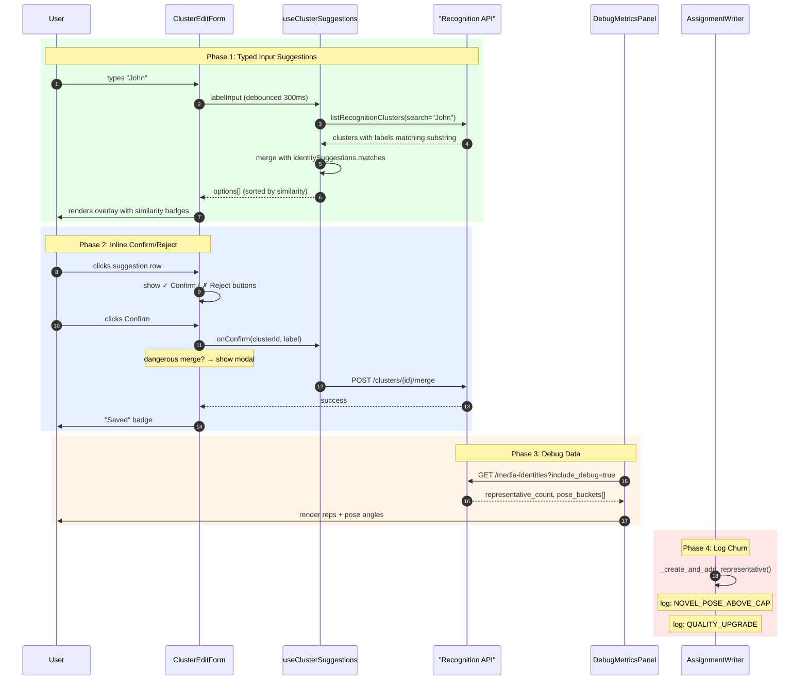

# Identity cluster edit improvements (v4.10.1 plan)

## Outcome

Restore the live suggestion overlay, surface similarity metrics, expose representative debug info, and make representative changes auditable/logged so the workbench behaves like the pre-v4.9.11 experience while keeping the new queued/save modal UX.

---

## Architecture



---

## Root Cause Analysis (from findings)

| Finding | Root Cause | Fix |
|---------|-----------|-----|
| Suggestions overlay empty for new names | `options` only populated from `identitySuggestions.matches`; no query on typed label | Add debounced `listRecognitionClusters(search=labelInput)` query |
| No similarity for user-typed labels | `findClusterByLabel` runs only on Save, never feeds back to overlay | Merge label search results into `options` as they arrive |
| Missing confirm/reject inline UI | `window.confirm` replaced with generic save modal | Add ✓/✗ buttons per suggestion row; modal only for dangerous merges |
| Debug panel lacks representative count | API doesn't return `representative_count` or pose buckets | Add `include_debug` flag to `/media-identities` response |
| No churn logs for novel poses above cap | `_create_and_add_representative` doesn't log the "above max" case | Add `NOVEL_POSE_ABOVE_CAP` and `QUALITY_UPGRADE` log statements |

---

## Implementation Steps

### 1. Drive suggestions from typed input

- Extend `useClusterSuggestions` ([useClusterSuggestions.ts](../../../../apps/prototype-wp-alt-context/js/admin/pages/workbench/identity-clusters/useClusterSuggestions.ts)) so it surfaces both identity-based suggestions and the user-defined labels returned by `listRecognitionClusters`. The hook should accept the current `labelInput` (debounced) and refresh the `options` array with clusters whose names contain the typed substring, sorted by similarity (reuse `identitySuggestions.matches` where available and compute a `similarity` score for general matches when the backend can return it).
- Ensure `options` keeps `group` and `similarity` metadata so the overlay UI can sort and color the rows, and update `findClusterByLabel` to reuse the merged list rather than re-paginating only at save time.

### 2. Show similarity percentages with confirm/reject controls

- Update `ClusterEditForm` ([ClusterEditForm.tsx:59-112](../../../../apps/prototype-wp-alt-context/js/admin/pages/workbench/identity-clusters/ClusterEditForm.tsx#L59-L112)) to render each suggestion with its similarity percent and two action buttons (e.g. Confirm / Reject) that call back into `IdentityClusterItem` instead of auto-saving. This gives the user the visual feedback they expect while the modal dialog can stay for final merge confirmation.
- Adjust `IdentityClusterItem` ([IdentityClusterItem.tsx:60-507](../../../../apps/prototype-wp-alt-context/js/admin/pages/workbench/identity-clusters/IdentityClusterItem.tsx#L60-L507)) so the confirm dialog only appears for dangerous merges and the inline buttons directly trigger `mutations.merge`/`mutations.assignToCluster` with the selected cluster id and label. Maintain the `saveStatus` state so the overlay can still show "Saving queued"/"Saved".

### 3. Expose richer debug data in development mode

- Request `representative_count` (and optional per-representative pose bucket) from `GET /media-identities` by extending the backend router ([clusters.py](../../../../apps/prototype-description-service/recognition/interface_adapters/http/routers/clusters.py)) or repository to include `representative_count`/pose metadata in the serialized `DetectedIdentity` response when `include_debug` is true. Update the API types ([identity.ts](../../../../apps/prototype-wp-alt-context/js/admin/api/recognition/types/identity.ts)) accordingly.
- Render the new values in `DebugMetricsPanel` ([DebugMetricsPanel.tsx](../../../../apps/prototype-wp-alt-context/js/admin/pages/workbench/identity-clusters/DebugMetricsPanel.tsx)) so the expanded panel lists number of representatives, the pose angles for the current face, and any diversity info (e.g., bucket counts). Keep the collapse toggle behavior and add helper labels (e.g., `Pose: P:...` as requested).

### 4. Log representative churn for novel angles & replacements

- In `AssignmentWriter._create_and_add_representative` ([assignment_writer.py:339-370](../../../../apps/prototype-description-service/recognition/application/persistence/assignment_writer.py#L339-L370)), emit `logger.info` statements that mention when a representative is created even though the cluster already had the maximum number of reps and when the reason is `novel_pose_addition`.
- Ensure `_find_upgradeable_representative` already logs upgrades (lines 175-214); extend it or the caller to emit complementary log entries when a higher-quality face replaces a poorer one in the same pose bucket. This gives the confirm logs the detail requested ("new representative faces for novel angles are added even above max" and "higher quality faces replace poor quality representatives").

---

## Coding Patterns

### Pattern 1: Debounced Search Query in useClusterSuggestions

```typescript
// useClusterSuggestions.ts — add debounced label search
interface UseClusterSuggestionsOptions {
  identityId: string | undefined;
  enabled: boolean;
  labelInput?: string;           // NEW: current typed label
  debounceMs?: number;           // NEW: debounce delay (default 300)
}

export const useClusterSuggestions = ({
  identityId,
  enabled,
  labelInput = '',
  debounceMs = 300,
}: UseClusterSuggestionsOptions): UseClusterSuggestionsReturn => {
  const [debouncedLabel, setDebouncedLabel] = React.useState(labelInput);

  // Debounce label input to avoid excessive API calls
  React.useEffect(() => {
    const timer = setTimeout(() => setDebouncedLabel(labelInput), debounceMs);
    return () => clearTimeout(timer);
  }, [labelInput, debounceMs]);

  // Query clusters matching the debounced label
  const { data: labelMatches, isLoading: labelMatchesLoading } = useQuery({
    queryKey: ['cluster-label-search', debouncedLabel],
    queryFn: () => listRecognitionClusters({
      limit: 20,
      offset: 0,
      labeled_only: true,
      search: debouncedLabel,  // NEW: backend must support this param
    }),
    enabled: Boolean(enabled && debouncedLabel.length >= 2),
    staleTime: 30000,
  });

  // Merge identity suggestions + label matches, dedupe by cluster_id
  const options = React.useMemo<ComboboxOption[]>(() => {
    const result: ComboboxOption[] = [];
    const seen = new Set<string>();

    // Identity suggestions first (have similarity scores)
    (identitySuggestions?.matches ?? [])
      .sort((a, b) => b.similarity - a.similarity)
      .forEach((match) => {
        if (!match.label?.trim() || seen.has(match.cluster_id)) return;
        seen.add(match.cluster_id);
        result.push({
          value: match.cluster_id,
          label: match.label.trim(),
          group: 'Suggested',
          similarity: match.similarity,
          identityCount: match.identity_count,
        });
      });

    // Label matches second (no similarity, use undefined)
    (labelMatches ?? []).forEach((cluster) => {
      if (!cluster.label?.trim() || seen.has(cluster.id)) return;
      seen.add(cluster.id);
      result.push({
        value: cluster.id,
        label: cluster.label.trim(),
        group: 'All Labels',
        similarity: undefined,  // no face similarity for label-only matches
        identityCount: cluster.identity_count,
      });
    });

    return result;
  }, [identitySuggestions, labelMatches]);

  return { options, isLoading: suggestionsLoading || labelMatchesLoading, findClusterByLabel };
};
```

### Pattern 2: Inline Confirm/Reject in ClusterEditForm

```tsx
// ClusterEditForm.tsx — add inline action buttons
interface ClusterEditFormProps {
  // ... existing props
  onConfirmSuggestion?: (clusterId: string, label: string) => void;  // NEW
  onRejectSuggestion?: (clusterId: string) => void;                  // NEW
}

// In the suggestion item render:
<button
  key={option.value}
  type="button"
  className="acx-identity-cluster__suggestion-item"
>
  <span className="acx-identity-cluster__suggestion-label">{option.label}</span>
  {option.similarity !== undefined && (
    <span className={`acx-identity-cluster__match-score ${
      option.similarity >= 0.7 ? '--high' : '--medium'
    }`}>
      {Math.round(option.similarity * 100)}%
    </span>
  )}
  <div className="acx-identity-cluster__suggestion-actions">
    <button
      type="button"
      className="acx-identity-cluster__confirm-btn"
      onClick={(e) => {
        e.stopPropagation();
        onConfirmSuggestion?.(option.value, option.label);
      }}
      aria-label={sprintf(__('Confirm merge with %s', 'alt-context'), option.label)}
    >
      ✓
    </button>
    <button
      type="button"
      className="acx-identity-cluster__reject-btn"
      onClick={(e) => {
        e.stopPropagation();
        onRejectSuggestion?.(option.value);
      }}
      aria-label={sprintf(__('Reject %s', 'alt-context'), option.label)}
    >
      ✗
    </button>
  </div>
</button>
```

### Pattern 3: Debug Fields in API Response

```python
# clusters.py or identities.py router — extend response schema
class DetectedIdentityDebugExtras(BaseModel):
    """Debug-only fields returned when include_debug=True."""
    representative_count: int
    pose_buckets: list[dict]  # [{"pitch_bucket": 0, "yaw_bucket": 1, "count": 2}, ...]
    current_pose_bucket: dict | None  # {"pitch": 15.2, "yaw": -22.5, "bucket": (0, -1)}

# In router handler:
if include_debug and cluster:
    reps = await cluster_repo.get_representatives(cluster.id)
    debug_extras = DetectedIdentityDebugExtras(
        representative_count=len(reps),
        pose_buckets=_compute_pose_bucket_summary(reps),
        current_pose_bucket=_get_current_pose_bucket(identity),
    )
    response.debug = debug_extras
```

### Pattern 4: Log Representative Churn Events

```python
# assignment_writer.py — in _create_and_add_representative()
async def _create_and_add_representative(
    self,
    cluster_id: str,
    identity: MediaIdentity,
    reason: str,
    is_provisional: bool = False,
    is_user_selected: bool = False,
    existing_rep_count: int = 0,    # NEW: pass current count
) -> ClusterRepresentative:
    """Create and persist a representative, emitting events."""
    max_reps = self._settings.max_representatives_per_cluster

    # Log when adding above configured cap (novel pose exception)
    if existing_rep_count >= max_reps and "novel_pose" in reason:
        logger.info(
            "[representative_churn] NOVEL_POSE_ABOVE_CAP cluster=%s identity=%s "
            "reason=%s existing=%d max=%d pose=(%.1f, %.1f)",
            cluster_id,
            identity.id,
            reason,
            existing_rep_count,
            max_reps,
            identity.pose_pitch or 0,
            identity.pose_yaw or 0,
        )

    # ... existing creation logic ...
    return rep


# In caller when upgrading:
async def _maybe_upgrade_representative(self, identity: MediaIdentity, cluster_id: str) -> bool:
    """Attempt to upgrade an existing representative with higher quality face."""
    existing_reps = await self._clusters.get_representatives(cluster_id)
    upgradeable = _find_upgradeable_representative(
        identity, existing_reps, self._settings.pose_bucket_size, self._settings
    )
    if upgradeable:
        logger.info(
            "[representative_churn] QUALITY_UPGRADE cluster=%s old_rep=%s new_identity=%s "
            "old_quality=%.3f new_quality=%.3f bucket=(%d, %d)",
            cluster_id,
            upgradeable.identity_id,
            identity.id,
            upgradeable.quality_score or 0,
            _compute_identity_quality(identity, self._settings),
            int((identity.pose_pitch or 0) // self._settings.pose_bucket_size),
            int((identity.pose_yaw or 0) // self._settings.pose_bucket_size),
        )
        await self._clusters.remove_representative(upgradeable.id)
        await self._create_and_add_representative(
            cluster_id, identity, reason="quality_upgrade", existing_rep_count=len(existing_reps) - 1
        )
        return True
    return False
```

---

## Implementation Checklist

### Phase 1: Drive Suggestions from Typed Input

- [x] Add `search` query parameter to `GET /clusters` endpoint in `clusters.py`
- [x] Update `listRecognitionClusters` TypeScript client to accept `search` param
- [x] Add `labelInput` and `debounceMs` props to `useClusterSuggestions`
- [x] Implement debounced state for label input
- [x] Add `useQuery` for label-based cluster search
- [x] Merge identity suggestions with label matches, dedupe by cluster_id
- [x] Sort merged results: identity matches (by similarity desc), then label matches
- [x] Update `findClusterByLabel` to check merged options before paginating
- [x] Write test: `useClusterSuggestions.test.ts` — verify merge + sort logic

### Phase 2: Inline Confirm/Reject UI

- [x] Add `onConfirmSuggestion` and `onRejectSuggestion` props to `ClusterEditForm`
- [x] Render ✓/✗ action buttons on each suggestion row
- [x] Wire `onConfirmSuggestion` in `IdentityClusterItem` to call `mutations.merge`
- [x] Add `isDangerousMerge` helper (target cluster has ≥N identities)
- [x] Show confirmation modal only for dangerous merges; skip for low-risk
- [x] Update CSS for `.acx-identity-cluster__suggestion-actions` button layout
- [x] Write test: `ClusterEditForm.test.tsx` — simulate confirm/reject clicks

### Phase 3: Expose Debug Data

- [x] Define `DetectedIdentityDebugExtras` Pydantic model in response schemas
- [x] Add `include_debug: bool = Query(False)` to `/media-identities` endpoint
- [x] Fetch representative count + pose buckets when `include_debug=True`
- [x] Add `representative_count`, `pose_buckets` to TypeScript `DebugMetrics` type
- [x] Update `DebugMetricsPanel` to render representative count
- [x] Render pose bucket grid (e.g., `Buckets: 3/5 filled`)
- [x] Add collapsible "Representatives" section in debug panel
- [x] Write test: API test asserting debug fields present when flag set

### Phase 4: Log Representative Churn

- [x] Add `existing_rep_count` parameter to `_create_and_add_representative`
- [x] Log `NOVEL_POSE_ABOVE_CAP` when adding rep above max with novel pose reason
- [x] Log `QUALITY_UPGRADE` in upgrade path with old/new quality scores
- [x] Ensure `_find_upgradeable_representative` logs are at INFO level
- [x] Add integration test: trigger novel pose → verify log output
- [x] Add integration test: trigger quality upgrade → verify log output

### Documentation

- [x] Update `docs/agentic/contracts/recognition-clustering.md` with debug fields
- [x] Add `search` param to `clustering-api.md` contract
- [x] Update README in `apps/prototype-description-service/api/` if new endpoint (N/A)

---

## Testing & Validation

- Update `apps/prototype-wp-alt-context/js/admin/pages/workbench/__tests__/IdentityClusterList.test.tsx` to cover the new overlay behavior and buttons; simulate typing so that the suggestions list narrows and similarity badges appear.
- Add a unit/integration test for `useClusterSuggestions` to ensure it merges identity suggestions with bulk cluster labels and sorts by similarity.
- Back-end tests in `recognition/tests/api` should assert that `fetchMediaIdentities` now carries `representative_count` and (in dev mode) the pose data, so the debug panel can rely on it.
- Monitor the log output from the local recognition service to confirm `pose_bucket` logs appear when novel/high-quality reps are added.

---

## Documentation & Contracts

- Document the new debug fields in `docs/agentic/contracts/recognition-clustering.md` so the WP UI knows to request `include_debug` and parse the extra attributes.
- If a new backend endpoint is introduced for similarity-sorted clusters, add a note (with input/output shapes) to the same contract file and the README in `apps/prototype-description-service/api/`.
