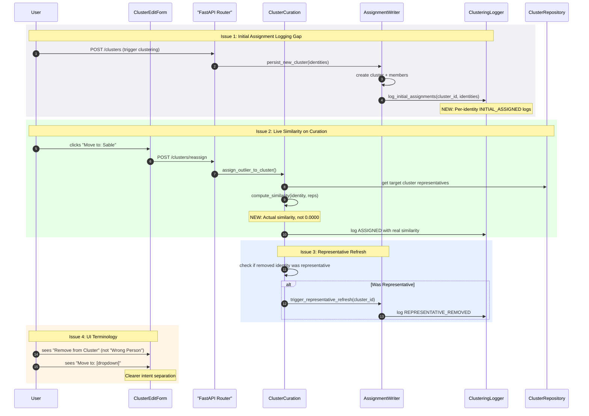

# Curation Logging & Recompute Implementation Plan (v4.10.2)

## Problem Statement

User curation events ("Wrong Person", reassign, rename) lack complete audit trails and don't trigger necessary recomputations. This leads to:

1. **Incomplete logging**: Initial cluster assignments via `persist_new_cluster` don't log per-identity details
2. **Stale similarity values**: Curation logs `similarity=0.0000` instead of computing actual embedding similarity
3. **Missing recomputation**: Representative refresh not triggered when curated identity was a representative
4. **Confusing UI terminology**: "Wrong Person" conflates removal with reassignment

---

## Architecture



---

## Root Cause Analysis

| Issue                                   | Current Behavior                                                | Root Cause                                                          | Impact                                           |
| --------------------------------------- | --------------------------------------------------------------- | ------------------------------------------------------------------- | ------------------------------------------------ |
| No per-identity initial assignment logs | `new_cluster` logs only `media_ids=[6653, 6643]`                | `persist_new_cluster` doesn't call logger for individual identities | Cannot trace when identity first entered cluster |
| `similarity=0.0000` in curation logs    | `assign_outlier_to_cluster` passes `similarity` param (often 0) | No embedding lookup at curation time                                | False metrics, no similarity audit trail         |
| Stale representatives after removal     | Identity removed but representative table unchanged             | `remove_identity_from_cluster` doesn't check representative status  | Cluster may keep poor representative embeddings  |
| "Wrong Person" ambiguity                | Single button for remove + block                                | UI design, not backend                                              | User confusion about intent                      |

---

## Files to Touch

### Backend (Python)

| File                                                                                                                         | Changes                                                                                                               |
| ---------------------------------------------------------------------------------------------------------------------------- | --------------------------------------------------------------------------------------------------------------------- |
| [assignment_writer.py](../../../../apps/prototype-description-service/recognition/application/persistence/assignment_writer.py) | Add `log_initial_assignments()` call in `persist_new_cluster`                                                         |
| `cluster_curation.py` (historical module; now split across orchestration services) | Compute live similarity in `assign_outlier_to_cluster`; check representative status in `remove_identity_from_cluster` |
| [logging.py](../../../../apps/prototype-description-service/recognition/observability/logging.py)                               | Add `log_initial_assignment()` method to `ClusteringLogger`                                                           |
| [clusters.py router](../../../../apps/prototype-description-service/recognition/interface_adapters/http/routers/clusters.py)    | Pass embedding data to curation functions                                                                             |

### Frontend (TypeScript)

| File                                                                                                                                 | Changes                                       |
| ------------------------------------------------------------------------------------------------------------------------------------ | --------------------------------------------- |
| [IdentityClusterItem.tsx](../../../../apps/prototype-wp-alt-context/js/admin/pages/workbench/identity-clusters/IdentityClusterItem.tsx) | Rename "Wrong Person" → "Remove from Cluster" |
| [useClusterMutations.ts](../../../../apps/prototype-wp-alt-context/js/admin/pages/workbench/identity-clusters/useClusterMutations.ts)   | Update mutation labels for clarity            |

### Tests

| File                                                                                                                             | Changes                                                    |
| -------------------------------------------------------------------------------------------------------------------------------- | ---------------------------------------------------------- |
| [test_assignment_writer.py](../../../../apps/prototype-description-service/recognition/tests/integration/test_assignment_writer.py) | Test `log_initial_assignments` is called                   |
| [test_curation_logic.py](../../../../apps/prototype-description-service/recognition/tests/integration/test_curation_logic.py)       | Test similarity computed, representative refresh triggered |
| `test_logging.py` (historical test module; coverage moved into newer observability tests)                                        | Test new log format                                        |

---

## Implementation Steps

### Phase 0: Scaffolding (MANDATORY per instructions.md)

Add function signatures with docstrings before implementation:

```python
# recognition/observability/logging.py
class ClusteringLogger:
    def log_initial_assignment(
        self,
        *,
        identity_id: str,
        media_id: int,
        cluster_id: str,
        similarity: float,
        algorithm: str,
        tenant_id: str,
    ) -> None:
        """Log when an identity is first assigned to a newly created cluster.

        This fills the logging gap where `persist_new_cluster` creates clusters
        but doesn't emit per-identity assignment logs like the gate does for
        existing clusters.

        Args:
            identity_id: UUID of the identity being assigned
            media_id: WordPress media ID for traceability
            cluster_id: UUID of the newly created cluster
            similarity: Similarity to cluster centroid/seed (1.0 for first member)
            algorithm: Clustering algorithm that created the cluster (e.g., "hdbscan")
            tenant_id: Tenant UUID for multi-tenancy

        Example log output:
            [clustering] INITIAL_ASSIGNED identity=abc123 media_id=6643 cluster=def456
            similarity=1.0000 algorithm=hdbscan tenant_id=xyz789
        """
        raise NotImplementedError("TODO: Emit structured log entry")
```

```python
# recognition/application/orchestration/cluster_curation.py
async def compute_curation_similarity(
    *,
    identity_embedding: np.ndarray,
    target_cluster_id: str,
    session: AsyncSession,
) -> float:
    """Compute similarity between an identity and target cluster representatives.

    Used during manual curation to log accurate similarity values instead of 0.0.

    Args:
        identity_embedding: 512-dim embedding vector of the identity
        target_cluster_id: UUID of the cluster to compare against
        session: Database session for loading representatives

    Returns:
        Maximum cosine similarity to any representative in target cluster.
        Returns 0.0 if cluster has no representatives.

    Raises:
        ValueError: If cluster not found
    """
    raise NotImplementedError("TODO: Load reps, compute max similarity")
```

```python
# recognition/application/orchestration/cluster_curation.py
async def check_and_refresh_representatives(
    *,
    cluster_id: str,
    removed_identity_id: str,
    assignment_writer: AssignmentWriter,
    session: AsyncSession,
) -> bool:
    """Check if removed identity was a representative and trigger refresh if so.

    Args:
        cluster_id: Cluster the identity was removed from
        removed_identity_id: Identity that was removed
        assignment_writer: Writer for representative operations
        session: Database session

    Returns:
        True if representative refresh was triggered, False otherwise.
    """
    raise NotImplementedError("TODO: Check rep table, trigger refresh")
```

### Phase 1: Initial Assignment Logging

**Goal**: Every identity placed in a new cluster gets an explicit log entry.

#### 1.1 Add `log_initial_assignment` to ClusteringLogger

```python
# recognition/observability/logging.py

def log_initial_assignment(
    self,
    *,
    identity_id: str,
    media_id: int,
    cluster_id: str,
    similarity: float,
    algorithm: str,
    tenant_id: str,
) -> None:
    """Log when an identity is first assigned to a newly created cluster."""
    self._logger.info(
        "[clustering] INITIAL_ASSIGNED identity=%s media_id=%s cluster=%s "
        "similarity=%.4f algorithm=%s tenant_id=%s",
        identity_id,
        media_id,
        cluster_id,
        similarity,
        algorithm,
        tenant_id,
    )
```

#### 1.2 Call from `persist_new_cluster`

```python
# recognition/application/persistence/assignment_writer.py

async def persist_new_cluster(
    self,
    *,
    tenant_id: str,
    identities: list[MediaIdentity],
    similarities: list[float],
    algorithm: str = "graph",
    clustering_logger: ClusteringLogger | None = None,  # NEW param
) -> IdentityCluster:
    # ... existing cluster creation logic ...

    # NEW: Log per-identity assignments
    if clustering_logger:
        for identity, similarity in zip(identities, similarities):
            clustering_logger.log_initial_assignment(
                identity_id=identity.id,
                media_id=int(identity.media_id),
                cluster_id=str(cluster.id),
                similarity=similarity,
                algorithm=algorithm,
                tenant_id=tenant_id,
            )

    return cluster
```

### Phase 2: Live Similarity Computation on Curation

**Goal**: `assign_outlier_to_cluster` logs actual embedding similarity.

#### 2.1 Implement `compute_curation_similarity`

```python
# recognition/application/orchestration/cluster_curation.py

async def compute_curation_similarity(
    *,
    identity_embedding: np.ndarray,
    target_cluster_id: str,
    session: AsyncSession,
) -> float:
    """Compute similarity between identity and target cluster representatives."""
    from db.models import ClusterRepresentative as RepModel
    from recognition.application.discovery.representative import compute_similarity

    result = await session.execute(
        select(RepModel).where(RepModel.cluster_id == uuid.UUID(target_cluster_id))
    )
    reps = result.scalars().all()

    if not reps:
        return 0.0

    max_sim = 0.0
    for rep in reps:
        rep_embedding = np.asarray(rep.embedding, dtype=np.float32)
        sim = compute_similarity(identity_embedding, rep_embedding)
        max_sim = max(max_sim, sim)

    return float(max_sim)
```

#### 2.2 Use in `assign_outlier_to_cluster`

```python
# recognition/application/orchestration/cluster_curation.py

async def assign_outlier_to_cluster(
    *,
    identity_id: str,
    target_cluster_id: str,
    tenant_id: str,
    similarity: float,  # Keep for backward compat, but recompute if 0
    session: AsyncSession | None,
    assignment_writer: AssignmentWriter,
    suggestion_service: SuggestionServiceProtocol | None = None,
) -> IdentityCluster | None:
    # ... existing validation ...

    # NEW: Compute actual similarity if not provided
    if similarity == 0.0 and identity_model.embedding is not None:
        similarity = await compute_curation_similarity(
            identity_embedding=np.asarray(identity_model.embedding, dtype=np.float32),
            target_cluster_id=target_cluster_id,
            session=session,
        )

    # ... rest of existing logic, now logs real similarity ...
```

### Phase 3: Representative Refresh on Removal

**Goal**: When a removed identity was a representative, trigger re-selection.

#### 3.1 Implement `check_and_refresh_representatives`

```python
# recognition/application/orchestration/cluster_curation.py

async def check_and_refresh_representatives(
    *,
    cluster_id: str,
    removed_identity_id: str,
    assignment_writer: AssignmentWriter,
    session: AsyncSession,
) -> bool:
    """Check if removed identity was a representative and trigger refresh."""
    from db.models import ClusterRepresentative as RepModel

    # Check if identity was a representative
    result = await session.execute(
        select(RepModel).where(
            RepModel.cluster_id == uuid.UUID(cluster_id),
            RepModel.identity_id == uuid.UUID(removed_identity_id),
        )
    )
    rep = result.scalar_one_or_none()

    if rep is None:
        return False

    # Delete the stale representative
    await session.delete(rep)

    # Trigger representative refresh for the cluster
    await assignment_writer.refresh_representatives_for_cluster(cluster_id)

    logger.info(
        "[curation] REPRESENTATIVE_REMOVED identity=%s cluster=%s triggered_refresh=true",
        removed_identity_id,
        cluster_id,
    )
    return True
```

#### 3.2 Call from `remove_identity_from_cluster`

```python
# recognition/application/orchestration/cluster_curation.py

async def remove_identity_from_cluster(
    *,
    identity_id: str,
    member_repo: MemberRepository,
    cluster_repo: ClusterRepository,
    assignment_writer: AssignmentWriter | None = None,
    session: AsyncSession | None = None,  # NEW: needed for rep check
    recompute: bool = True,
    tenant_id_for_logging: str | None = None,
    media_id: int | None = None,
) -> bool:
    # ... existing removal logic ...

    # NEW: Check and refresh representatives
    if session and assignment_writer and cluster_id:
        await check_and_refresh_representatives(
            cluster_id=cluster_id,
            removed_identity_id=identity_id,
            assignment_writer=assignment_writer,
            session=session,
        )

    logger.info(
        "[curation] REMOVED identity=%s media_id=%s from cluster=%s ...",
        # ... existing log ...
    )
    return True
```

### Phase 4: UI Terminology Update

**Goal**: Rename "Wrong Person" to "Remove from Cluster" for clarity.

```tsx
// IdentityClusterItem.tsx

// Before:
<Button variant="destructive" onClick={handleWrongPerson}>
  Wrong Person
</Button>

// After:
<Button variant="outline" onClick={handleRemoveFromCluster}>
  Remove from Cluster
</Button>

// Keep the "Move to" dropdown separate and clear:
<DropdownMenu>
  <DropdownMenuTrigger asChild>
    <Button variant="outline">Move to...</Button>
  </DropdownMenuTrigger>
  <DropdownMenuContent>
    {suggestions.map((s) => (
      <DropdownMenuItem key={s.cluster_id} onClick={() => handleMoveTo(s)}>
        {s.label} {s.similarity && `(${Math.round(s.similarity * 100)}%)`}
      </DropdownMenuItem>
    ))}
  </DropdownMenuContent>
</DropdownMenu>
```

---

## Implementation Checklist

### Phase 0: Scaffolding

- [x] Add `log_initial_assignment` signature to `ClusteringLogger`
- [x] Add `compute_curation_similarity` signature to `cluster_curation.py`
- [x] Add `check_and_refresh_representatives` signature to `cluster_curation.py`
- [x] Add `refresh_representatives_for_cluster` signature to `AssignmentWriter`
- [x] Commit scaffolding

### Phase 1: Initial Assignment Logging

- [x] Write failing test: `test_persist_new_cluster_logs_per_identity`
- [x] Implement `log_initial_assignment` in `ClusteringLogger`
- [x] Add `clustering_logger` param to `persist_new_cluster`
- [x] Pass logger from `incremental_clustering.py` callers
- [x] Verify logs in test run
- [x] Commit

### Phase 2: Live Similarity Computation

- [x] Write failing test: `test_assign_outlier_computes_real_similarity`
- [x] Implement `compute_curation_similarity`
- [x] Update `assign_outlier_to_cluster` to call it
- [x] Verify log shows non-zero similarity
- [x] Commit

### Phase 3: Representative Refresh

- [x] Write failing test: `test_remove_representative_triggers_refresh`
- [x] Implement `check_and_refresh_representatives`
- [x] Implement `refresh_representatives_for_cluster` in `AssignmentWriter`
- [x] Update `remove_identity_from_cluster` to call check
  > ✅ `remove_identity_from_cluster` now calls `check_and_refresh_representatives` with session/logger. The `refresh` param controls whether re presentation refresh is triggered (`recompute=True`) or only logging occurs (`recompute=False`, used by `reassign_identity`).
- [x] Wire `ClusterService.remove_identity_from_cluster` to forward `session` + logger
  > ✅ `ClusterService.remove_identity_from_cluster` (lines 272-297) correctly passes `self._session` and `self.logger` to the orchestration function.
- [x] Verify `REPRESENTATIVE_REMOVED` log appears
  > ✅ Test coverage: `test_remove_representative_triggers_refresh` (recompute=True, triggered_refresh=true) and `test_remove_representative_deferred_recompute` (recompute=False, triggered_refresh=false).
- [x] Commit

### Phase 4: UI Terminology

- [x] Update button labels in `IdentityClusterItem.tsx`
- [x] Update any related test assertions
- [x] Commit

### Phase 5: Verification

- [ ] Reset dev database
- [ ] Run clustering on test images
- [ ] Verify `INITIAL_ASSIGNED` logs appear for new clusters
- [ ] Perform manual curation, verify similarity is non-zero
- [ ] Remove a representative, verify `REPRESENTATIVE_REMOVED` log
- [ ] Confirm UI shows "Remove from Cluster" label

---

## Testing Strategy

### Unit Tests (Layer 1)

```python
# tests/unit/test_logging.py
def test_log_initial_assignment_format():
    """Verify log message format matches expected pattern."""
    logger = ClusteringLogger(algorithm="test")
    with capture_logs() as logs:
        logger.log_initial_assignment(
            identity_id="abc123",
            media_id=6643,
            cluster_id="def456",
            similarity=0.92,
            algorithm="hdbscan",
            tenant_id="xyz789",
        )
    assert "[clustering] INITIAL_ASSIGNED" in logs[0]
    assert "similarity=0.9200" in logs[0]
```

### Integration Tests (Layer 3)

```python
# tests/integration/test_curation_logic.py
@pytest.mark.asyncio
async def test_assign_outlier_computes_real_similarity(db_session, tenant):
    """Verify curation computes actual embedding similarity."""
    # Setup: create cluster with representative
    cluster = await create_test_cluster_with_rep(db_session, tenant)
    identity = await create_test_identity(db_session, tenant)

    # Act: assign outlier
    with capture_logs() as logs:
        await assign_outlier_to_cluster(
            identity_id=str(identity.id),
            target_cluster_id=str(cluster.id),
            tenant_id=str(tenant.id),
            similarity=0.0,  # Explicitly pass 0 to test recomputation
            session=db_session,
            assignment_writer=writer,
        )

    # Assert: log shows non-zero similarity
    assigned_log = next(l for l in logs if "ASSIGNED" in l)
    assert "similarity=0.0000" not in assigned_log
```

```python
# tests/integration/test_curation_logic.py
@pytest.mark.asyncio
async def test_remove_representative_triggers_refresh(db_session, tenant):
    """Verify removing a representative identity triggers refresh."""
    # Setup: create cluster where identity IS a representative
    cluster, rep_identity = await create_cluster_with_representative(db_session, tenant)

    # Act: remove the representative identity
    with capture_logs() as logs:
        await remove_identity_from_cluster(
            identity_id=str(rep_identity.id),
            member_repo=member_repo,
            cluster_repo=cluster_repo,
            assignment_writer=writer,
            session=db_session,
        )

    # Assert: refresh was triggered
    assert any("REPRESENTATIVE_REMOVED" in l for l in logs)
    assert any("triggered_refresh=true" in l for l in logs)
```

---

## Success Criteria

1. **Logs complete**: Every identity in a new cluster has an `INITIAL_ASSIGNED` log entry
2. **Similarity accurate**: Curation logs show non-zero similarity when target cluster has representatives
3. **Representatives fresh**: Removing a representative triggers re-selection
4. **UI clear**: "Remove from Cluster" clearly separates from "Move to" action
5. **All tests pass**: Unit + integration tests verify behavior
6. **No regressions**: Existing curation flows continue to work

---

## References

- [identity-cluster-suggestions-plan.md](../4.10.1/identity-cluster-suggestions-plan.md) — Related UX improvements
- [instructions.md](../../../agentic/instructions.md) — Development workflow and standards
- [ADR-001-face-identity-nomenclature.md](../../../adrs/ADR-001-face-identity-nomenclature.md) — Domain terminology
