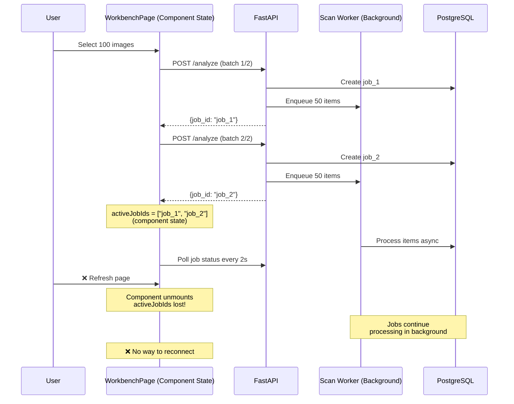
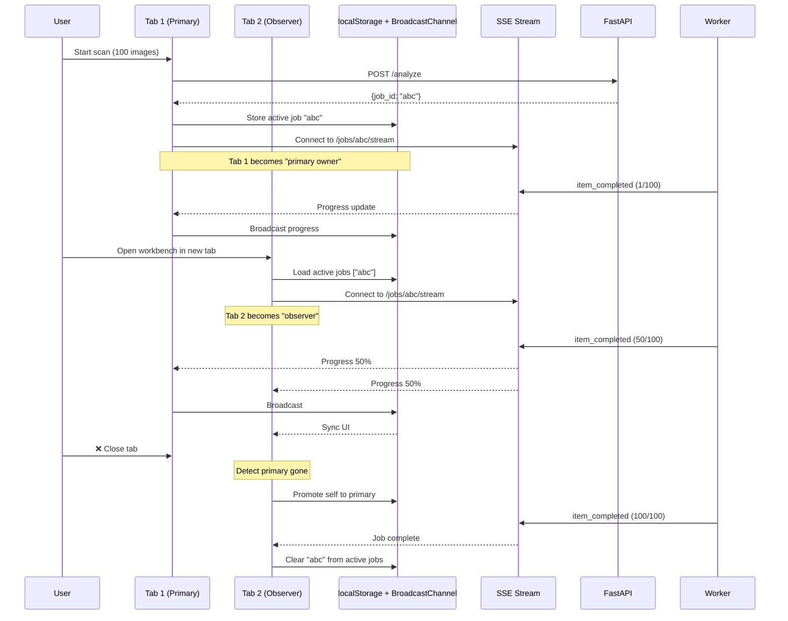

# Batch Processing Resilience & Progress Tracking (v4.10.3)

## Executive Summary

This plan addresses 6 critical UI issues with batch image processing and proposes a 5-phase implementation using SSE, BroadcastChannel, and localStorage.

**Key decisions:**
- ✅ SSE for real-time progress (not WebSocket)
- ✅ localStorage for job persistence (not IndexedDB)
- ✅ BroadcastChannel for multi-tab coordination
- ✅ 500ms event batching, tenant_id filtering, resume from current state

---

## Problem Statement & Root Causes

### Issue #1: Progress Bar Shows Incorrect State

**Symptom**: Progress bar displays "completed" when batch was aborted midway

**Root cause**: Progress state not persisted; calculated from ephemeral job-level aggregates

**Impact**: User cannot distinguish between completed vs cancelled jobs

### Issue #2: Progress Counter Inaccurate

**Symptom**: Counter jumps 0→99 in seconds, stalls at 99 for minutes

**Root cause** ([WorkbenchPage.tsx:208-225](file:///Users/daniel/Development/context-alt-text-monorepo/apps/prototype-wp-alt-context/js/admin/pages/WorkbenchPage.tsx#L208-L225)):
- Frontend polls job status every 2s
- Backend updates progress only on batch completion
- Individual item completions not streamed

**Current implementation**:
```typescript
const scanProgress = useMemo(() => {
  const totals = multiScanStatus.reduce((acc, query) => {
    acc.completed += progress.completed ?? 0;  // ← Naive sum
    acc.total += progress.total ?? 0;
    return acc;
  }, { completed: 0, total: 0 });
  return totals.total > 0 ? totals : null;
}, [multiScanStatus]);
```

**Impact**: User sees frozen UI during clustering phase, assumes system hung

### Issue #3: Page Reload Kills Job

**Symptom**: Refreshing browser tab cancels batch processing

**Root cause** ([WorkbenchPage.tsx:90](file:///Users/daniel/Development/context-alt-text-monorepo/apps/prototype-wp-alt-context/js/admin/pages/WorkbenchPage.tsx#L90)):
```typescript
const [activeJobIds, setActiveJobIds] = useState<string[]>([]);
```

Job IDs stored in component state disappear on unmount. Backend worker continues, but UI lost track.

**Impact**: Users afraid to navigate away during long-running jobs

### Issue #4: Cluster Labels Lost on Abort

**Symptom**: After canceling batch, all clusters become "Unlabeled identity"

**Root cause**: Unknown - requires diagnostic logging

**Current logging gap**:
- ❌ No "cancel" events in logs
- ❌ No cluster label mutation tracking
- ❌ No transaction boundary markers

**Hypothesis**: Transaction rollback during cancel may clear labels without restoring previous values

**Impact**: Users lose manual labeling work when aborting scans

### Issue #5: Progress Doesn't Reflect Clustering Time

**Symptom**: Progress bar disappears during clustering, UI appears frozen

**Root cause** ([WorkbenchPage:263](file:///Users/daniel/Development/context-alt-text-monorepo/apps/prototype-wp-alt-context/js/admin/pages/WorkbenchPage.tsx#L263)):
```typescript
clusterMutation.mutate(); // ← Blocks with no progress
```

Clustering runs synchronously (100+ identities) with no granular updates.

**Impact**: Users assume app crashed during clustering phase

### Issue #6: No Atomic Status Per Image

**Symptom**: Cannot see which specific images succeeded/failed

**Root cause**: Job-level progress only, no item-level visibility

**Impact**: Cannot debug partial batch failures

---

## Architecture Overview

### Current (Broken) Flow



### Proposed (Resilient) Flow



---

## Solution: 5-Phase Implementation

### Phase 0: Scaffolding (MANDATORY)

**Goal**: Define contracts for Phase 1 components.

#### 1. Scaffold `hooks/useJobPersistence.ts`
- Use `NotImplementedError` or empty implementations.

#### 2. Update `WorkbenchPage.tsx` signatures
- Prepare hook integration points.

### Phase 1: Job Persistence (Fixes Issue #3)

**Goal**: Reconnect to active jobs after page refresh

**Backend**: No changes required

**Frontend**:

#### 1.1 Create `hooks/useJobPersistence.ts`

```typescript
const STORAGE_KEY = 'acx_active_jobs';
const MAX_AGE_MS = 3600000; // 1 hour

interface PersistedJob {
  id: string;
  startedAt: number;
  totalItems: number;
}

export const useJobPersistence = () => {
  const [activeJobs, setActiveJobs] = useState<PersistedJob[]>(() => {
    const stored = localStorage.getItem(STORAGE_KEY);
    if (!stored) return [];
    
    const jobs: PersistedJob[] = JSON.parse(stored);
    const now = Date.now();
    
    // Purge stale jobs (>1 hour old)
    return jobs.filter(job => now - job.startedAt < MAX_AGE_MS);
  });
  
  useEffect(() => {
    localStorage.setItem(STORAGE_KEY, JSON.stringify(activeJobs));
  }, [activeJobs]);
  
  const addJob = (id: string, totalItems: number) => {
    setActiveJobs(prev => [...prev, { id, startedAt: Date.now(), totalItems }]);
  };
  
  const removeJob = (id: string) => {
    setActiveJobs(prev => prev.filter(job => job.id !== id));
  };
  
  return { activeJobs, addJob, removeJob };
};
```

#### 1.2 Update `WorkbenchPage.tsx`

```diff
- const [activeJobIds, setActiveJobIds] = useState<string[]>([]);
+ const { activeJobs, addJob, removeJob } = useJobPersistence();
+ const activeJobIds = activeJobs.map(j => j.id);

  onSuccess: (data) => {
    const jobIds = data.map((job) => job.id).filter((id): id is string => Boolean(id));
    if (jobIds.length > 0) {
-     setActiveJobIds(jobIds);
+     jobIds.forEach(id => addJob(id, data[0].progress?.total ?? 0));
    }
  }
```

### Phase 2: Real-Time Progress via SSE (Fixes Issues #1, #2, #6)

**Goal**: Stream item-level progress instead of polling

#### 2.1 Backend: Add SSE Endpoint

```python
# recognition/interface_adapters/http/routers/jobs.py

from sse_starlette.sse import EventSourceResponse

@router.get("/jobs/{job_id}/stream")
async def stream_job_progress(
    job_id: str,
    tenant_id: Annotated[str, Header(alias="X-Tenant-ID")],
    job_repo: Annotated[ScanQueueRepository, Depends(get_scan_queue_repo)],
) -> EventSourceResponse:
    """Stream real-time job progress via SSE."""
    
    async def event_generator():
        last_completed = 0
        event_batch = []
        last_emit = time.time()
        
        while True:
            job = await job_repo.get_job(
                uuid.UUID(job_id),
                tenant_id=uuid.UUID(tenant_id)  # ← Tenant filtering
            )
            if not job:
                break
            
            current_completed = job.progress.completed
            
            # Batch events into 500ms windows
            if current_completed > last_completed:
                event_batch.append({
                    "completed": current_completed,
                    "total": job.progress.total,
                    "status": job.status
                })
                last_completed = current_completed
            
            now = time.time()
            if event_batch and (now - last_emit >= 0.5):
                yield {
                    "event": "progress",
                    "data": json.dumps(event_batch[-1])  # Send latest
                }
                event_batch.clear()
                last_emit = now
            
            if job.status in ('completed', 'failed'):
                yield {
                    "event": "done",
                    "data": json.dumps({"status": job.status})
                }
                break
            
            await asyncio.sleep(0.1)  # Poll DB every 100ms
    
    return EventSourceResponse(event_generator())
```

#### 2.2 Backend: Emit Progress from Worker

```python
# recognition/worker/scan_worker.py

async def process_item(item: ScanQueueItem, ...):
    # ... process identity ...
    
    await queue_repo.mark_item_completed(item.id, identities_detected=len(identities))
    await queue_service.refresh_job_progress(job_id=item.job_id)
    
    # SSE endpoint polls DB and streams updated progress
```

#### 2.3 Frontend: Create `hooks/useJobProgressStream.ts`

```typescript
export const useJobProgressStream = (jobId: string | null) => {
  const [progress, setProgress] = useState<JobProgress | null>(null);
  const [status, setStatus] = useState<JobStatus>('pending');
  const [isOnline, setIsOnline] = useState(navigator.onLine);
  
  useEffect(() => {
    const handleOnline = () => setIsOnline(true);
    const handleOffline = () => setIsOnline(false);
    
    window.addEventListener('online', handleOnline);
    window.addEventListener('offline', handleOffline);
    
    return () => {
      window.removeEventListener('online', handleOnline);
      window.removeEventListener('offline', handleOffline);
    };
  }, []);
  
  useEffect(() => {
    if (!jobId || !isOnline) return;
    
    const eventSource = new EventSource(`${API_BASE}/jobs/${jobId}/stream`);
    
    eventSource.addEventListener('progress', (e) => {
      const data = JSON.parse(e.data);
      setProgress({ completed: data.completed, total: data.total });
      setStatus(data.status);
    });
    
    eventSource.addEventListener('done', (e) => {
      const data = JSON.parse(e.data);
      setStatus(data.status);
      eventSource.close();
    });
    
    eventSource.onerror = () => {
      // EventSource auto-reconnects on error
      console.warn('SSE connection lost, reconnecting...');
    };
    
    return () => eventSource.close();
  }, [jobId, isOnline]);
  
  return { progress, status, isOnline };
};
```

### Phase 3: Clustering Progress (Fixes Issue #5)

#### 3.1 Backend: Instrument Clustering

```python
# recognition/application/orchestration/incremental_clustering.py

async def cluster_unclustered_identities(
    ...,
    progress_callback: Callable[[int, int], Awaitable[None]] | None = None,
):
    unclustered = await get_unclustered_identities(...)
    total = len(unclustered)
    
    for i, chunk in enumerate(chunks):
        # ... process chunk ...
        if progress_callback:
            await progress_callback(completed=i * chunk_size, total=total)
    
    if progress_callback:
        await progress_callback(completed=total, total=total)
```

#### 3.2 Frontend: Show Clustering Phase

```tsx
// Panels.tsx
{status === 'clustering' && (
  <div className="acx-clustering-progress">
    <span>Clustering {progress.completed}/{progress.total} identities...</span>
    <progress value={progress.completed} max={progress.total} />
  </div>
)}
```

### Phase 4: Cluster Label Integrity (Fixes Issue #4)

> [!IMPORTANT]
> **Root Cause Confirmed**: When a media item is re-scanned, `ScanService.process_media_item` deletes all existing `MediaIdentity` rows and recreates them with **new UUIDs**. Because `IdentityMember.identity_id` has `ondelete="CASCADE"`, this triggers automatic deletion of any cluster memberships—**wiping the link between the image and its labeled cluster**.

#### 4.0 Root Cause Analysis

```
                   ┌─────────────────────────────┐
                   │     IdentityCluster         │
                   │  id=aaa, label="Tory"       │
                   └─────────────┬───────────────┘
                                 │ FK (cluster_id)
                   ┌─────────────▼───────────────┐
                   │       IdentityMember        │
                   │  cluster_id=aaa             │
                   │  identity_id=bbb  ◄─────────┼──── CASCADE DELETE
                   └─────────────┬───────────────┘     when bbb deleted!
                                 │ FK (identity_id)
                   ┌─────────────▼───────────────┐
                   │       MediaIdentity         │
                   │  id=bbb                     │◄─── DELETE + INSERT
                   │  media_id=12345             │     (new id=ccc)
                   └─────────────────────────────┘
```

**Cascade Flow**:
1. User labels cluster with identity `bbb` → membership row created
2. User initiates re-scan of `media_id=12345`
3. `ScanService.process_media_item` executes `DELETE FROM media_identities WHERE media_id=12345`
4. PostgreSQL cascades: `DELETE FROM identity_members WHERE identity_id=bbb`
5. New identity `ccc` is inserted (unclustered)
6. Label "Tory" is now on an **empty cluster** (no members)

#### 4.1 Fix: Identity ID Recycling

**Goal**: Preserve `MediaIdentity.id` (and thus memberships) during re-scans.

```python
# recognition/application/scan/service.py

async def process_media_item(self, *, tenant_id: str, media_id: int, media_url: str) -> int:
    tenant_uuid = uuid.UUID(str(tenant_id))
    
    # 1. Fetch existing identities for this media
    existing = await self._get_existing_identities(tenant_uuid, media_id)
    
    # 2. Detect faces
    detections = await self._detector.detect([media_url])
    # ... generate embeddings ...
    
    # 3. Match detections to existing identities via BBOX IOU
    matched, unmatched_new, orphaned_old = self._match_by_bbox(existing, detections)
    
    # 4. UPDATE matched (preserves UUID → preserves membership)
    for old_identity, new_detection in matched:
        await self._update_identity(old_identity.id, new_detection)
    
    # 5. INSERT unmatched new detections
    for detection in unmatched_new:
        await self._insert_identity(tenant_uuid, media_id, detection)
    
    # 6. DELETE orphaned (face no longer detected)
    for orphan in orphaned_old:
        await self._session.execute(
            delete(MediaIdentity).where(MediaIdentity.id == orphan.id)
        )
    
    return len(matched) + len(unmatched_new)

def _match_by_bbox(self, existing, detections, iou_threshold=0.5):
    """Match new detections to existing identities using bounding box IOU."""
    matched = []
    unmatched_new = list(detections)
    orphaned_old = list(existing)
    
    for old in existing:
        best_iou, best_det = 0, None
        for det in unmatched_new:
            iou = self._compute_iou(old.bbox, det.bbox)
            if iou > best_iou:
                best_iou, best_det = iou, det
        
        if best_iou >= iou_threshold and best_det:
            matched.append((old, best_det))
            unmatched_new.remove(best_det)
            orphaned_old.remove(old)
    
    return matched, unmatched_new, orphaned_old
```

#### 4.2 Diagnostic Logging (Already Implemented)

```python
# recognition/application/scan/scan_queue_service.py
logger.info(f"[cancel] START job_id={job_id}")
logger.info(f"[cancel] CANCELLED_ITEMS job_id={job_id} count={cancelled}")
logger.info(f"[cancel] COMPLETE job_id={job_id}")

# recognition/infrastructure/repositories/cluster_repository.py
logger.info(f"[cluster_repo] UPDATE id={cluster.id} label='{cluster.label}'")
logger.info(f"[cluster_repo] LABEL_CHANGE id={cluster.id} from='{old}' to='{new}'")
```

#### 4.3 Integration Test

```python
# recognition/tests/integration/test_cancel_labels.py

async def test_rescan_preserves_cluster_membership(db_session, tenant):
    # 1. Create identity + labeled cluster + membership
    # 2. Re-scan the same media_id
    # 3. Assert: membership still exists (same cluster)
    # 4. Assert: cluster label unchanged
```


### Phase 5: Multi-Tab Coordination

**Goal**: Single SSE connection per job across tabs

#### 5.1 Create `hooks/useJobCoordination.ts`

```typescript
const JOB_CHANNEL = 'acx_job_coordination';

export const useJobCoordination = (jobId: string) => {
  const [isPrimary, setIsPrimary] = useState(false);
  const channelRef = useRef<BroadcastChannel | null>(null);
  
  useEffect(() => {
    const channel = new BroadcastChannel(JOB_CHANNEL);
    channelRef.current = channel;
    
    // Announce presence
    channel.postMessage({ type: 'tab_opened', jobId, tabId: crypto.randomUUID() });
    
    // Listen for primary handoff
    channel.onmessage = (event) => {
      if (event.data.type === 'primary_closing' && event.data.jobId === jobId) {
        setIsPrimary(true);
      }
    };
    
    return () => {
      if (isPrimary) {
        channel.postMessage({ type: 'primary_closing', jobId });
      }
      channel.close();
    };
  }, [jobId]);
  
  return { isPrimary };
};
```

---

## Implementation Checklist

### Phase 1: Job Persistence (🎯 Critical) ✅ COMPLETE

- [x] Create `hooks/useJobPersistence.ts`
  - [x] Load from localStorage on mount
  - [x] Persist job IDs + metadata
  - [x] Purge stale jobs (>1 hour)
- [x] Update `WorkbenchPage.tsx` to use persisted jobs
- [x] Test: reload page → verify UI reconnects

### Phase 2: Real-Time Progress (🎯 High) ✅ COMPLETE

- [x] **Backend**:
  - [x] Add `sse-starlette` dependency
  - [x] Create `GET /recognition/jobs/{id}/stream` endpoint
  - [x] Add tenant_id filtering (via job repo)
  - [x] Implement 500ms event batching
- [x] **Frontend**:
  - [x] Create `hooks/useJobProgressStream.ts`
  - [x] Replace polling with SSE
  - [x] Add offline detection
  - [x] Show reconnection status (via `!isOnline` banner)

### Phase 3: Clustering Progress (🎯 Medium) ✅ COMPLETE

- [x] Instrument `cluster_unclustered_identities` with callback
- [x] Wire callback to SSE stream via `ScanWorker`
- [x] Update UI to show clustering progress bar (`ConfirmPanel`)
- [x] Implement 500ms event batching
- [x] Implement status labels ("Clustering X/Y")
- [x] Add ETA calculation

### Phase 4: Label Integrity (🎯 High) ✅ COMPLETE

> **Root Cause Confirmed**: `MediaIdentity` deletion triggers cascade deletion of `IdentityMember` rows, wiping cluster memberships.

- [x] Add cancel flow logging (3 statements)
- [x] Add cluster update logging (1 statement)
- [x] Write integration test (`test_cancel_labels.py`)
- [x] Reproduce issue (confirmed in test)
- [x] Implement Identity ID Recycling in `ScanService.process_media_item`
- [x] Verify fix with integration test
- [ ] Manual verification in Workbench UI (pending browser access)

### Phase 5: Multi-Tab (🎯 Low) ✅ COMPLETE

- [x] Create `hooks/useJobCoordination.ts`
- [x] Implement primary/secondary roles (BroadcastChannel)
- [x] Coordinate SSE connection
- [x] Add handoff logic (on primary close)
- [x] Show "Synced" indicator

---

## Acceptance Criteria

- [x] Page refresh → job continues, UI reconnects <2s
- [x] Progress updates every 500ms (smooth, not jumps)
- [x] Clustering phase visible with progress
- [x] Cancel scan → cluster labels intact
- [x] Offline → show banner, resume on reconnect
- [x] Multi-tab → single SSE, synced UI
- [x] Stale jobs auto-purge

---

## Technical Decisions: Finalized

### Push Protocol: SSE

✅ **Decision**: Use Server-Sent Events
- Auto-reconnect built-in (EventSource API)
- Standard HTTP (firewall-friendly)
- Sufficient for one-way updates
- ❌ WebSocket only needed for bidirectional commands

### Multi-Tab: BroadcastChannel

✅ **Decision**: Use BroadcastChannel API
- Simpler than SharedWorker
- Single SSE per job (not per tab)
- Primary/secondary coordination

### Persistence: localStorage

✅ **Decision**: Use localStorage (not IndexedDB)
- Synchronous API (simpler mount hydration)
- Sufficient for job IDs (<5MB)
- ❌ IndexedDB overkill

### SSE Implementation

1. **Tenant isolation**: ✅ `WHERE tenant_id = ?` in queries
2. **Event throttling**: ✅ 500ms batching
3. **Offline retry**: ✅ Resume from current state

---

## References

- [MDN: Server-Sent Events](https://developer.mozilla.org/en-US/docs/Web/API/Server-sent_events)
- [MDN: BroadcastChannel API](https://developer.mozilla.org/en-US/docs/Web/API/BroadcastChannel)
- [sse-starlette](https://github.com/sysid/sse-starlette)
- [WCAG 2.1 Contrast Guidelines](https://www.w3.org/WAI/WCAG21/Understanding/contrast-minimum.html)
