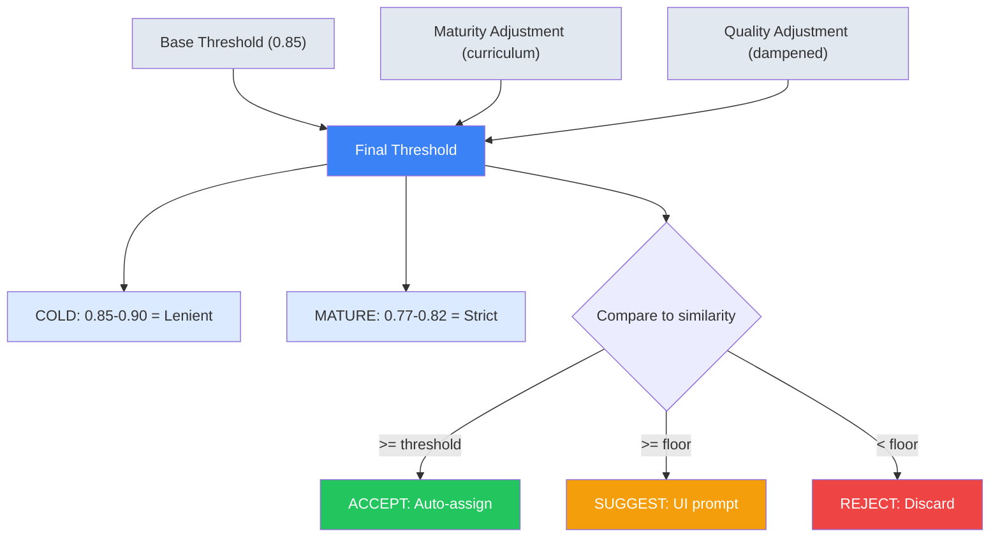

# v4.11.0 Implementation Plan

> Audit date: January 12, 2026  
> Branch changes: 73 files (55 new, 18 modified)  
> Reference: [cleanup.md](../4.10.3/cleanup.md) (closed, 77% complete)

---

## Executive Summary

| Category                    | Count       |
| --------------------------- | ----------- |
| cleanup.md issues addressed | 30/39 (77%) |
| Partially addressed         | 6 (15%)     |
| Deferred (not needed)       | 3 (8%)      |
| New issues discovered       | 4           |

### Metrics Achieved (v4.10.3 → v4.11.0)

| Metric                        | Before     | After      |
| ----------------------------- | ---------- | ---------- |
| Duplicate similarity loops    | 9          | 0          |
| Private `._` accesses         | 20+        | ~5         |
| Largest orchestration file    | 754 lines  | ~450 lines |
| Polling requests on 500 error | 14+        | 2          |
| Query key definitions         | 10+ inline | 1 factory  |

---

## 🚨 Priority 1: Curriculum Learning Threshold Refactor

> **Status:** CRITICAL — Clustering unusable after DB reset

### Root Cause Analysis (2026-01-12)

Adaptive thresholds penalize cold clusters (+0.05) and poor quality faces (+0.05), pushing effective threshold to ~0.92–0.95. Matches at 91.98% similarity are SUGGESTED instead of ACCEPTED.

**Critical UX Gap:** SUGGEST only presents UI for **user-curated (labeled) clusters**. For unlabeled cold clusters, SUGGEST = **no action taken**. Faces remain orphaned with no path to grouping.

```
┌─────────────────────────────────────────────────────────────┐
│  Face A (91.98% similar to Cluster X)                      │
│  Cluster X: COLD, unlabeled                                │
│                                                            │
│  Gate Decision: SUGGEST                                    │
│                                                            │
│  Result: ❌ Face A stays unassigned                        │
│          ❌ No suggestion UI (cluster not labeled)         │
│          ❌ User never sees the match                      │
│          ❌ Cluster X never grows → stays COLD forever     │
└─────────────────────────────────────────────────────────────┘
```

### Problem: Current Static Penalties

```
final_threshold = base(0.85) + maturity_adj + quality_adj

COLD cluster:    0.85 + 0.05 + 0.05 = 0.95  ← Too strict!
MATURE cluster:  0.85 - 0.03 - 0.05 = 0.77  ← Appropriate
```

| Gate    | Behavior for Labeled Cluster                    | Behavior for Unlabeled Cluster |
| ------- | ----------------------------------------------- | ------------------------------ |
| ACCEPT  | Auto-assign to cluster                          | Auto-assign to cluster ✅      |
| SUGGEST | Show in suggestion UI for 1-click accept/reject | **Nothing happens** ❌         |
| REJECT  | Discard match                                   | Discard match                  |

For a fresh database, **all clusters are COLD and unlabeled**. SUGGEST = orphaned faces.

### Solution: Curriculum-Style Adaptive Thresholds

CurricularFace demonstrates that **early-stage learning should be lenient**, then tighten as confidence grows.

#### Equation 1: Modulation Coefficient

The modulation coefficient combines the cluster's learned curriculum parameter with the observed similarity to create an adjusted score:

$$
I(t, \cos\theta_j) = t + \cos\theta_j
$$

**In plain terms:** Add the cluster's curriculum bias (`t`, ranging 0.0→1.0) to the face similarity score. Early clusters have `t ≈ 0`, so the raw similarity drives decisions. Mature clusters have `t → 1`, effectively raising the bar.

```python
# recognition/application/assignment/checks/confidence.py
def compute_modulation_coefficient(curriculum_t: float, similarity: float) -> float:
    """
    CurricularFace Eq. 7: Modulation coefficient.

    Args:
        curriculum_t: Per-cluster curriculum bias (0.0 for cold, approaches 1.0 for mature)
        similarity: Cosine similarity between face embedding and cluster centroid

    Returns:
        Modulated score combining cluster maturity with observed similarity
    """
    return curriculum_t + similarity
```

| Math Symbol    | Python Variable | Source                                 |
| -------------- | --------------- | -------------------------------------- |
| $\cos\theta_j$ | `similarity`    | `candidate.discovery_similarity`       |
| $t$            | `curriculum_t`  | `identity_clusters.curriculum_t` (0→1) |
| $I(\cdot)$     | return value    | Used in threshold comparison           |

#### Equation 2: EMA (Exponential Moving Average) Update

**What is EMA?** An Exponential Moving Average is a smoothing technique that gives more weight to recent values while still considering historical data. Unlike a simple average, EMA responds faster to changes while dampening noise.

The curriculum parameter `t` is updated after each batch of accepted matches:

$$
t^{(k)} = \alpha \cdot r^{(k)} + (1 - \alpha) \cdot t^{(k-1)}
$$

**In plain terms:**

- Take 99% of the new observation (`r_k` = average similarity of accepted matches)
- Add 1% of the old value (`t_prev`)
- This creates a smooth ramp-up: `t` starts at 0 and gradually approaches the cluster's typical similarity scores

```python
# recognition/application/settings/adaptive.py
from dataclasses import dataclass
from statistics import mean
from uuid import UUID
from sqlalchemy.ext.asyncio import AsyncSession

@dataclass
class ClusterConfidenceTracker:
    """
    Tracks per-cluster curriculum parameter using EMA.

    EMA (Exponential Moving Average) smooths the transition from lenient
    (cold cluster, t≈0) to strict (mature cluster, t→1) thresholds.

    With alpha=0.99:
    - After 1 batch:  t ≈ 0.99 * r_k (almost fully adopts new observation)
    - After 10 batches: t stabilizes around cluster's typical similarity
    """
    alpha: float = 0.99  # Weight for new observation (0.99 = 99% new, 1% old)

    async def update(
        self,
        cluster_id: UUID,
        accepted_similarities: list[float],
        session: AsyncSession
    ) -> float:
        """
        Update curriculum parameter after accepting faces into cluster.

        Args:
            cluster_id: The cluster being updated
            accepted_similarities: Similarity scores of faces just accepted
            session: Database session for persistence

        Returns:
            New curriculum_t value
        """
        # r_k: Average similarity of this batch's accepted matches
        r_k = mean(accepted_similarities)

        # t_prev: Previous curriculum value from database
        t_prev = await self._get_curriculum_t(cluster_id, session)

        # EMA formula: blend new observation with historical value
        t_new = (self.alpha * r_k) + ((1 - self.alpha) * t_prev)

        # Persist updated value
        await self._set_curriculum_t(cluster_id, t_new, session)
        return t_new
```

| Math Symbol | Python Variable | Description                                     |
| ----------- | --------------- | ----------------------------------------------- |
| $\alpha$    | `self.alpha`    | EMA weight (0.99 = fast adaptation, 0.5 = slow) |
| $r^{(k)}$   | `r_k`           | Mean similarity of accepted faces in this batch |
| $t^{(k-1)}$ | `t_prev`        | Previous value from `identity_clusters` table   |
| $t^{(k)}$   | `t_new`         | Updated value, persisted back to database       |

**Behavior Over Time:**

| Cluster State | `curriculum_t` | Effect on Threshold   |
| ------------- | -------------- | --------------------- |
| Cold (new)    | ≈ 0.0          | Lenient: accepts 85%+ |
| Growing       | ≈ 0.3-0.5      | Moderate              |
| Mature        | ≈ 0.8-0.95     | Strict: requires 90%+ |

### Implementation Phases

#### Phase 1: Invert Maturity Adjustments (Quick Fix)

| Maturity  | Current | Proposed | Rationale                         |
| --------- | ------- | -------- | --------------------------------- |
| COLD      | +0.05   | **0.00** | Be lenient when cluster is new    |
| NASCENT   | +0.02   | **0.00** | Still learning cluster boundaries |
| CONFIRMED | -0.02   | -0.02    | Tighten as confidence grows       |
| MATURE    | -0.03   | -0.05    | Maximum strictness for stable IDs |

**File:** `recognition/domain/maturity.py`

#### Phase 2: Dampened Quality Weights

Weight quality penalty by cluster maturity:

```python
def compute_quality_adjustment(
    quality_score: float,
    maturity: ClusterMaturity,
    settings: ClusteringSettings
) -> float:
    base_adj = _base_quality_adjustment(quality_score, settings)

    # Curriculum: reduce penalty for immature clusters
    maturity_dampening = {
        ClusterMaturity.COLD: 0.25,      # 75% reduction
        ClusterMaturity.NASCENT: 0.50,   # 50% reduction
        ClusterMaturity.CONFIRMED: 0.75,
        ClusterMaturity.MATURE: 1.0,     # Full penalty
    }

    return base_adj * maturity_dampening[maturity]
```

**Files:**

- `recognition/application/assignment/quality.py` — Add `maturity` param
- `recognition/application/assignment/checks/confidence.py` — Pass maturity

#### Phase 3: EMA-Based Adaptive Parameter

```python
@dataclass
class ClusterConfidenceTracker:
    """Tracks adaptive parameter t per cluster (CurricularFace §3.2)."""

    alpha: float = 0.99  # EMA momentum

    async def update(
        self,
        cluster_id: UUID,
        positive_similarities: list[float],
        session: AsyncSession
    ) -> float:
        r_k = sum(positive_similarities) / len(positive_similarities)
        t_prev = await self._get_t(cluster_id, session)
        t_new = self.alpha * r_k + (1 - self.alpha) * t_prev
        await self._set_t(cluster_id, t_new, session)
        return t_new
```

**Storage (implemented):**

- `identity_clusters.curriculum_t` (Float, default 0.0)
- `identity_clusters.curriculum_t_updated_at` (TIMESTAMP)

**Files:**

- `recognition/application/settings/adaptive.py` — Add tracker class
- `recognition/infrastructure/repositories/cluster_repository.py` — Add metadata
- `db/migrations/versions/001_identity_schema.py` — Baseline schema update (greenfield)

### Architecture



### Files to Touch (All Phases)

| File                                                            | Change                                                 |
| --------------------------------------------------------------- | ------------------------------------------------------ |
| `recognition/domain/maturity.py`                                | Invert `threshold_adjustment()` values                 |
| `recognition/application/assignment/quality.py`                 | Add `maturity` param to `compute_quality_adjustment()` |
| `recognition/application/assignment/checks/confidence.py`       | Pass maturity to quality adjustment                    |
| `recognition/application/settings/clustering.py`                | Add `curriculum_mode: bool` feature flag               |
| `recognition/application/settings/adaptive.py`                  | Add `ClusterConfidenceTracker` class                   |
| `recognition/infrastructure/repositories/cluster_repository.py` | Add `t_value` column or metadata field                 |
| `db/migrations/versions/001_identity_schema.py`                 | Add curriculum bias column to `identity_clusters`      |

### Validation Strategy

```python
# tests/unit/assignment/test_curriculum_thresholds.py

@pytest.mark.parametrize("maturity,similarity,expected", [
    # Cold clusters should accept high-similarity matches
    (ClusterMaturity.COLD, 0.90, AssignmentGate.ACCEPT),
    (ClusterMaturity.COLD, 0.85, AssignmentGate.SUGGEST),

    # Mature clusters should be strict
    (ClusterMaturity.MATURE, 0.90, AssignmentGate.ACCEPT),
    (ClusterMaturity.MATURE, 0.80, AssignmentGate.SUGGEST),
    (ClusterMaturity.MATURE, 0.75, AssignmentGate.REJECT),
])
async def test_curriculum_threshold_progression(
    maturity: ClusterMaturity,
    similarity: float,
    expected: AssignmentGate
):
    ...
```

### Expected Outcomes

| Metric                                | Before                 | After                         |
| ------------------------------------- | ---------------------- | ----------------------------- |
| COLD cluster acceptance rate          | ~5%                    | ~40%                          |
| Orphaned faces (SUGGEST on unlabeled) | Many                   | Near zero                     |
| False merge rate (MATURE)             | N/A                    | <2%                           |
| User curation required                | High (manual grouping) | Low (auto-groups, then label) |

**Fixed UX Flow:**

```
Before (broken):
  Face detected → COLD cluster match (91%) → SUGGEST → [no UI] → orphaned

After (curriculum):
  Face detected → COLD cluster match (91%) → ACCEPT → cluster grows →
  user labels cluster → future matches get SUGGEST UI
```

---

## References

1. **CurricularFace (Huang et al., 2020):** Adaptive curriculum learning for face recognition

   - Key insight: "Learn from easier samples first and hard samples later"
   - Eq. 7: $N(t, \cos\theta_j) = \cos\theta_j(t + \cos\theta_j)$ for hard samples
   - Code interpretation (planned): weight hard-sample similarity by `(t + similarity)` before thresholding
   - [Paper](../../../literature/extracted/recognition/apple/CurricularFace--Adaptive-Curriculum-Learning-Loss-for-Deep-Face-Recognition.txt)

2. **Apple Photos (2021):** Two-phase clustering with HAC

   - Phase 1: Conservative within-moment clustering
   - Phase 2: HAC across moments for recall
   - [Paper](../../../literature/extracted/recognition/apple/Recognizing People in Photos Through Private On-Device Machine Learning - Apple Machine Learning Research.txt)

3. **Support Vector Guided Softmax (Wang et al., 2018):** Mining-based loss

   - Emphasizes misclassified samples (support vectors)
   - Bridges mining-based and margin-based approaches
   - [Paper](../../../literature/extracted/recognition/apple/Support-Vector-Guided-Softmax-Loss-for-Face-Recognition.txt)

4. **K-means Feature Learning (Coates & Ng, 2012):**

   - Whitening essential for edge-like features
   - K-means discovers sparse projections in heavy-tailed distributions

5. **FORML (Yan et al., 2022):** Fairness via meta-learned sample weights
   - Dynamic reweighting based on held-out validation
   - Could inform quality penalty calibration

---

## Consolidated Checklist

### 🚨 Priority 1: Curriculum Learning Threshold Refactor

> **Status:** ✅ COMPLETE

- [x] **Phase 1:** Invert maturity adjustments in `maturity.py`
  - [x] Change COLD: +0.05 → 0.00
  - [x] Change NASCENT: +0.02 → 0.00
  - [x] Change MATURE: -0.03 → -0.05
- [x] **Phase 2:** Dampened quality weights
  - [x] Add `maturity` param to `compute_quality_adjustment()`
  - [x] Pass maturity from `ConfidenceCheck`
- [x] **Phase 3:** EMA-based adaptive parameter
  - [x] Add `ClusterConfidenceTracker` class
  - [x] Add cluster metadata storage (`curriculum_t`, `curriculum_t_updated_at`)
  - [x] Wire `curriculum_t` into `ConfidenceCheck.evaluate()` as `curriculum_adj`
  - [x] Update `curriculum_t` in `AssignmentWriter.persist_assignment()`
- [x] **Tests:** Add `test_curriculum_thresholds.py`
  - [x] EMA convergence test
  - [x] Curriculum adjustment formula test

### 🔧 Priority 2: Schema & Type Alignment

- [x] **#9** — Verify `roster-entry.schema.json` matches frontend types
- [x] **#11** — Centralize PHP coercion in `config.ts`

### 🔧 Priority 3: Code Organization

> **Status:** ✅ COMPLETE

| Issue | File                        | Status                                                 |
| ----- | --------------------------- | ------------------------------------------------------ |
| #16   | `incremental_clustering.py` | ✅ Now 7-line facade; logic in `chunked_processor.py`  |
| #28   | `constrained_hac.py`        | ✅ Constraint logic in `_apply_constraint_to_matrix()` |
| #30   | `graph.py`                  | ✅ Split into `graph/` package (5 modules)             |

- [x] **#16** — Chunked processor extraction (verified)
- [x] **#28** — Constraint penalty extraction (verified)
- [x] **#30** — Graph package split (verified)

### 🔧 Priority 4: Encapsulation & Internal Refactoring

- [x] **NEW-1** — Extract internal helpers in `refresh_service.py` (453 lines)

  **Current:** Inline refresh logic in `refresh_for_identity` / `refresh_for_cluster`.

  **Extract:**

  ```python
  async def _find_best_cluster_match(
      self,
      identity: MediaIdentity,
      exclude_cluster_ids: set[str] | None = None,
  ) -> tuple[str, float] | None:
      """Find the best cluster match for an identity. Returns (cluster_id, similarity)."""
      ...

  async def _create_or_update_suggestion(
      self,
      identity_id: str,
      cluster_id: str,
      similarity: float,
      reason: SuggestionRefreshReason,
  ) -> AssignmentSuggestion:
      """Create a new suggestion or update existing one."""
      ...
  ```

  **Rationale:** Keeps behavior unchanged while making refresh flows easier to follow and test.

- [x] **NEW-2** — Extract internal helpers in `split/executor.py` (307 lines)

  **Current:** `split_cluster` handles cluster creation, member reassignment, and event emission inline.

  **Extract:**

  ```python
  async def _create_split_clusters(
      original_cluster: IdentityCluster,
      split_groups: list[list[str]],
      cluster_repo: ClusterRepository,
  ) -> list[str]:
      """Create new clusters for each split group. Returns new cluster IDs."""
      ...

  async def _reassign_members(
      split_groups: list[list[str]],
      new_cluster_ids: list[str],
      member_repo: MemberRepository,
  ) -> None:
      """Move members from original cluster to new clusters."""
      ...

  async def _emit_split_events(
      original_cluster_id: str,
      new_cluster_ids: list[str],
      clustering_logger: ClusteringLogger | None,
  ) -> None:
      """Emit cluster_split events."""
      ...
  ```

  **Rationale:** Splits orchestration into focused helpers without altering split behavior.

- [x] **NEW-3** — Add `ClusterService.cluster_repository` accessor

  ```python
  @property
  def cluster_repository(self) -> ClusterRepository:
      return self.assignment_writer.cluster_repository
  ```

- [x] **NEW-4** — Accept pre-constructed services in `ClusteringJobHandler`

  **Current:** `handle` always builds a `ClusterService` via `build_cluster_service(...)`.

  **Proposed:**

  ```python
  class ClusteringJobHandler:
      def __init__(self, cluster_service: ClusterService | None = None):
          self._cluster_service = cluster_service
  ```

  **Rationale:** Dependency Injection enables mocking in tests and decouples handler from service construction.
