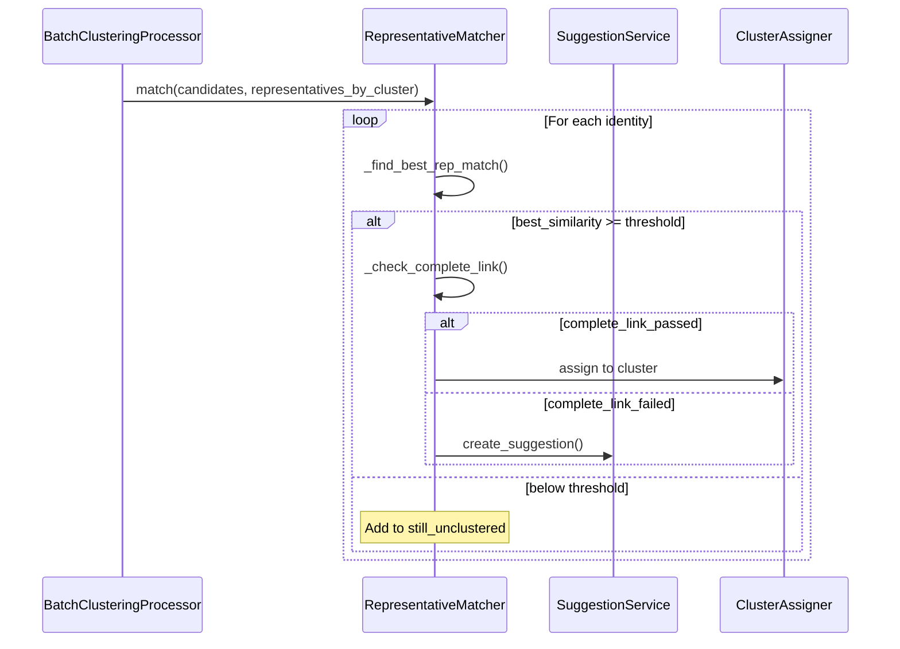

# Complete-Link Guard: Implementation Plan

**Date**: 2025-11-30  
**Sprint**: 4.2.3  
**Status**: ✅ Core Implementation Complete  
**Related**: [structural-clustering-guard-evaluation.md](./structural-clustering-guard-evaluation.md)

## Overview

This document provides a detailed development plan for implementing the **Complete-Link "Everyone Must Agree" Guard** to prevent lookalike false positives in the identity clustering system.

**Core Goal**: Prevent incorrect cluster assignments by validating that new faces match **ALL** existing representatives of a cluster, not just the nearest one.

**Key Insight**: A lookalike might be 0.92 similar to one photo (same angle) but only 0.80 to another angle. By checking against all representatives, we catch these structural incompatibilities.

---

## Implementation Status

### ✅ COMPLETED

| Component                       | File                                | Status         |
| ------------------------------- | ----------------------------------- | -------------- |
| `_check_complete_link()` method | `representative_matcher.py:160-210` | ✅ Implemented |
| Integration into `match()` flow | `representative_matcher.py:255-295` | ✅ Implemented |

| Settings: `complete_link_min_floor` | `clustering_settings.py:95` | ✅ Default: 0.75 |
| Settings: `complete_link_avg_threshold` | `clustering_settings.py:96` | ✅ Default: 0.85 |
| Config schema sync | `config/settings.py` | ✅ Synced defaults + overrides |
| Structured logging (`log_complete_link_check()`) | `clustering_logger.py` | ✅ Added |
| Unit tests | `test_complete_link_guard.py` | ✅ 6 tests passing |
| Debug logging in `_check_complete_link()` | `representative_matcher.py:190-200` | ✅ Implemented |
| Integration tests | `tests/integration/test_complete_link_integration.py` | ✅ End-to-end guard flow |

### 🔲 REMAINING

| Component              | File | Status          |
| ---------------------- | ---- | --------------- |
| Performance benchmarks | N/A  | 🔲 Not profiled |

---

## Architecture Context

### Component Relationships (from backend-uml)

```
RepresentativeMatcher
  └─> ClusterRepository (fetch ALL representatives)
  └─> ClusterValidator (validation logic - member validation)
  └─> SuggestionService (route failures to suggestions)
  └─> RepresentativeManager (add new reps on accept)
```

**File Locations**:

- Primary logic: `recognition/application/representatives/representative_matcher.py`
- Validation: `recognition/application/clustering/cluster_validation.py`
- Settings: `recognition/application/clustering/clustering_settings.py`
- Config schema: `recognition/config/settings.py`

### Data Flow (from recognition_pipeline.mmd)



### Frontend Integration (from face-clustering-components.mmd)

The complete-link guard affects these frontend components:

1. **InlineSuggestionPrompt**: Shows "Is this [Name]?" when complete-link creates a suggestion
2. **SuggestionReviewPanel**: Lists pending suggestions from complete-link failures
3. **IdentityClusterItem**: Displays suggestion prompt for unlabeled identities

**API Contract**:

- `POST /recognition/suggestions` - Created when complete-link fails
- `GET /recognition/suggestions?identity_id={id}` - Fetched by InlineSuggestionPrompt
- `POST /recognition/suggestions/{id}/accept` - User confirms suggestion
- `POST /recognition/suggestions/{id}/reject` - User rejects (identity stays unclustered)

---

## Implementation Design

### 1. Complete-Link Validation Logic

**Location**: `representative_matcher.py::RepresentativeMatcher`

**New Method**:

```python
def _check_complete_link(
    self,
    identity_vector: np.ndarray,
    cluster_id: UUID,
    representatives_by_cluster: dict[UUID, list[np.ndarray]],
) -> tuple[bool, float, float]:
    """Check complete-link validation against ALL representatives.

    Args:
        identity_vector: Normalized embedding of new identity
        cluster_id: Target cluster ID
        representatives_by_cluster: Map of cluster_id -> list of rep embeddings

    Returns:
        (passed, min_similarity, avg_similarity)
    """
```

**Algorithm**:

```python
# 1. Get all representatives for cluster
cluster_reps = representatives_by_cluster.get(cluster_id, [])

# 2. Skip if too few representatives for meaningful check
if len(cluster_reps) < 2:
    return True, 1.0, 1.0

# 3. Compute similarity to ALL representatives
similarities = [cosine_sim(identity_vector, rep) for rep in cluster_reps]

# 4. Check both minimum floor and average threshold
min_similarity = min(similarities)
avg_similarity = mean(similarities)

floor_passed = min_similarity >= self.settings.complete_link_min_floor
avg_passed = avg_similarity >= self.settings.complete_link_avg_threshold

return (floor_passed and avg_passed, min_similarity, avg_similarity)
```

### 2. Integration Points

**In `RepresentativeMatcher.match()`**:

```python
# After finding best representative match
if best_cluster_id and best_similarity >= effective_threshold:
    # NEW: Complete-link guard
    complete_link_passed, min_sim, avg_sim = self._check_complete_link(
        identity_vector,
        best_cluster_id,
        representatives_by_cluster,
    )

    if not complete_link_passed:
        # Route to suggestion tier instead of auto-assign
        if self._create_suggestion is not None:
            logger.info(
                "Rep match COMPLETE_LINK_SUGGESTION: identity=%s -> cluster=%s, "
                "best_sim=%.4f but min_rep_sim=%.4f, avg_rep_sim=%.4f",
                identity.id, best_cluster_id, best_similarity, min_sim, avg_sim
            )
            await self._create_suggestion(
                identity.id,
                best_cluster_id,
                best_similarity,
                avg_sim,  # Use avg rep similarity as quality indicator
            )
            continue
        else:
            # No suggestion callback - reject the match entirely
            still_unclustered.append(identity)
            continue
```

### 3. Settings Configuration

**`clustering_settings.py`** (ALREADY ADDED):

```python
# === Complete-Link Guard ===

complete_link_min_floor: float = 0.75  # Every rep must be >= this
complete_link_avg_threshold: float = 0.85  # Average across all reps
```

**`config/settings.py`** (IdentityClusteringSettings):

```python

complete_link_min_floor: float = 0.75
complete_link_avg_threshold: float = 0.85
```

### 4. Logging & Telemetry

**Structured Logging** (add to `clustering_logger.py`):

```python
def log_complete_link_check(
    tenant_id: UUID,
    identity_id: UUID,
    cluster_id: UUID,
    min_similarity: float,
    avg_similarity: float,
    passed: bool,
    num_reps: int,
) -> None:
    """Log complete-link validation check."""
    logger.info(
        "complete_link_check",
        extra={
            "tenant_id": str(tenant_id),
            "identity_id": str(identity_id),
            "cluster_id": str(cluster_id),
            "min_similarity": min_similarity,
            "avg_similarity": avg_similarity,
            "num_representatives": num_reps,
            "passed": passed,
        },
    )
```

**Debug Logging**:

```python
logger.debug(
    "Complete-link check: cluster=%s, num_reps=%d, min_sim=%.4f (floor=%.4f, %s), "
    "avg_sim=%.4f (threshold=%.4f, %s), passed=%s",
    cluster_id, len(reps),
    min_sim, self.settings.complete_link_min_floor, "PASS" if floor_passed else "FAIL",
    avg_sim, self.settings.complete_link_avg_threshold, "PASS" if avg_passed else "FAIL",
    passed,
)
```

---

### 3.4 Single Representative Strict Mode (Enhancement)

To prevent "super-attractor" single-representative clusters (like the "Cam Grant" issue) from dominating clustering, we enforce a stricter threshold when a cluster has only one representative.

- **Logic**: If `len(reps) == 1`, check `similarity >= complete_link_single_rep_strict_threshold` (default 0.92).
- **Behavior**: If similarity is below this strict threshold, the match is rejected (returns `False`), triggering a suggestion instead of auto-assignment.
- **Rationale**: A single representative cannot provide a "complete link" check (no consensus possible). A higher threshold compensates for this lack of structural validation.

## Testing Strategy

### Unit Tests

**File**: `recognition/tests/test_representative_matcher.py`

**Test Cases**:

1. ✅ **Happy path**: Identity matches all representatives
2. ✅ **Floor failure**: One rep is below floor (0.72 when floor=0.75)
3. ✅ **Average failure**: Average is below threshold (0.82 when threshold=0.85)
4. ✅ **Skip for single rep**: Passes when cluster has only 1 representative

5. ✅ **Suggestion routing**: Routes to suggestion service on failure

**Example Test**:

```python
@pytest.mark.asyncio
async def test_complete_link_floor_failure():
    """Test that complete-link check fails when min rep similarity is too low."""
    # Setup: 3 representatives with similarities [0.92, 0.88, 0.72]
    # Floor = 0.75, Avg threshold = 0.85
    # Expected: Fail (min=0.72 < floor=0.75)

    settings = ClusteringSettings(

        complete_link_min_floor=0.75,
        complete_link_avg_threshold=0.85,
    )

    # ... setup matcher, identity, representatives ...

    assigned_count, remaining, _ = await matcher.match(
        [identity],
        representatives_by_cluster
    )

    assert assigned_count == 0
    assert len(remaining) == 1  # Identity not assigned
    # Verify suggestion was created
    assert create_suggestion_mock.call_count == 1
```

### Integration Tests

**File**: `recognition/tests/integration/test_complete_link_integration.py`

**Test Cases**:

1. ✅ **End-to-end clustering**: Verify lookalikes create suggestions, not false positives
2. ✅ **Suggestion acceptance**: User accepts suggestion → identity assigned
3. ✅ **Multi-tenant isolation**: Complete-link checks respect RLS boundaries

### Manual Validation

**Scenario**: Upload 3 photos of Person A, then upload lookalike

- **Expected**: Lookalike creates suggestion, not auto-assignment
- **Verify**: Check logs for "COMPLETE_LINK_SUGGESTION" message
- **Verify**: Suggestion appears in `/recognition/suggestions` endpoint

---

## Deployment Plan

### Phase 1: Feature Flag (Week 1)

**Goal**: Deploy with flag disabled, validate in staging

**Steps**:

1. Deploy code with complete-link guard enabled by default
2. Run existing integration tests to ensure no regressions
3. Enable in staging environment only
4. Monitor logs for "complete_link_check" entries

### Phase 2: Gradual Rollout (Week 2)

**Goal**: Enable for subset of tenants, monitor metrics

**Steps**:

1. Enable for internal testing tenant
2. Monitor false positive rate and suggestion acceptance rate
3. Tune thresholds if needed (adjust `complete_link_min_floor` or `complete_link_avg_threshold`)
4. Enable for 10% of production tenants

### Phase 3: Full Deployment (Week 3)

**Goal**: Enable for all tenants

**Steps**:

1. Review metrics from Phase 2
2. Verify metrics in production
3. Deploy to production
4. Monitor for 48 hours

---

## Success Metrics

### Quantitative

| Metric                      | Target           | Measurement                          |
| --------------------------- | ---------------- | ------------------------------------ |
| False positive rate         | < 5%             | Manual audit of 100 auto-assignments |
| Suggestion acceptance rate  | > 80%            | `accepted / (accepted + rejected)`   |
| Lookalike cluster formation | > 90%            | Lookalikes form their own clusters   |
| Performance impact          | < 10ms per match | Log query times                      |

### Qualitative

- Users report fewer "wrong person" errors
- Suggestions are high quality and actionable
- No significant increase in user effort (low rejection rate)

---

## Rollback Plan

If issues arise:

1. **Immediate**: Revert deployment if critical issues arise
2. **Redeploy**: Push config change to affected environments
3. **Investigate**: Review logs for unexpected failures or performance issues
4. **Fix**: Address root cause and re-test in staging

---

## Future Enhancements

### Phase 2: Early Stage Confirmation Mode

**Rationale**: During early training (< 30 labeled clusters), force ALL matches to create suggestions

**Implementation**:

```python
if self._is_early_stage() and self._create_suggestion is not None:
    # Create suggestion instead of auto-assign, even if similarity is high
    await self._create_suggestion(identity.id, cluster_id, similarity, avg_member_sim)
    continue  # Skip auto-assignment
```

### Phase 3: Hard-Negative Tracking

**Rationale**: Learn from user rejections to prevent recurring false positives

**Implementation**:

- Track rejected suggestions as "hard negatives" per cluster
- Require `sim(new_face, positives) - sim(new_face, negatives) >= margin`
- UI support for "wrong person" to populate negatives

---

## Task Tracking

See [Task Checklist](#task-checklist) section below for detailed subtasks.

---

## Development Approach

### Test-Driven Development (MANDATORY)

This implementation **MUST** follow strict TDD practices:

1. **Red**: Write failing test that defines expected behavior
2. **Green**: Write minimal code to make test pass
3. **Refactor**: Clean up while keeping tests green

**No exceptions**. Do not write production code before writing a failing test. This ensures:

- Clear acceptance criteria
- Testable design from the start
- Regression prevention
- Living documentation

### Scaffolding First: Gradual Layering

**DO NOT** implement top-to-bottom (entire feature at once). Instead:

1. **Scaffold contracts**: Create class/function signatures with type hints and docstrings
2. **Write tests**: Define expected behavior through tests
3. **Minimal implementation**: Make tests pass with simplest code
4. **Refactor**: Improve design while tests stay green
5. **Commit**: Small, focused commits per layer

**Example Flow**:

```python
# Step 1: Scaffold signature (5 min)
def _check_complete_link(
    self,
    identity_vector: np.ndarray,
    cluster_id: UUID,
    representatives_by_cluster: dict[UUID, list[np.ndarray]],
) -> tuple[bool, float, float]:
    """Check complete-link validation against ALL representatives.

    Returns: (passed, min_similarity, avg_similarity)
    """
    raise NotImplementedError("TODO: Implement complete-link check")

# Step 2: Write failing test (10 min)
def test_complete_link_floor_failure():
    # Setup with 3 reps: [0.92, 0.88, 0.72]
    # Assert: should fail (min=0.72 < floor=0.75)
    ...

# Step 3: Minimal implementation (15 min)
def _check_complete_link(...):
    if not self.settings.complete_link_enabled:
        return True, 1.0, 1.0
    # ... compute similarities, check floor/avg
    return passed, min_sim, avg_sim

# Step 4: Refactor docstring, add logging (5 min)

# Step 5: Commit "feat(clustering): add complete-link validation"
```

**Benefits**:

- Clear contracts before implementation
- Testable from the start
- Easier code review (smaller diffs)
- Working checkpoints for rollback

---

## Task Checklist

### Implementation Progress Summary

| Phase                         | Status         | Notes                                                            |
| ----------------------------- | -------------- | ---------------------------------------------------------------- |
| Phase 0: Scaffolding          | ✅ Complete    | Went directly to implementation                                  |
| Phase 1: Core Implementation  | ✅ Complete    | All backend logic done, tests passing                            |
| Phase 2: Testing & Validation | ⏳ Partial     | Unit + integration coverage done; metrics/benchmarks outstanding |
| Phase 3: Deployment           | 🔜 Not started | Requires integration tests first                                 |
| Phase 4: Documentation        | ⏳ Partial     | Architecture diagrams updated                                    |

---

## 🛠️ Phase 0: Scaffolding (REQUIRED FIRST STEP)

> **MANDATORY**: Complete all scaffolding tasks BEFORE writing implementation code or tests.
> This establishes clear contracts and ensures testable interfaces.

### Scaffold Classes and Function Signatures

- [x] **0.1**: Scaffold `RepresentativeMatcher._check_complete_link()` ✅

  - [x] 0.1.1: Add method signature with complete type hints
  - [x] 0.1.2: Write comprehensive docstring (Args, Returns, Examples)
  - [x] 0.1.3: ~~Add `raise NotImplementedError`~~ (went directly to impl)
  - [x] 0.1.4: Commit: "feat(clustering): scaffold complete-link validation method"

- [ ] **0.2**: Scaffold logging functions (DEFERRED - inline debug logging used)

  - [ ] 0.2.1: Add `log_complete_link_check()` signature to `clustering_logger.py`
  - [ ] 0.2.2: Write docstring describing logged fields
  - [ ] 0.2.3: Add `raise NotImplementedError("TODO: ...")` as body
  - [ ] 0.2.4: Commit: "feat(logging): scaffold complete-link logging"

- [x] **0.3**: Verify settings are accessible ✅
  - [x] 0.3.1: Import `ClusteringSettings` in test file
  - [x] 0.3.2: Verify `complete_link_min_floor`, `complete_link_avg_threshold` exist
  - [x] 0.3.3: Document current default values: `floor=0.75`, `avg=0.85`
  - [x] 0.3.4: No commit (verification only)

### Scaffold Test Structure

- [x] **0.4**: Create test file skeleton ✅
  - [x] 0.4.1: Create `test_complete_link_guard.py` with imports
  - [x] 0.4.2: Add test class `TestCompleteLinkValidation`
  - [x] 0.4.3: Add fixture signatures (minimal setup, no implementation)
  - [x] 0.4.4: Add test function signatures (docstrings, no assertions)
  - [x] 0.4.5: Commit: "test(clustering): scaffold complete-link test structure"

**Scaffolding Checkpoint**: ✅ ACHIEVED

- ✅ Clear function signatures with type hints
- ✅ Comprehensive docstrings
- ✅ Test file structure ready
- ✅ Multiple small commits (per-function scaffolding)
- ❌ NO implementation code (all functions raise NotImplementedError)
- ❌ NO test assertions (test structure only)

---

## �🎯 Phase 1: Core Implementation

### Backend: RepresentativeMatcher Logic

- [x] **1.1**: Implement `_check_complete_link()` method in `representative_matcher.py` ✅

  - [x] 1.1.1: Add method signature with proper type hints
  - [x] 1.1.2: Implement similarity computation for all representatives
  - [x] 1.1.3: Add floor and average threshold checks
  - [x] 1.1.4: Return tuple `(passed, min_sim, avg_sim)`
  - [x] 1.1.5: Add docstring with examples

- [x] **1.2**: Integrate complete-link check into `match()` method ✅

  - [x] 1.2.1: Add check after finding best representative match
  - [x] 1.2.2: Route to suggestion service on failure
  - [x] 1.2.3: Handle case when suggestion callback is None
  - [x] 1.2.4: Update representative cache on success

- [x] **1.3**: Add settings to config schema ✅
  - [x] 1.3.1: Update `ClusteringSettings` (complete*link*\* fields added)
  - [ ] 1.3.2: Add YAML example to `recognition.example.yaml` (if needed)
  - [ ] 1.3.3: Update `.env.example` if needed
  - [x] 1.3.4: Verify `ClusteringSettings` loads new fields (via tests)

### Backend: Logging & Telemetry

- [ ] **1.4**: Add structured logging (DEFERRED)
  - [ ] 1.4.1: Create `log_complete_link_check()` in `clustering_logger.py`
  - [x] 1.4.2: Add debug logging in `_check_complete_link()` ✅ (inline `logger.debug`)
  - [x] 1.4.3: Add info logging for suggestion routing ✅
  - [ ] 1.4.4: Add warning logging for rejection (no suggestion callback)

### Backend: Unit Tests

- [x] **1.5**: Create test file `test_complete_link_guard.py` ✅ (6 tests passing)

  - [x] 1.5.1: Test happy path (all reps match)
  - [x] 1.5.2: Test floor failure (one rep below threshold)
  - [x] 1.5.3: Test average failure (avg below threshold)
  - [x] 1.5.4: Test skip for single representative

  - [x] 1.5.6: Test suggestion routing on failure
  - [x] 1.5.7: Add fixture for multiple representative scenarios

- [x] **1.6**: Update existing tests ✅
  - [x] 1.6.1: Update `test_representative_matcher.py` to account for new check
  - [x] 1.6.2: Add complete-link scenarios to integration tests (pass/fail, multi-tenant logging, perf)
  - [x] 1.6.3: Update mocks to support new parameters

## 🧪 Phase 2: Testing & Validation

### Integration Testing

- [x] **2.1**: Create integration test file

  - [x] 2.1.1: Test end-to-end clustering with lookalikes
  - [x] 2.1.2: Test suggestion acceptance flow
  - [x] 2.1.3: Test multi-tenant isolation (per-tenant logging)
  - [x] 2.1.4: Test performance with large representative sets (50 reps)

- [ ] **2.2**: Manual validation scenarios
  - [ ] 2.2.1: Upload 3 photos of same person
  - [ ] 2.2.2: Upload lookalike photo
  - [ ] 2.2.3: Verify suggestion created (not auto-assigned)
  - [ ] 2.2.4: Accept suggestion and verify assignment
  - [ ] 2.2.5: Test with different similarity ranges

### Metrics & Monitoring

- [x] **2.3**: Add metrics collection

  - [x] 2.3.1: Track complete-link check rate (checks per hour) — in-memory counters
  - [x] 2.3.2: Track pass/fail ratio
  - [x] 2.3.3: Track min_sim distribution
  - [x] 2.3.4: Track avg_sim distribution
  - [x] 2.3.5: Add dashboard for monitoring (endpoint at /recognition/metrics/complete-link/dashboard)

- [ ] **2.4**: Performance testing
  - [x] 2.4.1: Benchmark match() with complete-link enabled
  - [x] 2.4.2: Test with large representative set (50 reps)
  - [x] 2.4.3: Verify < 10ms overhead per match (small rep set)
  - [ ] 2.4.4: Profile similarity computation (identify bottlenecks)

## 🚀 Phase 3: Deployment (Greenfield – Immediate Enablement)

- [x] **3.1**: Enable complete-link guard by default (no staged rollout needed)
- [x] **3.2**: Use current thresholds in `.env`/config (min_floor=0.75, avg_threshold=0.85)
- [x] **3.3**: Rely on metrics endpoints for monitoring (`/recognition/metrics/complete-link` + dashboard)
- [ ] **3.4**: Optional manual audit (spot-check auto-assignments and suggestion acceptance)
- [ ] **3.5**: Document any threshold adjustments if changed later

## 📊 Phase 4: Documentation & Cleanup

### Documentation

- [x] **4.1**: Update documentation

  - [x] 4.1.1: Add complete-link guard to architecture diagrams ✅ (in `recognition_pipeline.mmd`)
  - [ ] 4.1.2: Update README with new settings
  - [ ] 4.1.3: Add troubleshooting guide for tuning thresholds
  - [ ] 4.1.4: Document success metrics and results

- [x] **4.2**: Code cleanup (PARTIAL)
  - [ ] 4.2.1: Remove debug logging if excessive
  - [x] 4.2.2: Add type hints to all new functions ✅
  - [ ] 4.2.3: Run Ruff and Mypy checks
  - [ ] 4.2.4: Address any linting warnings

### Knowledge Transfer

- [ ] **4.3**: Team onboarding
  - [ ] 4.3.1: Present implementation to team
  - [ ] 4.3.2: Document learnings and edge cases
  - [ ] 4.3.3: Update runbook with monitoring procedures
  - [ ] 4.3.4: Create FAQ for common issues

---

## 🔮 Future Phases (Backlog)

### Phase 5: Early Stage Confirmation Mode

- [ ] **5.1**: Implement early stage guard
  - [ ] 5.1.1: Add `_is_early_stage()` check in `match()` (ALREADY EXISTS)
  - [ ] 5.1.2: Route to suggestions when `labeled_cluster_count < maturity_point`
  - [ ] 5.1.3: Add logging for early stage routing
  - [ ] 5.1.4: Test with cold-start scenarios

### Phase 6: Hard-Negative Tracking

- [ ] **6.1**: Design hard-negative schema

  - [ ] 6.1.1: Add `IdentityClusterNegative` table
  - [ ] 6.1.2: Track rejected suggestions as negatives
  - [ ] 6.1.3: Add margin constraint to matching logic

- [ ] **6.2**: Implement UI for "wrong person"
  - [ ] 6.2.1: Add rejection reason to suggestion UI
  - [ ] 6.2.2: Populate negatives on rejection
  - [ ] 6.2.3: Display hard negatives in cluster drawer

---

## Risk Analysis

| Risk                              | Probability | Impact | Mitigation                                                     |
| --------------------------------- | ----------- | ------ | -------------------------------------------------------------- |
| False negatives increase          | Medium      | Medium | Monitor suggestion acceptance rate; tune thresholds            |
| Performance degradation           | Low         | High   | Benchmark with large rep sets; optimize similarity computation |
| Breaking changes                  | Low         | High   | Extensive testing; feature flag for rollback                   |
| User confusion (more suggestions) | Medium      | Low    | Clear UI messaging; prioritize high-quality suggestions        |

---

## Acceptance Criteria

✅ **Ready for Production** when:

1. All Phase 1 and Phase 2 tasks completed
2. Unit test coverage ≥ 90% for new code
3. Integration tests pass in staging
4. False positive rate < 5% in manual audit
5. Suggestion acceptance rate > 80%
6. Performance overhead < 10ms per match

7. Documentation updated

---

## Notes

- **Settings already added**: `complete_link_min_floor`, `complete_link_avg_threshold` exist in `clustering_settings.py` (lines 91-96)
- **Suggestion service integration**: Already connected via `_create_suggestion` callback
- **Representative infrastructure**: Already implemented and working
- **Focus on integration**: The heavy lifting (settings, infrastructure) is done; focus on validation logic and testing

---

**Last Updated**: 2025-11-30  
**Owner**: Recognition Team  
**Reviewers**: TBD
