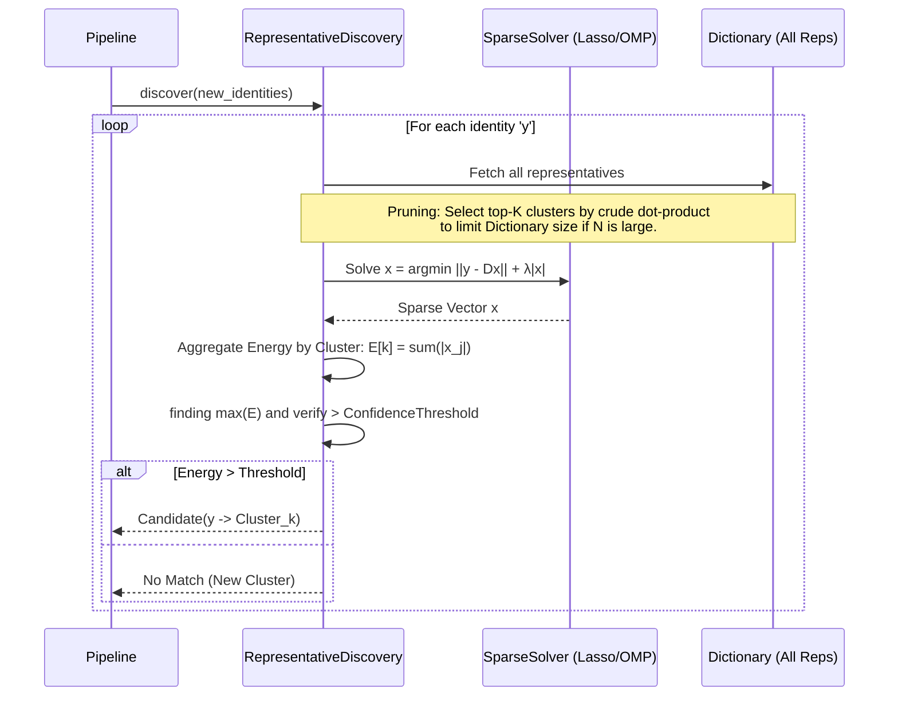
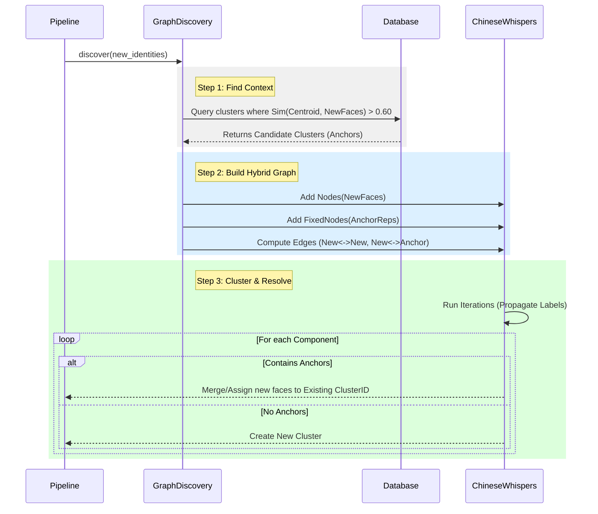

# Batch Clustering Inconsistency Analysis

**Date:** 2025-12-13
**Version:** 4.2.6
**Status:** Updated 2025-12-13 21:40 — New Root Cause Identified

## Problem Description
The user observed a non-deterministic behavior where clustering results differ based on batch size:
*   **Scenario A (Single Batch):** 100 images sent at once -> Results in **1 Cluster** (Correct).
*   **Scenario B (Split Batch):** 50 images sent, then another 50 -> Results in **2 Clusters** (Incorrect, False Negative).

The goal is for the system to be deterministic regardless of batch splitting.

---

## Updated Root Cause Analysis (2025-12-13 21:44)

> [!CAUTION]
> **The original "Discarded Bridge" thesis was correct but FPS alone is insufficient.** The problem is the 0.85 discovery threshold — it's too strict for incremental matching even with diverse representatives.

### Test Scenarios Compared

| Scenario | Batch 1 | Batch 2 | Muted Yarrow Cluster |
|----------|---------|---------|----------------------|
| **Single Batch** (19:16) | 75 + 106 identities in sequence | — | 39 + 46 = **85 members** (via Graph transitivity + manual merges) |
| **Split Batch w/ FPS** (21:16) | 75 identities → 20 clusters | 162 identities → **0 matched**, 49 new clusters | Batch 2 identities NOT discovered as candidates |

### Critical Evidence from Post-FPS Test

After batch 1 created 20 clusters with FPS-diverse representatives:

```log
# Batch 2: RepresentativeDiscovery found 0 matches despite 16 clusters with 39 reps
[RepresentativeDiscovery] NO MATCH: best_sim=0.5648 (threshold=0.85)
[RepresentativeDiscovery] NO MATCH: best_sim=0.6557 (threshold=0.85)
[RepresentativeDiscovery] NO MATCH: best_sim=0.2664 (threshold=0.85)
[RepresentativeDiscovery] Completed: 0 candidates from 162 identities
```

### The Real Problem: Discovery Threshold ≠ Graph Threshold

**Why single-batch works:**
- GraphDiscovery sees ALL 181 identities simultaneously
- Builds transitive chains: `Face_A (0.85) ↔ Face_B (0.85) ↔ Face_C`
- Even if `Sim(A,C) = 0.55`, they cluster together via transitivity

**Why split-batch fails:**
- Batch 2 identities have 0.55-0.65 similarity to Batch 1 representatives
- RepresentativeDiscovery requires **direct** 0.85 match
- **No transitivity** — the batch 2 faces that would bridge are not yet in the graph
- Result: 0 candidates discovered, 49 new clusters created

### Why FPS Didn't Fix It

FPS ensures diverse representatives are selected, but:
- The **best-matching representative** still only scores 0.65
- This is a pose/angle issue, not a representative diversity issue
- Even the most "bridge-like" face from batch 1 is too different from batch 2 faces to hit 0.85

---

## Revised Remediation Strategy

### Phase A: FPS Diversity Selection ✅ DONE
*Confirmed: correctly selecting diverse representatives. Not sufficient alone.*

### Phase B: Two-Tier Discovery Threshold (RECOMMENDED)
Separate the discovery threshold from the assignment threshold:

1. **Discovery Threshold**: 0.60 — Find potential candidates
2. **Gate Threshold**: 0.85 — Require high avg similarity to existing members

This allows profile views to "discover" a cluster, then be validated by member-level checks.

### Phase C: Anchor Injection (Graph Retrospection)
Inject existing representatives into the batch graph so transitivity works across batches:
`New_Face_ProfileView` ↔ `New_Face_Intermediate` ↔ `Anchor_Rep_Frontal`

### Phase D: Adaptive Threshold by Pose
Lower similarity threshold for high-pose-angle faces based on InsightFace pose metadata.

---

## Original Root Cause Analysis (Preserved)

### 1. The Discarded Bridge (The Core Issue)
The inconsistency in the 50x2 split batch scenario is caused by the **loss of critical "bridge" faces** during the persistence of the first batch.

1.  **Batch 1 (Faces A, B):** The Graph Algorithm links Face A and Face B (e.g., via a direct edge or intermediate path). A cluster is formed (Cluster 1).
2.  **Persistence of Batch 1:** The system must select **Representatives** for Cluster 1.
    *   **Current Logic:** `AssignmentWriter.persist_new_cluster` selects the top `max_representatives_per_cluster` (default 5) faces sorted by **Image Quality Confidence**.
    *   **The Failure:** If the "Bridge" Face (Face B) that connects to future data has lower image quality (e.g., blurry, side profile) than the core faces, it is **discarded** as a representative.
3.  **Batch 2 (Face C):** Face C enters. It effectively connects to Face B (Sim > 0.85).
    *   **Incremental Check:** Face C is compared to the *saved* representatives of Cluster 1 (Face A, etc.).
    *   Face B is *missing*.
    *   Face C cannot match Face A (Sim < 0.85).
    *   **Result:** Face C forms a new cluster (Cluster 2).

### 2. Batch Transitivity vs. Incremental Strictness
*   **Single Batch (100):** The `GraphDiscovery` sees Faceless A, B, and C simultaneously. It builds the graph `A <-> B <-> C`. The transitive connection allows them to cluster together despite `Sim(A, C) < 0.85`.
*   **Split Batch:** The transitive link is broken because the intermediate node (B) was not retained as a reference point.

### 3. Why Lowering Threshold Failed
The user correctly noted that lowering `similarity_threshold` (e.g., to 0.55) caused singletons/false negatives.
*   `GraphDiscovery` relies on a high threshold (0.85) to build distinct, high-quality clusters. Lowering it creates a noisy "hairball" graph where the algorithm fails to distinguish boundaries.
*   Therefore, we **cannot** simply lower the global threshold. We must fix the **availability** of the bridge candidates.

## Evidence from Logs
The logs confirm that `RepresentativeDiscovery` rejected candidates that had significant similarity (0.62-0.64), which would likely have been bridged if the graph algorithms were able to see the intermediate connections.

```log
# Batch 2 Processing (Split Scenario)
2025-12-13 19:23:16,170 INFO recognition.application.discovery.representative - [RepresentativeDiscovery] NO MATCH: identity 18b9d472... best_cluster=3f9ae909... best_sim=0.6225 (threshold=0.85)
2025-12-13 19:23:16,171 INFO recognition.application.discovery.representative - [RepresentativeDiscovery] NO MATCH: identity 4dc6d8c8... best_cluster=3f9ae909... best_sim=0.6443 (threshold=0.85)
2025-12-13 19:23:16,171 INFO recognition.application.discovery.representative - [RepresentativeDiscovery] NO MATCH: identity 8498f73f... best_cluster=3f9ae909... best_sim=0.6260 (threshold=0.85)
```

In the **Single Batch (1x100)** scenario, these 0.60+ links are sufficient to form a cluster because they connect to a mutual neighbor (the bridge node) with >0.85 similarity. In the **Split Batch (2x50)** scenario, that bridge node was not selected as a representative, forcing a direct comparison against a distant centroid, which failed.

## Verified Findings
*   **Representative Selection:** Uses `sorted(identities, key=lambda i: i.confidence, reverse=True)`.
*   **Missing Representativeness:** Does not consider geometric centrality or boundary/bridge status.
*   **Configuration:** `max_representatives_per_cluster` = 5.

## Insights from Apple Literature
The paper ["Recognizing People in Photos"](https://machinelearning.apple.com/research/recognizing-people-photos) validates the need for a more robust representative strategy:

1.  **Canonical Exemplars:** Instead of a single centroid or random high-confidence faces, Apple represents each cluster with a set of "canonical exemplars" ($X_0, \dots, X_c$).
2.  **Robust Assignment:** For new observations, they solve a **Sparse Coding** problem ($\min_x ||y - D \cdot x||_2^2 + \lambda ||x||_1$) against the dictionary of all exemplars, rather than a simple nearest-neighbor to a centroid.
3.  **Relevance:** This confirms that **Set-based Representation** (keeping multiple, diverse faces) is industry standard for handling incremental assignment, whereas our current "Best 5 by Confidence" approach is too reductive.

## Remediation Strategy
To fix the inconsistency, we must ensure "Bridge" faces are retained, aligning with the "Exemplar" concept.
1.  **Diversified Representative Selection:** Change the `persist_new_cluster` logic to select representatives that maximize **Diversity** (e.g., K-Means centers within the cluster, or Farthest Point Sampling) rather than just Image Quality.
2.  **Increase Representative Count:** Increase `max_representatives_per_cluster` (e.g., to 10) to store a richer dictionary of exemplars.
3.  **Graph Retrospection:** (Longer Term) Pull more representatives into the graph during batch processing to emulate Apple's "Pass 2" HAC merging.

**Current Status:** Documented. Code unchanged.

## Proposed Sparse Coding Implementation

To address the "Discarded Bridge" issue and improve robustness, we propose replacing the greedy Nearest Neighbor (Dot Product) check in `RepresentativeDiscovery` with a **Sparse Coding** approach as described by Apple.

### 1. Mathematical Formulation
Instead of finding the single best representative, we express the new face $y$ as a linear combination of *all* available representatives (the dictionary $D$).

$$ \min_x ||y - D \cdot x||_2^2 + \lambda ||x||_1 $$

*   **$y$**: The normalized embedding vector of the new face ($d=512$).
*   **$D$**: The dictionary matrix of shape $(d \times N)$, columns are normalized representatives from all candidate clusters.
*   **$x$**: The sparse coefficient vector of size $N$.
*   **$\lambda$**: Sparsity penalty (controls how many representatives are used).

**Assignment Rule:**
Assign $y$ to the cluster $C_k$ that maximizes the total energy of the coefficients:
$$ k^* = \arg\max_k \sum_{j \in C_k} |x_j| $$

### 2. Integration into Pipeline
This logic replaces the `_find_best_match` method in `RepresentativeDiscovery`.

#### Data Flow Diagram


### 3. Implementation Plan
1.  **Dependency**: Add `scikit-learn` (for `Lasso` or `OrthogonalMatchingPursuit`) to the environment.
2.  **Dictionary Construction**:
    *   Gather all `ClusterRepresentative.embedding` vectors from currently active clusters.
    *   Flatten into matrix $D$.
3.  **Solver Integration**:
    *   Use `sklearn.linear_model.orthogonal_mp` (OMP) for performance-critical path (faster than full Lasso).
    *   Or implement a custom Projected Gradient Descent solver if dependencies are constrained.
4.  **Fallback**:
    *   Retain Dot Product as a "pre-filter" to select the top 50 candidate clusters before running the expensive Sparse Solve.

### 4. Implementation Details (Current Description Service)
* **Touchpoints:** `recognition/application/discovery/representative.py` (replace `_find_best_match`), optional helper for sparse solvers, and observability hooks in `recognition/observability/decisions.py`.
* **Dictionary pruning:** Do a cheap dot-product sweep over `representatives_by_cluster` to keep only the top-K clusters (e.g., cap total reps to ~200) before forming the matrix $D$ to bound latency.
* **Solver path:** Normalize `y` and columns of $D$, run OMP with a small atom budget (3–5) and sparsity weight `λ` tuned so residual `< (1 - similarity_threshold)`. Aggregate `|x_j|` per cluster; bias toward `labeled_cluster_ids` by adding a small energy prior.
* **Acceptance rule:** Assign to the cluster with max energy if residual and energy clear thresholds; otherwise fall back to the existing dot-product scoring. Keep current logging of best sims and extend logs with residual/energy for debugging.
* **Dependency handling:** Guard sklearn import; if missing, use a NumPy OMP fallback and log a warning so the pipeline never fails.


## Proposed Graph Retrospection Implementation

To emulate Apple's "Pass 2" (Hierarchical Agglomerative Clustering) and solve the "Split Batch Disconnect" via transitivity, we propose **Anchor Injection** into the batch graph.

### 1. Concept
Instead of treating "Discovery" (Match against old) and "Batch Clustering" (Match amongst new) as strictly separate phases, we hybridize them. We temporarily inject "Anchors" (representatives of existing similar clusters) into the active Graph Clustering process.

This allows the graph algorithm (Chinese Whispers/HDBSCAN) to discover transitive links:
`New_Face_C` <---> `New_Face_D` <---> `Anchor_Rep_A`

### 2. The Mechanism
1.  **Pre-Selection (Broad Phase):**
    *   Before clustering the $N$ new faces, query the database for "Potential Candidate Clusters" using a relaxed threshold (e.g., Centroid Similarity > 0.60).
    *   Select the top $M$ existing clusters.
2.  **Anchor Injection:**
    *   Load the representatives (Exemplars) for these $M$ clusters.
    *   Treat them as **"Fixed Nodes"** in the current batch graph.
3.  **Graph Construction:**
    *   Calculate edges: `New` $\leftrightarrow$ `New` AND `New` $\leftrightarrow$ `Anchor`.
    *   Do *not* calculate `Anchor` $\leftrightarrow$ `Anchor` (assume existing clusters are distinct unless a merge is explicitly detected).
4.  **Clustering & Resolution:**
    *   Run Chinese Whispers.
    *   If a component contains only New Faces $\rightarrow$ **New Cluster**.
    *   If a component contains New Faces + `Anchor_Rep_from_Cluster_A` $\rightarrow$ **Assign to Cluster A**.
    *   If a component contains `Anchor_Rep_A` + `Anchor_Rep_B` $\rightarrow$ **Merge Cluster A and B**.

### 3. Data Flow Diagram



### 4. Benefits
*   **Restores Transitivity:** `New_Face` doesn't need to match `Anchor` directly (0.85). It can match an intermediate `New_Face_2` (0.85) which matches `Anchor` (0.85), effectively bridging the gap across batches.
*   **Auto-Merge:** Naturally detects when two existing clusters should be merged because new data fills the gap between them.

### 5. Implementation Details (Current Description Service)
* **Anchor preselection:** In `ClusterService.cluster` / `cluster_unclustered_identities`, query a limited set of existing clusters whose centroids score above a relaxed floor (e.g., 0.60) against incoming embeddings. Add a repo helper (`find_similar_centroids` or filter `_clusters.get_by_tenant`) to avoid loading all clusters.
* **GraphDiscovery contract:** Extend `recognition/application/discovery/graph.py` to accept anchors as fixed nodes. For `DeterministicChineseWhispers`, add anchor nodes, compute edges for `new↔new` and `new↔anchor` only (skip anchor↔anchor), and preserve anchor labels during propagation.
* **Resolution rules:** If a component includes anchors, emit `AssignmentCandidate`s for that anchor’s cluster when similarity to the anchor mean clears `similarity_threshold`. If multiple anchors appear, either emit a merge suggestion or select the dominant anchor by average sim; log both cases for observability.
* **Noise handling:** When anchors are provided, disable the singleton-noise shortcut so anchors/graph labels decide membership; keep singleton creation only when clustering with no anchors.
* **Observability:** Log injected anchor counts and anchor-linked components in `recognition/observability/logging.py` and surface in `BatchJobReport` for regression tracking.

### 6. Representative Persistence Hardening (Supporting Fix)
* Update `AssignmentWriter.persist_new_cluster` to pick initial representatives via diversity-aware sampling (e.g., farthest-point sampling or k-means centers) instead of pure confidence sort; raise `max_representatives_per_cluster` (e.g., 10) and enforce `representative_diversity_threshold` to keep bridge faces. Recompute centroid immediately after writing reps so anchors stay fresh for follow-on batches.
