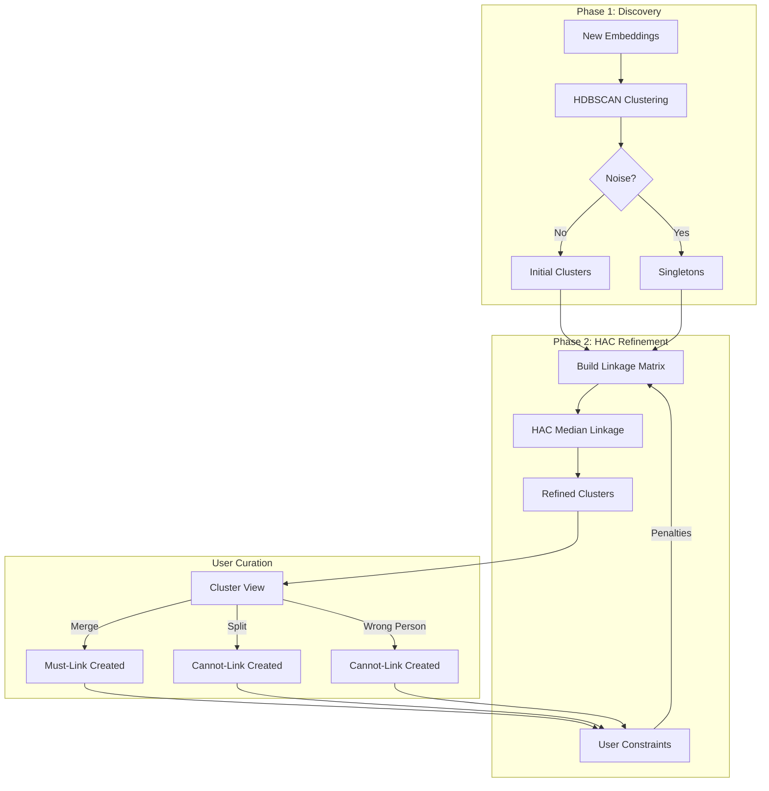

# Hybrid Clustering Strategy: HDBSCAN + HAC with User Curation

**Version:** 4.2.9  
**Date:** 2025-12-22  
**Status:** PROPOSED  
**Replaces:** merge-wrong-person-implementation-plan.md, wrong-person-ground-truth-plan.md, suggestion-workflow-findings.md

---

## Executive Summary

This document consolidates all v4.2.9 clustering improvements into a **unified hybrid strategy** inspired by [Apple's on-device person recognition](file:///Users/daniel/Development/context-alt-text-monorepo/docs/literature/extracted/recognition/apple/Recognizing%20People%20in%20Photos%20Through%20Private%20On-Device%20Machine%20Learning%20-%20Apple%20Machine%20Learning%20Research.txt). The approach combines:

- **Phase 1 (Discovery)**: HDBSCAN for initial clustering with noise detection
- **Phase 2 (Refinement)**: HAC with median linkage incorporating user curation signals

User actions (merge, split, wrong-person) become **linkage constraints** that directly influence future clustering decisions.

---

## Problem Summary

| Issue | Current State | Impact |
|-------|---------------|--------|
| **Wrong Person** | Bulk-removes ALL members from cluster | Destroys cluster, loses ground truth |
| **Merge 404** | Source deleted before FK updates | Breaks all merge operations |
| **No learning** | Blocks prevent re-assignment only | Doesn't influence future clustering |
| **Stale suggestions** | Background refresh only | User doesn't see updated matches |

---

## Proposed Architecture



---

## Phase 1: Discovery (HDBSCAN)

**No changes required.** Current HDBSCAN implementation works well for:
- Initial clustering of new embeddings
- Noise/outlier detection
- Variable-density clusters

### Output
- Clustered identities → assigned to `IdentityCluster`
- Noise points → singletons with `cluster_id = NULL` or new singleton cluster

---

## Phase 2: Refinement (HAC with Constraints)

### 2.1 Constraint Types

| Constraint | Source | Linkage Effect |
|------------|--------|----------------|
| **Must-Link** | Merge action | Distance = 0 (force same cluster) |
| **Cannot-Link** | Split, Wrong Person | Distance = ∞ (force different clusters) |
| **Soft Penalty** | Block (existing) | Distance += penalty_weight |

### 2.2 Database Schema

#### [NEW] `identity_constraints`

```sql
CREATE TABLE identity_constraints (
    id UUID PRIMARY KEY DEFAULT gen_random_uuid(),
    tenant_id UUID NOT NULL REFERENCES tenants(id) ON DELETE CASCADE,
    identity_a UUID NOT NULL REFERENCES media_identities(id) ON DELETE CASCADE,
    identity_b UUID NOT NULL REFERENCES media_identities(id) ON DELETE CASCADE,
    constraint_type VARCHAR(20) NOT NULL,  -- 'must_link', 'cannot_link'
    source VARCHAR(20) NOT NULL,           -- 'merge', 'split', 'wrong_person'
    created_at TIMESTAMPTZ DEFAULT now(),
    created_by_user_id INTEGER,
    
    UNIQUE (tenant_id, identity_a, identity_b),
    CHECK (identity_a < identity_b)  -- Canonical ordering
);

CREATE INDEX idx_identity_constraints_lookup 
ON identity_constraints(tenant_id, identity_a, identity_b);
```

### 2.3 HAC Refinement Algorithm

```python
class ConstrainedHAC:
    """HAC clustering with user-derived pairwise constraints."""
    
    def __init__(
        self,
        constraint_repo: IdentityConstraintRepository,
        linkage_method: str = "median",  # Per Apple paper
        distance_threshold: float = 0.4,
        constraint_penalty: float = 1.0,  # Must be > distance_threshold and finite.
    ):
        self.constraint_repo = constraint_repo
        self.linkage_method = linkage_method
        self.threshold = distance_threshold
        self.constraint_penalty = constraint_penalty

    async def refine_clusters(
        self,
        tenant_id: UUID,
        embeddings: dict[UUID, np.ndarray],  # identity_id -> embedding
    ) -> dict[UUID, UUID]:  # identity_id -> cluster_id
        """Apply HAC to embeddings with constraint penalties."""
        
        # 1. Compute pairwise distances
        ids = list(embeddings.keys())
        X = np.array([embeddings[i] for i in ids])
        dist_matrix = cosine_distances(X)
        
        # 2. Apply constraint penalties
        constraints = await self.constraint_repo.get_all(tenant_id)
        for c in constraints:
            i = ids.index(c.identity_a) if c.identity_a in ids else None
            j = ids.index(c.identity_b) if c.identity_b in ids else None
            if i is not None and j is not None:
                if c.constraint_type == "must_link":
                    dist_matrix[i, j] = 0.0
                    dist_matrix[j, i] = 0.0
                elif c.constraint_type == "cannot_link":
                    dist_matrix[i, j] = self.constraint_penalty
                    dist_matrix[j, i] = self.constraint_penalty
        
        # 3. Run HAC with median linkage
        condensed = squareform(dist_matrix)
        linkage_matrix = linkage(condensed, method=self.linkage_method)
        labels = fcluster(linkage_matrix, t=self.threshold, criterion='distance')
        
        return {ids[i]: label for i, label in enumerate(labels)}
```

Note: `np.inf` is not used in the codebase. If SciPy HAC is used, keep distances finite;
`squareform` and `linkage` expect finite values. Use a large penalty above the threshold,
or filter disallowed pairs before clustering.

### 2.4 Integration with Assignment Gate

#### [NEW] `ConstraintCheck`

```python
class ConstraintCheck(AssignmentCheck):
    """Reject candidates that violate pairwise constraints."""
    
    async def evaluate(self, candidate: AssignmentCandidate) -> CheckResult:
        cluster_members = await self.member_repo.get_by_cluster(candidate.cluster_id)
        
        for member in cluster_members:
            constraint = await self.constraint_repo.get(
                candidate.identity.tenant_id,
                candidate.identity.id,
                member.identity_id,
            )
            if constraint and constraint.constraint_type == "cannot_link":
                return CheckResult(
                    passed=False,
                    is_fatal=True,
                    reason=f"cannot_link constraint from {constraint.source}",
                )
        
        return CheckResult(passed=True)
```

### 2.5 Efficiency and Scope

HAC is quadratic in the number of identities it processes. Keep it scoped:

**HAC scope by user action (what fits best):**

- Merge: skip HAC; merge is explicit must-link. Recompute representatives/centroid and refresh suggestions only.
- Split: skip HAC; split already performed clustering. Add cannot-link constraints and refresh suggestions. HAC only for new noise points.
- Wrong person: local reassignment only. HAC scoped to the removed identity + its kNN neighborhood.
- HDBSCAN noise/outliers: best HAC target. Run HAC only on the noise pool (plus a small kNN neighborhood).

**More efficient HAC implementation:**

- Run HAC only on the affected neighborhood (new identities, recently curated identities, or HDBSCAN noise).
- Refine per-cluster or per-connected-component instead of full-tenant batches.
- Build a kNN graph and run constrained clustering on edges only (avoid full pairwise distances).
- Apply must-link by union-find before HAC to reduce the effective problem size.
- Use approximate kNN (FAISS/Annoy) for neighborhood building to avoid O(n^2) distance computation.

### 2.6 Runtime Impact (Relative)

- HAC is O(n^2) memory/time for n identities in scope.
- HDBSCAN is typically near-linear to n log n with spatial indexing.
- Representative matching is O(k) per identity, where k is representative count per cluster.

Conclusion: HAC should be used on a small, curated subset, not the full corpus.

### 2.7 HAC Integration: Implementation

**Integration Point:** Post-GraphDiscovery, within `cluster_unclustered_identities()`

**Rationale:**
- GraphDiscovery identifies "still_unclustered" identities (HDBSCAN noise + rejected candidates)
- This subset is automatically scoped (typically 10-50 identities per chunk)
- HAC refinement runs ONLY on this noise pool, avoiding O(n²) on full corpus
- Immediate feedback: Users see constraint benefits in the same clustering job

**Implementation Location:**

File: [`incremental_clustering.py`](file:///Users/daniel/Development/context-alt-text-monorepo/apps/prototype-description-service/recognition/application/orchestration/incremental_clustering.py)

Insert between lines 456-474 (after new cluster creation, before chunk completion):

```python
# After new_cluster_proposals are persisted (line 473)

# ============================================================
# HAC Refinement for Noise Pool (if constraints exist)
# ============================================================
if still_unclustered and len(still_unclustered) <= hac_settings.max_scope_size:
    logger.info(
        "[clustering] Running HAC refinement on %d noise identities",
        len(still_unclustered)
    )
    
    # Extract embeddings for HAC
    embeddings_for_hac = {
        uuid.UUID(i.id): np.array(i.embedding, dtype=np.float32)
        for i in still_unclustered 
        if i.embedding is not None
    }
    
    if embeddings_for_hac:
        # Run constrained HAC
        hac_clusters = await constrained_hac.refine_clusters(
            tenant_id=uuid.UUID(tenant_id),
            embeddings=embeddings_for_hac
        )
        
        # Group identities by HAC-assigned cluster
        hac_groups: dict[uuid.UUID, list[MediaIdentity]] = {}
        for identity in still_unclustered:
            cluster_uuid = hac_clusters.get(uuid.UUID(identity.id))
            if cluster_uuid:
                hac_groups.setdefault(cluster_uuid, []).append(identity)
        
        # Persist each HAC cluster (only multi-member clusters)
        for members in hac_groups.values():
            if len(members) > 1:
                await assignment_writer.persist_new_cluster(
                    tenant_id=tenant_id,
                    identities=members,
                    similarities=[],  # HAC doesn't provide pairwise sims
                    algorithm="constrained_hac"
                )
                centroids_dirty = True
                clusters_created += 1
                logger.info(
                    "[clustering] hac_cluster job_id=%s identity_count=%d media_ids=%s",
                    job_id,
                    len(members),
                    [m.media_id for m in members],
                )
```

**Dependency Injection:**

`ClusterService` must accept `ConstrainedHAC`:

```python
class ClusterService:
    def __init__(
        self,
        *,
        gate: AssignmentGate,
        representative_discovery: RepresentativeDiscovery,
        centroid_discovery: CentroidDiscovery,
        graph_discovery: GraphDiscovery,
        assignment_writer: AssignmentWriter,
        suggestion_service: SuggestionService,
        constraint_repository: IdentityConstraintRepository,  # NEW
        hac_settings: HACSettings | None = None,  # NEW
        logger: ClusteringLogger | None = None,
        session: AsyncSession | None = None,
    ):
        # ...
        self.constrained_hac = ConstrainedHAC(
            constraint_repo=constraint_repository,
            settings=hac_settings or HACSettings()
        ) if constraint_repository else None
```

**Benefits of This Approach:**

| Benefit | How Achieved |
|---------|--------------|
| **Automatic scoping** | Only processes `still_unclustered` subset |
| **Avoids O(n²) disaster** | Never runs on full corpus (thousands) |
| **Immediate feedback** | Users see constraint benefits instantly |
| **Minimal disruption** | No new discovery adapter needed |
| **Natural placement** | Constraints most valuable for borderline cases |
| **Safe rollout** | Can be disabled by setting `max_scope_size=0` |

**Alternative (Rejected): Separate Refinement Job**

A periodic/on-demand job would require:
- ❌ Job scheduling infrastructure
- ❌ Slower user feedback (batch processing)
- ❌ Still needs scope limiting (can't run on thousands)
- ❌ Code duplication with existing clustering logic

---

## User Curation Actions

### 3.1 Wrong Person (Fixed)

**Current Bug:** Removes ALL cluster members  
**Fix:** Remove only the representative, create cannot-link pairs

#### [MODIFY] [IdentityClusterItem.tsx](file:///Users/daniel/Development/context-alt-text-monorepo/apps/prototype-wp-alt-context/js/admin/pages/workbench/identity-clusters/IdentityClusterItem.tsx)

```tsx
// Line 227: Enable for all clusters
canReject={true}

// Line 176: Send only representative
const handleWrongPerson = () => {
  const targetId = representative?.identity_id;
  if (targetId) {
    mutations.reassign([targetId], { createConstraints: true });
  }
};
```

#### [MODIFY] `/clusters/reassign` Endpoint

```python
# When removing from cluster, create cannot_link with remaining members
if request.create_constraints:
    remaining = await member_repo.get_by_cluster(identity.cluster_id)
    for member in remaining:
        await constraint_repo.create(
            tenant_id=request.tenant_id,
            identity_a=min(request.identity_id, member.identity_id),
            identity_b=max(request.identity_id, member.identity_id),
            constraint_type="cannot_link",
            source="wrong_person",
        )
```

### 3.2 Merge (Fixed)

**Current Bug:** 404 due to early deletion  
**Fix:** Delete source cluster LAST + create must-link constraints

#### [MODIFY] [cluster_merge.py](file:///Users/daniel/Development/context-alt-text-monorepo/apps/prototype-description-service/recognition/application/orchestration/cluster_merge.py)

```python
# Create must_link between source and target members
async def merge_cluster(...) -> IdentityCluster:
    source_members = await member_repo.get_by_cluster(source_cluster_id)
    target_members = await member_repo.get_by_cluster(target_cluster_id)
    
    # Create must_link pairs (sample to avoid O(n²))
    for s in source_members[:10]:
        for t in target_members[:10]:
            await constraint_repo.create(
                constraint_type="must_link",
                source="merge",
                identity_a=min(s.identity_id, t.identity_id),
                identity_b=max(s.identity_id, t.identity_id),
            )
    
    # ... existing merge logic ...
    
    # DELETE SOURCE LAST (already fixed)
    await cluster_repo.delete(source_cluster_id)
```

### 3.3 Split

**Action:** Create cannot-link between split groups

```python
# In cluster_split.py after split completes
async def record_split_constraints(
    split_group: list[UUID],
    remaining_group: list[UUID],
):
    for s in split_group:
        for r in remaining_group:
            await constraint_repo.create(
                constraint_type="cannot_link",
                source="split",
                identity_a=min(s, r),
                identity_b=max(s, r),
            )
```

---

## Suggestion Improvements

### 4.1 Immediate Refresh After Curation

**Gap:** Suggestions stale after merge/split  
**Fix:** Sync refresh + frontend refetch

#### [MODIFY] `useClusterMutations.ts`

```typescript
onSuccess: async () => {
  // Force immediate refetch (not just invalidation)
  await queryClient.refetchQueries({ queryKey: ['identity-suggestions'] });
  toast.success('Suggestions updated');
},
```

### 4.2 Constraint-Aware Suggestions

Suggestions should respect constraints:

```python
async def get_suggestions(identity_id: UUID) -> list[ClusterSuggestion]:
    candidates = await get_similar_clusters(identity_id)
    
    # Filter candidates that violate constraints
    valid = []
    for c in candidates:
        members = await member_repo.get_by_cluster(c.cluster_id)
        violates = await constraint_repo.has_cannot_link(identity_id, members)
        if not violates:
            valid.append(c)
    
    return valid
```

---

## Learning From Curation (Alternatives)

Constraints are one signal. Additional, lower-cost ways to learn from curation:

- Update cluster representatives and centroids immediately after user actions, so future matches are based on corrected data.
- Add a lightweight calibration layer that adjusts thresholds based on accept/reject outcomes (no model retraining required).
- Use constraint-aware candidate scoring (penalize cannot-link pairs) before any clustering step.
- Keep a per-identity "hard negatives" list to filter suggestions and assignment candidates.
- Surface active-learning queues for borderline cases rather than reclustering the full corpus.

---

## Implementation Details (Architecture Alignment)

Per [instructions.md](file:///Users/daniel/Development/context-alt-text-monorepo/docs/architecture/rules/instructions.md), all implementation follows these rules.

### Greenfield Policy: Schema in Baseline Migration

Add `identity_constraints` table directly to baseline migration (no incremental migrations):

**File:** [001_identity_schema.py](file:///Users/daniel/Development/context-alt-text-monorepo/apps/prototype-description-service/db/migrations/versions/001_identity_schema.py)

```python
# Add after identity_cluster_blocks table
op.create_table(
    "identity_constraints",
    sa.Column("id", sa.UUID(), primary_key=True, default=uuid.uuid4),
    sa.Column("tenant_id", sa.UUID(), sa.ForeignKey("tenants.id", ondelete="CASCADE"), nullable=False),
    sa.Column("identity_a", sa.UUID(), sa.ForeignKey("media_identities.id", ondelete="CASCADE"), nullable=False),
    sa.Column("identity_b", sa.UUID(), sa.ForeignKey("media_identities.id", ondelete="CASCADE"), nullable=False),
    sa.Column("constraint_type", sa.String(20), nullable=False),
    sa.Column("source", sa.String(20), nullable=False),
    sa.Column("created_at", sa.TIMESTAMP(timezone=True), server_default=sa.func.now()),
    sa.Column("created_by_user_id", sa.Integer()),
    sa.UniqueConstraint("tenant_id", "identity_a", "identity_b"),
    sa.CheckConstraint("identity_a < identity_b", name="canonical_ordering"),
)
op.create_index(
    "idx_identity_constraints_lookup",
    "identity_constraints",
    ["tenant_id", "identity_a", "identity_b"],
)
```

### Hexagonal Architecture: Layer Organization

```text
recognition/
  domain/
    constraints.py         # IdentityConstraint dataclass, ConstraintType enum
    repositories.py        # Add IdentityConstraintRepository protocol
  application/
    clustering/
      constrained_hac.py   # ConstrainedHAC orchestration
    assignment/
      checks/
        constraint.py      # ConstraintCheck (replaces BlockCheck)
  infrastructure/
    repositories/
      constraint_repository.py  # SQLAlchemy implementation
```

### Scaffolding First: Domain Protocol

**File:** `recognition/domain/constraints.py`

```python
"""Domain types for pairwise identity constraints."""
from dataclasses import dataclass
from datetime import datetime
from enum import StrEnum
from uuid import UUID


class ConstraintType(StrEnum):
    """Constraint types for identity pairs."""
    MUST_LINK = "must_link"
    CANNOT_LINK = "cannot_link"


class ConstraintSource(StrEnum):
    """Source of constraint creation."""
    MERGE = "merge"
    SPLIT = "split"
    WRONG_PERSON = "wrong_person"


@dataclass(frozen=True)
class IdentityConstraint:
    """Pairwise constraint between two identities.

    Attributes:
        id: Unique constraint ID.
        tenant_id: Tenant scope.
        identity_a: First identity (canonical ordering: a < b).
        identity_b: Second identity.
        constraint_type: MUST_LINK or CANNOT_LINK.
        source: User action that created the constraint.
        created_at: When created.
        created_by_user_id: Optional user ID.
    """
    id: UUID
    tenant_id: UUID
    identity_a: UUID
    identity_b: UUID
    constraint_type: ConstraintType
    source: ConstraintSource
    created_at: datetime
    created_by_user_id: int | None = None
```

### Scaffolding First: Repository Protocol

**File:** `recognition/domain/repositories.py` (add to existing file)

```python
class IdentityConstraintRepository(Protocol):
    """Protocol for identity constraint persistence."""

    async def create(
        self,
        tenant_id: UUID,
        identity_a: UUID,
        identity_b: UUID,
        constraint_type: ConstraintType,
        source: ConstraintSource,
        created_by_user_id: int | None = None,
    ) -> IdentityConstraint:
        """Create a new pairwise constraint.

        Args:
            tenant_id: Tenant scope.
            identity_a: First identity ID.
            identity_b: Second identity ID.
            constraint_type: MUST_LINK or CANNOT_LINK.
            source: User action source.
            created_by_user_id: Optional user ID.

        Returns:
            Created constraint with canonical ordering applied.

        Raises:
            IntegrityError: If constraint already exists.
        """
        raise NotImplementedError("TODO: Implement in SqlAlchemyConstraintRepository")

    async def get(
        self,
        tenant_id: UUID,
        identity_a: UUID,
        identity_b: UUID,
    ) -> IdentityConstraint | None:
        """Get constraint between two identities (order-agnostic).

        Args:
            tenant_id: Tenant scope.
            identity_a: First identity ID.
            identity_b: Second identity ID.

        Returns:
            Constraint if exists, None otherwise.
        """
        raise NotImplementedError("TODO: Implement in SqlAlchemyConstraintRepository")

    async def get_all_for_identity(
        self,
        tenant_id: UUID,
        identity_id: UUID,
    ) -> list[IdentityConstraint]:
        """Get all constraints involving an identity.

        Args:
            tenant_id: Tenant scope.
            identity_id: Identity to query.

        Returns:
            List of constraints where identity_id is either a or b.
        """
        raise NotImplementedError("TODO: Implement in SqlAlchemyConstraintRepository")

    async def has_cannot_link(
        self,
        tenant_id: UUID,
        identity_id: UUID,
        cluster_member_ids: list[UUID],
    ) -> bool:
        """Check if identity has cannot-link with any cluster member.

        Args:
            tenant_id: Tenant scope.
            identity_id: Identity to check.
            cluster_member_ids: Members of target cluster.

        Returns:
            True if any cannot-link constraint exists.
        """
        raise NotImplementedError("TODO: Implement in SqlAlchemyConstraintRepository")
```

### Settings via Pydantic BaseModel

**File:** `recognition/application/settings/clustering.py` (add to existing)

```python
class HACSettings(BaseModel):
    """Settings for constrained HAC refinement.

    Per instructions.md: Use pydantic.BaseModel with hardcoded defaults,
    NOT pydantic-settings. Override by instantiation, not .env files.
    """

    model_config = ConfigDict(frozen=True)

    linkage_method: str = Field(
        default="median",
        description="HAC linkage method. 'median' per Apple paper.",
    )
    distance_threshold: float = Field(
        default=0.4,
        description="Maximum distance for cluster formation.",
    )
    constraint_penalty: float = Field(
        default=1.0,
        description="Distance penalty for cannot-link pairs. Must be > distance_threshold.",
    )
    max_scope_size: int = Field(
        default=500,
        description="Maximum identities in single HAC run (O(n^2) constraint).",
    )
    knn_neighborhood: int = Field(
        default=50,
        description="kNN neighborhood size for scoped HAC.",
    )
```

### TDD: Test File Organization

```text
recognition/tests/
  unit/
    test_constraint_domain.py      # IdentityConstraint, ConstraintType, canonical ordering
    test_constrained_hac.py        # ConstrainedHAC algorithm (with fake repo)
    test_constraint_check.py       # ConstraintCheck (with fake repo)
  service/
    test_constraint_service.py     # Constraint creation orchestration (fake repo)
  integration/
    test_constraint_repository.py  # Real DB: CRUD, canonical ordering, RLS
    test_hac_with_constraints.py   # Real DB: Full HAC with constraint penalties
```

### Frontend: TypeScript Types

**File:** `js/admin/api/recognition/types/constraint.ts`

```typescript
/** Pairwise identity constraint. */
export interface IdentityConstraint {
  id: string;
  tenant_id: string;
  identity_a: string;
  identity_b: string;
  constraint_type: "must_link" | "cannot_link";
  source: "merge" | "split" | "wrong_person";
  created_at: string;
  created_by_user_id?: number;
}

/** Request to create constraint when removing identity. */
export interface CreateConstraintsRequest {
  identity_id: string;
  create_constraints: boolean;
}
```

### Fake vs Real Resources (Per instructions.md)

**Testing Decision Matrix:**

| Resource      | Unit Test          | Service Test       | Integration Test     |
| ------------- | ------------------ | ------------------ | -------------------- |
| Database      | ❌ Fake repository | ❌ Fake repository | ✅ Real test DB      |
| HTTP/Network  | ❌ Never           | ❌ Fake client     | ❌ Mock server (MSW) |
| Constraints   | ❌ FakeConstraintRepository | ❌ FakeConstraintRepository | ✅ SqlAlchemyConstraintRepository |

**Fake Repository Pattern (Service Tests):**

**File:** `recognition/tests/fakes.py` (add to existing)

```python
class FakeConstraintRepository:
    """In-memory fake for service-layer tests."""

    def __init__(self) -> None:
        self._constraints: dict[tuple[UUID, UUID, UUID], IdentityConstraint] = {}

    async def create(
        self,
        tenant_id: UUID,
        identity_a: UUID,
        identity_b: UUID,
        constraint_type: ConstraintType,
        source: ConstraintSource,
        created_by_user_id: int | None = None,
    ) -> IdentityConstraint:
        # Enforce canonical ordering
        a, b = (identity_a, identity_b) if identity_a < identity_b else (identity_b, identity_a)
        constraint = IdentityConstraint(
            id=uuid.uuid4(),
            tenant_id=tenant_id,
            identity_a=a,
            identity_b=b,
            constraint_type=constraint_type,
            source=source,
            created_at=datetime.now(timezone.utc),
            created_by_user_id=created_by_user_id,
        )
        self._constraints[(tenant_id, a, b)] = constraint
        return constraint

    async def get(
        self,
        tenant_id: UUID,
        identity_a: UUID,
        identity_b: UUID,
    ) -> IdentityConstraint | None:
        a, b = (identity_a, identity_b) if identity_a < identity_b else (identity_b, identity_a)
        return self._constraints.get((tenant_id, a, b))

    async def has_cannot_link(
        self,
        tenant_id: UUID,
        identity_id: UUID,
        cluster_member_ids: list[UUID],
    ) -> bool:
        for member_id in cluster_member_ids:
            a, b = (identity_id, member_id) if identity_id < member_id else (member_id, identity_id)
            constraint = self._constraints.get((tenant_id, a, b))
            if constraint and constraint.constraint_type == ConstraintType.CANNOT_LINK:
                return True
        return False
```

### TDD Red-Green-Refactor Examples

**Unit Test (Layer 1):** Test `IdentityConstraint` canonical ordering

```python
# tests/unit/test_constraint_domain.py
import pytest
from datetime import datetime, timezone
from uuid import UUID

from recognition.domain.constraints import IdentityConstraint, ConstraintType, ConstraintSource


class TestIdentityConstraint:
    """Unit tests for IdentityConstraint domain object."""

    def test_canonical_ordering_enforced(self):
        """identity_a must always be less than identity_b."""
        # RED: This test will fail until we add validation
        a = UUID("00000000-0000-0000-0000-000000000001")
        b = UUID("00000000-0000-0000-0000-000000000002")
        
        constraint = IdentityConstraint(
            id=UUID("11111111-1111-1111-1111-111111111111"),
            tenant_id=UUID("22222222-2222-2222-2222-222222222222"),
            identity_a=a,
            identity_b=b,
            constraint_type=ConstraintType.MUST_LINK,
            source=ConstraintSource.MERGE,
            created_at=datetime.now(timezone.utc),
        )
        
        assert constraint.identity_a < constraint.identity_b

    def test_cannot_link_constraint_type(self):
        """CANNOT_LINK maps to string 'cannot_link'."""
        assert ConstraintType.CANNOT_LINK == "cannot_link"
        assert ConstraintType.CANNOT_LINK.value == "cannot_link"
```

**Service Test (Layer 2):** Test `ConstraintCheck` with fake repository

```python
# tests/service/test_constraint_check.py
import pytest
from uuid import uuid4

from recognition.application.assignment.checks.constraint import ConstraintCheck
from recognition.tests.fakes import FakeConstraintRepository, FakeMemberRepository


class TestConstraintCheck:
    """Service tests for ConstraintCheck using fake repositories."""

    @pytest.fixture
    def constraint_repo(self):
        return FakeConstraintRepository()

    @pytest.fixture
    def member_repo(self):
        return FakeMemberRepository()

    async def test_passes_when_no_constraints(self, constraint_repo, member_repo):
        """Check passes when no cannot-link constraints exist."""
        check = ConstraintCheck(constraint_repo, member_repo)
        candidate = make_candidate(identity_id=uuid4(), cluster_id=uuid4())
        
        result = await check.evaluate(candidate)
        
        assert result.passed is True

    async def test_fails_on_cannot_link(self, constraint_repo, member_repo):
        """Check fails when cannot-link constraint exists with cluster member."""
        identity_id = uuid4()
        member_id = uuid4()
        cluster_id = uuid4()
        tenant_id = uuid4()
        
        # Setup: Add member to cluster and create cannot-link
        await member_repo.add_member(cluster_id, member_id)
        await constraint_repo.create(
            tenant_id=tenant_id,
            identity_a=identity_id,
            identity_b=member_id,
            constraint_type=ConstraintType.CANNOT_LINK,
            source=ConstraintSource.WRONG_PERSON,
        )
        
        check = ConstraintCheck(constraint_repo, member_repo)
        candidate = make_candidate(
            identity_id=identity_id,
            cluster_id=cluster_id,
            tenant_id=tenant_id,
        )
        
        result = await check.evaluate(candidate)
        
        assert result.passed is False
        assert result.is_fatal is True
        assert "cannot_link" in result.reason
```

**Integration Test (Layer 3):** Test real database with RLS

```python
# tests/integration/test_constraint_repository.py
import pytest
from uuid import uuid4, UUID

from recognition.infrastructure.repositories.constraint_repository import (
    SqlAlchemyConstraintRepository,
)
from recognition.domain.constraints import ConstraintType, ConstraintSource


@pytest.mark.integration
class TestConstraintRepository:
    """Integration tests with real PostgreSQL."""

    async def test_create_and_retrieve(self, db_session):
        """Constraint round-trips through database."""
        repo = SqlAlchemyConstraintRepository(db_session)
        tenant_id = uuid4()
        identity_a = uuid4()
        identity_b = uuid4()
        
        created = await repo.create(
            tenant_id=tenant_id,
            identity_a=identity_a,
            identity_b=identity_b,
            constraint_type=ConstraintType.MUST_LINK,
            source=ConstraintSource.MERGE,
        )
        
        retrieved = await repo.get(tenant_id, identity_a, identity_b)
        
        assert retrieved is not None
        assert retrieved.id == created.id
        assert retrieved.constraint_type == ConstraintType.MUST_LINK

    async def test_canonical_ordering_on_insert(self, db_session):
        """Repository enforces canonical ordering regardless of input order."""
        repo = SqlAlchemyConstraintRepository(db_session)
        tenant_id = uuid4()
        # Pass in reverse order
        big = UUID("ffffffff-ffff-ffff-ffff-ffffffffffff")
        small = UUID("00000000-0000-0000-0000-000000000001")
        
        created = await repo.create(
            tenant_id=tenant_id,
            identity_a=big,  # Wrong order
            identity_b=small,
            constraint_type=ConstraintType.CANNOT_LINK,
            source=ConstraintSource.SPLIT,
        )
        
        # Should be stored in canonical order
        assert created.identity_a == small
        assert created.identity_b == big

    async def test_tenant_isolation(self, db_session):
        """Constraints are isolated by tenant (RLS)."""
        repo = SqlAlchemyConstraintRepository(db_session)
        tenant_a = uuid4()
        tenant_b = uuid4()
        identity_a = uuid4()
        identity_b = uuid4()
        
        # Create constraint for tenant A
        await repo.create(
            tenant_id=tenant_a,
            identity_a=identity_a,
            identity_b=identity_b,
            constraint_type=ConstraintType.MUST_LINK,
            source=ConstraintSource.MERGE,
        )
        
        # Query as tenant B should not find it
        await set_tenant_context(db_session, tenant_b)
        result = await repo.get(tenant_b, identity_a, identity_b)
        
        assert result is None
```

---

## Implementation Checklist

> [!IMPORTANT]
> Per [instructions.md](file:///Users/daniel/Development/context-alt-text-monorepo/docs/architecture/rules/instructions.md): **Scaffolding First** is mandatory. Complete Phase 0 before implementation.

### Phase 0: Scaffolding (MANDATORY) ✅ COMPLETE

**Backend Domain:**
- [x] Create `recognition/domain/constraints.py` with `IdentityConstraint`, `ConstraintType`, `ConstraintSource`
- [x] Add `IdentityConstraintRepository` protocol to `recognition/domain/repositories.py`

**Backend Infrastructure:**
- [x] Add `identity_constraints` table to `001_identity_schema.py`
- [x] Create `recognition/infrastructure/repositories/constraint_repository.py` with `NotImplementedError` stubs

**Backend Application:**
- [x] Create `recognition/application/assignment/checks/constraint.py` with `ConstraintCheck` stub
- [x] Add `HACSettings` to `recognition/application/settings/clustering.py`
- [x] Create `recognition/application/clustering/constrained_hac.py` with `ConstrainedHAC` stub

**Frontend:**
- [x] Create `js/admin/api/recognition/types/constraint.ts`

**Tests (scaffold only):**
- [x] Create `tests/unit/test_constraint_domain.py` with test function signatures
- [x] Create `tests/unit/test_constraint_check.py` with test function signatures
- [x] Create `tests/integration/test_constraint_repository.py` with test function signatures

### Bug Fixes (Deploy Immediately) ✅ COMPLETE
- [x] Merge 404: Move delete to end of `merge_cluster`
- [x] Wrong Person: Change `canReject` to always true
- [x] Wrong Person: Send only representative ID

### Constraint Infrastructure (Phase 1) ✅ COMPLETE
- [x] Implement `IdentityConstraintRepository` (replace stubs)
- [x] Implement `ConstraintCheck` (replace stubs)
- [x] Wire constraints into `/clusters/reassign`
- [x] Wire constraints into merge operation
- [x] Wire constraints into `AssignmentGate`
- [x] Integration tests passing (6/6)

### HAC Refinement (Phase 2) ✅ COMPLETE
- [x] Implement `ConstrainedHAC.refine_clusters` algorithm
- [x] Unit tests for `ConstrainedHAC` (4/4 passing)
- [x] Integrate HAC into `cluster_unclustered_identities` (post-GraphDiscovery, lines 477-527)
- [x] Add `ConstrainedHAC` dependency to `ClusterService` (initialized in `__init__`, lines 132-143)
- [x] Wire HAC settings through dependency injection (dependencies.py, lines 538-557)
- [x] Add observability logging for HAC decisions (incremental_clustering.py, line 523)

### Suggestions (Phase 3) ✅ COMPLETE
- [x] Add `refetchQueries` to frontend mutations (useClusterMutations.ts)
- [x] Filter suggestions by constraints (SuggestionService.refresh_for_identity + dependencies.py)
- [x] Add toast notifications - N/A (project does not use toast library; errors handled via onError callback)

---

## Verification Plan

> [!IMPORTANT]
> Per [instructions.md](file:///Users/daniel/Development/context-alt-text-monorepo/docs/architecture/rules/instructions.md): Use the **fastest feedback loop** that validates the behavior you care about. Unit tests for algorithms, service tests for business logic, integration tests for database/RLS.

### Automated Tests (Hierarchical TDD)

**Layer 1: Unit Tests (Pure functions, no I/O)**

```bash
# Domain objects, canonical ordering, constraint types
pytest recognition/tests/unit/test_constraint_domain.py -v

# ConstrainedHAC algorithm (with mock distances)
pytest recognition/tests/unit/test_constrained_hac.py -v
```

**Layer 2: Service Tests (Fake repositories)**

```bash
# ConstraintCheck with FakeConstraintRepository
pytest recognition/tests/service/test_constraint_check.py -v

# Constraint creation orchestration
pytest recognition/tests/service/test_constraint_service.py -v
```

**Layer 3: Integration Tests (Real database)**

```bash
# Repository CRUD, canonical ordering, RLS policies
pytest recognition/tests/integration/test_constraint_repository.py -v

# Full HAC with constraint penalties
pytest recognition/tests/integration/test_hac_with_constraints.py -v
```

**Full Test Suite:**

```bash
# Run all constraint-related tests
pytest recognition/tests/ -k constraint -v

# Run with coverage
pytest recognition/tests/ -k constraint --cov=recognition --cov-report=term-missing
```

### Manual Verification

1. **Wrong Person Flow**
   - Click "Wrong Person" on multi-member cluster
   - Verify only representative removed
   - Verify remaining members stay
   - Verify constraint created in DB

2. **Constraint Propagation**
   - Create cannot-link via Wrong Person
   - Run HAC refinement
   - Verify constrained identities stay in different clusters

3. **Suggestion Filtering**
   - Create cannot-link with cluster A
   - Fetch suggestions
   - Verify cluster A not suggested

---

## Migration Path

1. **Deploy Phase 0** (bug fixes) immediately
2. **Deploy Phase 1** (constraints) and verify on a small tenant cohort
3. **Expand constraints** to all tenants after verification
4. **Deploy Phase 2** (HAC refinement) and run only on a scoped subset (curated or noisy identities)
5. **Expand HAC** to broader scopes after monitoring

---

## Dead Code Removal

The hybrid strategy simplifies the codebase by removing experimental/unused paths.

### Backend: Maturity System

**Reason:** HAC linkage penalties replace per-candidate maturity adjustments. User constraints are a better ground truth signal than size-based heuristics.

| File | Action |
|------|--------|
| [maturity.py](file:///Users/daniel/Development/context-alt-text-monorepo/apps/prototype-description-service/recognition/domain/maturity.py) | DELETE |
| [checks/maturity.py](file:///Users/daniel/Development/context-alt-text-monorepo/apps/prototype-description-service/recognition/application/assignment/checks/maturity.py) | DELETE |
| [checks/confidence.py](file:///Users/daniel/Development/context-alt-text-monorepo/apps/prototype-description-service/recognition/application/assignment/checks/confidence.py) | Remove maturity adjustment logic |
| [cluster_repository.py](file:///Users/daniel/Development/context-alt-text-monorepo/apps/prototype-description-service/recognition/infrastructure/repositories/cluster_repository.py) | Remove `get_maturity_info()` |
| [checks/__init__.py](file:///Users/daniel/Development/context-alt-text-monorepo/apps/prototype-description-service/recognition/application/assignment/checks/__init__.py) | Remove MaturityCheck export |

### Backend: Chinese Whispers

**Reason:** Currently disabled. HAC replaces it as the refinement algorithm.

| File | Action |
|------|--------|
| [chinese_whispers.py](file:///Users/daniel/Development/context-alt-text-monorepo/apps/prototype-description-service/recognition/infrastructure/clustering/chinese_whispers.py) | DELETE |
| [clustering/__init__.py](file:///Users/daniel/Development/context-alt-text-monorepo/apps/prototype-description-service/recognition/infrastructure/clustering/__init__.py) | Remove Chinese Whispers export |
| [graph.py](file:///Users/daniel/Development/context-alt-text-monorepo/apps/prototype-description-service/recognition/application/discovery/graph.py) | Remove Chinese Whispers fallback code |

### Backend: Assignment Gate Checks

**Reason:** HAC + constraints handle cluster quality. Gate can be simplified.

**Keep:**
- `BlockCheck` → Evolves into `ConstraintCheck`
- `ConfidenceCheck` → Simplified (no maturity)
- `DuplicateCheck` → Still needed

**Remove:**

| File | Action |
|------|--------|
| [complete_link.py](file:///Users/daniel/Development/context-alt-text-monorepo/apps/prototype-description-service/recognition/application/assignment/checks/complete_link.py) | DELETE (HAC median linkage handles this) |
| [member_distribution.py](file:///Users/daniel/Development/context-alt-text-monorepo/apps/prototype-description-service/recognition/application/assignment/checks/member_distribution.py) | DELETE (HAC balances cluster sizes) |
| [gate.py](file:///Users/daniel/Development/context-alt-text-monorepo/apps/prototype-description-service/recognition/application/assignment/gate.py) | Remove MaturityCheck, CompleteLinkCheck, MemberDistributionCheck |

### Backend: Visualization (Optional)

**Reason:** ClusterVisualizer generates debug plots. Review if still used in production.

| File | Action |
|------|--------|
| [visualization.py](file:///Users/daniel/Development/context-alt-text-monorepo/apps/prototype-description-service/recognition/observability/visualization.py) | REVIEW: Keep for debugging or delete |

### Backend: Tests to Delete

| Test File | Reason |
|-----------|--------|
| [test_chinese_whispers.py](file:///Users/daniel/Development/context-alt-text-monorepo/apps/prototype-description-service/recognition/tests/unit/test_chinese_whispers.py) | Chinese Whispers removed |
| [test_maturity_check.py](file:///Users/daniel/Development/context-alt-text-monorepo/apps/prototype-description-service/recognition/tests/unit/test_maturity_check.py) | Maturity removed |
| [test_complete_link_check.py](file:///Users/daniel/Development/context-alt-text-monorepo/apps/prototype-description-service/recognition/tests/unit/test_complete_link_check.py) | CompleteLinkCheck removed |
| [test_adaptive_complete_link.py](file:///Users/daniel/Development/context-alt-text-monorepo/apps/prototype-description-service/recognition/tests/unit/test_adaptive_complete_link.py) | CompleteLinkCheck removed |
| [test_member_distribution_check.py](file:///Users/daniel/Development/context-alt-text-monorepo/apps/prototype-description-service/recognition/tests/unit/test_member_distribution_check.py) | MemberDistributionCheck removed |
| [test_cluster_repository_maturity.py](file:///Users/daniel/Development/context-alt-text-monorepo/apps/prototype-description-service/recognition/tests/integration/test_cluster_repository_maturity.py) | Maturity removed |
| [test_cluster_visualizer.py](file:///Users/daniel/Development/context-alt-text-monorepo/apps/prototype-description-service/recognition/tests/unit/test_cluster_visualizer.py) | REVIEW: Keep if visualization kept |

### Backend: Tests to Update

| Test File | Change |
|-----------|--------|
| [test_graph_discovery.py](file:///Users/daniel/Development/context-alt-text-monorepo/apps/prototype-description-service/recognition/tests/unit/test_graph_discovery.py) | Remove Chinese Whispers test cases |
| [test_assignment_gate.py](file:///Users/daniel/Development/context-alt-text-monorepo/apps/prototype-description-service/recognition/tests/unit/test_assignment_gate.py) | Update for new gate structure |
| [test_assignment_gate_defaults.py](file:///Users/daniel/Development/context-alt-text-monorepo/apps/prototype-description-service/recognition/tests/unit/test_assignment_gate_defaults.py) | Update for new gate structure |

---

### Frontend: Maturity References

| File | Action |
|------|--------|
| [types/suggestion.ts](file:///Users/daniel/Development/context-alt-text-monorepo/apps/prototype-wp-alt-context/js/admin/api/recognition/types/suggestion.ts) | Remove `maturity_point` field |
| [useRecognitionHooks.ts](file:///Users/daniel/Development/context-alt-text-monorepo/apps/prototype-wp-alt-context/js/admin/hooks/useRecognitionHooks.ts) | Remove maturity display logic |

### Frontend: Roster (Rework for v4.3)

**Status:** Roster will be reworked for display + bulk curation. Workbench now handles identity curation.

**Remove (curation moved to workbench):**

| File | Action |
|------|--------|
| [useClusterDragDrop.ts](file:///Users/daniel/Development/context-alt-text-monorepo/apps/prototype-wp-alt-context/js/admin/pages/roster/hooks/useClusterDragDrop.ts) | DELETE - Curation now in workbench |
| [useClusterActions.ts](file:///Users/daniel/Development/context-alt-text-monorepo/apps/prototype-wp-alt-context/js/admin/pages/roster/hooks/useClusterActions.ts) | DELETE - Curation now in workbench |

**Rework (keep for display/bulk):**

| File | Action |
|------|--------|
| [ClusterDrawerPanel.tsx](file:///Users/daniel/Development/context-alt-text-monorepo/apps/prototype-wp-alt-context/js/admin/pages/roster/ClusterDrawerPanel.tsx) | REWORK for display-only |
| [ClusterGrid.tsx](file:///Users/daniel/Development/context-alt-text-monorepo/apps/prototype-wp-alt-context/js/admin/pages/roster/ClusterGrid.tsx) | REWORK for display + bulk selection |
| [useClusterMediaMap.ts](file:///Users/daniel/Development/context-alt-text-monorepo/apps/prototype-wp-alt-context/js/admin/pages/roster/hooks/useClusterMediaMap.ts) | KEEP - Still needed for media display |

### Frontend: Tests to Update

| Test File | Change |
|-----------|--------|
| [IdentityClusterList.test.tsx](file:///Users/daniel/Development/context-alt-text-monorepo/apps/prototype-wp-alt-context/js/admin/pages/workbench/__tests__/IdentityClusterList.test.tsx) | Update for new Wrong Person behavior |
| [useClusterDragDrop.test.ts](file:///Users/daniel/Development/context-alt-text-monorepo/apps/prototype-wp-alt-context/js/admin/pages/roster/hooks/__tests__/useClusterDragDrop.test.ts) | DELETE - Hook being removed |
| [useClusterMediaMap.test.ts](file:///Users/daniel/Development/context-alt-text-monorepo/apps/prototype-wp-alt-context/js/admin/pages/roster/hooks/__tests__/useClusterMediaMap.test.ts) | KEEP - Hook still needed |

---

### Implementation Checklist (Dead Code)

**Phase 1: Safe Deletions** ✅ COMPLETE
- [x] Delete `checks/maturity.py`
- [x] Delete `chinese_whispers.py`
- [x] Delete `complete_link.py`
- [x] Delete `member_distribution.py`
- [x] Delete corresponding unit tests (7 files)
- [x] Keep `domain/maturity.py` (runtime dependency for confidence.py)

**Phase 2: Gate Simplification** ✅ COMPLETE
- [x] Update `gate.py` to use only BlockCheck, ConfidenceCheck, ConstraintCheck
- [x] Update `checks/__init__.py` exports
- [x] Update `clustering/__init__.py` exports
- [x] Update `test_assignment_gate_defaults.py` expectations

**Phase 3: Discovery Pipeline** ✅ COMPLETE
- [x] Remove Chinese Whispers fallback from `graph.py`
- [x] Fix mypy type errors in `service.py` (UUID-to-str conversion)
- [x] Update `test_dependencies.py` imports and assertions

**Phase 4: Frontend Cleanup** ✅ ASSESSED - NO CHANGES NEEDED
- [x] Review `maturity_point` in types → KEEP (actively returned by training.py endpoint)
- [x] Review roster hooks → KEEP (RosterPage.tsx still uses them)
- [x] Wrong Person behavior already uses new constraint pattern

> [!NOTE]
> `maturity_point` in TrainingStageResponse is for curriculum learning progress display, 
> unrelated to the removed MaturityCheck gate. Roster refactor deferred to v4.3.

---

## References

- [Apple: Recognizing People in Photos](file:///Users/daniel/Development/context-alt-text-monorepo/docs/literature/extracted/recognition/apple/Recognizing%20People%20in%20Photos%20Through%20Private%20On-Device%20Machine%20Learning%20-%20Apple%20Machine%20Learning%20Research.txt)
- [merge-wrong-person-bug-report.md](file:///Users/daniel/Development/context-alt-text-monorepo/docs/tasks/4.0/4.2.9/merge-wrong-person-bug-report.md) (superseded)
- [suggestion-workflow-findings.md](file:///Users/daniel/Development/context-alt-text-monorepo/docs/tasks/4.0/4.2.9/suggestion-workflow-findings.md) (superseded)
