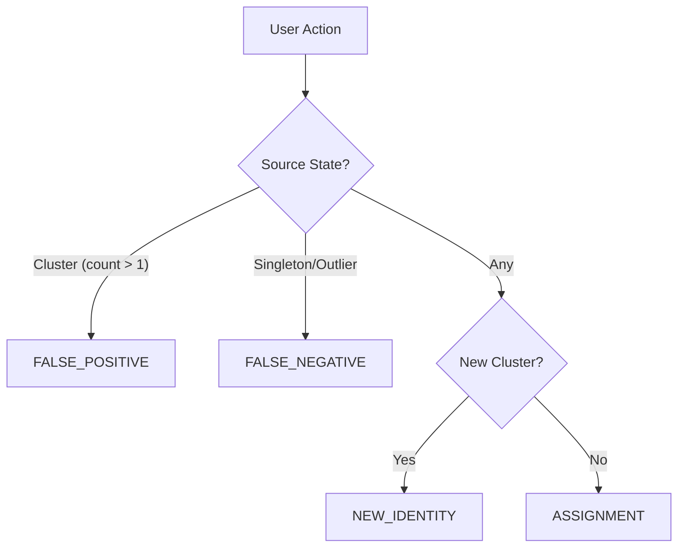

# Implementation Plan: Fix Identity Reassignment & Pose-Aware Representatives

**Related Task**: `fix-identity-reassignment-and-performance-metrics.md`
**Date**: 2025-12-23

## 1. Overview

This implementation addresses three key areas:
1.  **Bug Fix**: `UniqueViolationError` during identity reassignment (false positive correction).
2.  **Metrics**: Distinguishing between False Positives (reassigning matching error) and False Negatives (assigning outlier).
3.  **Enhancement**: Pose-aware representative selection to improve matching for diverse face angles.

## 2. Architecture & Patterns

### Curated Action Semantics
We will introduce strict semantics for user actions to drive metrics:



### Pose-Aware Selection Strategy
Instead of blindly capping representatives at `N=10`, we use a bucketed strategy:

- **Buckets**: 30° pitch/yaw grids (e.g., "Front", "Left-Profile", "Right-Profile", "Up-Left")
- **Bonus**: Allow `+3` extra representatives if they fill an empty pose bucket.
- **Upgrade**: If a new face falls in an *existing* bucket but has significantly better quality (> +0.1), replace the inferior representative.

## 3. Implementation Details

### Phase 1: Core Definitions

#### `recognition/application/orchestration/cluster_curation.py`
Add the action type enum directly here (or shared value object if re-used).

```python
class CurationActionType(str, Enum):
    FALSE_POSITIVE = "false_positive"
    FALSE_NEGATIVE = "false_negative"
    NEW_IDENTITY = "new_identity"
    BLOCK = "cannot_link"
```

### Phase 2: Reassignment Fix

#### `recognition/application/orchestration/cluster_curation.py`
Modify `assign_outlier_to_cluster`:

```python
# Check existing membership GLOBALLY, not just in target
source_cluster_id = await get_identity_cluster_id(...)

if source_cluster_id:
    # Implicit Move
    await remove_identity_from_cluster(..., recompute=True)
    action_type = CurationActionType.FALSE_POSITIVE
else:
    # Pure Assignment
    action_type = CurationActionType.FALSE_NEGATIVE

# Proceed to add_member...
logger.info(..., extra={"action_type": action_type})
```

### Phase 3: Pose-Aware Representatives

#### `recognition/application/settings/clustering.py`
Update `ClusteringSettings`:

```python
pose_diversity_bonus: int = 3
pose_bucket_size: float = 30.0
```

#### `recognition/application/persistence/assignment_writer.py`
Implement `_is_novel_pose` and `_should_upgrade_representative`.

```python
def _get_pose_bucket(identity, size=30.0):
    if not identity.pose_pitch or not identity.pose_yaw: return None
    return (int(identity.pose_pitch // size), int(identity.pose_yaw // size))

async def _should_add_representative(self, decision):
    # ... logic from proposal ...
    if count >= max + bonus: return False
    if count >= max and not _is_novel_pose(...): return False
    # ...
```

## 4. Files to Modify

| File | Changes |
|------|---------|
| `recognition/application/settings/clustering.py` | Add pose settings |
| `recognition/application/orchestration/cluster_curation.py` | Add Enum, fix assignment logic |
| `recognition/application/persistence/assignment_writer.py` | Add pose helpers, update selection logic |
| `recognition/tests/api/test_api_clusters.py` | Test reassignment flow |
| `recognition/tests/unit/test_assignment_writer.py` | Test pose selection logic |

## 5. Completion Checklist

### Scaffolding
- [x] Add `CurationActionType` to `cluster_curation.py`
- [x] Add pose settings to `ClusteringSettings`

### Implementation - Reassignment
- [x] Refactor `assign_outlier_to_cluster` to detect source cluster
- [x] Implement implicit removal if source exists
- [x] Update logging to include `action_type`

### Implementation - Pose Awareness
- [x] Implement `_is_novel_pose` helper
- [x] Implement `_should_upgrade_representative` helper
- [x] Update `_should_add_representative` with bonus logic
- [x] Update `_should_add_representative` with upgrade logic

### Verification
- [x] **Test**: `test_assign_outlier_reassignment_flow` (API level)
- [x] **Test**: `test_pose_novelty_detection` (Unit)
- [x] **Test**: `test_pose_representative_upgrade` (Unit)
- [x] **Manual**: Verify false positive correction in UI does not 500
