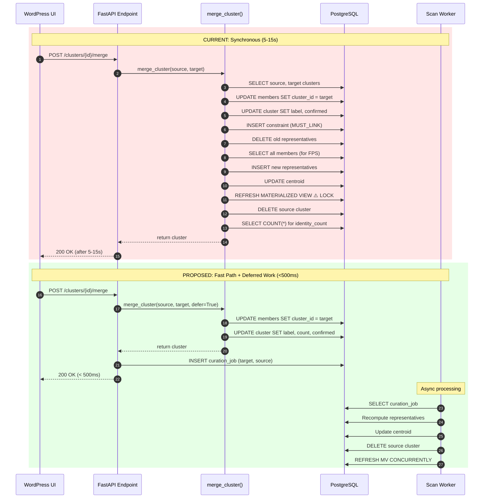

# Merge Path Optimization Findings

**Date**: 2025-12-27  
**Status**: Analysis complete, implementation pending  
**Related**: Session commit fix (4.9.11), latency analysis (4.9.10.a)

---

## Problem Statement

Merge operations and other cluster curation actions stall the UI. Users experience:
- Long wait times (5-15s) for merge confirmation
- 500 errors from deadlocks and transaction timeouts
- UI retries that compound the problem

Previous fixes targeting session/transaction management have not resolved the core latency issue because **the merge path does too much work synchronously**.

---

## Architecture: Current vs. Proposed



---

## Current synchronous merge path
Source: `apps/prototype-description-service/recognition/application/orchestration/cluster_merge.py`

The HTTP merge endpoint calls `ClusterService.merge_cluster()` which runs `merge_cluster()` and currently performs all of the following in-request:
- Load source/target clusters.
- Fetch source members (and media IDs) for logging.
- Bulk update members to target cluster.
- Update target metadata and confirmation state.
- Create MUST_LINK constraint (if repo exists).
- Recompute representatives and centroid for the target cluster.
- Refresh the materialized view for centroids.
- Log + broadcast merge event.
- Delete the source cluster.
- Recount members for identity_count (extra query).

Background tasks are scheduled after the request returns:
- Post-merge retry matching.
- Suggestion refresh for the target cluster.

## High-cost operations in the hot path
Primary latency drivers (all executed in request):
- Representative recompute (`AssignmentWriter.recompute_representatives`) clears reps, loads all members, and runs FPS selection. This is O(n) on cluster size and involves multiple DB round trips.
- Centroid recompute (`AssignmentWriter.recompute_centroid`) loads all representatives and re-normalizes vectors.
- `refresh_centroids_view` triggers `REFRESH MATERIALIZED VIEW`, which can lock and is costly per merge.
- `member_repo.get_by_cluster` is called twice: once to log moved identities and again to compute identity_count. Both are full scans.
- `session.execute(select(MediaIdentityModel.id, MediaIdentityModel.media_id) ...)` for moved media IDs is only used for logging.
- `constraint_repository.create` writes a MUST_LINK record during the merge.
- `cluster_repo.delete(source_cluster)` can cascade deletes for representatives/relations and is potentially expensive.

## Operations not required to respond to the user
For a usable UX, the merge response only needs to confirm that identities were reassigned and the target label is set. The following can be deferred:
- Recompute representatives and centroid.
- Refresh materialized view.
- Detailed moved_identity_ids/moved_media_ids logging (counts are enough).
- MUST_LINK constraint creation (if used for later clustering, it can be asynchronous).
- Final identity_count recomputation via a second full scan.

## Recommended fast path (sync)
Keep the request short and deterministic:
1. Validate tenant and cluster IDs.
2. Bulk move members (`move_members`) and update target label + user_confirmed flag.
3. Update identity_count by `moved` count (no extra scan).
4. Emit a minimal merge event.
5. Return response.

Optional: mark the source cluster as archived/merged instead of deleting in-request. Hard delete can happen later.

## Move offline using existing infrastructure
The codebase already has curation jobs and a scan worker:
- `run_curation_job` (recompute reps/centroid, refresh view, optional incremental clustering)
- `JobService.queue_curation_followup` + `scan_worker.py` (curation job execution)

Proposed offload after merge:
- Queue a curation followup job for the target cluster (and optionally the source cluster if you keep it for audit).
- Move suggestion refresh + retry matching into the same job queue (or coalesce by cluster_id).
- Move MUST_LINK creation to the worker as part of the curation followup.

This reduces request time to a single bulk update + metadata update and pushes all heavyweight work to the worker.

## Additional improvements to reduce merge latency
- Debounce/aggregate follow-up work: if multiple merges occur quickly, dedupe per cluster_id and process once.
- Prefer `REFRESH MATERIALIZED VIEW CONCURRENTLY` (requires unique index) and run it on a schedule rather than per merge.
- Replace full representative recompute with an incremental strategy (preserve existing reps, add top rep from source, recompute later).
- Replace moved_identity logging with a lightweight audit record (cluster IDs + counts) to avoid full scans.
- If delete is expensive, soft-delete source clusters and purge asynchronously.

## Suggested implementation sequence
1. Remove `recompute_representatives`, `recompute_centroid`, and `refresh_centroids_view` from `merge_cluster`.
2. Queue `queue_curation_followup` for the target cluster in the merge endpoint.
3. Coalesce suggestion refresh + retry matching into the worker/job queue.
4. Add MV concurrent refresh or scheduled refresh, and keep merge path free of MV refresh.

## Code anchors
- Merge flow: `apps/prototype-description-service/recognition/application/orchestration/cluster_merge.py`
- Assignment writer recompute: `apps/prototype-description-service/recognition/application/persistence/assignment_writer.py`
- Curation job runner: `apps/prototype-description-service/recognition/application/orchestration/curation_job.py`
- Job queue + worker: `apps/prototype-description-service/recognition/application/orchestration/job_service.py`, `apps/prototype-description-service/recognition/worker/scan_worker.py`
- Cluster MV refresh: `apps/prototype-description-service/recognition/infrastructure/repositories/cluster_repository.py`
- Merge endpoint scheduling: `apps/prototype-description-service/recognition/interface_adapters/http/routers/clusters.py`

---

## Theoretical Foundation (Kleppmann, *Designing Data-Intensive Applications*)

### Why Synchronous Merges Stall

The current merge path violates several principles from Kleppmann's analysis of transaction and latency management:

**1. Long-Held Locks Block Concurrency (Ch. 7, Transactions)**

> "Two-phase locking [...] can have quite unstable latencies, and they can be very slow at high percentiles." (Ch. 7)

The merge operation holds locks on `identity_members`, `identity_clusters`, and triggers `REFRESH MATERIALIZED VIEW` which acquires an `ACCESS EXCLUSIVE` lock. Other requests (list clusters, get identities) block behind these locks, causing cascading stalls.

**2. Multi-Object Transactions Are Expensive (Ch. 7)**

> "With one transaction per request, throughput is limited to the speed at which a single thread can process transactions." (Ch. 7, Serial Execution)

The merge modifies members, clusters, representatives, constraints, and materialized views in a single request. This creates a long "transaction span" where any failure aborts all work.

**3. Derived Data Should Be Computed Asynchronously (Ch. 10, Batch Processing)**

> "The derived data [...] is essentially a cached view of the primary data." (Ch. 10)

Representatives, centroids, and the centroids materialized view are *derived data*. They can become stale temporarily without breaking correctness. Recomputing them synchronously is unnecessary for merge confirmation.

**4. Event-Driven Architecture Decouples Latency (Ch. 11, Stream Processing)**

> "A message broker can act as a buffer if the receiver is unavailable or slow to process messages." (Ch. 11)

The curation job queue already exists. Expensive post-merge work should be published as an event and processed by the scan worker, decoupling user-facing latency from backend processing time.

### Design Pattern: "Confirm Fast, Compute Later"

Kleppmann describes this as the difference between *synchronous request-response* and *asynchronous message passing*:

> "In synchronous systems, you assume that the receiver will receive and process the message before some timeout. In asynchronous systems, the sender doesn't wait for the message to be delivered." (Ch. 8)

For merge operations:
- **Synchronous (fast path)**: Reassign members, update labels, return success
- **Asynchronous (worker)**: Recompute reps, refresh MV, retry matching, delete source

---

## Recommended Implementation

### Phase 1: Fast Merge Path (Immediate Fix)

Modify `merge_cluster()` to only perform essential writes and defer everything else.

**Essential (keep in request)**:
1. Validate tenant/cluster IDs
2. `member_repo.move_members(source, target)` — single UPDATE
3. `cluster_repo.update(target)` — update label, identity_count, user_confirmed
4. Broadcast minimal merge event (counts only, no identity lists)
5. Return response

**Deferred (queue for worker)**:
- `recompute_representatives(target_cluster_id)`
- `recompute_centroid(target_cluster_id)`
- `refresh_centroids_view()`
- `constraint_repository.create(MUST_LINK)`
- `cluster_repo.delete(source_cluster_id)`
- `post_merge_retry_matching(...)`
- `refresh_for_cluster(target_cluster_id)` (suggestions)

### Phase 2: Use Existing Job Infrastructure

The codebase already has `queue_curation_followup` and a scan worker. Queue a curation job with the merge context:

```python
# In clusters.py merge endpoint, after fast merge:
# Pattern: "Confirm Fast, Compute Later" (Kleppmann, Ch. 8 & Ch. 11)
# The synchronous path returns immediately; async worker handles derived data.
await job_service.queue_curation_followup(
    tenant_id=request.tenant_id,
    cluster_ids=[request.target_cluster_id],
    source_cluster_id=cluster_id,  # for deferred deletion
    followup_type="merge",
)
```

### Phase 3: Concurrent MV Refresh

Replace per-merge `REFRESH MATERIALIZED VIEW` with scheduled concurrent refresh:

```sql
-- Pattern: Materialized Views as Derived Data (Kleppmann, Ch. 3 & Ch. 10)
-- "Aggregation: Data Cubes and Materialized Views" - precomputed cache of query results
-- Refreshing on a schedule rather than per-write reduces lock contention.

-- Requires unique index for CONCURRENTLY
CREATE UNIQUE INDEX CONCURRENTLY IF NOT EXISTS idx_cluster_centroids_unique 
ON mv_cluster_centroids (cluster_id);

-- Use CONCURRENTLY to avoid blocking reads
REFRESH MATERIALIZED VIEW CONCURRENTLY mv_cluster_centroids;
```

Run this on a schedule (e.g., every 30s) rather than per-operation. Per Kleppmann Ch. 3:

> "A materialized view is [...] an actual copy of the query results, written to disk."

The tradeoff is staleness vs. write performance—acceptable for derived data like centroids.

---

## Code Changes Required

### File: `recognition/application/orchestration/cluster_merge.py`

**Before** (lines 310-319):
```python
    recompute_reps = getattr(assignment_writer, "recompute_representatives", None)
    if callable(recompute_reps):
        await recompute_reps(target_cluster_id)
    recompute_centroid = getattr(assignment_writer, "recompute_centroid", None)
    if callable(recompute_centroid):
        await recompute_centroid(target_cluster_id)

    refresh_view = getattr(assignment_writer, "refresh_centroids_view", None)
    if callable(refresh_view):
        await refresh_view()
```

**After**:
```python
    # REMOVED: recompute_representatives, recompute_centroid, refresh_centroids_view
    # These are now handled by the curation job worker
```

**Before** (lines 356-357):
```python
    await cluster_repo.delete(source_cluster_id)
```

**After**:
```python
    # REMOVED: source cluster deletion moved to curation job
    # Mark source as merged (soft delete) if needed for audit
```

**Before** (lines 361-362):
```python
    updated.identity_count = len(await member_repo.get_by_cluster(target_cluster_id))
```

**After**:
```python
    # Use count from move_members directly (already computed)
    # No extra query needed
```

### File: `recognition/interface_adapters/http/routers/clusters.py`

**Before** (line 269-280):
```python
    cluster = await cluster_service.merge_cluster(
        source_cluster_id=cluster_id,
        tenant_id=request.tenant_id,
        target_cluster_id=request.target_cluster_id,
        target_label=request.target_label,
    )
    if not cluster:
        raise HTTPException(status_code=status.HTTP_404_NOT_FOUND, detail="Cluster not found")

    # Schedule best-effort retry matching in background
    background_tasks.add_task(run_background_retry, request.tenant_id, request.target_cluster_id)

    # Refresh suggestions for the target cluster
    background_tasks.add_task(run_background_refresh_suggestions, request.tenant_id, request.target_cluster_id)
```

**After**:
```python
    cluster = await cluster_service.merge_cluster(
        source_cluster_id=cluster_id,
        tenant_id=request.tenant_id,
        target_cluster_id=request.target_cluster_id,
        target_label=request.target_label,
        defer_recompute=True,  # NEW: skip expensive operations
    )
    if not cluster:
        raise HTTPException(status_code=status.HTTP_404_NOT_FOUND, detail="Cluster not found")

    # Queue curation job for deferred work (replaces background tasks)
    job_service = await get_job_service(session=session, tenant_id=request.tenant_id)
    await job_service.queue_curation_followup(
        tenant_id=request.tenant_id,
        cluster_ids=[request.target_cluster_id],
        source_cluster_id=cluster_id,
    )
```

### File: `recognition/application/orchestration/curation_job.py`

Add merge-specific followup handling:

```python
async def run_curation_job(
    *,
    tenant_id: str,
    cluster_ids: Sequence[str],
    source_cluster_id: str | None = None,  # NEW: for merge cleanup
    assignment_writer: AssignmentWriter,
    cluster_repo: ClusterRepository,
    cluster_service: ClusterService | None = None,
    run_incremental_clustering: bool = True,
) -> dict[str, int]:
    # Existing recompute logic...
    
    # NEW: Handle merge-specific cleanup
    if source_cluster_id:
        await cluster_repo.delete(source_cluster_id)
    
    # Existing incremental clustering...
```

### File: `recognition/worker/scan_worker.py`

Ensure curation jobs handle the new `source_cluster_id` payload field and delete after recompute.

---

## Expected Impact

| Metric | Before | After (Estimated) |
|--------|--------|-------------------|
| Merge request latency | 5-15s | <500ms |
| Lock hold time | 5-15s | <100ms |
| Deadlock risk | High (long transactions) | Low (short transactions) |
| MV staleness | 0s (always fresh) | ≤30s (scheduled refresh) |

---

## Implementation Checklist

- [ ] Add `defer_recompute` flag to `merge_cluster()` signature
- [ ] Remove recompute_representatives, recompute_centroid, refresh_centroids_view from merge path
- [ ] Remove source cluster deletion from merge path
- [ ] Add `source_cluster_id` to curation job payload
- [ ] Queue curation job in merge endpoint instead of background tasks
- [ ] Handle source cluster deletion in curation job runner
- [ ] Add unique index to mv_cluster_centroids for concurrent refresh
- [ ] Switch to scheduled MV refresh (remove per-operation refresh)
- [ ] Update tests to expect deferred recompute behavior

---