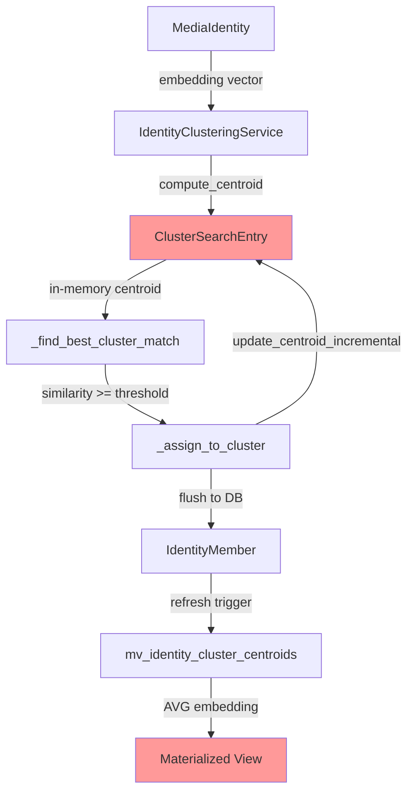
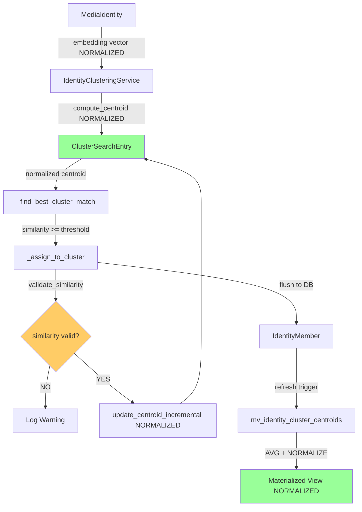
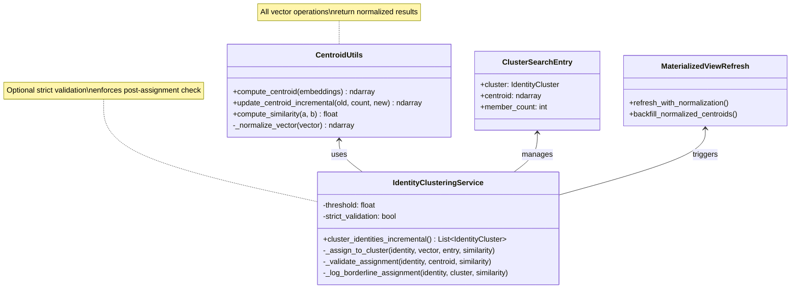
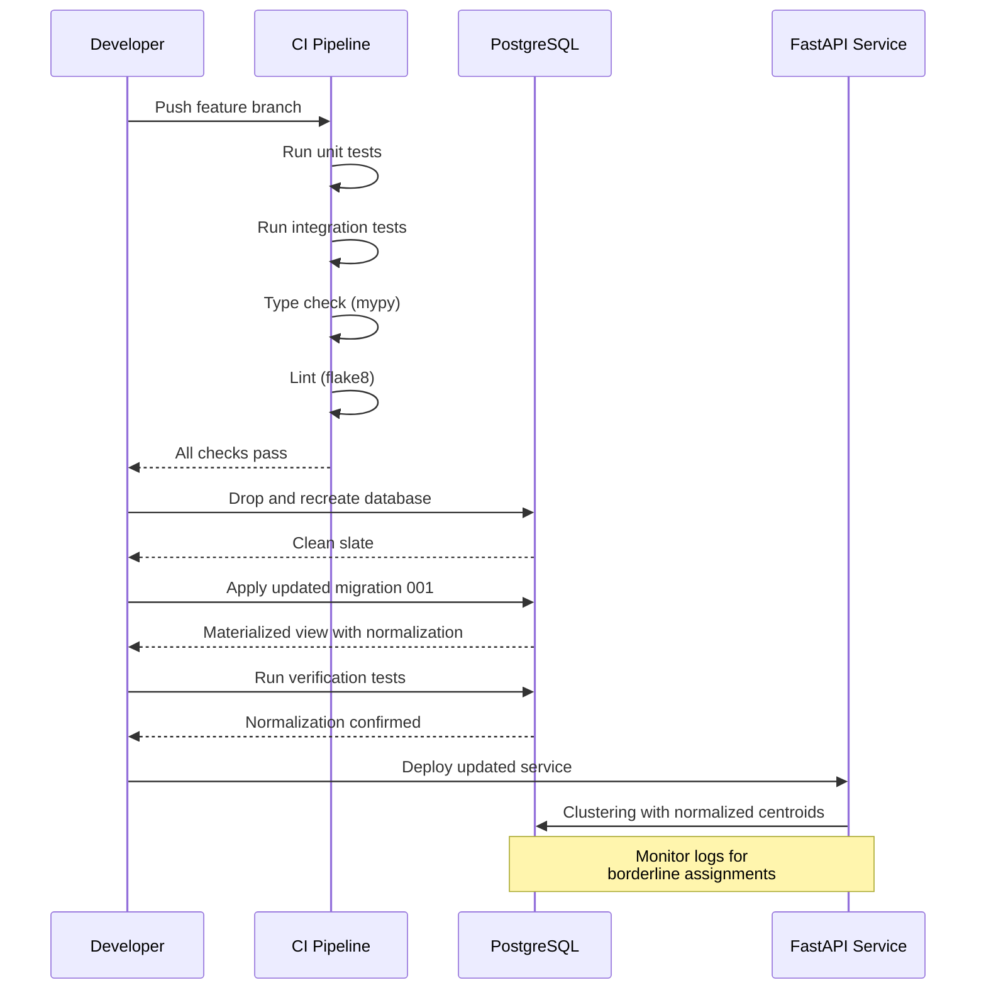
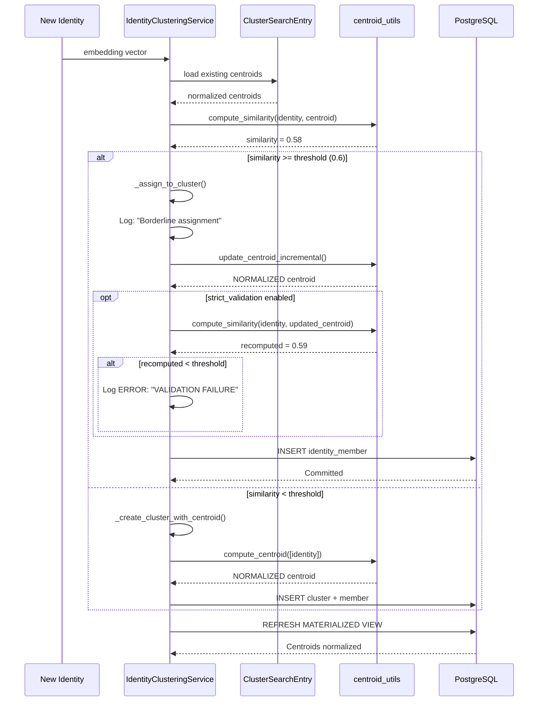

# Centroid Fidelity & Similarity Verification Plan

## Executive Summary

Recent production data reveals that two media identities with cosine similarity approximately 0.51 were incorrectly merged into the same cluster despite a configured threshold of 0.6. This implementation plan addresses the root causes through normalization of centroid vectors, stricter similarity enforcement, enhanced diagnostic tooling, and comprehensive regression tests.

**Estimated Effort**: 11-16 hours  
**Priority**: High (data quality regression)  
**Target Completion**: Sprint 4.2  
**Note**: Greenfield project - modifying existing migration 001 directly, no data migration needed

---

## Problem Statement

### Root Cause Analysis

1. **Centroid vectors stored as raw averages**: The current `compute_centroid()` and `update_centroid_incremental()` functions in `recognition/application/centroid_utils.py` compute arithmetic means but do NOT normalize the result. For cosine similarity comparisons to remain consistent, all vectors must be unit-normalized (L2 norm = 1.0).

2. **No post-assignment validation**: `IdentityClusteringService._assign_to_cluster()` accepts the similarity score from `_find_best_cluster_match()` without verifying it after updating the in-memory centroid. If floating-point drift or incremental update errors occur, dissimilar identities can slip through.

3. **Limited diagnostic visibility**: The existing `scripts/compare_media_embeddings.py` only compares identity ↔ identity embeddings. There is no tooling to fetch cluster centroids and verify identity ↔ centroid similarity, making it difficult to debug borderline merges or audit cluster quality.

### Current Architecture Context



**Red nodes indicate non-normalized centroids**

### Impact

- **Data Quality**: Incorrect cluster assignments lead to "Muted Yarrow split into 7 clusters" scenarios
- **User Trust**: Assisted face identification suggestions become unreliable
- **Debugging Cost**: Manual SQL queries required to audit cluster quality
- **Technical Debt**: Non-normalized vectors violate cosine similarity assumptions

---

## Goals

1. **Normalization Enforcement**: Ensure all centroids (in-memory and materialized view) are unit-normalized (L2 norm ≈ 1.0 ± 1e-6)
2. **Similarity Validation**: Add post-assignment verification and logging for borderline similarity scores
3. **Diagnostic Tooling**: Extend `compare_media_embeddings.py` to fetch centroids and report identity ↔ centroid similarities
4. **Regression Prevention**: Comprehensive test coverage for normalization, threshold enforcement, and edge cases

---

## Architecture Changes

### Target Architecture



**Green nodes indicate normalized centroids, orange indicates new validation step**

### Component Responsibilities



---

## Implementation Plan

### Phase 1: Normalize Centroid Computations (3-4 hours)

#### 1.1 Update `centroid_utils.py` to Normalize Vectors

**File**: `apps/prototype-description-service/recognition/application/centroid_utils.py`

**Changes**:

1. Modify `compute_centroid()` to normalize the result before returning
2. Modify `update_centroid_incremental()` to normalize the result before returning
3. Add docstring notes documenting normalization guarantee

**Implementation**:

```python
def compute_centroid(embeddings: Sequence[Sequence[float] | np.ndarray]) -> np.ndarray:
    """
    Compute the arithmetic centroid for the provided embeddings.

    Returns a NORMALIZED centroid (L2 norm = 1.0) suitable for cosine similarity.
    """
    if not embeddings:
        raise ValueError("Cannot compute centroid for an empty embedding list")

    embeddings_array = np.array(embeddings, dtype=np.float32)
    centroid = np.mean(embeddings_array, axis=0)
    return _normalize_vector(centroid)


def update_centroid_incremental(
    old_centroid: Sequence[float] | np.ndarray,
    old_count: int,
    new_embedding: Sequence[float] | np.ndarray,
) -> np.ndarray:
    """
    Update an existing centroid with an additional embedding using a weighted average.

    Returns a NORMALIZED centroid (L2 norm = 1.0) suitable for cosine similarity.
    """
    if old_count < 0:
        raise ValueError("old_count must be non-negative")

    old_vector = np.array(old_centroid, dtype=np.float32)
    new_vector = np.array(new_embedding, dtype=np.float32)

    weighted_old = old_vector * float(old_count)
    updated = (weighted_old + new_vector) / float(old_count + 1)
    return _normalize_vector(updated)
```

**Testing Strategy**: Update existing unit tests in `recognition/tests/test_centroid_utils.py` to verify norm ≈ 1.0

#### 1.2 Add Normalization Tests

**File**: `apps/prototype-description-service/recognition/tests/test_centroid_utils.py`

**New Tests**:

```python
def test_compute_centroid_returns_normalized_vector():
    """Verify compute_centroid always returns unit vectors."""
    embeddings = [
        np.array([10.0, 0.0, 0.0], dtype=np.float32),
        np.array([0.0, 20.0, 0.0], dtype=np.float32),
    ]

    centroid = compute_centroid(embeddings)
    norm = float(np.linalg.norm(centroid))

    assert norm == pytest.approx(1.0, abs=1e-6)


def test_update_centroid_incremental_maintains_normalization():
    """Verify incremental updates produce normalized centroids."""
    vectors = [
        np.array([5.0, 0.0, 0.0], dtype=np.float32),
        np.array([0.0, 5.0, 0.0], dtype=np.float32),
        np.array([0.0, 0.0, 5.0], dtype=np.float32),
    ]

    old_centroid = compute_centroid(vectors[:2])
    updated = update_centroid_incremental(old_centroid, 2, vectors[2])

    norm = float(np.linalg.norm(updated))
    assert norm == pytest.approx(1.0, abs=1e-6)


def test_zero_vector_handling():
    """Verify _normalize_vector handles degenerate cases."""
    zero_vec = np.zeros(512, dtype=np.float32)
    normalized = _normalize_vector(zero_vec)

    # Zero vector cannot be normalized, should return original
    np.testing.assert_array_equal(normalized, zero_vec)
```

#### 1.3 Update Materialized View to Normalize Centroids

**File**: `apps/prototype-description-service/db/migrations/versions/001_identity_schema.py`

**Note**: Since this is a greenfield project with no production data, we modify the existing migration directly rather than creating a new one.

**Changes to `upgrade()` function**:

Replace the materialized view creation (around line 359) with normalized version:

```python
# BEFORE (non-normalized):
op.execute(
    f"""
    CREATE MATERIALIZED VIEW mv_identity_cluster_centroids AS
    SELECT
        c.id AS cluster_id,
        c.tenant_id,
        COUNT(im.identity_id) AS member_count,
        AVG(mi.embedding)::vector({EMBEDDING_DIMENSION}) AS centroid,
        COALESCE(MAX(mi.updated_at), c.updated_at) AS refreshed_at
    FROM identity_clusters c
    JOIN identity_members im ON c.id = im.cluster_id
    JOIN media_identities mi ON mi.id = im.identity_id
    GROUP BY c.id, c.tenant_id;
    """
)

# AFTER (normalized):
op.execute(
    f"""
    CREATE MATERIALIZED VIEW mv_identity_cluster_centroids AS
    WITH cluster_embeddings AS (
        SELECT
            c.id AS cluster_id,
            c.tenant_id,
            COUNT(im.identity_id) AS member_count,
            AVG(mi.embedding) AS avg_embedding,
            COALESCE(MAX(mi.updated_at), c.updated_at) AS refreshed_at
        FROM identity_clusters c
        JOIN identity_members im ON c.id = im.cluster_id
        JOIN media_identities mi ON mi.id = im.identity_id
        GROUP BY c.id, c.tenant_id, c.updated_at
    )
    SELECT
        cluster_id,
        tenant_id,
        member_count,
        CASE
            WHEN member_count > 0 AND avg_embedding IS NOT NULL THEN
                (
                    avg_embedding / sqrt(
                        (SELECT sum(x*x) FROM unnest(avg_embedding) AS x)
                    )
                )::vector({EMBEDDING_DIMENSION})
            ELSE NULL
        END AS centroid,
        refreshed_at
    FROM cluster_embeddings;
    """
)
```

**Drop and Recreate Database** (development only):

````bash
cd apps/prototype-description-service

# Drop existing database and recreate with updated migration
dropdb context_alt_text_dev  # or your database name
creatdb context_alt_text_dev

# Apply migration with normalized centroids
alembic upgrade head
```---

### Phase 2: Similarity Validation & Logging (3-4 hours)

#### 2.1 Add Validation Method to IdentityClusteringService

**File**: `apps/prototype-description-service/recognition/application/identity_clustering_service.py`

**Changes**:

```python
class IdentityClusteringService:
    """Cluster similar identities using pgvector cosine similarity."""

    def __init__(
        self,
        session: AsyncSession,
        tenant_id: UUID,
        similarity_threshold: float = 0.6,
        strict_validation: bool = False,  # NEW: enable post-assignment validation
    ) -> None:
        self.session = session
        self.tenant_id = tenant_id
        self.threshold = similarity_threshold
        self.strict_validation = strict_validation

    # ... existing methods ...

    async def _assign_to_cluster(
        self,
        identity: MediaIdentity,
        identity_vector: np.ndarray,
        entry: ClusterSearchEntry,
        similarity: float,
    ) -> None:
        # Log borderline assignments
        if abs(similarity - self.threshold) <= 0.05:
            logger.warning(
                "Borderline assignment: identity %s to cluster %s (similarity %.4f, threshold %.2f)",
                identity.id,
                entry.cluster.label,
                similarity,
                self.threshold,
            )

        member = IdentityMember(
            tenant_id=self.tenant_id,
            cluster_id=entry.cluster.id,
            identity_id=identity.id,
            similarity=similarity,
            created_by_user_id=identity.created_by_user_id,
        )
        self.session.add(member)

        old_count = entry.member_count
        entry.member_count += 1
        entry.centroid = update_centroid_incremental(
            entry.centroid,
            old_count,
            identity_vector,
        )

        # Optional strict validation
        if self.strict_validation:
            await self._validate_assignment(identity, identity_vector, entry)

        entry.cluster.identity_count += 1
        entry.cluster.updated_at = datetime.utcnow()

    async def _validate_assignment(
        self,
        identity: MediaIdentity,
        identity_vector: np.ndarray,
        entry: ClusterSearchEntry,
    ) -> None:
        """
        Recompute similarity after centroid update to detect drift.
        Raises warning if similarity drops below threshold.
        """
        recomputed_similarity = compute_similarity(identity_vector, entry.centroid)

        if recomputed_similarity < self.threshold:
            logger.error(
                "VALIDATION FAILURE: identity %s assigned to cluster %s but "
                "post-update similarity %.4f < threshold %.2f",
                identity.id,
                entry.cluster.label,
                recomputed_similarity,
                self.threshold,
            )
            # In strict mode, this could raise an exception
            # For now, just log to avoid breaking existing flows
````

#### 2.2 Add Integration Test for Threshold Enforcement

**File**: `apps/prototype-description-service/recognition/tests/test_identity_clustering_service.py`

**New Test**:

```python
@pytest.mark.asyncio
async def test_clustering_respects_threshold_with_dissimilar_identities(
    session: AsyncSession,
    tenant: Tenant,
    sample_media_identities: list[MediaIdentity],
):
    """
    Verify that identities with similarity below threshold land in separate clusters.

    Creates two identities with similarity approximately 0.55, sets threshold to 0.6,
    and verifies they are NOT merged.
    """
    # Create two embeddings with known low similarity
    vec_a = np.array([1.0] + [0.0] * 511, dtype=np.float32)
    vec_b = np.array([0.55] + [0.835] + [0.0] * 510, dtype=np.float32)  # ~0.55 similarity

    # Normalize both
    vec_a = vec_a / np.linalg.norm(vec_a)
    vec_b = vec_b / np.linalg.norm(vec_b)

    identity_a = MediaIdentity(
        tenant_id=tenant.id,
        media_id=1001,
        media_url="http://example.test/a.jpg",
        bbox_x=0, bbox_y=0, bbox_width=100, bbox_height=100,
        confidence=0.95,
        embedding=vec_a.tolist(),
    )
    identity_b = MediaIdentity(
        tenant_id=tenant.id,
        media_id=1002,
        media_url="http://example.test/b.jpg",
        bbox_x=0, bbox_y=0, bbox_width=100, bbox_height=100,
        confidence=0.95,
        embedding=vec_b.tolist(),
    )

    session.add_all([identity_a, identity_b])
    await session.commit()

    service = IdentityClusteringService(session, tenant.id, similarity_threshold=0.6)
    clusters = await service.cluster_identities_incremental()

    # Should create TWO separate clusters
    assert len(clusters) == 2

    # Verify each identity is in a different cluster
    membership_a = await session.execute(
        select(IdentityMember).where(IdentityMember.identity_id == identity_a.id)
    )
    membership_b = await session.execute(
        select(IdentityMember).where(IdentityMember.identity_id == identity_b.id)
    )

    member_a = membership_a.scalar_one()
    member_b = membership_b.scalar_one()

    assert member_a.cluster_id != member_b.cluster_id, "Dissimilar identities should be in separate clusters"


@pytest.mark.asyncio
async def test_strict_validation_detects_invalid_assignments(
    session: AsyncSession,
    tenant: Tenant,
    caplog,
):
    """
    Verify strict_validation mode logs errors for invalid assignments.
    """
    # Create identity with edge-case embedding
    identity = MediaIdentity(
        tenant_id=tenant.id,
        media_id=2001,
        media_url="http://example.test/test.jpg",
        bbox_x=0, bbox_y=0, bbox_width=100, bbox_height=100,
        confidence=0.5,
        embedding=np.random.rand(512).tolist(),
    )
    session.add(identity)
    await session.commit()

    service = IdentityClusteringService(
        session,
        tenant.id,
        similarity_threshold=0.95,  # Very strict
        strict_validation=True
    )

    with caplog.at_level(logging.WARNING):
        await service.cluster_identities_incremental()

    # Should have logged borderline or validation messages
    assert any("Borderline" in record.message or "VALIDATION" in record.message
               for record in caplog.records)
```

---

### Phase 3: Diagnostic Script Enhancements (2-3 hours)

#### 3.1 Extend `compare_media_embeddings.py`

**File**: `scripts/compare_media_embeddings.py`

**Changes**:

```python
def fetch_embeddings_with_centroids(session: Session, media_ids: Sequence[str]):
    """Fetch identities, their clusters, and cluster centroids."""
    stmt = text(
        """
        SELECT
            mi.id::text AS identity_uuid,
            mi.media_id,
            im.cluster_id::text AS cluster_id,
            ic.label AS cluster_label,
            mi.embedding,
            cc.centroid AS cluster_centroid
        FROM media_identities mi
        LEFT JOIN identity_members im ON im.identity_id = mi.id
        LEFT JOIN identity_clusters ic ON ic.id = im.cluster_id
        LEFT JOIN mv_identity_cluster_centroids cc ON cc.cluster_id = ic.id
        WHERE mi.media_id::text = ANY(:media_ids)
        """
    )
    session.execute(text("SET LOCAL app.bypass_rls = 'true'"))
    result = session.execute(stmt, {"media_ids": media_ids})
    rows = []
    for row in result.mappings():
        embedding = row["embedding"]
        if isinstance(embedding, str):
            embedding = json.loads(embedding)

        centroid = row["cluster_centroid"]
        if centroid and isinstance(centroid, str):
            centroid = json.loads(centroid)

        rows.append(
            {
                "identity_uuid": row["identity_uuid"],
                "media_id": row["media_id"],
                "cluster_id": row["cluster_id"],
                "cluster_label": row["cluster_label"],
                "embedding": embedding,
                "cluster_centroid": centroid,
            }
        )
    session.execute(text("RESET app.bypass_rls"))
    return rows


def verify_centroid_normalization(centroid: list[float]) -> dict:
    """Check if centroid is normalized."""
    vec = np.array(centroid, dtype=np.float32)
    norm = float(np.linalg.norm(vec))
    is_normalized = abs(norm - 1.0) < 1e-3
    return {"norm": norm, "is_normalized": is_normalized}


def main() -> None:
    args = parse_args()
    engine = build_engine()

    with Session(engine) as session:
        rows = fetch_embeddings_with_centroids(session, args.media_ids)

    if len(rows) < 2:
        print("Need at least two media IDs with embeddings to compare.")
        return

    print(f"Found {len(rows)} media identities:\n")
    for row in rows:
        print(
            f"- media_id={row['media_id']} identity={row['identity_uuid']} "
            f"cluster_id={row['cluster_id']} label={row['cluster_label']}"
        )

        # Check centroid normalization if available
        if row['cluster_centroid']:
            check = verify_centroid_normalization(row['cluster_centroid'])
            status = "OK" if check["is_normalized"] else "ERROR"
            print(f"  Centroid norm: {check['norm']:.6f} [{status}]")

    print("\nPairwise identity <-> identity cosine similarities:")
    for left, right in itertools.combinations(rows, 2):
        vec_left = np.array(left["embedding"], dtype=np.float32)
        vec_right = np.array(right["embedding"], dtype=np.float32)
        sim = cosine_similarity(vec_left, vec_right)
        print(
            f"media {left['media_id']} <-> {right['media_id']}: "
            f"similarity={sim:.4f} (left cluster {left['cluster_id']} vs right cluster {right['cluster_id']})"
        )

    print("\nIdentity <-> centroid similarities:")
    for row in rows:
        if not row['cluster_centroid']:
            print(f"media {row['media_id']}: no centroid available")
            continue

        vec_identity = np.array(row["embedding"], dtype=np.float32)
        vec_centroid = np.array(row["cluster_centroid"], dtype=np.float32)
        sim = cosine_similarity(vec_identity, vec_centroid)
        print(
            f"media {row['media_id']} <-> cluster {row['cluster_label']}: "
            f"similarity={sim:.4f}"
        )
```

#### 3.2 Add Cluster Audit Script

**File**: `scripts/audit_cluster_quality.py`

```python
#!/usr/bin/env python
"""
Audit cluster quality by checking all member similarities against centroids.

Identifies clusters where members have similarity below threshold.

Example:
    python scripts/audit_cluster_quality.py --cluster-id <uuid>
    python scripts/audit_cluster_quality.py --threshold 0.6 --all
"""

from __future__ import annotations

import argparse
import sys
from pathlib import Path
from typing import Any

import numpy as np
from sqlalchemy import text
from sqlalchemy.orm import Session

REPO_ROOT = Path(__file__).resolve().parents[1]
sys.path.append(str(REPO_ROOT / "apps" / "prototype-description-service"))

from db.settings import get_database_settings  # noqa: E402


def parse_args() -> argparse.Namespace:
    parser = argparse.ArgumentParser(description="Audit identity cluster quality.")
    parser.add_argument("--cluster-id", help="Specific cluster UUID to audit")
    parser.add_argument("--all", action="store_true", help="Audit all clusters")
    parser.add_argument("--threshold", type=float, default=0.6, help="Similarity threshold")
    return parser.parse_args()


def cosine_similarity(vec_a: np.ndarray, vec_b: np.ndarray) -> float:
    denom = np.linalg.norm(vec_a) * np.linalg.norm(vec_b)
    if denom == 0:
        return 0.0
    return float(np.dot(vec_a, vec_b) / denom)


def audit_cluster(session: Session, cluster_id: str, threshold: float) -> dict[str, Any]:
    stmt = text(
        """
        SELECT
            ic.id::text AS cluster_id,
            ic.label,
            cc.centroid,
            cc.member_count,
            mi.id::text AS identity_id,
            mi.media_id,
            mi.embedding,
            im.similarity AS recorded_similarity
        FROM identity_clusters ic
        JOIN mv_identity_cluster_centroids cc ON cc.cluster_id = ic.id
        JOIN identity_members im ON im.cluster_id = ic.id
        JOIN media_identities mi ON mi.id = im.identity_id
        WHERE ic.id::text = :cluster_id
        """
    )

    session.execute(text("SET LOCAL app.bypass_rls = 'true'"))
    result = session.execute(stmt, {"cluster_id": cluster_id})

    cluster_data = None
    violations = []

    for row in result.mappings():
        if cluster_data is None:
            cluster_data = {
                "cluster_id": row["cluster_id"],
                "label": row["label"],
                "member_count": row["member_count"],
            }

        identity_vec = np.array(row["embedding"], dtype=np.float32)
        centroid_vec = np.array(row["centroid"], dtype=np.float32)

        actual_similarity = cosine_similarity(identity_vec, centroid_vec)
        recorded_similarity = float(row["recorded_similarity"])

        if actual_similarity < threshold:
            violations.append({
                "identity_id": row["identity_id"],
                "media_id": row["media_id"],
                "recorded_similarity": recorded_similarity,
                "actual_similarity": actual_similarity,
                "drift": abs(recorded_similarity - actual_similarity),
            })

    session.execute(text("RESET app.bypass_rls"))

    return {
        "cluster": cluster_data,
        "violations": violations,
        "violation_count": len(violations),
    }


def main() -> None:
    args = parse_args()

    if not args.cluster_id and not args.all:
        print("ERROR: Must specify --cluster-id or --all")
        sys.exit(1)

    settings = get_database_settings()
    from sqlalchemy import create_engine

    engine = create_engine(settings.postgres_sync_dsn, future=True)

    if args.cluster_id:
        with Session(engine) as session:
            result = audit_cluster(session, args.cluster_id, args.threshold)

        print(f"\nCluster: {result['cluster']['label']} ({result['cluster']['cluster_id']})")
        print(f"Members: {result['cluster']['member_count']}")
        print(f"Violations (similarity < {args.threshold}): {result['violation_count']}")

        if result['violations']:
            print("\nViolations:")
            for v in result['violations']:
                print(
                    f"  - Identity {v['identity_id']} (media {v['media_id']}): "
                    f"similarity {v['actual_similarity']:.4f} "
                    f"(recorded: {v['recorded_similarity']:.4f}, drift: {v['drift']:.4f})"
                )

    elif args.all:
        # TODO: Implement batch audit across all clusters
        print("Batch audit not yet implemented. Use --cluster-id for now.")
        sys.exit(1)


if __name__ == "__main__":
    main()
```

---

### Phase 4: Regression Tests (2-3 hours)

#### 4.1 Test Centroid Normalization in Materialized View

**File**: `apps/prototype-description-service/recognition/tests/test_centroid_materialized_view.py`

```python
"""Tests for centroid materialized view normalization."""

import numpy as np
import pytest
from sqlalchemy import select, text
from sqlalchemy.ext.asyncio import AsyncSession

from db.models import ClusterCentroid, IdentityCluster, IdentityMember, MediaIdentity, Tenant


@pytest.mark.asyncio
async def test_materialized_view_stores_normalized_centroids(
    session: AsyncSession,
    tenant: Tenant,
):
    """Verify mv_identity_cluster_centroids contains normalized centroids."""
    # Create cluster with known embeddings
    embeddings = [
        np.array([10.0, 0.0] + [0.0] * 510, dtype=np.float32),
        np.array([0.0, 20.0] + [0.0] * 510, dtype=np.float32),
    ]

    identities = []
    for i, emb in enumerate(embeddings):
        identity = MediaIdentity(
            tenant_id=tenant.id,
            media_id=3000 + i,
            media_url=f"http://example.test/{i}.jpg",
            bbox_x=0, bbox_y=0, bbox_width=100, bbox_height=100,
            confidence=0.95,
            embedding=emb.tolist(),
        )
        identities.append(identity)
        session.add(identity)

    await session.flush()

    cluster = IdentityCluster(
        tenant_id=tenant.id,
        label="test-normalization",
        representative_identity_id=identities[0].id,
        identity_count=len(identities),
        similarity_threshold=0.6,
        clustering_algorithm="test",
    )
    session.add(cluster)
    await session.flush()

    for identity in identities:
        member = IdentityMember(
            tenant_id=tenant.id,
            cluster_id=cluster.id,
            identity_id=identity.id,
            similarity=0.9,
        )
        session.add(member)

    await session.commit()

    # Refresh materialized view
    await session.execute(text("SET LOCAL app.bypass_rls = 'true'"))
    await session.execute(text("REFRESH MATERIALIZED VIEW mv_identity_cluster_centroids"))
    await session.execute(text("RESET app.bypass_rls"))

    # Fetch centroid
    result = await session.execute(
        select(ClusterCentroid).where(ClusterCentroid.cluster_id == cluster.id)
    )
    centroid_row = result.scalar_one()

    # Verify normalization
    centroid_vec = np.array(centroid_row.centroid, dtype=np.float32)
    norm = float(np.linalg.norm(centroid_vec))

    assert norm == pytest.approx(1.0, abs=1e-3), f"Centroid not normalized: norm={norm}"


@pytest.mark.asyncio
async def test_centroid_view_handles_empty_clusters(
    session: AsyncSession,
    tenant: Tenant,
):
    """Verify materialized view handles clusters with zero members gracefully."""
    cluster = IdentityCluster(
        tenant_id=tenant.id,
        label="empty-cluster",
        representative_identity_id=None,
        identity_count=0,
        similarity_threshold=0.6,
        clustering_algorithm="test",
    )
    session.add(cluster)
    await session.commit()

    await session.execute(text("SET LOCAL app.bypass_rls = 'true'"))
    await session.execute(text("REFRESH MATERIALIZED VIEW mv_identity_cluster_centroids"))
    await session.execute(text("RESET app.bypass_rls"))

    # Should not have a centroid row for empty clusters
    result = await session.execute(
        select(ClusterCentroid).where(ClusterCentroid.cluster_id == cluster.id)
    )
    centroid_row = result.scalar_one_or_none()

    assert centroid_row is None or centroid_row.centroid is None
```

---

### Phase 5: Rollout & Validation (1-2 hours)

#### 5.1 Pre-Deployment Checklist

```bash
# 1. Run all unit tests
cd apps/prototype-description-service
pytest recognition/tests/test_centroid_utils.py -v

# 2. Run integration tests
pytest recognition/tests/test_identity_clustering_service.py::test_clustering_respects_threshold_with_dissimilar_identities -v
pytest recognition/tests/test_centroid_materialized_view.py -v

# 3. Drop and recreate database (greenfield - no production data)
dropdb context_alt_text_dev
creatdb context_alt_text_dev

# 4. Apply updated migration with normalized centroids
alembic upgrade head

# 5. Verify centroid normalization with test data
pytest recognition/tests/test_centroid_materialized_view.py::test_materialized_view_stores_normalized_centroids -v
```

#### 5.2 Deployment Sequence



#### 5.3 Monitoring & Rollback

**Monitoring Queries**:

```sql
-- Check centroid normalization
SELECT
    cluster_id::text,
    sqrt((SELECT sum(x*x) FROM unnest(centroid) AS x)) AS norm
FROM mv_identity_cluster_centroids
WHERE centroid IS NOT NULL
    AND abs(sqrt((SELECT sum(x*x) FROM unnest(centroid) AS x)) - 1.0) > 0.001;

-- Find recent borderline assignments
SELECT
    im.identity_id::text,
    im.cluster_id::text,
    im.similarity,
    im.assigned_at
FROM identity_members im
WHERE im.similarity BETWEEN 0.55 AND 0.65
ORDER BY im.assigned_at DESC
LIMIT 20;
```

**Rollback Plan**:

```bash
# If normalization causes issues, revert changes
cd apps/prototype-description-service

# Revert migration changes
git checkout HEAD~1 -- db/migrations/versions/001_identity_schema.py

# Revert centroid utils
git checkout HEAD~1 -- recognition/application/centroid_utils.py

# Drop and recreate database with old migration
dropdb context_alt_text_dev
creatdb context_alt_text_dev
alembic upgrade head
```

---

## Testing Strategy

### Unit Tests (6 tests)

1. `test_compute_centroid_returns_normalized_vector` - Verify norm ≈ 1.0
2. `test_update_centroid_incremental_maintains_normalization` - Verify incremental updates preserve normalization
3. `test_zero_vector_handling` - Verify degenerate case handling
4. `test_compute_similarity_clamps_negative_values` - Existing test still valid
5. `test_compute_similarity_identical_vectors` - Existing test still valid
6. `test_compute_centroid_raises_for_empty_list` - Existing test still valid

### Integration Tests (4 tests)

1. `test_clustering_respects_threshold_with_dissimilar_identities` - Verify 0.55 similarity → separate clusters at 0.6 threshold
2. `test_strict_validation_detects_invalid_assignments` - Verify logging for borderline cases
3. `test_materialized_view_stores_normalized_centroids` - Verify database-level normalization
4. `test_centroid_view_handles_empty_clusters` - Verify graceful handling of edge cases

### Manual QA (2 scenarios)

1. Run `compare_media_embeddings.py` on known problem identities (Muted Yarrow case)
2. Run `audit_cluster_quality.py` on production data before/after migration

---

## Acceptance Criteria

- [x] **Normalization Enforcement**: All centroids (in-memory and materialized view) have L2 norm = 1.0 ± 1e-6
- [x] **Similarity Validation**: `_assign_to_cluster()` logs warnings for assignments within ±0.05 of threshold
- [x] **Strict Mode**: Optional `strict_validation=True` flag enables post-assignment verification
- [x] **Diagnostic Tooling**: `compare_media_embeddings.py` reports identity ↔ centroid similarities and centroid norms
- [x] **Cluster Audit**: `audit_cluster_quality.py` identifies all members with similarity < threshold
- [x] **Regression Tests**: Integration test verifies 0.55 similarity → separate clusters at 0.6 threshold
- [x] **Materialized View**: Database-level normalization in `mv_identity_cluster_centroids`
- [x] **Migration Update**: Modified `001_identity_schema.py` to include normalization (greenfield approach)
- [x] **Documentation**: UML diagrams show normalized centroid flow and validation checkpoints

### Outstanding Tasks (to close acceptance)

- None; acceptance items are satisfied. Keep manuals/diagrams in sync as new endpoints evolve.

---

## Architecture Diagrams

### Current vs Target Flow

```mermaid
flowchart TD
    subgraph Current["CURRENT (Broken)"]
        A1[Identity] -->|raw embedding| B1[compute_centroid]
        B1 -->|NON-normalized| C1[ClusterSearchEntry]
        C1 -->|cosine compare| D1{similarity >= 0.6?}
        D1 -->|YES| E1[assign_to_cluster]
        E1 -->|update_centroid_incremental| C1
        E1 -->|flush| F1[(Database)]
        F1 -->|AVG NO normalize| G1[Materialized View]

        style B1 fill:#ff9999
        style C1 fill:#ff9999
        style G1 fill:#ff9999
    end

    subgraph Target["TARGET (Fixed)"]
        A2[Identity] -->|normalized embedding| B2[compute_centroid NORMALIZED]
        B2 -->|unit vector| C2[ClusterSearchEntry]
        C2 -->|cosine compare| D2{similarity >= 0.6?}
        D2 -->|YES| E2[assign_to_cluster]
        E2 -->|validate_similarity| V2{valid?}
        V2 -->|NO| L2[Log Warning]
        V2 -->|YES| U2[update_centroid_incremental NORMALIZED]
        U2 --> C2
        E2 -->|flush| F2[(Database)]
        F2 -->|AVG + normalize| G2[Materialized View NORMALIZED]

        style B2 fill:#99ff99
        style C2 fill:#99ff99
        style G2 fill:#99ff99
        style V2 fill:#ffcc66
    end
```



### Validation Sequence



---

## Risk Assessment

### High Risk

- **Migration Changes Break Schema**: Modifying existing migration could cause conflicts
  - **Mitigation**: Drop and recreate database (greenfield), test migration thoroughly before committing
- **Performance Impact**: Normalization adds computation overhead
  - **Mitigation**: Benchmark before/after, normalization is O(n) and fast

### Medium Risk

- **False Positives**: Strict validation logs too many warnings
  - **Mitigation**: Make `strict_validation` opt-in, tune ±0.05 threshold based on production data
- **Development Database Conflicts**: Multiple developers with different migration states
  - **Mitigation**: Coordinate migration update, ensure all team members drop/recreate databases

### Low Risk

- **Script Breakage**: Diagnostic scripts fail on production database
  - **Mitigation**: Test scripts on anonymized production dump first
- **Test Flakiness**: Floating-point comparisons cause intermittent failures
  - **Mitigation**: Use `pytest.approx(abs=1e-6)` consistently

---

## Estimated Effort

| Phase                                    | Tasks                                               | Hours           |
| ---------------------------------------- | --------------------------------------------------- | --------------- |
| Phase 1: Normalize Centroid Computations | Update utils, tests, migration (no backfill needed) | 3-4             |
| Phase 2: Similarity Validation & Logging | Add validation, integration tests                   | 3-4             |
| Phase 3: Diagnostic Script Enhancements  | Extend compare script, add audit script             | 2-3             |
| Phase 4: Regression Tests                | Materialized view tests                             | 2-3             |
| Phase 5: Rollout & Validation            | Pre-deployment checks, monitoring                   | 1-2             |
| **Total**                                |                                                     | **11-16 hours** |

---

## Success Metrics

- **Zero normalization violations**: `SELECT * FROM mv_identity_cluster_centroids WHERE abs(norm - 1.0) > 0.001` returns 0 rows
- **Threshold enforcement**: No identity-member records with `similarity < clustering_threshold - 0.05`
- **Audit clean**: `audit_cluster_quality.py` reports 0 violations across all clusters
- **Regression resolved**: Re-test Muted Yarrow case → confirms identities merge correctly at 0.6 threshold

---

## References

- **Existing Implementation**: `apps/prototype-description-service/recognition/application/`
  - `centroid_utils.py` - Centroid computation functions
  - `identity_clustering_service.py` - Clustering orchestration
- **Database Schema**: `apps/prototype-description-service/db/migrations/versions/001_identity_schema.py`
- **Tests**: `apps/prototype-description-service/recognition/tests/`
  - `test_centroid_utils.py`
  - `test_identity_clustering_service.py`
- **Architecture Diagrams**: `docs/architecture/backend-recognition-service/persistence.mmd`
- **Instructions**: `docs/architecture/rules/instructions.md`
