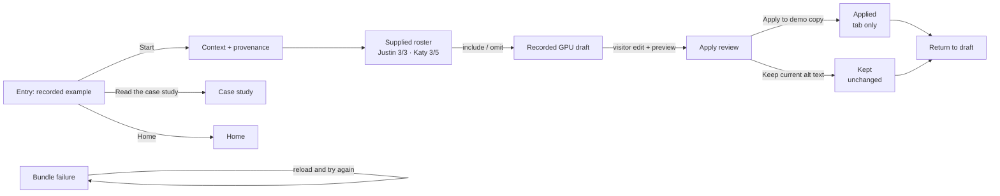

# GUIDEPOLISH-1 — public guide narrative report

**Lane:** `guidepolish-v2-narrative`  
**Task:** `GUIDEPOLISH-1`  
**Source revision inspected:** `f73fc78` adapter checkpoint
**Scope:** signed-out `/guide/` narrative and composition only. The admin live
surface, root route, scenario state, generated catalog, and PHP route remain
owned by sibling lanes or existing sources.

## D0 — Source reconciliation

The checked-out scenario is the newer supplied fixture, not the older
two-reference/short-baseline revision. It contains the long AltText.ai
starting text, three Justin Trudeau reference photographs, three displayed Katy
Perry photographs from a five-photo saved set, four recorded Qwen3-VL sample
drafts, and a `saved-build` origin. The public entry is intentionally the
two-action surface (Start and Read the case study); no recording action is
restored.

The public composition preserves the existing `div` root, `data-scope="public"`,
in-tab state, no preselection, face-card galleries, and admin `main`/live
composition. The scenario state was not edited.

## D1 — Public entry

`GuidedPrototypeEntrance` now uses public-only title and introduction keys. The
scope states that this is a supplied example roster with recorded drafts and
that changes stay in the demo tab. Home and case-study escape links remain, as
does the working Start action and secondary case-study action. Admin title,
scope, live disclosure, and case-study copy remain on the generated catalog.

## D2 — Supplied roster explanation

`RecordedWalkthrough` adds one compact, read-only explanation immediately before
the existing face cards. It explains the supplied roster, the editorial nature
of include/omit choices, and that the existing reference galleries are evidence
for this example rather than a roster editor. The cards and their actual data
remain the only galleries; no duplicate image set or persistence control was
added. A public choice-summary paragraph names both current people and renders
each person’s current inclusion/omission/pending state.

## D3 — Provenance

The full existing before-text attribution is now inside the existing provenance
`details`: AltText.ai, free web demo, date, no supplied names or keywords, both
people described without names, one recorded sample, and unedited wording. The
AltText.ai link and recorded face-run/photo credits remain. The comparison
boundary is separate from the live feedback region and makes no quality or
recognition-proof claim.

## D4 — Recorded and visitor-edit origins

The public draft surface receives the additive recorded-origin label supplied by
the editor sibling and a nearby supplied-page-context explanation. Existing
state-derived visitor-edit labeling remains authoritative after edits; preview
invalidation, pending-choice confirmation, apply guards, undo, keep, reset,
history, and focus behavior are unchanged. The public page still performs no
recognition or write request.

## D5 — Bounded completion

Both applied and kept public outcomes include an in-tab-only scope statement and
a short next-batch explanation. The copy does not claim WordPress/media/library
updates, verified identities, saved roster data, or time saved. No unresolved
contact CTA was added.

## UX-map inventory and canon critique

The machine inventory in `apps/prototype-wp-alt-context/docs/ux-maps/public-guide.uxmap.json`
now has two entry actions, the actual three-of-three / three-of-five gallery
coverage, recorded GPU versus visitor-edit wording, bounded applied/kept
outcomes, and the current fallback. The WorkBay canvas CLI (`workbay`,
`workbay-cli`, `uxmap`, `ux-map`, and `canvas`) is not installed in this
worktree. The following hand-render is therefore evidence of the changed
inventory, not a claim that the WorkBay renderer ran.

```text
  [Entry: recorded example]
       | Start
       v
  [Context + provenance]
       v
  [Supplied roster: Justin 3/3, Katy 3/5]
       | include / omit (no preselection)
       v
  [Recorded GPU draft]
       | visitor edit -> preview -> apply
       +--------------------+
       |                    |
       v                    v
  [Applied: tab only]  [Kept: unchanged]
       |                    |
       +---------> [Return to draft]

  Entry -- Read the case study --> [Case study]
  Entry -- Home ------------------> [Home]
  Bundle failure -----------------> [Fallback: reload and try again]
```



Canon critique: `[NAV-08]` is met by the concise title/introduction and two
real entry actions; `[NAV-07]` is met by Home and case-study escape links;
`[HAI-02]` and `[CLM-03]` are supported by explicit source/origin disclosure
without turning one recorded sample into proof; `[PROD-03]` is supported by
the tab-only applied/kept boundary; and `[NDM-07]` is supported by preserving
provenance through visitor edits. The map deliberately does not imply live
generation, WordPress writeback, or roster persistence.

## D6–D7 boundary disposition

D6 root-site copy and PHP route behavior are sibling-owned. The current UX-map
schema rejects `domain_state_mappings` and `slices`; those unsupported fields
were removed while preserving the state and ownership explanation above. The
map parses as JSON and retains the canonical inventory keys. No WorkBay canvas,
UX-map, or canvas CLI is installed in this lane, so the ASCII and Mermaid
diagrams above are hand-rendered evidence rather than a renderer claim.

Provisioning ran separately with `npm ci --ignore-scripts --no-audit --no-fund`
(657 packages added). Targeted verification passed: RecordedWalkthrough and
public-boundary, 21/21 tests; publicGuideCopy, 3/3 tests. The first targeted
run exposed a missing live-status test hook and an external-link hint included
in the provenance text assertion; both were corrected in the owned
composition. No screenshot or live network capture is claimed from this lane.

## Rollback

Revert the lane commit for this task. The scenario state and generated shared
catalog do not require rollback because they were not edited.
