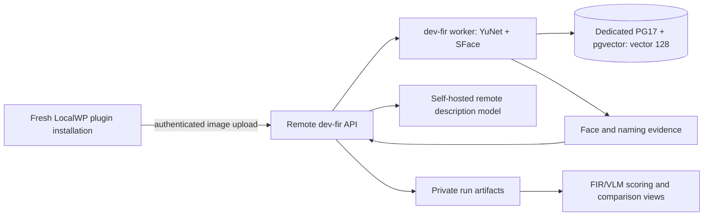

# FIR development installation and measurement wave

Date: 2026-09-19 · Status: assessed; implementation and live qualification pending
Author: Codex · Intake: `MAINT-FIRWAVE-20260919`
Source checkout: `6b1921465ada734b6af90f9a706ed3a3844507e1`

Build a fresh LocalWP installation against an isolated remote `face_pipeline` service and a fresh SFace 128D PostgreSQL database. Reuse the existing FIR and VLM instruments, extend their missing measurement contracts, and compare clustering configurations visually. Development readiness and production-quality qualification are separate gates. No production default, deployment, corpus label, or model setting was changed by this assessment.

Start with the [scope](../../scopes/fir-development-and-measurement-wave.md), [E24 epic](../../epics/v0.5.0/fir-development-and-measurement-epic.md), and [first task](../../tasks/firdv/FIRDV-1-isolated-development-install-task-plan.md). The [corpus/metrics assessment](fir-occlusion-corpus-and-metrics-2026-09-19.md) and [harness/bake-off plan](../../tasks/firdv/FIRDV-2-comparative-harness-and-bakeoff-task-plan.md) supply the measurement contract.

## Evidence precedence and prior art

The requested [HTML research register](../../../benchmarks/reports/fir-embeddings-dims-detectors-qa-20260723.html) is **v11, revised September 4**, despite its July filename. Its current reconciliation, R0–R6 work register, face-level annotation requirements and calibration rules take precedence over the historical July sections. It is research and diagnostic evidence, not a passed cutover gate.

Codemap was used for structural discovery and exact function reads. Some ignored deployment scripts are not indexed; their already-known paths were inspected directly after graph searches returned no result. The handoff database's `find_related_prior_work` returned `ok_with_results`, provider `gte-base-en-v1.5`, without degradation. A new-task `semantic_reinjection_packet` initially returned `no_embeddings`; this was task-local coverage, **not** failure of cross-task semantic retrieval. Keyword projections then retrieved the full identified decisions.

| Prior art | Evidence and disposition |
| --- | --- |
| FIR23-STACK, semantic top hit | Decision **4315** records tooling merged at `71940022`; **2950**, **3470**, **4273** establish own network, model mount, ingress and refusal rules. Physical stand-up remained open in that record. Do not rebuild all tooling because the September 11 assessment says it was unmerged. |
| FIR23 incident / cutover policy | Decisions **2947** and **3250** reject per-request profile switching and keep production on the incumbent until FIR matures. User now explicitly authorizes the separate development installation. |
| FIR-13 and FIR-17 | Decision **10861** records gate-contract implementation; **10888** records the OACT sign-fix merge. Current source confirms both. Preserve null gate ratification and dark coefficient; do not schedule the sign fix again. |
| VECVLM-1 | Decisions **2798**, **2800**, **2806**, **2825** retain pgvector, reuse the bake-off, and nominate dense/MoE Qwen candidates. The later review explicitly corrected an unsupported MTP accuracy claim and a 128D/512D confusion. Candidate feasibility and current artifacts still need revalidation. |
| VLM-6 / benchmark artifact policy | Decisions **2584** and **2629** establish private artifact handling. Current `.gitignore` subsequently allowlists `benchmarks/{plans,manifests,reports}`; it is **not** a blanket ignore. Put image-level private allocations in ignored `benchmarks/private/`, keep sanitized protocols/schemas in docs, and verify ignore rules per artifact. |
| FIR-9 | Decision **3240** places cluster curation in Workbench and treats projection as diagnostic. Current graph confirms atlas tables/repository/tests, **not a complete comparative visualization application**. |
| DESCQUAL-2 | [Implementation report](../../tasks/descqual/DESCQUAL-2-fact-annotation-pilot-implementation-report.md): sampling and annotation-packet machinery exists; real human annotation is still a separate activity. Reuse its nonresponse and grouped-sampling protections. |
| Recent cost debt | [GPU burst cost observability](../../tasks/tech-debt/gpu-burst-cost-observability.md): no sanctioned aggregate run/cost path or burst-to-run cost ledger. One timed batch and an assumed hourly rate are not measured unit economics. |
| Recent grounding gate | [GPUFLOW-3 position evaluation](../GPUFLOW-3-position-accuracy-eval-20260918.md): multi-person grounding remains separately gated. A set of correct names does not prove correct placement. |

## What the checkout actually contains

Paths below are relative to `apps/prototype-description-service/` unless stated otherwise. Built means source exists; it does not mean a live service was verified.

| Surface | Current evidence | Consequence |
| --- | --- | --- |
| FIR runtime | `recognition/infrastructure/embeddings/runtime_factory.py::build_embedding_runtime`; `FacePipelineFaceDetector`; `FacePipelineSettings` | YuNet → five-point alignment → SFace is selectable. Global default remains InsightFace. Pin FIR on **both API and worker** in the new stack. |
| Embedding space | `assert_three_way_embedding_dimensions`; `recognition/application/embedding/manifest.py::active_embedding_model_id`; `.env.fir.example` | Set `RECOGNITION_FACE_PIPELINE_PROFILE=face_pipeline`, `PGVECTOR_DIM=128`, and `/data/cache/face_pipeline` model path together. Verify actual DB typmods and active model, not just the env file. |
| Deployment | Root `scripts/deploy/recognition-service.sh::env_to_tag` maps `dev` and `dev-fir` to `dev`; template has its own PG volume/network but auth off | Storage isolation exists in the design; image rollback independence does not. Give the FIR deployment an independent immutable image reference and authenticated development tenant. |
| Description service | `.env.fir.example` describes captioning as optional and comments out adapter selection | This is insufficient for the requested installation. Verify the correct image variant and a real self-hosted remote description profile end to end. A seeded response is not acceptance evidence. |
| GPU lifecycle | [Environment runbook](../../runbooks/gpu-demo-env-flip.md), section 1b | `dev-fir` is intentionally omitted from the snapshot producer registry. Add it only after its load publisher is fresh and usable; a missing registered producer can block GPU start for every environment. |
| OACT | `recognition/application/assignment/quality.py::compute_quality_adjustment` adds **positive** coefficient × severity; default coefficient 0 | Sign correction is already present. A nonzero value is still uncalibrated, and a scalar eye-patch proxy is not spatial visibility. |
| Open-set measurement | `scripts/eval_harness/{open_set_identification,gate_contract,union_adjudication,fir_bakeoff_run}.py` | Reuse. The gate manifest's false-identification budget and ratification are null. Instrument availability is not gate completion. |
| Real occlusion scoring | `scripts/eval_harness/report.py::build_real_occlusion_pairs` broadcasts image tags to all named boxes and skips `item.error` | Add per-face conditions and a full expected-unit ledger. Otherwise wrong-wearer labels and dropped failures bias results. |
| Identity-score export | `MediaIdentityService.list_by_media_ids` emits detector confidence and null debug match similarity; `_find_best_centroid_match` initializes similarity at zero | Complete FIR-16's real pre-threshold score path; distinguish all-negative galleries from empty galleries. Never substitute detector confidence for identity similarity. |
| VLM timing | `scripts/eval_harness/bakeoff.py::_stamp_timing_and_gpu` records warmup, cold load, per-item latency and GPU fields under closed-serial concurrency 1 | Reuse instrumentation, preserving its load-loop label. It does not establish open-loop latency under load; add arrival/scheduling observations only for claims requiring them. |
| Attribution/live comparison | FIR-15/FIR-16 plans name oracle-ladder and cross-stack work; graph did not find their proposed attribution/ladder modules or `score_open_set` | Treat missing integration as implementation work; verify exact current branch at kickoff. Existing primitives should not be rewritten. |
| Atlas | `db/models/atlas.py`, `recognition/infrastructure/repositories/atlas_repository.py` and associated tests | Reuse provenance, tenant/purge and point identity contracts. Comparative projection, linked views and immutable evaluation runs remain scoped work, not assumed shipped UI. |

## Remote topology and database decision

WordPress needs no public endpoint. Its PHP runtime sends image bytes to the reachable remote API; the remote service must not need to fetch a `.local` image URL. Reuse the existing multipart transport. Prefer private authenticated ingress over the existing private network; if existing authenticated TLS ingress is operationally simpler, the WP frontend may still remain local. A remote GPU model may share an existing host only with scheduling, load-producer and resource isolation proven; never benchmark concurrently with serving traffic and call that a controlled comparison.

The database is a **fresh** `alt_context_dev_fir` with separate role, volume, network and blob namespace. Re-extract embeddings from source pixels. Do not cast, truncate, pad or copy 512D vectors into the new space. Re-enroll confirmed people using FIR-derived vectors; maintain source-image/face identifiers for comparisons, not cross-database cluster IDs. Verify representative rows, centroid/materialized-view dimensions and model stamps as well as media embeddings. Equal dimensions alone do not prove the same model/preprocessing/region space.

Three embedding uses must remain distinct: handoff semantic embeddings retrieve engineering history; caption/whole-image semantic embeddings can retrieve annotation candidates; FIR embeddings support identity. Neither of the first two is an identity gallery or gold label source. Region/head/torso experiments need their own typed spaces and calibrated fusion if later pursued.

## Would PostgreSQL 19 help FIR?

**It does not unblock this implementation.** SFace's 128D storage, cosine search, tenant filtering and exact-search diagnostics fit the current pgvector architecture. Model information content and occlusion robustness do not improve because the database major version changes. Retain PG17 with a supported patched minor and a recorded image digest; record PostgreSQL server version and vector extension version independently. [pgvector documentation](https://github.com/pgvector/pgvector) supports both exact and approximate search on the existing platform.

The official release information checked September 19 still identifies PostgreSQL 19 Beta 3; it does not establish a production-ready 19.1. [PostgreSQL announcement](https://www.postgresql.org/about/news/postgresql-186-1711-1615-1519-1424-and-19-beta-3-released-3365/). Preserve [PG19 roadmap §11](../../roadmaps/roadmap-pg19-upgrade.md#11-decision-and-revisit-triggers): GA, at least 19.1, pinned arm64 pgvector image, dump/restore rehearsal, and its product/freeze triggers.

Potential later benefits are operational: measured I/O/maintenance improvements or simpler hot SQL paths. None supplies face features, corrects label bias, or reconciles incompatible embedding spaces. If retrieval becomes a bottleneck, first compare exact top-k with the current approximate index, including tenant-filtered recall@k, p95/p99, memory, gallery size and extension settings. A PG17/19 replay is then a separate experiment with fixed embeddings and workload. No new vector store or database-major migration belongs in this phase's critical path.

## Canon validation: mechanism → concrete plan change

Validation used the local `heuristics-canon-research/distilled/` corpus and its referenced original-source mechanisms. These are design warrants, not measured ACX results. [Canon](https://github.com/darce/heuristics-canon) is the durable upstream reference; paths below are relative to that repository.

| Canon / distilled source | Mechanism checked | Required application / counter-case |
| --- | --- | --- |
| EMB-01, IDX-01/02; `ml-systems/bruch-vector-retrieval.md`, `zezula-similarity-search.md` | Model/index contract and approximate vs exact retrieval | Separate 128D/512D stores; record preprocessing and model hashes; benchmark ANN loss separately. Small galleries may warrant exact search. |
| EMB-11/12/14/15, EVAL-28; occlusion survey, OccFace, PLGSA distillations | Spatial support, correspondence, visibility, real occlusion | Per-face region labels; oracle-before-predicted experiments; periocular only where eye-region evidence survives. No arbitrary masking of dense SFace coordinates. |
| EVAL-16/18/19; `ml-systems/janus-benchmark-c.md` | Unknown rejection, end-to-end misses, FPI anti-dilution | Detection and timeout failures remain in denominators. Fixed calibration threshold; FPI counts plus declared fixed-denominator FPIR. |
| AUDIT-02/03/04; `ml-systems/pepe-medical-test-evaluation.md` | Verification bias and prevalence-dependent precision | Inspect detector/keyword negatives and keep a probability arm separate from enriched challenge data. Positive-only review cannot estimate sensitivity. |
| AUDIT-11; DESCQUAL-2 and Lohr sampling source | Correlated observations reduce effective sample size | Group by identity/session/duplicate components; report effective units. More synthetic twins do not create more independent people. |
| CAL-01/03, DRIFT-03; calibration and ML debt sources | A threshold is an operating policy, not a calibrated probability | Freeze each model's policy on calibration; never force test FPIR to target by retuning. Uncalibrated defaults may support development smoke only. |
| `ml-systems/model-cards.md` | Intended use and disaggregated evidence | Separate development readiness from reportable quality, publish empty cells and limitations, retain model/data lineage. |
| VIZ; `interaction/visualization-analysis-design-munzner.md`, ch. 12 | Small multiples and coordinated views reduce memory burden | Side-by-side runs with linked face selection and stable display for same embeddings; table/grid alternative. Projection is diagnostic. |
| DDIA / Release It! / latency source mechanisms in v11 | Replayable derived state, bulkheads and whole-request deadlines | Immutable run/annotation hashes, bounded rescue work, idempotent requests, queue/cold-start/failure timing, explicit teardown. |

## Reconciled scheduling

1. Finish dev-fir isolation and real remote descriptions; collect readiness evidence. This does not require proving an occlusion gain first.
2. Repair corpus/denominators and integrate FIR-16/VLM-6 run records; deliver clustering comparisons on a deliberately small diagnostic set.
3. Run calibrated recognition comparisons and oracle attribution. Change one source of error at a time.
4. Freeze recognition evidence, compare self-hosted VLM candidates, then test the winning combination end to end. Report quality and full burst economics together.
5. Decide whether any inference-only visibility/localization branch earned further work. Training and production switch-over retain their separate existing evidence gates.

The first junior assignment is the bounded RED contract slice in FIRDV-1, followed by a separate implementation dispatch on `codex-remote`, `gpt-5.6-luna`, `max`. No deployment credentials, private media, threshold ratification, human annotation or paid benchmarking belong in that first dispatch.

## Research worker and verification limits

The requested `codex-remote` worker served `gpt-5.6-luna` at `max` in pass `firwave-research-20260919-pass2`. It returned partial harness observations, but the runner ended with `review handoff submit failed` and no formal review/test pass. Its observations are advisory; the score-export and timing claims above were independently checked through current codemap source. No worker patch was incorporated. Planning uses source and prior records, not proof of a currently running remote stack. The [source register](../../research/firwave-source-register-2026-09-19.json) preserves the worker outcome and paper/canon hashes.
