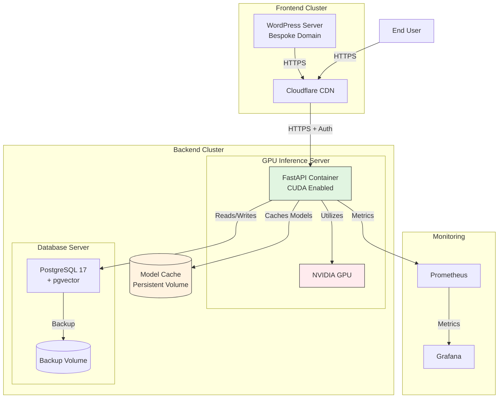

# E14. Self-Hosting & Multi-Server Connectivity (Epic)

> **Epic Short ID**: E14
> **Status**: active -- OCI backend live at `api.altcontext.com`; remaining deliverables folded into [E15](../v0.4.0/public-demo-launch-readiness-epic.md)
> **Parent**: [production-readiness-epic.md](./production-readiness-epic.md) Phase 6
> **Revision**: Apr 2026 -- backend deployment landed (E14-1 merged, archived); remaining hosting work (E15-3a LocalWP -> OCI gate, E15-3 WP demo, E15-5a OCI hygiene, E15-5 remote E2E + ARM evidence) now owned by E15 Phases 3 + 4 under handoff decision `scope_e15_mvp_close_intake_202604`.

## Status Snapshot (Apr 2026)

| Surface                                                                            | Status                          | Owner                                                                                            |
| ---------------------------------------------------------------------------------- | ------------------------------- | ------------------------------------------------------------------------------------------------ |
| OCI A1.Flex backend instance                                                       | **Live** at `api.altcontext.com` | E14-1 (archived)                                                                                 |
| `docker-compose.prod.yml` stack (FastAPI + scan worker + Postgres 17/pgvector + Caddy) | **Live**                        | E14-1 (archived)                                                                                 |
| HTTPS / Let's Encrypt TLS via Caddy                                                | **Live**                        | E14-1 (archived)                                                                                 |
| DNS A records for `api`, `staging.api`, `dev.api`                                  | **Live**                        | E14-1 (archived)                                                                                 |
| InsightFace model cache persistence                                                | **Verified**                    | E14-1 (archived)                                                                                 |
| Postgres data persistence                                                          | **Verified**                    | E14-1 (archived)                                                                                 |
| `acx-backend.service` systemd unit                                                 | **Live**                        | E14-1 (archived)                                                                                 |
| API key validation + tenant isolation                                              | **Live**                        | E15-1                                                                                            |
| CORS allowlist + rate limiting + key rotation                                      | **Live**        | E15-1                                                                                            |
| Structured JSON logs + `/health` + `/ready` + `/metrics`                           | **Live**        | E15-2                                                                                            |
| LocalWP → OCI round-trip gate                                                      | **Pending**                     | **E15-3a**                                                                                       |
| WordPress demo provisioning                                                        | **Pending**                     | **E15-3**                                                                                        |
| OCI budget alerts ($1/$5/$10)                                                      | **Pending**                     | **E15-5a**                                                                                       |
| ARM compatibility verification artifact                                            | **Pending**                     | **E15-5** (de facto verified by running A1 instance)                                             |
| Dynamic IP SSH drift (Tailscale)                                                   | **Resolved**                    | [archived tech-debt note](../../tasks/tech-debt/archive-or-transfer-candidates/dynamic-ip-ssh-access.md) |
| End-to-end WP → backend → recognition smoke test                                   | **Pending**                     | **E15-5**                                                                                        |
| Hetzner CX22 fallback plan documented                                              | **Pending**                     | **E15-5a**                                                                                       |
| Host/infra observability + alerting (Notifications topic, symptom alarms, VSS/OS-Mgmt agents, stream freshness gate) | **Planned** | **GTM OB-8** ([`decomposition-ob8-infra-observability.md`](../../gtm/decomposition-ob8-infra-observability.md)) — co-owned; folds in the `E15-5a` budget-alert routing |

Hosting architecture, provider evaluation, and deployment path for the recognition service backend, a future user-account database, and a WordPress demo frontend.

---

## Problem Statement

The recognition service currently runs primarily in a local-first or local-only environment. To support production rollouts, the backend service (FastAPI) must be capable of running on a separate server (VPS, Cloud Run, Hugging Face Spaces, etc.) while securely connecting to a separate WordPress frontend server running the plugin.

Additionally, the production system requires:

1. **User-account database** (not yet built) -- multi-tenant auth/account store, separate from the recognition Postgres.
2. **WordPress demo page** -- a publicly accessible WP instance running the plugin for demonstration purposes. This can live on cheap shared hosting or on the same backend VPS if resource contention is acceptable.

---

## Recommended Hosting Architecture



## MVP Proof-of-Concept Hosting Evaluation

### System Requirements Summary

Based on the actual codebase (`pyproject.toml`, `api/main.py`, `recognition/config/settings.py`, and the archived `Phi3CaptionAdapter`), the service must run:

| Component                           | Requirement                           | Disk Footprint                    | RAM (loaded)                       | Notes                                |
| ----------------------------------- | ------------------------------------- | --------------------------------- | ---------------------------------- | ------------------------------------ |
| **FastAPI + Uvicorn**               | Python 3.12, async                    | ~50MB                             | ~200MB                             | Baseline process                     |
| **InsightFace (buffalo_l)**         | ONNX model files                      | ~600MB                            | ~1.5–2GB                           | Face detection + embeddings          |
| **onnxruntime**                     | CPU or GPU provider                   | ~200MB                            | (included above)                   | CPU-only viable for face detection   |
| **Phi-3.5 Vision (or similar VLM)** | `transformers`, `torch`, `accelerate` | **~8.5GB (FP16)** / ~4.2GB (INT4) | **~6–10GB (FP16)** / ~4–5GB (INT4) | Image description generation         |
| **PyTorch**                         | Required by VLM                       | ~2GB installed                    | (shared with VLM)                  | Not needed for InsightFace-only mode |
| **PostgreSQL 17 + pgvector**        | Persistent storage, vector search     | ~100MB                            | ~100MB idle                        | Scales with data                     |
| **opencv-python, pillow, numpy**    | Image processing                      | ~150MB                            | (included in API)                  | Shared dependency                    |
| **WordPress + PHP 8.1+ + MySQL**    | Standard LAMP/LEMP                    | —                                 | —                                  | Shared hosting handles this          |

> **Existing implementation reference:** `apps/archived-recognition-service/analysis/adapters/phi3_caption_adapter.py` and `apps/archived-recognition-service/shared/infrastructure/model_loaders/phi3_model_loader.py` contain a complete Phi-3.5 Vision adapter using `AutoModelForCausalLM` + `AutoProcessor` from HuggingFace `transformers`. The adapter supports CUDA, MPS (with CPU fallback), configurable attention implementations, 4-bit quantization, and Flash Attention 2 (CUDA-only, deferred). Settings are driven by `settings.yaml` under `caption_generator`.

**Two-phase resource profile:**

| Phase                                              | Models Loaded                        | Minimum RAM | Minimum Disk | GPU Beneficial?                       |
| -------------------------------------------------- | ------------------------------------ | ----------- | ------------ | ------------------------------------- |
| **Phase 1 (MVP)** — Recognition only               | InsightFace buffalo_l                | **4GB**     | ~1GB         | No (CPU fine)                         |
| **Phase 2** — Recognition + Image Description      | InsightFace + Phi-3.5 Vision (FP16)  | **12–16GB** | ~12GB        | **Yes** (CPU inference ~30–60s/image) |
| **Phase 2 (quantized)** — Recognition + VLM (INT4) | InsightFace + Phi-3.5 Vision (4-bit) | **8GB**     | ~6GB         | Recommended but CPU viable            |

**Critical constraints:**

1. InsightFace model download is ~600MB. Any host that destroys the filesystem on sleep (e.g., HuggingFace Spaces free tier) forces a full reinstall + redownload on every wake.
2. Phi-3.5 Vision weights are **~8.5GB (FP16)** — redownload on ephemeral hosts is catastrophic (10+ min on moderate bandwidth). Even INT4 quantized weights are ~4.2GB.
3. PyTorch itself adds ~2GB to the install footprint, making cold starts on ephemeral hosts even worse.

---

### Decision Matrix (shared PHP+MySQL WordPress front-end + separate Python inference backend)

> **Currency note:** prices below are **as advertised** on vendor sites (Feb 2026) and often depend on **term length** and **promotional intro periods**. Treat them as budget anchors, not guarantees.

| Feature                  | Option A: Persistent VPS (Recommended)                                                                                                                                                       | Option B: Single VPS (Budget / Dev)                                        | Option C: Hybrid Cloud (Scale Path)                                                                          |
| ------------------------ | -------------------------------------------------------------------------------------------------------------------------------------------------------------------------------------------- | -------------------------------------------------------------------------- | ------------------------------------------------------------------------------------------------------------ |
| **Best For**             | **Proof-of-concept demos, lowest viable cost, fast restarts**                                                                                                                                | Local dev parity, absolute minimum spend                                   | Future scale narrative                                                                                       |
| **Frontend (WordPress)** | Shared PHP+MySQL host: Namecheap "Stellar" ~$1.98–$4.88/mo; IONOS "Essential" ~$4–6/mo; Hostinger Premium ~$2.99/mo                                                                          | Same VPS as backend (~$5–12/mo total)                                      | Same as A, behind Cloudflare                                                                                 |
| **Backend (FastAPI)**    | **Persistent VPS** (see tier evaluation below): Hetzner CX22 €4.35/mo (recognition only, 4GB); upgrade to CX32 €7.49/mo or CX42 ~€14/mo when adding VLM. Disk persists — restart in seconds. | CPU-only on same box as WP. Resource contention severe when VLM is loaded. | Cloud Run (CPU) + on-demand GPU burst. Scale-to-zero but cold starts are real; VLM model pull adds 3–10 min. |
| **Database**             | Postgres on the same backend VPS (free beyond VPS cost). Acceptable for MVP volumes.                                                                                                         | Postgres on the same VPS.                                                  | Managed Postgres (Supabase $25/mo+, Neon free tier for low volume).                                          |
| **Model Cache**          | **Local disk on VPS — persists across reboots and stops.** InsightFace ~600MB + Phi-3.5 Vision ~8.5GB. This is the key differentiator vs. HF Spaces/serverless.                              | Local disk (included). Budget 10–15GB for model cache.                     | Persistent volume attachment required; 20GB+ for model weights.                                              |
| **Monthly Floor**        | **~$5–10/mo** (backend VPS) + **~$2–5/mo** (WP hosting) = **~$7–15/mo total**                                                                                                                | ~$5–12/mo (single box)                                                     | ~$5/mo WP + variable compute (can spike)                                                                     |
| **Cold Start**           | **< 5 seconds** (process restart on stopped VPS, models already on disk)                                                                                                                     | N/A (always on if VPS is on)                                               | 30–120s (container pull + model load)                                                                        |
| **Pros**                 | Models persist on disk. Restart is fast. Fixed monthly cost. Full control.                                                                                                                   | Cheapest possible. Simple.                                                 | Best scale story. Pay-per-use at volume.                                                                     |
| **Cons**                 | VPS is not auto-scaling. Must SSH to manage.                                                                                                                                                 | No GPU path. Noisy neighbor. Single point of failure.                      | Cold starts. Complexity. Costs unpredictable.                                                                |

---

### The HuggingFace Spaces Problem (and why persistent VPS solves it)

| Behavior               | HF Spaces (Free/Basic)                                                                                                                                            | Small VPS (Hetzner/DO/Vultr)                                                                                                                         |
| ---------------------- | ----------------------------------------------------------------------------------------------------------------------------------------------------------------- | ---------------------------------------------------------------------------------------------------------------------------------------------------- |
| Sleep after inactivity | Yes (15–60 min)                                                                                                                                                   | VPS stays on; or you stop it manually                                                                                                                |
| What happens on wake   | **Ephemeral filesystem destroyed.** Full pip install (~2GB PyTorch alone) + 600MB InsightFace + 8.5GB Phi-3.5 Vision download. **10–20 min cold start** with VLM. | **Filesystem persists.** `systemctl start app` or `docker start`. All models already on disk. < 5 sec (recognition), ~15–30 sec (VLM load into RAM). |
| Cost while sleeping    | $0 (but unusable)                                                                                                                                                 | VPS still billed (~$0.007–0.009/hr even stopped on some providers)                                                                                   |
| Cost while running     | $0 (free) or ~$7/mo (basic)                                                                                                                                       | Same flat rate whether idle or serving                                                                                                               |
| GPU available          | Yes (paid tiers ~$0.80/hr)                                                                                                                                        | Not on budget VPS; add later via separate GPU host                                                                                                   |

**Verdict:** For demo-ready MVP where you can't afford multi-minute cold starts and can't pay to keep GPUs warm, a **persistent VPS running CPU-only inference** is the pragmatic sweet spot. For Phase 1 (recognition only), a $5–7/mo VPS suffices. For Phase 2 (recognition + Phi-3.5 VLM), budget $8–15/mo for 8–16GB RAM and 40–80GB disk.

---

### Tier Recommendations

#### Frontend Tier: WordPress Hosting — RECOMMENDED: Shared PHP+MySQL

**Goal:** Lowest cost web presence for a self-hosted WordPress instance.

| Provider      | Plan           | Price                                   | PHP  | SSL  | Notes                             |
| ------------- | -------------- | --------------------------------------- | ---- | ---- | --------------------------------- |
| **Hostinger** | Premium        | ~$2.99/mo (48mo term)                   | 8.2+ | Free | Best price/perf ratio. 100 sites. |
| **Namecheap** | Stellar        | ~$1.98/mo (1st year), ~$4.88/mo renewal | 8.1+ | Free | 30-day free trial. 3 sites.       |
| **IONOS**     | Essential      | ~$4/mo (1st year), ~$6/mo renewal       | 8.1+ | Free | Reliable EU provider.             |
| **DreamHost** | Shared Starter | ~$2.95/mo (3yr), ~$6.99/mo renewal      | 8.1+ | Free | Good WP integration. 1 site.      |

**Recommendation: Hostinger Premium** at the longest discount term you're comfortable with. Put Cloudflare (free tier) in front for TLS termination, caching, and DDoS mitigation.

**Minimum requirements checklist:**

- PHP 8.1+ with `curl`, `json`, `mbstring`, `xml` extensions
- MySQL 8.0+ or MariaDB 10.6+
- 1GB+ storage for WP core + plugin + media
- Real cron support (or reliable WP-Cron via external ping)
- HTTPS (Let's Encrypt or Cloudflare)

---

#### Backend Tier: FastAPI Inference Server — RECOMMENDED: Persistent Budget VPS

**Goal:** Continuous operation at lowest possible cost. Dormant instances must not be ephemeral. Restart in seconds, not minutes.

**Phase 1 (Recognition only) — 4GB RAM sufficient:**

| Provider         | Plan          | vCPU     | RAM | Disk | Price                 | Persistent Disk |
| ---------------- | ------------- | -------- | --- | ---- | --------------------- | --------------- |
| **Hetzner**      | CX22          | 2 shared | 4GB | 40GB | **€4.35/mo** (~$4.70) | Yes             |
| **DigitalOcean** | Basic Droplet | 2 vCPU   | 4GB | 80GB | $12/mo                | Yes             |
| **Vultr**        | Cloud Compute | 2 vCPU   | 4GB | 80GB | $12/mo                | Yes             |

**Phase 2 (Recognition + Phi-3.5 VLM) — 8–16GB RAM required:**

| Provider         | Plan           | vCPU        | RAM  | Disk  | Price                 | VLM Mode       | Notes                                    |
| ---------------- | -------------- | ----------- | ---- | ----- | --------------------- | -------------- | ---------------------------------------- |
| **Hetzner**      | CX32           | 4 shared    | 8GB  | 80GB  | **€7.49/mo** (~$8.10) | INT4 quantized | Tight but viable with 4-bit quantization |
| **Hetzner**      | CX42           | 8 shared    | 16GB | 160GB | ~€14/mo (~$15.10)     | FP16 full      | Comfortable headroom for FP16            |
| **DigitalOcean** | Basic Droplet  | 4 vCPU      | 8GB  | 160GB | $24/mo                | INT4 quantized | —                                        |
| **Vultr**        | High Frequency | 4 vCPU      | 8GB  | 256GB | $24/mo                | INT4 quantized | NVMe, faster model loading               |
| **Oracle Cloud** | Ampere A1      | 4 ARM cores | 24GB | 200GB | **Free tier**         | FP16 full      | Best option if ARM wheels work           |

> **Note on Oracle Cloud Free Tier:** 4 ARM Ampere A1 cores + 24GB RAM + 200GB boot volume -- permanently free. 24GB is more than enough for InsightFace + Phi-3.5 FP16 concurrently. The catch: ARM architecture means you need `aarch64` builds of onnxruntime, opencv, and torch. PyTorch and transformers both have official ARM wheels. Verify `insightface` wheel availability. If it works, this is unbeatable.

> **Note on INT4 quantization:** The archived `Phi3ModelLoader` already supports `load_in_4bit` via `bitsandbytes` (CUDA-only currently). For CPU-only VPS, consider GGUF quantized models via `llama-cpp-python` as an alternative path to reduce RAM to ~4–5GB for the VLM component.

---

### Oracle Cloud Pay-As-You-Go (PAYG) Evaluation -- Production Backend

> **Decision**: Attempt Oracle Cloud as the primary backend host. Use PAYG account tier.

#### Why PAYG over Free Tier

The Oracle Cloud Always Free tier offers 4 ARM Ampere A1 cores, 24GB RAM, and 200GB boot volume at $0/mo -- on paper, the best option for hosting the description service. However, the Free Tier has a well-documented **"Out of host capacity"** problem:

- Free Tier ARM instances are capacity-constrained in most regions. Users routinely report running automated retry scripts for **days to months** before an instance is provisioned ([community thread](https://www.reddit.com/r/oraclecloud/comments/on2e25/resolving_oracle_cloud_out_of_capacity_issue_and/)).
- Oracle periodically reclaims "idle" Free Tier instances, which can terminate workloads without warning.
- Free Tier accounts have the lowest provisioning priority.

**PAYG resolves these issues:**

| Aspect                         | Free Tier                                    | Pay-As-You-Go                                                              |
| ------------------------------ | -------------------------------------------- | -------------------------------------------------------------------------- |
| Instance provisioning priority | Lowest -- capacity errors are common         | **Higher priority** -- significantly reduces "Out of host capacity" errors |
| Always Free resources          | 4 ARM cores / 24GB / 200GB                   | **Same Always Free resources included at $0**                              |
| Idle instance reclamation      | Yes -- Oracle may terminate "idle" instances | **No** -- PAYG instances are not subject to idle reclamation               |
| Additional resource types      | Limited                                      | Unlocks more OCI resource types (Kubernetes, flexible shapes, etc.)        |
| Billing risk                   | None                                         | Minimal if budget alerts are configured (Always Free shapes remain $0)     |
| Account setup                  | Credit card required                         | Credit card required                                                       |

**Key insight from community experience (2024 update):** "Upgrading to Pay As You Go [...] you'll continue to enjoy all the free benefits without any additional cost, but you'll also receive priority for launching instances and are less likely to face 'Out of host capacity' errors."

#### PAYG Suitability for Current State (InsightFace Only)

The description service in its current state runs **InsightFace only** (no VLM/Phi-3.5). This is the lightest possible production footprint:

| Resource    | Requirement                             | Oracle Always Free (PAYG)                      |
| ----------- | --------------------------------------- | ---------------------------------------------- |
| RAM         | ~4GB (FastAPI + InsightFace + Postgres) | 24GB available -- **6x headroom**              |
| CPU         | 2 cores sufficient                      | 4 ARM cores -- **adequate**                    |
| Disk        | ~2GB (app + models + DB)                | 200GB boot volume -- **massive headroom**      |
| Model cache | ~600MB (InsightFace buffalo_l)          | Persistent disk -- **no cold-start penalty**   |
| Network     | HTTPS ingress                           | 10TB/mo outbound egress included               |
| Cost        | $0/mo target                            | **$0/mo** (Always Free shapes on PAYG account) |

**Verdict: Oracle Cloud PAYG is an excellent fit for the current InsightFace-only state.** The Always Free ARM instance provides 6x the RAM needed, persistent disk for model cache, and $0/mo operating cost. PAYG account tier eliminates the provisioning lottery that plagues Free Tier accounts.

#### PAYG Risk Mitigations

1. **Set budget alerts immediately** after upgrading to PAYG. Configure alerts at $1, $5, and $10 thresholds. Always Free shapes should not generate charges, but alerts are the safety net.
2. **Tag all resources** with `project: acx` for cost attribution.
3. **Do not provision non-free shapes** without explicit budget approval. Stick to `VM.Standard.A1.Flex` (Always Free ARM) and `VM.Standard.E2.1.Micro` (Always Free x86).
4. **Monitor the OCI Cost Analysis dashboard** weekly during the first month.
5. **Backup plan**: If Oracle proves unreliable, Hetzner CX22 at ~$4.35/mo is the immediate fallback.

#### ARM Compatibility Checklist (Must Verify Before Provisioning)

- [ ] `onnxruntime` has `aarch64` wheel for Python 3.12
- [ ] `insightface` installs cleanly on `aarch64` (or can be built from source)
- [ ] `opencv-python-headless` has `aarch64` wheel
- [ ] `numpy`, `pillow`, `httpx` -- expected to work (pure Python or well-supported)
- [ ] `psycopg2-binary` or `asyncpg` has `aarch64` wheel
- [ ] PostgreSQL 17 + pgvector Docker image available for `arm64`
- [ ] Full integration test suite passes on ARM Docker (can test locally on Apple Silicon)

> **Note:** Apple Silicon (M-series) is also ARM64/aarch64. The development environment already runs on this architecture, which is a strong signal that ARM wheels exist for all critical dependencies.

---

### OCI Provisioned Baseline

The Oracle Cloud baseline is no longer hypothetical. The Terraform module under `infra/oci/` has already provisioned the OCI footprint and emits live outputs for the backend URL, SSH command, instance ID, private IP, public IP, and VCN ID. This epic should track the architecture and the remaining deployment work, not duplicate transient instance-specific values from Terraform state.

**Provisioned surfaces:**

```text
infra/oci/
  main.tf                 # VCN, subnet, route table, security list, compute instance
  variables.tf            # OCI tenancy/user/SSH/input variables
  outputs.tf              # backend_url, public_ip, private_ip, ssh_command, instance_id, vcn_id
  cloud-init.yaml         # Docker/bootstrap/service scaffold and host hardening
  retry-apply.sh          # AD-cycling retry with locking, backoff, timeout, notifications
  terraform.tfvars.example
  README.md
```

#### Provisioned Terraform Footprint

| Surface | Live configuration from `infra/oci/` |
| ------- | ------------------------------------ |
| Region | `us-ashburn-1` |
| Shape | `VM.Standard.A1.Flex` |
| CPU / RAM | `4` OCPUs / `24 GB` |
| Boot volume | `200 GB` |
| OS image | Ubuntu 24.04 ARM (`ubuntu_image_ocid` input) |
| Network | VCN `10.0.0.0/16` + public subnet `10.0.1.0/24` |
| Public ingress | HTTPS `443` to all, SSH `22` restricted to configured CIDRs |
| Tags | `project=acx`, `env=production` |
| Outputs | `backend_url`, `public_ip`, `private_ip`, `ssh_command`, `instance_id`, `vcn_id` |

#### Live Host Bootstrap from `cloud-init.yaml`

The first-boot scaffold currently does all of the following:

1. Installs Docker from Docker's apt repository with GPG verification.
2. Installs the Compose plugin, `fail2ban`, unattended upgrades, and host prerequisites.
3. Writes `/etc/docker/daemon.json` with log rotation and `overlay2`.
4. Creates `/opt/acx-backend/{secrets,logs,data/models,data/pgdata}`.
5. Registers `acx-backend.service` to run `docker compose -f docker-compose.prod.yml up --remove-orphans` from `/opt/acx-backend/`.
6. Enables UFW with only `22/tcp` and `443/tcp` open.
7. Enables `fail2ban` and log rotation for `/opt/acx-backend/logs/*.log`.
8. Installs, but does not enable by default, the Free Tier keepalive helper.

#### Current Deployment Boundary

What is provisioned today:

- OCI network and compute resources
- host hardening and Docker runtime
- application directory and systemd service scaffold
- Terraform outputs for operator access

What is **not** provisioned by `infra/oci/` yet:

- `docker-compose.prod.yml` and the application containers themselves
- reverse proxy/TLS termination on the VM (for example Caddy or Nginx)
- Postgres container deployment and backup automation
- the WordPress demo host
- backend application secrets and production env wiring

This means the Oracle work should now be treated as **provisioned infrastructure plus pending application deployment**, not as an unstarted provisioning task.

#### Retry/Capacity Strategy Implemented in `retry-apply.sh`

The provisioner is more robust than the original epic sketch. The live script now provides:

1. AD cycling across `AD-1`, `AD-2`, and `AD-3`.
2. retry classification for capacity, throttling, transient OCI failures, and hung applies.
3. locking via `flock` or a portable lock-directory fallback.
4. optional webhook notifications for unattended runs.
5. preflight detection when the target instance already exists in Terraform state.
6. configurable retry interval, exponential backoff, jitter, and per-attempt timeout.

#### Differences from `oci-example` That Are Now Actually Landed

| Aspect        | oci-example (legacy source)               | ACX deployment                                                                      |
| ------------- | ----------------------------------------- | ----------------------------------------------------------------------------------- |
| Shape config  | 1 OCPU / 6 GB RAM                         | **4 OCPU / 24 GB RAM** (maximize Always Free)                                       |
| OS image      | Ubuntu 22.04 aarch64                      | **Ubuntu 24.04 aarch64** (latest LTS)                                               |
| App directory | `/opt/marketing-backend/`                 | **`/opt/acx-backend/`**                                                             |
| Service name  | `marketing-backend.service`               | **`acx-backend.service`**                                                           |
| Ports         | 3000 (Node.js)                            | **443 public at the host boundary; application port still deferred to app compose** |
| Runtime       | Node.js / Docker                          | **Python 3.12 / Docker**                                                            |
| Database      | External                                  | **PostgreSQL 17 + pgvector intended as co-located container; not deployed yet**     |
| Model cache   | N/A                                       | **`/opt/acx-backend/data/models/` (~600MB InsightFace)**                            |
| Reverse proxy | None (direct port)                        | **Reverse proxy/TLS still pending; host opens 443 but does not install Caddy yet**  |
| Repo hygiene  | Included project-specific artifacts/state | **Terraform module and retry tooling live in-repo under `infra/oci/`**              |

---

### Deferred Follow-On: User-Account Database

The production system will eventually require a user-account store separate from the recognition Postgres, but that work is **not part of the self-hosting implementation scope yet**.

Current decision:

- self-hosting covers backend hosting, deployment topology, persistence, networking, and the WordPress demo boundary
- account-system design is deferred until a dedicated ADR/epic names the canonical owner, contract surface, and rollout plan

Planning constraint:

- do not treat `acx_accounts` or any future account database as an implementation requirement for closing this epic
- if account storage becomes necessary before this epic closes, add a dedicated account-system plan first rather than extending this hosting epic ad hoc

---

### WordPress Demo Page Scope

A publicly accessible WordPress instance running the ACX plugin for demonstration.

**Options evaluated:**

| Option                                       | Cost      | Pros                                                      | Cons                                                                                         |
| -------------------------------------------- | --------- | --------------------------------------------------------- | -------------------------------------------------------------------------------------------- |
| **Shared PHP hosting** (Hostinger/Namecheap) | ~$2-5/mo  | Cheapest. Dedicated to WP. Clean separation from backend. | Separate server to manage.                                                                   |
| **WP on the Oracle VPS**                     | $0        | Free. Single box.                                         | Resource contention with inference. Nginx/Caddy config complexity. PHP + Python on same box. |
| **WordPress.com hosted**                     | ~$4-25/mo | Zero ops.                                                 | Plugin installation restrictions on lower tiers. May not support custom plugins.             |

**Recommendation:** Cheap shared PHP hosting (~$2-5/mo) is the most economical option that maintains clean separation. The backend VPS should be dedicated to inference + DB. If budget is the absolute priority and demo traffic is minimal, WP on the Oracle VPS is viable but adds operational complexity.

**Current baseline:** OCI PAYG on `VM.Standard.A1.Flex` is already provisioned for the backend host and has enough headroom for the current InsightFace-only service.

**Fallback / alternative path:** Hetzner CX22 remains the simplest paid fallback if Oracle reliability or ARM dependency support becomes a problem. For Phase 2 VLM work, Hetzner CX32/CX42 or a separate GPU host remain the clearer upgrade paths than overloading the WordPress tier.

**Setup pattern:**

```
Phase 1: VPS (Hetzner CX22 — 2 vCPU / 4GB / 40GB)
Phase 2: VPS (Hetzner CX32 — 4 vCPU / 8GB / 80GB) or CX42 for FP16
├── Docker Compose
│   ├── FastAPI container
│   │   ├── InsightFace + onnxruntime (face detection)
│   │   └── Phi-3.5 Vision + torch + transformers (image description, Phase 2)
│   ├── PostgreSQL 17 + pgvector container
│   └── Volumes:
│       ├── /data/models/insightface/  ← buffalo_l cache (~600MB, persists)
│       ├── /data/models/huggingface/  ← Phi-3.5 Vision weights (~8.5GB FP16, persists)
│       ├── /data/models/torch/        ← PyTorch cache (persists)
│       ├── /data/pgdata/              ← Postgres data (persists)
│       └── /data/thumbnails/          ← Generated thumbnails (persists)
└── Caddy or Nginx (reverse proxy + auto-TLS)
```

**Why this beats HuggingFace Spaces and serverless:**

1. **Models stay on disk.** InsightFace (~600MB) + Phi-3.5 Vision (~8.5GB) download once, persist forever across reboots.
2. **Restart in seconds.** `docker compose up` → recognition serving in 3–5 seconds; VLM loaded in ~15–30 seconds (vs. 10–20 min cold start on HF Spaces).
3. **Fixed cost.** No surprise bills. €7.49/mo whether you serve 0 or 1000 requests/day.
4. **Full control.** SSH access, logs, debugging, no platform restrictions.
5. **CPU-only is viable.** InsightFace on CPU handles ~1–3 faces/sec. Phi-3.5 on CPU handles ~30–60s/image for captioning — acceptable for demos, too slow for batch processing.
6. **GPU upgrade path.** When CPU captioning is too slow, add a GPU host for VLM inference without changing the recognition stack.

---

#### Database Tier — RECOMMENDED: Postgres on Backend VPS

**For MVP:** Run PostgreSQL 17 + pgvector as a Docker container on the same backend VPS. This is effectively free (included in VPS cost) and eliminates network latency between API and DB.

**For production graduation:** Migrate to managed Postgres when you need:

- Automated backups without scripting
- Point-in-time recovery
- HA / read replicas

| Provider     | Plan      | Price  | pgvector | Notes                                                 |
| ------------ | --------- | ------ | -------- | ----------------------------------------------------- |
| **Neon**     | Free tier | $0/mo  | Yes      | 0.5GB storage, 190 compute hours/mo. Good for dev.    |
| **Supabase** | Free tier | $0/mo  | Yes      | 500MB DB, 2 projects. Pauses after 1 week inactivity. |
| **Supabase** | Pro       | $25/mo | Yes      | 8GB, no pause. Production-ready.                      |
| **Railway**  | Hobby     | ~$5/mo | Manual   | Easy deploy but pgvector requires manual setup.       |

**MVP recommendation:** Postgres on the VPS. Back up with a daily `pg_dump` cron to object storage (Backblaze B2 at $0.005/GB/mo or Cloudflare R2 free egress).

---

### Recommended MVP Stack (Concrete)

```
Phase 1 — Recognition only (~$7.35/mo)

Frontend:  Hostinger Premium         ~$2.99/mo (long-term)
Backend:   Hetzner CX22 VPS (4GB)    ~$4.35/mo (€4.35)
Database:  Postgres on backend VPS    $0 (included)
CDN/TLS:   Cloudflare Free            $0
DNS:       Cloudflare Free            $0
Backups:   Backblaze B2 (< 1GB)       ~$0.01/mo
                                    ─────────
                                     ~$7.35/mo

Phase 2 — Recognition + Phi-3.5 VLM (~$11/mo)

Frontend:  Hostinger Premium         ~$2.99/mo (long-term)
Backend:   Hetzner CX32 VPS (8GB)    ~$7.49/mo (€7.49) — INT4 quantized VLM
     OR    Hetzner CX42 VPS (16GB)   ~$14/mo (€14)     — FP16 full precision
Database:  Postgres on backend VPS    $0 (included)
CDN/TLS:   Cloudflare Free            $0
Backups:   Backblaze B2 (< 1GB)       ~$0.01/mo
                                    ─────────
                                     ~$10.49/mo (INT4) or ~$17/mo (FP16)

Phase 2 alt — Oracle Cloud Free Tier ($2.99/mo total)

Frontend:  Hostinger Premium         ~$2.99/mo
Backend:   OCI Ampere A1 (24GB/4c)    $0 (free tier, if ARM wheels work)
Database:  Postgres on backend VPS    $0
                                    ─────────
                                     ~$2.99/mo (!)
```

**Why this works for proof-of-concept:**

- WordPress runs on cheap shared hosting — it just needs to serve the admin UI and proxy API calls.
- The backend VPS is always available (no sleep/wake cycles) at desktop-PC costs.
- InsightFace + Phi-3.5 Vision models are cached on persistent disk — no reinstallation on restart.
- Phase 1 (recognition only, CPU) is sufficient for initial demo-scale traffic.
- Phase 2 (add VLM) is a VPS upgrade, not a platform migration — same Docker Compose, bigger box.
- Phi-3.5 on CPU handles ~1 image description per 30–60 seconds — fine for demos, not for batch.
- Postgres on the same VPS eliminates managed DB costs and network latency.
- Cloudflare provides free TLS, DDoS protection, and caching.
- Exit ramps remain open: move WP to VPS later; add GPU host later; move DB to managed later.

---

## Detailed Hosting Options

### Option A: Separate Providers with Persistent VPS (Recommended)

**Front-end (WP on shared PHP+MySQL)**

- Choose a plan that supports:
  - PHP 8.1+, MySQL/MariaDB 10.6+
  - TLS (or Cloudflare TLS in front)
  - cron/WP-Cron reliability (real cron is a bonus)
  - enough inode/file limits for media + plugin dev

**Back-end (FastAPI on persistent VPS)**

- **Phase 1:** Budget VPS (Hetzner CX22, 4GB) running Docker Compose with CPU-only InsightFace.
- **Phase 2:** Upgrade to CX32 (8GB, INT4 quantized VLM) or CX42 (16GB, FP16) to add Phi-3.5 Vision captioning.
- Models cached on persistent volume — survive reboots and stops.
- Process restart in seconds, not minutes.
- **Growth path:** When CPU captioning is too slow for batch processing, add a separate GPU host (RunPod, Lambda) for VLM inference and keep the VPS for API routing + DB + recognition.

**DB**

- Postgres on the backend VPS for MVP.
- Keep DB data on a named Docker volume for persistence.
- Daily automated `pg_dump` backups to object storage.

---

### Option B: Single VPS (Budget / Dev)

**Single box runs:**

- Nginx + PHP-FPM + WordPress + MySQL/MariaDB
- FastAPI (CPU-only) behind the same reverse proxy
- Local Postgres (pgvector)

**Use when**

- You want the absolute cheapest option (~$5/mo total) and can tolerate resource contention.
- You're comfortable with Nginx reverse proxy config for routing `/wp` vs `/api`.

**Avoid when**

- WP traffic competes with inference workloads (OOM risk on 2GB RAM, worse with VLM loaded).
- You need clean security separation between frontend and backend.

**Minimum spec:** 4GB RAM VPS for recognition only; **8GB+ required** when adding Phi-3.5 VLM. A single-box setup with WP + FastAPI + VLM + Postgres needs at least 16GB to avoid OOM.

---

### Option C: Hybrid Cloud (Burst / Scale)

**Front-end**

- WP on shared host or small VPS, behind Cloudflare.

**Back-end**

- Cloud Run (CPU) for non-GPU endpoints and orchestration.
- On-demand GPU for inference (RunPod Serverless, Cloud Run GPU).
- **Warning:** Scale-to-zero means cold starts. Mitigate with min-instances (but that costs money).

**DB**

- Managed Postgres + pgvector (Neon or Supabase).

**Realistic cost floor:** ~$25–35/mo (WP hosting + managed DB + min-instance compute).

**Use when**

- You have proven demand and need auto-scaling.
- You're willing to pay more for operational simplicity.

---

## Future Path: Self-hosted GPU + CUDA (when you've proven demand)

**Goal:** reduce per-inference costs, bring VLM captioning from ~30–60s/image (CPU) to ~1–3s/image (GPU), and eliminate third-party GPU constraints.

**Why GPU matters more with VLM:**

- InsightFace face detection on CPU is fast enough (~1–3 faces/sec). GPU helps but isn't critical.
- Phi-3.5 Vision captioning on CPU is **painfully slow** (~30–60s per image). On an NVIDIA T4, this drops to ~2–5s. On an L4, ~1–2s. GPU is the unlock for batch captioning.
- The existing `Phi3CaptionAdapter` already supports CUDA device placement, `device_map: auto`, Flash Attention 2, and architecture-specific attention configuration per GPU compute capability.

**Stage A — "Bring your own GPU server" (lowest operational complexity)**

- Rent a **dedicated GPU VPS/bare metal** with NVIDIA drivers + CUDA.
- Minimum viable GPU: **NVIDIA T4** (16GB VRAM) — fits Phi-3.5 FP16 + InsightFace concurrently.
  - RunPod Community GPU: T4 from ~$0.20/hr
  - Lambda: T4 from ~$0.33/hr
  - Vast.ai: T4 from ~$0.15/hr (spot pricing)
- Run:
  - `nvidia-container-toolkit`
  - a single "inference gateway" container (FastAPI) with `[gpu]` extras (onnxruntime-gpu, torch+cuda)
  - model cache on local NVMe
  - configure `caption_generator.config.model_settings.device_map: auto` in settings.yaml
- Put it behind a reverse proxy with:
  - strict API key auth
  - IP allowlist (Cloudflare egress IPs if feasible)
  - request throttling

**Stage B — "Split inference" (recognition stays on VPS, VLM goes to GPU)**

- Keep the budget VPS running InsightFace (recognition) + Postgres + API routing.
- Route only `/scene/describe` (or equivalent captioning endpoints) to a separate GPU host.
- This avoids paying for GPU 24/7 — the GPU host can be on-demand or serverless.
- The `Phi3CaptionAdapter` is already a separate adapter behind a port interface; routing to a remote inference endpoint requires only a new adapter implementation.

**Stage C — "Your own hardware"**

- Put a workstation/server with a consumer GPU (RTX 3060 12GB or better) on a reliable connection.
- Same container layout as Stage A.
- Add real monitoring + alerting and plan for disk failures and remote hands.
- A used RTX 3060 12GB (~$200–250) runs Phi-3.5 FP16 without quantization.

**Operational guardrails**

- Keep "CPU mode" available so your product degrades gracefully if GPU is down. The adapter factory already supports `type: mock` as a fallback.
- Separate secrets per environment; never ship prod keys in WP plugin defaults.
- Measure GPU minutes per request class (recognition vs. captioning) so you can price the product.
- Budget ~15–20GB VRAM for running InsightFace + Phi-3.5 FP16 concurrently on a single GPU. INT4 quantization brings this to ~8–10GB.

---

## GPU hosting decision matrix (always-on vs bursty) — Hetzner GEX44 vs HF T4 vs RunPod vs Lambda vs Cloud Run

**Assumptions used for comparability**

- **Always-on month** = 30 days = **720 hours**
- **Bursty example** = **1 hour/day** average runtime (30 hours/month)
- Cloud Run GPU requires **≥4 vCPU and ≥16 GiB RAM** (minimums shown):contentReference[oaicite:0]{index=0}.
- Prices are **vendor list prices** as of Feb 2026; promos/taxes/regions can change.

### Summary matrix (what you actually pay)

| Option                                                            |                  GPU (VRAM) |              CPU / RAM (headline) | Billing model                              |                                    Always-on cost (720h) |                   Bursty example (30h) | Notes                                                                                                                                                                                                                                                                       |
| ----------------------------------------------------------------- | --------------------------: | --------------------------------: | ------------------------------------------ | -------------------------------------------------------: | -------------------------------------: | --------------------------------------------------------------------------------------------------------------------------------------------------------------------------------------------------------------------------------------------------------------------------- |
| **Hetzner Dedicated GEX44**                                       | RTX 4000 SFF Ada (20GB ECC) | i5-13500, 64GB RAM, 2×1.92TB NVMe | **Monthly**                                |                  **$205/mo** (+ **$312 setup** one-time) |                            **$205/mo** | Best $/month if you truly want 24/7 and want full control/root. Setup fee is real. Specs + pricing shown on product page:contentReference[oaicite:1]{index=1}.                                                                                                              |
| **Hugging Face Spaces “Nvidia T4 – small” (your current target)** |                   T4 (16GB) |                     4 vCPU / 15GB | **Hourly**                                 |                             **$288/mo** (0.40/hr × 720h) |                             **$12/mo** | Easy “always-on” experience and simple ops; pay only while running. Official rate table lists **$0.40/hr** for T4-small:contentReference[oaicite:2]{index=2}.                                                                                                               |
| **RunPod Serverless — 16GB class (A4000/A4500/RTX 4000)**         |                        16GB |    (included per endpoint config) | **Per-second** (Flex / Active)             | **$285/mo** if you keep **Active** worker on (0.00011/s) | **$17.28/mo** on Flex only (0.00016/s) | If you want “scale-to-zero,” use **Flex only**; if you want no cold starts, keep **Active** workers (billed continuously). Pricing table is per-second:contentReference[oaicite:3]{index=3}.                                                                                |
| **RunPod Serverless — 24GB class (L4/A5000/3090)**                |                        24GB |    (included per endpoint config) | **Per-second** (Flex / Active)             |                  **$336.96/mo** if Active on (0.00013/s) | **$20.52/mo** on Flex only (0.00019/s) | Same model as above, just a higher performance/VRAM tier. Per-second rates from pricing doc:contentReference[oaicite:4]{index=4}.                                                                                                                                           |
| **Lambda GPU Cloud — 1× A10 (24GB)**                              |                  A10 (24GB) |                 30 vCPU / 226 GiB | **Per-hour** (pay by minute per site text) |                             **$540/mo** (0.75/hr × 720h) |                          **$22.50/mo** | Powerful but you’re paying for _a lot_ of CPU/RAM if you only need “T4-class” inference. Rate table shows **A10 $0.75/GPU/hr**:contentReference[oaicite:5]{index=5}.                                                                                                        |
| **Google Cloud Run GPU (L4) — minimum config**                    |                   L4 (24GB) |       **4 vCPU / 16 GiB** minimum | **Per-second**, can scale to zero          |                                           **$753.49/mo** |                          **$31.40/mo** | Expensive if pinned “always-on,” but strong “burst/scale-to-zero” story. GPU + CPU + memory rates are separate; L4 GPU is **$0.0001867/s** + CPU/mem rates:contentReference[oaicite:6]{index=6} and GPU services require ≥4 CPU/16GiB:contentReference[oaicite:7]{index=7}. |

**How the Cloud Run number was computed (minimums):**  
Per-second = L4 GPU **0.0001867** + CPU (4 × **0.000018**) + RAM (16 × **0.000002**) = **0.0002907/s** ⇒ **$1.04652/hr** ⇒ **$753.49/mo** at 720h:contentReference[oaicite:8]{index=8}. (GPU min CPU/mem requirement cited above:contentReference[oaicite:9]{index=9}.)

---

## What this means for dearce/recognition-service

### If you want the cheapest true “always-on” box (and accept ops work)

- **Hetzner GEX44** is the clear low-monthly outlier at **~$205/mo**, but it comes with a **one-time setup fee (~$312)**:contentReference[oaicite:10]{index=10}.
- Compared to HF T4-small **$288/mo**, the monthly delta is about **$83/mo**, so you “earn back” the setup fee in roughly **~3.8 months** of continuous 24/7 operation (ignoring your time/ops cost).

### If you want the simplest always-on experience with minimal admin time

- **HF Spaces T4-small** remains a strong MVP choice: predictable $0.40/hr pricing, trivial deployment UX, and you can stop it to pay $0:contentReference[oaicite:11]{index=11}.

### If you want low cost _and_ scale-to-zero (bursty inference)

- **RunPod Serverless (Flex-only)** is the best fit among the compared options:
  - 16GB class Flex ~ **$17/mo** at 1 hr/day usage, or 24GB class Flex ~ **$21/mo** (example math above):contentReference[oaicite:12]{index=12}.
  - You can add Active workers later if latency/cold starts matter.

### If you need “enterprise-ish” scale-to-zero + managed platform semantics

- **Cloud Run GPU** is compelling operationally, but **not** cost-competitive for always-on GPU unless you have strong reasons (integrated IAM, GCP networking, managed rollouts). Costs balloon quickly if you keep a GPU instance warm:contentReference[oaicite:13]{index=13}:contentReference[oaicite:14]{index=14}.

### If you want raw capacity with big CPU/RAM attached

- **Lambda A10** pricing is straightforward but tends to be a bigger spend, and it’s “overbuilt” versus a T4-small style footprint unless you truly need that extra CPU/RAM envelope:contentReference[oaicite:15]{index=15}.

---

## Quick recommendation (based on your stated goal)

- **MVP with minimal friction:** stay on **HF T4-small** for now (your $288/mo target):contentReference[oaicite:16]{index=16}.
- **Cost-optimized “always-on” next step:** move the inference service to **Hetzner GEX44** once you’ve proven you want 24/7 uptime and you’re ready to own the ops + setup fee:contentReference[oaicite:17]{index=17}.
- **Cost-optimized “mostly idle” inference:** shift to **RunPod Serverless (Flex-only)** when you’re ready to treat inference as an on-demand function rather than a permanently running server:contentReference[oaicite:18]{index=18}.

---

## Workflow Principles

- **Security First**: All cross-server communication must be encrypted (HTTPS) and authenticated (API key or signed token).
- **Environment Driven**: Configuration (CORS, URLs, ports) must be derived from environment variables, not hardcoded.
- **Cache Persistence**: ML model weights (InsightFace ~600MB + Phi-3.5 Vision ~8.5GB) must be cached in persistent volumes to reduce cold-start time. Set `HF_HOME`, `TORCH_HOME`, and InsightFace `cache_dir` to persistent mount points.
- **Cost Controls**: Prefer scale-to-zero + spend limits for GPU. Add min-instances only after you have latency SLOs. Track recognition vs. captioning GPU-minutes separately.

---

## Consolidated Checklist

### Completed

- [x] Initial hosting feasibility notes captured
- [x] MVP system requirements evaluated against codebase
- [x] Tier recommendations documented (Frontend / Backend / Database)
- [x] HuggingFace Spaces cold-start problem analyzed with persistent VPS alternative
- [x] Concrete MVP stack costed (~$7.35/mo)
- [x] Promoted from task doc to epic (`docs/epics/v0.2.0/self-hosting-epic.md`)
- [x] Oracle Cloud PAYG evaluation completed (recommended for InsightFace-only)
- [x] User-account DB infrastructure scoped (second database in same Postgres)
- [x] WP demo page hosting scoped (shared PHP hosting recommended)

### Server Provisioning (Oracle Cloud PAYG)

- [x] Create Oracle Cloud account and upgrade to PAYG
- [ ] Configure budget alerts ($1 / $5 / $10 thresholds) ← **delegated to E15-5a**
- [x] Provision `VM.Standard.A1.Flex` instance (4 ARM cores / 24GB RAM / 200GB disk)
- [ ] Verify ARM compatibility: capture full dependency install + integration test suite evidence ← **delegated to E15-5** (de facto verified by running A1 instance)
- [ ] Hetzner CX22 fallback plan documented ← **delegated to E15-5a**
- [x] Bootstrap Docker + Docker Compose installation through `cloud-init.yaml`
- [x] Configure base firewall rules (ingress: 443 public; SSH restricted by configured CIDRs)
- [x] Set up DNS + TLS (Caddy auto-TLS via Let's Encrypt; A records for `api`, `staging.api`, `dev.api` live)
- [x] Deploy recognition service via Docker Compose (E14-1)
- [x] Verify InsightFace model download + cache persistence across container restart (E14-1)
- [x] Verify Postgres data persistence across container restart (E14-1)
- [ ] Provision WP demo hosting (provider-agnostic) ← **delegated to E15-3**
- [ ] Install + configure ACX plugin pointing to backend ← **delegated to E15-3**
- [ ] End-to-end smoke test: WP plugin -> backend API -> recognition -> response ← **delegated to E15-5**

### Phase 0: Scaffolding

> **Task plan**: [E14-1](../../tasks/14.0/E14-1-deploy-description-service-to-oci-task-plan.md) covers only the recognition-only deployment scaffolding items in this phase: the production Dockerfile, `docker-compose.prod.yml`, and the persisted `/data/cache` runtime path. The `Phi3CaptionAdapter`, `[vlm]` dependency group, and `HF_HOME` / `TORCH_HOME` work remain follow-on scope and are not owned by E14-1.

- [x] Create `apps/prototype-description-service/Dockerfile` (production-grade, multi-stage: base → recognition-only → recognition+vlm) ← delivered by E14-1
- [x] Create `apps/prototype-description-service/docker-compose.prod.yml` (API + Postgres + volume mounts) ← delivered by E14-1
- [x] Define `/data/cache` (or equivalent) and confirm it is writable + persisted ← delivered by E14-1
- [ ] Port `Phi3CaptionAdapter` and `Phi3ModelLoader` from `apps/archived-recognition-service/` into `apps/prototype-description-service/scene/`
- [ ] Add `[vlm]` optional dependency group to `pyproject.toml` (torch, transformers, accelerate)
- [ ] Configure `HF_HOME` + `TORCH_HOME` env vars to point at persistent volume mount

### Phase 1: Security & Connectivity

- [x] Implement `CORSMiddleware` in `api/main.py` using `ALLOWED_ORIGINS` ← delivered by E15-1
- [x] Enforce `X-API-Key` (or equivalent) globally on the API ← delivered by E15-1
- [ ] Add WordPress plugin setting for “Backend Base URL” + “API Key”
- [x] Add `.env.example` documenting production env vars ← delivered by E15-1

### Phase 2: Deployment Verification

- [x] Dry-run build: `docker build -t recognition-service:latest .` ← delivered by E14-1 verification
- [x] Start containers from scratch (empty cache) and confirm first-run model download works ← delivered by E14-1 verification
- [x] Start containers again and confirm cache reuse (no redownload) ← delivered by E14-1 verification
- [ ] Verify requests from WP origin succeed and disallowed origins fail

### Phase 3: Tests

- [x] Add API/Integration test verifying CORS headers for allowed origins ← delivered by E15-1
- [x] Add auth test verifying missing/incorrect API key returns 401/403 ← delivered by E15-1
- [x] Add a smoke test for “CPU fallback mode” (no GPU available) ← delivered by E14-1

### Success Criteria

- [ ] Backend container builds and starts in a fresh environment
- [ ] Requests from a separate origin (WordPress) are accepted when allowlisted
- [ ] ML models (InsightFace + Phi-3.5 Vision) are cached correctly in the designated cache directory
- [ ] GPU usage can be turned off entirely without breaking non-inference endpoints
- [ ] VLM captioning can be disabled independently (recognition-only mode remains functional)
- [ ] VLM runs in CPU mode on a 8GB RAM VPS with INT4 quantization without OOM
- [ ] Docker image supports both `recognition-only` and `recognition+vlm` build targets
