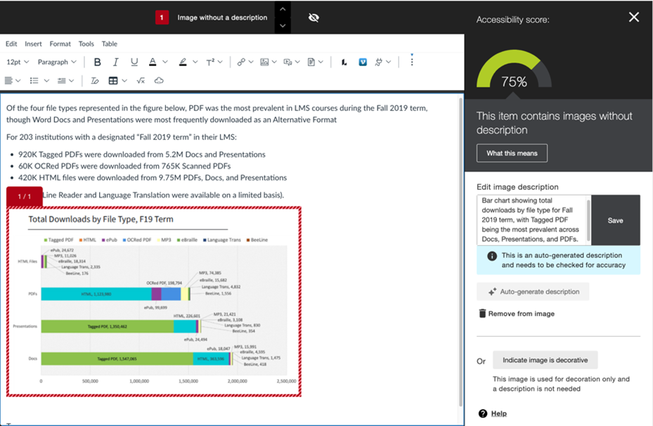
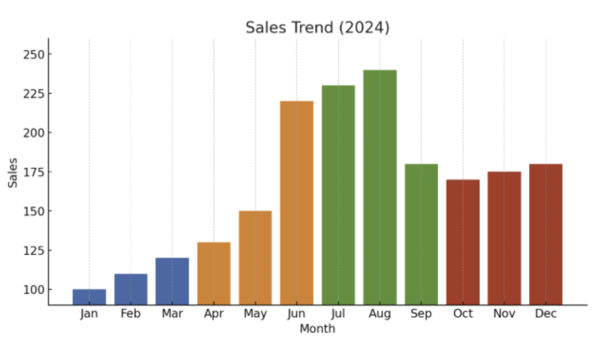

# AltContext launch pricing and first year economics

8 October 2026. Amounts are USD unless explicitly marked CAD, before sales taxes. Launch timing is illustrative: November 2026 through October 2027. The initial audience is university professors preparing **course material in an LMS**. The MVP covers **still images**. Video descriptions contribute no revenue or usage to these estimates.

Start with a **$39 semester package for individual professors**, then test a **$49 monthly or $490 annual academic group plan** after a paid pilot demonstrates incremental value. These replace the earlier $59/$149 education prices. AltContext supplies a narrow still-image authoring and review workflow alongside the institution's LMS and accessibility suite. Price that scope and the additional work it saves. Use pooled image allowances, explicit top-ups, and a customer-controlled spending ceiling. Reserve the $149 publishing workspace, $249 team and $399 agency proposals for customers whose broader workflows earn those prices. Avoid hard weekly limits: course preparation, editorial deadlines, and sporting events create legitimate bursts.

The working first-year goal is **5–10 paying professor pilots and 3–10 separately paying departments or organizations**. Ten academic group accounts at the modeled acquisition pace produce **$2,744 in year-one subscription revenue**, ending at **$5,880 annual recurring revenue**. One hundred produce **$20,335**, ending at **$58,800 ARR**. These smaller offers do not support the previous operating budgets or a full founder salary. The higher commercial-package scenarios below produce about $12,151/$108,613 in total year-one revenue at ten/hundred accounts; those require a different package mix and proven commercial workflows. They are not forecasts for selling the smaller academic offer.

These are conditional scenarios, not estimates of market prevalence or probabilities of success. The [editable forecast](forecast.xlsx) and [inputs and source ledger](inputs.json) preserve the original commercial scenario, including its $149 plan named Department. The revised $49 academic sensitivity is calculated separately below; the companion files have not been repriced.

The Ontario take-home path is a separate mature-business planning calculation, also not incorporated into those companion files. Resolve the year-one targets on 31 October 2027, or twelve months after a revised launch date, using paid invoices, active contracts, and booked revenue.

References sit beside the decisions they support. Published rule wording and IDs come from **Heuristics Canon v0.25.6**, the release named in the pinned copy's manifest; all 53 manifest file digests were verified. Distilled corpus notes explain the literature and its limits; prices and numerical gates remain AltContext assumptions. **[Resolvable forecast contract, FORE-02](../../../../heuristics-canon-v0.25.6/lexicons/epistemics.md#fore-02), Superforecasting, ch. 3**, governs the scenarios: record actual contracts, subscription/setup revenue and cash at months 3, 6 and 12, then replace assumptions with observations. Monthly exit targets below are aspirations conditional on the stated account paths, not probabilities or year-one earned revenue. The separate mature-business destination is approximately **$127,000 MRR/$1.52 million ARR**, supporting a modeled **$250,000 USD net founder salary in Ontario** under the stated tax, exchange-rate and service-cost assumptions.

## The launch offer and the least difficult workflow

The professor is the user and potential champion. A department, teaching and learning center, accessibility office, or library may become the budget owner. One university with ten professors is **one institutional customer** if it buys one contract. Ten professors paying independently are ten individual purchasers, not ten university contracts.

*Lean Analytics*, ch. 29, distinguishes users, champions, purchasers and gatekeepers; faculty enthusiasm alone cannot establish a department's budget or procurement path. [Buyer-role distillation](../../../../heuristics-canon-research/distilled/business/croll-yoskovitz-lean-analytics.md#ch-29).

Begin with a course preparation service that requires no LMS installation:

1. The professor provides 10–25 still images from one course and the surrounding text or learning objective. Use the university's permitted transfer method. An upload/review page is the proposed front door; the existing WordPress plugin is not an LMS integration.
2. AltContext returns draft descriptions, preserving the image filename and course reference. The professor checks factual accuracy and whether the description serves the lesson.
3. Return approved short text with an easy copy action. For information needing a longer equivalent, return separate text to place alongside the image or on a linked course page.
4. The professor places the text in the LMS's normal image and content fields. A CSV can organize the batch, but it is not an automatic LMS import unless that import has been tested.

For a small pilot this minimizes setup. For hundreds of images, copying can become the largest remaining task. Measure time spent generating, reviewing, transferring, and fixing descriptions separately. Build the first native connector only after three paying accounts use the same LMS and transfer work consumes more than 25% of their measured workflow time. These are proposed investment gates, not published thresholds. A browser extension also creates installation and security-review friction; it is a later option if the measured workflow supports it.

This manual batch is a concierge test of value, usability, feasibility and viability, following *INSPIRED*, chs. 33, 34 and 42; a usable editor alone cannot prove demand or chart fidelity. **[Cheapest learning first, PROD-03](../../../../heuristics-canon-v0.25.6/lexicons/business-marketing.md#prod-03)** draws on *Lean UX*, ch. 12, and *INSPIRED*, chs. 33–34. [Concierge distillation](../../../../heuristics-canon-research/distilled/business/cagan-inspired.md#ch-42), [manual-learning distillation](../../../../heuristics-canon-research/distilled/business/lean-ux.md#ch-12). **[Principle 19: Step size is bounded by the feedback that can catch it](../../../../heuristics-canon-v0.25.6/PRINCIPLES.md#19-step-size-is-bounded-by-the-feedback-that-can-catch-it)** and **[CARD-17: Step size by feedback](../../../../heuristics-canon-v0.25.6/reasoning/step-size-by-feedback.md)** bound investment: one checked course batch precedes shared delivery, and proven shared delivery precedes a connector or video branch. Name the evidence that would stop each next increment.

**Course material changes the product test.** Charts, maps, equations, diagrams, and scientific images are not adequately served by a photo caption alone. W3C guidance describes a short alternative plus a longer equivalent for complex images. The professor must supply the intended instructional purpose and verify numerical and subject-specific content. Do not promise PDF, PowerPoint, whole-course remediation, or a validated complex-image service from a successful ordinary-photo demonstration. [W3C complex-image guidance](https://www.w3.org/WAI/tutorials/images/complex/).

Regulatory obligations explain part of the demand, but an AI draft is not a guarantee of compliance. Ask the university which requirement, content scope and review policy it is implementing. US DOJ guidance now lists April 26, 2027 and April 26, 2028 compliance dates, and explicitly explains that a state university's relevant population is not its student count. Ontario guidance distinguishes public websites from private intranet/extranet requirements; do not transfer public-site rules automatically to a private LMS. Course access and accommodation obligations need their own institutional interpretation. [Current DOJ guidance](https://www.ada.gov/resources/web-rule-first-steps/), [Ontario guidance](https://www.ontario.ca/page/when-public-websites-are-not-accessible).

Run a paid course-material evaluation before committing to an education-wide launch. Include ordinary images and a separate set of complex figures. Compare with the university's incumbent tool. If the MVP handles ordinary photographs but fails figures, narrow the sold scope and route figures to the instructor or a separately quoted specialist service. Recognition of familiar people can help campus communications later; it is not the central value proposition for lecture diagrams.

## Current competitors and substitutes

Public commercial offers checked on 8 October 2026 establish that hosted paid alternatives exist beyond AltText.ai. A customer's key for one of these services is different from requiring that customer to buy an OpenAI or Claude API account. The survey establishes published offers and features, not independent assessments of quality, uptime, or customer adoption.

| Product | Public pricing and comparable unit | Buyer implication |
|---|---|---|
| AltText.ai | Annual plans: $49 for 1,200 images; $189 for 6,000; $489 for 24,000; $1,179 for 60,000; $2,199 for 120,000. About 4.08¢ down to 1.83¢ per image at full use. Platinum monthly is $229 for 10,000. Packs are $3 for 50. | Hosted alt text, bulk operations and CMS integrations set a low price for generic drafts. Annual unit prices are not monthly subscription prices. [Pricing](https://alttext.ai/pricing). |
| AltTextify | Monthly $5/175, $19/800, $49/2,500, $99/7,000, $199/20,000 credits. One credit per generation or regeneration: approximately 2.86¢ down to 1.00¢. Packs available. | Another paid hosted service with CMS, browser and API distribution. [Pricing](https://alttextify.net/plans). |
| Altomatic | Monthly $5/500 through $200/24,000 credits. **Alt text costs three credits per image**; effective draft-only price is about 3.00¢ at Basic and 2.50¢ at Scale before unused credits. Optimization variants consume additional credits. | Comparing credits without normalizing their consumption gives the wrong answer. An older comparison article's one-credit example conflicts with the current pricing page. [Current pricing](https://altomatic.ai/pricing). |
| ALTtext.org | Free 20 descriptions/day; $9.99 one-time for personal noncommercial use; commercial Team $19.99/month for up to five seats; Business/API $99/month with an unspecified quota. | Free and inexpensive substitutes constrain personal pricing. The personal lifetime offer is not an equivalent institutional license. [Pricing](https://alttext.org/pricing). |
| Anthology/Blackboard Ally | Institutional accessibility suite with AI alt-text suggestions, surrounding rich-content/PDF context, and instructor review. Advertises support for STEM, charts and handwriting. Public pricing is quote-based; Blackboard says AI capabilities are included in the standard license. | Overlaps the image task while covering much more of the institution's accessibility workflow. Evaluate actual outputs and incremental faculty cost. Advertised chart support is not a measured accuracy result. [AI assistant documentation](https://help.anthology.com/ally-lms/en/administrators/ai-alt-text-assistant.html), [license and scope](https://www.blackboard.com/solutions/ally). |
| YuJa Panorama | Institutional accessibility product with AI alternative text and image extraction from documents. Enterprise pricing and pilots are quoted. | Competes for the institutional accessibility budget and can bundle broader remediation. [AI workflow](https://support.yuja.com/hc/en-us/articles/24677216746391-How-Does-Panorama-Use-AI-to-Generate-Alternative-Text), [pricing](https://www.yuja.com/pricing/). |
| PhotoShelter for Brands | Quote-based DAM plans. Published packages include 2–5 library seats and storage. AI pages advertise alt text, batch review, IPTC output, PeopleID and PlayerID. | Similar features are available in a broader asset-management suite. The user's $6k–$7k annual estimate is unverified and cannot be converted into a seat price. Its advertised capabilities do not establish that recognized names feed every alt-text result. [Plans](https://go.photoshelter.com/brands/pricing/), [AI features](https://go.photoshelter.com/brands/artificial-intelligence-ai/). |
| DBGallery | Advertises AI descriptions, OCR and facial recognition. Its 2025 update states an education/nonprofit/government discount of 20%; a current base price was not recoverable from the dynamic pricing page. | Another adjacent DAM competitor, so feature uniqueness cannot be assumed. [Vendor update](https://dbgallery.com/2025-price-change). |

Manual authoring, a university-supported general AI assistant, and existing LMS accessibility features also compete with the offer. Test those actual alternatives, including the instructor's time. Do not treat every image in an institution's archive as a potential new paid description.

For education, PhotoShelter's total DAM contract is a weak price anchor. The stronger anchor is the cost of a professor completing the task with tools already available. For marketing and sports teams, an existing DAM is often a complement: AltContext can serve a specific publishing step without asking the team to migrate its archive. This is a positioning hypothesis to test.

### Blackboard pricing and the academic foothold

**There is no verified public 2026 dollar list price for Blackboard Ally in the sources reviewed.** Its current product page directs institutions to a demo/sales conversation and states that AI capabilities are included in the standard license, with no feature add-on or heavy-use overage charges. Blackboard LMS is a separate, much broader product; its public product page also supplies no comparable per-image price. A campus quote needs its licensed population, product scope, term and implementation costs. Do not invent a $/student estimate or divide an LMS contract by its feature count. [Ally pricing policy](https://www.blackboard.com/solutions/ally), [Blackboard LMS](https://www.blackboard.com/solutions/lms/blackboard-learn).

For a professor whose institution has licensed and enabled Ally's assistant, another draft may have **zero additional license cost to that professor**, even though the institution pays for Ally. Activation and local policy still matter. AltContext is a potential complement with overlap in image authoring, so an institution's entire accessibility-suite budget cannot justify AltContext's price. Its smaller scope supports a smaller offer; the amount should then be tested against the value of the extra task completed.

| Route to a foothold | Offer and evidence needed | Response if the premise fails |
|---|---|---|
| Preparation before LMS upload | Faculty working across source files and course placements need a permitted, reusable image-description batch. Test whether this removes work their incumbent leaves them doing. | If manual transfer and duplicate review erase the saving, improve that measured step or stop selling this workflow. |
| One difficult disciplinary task | Recruit a course team with recurring figures that require substantial factual or pedagogical correction. Characterize performance before selling a complex-image service. | If Ally plus instructor review handles the task as well, decline a premium and pursue another need or segment. |
| Small shared academic group | Test $49/month for pooled drafts, a shared batch and approved exports, with instructor-owned review. Advanced permissions and review history require delivery evidence. | If only generic drafts have value, offer the occasional pack or recommend the tool already available. |
| Campus communications, sports or editorial publishing | Pursue a separate buyer with repeated identity-sensitive selected photos, publication context and measurable coordination work. | Keep this segment's pricing and evidence separate from teaching use. A sports roster does not establish demand from professors. |

Price reduces the size of the purchase; useful features and a manageable workflow supply a reason to buy. Neither a lower price nor a long feature list solves the zero-incremental-price incumbent problem. In the first interviews, compare against the actual enabled Ally/Panorama workflow, manual authoring and university-approved general AI. Recruit satisfied incumbent users as well as people with unresolved work.

Focus on one course team and one recurring problem. Porter’s *Competitive Strategy*, ch. 2, supports serving a narrow product-line slice well; it does not establish that this slice is underserved. The likely incumbent response is to improve or bundle more image assistance, which Blackboard already describes as part of its license. That response is an inference from its public strategy and capabilities, not inside knowledge of its roadmap. **Rival reaction before move [STRAT-28], Competitive Strategy (Porter), ch. 3** calls for that response analysis before committing. [Focus distillation](../../../../heuristics-canon-research/distilled/business/competitive-strategy-porter.md#ch-2), [competitor-response rule](../../../../heuristics-canon-v0.25.6/lexicons/business-marketing.md#strat-28).

### How good is Ally at charts? Examples and limits

**This review establishes a shipped drafting capability and selected demonstrations, not a chart-accuracy rate.** Blackboard's documentation describes suggestions requiring instructor review. No representative independent evaluation of current Ally on university charts was identified in this review. A vendor example can establish that the workflow runs; it cannot establish numerical fidelity across small labels, logarithmic axes, stacked series, error bars, equations or assessment contexts. [Ally's intended use and limitations](https://help.anthology.com/ally-lms/en/administrators/ai-alt-text-assistant.html).

**Example 1 — an actual Ally chart and generated suggestion.** The vendor's August 2025 product post includes this screenshot of *Total Downloads by File Type, F19 Term*. The source chart separates original file categories from alternative-format download series. The visible suggestion summarizes downloads and Tagged PDF predominance. It does not show a numerical account of the stacked series. The text field scrolls, so this screenshot does not expose the complete draft: missing details cannot be assumed absent from the hidden portion. The predominance wording needs checking against each source category, especially the PDF row's large HTML segment. This is a useful example to scrutinize, not proof of a correct long equivalent. [Original Ally product post and screenshot](https://community.blackboard.com/public/blogs/alt-text-or-it-didnt-happen-allys-alt-text-assistant-just-got-a-whole-lot-smarter-2025-08-08).

That post names Claude Sonnet 3.5. The current assistant documentation names a different model, so the historical screenshot cannot be treated as a benchmark of the currently enabled campus version. Record version, date, surrounding context and complete output in any new comparison.

**Example 2 — why the instructional task changes the acceptable description.** Blackboard's December 2025 article shows the following sales chart with generic AI-written and human-written alternatives. The article does **not** identify the AI example as an Ally output. The AI draft recounts colors and seasonal movement; the human alternative concentrates on the summer peak. That may suit a lesson about seasonality. A question asking the learner to compare June with August instead needs the relevant data, and neither a seasonal summary nor a green accessibility indicator establishes that equivalent access was provided. [Chart and both alternatives in Blackboard's article](https://www.blackboard.com/blog/ai-accessibility-and-the-risk-of-easy-answers-why-human-oversight-still-matters).

**Example 3 — watch the actual workflow.** Blackboard's [Using Ally's AI Alt Text Assistant video](https://vimeo.com/1193399576) presents examples involving handwriting, embedded images, equations, posters and charts. The public description identifies these demonstrations; this review has not scored all video outputs. Ask a pilot institution to reproduce the chart and equation cases in its enabled version, save the full drafts, and include figures the vendor did not select.

For a small comparison, choose 20–30 permitted figures from two or three courses, with ordinary charts, dense/multi-series charts, scientific diagrams and equations reported separately. Have the instructor specify the task and establish factual reference data before seeing either system's draft. Where available, use the original table or source figure rather than reading tiny values back from a raster. Compare Ally, AltContext and the approved general-AI workflow on identical source/context inputs, then separately measure each tool's normal workflow. Do not bypass a policy restriction to equalize inputs.

Measure axis/scale/unit errors, incorrect or invented values, omitted series or uncertainty, unsupported conclusions, answer leakage, instructor correction time, transfer time and learner task completion. Include compensated blind/low-vision learners using their normal assistive technology and an accessibility specialist. Record listening/navigation burden as well as authoring time; longer output is not automatically better. A description that supplies the assessed answer or omits evidence needed to solve the problem fails that task even if its labels are accurate. Report complete outputs, denominators and unresolved failures. This is a discovery comparison, not a population accuracy estimate or compliance certification.

**[Choose the metric for the goal, UXR-03](../../../../heuristics-canon-v0.25.6/lexicons/interaction-ux.md#uxr-03), Measuring the User Experience (Albert & Tullis)** connects each metric to its intended outcome. **[Stand-in is not inclusion, UXR-16](../../../../heuristics-canon-v0.25.6/lexicons/interaction-ux.md#uxr-16), Design Justice, ch. 2** requires the people whose access is claimed to participate; faculty judgment cannot substitute for learner experience. **[Principle 4: You get the number you pay for, not the outcome you want](../../../../heuristics-canon-v0.25.6/PRINCIPLES.md#4-you-get-the-number-you-pay-for-not-the-outcome-you-want)** and **[CARD-13: Proxy-outcome integrity](../../../../heuristics-canon-v0.25.6/reasoning/proxy-outcome-integrity.md)** require separate reports of factual failures, learner task completion and authoring time. Use **[CARD-30: Signal density, not length](../../../../heuristics-canon-v0.25.6/reasoning/signal-density-not-length.md)** if a quality score rewards verbosity: budget listening/navigation time and verify task success. None of these references supplies a measured accuracy rate for either product.

### Facial recognition: offered elsewhere, valuable in a narrower segment

| Product | Documented capability | What it does not establish |
|---|---|---|
| PhotoShelter for Brands | PeopleID identifies enrolled people; PlayerID combines facial recognition with jersey information for sports tagging. Its suite also advertises AI alt text. [Vendor capabilities](https://go.photoshelter.com/brands/artificial-intelligence-ai/), [PeopleID explanation](https://go.photoshelter.com/brands/blog/facial-recognition-auto-tagging-peopleid/). | That identity is correctly included in every description, or that a course instructor needs this workflow. |
| DBGallery | Users name a recurring face and the system applies that identity across the collection and subsequent uploads. Its documentation says face recognition does not currently apply to video. [Facial-recognition documentation](https://docs.dbgallery.com/facial-recognition). | A unique feature for AltContext, independent accuracy evidence, or an identity-aware accessibility output. |

For most chart, equation and diagram tasks, recognizing a person contributes little to the learning objective. Its stronger hypothesis is repeated campus events, alumni/faculty profiles, sports and local editorial coverage where the publisher needs the correct name. Compare it with an approved caption, filename, roster or a human choosing a known person: those may be cheaper and sufficiently reliable. Keep identity optional, scoped to a customer-authorized roster, and subject to review; a proposed match can remain unknown. Recognition alone establishes neither permission to publish a name nor the relevance of naming that person in alt text.

Measure **net identification time saved**, after enrollment, corrections, roster maintenance and review. For illustration, 1,000 selected photos/month × 25% needing identity × 30 seconds saved = about 2.1 hours. At an assumed $40/hour that is $83; one additional hour of roster work reduces it to $43. Those assumptions would not justify a $100 monthly upgrade solely for recognition. Interview the publishing segment and measure its actual workload before selling the premium. This is a value calculation, not a market-use estimate.

### Does Ally provide video transcripts and descriptions?

| Capability | Evidence as of this review | Implication for AltContext |
|---|---|---|
| AI image-description drafts | Documented Ally assistant workflow for still images, including images in rich content and PDFs. | An existing substitute for this slice of the image task. |
| Captions and speech transcripts | **Blackboard Video Studio** advertises editable automatic captions and transcripts. Those transcripts can be downloaded in alternative formats through **Ally**. This is an integrated Video Studio/Ally path, not evidence that Ally alone transcribes arbitrary uploaded video. [Video Studio](https://www.blackboard.com/solutions/lms/video-studio). | Generic speech transcription is an established capability. Ask whether the campus licenses and uses this path. |
| Narration of visual information absent from speech | No standalone Ally feature generating such video descriptions was documented in the reviewed sources. An audio alternative made from document text or a speech transcript is a different output. | An evidence gap to verify in a product demo, not proof of market absence. |
| AI-generated video audio descriptions elsewhere | YuJa Lumina's GenAI Video PowerPack generates enhanced audio descriptions with pause-and-play delivery and an editor. Purchase of that PowerPack is required for the documented generation workflow. [Product](https://www.yuja.com/LUMINA/genai-video-powerpack/enhanced-audio-description/), [generation instructions](https://support.yuja.com/hc/en-us/articles/29432118933015-Generating-an-Enhanced-Audio-Description-with-GenAI). | Video description itself is already offered. A new video product would need a more specific advantage and its own cost, timing and quality evidence. |

Keep transcription, captions, visual description and descriptive transcripts distinct in interviews and product copy. The forecast remains still-image-only. Video is a later research branch and should not be used to justify the launch price.

## A feature hypothesis for interviews

Explore **assessment-equivalent descriptions with review of changes to each course use**. The customer problem to test is that a reused figure can need different descriptions in a lecture, practice exercise and graded assessment, and a change to its data or question can invalidate a previously approved description. The proposed product outcome is fewer missed corrections and less repeated review while preserving the evidence learners need to perform the same task.

Investigate the recent failure before presenting the solution. **[Problem before solution, PROD-02](../../../../heuristics-canon-v0.25.6/lexicons/business-marketing.md#prod-02), Lean UX, ch. 5**, and **[Prefer evidence of action, UXR-39](../../../../heuristics-canon-v0.25.6/lexicons/interaction-ux.md#uxr-39), Interviewing Users, ch. 3**, favor actual figures, revisions and workarounds over requested features.

This is a hypothesis about a differentiated **combined workflow**, not a verified claim that no product offers it. Learning-objective prompts and instructions to avoid giving away answers already have prior art: VCU publishes both in its [assessment-safe visual-description guidance](https://blogs.vcu.edu/ledstudio/2026/02/13/countdown-to-april-24th-ai-as-your-accessibility-partner/). Panorama can [apply a description to repeated image occurrences in a course](https://support.yuja.com/hc/en-us/articles/19819673562391-Adding-Alt-Text-to-Images-in-Canvas-Using-Panorama), and DBGallery lists [version control](https://dbgallery.com/pricing). Contextual prompting, reuse and versioning individually are established ideas. The reviewed product documentation did not demonstrate the complete per-use assessment and change-review workflow below; absence from these pages is insufficient to claim market-wide novelty. VCU is cited for its authoring practice, not its regulatory-date claims.

1. The instructor provides the figure, trusted data where available, learner level, learning objective, course placement and assessment question. Keep a lecture description separate from an assessment description even when the pixels are identical.
2. Return a short alternative and a longer equivalent when appropriate. Link factual claims to supplied data or the relevant region of the figure. Flag missing evidence and potential solution leakage for instructor review. Do not invent unreadable values.
3. Record the approved description and its source/context version. When the data, figure, question or approved subject terminology changes, show which course uses need review and the relevant difference. Preserve approvals for unaffected uses and require confirmation before replacing text.
4. Instructors and accessibility reviewers check whether the description permits the intended task without doing the reasoning the assessment measures. Where text would invalidate the assessed sensory task, defer to the institution's assessment/accommodation process. W3C describes a specific test/exercise exception; it is not a general excuse to withhold relevant information. [W3C SC 1.1.1 explanation](https://www.w3.org/WAI/WCAG22/Understanding/non-text-content.html).

For example, a lecture can discuss the interpretation of a dose-response curve. A quiz asking for a threshold may need the verified axes, units and data without a calculated answer. If the instructor changes one plotted value or the question, the workflow should flag the affected quiz description and retain the independently approved lecture version. Demonstrate this first with a manual review record and permitted files; no automatic LMS tracking or production capability is assumed.

### Interview questions and the next commitment

Recruit 8–12 faculty across two or three figure-heavy disciplines, including both satisfied and dissatisfied incumbent users; 2–3 accessibility/instructional-design staff; and 3–5 compensated blind/low-vision learners or accountable co-design participants. These proposed numbers support problem discovery, not prevalence estimates. Ask the faculty or staff member who can approve a purchase to join the buying discussion. Obtain permitted material without student identifiers or unreleased exam answers in the learner test.

Before showing the feature idea, ask:

- “Walk through the last figure you prepared for a course or assessment. Show the image, the task and the description you actually used.”
- “What did Ally or your other tool return? What did you correct, and what happened after the correction?”
- “Show the last time the same image needed different wording in two teaching uses.”
- “When a figure or question changed, how did you find descriptions that needed review? Show a recent miss or the method that prevented one.”
- “What information did the learner need to complete the task? What was missing or revealed too soon?”
- “Who paid for the last additional accessibility tool or service, what budget funded it, and what approval steps were required?”

For learners, observe an approved non-graded task with their normal tools and ask what they could establish from the description. Separate their access needs from the instructor's assumption about them. Save an interview snapshot containing the recent story, artifact references, participant's words, observed workaround and unobserved assumptions. **Elicit a specific story [UXR-20]** and **Snapshot each interview [UXR-21], Continuous Discovery Habits (Torres), ch. 5**, support this method. [Story rule](../../../../heuristics-canon-v0.25.6/lexicons/interaction-ux.md#uxr-20), [snapshot rule](../../../../heuristics-canon-v0.25.6/lexicons/interaction-ux.md#uxr-21), [research distillation](../../../../heuristics-canon-research/distilled/business/torres-continuous-discovery-habits.md#ch-5).

Then offer a permitted comparison using actual figures, followed by a small paid course batch. Resolve the first discovery decision by **6 January 2027**, or 90 days after a revised start:

| Assumption | Proposed learning gate | Disconfirmer and response |
|---|---|---|
| Different teaching uses or changes cause recurring review work | At least four interviewed faculty show a recent concrete instance and its consequence, with variation across at least two disciplines. | If the cases are rare or their current method solves them cheaply, drop this feature priority. |
| The proposed workflow improves the task | In a bounded manual comparison with five instructors, at least three achieve 30% lower end-to-end preparation/review time on their checked tasks, with no remaining critical factual error or answer leakage. Report learner task failures separately and resolve them before wider use. | If errors, missing evidence, transfer or extra form filling erase the benefit, revise the workflow or narrow the scope. Longer descriptions or more generated text do not count as success. |
| The smaller offer has incremental paid value | Offer the deliverable $39 semester package to ten qualified prospects after useful evaluation; seek at least three purchases. For the shared workflow, seek two separate budget owners purchasing a deliverable $49 group month. | Fewer than three professor purchases or two group purchases pauses expansion of the corresponding offer pending a revised test. If users will only use it free, revise the opportunity or stop education expansion. An unpaid expression of interest is not demand. |
| A feature can survive bundling by the incumbent | Ask buyers whether they would still value the reviewed per-use workflow if Ally improved its draft quality, and verify the latest incumbent demo before authorizing a build. | If incumbent authoring, reuse and review solve the task at no extra price, pursue a different need. Interview answers alone do not establish a durable barrier. |

These thresholds are proposed investment decisions set before collecting results, not published research standards.

**[Falsification wins, PROD-04](../../../../heuristics-canon-v0.25.6/lexicons/business-marketing.md#prod-04), Lean UX, ch. 12; Lean Analytics, ch. 2**, and **[Invert, always invert, STRAT-02](../../../../heuristics-canon-v0.25.6/lexicons/business-marketing.md#strat-02), Poor Charlie's Almanack, § talk-1**, ask what would defeat the thesis. **[Principle 2: Specify what would prove you wrong](../../../../heuristics-canon-v0.25.6/PRINCIPLES.md#2-specify-what-would-prove-you-wrong)** and **[CARD-08: Falsification and disconfirmers](../../../../heuristics-canon-v0.25.6/reasoning/falsification-disconfirmers.md)** turn that into dated pass/miss boundaries and a response to each miss. *Continuous Discovery Habits*, chs. 9–10, supports exposing workflow assumptions and testing specific behaviors; small discovery samples cannot establish prevalence. [Assumption mapping](../../../../heuristics-canon-research/distilled/business/torres-continuous-discovery-habits.md#ch-9), [assumption testing](../../../../heuristics-canon-research/distilled/business/torres-continuous-discovery-habits.md#ch-10).

The purchase gate applies **[Ask them to buy, GTM-01](../../../../heuristics-canon-v0.25.6/lexicons/business-marketing.md#gtm-01), The 4-Hour Workweek, ch. 10**, and **[Micro-test the offer, GTM-02](../../../../heuristics-canon-v0.25.6/lexicons/business-marketing.md#gtm-02), The 4-Hour Workweek, § micro-test**. **[Principle 13: Evidence precedes commitment](../../../../heuristics-canon-v0.25.6/PRINCIPLES.md#13-evidence-precedes-commitment)** and **[CARD-06: Evidence before commitment](../../../../heuristics-canon-v0.25.6/reasoning/evidence-before-commitment.md)** require the incumbent baseline, checked output, actual payment and measured service burden before funding the next build. Link those artifacts to the investment decision; a promising demo is insufficient.

## Recommended packages

These are proposed prices, conditional on the stated workflow being deliverable. Initially show only the professor package and academic group offer to education prospects. Their limited scope excludes whole-course scanning, document remediation, institution-wide reporting, LMS integration and a video service. Those differences from Ally explain the smaller offer. Validate incremental value at the proposed price before adding capability or increasing it. Show commercial packages to their relevant buyers.

| Offer | Proposed price | Allowance | Who it serves and commercial boundary |
|---|---:|---:|---|
| Evaluation | $0 once | 25 ordinary still-image drafts | One course or publishing workflow. No permanent monthly free service. Ask for payment when the evaluator has approved useful drafts. |
| Professor semester | $39 once per 4-month term | 500 ordinary image bundles across up to three courses | One instructor, manual import/review, no administrator installation. Customer reviews the drafts. A second term is another purchase; do not assume automatic renewal. |
| Academic group | $49/month or $490/year | 500/month or 6,000/year | One teaching unit, up to ten named operators, pooled drafts and approved exports. A shared batch can be delivered manually during the pilot. No SLA, custom integration or specialist editing included. Shared permissions/history require evidence before self-service sale. |
| Occasional project pack | $29 once | 250 ordinary image bundles | Individual journalists, nonprofits and infrequent educators. No ongoing roster administration or custom integration. |
| Publishing workspace | $149/month or $1,490/year | 2,000/month or 24,000/year | Small publishers and communications teams. Up to 20 named operators and three workspaces; budget visibility and shared review records once supported. This is the original Department tier in the companion financial model, not the revised academic offer. |
| Team | $249/month or $2,490/year | 5,000/month or 60,000/year | In-house marketing, sports communications, publishers. Up to 30 named operators and five workspaces; maintained roster workflow where lawful and useful. |
| Agency | $399/month or $3,990/year | 10,000/month or 120,000/year | Publishing/advertising agencies. Up to ten separately isolated client workspaces and 50 named operators. One agency contract is one customer in the financial model. |
| Wholesale API | $149/month platform fee plus $0.035 per ordinary bundle, with a 25,000-image monthly commitment | Usage-priced | A platform or reseller with its own onboarding, support and review. Effective minimum bill $1,024/month. Quote only after load and support costs are measured. |

The professor and project packs do not imply that pooled accounts, a web review application, or connectors already ship. During concierge delivery, enforce the allowance and scope explicitly. Multi-user permissions, isolated agency workspaces, usage settlement, billing and exports need acceptance evidence before self-service sales. SSO, custom SLAs, on-premises hosting and an LMS connector are separately quoted implementation work, not assumed features in these prices.

At 25,000 bundles, the proposed wholesale minimum is slightly below the Agency plan plus 15,000 top-ups ($1,074). At 100,000 bundles, wholesale would cost $3,649 versus $4,449 on that Agency schedule. The discount buys a commitment and lower support obligations. At the $0.03 cost stress, wholesale leaves only $274 at the minimum before fixed costs, so measured cost and scope are prerequisites. Wholesale contributes no revenue to the launch forecast.

Academic group and professor top-ups can be **$8 for 100 ordinary bundles**. Commercial top-ups remain **$0.06/image for Publishing workspace, $0.05 for Team, and $0.045 for Agency**; project-pack top-ups can be $15 for 100. These are hypotheses to test against actual cost and willingness to buy. Require an explicit spending ceiling; default to pausing new processing at the allowance rather than silently billing. Notify at 80% and 100%. Queued processing should state its delivery window.

Monthly subscriptions can roll unused allowance for three billing cycles, with a bank limited to three monthly allowances. Annual contracts receive an annual pool, usable in preparation bursts through the contract term. Rollover and annual pooling must be backed by the billing ledger before being advertised. Prepaid project packs can remain usable for twelve months. Do not erase purchased credits on a plan change. Annual discounts are one-sixth of monthly subscription revenue, not free money; unserved annual usage remains a delivery obligation.

Include reviewers in the workspace price. Charging every reviewer discourages the behavior that improves the output. Limit billable workspaces, image volume and costly service commitments first. The initial operator limits above are generous proposed packaging boundaries; do not block occasional faculty participation to force an upgrade.

An optional **$199 onboarding service** covers up to two hours of substantive course mapping or roster setup. Basic academic group activation should not require this fee; the revised academic sensitivity assumes no onboarding revenue. Charge only for delivered, agreed service work. Extensive integration and specialist description work need a scoped quote. Human editing of every image is not included in the $39 or $49 academic software offers.

### What one image bundle means

Sell an understandable outcome: one image, one intended course/publishing context, one requested language, one draft, and one included revision. An unchanged retry, polling, manual text edits, exports and platform thumbnails consume no extra allowance. A new contextual use, additional language, or further generation is a new bundle when the customer intentionally requests it. Count successful delivered bundles, not HTTP requests or failed generation attempts.

Long equivalents for complex course figures need a separate validated service scope. Until quality and cost are measured, exclude them from automatic pack consumption and quote specialist assistance by time. If a validated automated complex-image path later uses two units, show that price before processing. Do not implement opaque token multipliers inside a supposedly per-image offer. The [existing usage adjudication](../../assessments/current/app1-usage-evidence-adjudication.md) meters compute operations, so a commercial bundle and its included revision require an explicit mapping to that ledger.

## Why this pricing structure fits

| Structure | Decision |
|---|---|
| Per image only | Keep packs for occasional work and backlog projects. Too little predictable revenue to support maintained institutional workflows on its own. |
| Flat unlimited subscription | Avoid at launch. A single remediation job can consume the month's capacity and makes the promise impossible to budget. |
| Tokens and hard weekly caps | Avoid for customer-facing billing. Buyers know images and courses. A weekly cap can stop a professor during course preparation despite unused paid monthly capacity. |
| Workspace fee plus pooled usage | Default for organizations. Budgeting is predictable, reviewers can participate, and image allowances protect delivery cost. |
| Pure metered API | Suitable for experienced integrators with spending limits. Keep institutional end users on understandable packs/pools. |
| Wholesale | Later, with a minimum commitment and explicit allocation of support, client isolation and review responsibilities. A reseller discount should purchase lower selling/support costs or committed demand. |

The academic price earns payment only if AltContext reduces additional review and transfer effort or supplies useful per-use records that the customer values. Feature count alone cannot calculate the right discount from an institutional suite.

**[Outcome over output, PROD-01](../../../../heuristics-canon-v0.25.6/lexicons/business-marketing.md#prod-01), Lean UX, ch. 3**, makes the extra task completed the pricing test. Track approved useful work, support time and contribution for the $49 group; generated text and feature count do not establish incremental value. [Outcome distillation](../../../../heuristics-canon-research/distilled/business/lean-ux.md#ch-3). Stripe's pricing guidance supports selecting salient package differences and capturing differing customer value; it does not validate these particular prices. [Stripe Atlas pricing guidance](https://stripe.com/guides/atlas/saas-pricing).

Use a measurable value calculation. If 300 images require 90 seconds each today and the approved AltContext workflow takes 30 seconds each, the assumed saving is five hours. At an assumed $40/hour, that is $200 per term. A $39 package consumes 19.5% of that value. If only 20 seconds are saved per image, the same calculation yields about $67, so the price consumes about 58.5% of the saving. These are test inputs, not established productivity results. Count transfer and correction time in both workflows, including the actual incumbent workflow available to the professor.

## Segment priorities and workloads to test

| Segment | Initial route | Planning range to test | Price and reason |
|---|---|---|---|
| Professors preparing courses | First | 50–500 new or changed image-context bundles per instructor per term; a backlog can add 200–2,000 | Semester pack. Preparation and reuse are seasonal, and instructors may lack buying authority for an annual institution contract. |
| Teaching and learning or accessibility unit | Second, through professor champions | 10 instructors × 100–300 changed bundles × two terms = 2,000–6,000/year, plus a separately counted backlog | $490 academic group pool after it removes real work. A smaller unit may prefer packs; neither the pool nor a higher commercial tier is compulsory. |
| In-house marketing or campus communications | Adjacent | 300–3,000 selected images/month | Team if shared records, rosters and publication context reduce coordination work. |
| Publishing or advertising agency | After isolated client delivery works | 1,000–10,000 selected images/month across clients | Agency pooling and spending limits. Advertising concept images may have less identity value than editorial/event photos. |
| Local journalist or independent publisher | Project or small team | 100–1,500 selected images/month | Packs or Publishing workspace. Verify actual budget and editorial review effort. |
| Sports communications | Adjacent after roster proof | 500–5,000 selected images/month, concentrated on game days | Team or Agency; queue fairness and predictable completion matter. Captured frames can be much higher than images needing descriptions. |
| Large archive or institutional remediation | Separate project | Count the actual selected backlog and contexts before quoting | Initial import fee plus bulk work. Do not infer renewal volume from a one-time archive cleanup. |

Every range above is an **assumption for interviews and pilot instrumentation**, not a demographic average. A department or agency can exceed these ranges. Both financial tables assume 50% consumption, but their allowances differ: an academic group uses 250 bundles/month at that rate; a $149 publishing workspace uses 1,000. Do not transfer commercial-package workload estimates to the smaller academic offer.

### Where image production estimates should come from

The useful quantity is images needing a new description in a particular context. Keep five counts separate: captured/uploaded files, unique selected assets, course/page placements, placements needing new or changed text, and billable generation bundles. Reused descriptions, CMS thumbnails, decorative images and duplicate files inflate a naive file count.

For the first five professors, inspect one actual course preparation cycle with them. Request a permitted course export or asset inventory, and count images in LMS pages, slides and PDFs separately. Sample the last completed term and the next planned term. Record which text already exists, whether it is adequate, how much is reused, and how many figures need longer equivalents. A sample syllabus alone does not provide the denominator. No student records are needed for this count.

For marketing and publishing prospects, use CMS/media-library creation logs over 90 days and publication records to identify what gets selected. For agencies, aggregate per-client inventories without sharing images across clients. For sports, pair a game calendar with delivered contact sheets and actual publication counts. Count an archive remediation project separately from new monthly production.

Public case studies can reveal workflow shapes and lead lists, but vendor libraries and cumulative image totals do not yield production rates. For example, PhotoShelter's University of Miami story describes a library of more than 500,000 images. That is stock, not images produced or described each month. [Miami Athletics case study](https://go.photoshelter.com/customer-story/how-university-of-miami-athletics-manages-photo-library/).

Track approved drafts, edit time, critical factual errors, copy/import time, retries and instructor return at the next preparation period. Publish small pilot results with their denominators. A dozen cooperative professors cannot establish average use across higher education. Torres's local distillation favors specific recent stories and assumption tests over future-intent answers; *Lean Analytics*, ch. 29, distinguishes user, champion, purchaser and gatekeepers. [Continuous Discovery Habits local distillation](../../../../heuristics-canon-research/distilled/business/torres-continuous-discovery-habits.md#ch-5), [Lean Analytics local distillation](../../../../heuristics-canon-research/distilled/business/croll-yoskovitz-lean-analytics.md#ch-29).

## What the GPU evidence establishes

The [July inference forecast](../inference-cost-and-unit-economics-forecast.md) records warm A10 inference at approximately six seconds/image using a $2/hour rate, and A1 CPU inference at approximately 48 seconds/image using $0.152/hour. It forecasts, rather than measures, a four-to-eightfold batching gain. It is not a representative production study of lecture figures, bursts, failures, retries or review.

Useful recalculations are:

| Calculation | Result and boundary |
|---|---|
| Warm A10, saturated single stream | $2 × 6 / 3,600 = **$0.00333/inference**. A two-pass bundle would be about $0.00667 before startup and handling. |
| A1 CPU, saturated | $0.152 × 48 / 3,600 = **$0.00203/inference**. Cheap does not establish equal model quality or adequate turnaround. |
| Always-on A10 | $2 × 730 = **$1,460/month**, before storage and other services. At 1,000 images/month that is $1.46/image; at 10,000 it is $0.146; at 100,000 it is $0.0146. |
| Four-to-eightfold batching | Potential improvement remains unmeasured. Do not use $0.0005 as the launch budget. |

The earlier statement of “greater than 99%” inference margin is too broad. At $0.03/image and $0.00333 inference cost, inference-only margin is **88.9%**; at $0.02 it is **83.3%**. Support, payments and idle resources reduce this further. A warm image removes repeated downloading, but boot, model initialization, idle grace periods, persistent volumes and failed work still cost money.

The financial model budgets **$0.015 per delivered ordinary bundle** for variable compute, retries and transient handling, plus separate fixed infrastructure and support. This is a reserve assumption, not a measured blended cost. Stress it at **$0.03**. A one-cent cost increase raises year-one expense by $100, $812 and about $8,196 in the original 1-, 10- and 100-account commercial scenarios. In the smaller academic scenarios it adds $25, $140 and about $1,038. If specialized course diagrams take more passes, these figures need remeasurement before inclusion.

At 50% allowance use, monthly recurring contribution before fixed infrastructure/software, acquisition and founder labor is approximately **$101 per $149 publishing workspace**, **$122 per account in the original 10-account commercial mix**, and **$144 per account in the original 100-account commercial mix**. These figures include payment fees, a 2% leakage reserve and half an hour of paid support. They represent roughly 67–68% contribution, not accounting gross margin. For the **$49 academic group**, the same assumptions leave only **$18.82/month**, or about 38.4%; full allowance use leaves $15.07. Ten minutes of support rather than thirty would leave $33.82 at half use, but that reduction must be observed. Higher consumption or heavier support lowers contribution.

Human specialist review has a different cost basis. Two minutes per image at an assumed $45/hour costs $1.50/image before management and overhead. Sell that as scoped service work; do not bury it inside a few-cent software overage.

## Infrastructure changes and economies of scale

Keep the control plane and burst workers economically separate. An OCI CPU VM can remain suitable after the prototype if measured reliability, recovery, capacity and support needs are met. Customer count alone is not a migration trigger. Avoid an idle GPU for the first professors.

| Operating stage | Model workload at the stage | Recommended action |
|---|---:|---|
| First academic group | Approximately 250 bundles/month at half allowance use | CPU/control services plus queued GPU bursts. Back up data, measure restoration and allocate a paid-hosting budget; the model does not depend on permanent free-tier capacity. |
| Ten commercial workspaces | Approximately 14,500/month in the original mixed scenario; ten academic groups use 2,500 | Keep pooled bursts, cache unchanged work and prevent duplicate inference. Add worker concurrency only when the measured queue misses the agreed delivery window. |
| One hundred commercial workspaces | Approximately 197,500/month in the original mixed scenario; one hundred academic groups use 25,000 | Benchmark sustained batching and an alternative GPU provider. Separate workers and database if contention or recovery needs require it. Reserve recurring capacity only against predictable load or paid latency commitments. |

Under the old single-pass benchmark, 197,500 inferences require about 329 GPU hours. Two passes require about 658 hours, before startup and failures: the definition of the bundle can change the capacity decision at the same customer count. Similarly, 10,000 single-pass images take about 16.7 hours on one six-second stream. Semester preparation cannot be promised as instant service at that throughput.

Compare providers using **cost per successful bundle on the same quality-tested workload**, not hourly GPU price alone. Runpod currently lists an L4 Pod at $0.49/hour and a grouped 24 GB serverless option at $0.69/hour. Its serverless billing includes worker startup through shutdown, and Flex workers scale to zero. These are candidates for a benchmark, not proof that either is cheaper for AltContext. Region, VRAM, disk, availability, model initialization and data-transfer costs can change the result. [GPU pricing](https://www.runpod.io/pricing), [serverless billing](https://docs.runpod.io/serverless/pricing).

For an OCI A10 at the historical $2/hour anchor, an always-on worker costs $1,460 per 730-hour month. If a pooled burst path costs **$0.004 per single-pass image including startup/idle overhead**, its mathematical crossover is about **365,000 images/month**. That overhead rate is an assumption. With two such passes, crossover is about 182,500 bundles. These compare the same hardware/rate and include no availability premium. Without overhead or a committed discount, keeping the same GPU on longer cannot itself reduce the cost of its useful compute hours.

A cheaper dedicated option costing, for example, $500/month with $0.001 marginal cost, against a $0.01 variable alternative, crosses at about **55,556 bundles/month**: `500 / (0.01 − 0.001)`. That is an illustration, not a provider quote. Amortize migration/testing effort, operations, storage and backup into the fixed cost, then require at least three months of recurring load and a material margin of safety before committing.

Log useful inference seconds, paid lifecycle seconds, attempts per completed bundle, cold starts, queue age, completion time and customer-impacting failures. Investigate CPU, database and network bottlenecks independently. The upgrade gate is a measured constraint plus a favorable total-cost comparison. Remove duplicate/rescheduled work first. Apply **Eliminate work before buying hardware [COST-06], Systems Performance (Gregg)** and its constraint-before-capacity reasoning card. No actual saturation diagnosis is claimed by this strategy.

The published **[COST-06 rule](../../../../heuristics-canon-v0.25.6/lexicons/ml-systems.md#cost-06)** and **[CARD-33: Constraint before capacity](../../../../heuristics-canon-v0.25.6/reasoning/constraint-before-capacity.md)** require a measured limiting stage and a follow-up measurement after the change. Require the proposed three months of recurring load before reserved capacity; neither reference establishes that GPU capacity currently limits course preparation.

## Revised academic pricing and first-year sensitivity

Hold the existing monthly acquisition paths, 1.5% churn, 50% utilization, $0.015/bundle, payment/reserve rates, paid support, onboarding labor and fixed budgets constant, but make every institutional account a **$49 academic group with 500 monthly bundles**. Assume no paid onboarding, top-ups, professor purchases or video revenue. This isolates the pricing/scope change; it is not a revised staffing plan for a simpler product. Monthly prices are used, rather than the discounted annual offer.

| Revised academic-only result | One group | Ten groups | One hundred groups |
|---|---:|---:|---:|
| Customer-months billed | 10 | 56 | 415 |
| Annual subscription revenue earned during ramp | $490 | $2,744 | $20,335 |
| Average monthly subscription revenue during ramp | $41 | $229 | $1,695 |
| Variable delivery, fees, reserve, support and onboarding | $404 | $2,652 | $21,950 |
| Fixed budgets retained for sensitivity | $12,000 | $25,200 | $79,200 |
| Cash cost excluding founder pay | $12,404 | $27,852 | $101,150 |
| Operating result before founder pay | −$11,914 | −$25,108 | −$80,815 |
| Founder labor assumption | $60,000 | $60,000 | $84,000 |
| Result including founder labor | −$71,914 | −$85,108 | −$164,815 |
| **Aspirational month-12 subscription MRR** | $49 | $490 | $4,900 |
| Annualized month-12 subscription ARR (MRR × 12) | $588 | $5,880 | $58,800 |

Calculations use the [existing input assumptions](inputs.json); whole-dollar rows are independently rounded. For each month, gross additions are the active target less the previous month's accounts remaining after churn. Support costs $22.50 per active group-month and onboarding costs $90 per gross addition. At 100 groups those two labor provisions alone cost approximately $18,763 during the ramp. Giving away activation fees does not eliminate delivery labor; measure whether a simple self-service offer really reduces it.

This smaller offer is a paid foothold experiment. To make it a sustainable primary business, reduce setup/support and fixed spending with evidence, earn a price increase with a validated additional outcome, or develop a separately justified commercial segment. At the current $18.82 monthly contribution, even **founder pay alone** at $5,000/month requires about 266 continuously active groups before replacement onboarding and all fixed costs. A low acquisition price has to be paired with a low service burden. The previous 51-/89-account break-even figures below apply to the higher commercial mix, not this academic package.

## Original commercial scenarios and operating budgets

The institutional scenarios represent **accounts active by month twelve**, not accounts present for all twelve months. All use monthly list pricing, 50% allowance consumption, 1.5% assumed monthly churn, $45/hour paid support, half an hour of support per active account-month, and two onboarding hours per gross new account. Replacement sales maintain the entered active-account targets, so gross additions are fractional expected counts in the model.

The companion model still calls its $149 publishing tier Department. The mixes below are one such workspace in the first case; 70% of that tier/30% Team in the ten-account case; and 60%/25% Team/15% Agency in the hundred-account case. This is an illustrative commercial expansion mix, not evidence that universities will buy the larger packages. If all 100 accounts buy the $149 tier, exit recurring revenue falls to $14,900/month or $178,800/year. Use the preceding table for the smaller academic group offer.

| Year one result | One institution | Ten institutions | One hundred institutions |
|---|---:|---:|---:|
| Active account path by month | 0, 0, 1, 1, 1, 1, 1, 1, 1, 1, 1, 1 | 0, 1, 1, 2, 3, 4, 5, 6, 7, 8, 9, 10 | 0, 1, 3, 5, 10, 18, 28, 40, 55, 70, 85, 100 |
| Customer-months billed | 10 | 56 | 415 |
| Annual subscription revenue earned during ramp | $1,490 | $10,024 | $87,772 |
| Average monthly subscription revenue during ramp | $124 | $835 | $7,314 |
| Optional onboarding revenue | $0 | $2,127 | $20,840 |
| **Annual total revenue earned during ramp** | **$1,490** | **$12,151** | **$108,613** |
| Average monthly total revenue during ramp | $124 | $1,013 | $9,051 |
| Variable delivery, fees, reserve, support and onboarding | $586 | $4,319 | $38,868 |
| Fixed operating budgets below | $12,000 | $25,200 | $79,200 |
| **Cash cost excluding founder pay** | **$12,586** | **$29,519** | **$118,068** |
| **Operating result before founder pay** | **−$11,096** | **−$17,367** | **−$9,455** |
| Additional founder labor budget | $60,000 | $60,000 | $84,000 |
| **Result including founder labor** | **−$71,096** | **−$77,367** | **−$93,455** |
| **Aspirational month-12 subscription MRR** | $149 | $1,790 | $21,150 |
| Annualized month-12 subscription ARR (MRR × 12) | $1,788 | $21,480 | $253,800 |

Whole-dollar rows are independently rounded; the spreadsheet keeps cents. Setup fees are collected only for a delivered onboarding service. Waiving every modeled setup fee reduces revenue by $2,127/$20,840 in the ten/hundred cases, with a smaller corresponding reduction in fees/reserve. Neither overages nor video nor individual professor packages are included in institutional revenue, avoiding speculative expansion and double counting.

| Assumed annual fixed budget | One institution | Ten institutions | One hundred institutions |
|---|---:|---:|---:|
| Control plane, database, backups and fixed storage | $1,800 | $2,400 | $6,000 |
| Auth, monitoring, email and other software | $900 | $1,800 | $4,200 |
| Marketing, recruitment and acquisition | $1,800 | $6,000 | $24,000 |
| Contractor development and integration | $6,000 | $12,000 | $36,000 |
| Legal, insurance, accounting and administration | $1,500 | $3,000 | $9,000 |
| Annual total excluding founder | $12,000 | $25,200 | $79,200 |
| Average monthly fixed operating budget | $1,000 | $2,100 | $6,600 |

Development budgets assume an existing working prototype and a narrow still-image workflow. They are spending ceilings to replace with quotes; they do not cover a fresh LMS platform, campus-wide SSO/security program, or a video product. Development expense is paid in addition to founder work. Paid support/operator costs are also separate from founder engineering/sales labor. Payroll burden, personal income tax, corporate income tax and sales taxes are not modeled in these original year-one tables. The separate Ontario salary path below adds personal tax and founder employer costs for a mature business. Administration amounts are unquoted provisions, including incorporation/contract work and insurance if required by the chosen payment/supplier arrangement; obtaining those quotes can change the budget materially.

### The founder-pay assumption

| Modeled scale | Monthly founder budget | Annual founder budget | Interpretation |
|---|---:|---:|---|
| One or ten institutional accounts | $5,000 | $60,000 | A gross founder labor/pay provision for engineering, sales and management, starting in month one. |
| One hundred institutional accounts | $7,000 | $84,000 | A larger gross labor/pay provision as the business grows; the model has no separate second founder. |

These USD amounts come directly from the twelve monthly `founder` entries in [inputs.json](inputs.json). They are assumptions, not a salary benchmark, an agreed draw or take-home pay. The model does not derive them from hours worked. Employer burden, benefits and retirement contributions need a separate provision if paid; support and contractor development are already separate costs. The $50/hour founder sales valuation used in acquisition analysis is an opportunity-cost lens, not another salary added to the year-one result.

An unpaid-founder view removes this payment from business cash needs, while personal living costs still need their own runway. Paying $120,000 instead of $60,000 worsens the smaller-scenario annual result by $60,000; replacing $84,000 with $120,000 worsens the hundred-account result by $36,000, before any added burden. In the revised academic sensitivity those changes produce losses of about $145,108 at ten groups and $200,815 at one hundred. Do not conclude that low-priced education can fund a founder from its exit ARR alone.

The fee base is Polar Starter's published **5% plus $0.50**, not the older 4% plus $0.40 assumption. Its current page also lists international-card and payout extras. At ten customers, compare its $20/month Pro plan with the actual invoice count and card mix; at 100, a higher plan can be economical. Do not use the provider's generic sales crossover as an exact AltContext threshold. The default model conservatively retains Starter and treats fee optimization as upside. An existing Early Member account may have different terms; do not assume eligibility. [Polar pricing](https://polar.sh/resources/pricing).

In the **original commercial year-one scenarios**, full allowance consumption doubles variable image delivery from $150/$1,218/$12,294 to $300/$2,436/$24,589. A $0.03 bundle cost at the base workload produces the same increase. Moving every subscription to the proposed annual price reduces recognized subscription revenue by about **$248/$1,671/$14,629**, with a smaller reduction in percentage fees. Paying upfront improves collection timing but does not make the entire annual invoice immediately earned or remove the future service obligation. The model's collection-delay control represents monthly invoice lag, not annual prepayments.

### A path to $250,000 USD founder take-home in Ontario

**Target personal net pay: $250,000/year, or $20,833/month.** This is a mature-business aspiration, separate from the $60,000/$84,000 gross year-one provisions. At the planning exchange rate **US$1 = C$1.38**, the target is C$345,000 net. The exchange rate is an assumption, not a quoted spot rate. Use 2026 tax rules as a constant planning baseline; rerun the calculation with the applicable tax year and exchange rate before setting future payroll.

Assume an Ontario-resident founder, age 18–64, employed by an incorporated company, with no other income, RRSP deduction or special credits. This salary-only calculation uses basic personal/employment credits, base CPP credits and enhanced CPP deductions, plus Ontario surtax and health premium. [CRA 2026 Ontario payroll parameters](https://www.canada.ca/en/revenue-agency/services/forms-publications/payroll/t4032-payroll-deductions-tables/t4032on-jan/t4032on-january-general-information.html), [enhanced CPP deduction](https://www.canada.ca/en/revenue-agency/services/tax/individuals/topics/about-your-tax-return/tax-return/completing-a-tax-return/deductions-credits-expenses/line-22215-deduction-for-cpp-or-qpp-enhanced-contributions-on-employment-income.html). Assume the founder controls more than 40% of voting shares, making this employment non-insurable for regular EI; no voluntary special-benefits premiums are assumed. Recalculate if ownership or employment status differs. [CRA insurability rule](https://www.canada.ca/en/revenue-agency/services/tax/canada-pension-plan-cpp-employment-insurance-ei-rulings/employee-self-employed/determine-employment-pensionable-insurable.html).

| Annual salary calculation, rounded | CAD | USD at C$1.38/US$1 |
|---|---:|---:|
| Required gross founder salary | C$652,882 | $473,103 |
| Federal income tax | C$186,276 | $134,983 |
| Ontario income tax, surtax and health premium | C$116,959 | $84,753 |
| Employee CPP including CPP2 | C$4,646 | $3,367 |
| **Personal take-home** | **C$345,000** | **$250,000** |
| Employer CPP including CPP2, additional to salary | C$4,646 | $3,367 |
| Conservative employer health-tax allowance, 1.95% of salary | C$12,731 | $9,226 |
| **Budgeted employer cost of founder compensation** | **C$670,260** | **$485,696** |
| Monthly employer cost | C$55,855 | $40,475 |

Rounded rows may differ by $1. Solve `gross salary − federal tax − Ontario tax − employee CPP = C$345,000`; taxable salary is gross less C$1,127 of enhanced CPP deductions. Apply graduated rates and credits rather than multiplying the entire salary by the top marginal rate. At this income the federal basic personal amount is its minimum. These are annual planning calculations, not payroll-period withholding instructions.

The 1.95% health-tax allowance is deliberately conservative: eligible Ontario employers can exempt the first C$1 million of payroll, with eligibility and associated-employer limits. Actual founder-only payroll could therefore incur no EHT. At scale, other Ontario staff can use that exemption. Reconcile the allowance with total payroll rather than treating it as a mandatory tax on every founder salary. [Ontario EHT rates and exemption](https://www.ontario.ca/document/employer-health-tax-eht), [exemption eligibility](https://www.ontario.ca/document/employer-health-tax-eht/tax-exemption). Employer cost excludes benefits and employer retirement contributions; those need additional budget if offered. This path does not model dividend extraction or claim a tax-optimal salary/dividend mix.

| Planning FX, CAD per USD | Required annual gross salary, USD | Budgeted annual employer cost, USD | Target annual net, USD |
|---|---:|---:|---:|
| 1.30 | $469,111 | $481,833 | $250,000 |
| **1.38 baseline** | **$473,103** | **$485,696** | **$250,000** |
| 1.45 | $476,235 | $488,726 | $250,000 |

#### Revenue and service economics required

Use **$20,000/month of non-founder fixed operating spending** at mature scale, a new unvalidated allowance of $240,000/year. It replaces the original $6,600 monthly hundred-account fixed budget for this calculation. It covers development, acquisition, administration and fixed infrastructure/software; per-account delivery, paid support, payment fees, refund reserve and replacement onboarding remain separate. Obtain staffing and supplier quotes before treating that budget as sufficient. Also leave **10% of recurring revenue as pre-corporate-tax headroom**, from which any corporate tax on retained profit and remaining cash cushion must be funded; it is not a guaranteed 10% after-tax margin.

For the original commercial mix, average monthly price is `$149 × 60% + $249 × 25% + $399 × 15% = $211.50`. At half allowance use, delivery costs $29.625/account/month. Deduct 7% for payment fees plus reserve, $0.50 per invoice, $22.50 paid support, and $1.35 replacement onboarding (`1.5% churn × $90`). Recurring contribution is **$142.72/account/month**, or 67.5% of revenue. Growth onboarding above churn replacement and all acquisition spending must also fit the budget or be financed separately. One-time setup fees, top-ups and video contribute nothing to the salary target.

The steady-state threshold is `ceil(($20,000 fixed + $40,474.64 founder employer cost) / (contribution per account − 10% × price))`. These account counts require continued replacement sales and collection, not merely signed accounts at some point in the past.

| Conditional mature-business route | Monthly contribution/account before fixed spending and headroom | Active accounts needed | Aspirational monthly recurring revenue | Annual recurring revenue |
|---|---:|---:|---:|---:|
| $49 academic groups, current support burden | $17.47 | 4,812 | $235,788 | $2,829,456 |
| Original commercial mix, half allowance use | $142.72 | **498** | **$105,327** | **$1,263,924** |
| $399 agencies, half allowance use | $271.72 | 261 | $104,139 | $1,249,668 |
| Original commercial mix, full allowance use | $113.10 | 658 | $139,167 | $1,670,004 |

Each route assumes monthly list prices and the same per-account support/onboarding provisions, which need separate validation for agencies. These are alternative mixes, not revenues to add together. The academic route entails roughly 2,406 support hours/month before onboarding, about 15 people at 160 hours/month; its low price is useful for discovery but creates a substantial service organization at this pay target. At 600 mixed accounts, half allowance use entails 1.185 million bundles and 300 support hours/month before onboarding. Rebenchmark delivery and staff capacity at that volume. Annual discounts, higher support, slower collections and larger acquisition costs all raise the required account count.

#### Milestones from a foothold to a sustainable salary

| Milestone, conditional on retained paying customers | Aspirational subscription MRR | Annualized subscription ARR | Founder-pay implication and investment gate |
|---|---:|---:|---|
| First-year academic foothold: 3–10 groups, plus separately counted professor pilots | $147–$490 | $1,764–$5,880 | Learning revenue; it cannot fund a full founder salary. Continue only with the paid/time/access gates above. |
| Repeatable commercial channel: 100 accounts at the modeled mix | $21,150 | $253,800 | Original year-one $84,000 gross provision remains a cost assumption, not funded take-home. Demonstrate renewals, contribution and acquisition payback before expanding. |
| 250 commercial accounts at the same mix | $52,875 | $634,500 | Under the mature fixed budget and 10% headroom, about $124,710/year remains for total founder employer cost. The $250,000 net target is still out of reach. |
| 400 commercial accounts at the same mix | $84,600 | $1,015,200 | About $343,536/year of founder employer capacity; still below the $485,696 requirement. Validate staffing and repeated sales, rather than equating $1 million ARR with personal pay. |
| **600 commercial accounts at the same mix** | **$126,900** | **$1,522,800** | About **$635,304/year of founder employer capacity**; funds the modeled take-home target with about $149,608 further annual cushion after the stated 10% revenue headroom. Raise salary only after collections and actual costs sustain it. |

**Use roughly $127,000 MRR/$1.52 million ARR as the aspirational base-case destination**, with 498 mixed accounts as the mathematical minimum under these assumptions. The 600-account destination provides room above that minimum, but does not survive full allowance consumption under the same spending/headroom rules: the full-use threshold is 658 mixed accounts. Do not pay the full salary from a brief exit-MRR spike; require at least six consecutive months of collected recurring revenue covering delivery, actual staffing/acquisition, fixed spending, employer payroll and headroom, with cash reserved for the next six months of committed spending.

No date or success probability is assigned to the mature target. First resolve the 90-day paid workflow test, then the twelve-month foothold forecast. After a channel demonstrates retained paid demand, set dated 100/250/400/600-account forecasts using observed win rates, service costs and churn. At 600 accounts, 1.5% monthly churn requires nine replacement wins each month before growth. A **proposed** 20 net additions/month would require about 29 gross wins at that scale, or roughly 145 qualified opportunities/month at a still-unproven 20% win rate. That requires a repeatable channel and staffed delivery; it is not a founder-only outreach plan. Apply **[FORE-02](../../../../heuristics-canon-v0.25.6/lexicons/epistemics.md#fore-02)** to date and resolve each forecast, and **[PROD-04](../../../../heuristics-canon-v0.25.6/lexicons/business-marketing.md#prod-04)** to stop growth spending when realized contribution or retention defeats the salary model.

### Cash needed before recurring revenue catches up

| Funding requirement | One institution | Ten institutions | One hundred institutions |
|---|---:|---:|---:|
| Peak cumulative funding with founder unpaid | $11,096 | $17,694 | $38,231 |
| Above amount plus 20% buffer | $13,316 | $21,233 | $45,877 |
| Peak cumulative funding with founder labor paid | $71,096 | $77,367 | $97,781 |
| Peak funding with founder unpaid and two-month invoice lag | $11,394 | $21,217 | $60,472 |

Peak funding matters more than the final annual loss: the hundred-account scenario spends on development before enough contracts arrive. The 20% buffer is an assumption, not a guarantee. Add personal runway separately when founder labor is unpaid. University purchase orders and invoice delays can materially raise cash needs; zero-day default collection assumes prepaid/card billing.

If an individual professor buys two $39 terms, annual revenue is **$78**. One, ten and one hundred such purchasers generate $78, $780 and $7,800 for two complete terms each. That is a different business from 100 institutional contracts, and a professor arriving halfway through the year may buy only one term. At full use of 500 ordinary bundles, variable delivery and base payment fees cost $9.95, leaving $29.05 before support, reserve and fixed costs. One hour of $45 paid support exceeds that contribution. The offer must therefore be simple and repeatable; specialist chart editing is separately scoped.

At the original ten-account commercial mix, recurring contribution after a replacement-onboarding provision is about $120/account/month. Under its end-of-year recurring fixed spending and a $5,000/month founder budget, break-even is around **51 accounts**. At the original hundred-account commercial mix and its larger operating/founder budget, break-even is around **89 accounts**. The latter yields only about **$1,572/month** in steady operating surplus at 100 accounts under those assumptions. Acquisition, staffing, service scope and unit cost can move these break-even points substantially. These thresholds do not apply to $49 academic groups.

## Launch goals and acquisition economics

Make the first payment validate one useful task. Within the first month, seek one professor paying $39 after reviewing actual course images. Over the next two months, recruit 5–10 paying faculty users and obtain a department sponsor willing to buy a $49 group month if incremental value is demonstrated. A first institutional contract is a subsequent milestone, not another name for that first professor payment.

Target 3–10 academic group accounts by the end of twelve months, with ten used for the revised sensitivity. Earn references within the reachable faculty community and through teaching/learning and accessibility teams. A department is the first institutional sales unit; campus-wide deployment is separately priced and subject to its own procurement and implementation requirements. Record commercial publishing wins separately so that a more expensive contract does not conceal weak academic conversion.

Do not budget a hundred university contracts as the default outcome. The stretch model needs about 105 gross new contracts. At an **assumed** 20% qualified-opportunity win rate, that takes approximately 524 qualified opportunities. If 30% of contacted target accounts qualify, that requires about 1,746 contacted accounts. At only two founder hours per qualified opportunity, opportunity handling alone uses roughly 1,048 hours, before outreach, development and 417 paid delivery/support hours. A referral partnership or repeatable agency channel is needed to make that plausible; it is not supplied by the model.

Cash marketing divided by modeled gross additions is about $561/account in the ten-account case and $229 in the hundred-account case, with nominal contribution payback of 4.6 and 1.6 months **in the original commercial mix**. These are required efficiencies implied by the budgets, not proven acquisition costs. At $18.82 academic group contribution, $561 cash acquisition cost takes about 30 months to recover before replacement onboarding, fixed costs or founder sales time. Adding five founder sales hours at an assumed $50/hour per won account raises that cost to about $811: 6.7 months of payback in the commercial case, or about 43 months at the academic contribution. Counting work on lost opportunities raises it further. Measure cost by channel and buyer, and do not infer a reliable lifetime value from a handful of renewals.

Bound free evaluations with **[Freemium kill switch, BOOT-06](../../../../heuristics-canon-v0.25.6/lexicons/business-marketing.md#boot-06), Porn Work: Sex, Labor, and Late Capitalism (Berg), § exposure**. After 20 qualified evaluations or 90 days, examine paid conversion and support burden. If useful free evaluations produce no purchases, replace the open trial with a scheduled paid evaluation rather than expanding the free quota.

Start with founder introductions, paid instructional pilots, and a small set of course examples. Spend the early marketing budget on recruitment, accessibility/subject review, and useful community sessions before broad ads. Separate ongoing revenue from one-time course cleanup. *Lean Analytics*, chs. 18, 21 and 29, supports measuring margin, payback and account service burdens together; its historical benchmarks are not contemporary AltContext targets. [Local distillation](../../../../heuristics-canon-research/distilled/business/croll-yoskovitz-lean-analytics.md#ch-18).

## Community and the evidence required for a moat

Community is a defensible direction if participants improve one another's work, trust the workflow, and return. Code, model access, cheap GPU time and a list of features are readily available to others. An installed base alone does not establish network effects.

For the education pilot, develop discipline-specific description practices with professors and compensated accessibility reviewers. Invite people to share examples they have rights to share, record their pedagogical context, and demonstrate how review becomes easier over successive terms. Keep private course assets and identity rosters separate from opt-in community examples. Corrections become a product improvement only when measured reuse or quality improves; storing edits does not itself create a flywheel.

The cash-flow benefit to test is lower review time and greater renewal/referral. The barrier to test is trusted relationships, a useful curated practice corpus and integration know-how that competitors cannot cheaply replicate. Preserve exportable approved output: community trust is better served by portability than by trapping faculty content. *7 Powers*, chs. 1, 2 and 4, distinguishes scale economies, network economies and switching costs; it does not equate an enthusiastic audience with durable economic power. [Local distillation](../../../../heuristics-canon-research/distilled/business/seven-powers.md#ch-2).

Apply **[Benefit-and-Barrier dual test, STRAT-23](../../../../heuristics-canon-v0.25.6/lexicons/business-marketing.md#strat-23), 7 Powers (Helmer)**: measure a cash-flow benefit through review time, renewal and referrals, and separately establish a barrier to imitation. [Introduction distillation](../../../../heuristics-canon-research/distilled/business/seven-powers.md#intro). A small product at a small price is not automatically counter-positioning: *7 Powers*, ch. 3, requires reasons an incumbent cannot copy without damaging its business. No such evidence is established for Blackboard here. [Counter-positioning distillation](../../../../heuristics-canon-research/distilled/business/seven-powers.md#ch-3). If licensed Ally/Panorama supplies the same result, generic draft generation cannot earn the group premium.

## Relationship to the existing launch plan

For this session's launch audience, this recommendation replaces the earlier **$0/$19/$49** pricing hypothesis, 100-free-images-per-month offer, and WordPress-first acquisition sequence in the [July launch plan](../altcontext-productization-launch-plan.md). That document remains useful implementation and operational prior art. Its general claims about proprietary correction flywheels and competitors need the customer-specific tests above. This strategy changes no product code, live prices, billing configuration or external accounts.

The evidence basis includes the prior GTM and cost documents, the usage/billing adjudication, product assessments of roster/privacy/portability and the payment-vendor terms comparison. Semantic prior-work retrieval matched the original `gtm-cost-forecast` decision and related VLM cost-evidence findings; it did not supply an independent production sample. The original locally distilled corpus informs discovery and economics, while published rule text comes exclusively from the pinned release. [Payment vendor terms prior art](../../assessments/current/app1-payment-vendor-terms-comparison.md), [product comparison and feature boundaries](../../assessments/current/altcontext-vs-google-photos-assessment-2026-09-18.md).
