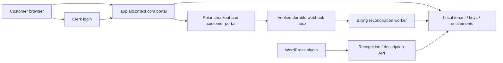

# Plan 0001 - APP-1: app.altcontext.com beta, keys, and billing

- **Task ID:** APP-1 (standalone integration task; related to E16 and GTM AP-3/AP-4/AP-5).
- **Task Plan Status:** proposed.
- **Date:** 2026-09-19.
- **Target branch:** `feature/app-1-plan0001`.
- **Worktree:** `../context-alt-text-monorepo-app-1`.
- **Baseline inspected:** `213fad181474e5739a3b4859536f28792638cdeb`.
- **Delivery now:** reviewable planning documents and eval data only. No feature implementation, vendor purchase, invitations, live charges or deployment.
- **Intake:** [scope](../scopes/app-altcontext-beta-clerk-polar-scope.md), MCP decision #12633.
- **Evidence:** [prior art, refreshed vendors and canon reasoning](../assessments/current/app-portal-prior-art-and-vendors-2026-09-19.md).
- **Eval specification:** [APP-1 data](../scopes/app-altcontext-beta-clerk-polar-evals.json).

## Objective

Let an invited WordPress customer sign up at app.altcontext.com, obtain and safely rotate a tenant API key, see their allowance, and use the service free during beta. Implement the paid conversion path before beta release, prove it in Polar sandbox, and later enable explicit paid checkout without replacing accounts, tenants or keys.

## Product decision and success hypothesis

Recommend a **controlled free self-service beta**, using the complete functional scope of the original "paid beta" option. Recruitment is curated; signup and installation are self-service. A proposed first cohort is 10-20 real WordPress users spanning publishers, photographers/gallery operators and agencies acting as a single site owner. Observe five first-run sessions, then fix the largest measured drop-off before expanding.

| Option | Learning value | Initial cost/control | Decision |
| --- | --- | --- | --- |
| Controlled free beta, paid path ready | Real signup/key/install/usage journey; sandbox billing rehearsals | Bounded compute/support; no billing fee on beta consumption | Recommended |
| Immediate public self-service | Broader sample and discovery channels | Spam, support and inference exposure before flow problems are understood | Open enrollment after beta gates |
| Private pilot, manually provisioned accounts/billing | Rich interviews and fast recruiting | Less early software but operator work masks onboarding friction | Use for recovery and interviews, not normal beta onboarding |

Diagnosis: the missing link is a reliable journey from interest to working WordPress output, not another account shell. Guiding policy: buy identity/payment UI, keep one credential authority, instrument the real journey, cap exposure. Coherent action: prove a single tenant end to end, then usage/billing/recovery, then widen the cohort. This applies Rumelt ch-5/8 and Lean UX ch-3/10/12, STRAT-22, PROD-01/03, CARD-06 and principles 2/13/19; see the evidence table for counter-cases.

**Learning hypotheses (proposed, not measured results):** among the first 10 invited users who attempt onboarding, at least 8 reach a verified connection and first successful caption without operator credential provisioning; report exact denominators and assisted/unassisted counts. At least 5 use the service on a second day within 14 days. Observe five attempts including abandonment, do not replace failed attempts with successful users. Measure median and tail time-to-first-caption and support minutes per activation. Low counts are directional evidence, not statistical certainty. Free usage does not prove paid demand; actual opt-in purchase is a separate later measure.

## Scope, precedence and open decisions

The user explicitly requires a free beta and a ready or nearly completed paid path. This plan chooses the stronger, testable boundary: billing implementation and sandbox lifecycle complete before beta; live merchant approval, confirmed prices and a separately authorized real-money canary may remain before paid release. No automatic charge, mandatory card, invoice accrual or retroactive billing during beta.

The earlier E16-7 docs landed **without implementation** (handoff #11754). Reuse their security and key contracts; do not create a parallel key-panel project. S0 decides whether to implement them under APP-1 or consume a separately landed E16-7 implementation, with one owner for each shared file. Reconcile the 35 deferred E16-7 findings before treating its plan as executable. Historical keys-only exclusions do not exclude the signup/billing requested here. E20-7 owns related usage/site-budget work: S0 must inspect its current implementation and assign the shared admission/metering boundary once. A real accepted WordPress caption and the existing naming/consent gates are beta dependencies, not functionality implied by account signup.

| Decision | Draft default | Review gate |
| --- | --- | --- |
| Tenant identity | Single owner, stable `(Clerk issuer, subject)` -> tenant UUID; no organization switcher | Confirm whether actual beta users require multiple admins before S1 |
| Key authority | Existing local hashes and verification; Clerk authenticates the portal person | Explicitly compare Clerk managed keys in S0, preserve local path unless spike evidence overturns it |
| UI/runtime | FastAPI server-rendered page, small supported Clerk browser integration and small same-origin mutation script | S1 must prove real login, renewal, logout and secret response display; no unsupported no-JS assumption |
| Billing vendor | Polar Starter, thin adapter; Paddle first fallback | Account approval, product fit, fresh fee quote and sandbox evidence; ADR-014 remains proposed until reviewed |
| Beta envelope | 10-20 tenants, 30 days, 200 successful image jobs each, one active job per tenant | Measure cost, choose daily/global limits and approve numeric config before invites |
| Beta budget | Proposed US$50 incremental ceiling per 30 days; existing hosting excluded | Founder chooses currency/ceiling; enforce worst-case admission budget, do not rely only on cloud budget alerts |
| Pricing | One paid monthly offer with a versioned allowance initially | Old $19/$49 and 5k/25k tables are historical hypotheses, not authorized prices |
| Past-due/stale access | Proposed 72-hour payment grace; 24-hour bounded billing outage extension | Confirm financial risk; fixtures prove exact time boundaries |
| Calendar | Sequence by evidence, no promised date | Estimate after S1 integration spike |

Out of scope: unlimited public beta, automatic paid conversion, paid overages, custom invoices/payment forms, team/agency hierarchy, enterprise SSO, CRM migration, local workers, analytics warehouse, Clerk-managed key migration, silent WordPress key replacement, separate writable business credential database.

## Current state and context loading

Read the evidence inventory first, then E16-7 scope/plan/evals and its deferred findings. Source anchors below are existing unless explicitly marked new; `recognition/` and `db/` are relative to `apps/prototype-description-service/`.

- `api/main.py::create_app`: no portal/billing mount in the inspected baseline; independently gate new features.
- `recognition/application/services/api_key_admin_service.py::mint_api_key`: random 32-byte token encoded as 43 characters, digest and caller-owned transaction.
- `recognition/infrastructure/repositories/api_key_repository.py::SqlAlchemyApiKeyRepository`: tenant lists and status classification exist; direct revoke is by key ID, so portal authorization/concurrency must be added.
- `recognition/interface_adapters/http/routers/admin.py::revoke_key_atomic`: existing operator transaction and already-revoked contract must survive extraction.
- `recognition/interface_adapters/http/deps/demo_quota.py`: useful atomic-quota pattern, not the subscription ledger.
- `db/migrations/versions/001_identity_schema.py`: current schema truth. Apply repository schema policy at implementation time while preserving real customer credentials; greenfield reset permission is not permission to erase beta accounts.
- `apps/prototype-description-service/Caddyfile`: public host boundary. WordPress `js/admin/pages/SettingsPage.tsx` and existing settings/proxy tests cover configured keys.
- `docs/workbay/contracts/security.md`, `docs/workbay/rules/testing-python.md`, `docs/workbay/rules/development-workflow.md`: auth boundaries, locked tests, rollout/lifecycle requirements.

## Target architecture and ownership



Clerk owns login/session identity. Polar owns financial subscription/payment facts. AltContext owns tenant UUID, access authorization, beta grants, key hashes and usage accounting. Local billing rows are projections, not independently edited subscription truth. Keep vendor IDs exportable; user email is contact data, not an ongoing access-control key. Provider calls stay outside the recognition/description request path.

For beta, extend the existing service/database instead of adding the older proposed `acx_business` writer. Use separate bounded portal/webhook execution and DB pools as required to prevent authentication or reconciliation bursts starving recognition. Reset privileges must be restricted to explicitly allowlisted recognition data, not database/schema ownership. This is logical isolation with a shared-host failure domain; an ADR amendment must acknowledge that limit and define the later split trigger.

### APP-R1: identity and onboarding contract

1. Clerk-hosted/prebuilt signup/sign-in and a supported browser SDK renew the session on the app origin. Verify issuer, signature, allowed algorithm, exp/nbf and authorized party; configure and validate any required audience. S1 pins the SDK and actual token claim contract, including verified primary email. Do not assume default email claims or ad hoc organization fields.
2. `POST /portal/onboarding` verifies the session and a single-use invitation (stored hashed, bound to normalized verified email, expiry and one redemption). Browser body/header tenant IDs never choose the tenant. Invalid or unmatched accounts remain `not_admitted`, with a clear recovery/contact path.
3. Within one DB transaction, lock/consume the invitation and either create the tenant with a beta grant or claim an eligible **unbound** pre-existing tenant by verified primary contact. Unique `(issuer, subject)` and tenant ownership constraints prevent parallel duplicate tenants or two owners. Repeated login/onboarding returns the same tenant. Retrying cannot mint duplicate keys.
4. Key creation is an explicit authenticated action after onboarding; do not mint an unrecoverable secret inside `user.created` webhook. Clerk profile webhooks may update verified contact projection; email edits never transfer ownership. Persist identity tombstones on deletion so delayed events cannot resurrect access. Account closure/recovery blocks portal access and follows an audited key suspension/revocation policy without discarding billing evidence.
5. Cookie and bearer together are rejected. Cookie mutations require same-origin validation plus CSRF `HMAC(ACX_PORTAL_CSRF_SECRET, verified_sid)` compared safely. The small app script sends `X-CSRF-Token` and `Idempotency-Key`; no plain HTML form is assumed to set HTTP headers. Document GET page vs JSON API behavior and accessible errors. App cookies and Clerk-owned cookies follow their respective supported contracts.
6. Existing key callers stay compatible. When portal is disabled, missing Clerk config cannot prevent recognition boot. When enabled, incomplete portal config fails readiness/boot closed. Unknown signing key plus failed refresh gives recoverable 503; a valid cached signing key can verify an unexpired token. No accepting expired JWTs to hide a Clerk outage.

### APP-R2: tenant keys and rotation contract

`GET /portal/me`; bounded/cursor-paginated `GET /portal/keys` (default 25, maximum 100, history includes revoked); `POST /portal/keys`; `POST /portal/keys/{id}/rotate`; `POST /portal/keys/{id}/revoke`. Map tenant at authentication and bind repositories to that tenant. A foreign object returns 404; missing auth 401; ineligible principal 403; invalid current key state 409; reused idempotency key with different normalized request fingerprint 422. Do not expose raw secrets, hashes or signing tokens in list responses.

Creation and rotation reserve `(tenant_id, operation, idempotency_key)` durably. Rotation also has one winner per old key, enforced by uniqueness/row locking. Mint replacement, shorten old validity, persist result metadata, audit and recovery journal in the same transaction; failure rolls everything back. Retry of a committed action returns metadata with `raw_key: null` and `replayed: true`; first success includes the raw key once. Key responses use `Cache-Control: no-store`, no URL secrets, no client persistence, no telemetry/replay capture. A lost response is recoverable by rotating the new active key with a new request ID.

Routine rotation cutoff is `min(original_expires_at, now + 7 days)` (seven days if originally unbounded), without setting `revoked_at`. Preserve an immutable lifetime policy so a second rotation cannot derive a shorter replacement lifetime from the already-shortened old expiry. Existing keys without lifetime metadata receive a documented migration policy. The replacement gets the original full lifetime or remains unexpiring. Emergency revoke invalidates immediately; portal repeated revoke returns 409, while existing `/admin` already-revoked 200 remains unchanged.

Proposed beta limit is one primary key, with one predecessor allowed temporarily during rotation. A repeat recovery rotation retires the previous grace predecessor atomically so a lost secret cannot either lock the user out of recovery or accumulate unlimited valid keys. The UI explains which predecessor will stop working. Exact caps apply at tenant level, not per key; changing plans never requires key replacement. Warn and require explicit confirmation before revoking the last usable key, while keeping emergency revoke available.

WordPress flow: copy once -> paste option -> Test Connection -> confirm a real job -> revoke old key early if desired. `wp-config.php`/filter-managed installs get deployment instructions, not an editable setting that does nothing. Show absolute cutoff and timezone. No automatic plugin adoption in this task.

### APP-R3: free beta, usage and cost contract

Keep `beta_grant` separate from financial subscription state. Required fields: tenant, policy version, starts/ends, unit allowance, status, created-by and audit reference. `beta_active` permits included work. At expiry/cap, processing pauses; login, key history/revocation, billing access and recovery stay available. UI clearly states "Free beta; no card required; you will not be charged automatically" and the allowance/end date. Extending beta is an audited operator grant, not a fake paid subscription.

Use tenant-level durable usage reservations before costly dispatch, keyed by an internally established operation ID. All applicable `/recognition/*` and `/scene/*` entry points, multipart/async paths and retries must converge on this admission contract; S0 inventories them. An image job costs one customer unit on successful completion; internal retries and terminal failure do not double charge. Reserve quota atomically before work, finalize success once, release terminal-failure/cancel-before-work reservations. Jobs actually run can still consume the separate **infrastructure budget**, even if no customer unit is billed. A sweeper recovers orphan reservations without reopening duplicate executions. Polling/health/Test Connection are free and bounded; clustering uses a separately capped operational budget until priced explicitly.

Implement aggregate per-tenant and global daily limits, max input/batch sizes, bounded queue depth, one active beta job per tenant initially, and a stop switch for new expensive work. Maintain a conservative cost reservation per job/burst including startup, idle tail and failed attempts. Disable GPU eligibility when no verified upper-bound cost or reaper is available. Cloud budget alerts supplement admission limits; they do not cap spend synchronously. Prove crossing the ceiling prevents new allocation and that already-running work has a bounded maximum. The founder approves the actual ceiling before invitations.

Usage reads show used/reserved/remaining, period and `as_of`; never fabricated counts. Read-after-write is required for keys/entitlement mutations; asynchronous usage rollups may lag at most 60 seconds and label pending values. Billing allowance and compute cost are distinct; never silently convert beta usage to paid arrears. Plan quotas and effective rate limits come from local tenant entitlements, not frozen `api_keys.rate_limit_tier`; define how legacy operator/demo keys retain their existing policy without bypassing tenant safety caps.

### APP-R4: Polar adapter, billing and paid transition

Thin server-only `BillingProvider` operations: create/recover checkout, create customer portal session, retrieve authoritative customer/subscription state, verify/normalize webhook. Store customer IDs with environment and provider; unique `(provider, environment, customer_id)` plus tenant mapping. Use internal tenant UUID as external reference, never an arbitrary checkout email as ownership. Server chooses allowlisted product/price/currency from a versioned catalog. Checkout and return URLs use an allowlist; client-supplied amount, tenant, customer ID or success status cannot grant access.

Production `payments_enabled=false` prevents live checkout creation server-side. The ordinary beta has **no Polar subscription and no stored payment method**. A separately isolated staging app, Clerk instance, database, Polar sandbox tokens/product IDs and webhook secrets support test checkout. Test/sandbox events cannot mutate production entitlements. Selected UX testers can rehearse in clearly labelled test accounts; do not conflate these events with live beta activation or revenue.

Checkout retries use a durable checkout-attempt row. Reuse an existing unexpired session when safe. If the vendor request outcome is ambiguous, reconcile by the attempt/customer mapping before creating another; do not assume Polar supports any undocumented idempotency header. A unique local upgrade intent and subscription-conflict handling prevent two tabs producing two authorized subscriptions unnoticed. S1 settles the real API behavior and safe retry protocol.

Webhook receiver verifies the exact raw body and timestamp/signature using a pinned supported SDK, then inserts a unique `(provider, environment, event_id)` inbox row before 2xx. Duplicate delivery is successful; invalid signature is rejected; persistence failure returns retryable failure. Unknown valid events are recorded/ignored explicitly. Bounded worker claims with leases retry durable inbox rows and quarantine exhausted items. Do not use an untracked in-process background task as the only delivery guarantee.

Prefer events as **reconciliation triggers**. Per customer, serialize reconciliation, fetch current provider state with timeout, and update the local projection and derived entitlement atomically. An event arriving while reconciliation is running leaves another pending generation; stale workers cannot overwrite a newer result. Never order billing truth solely by arrival time or generic event timestamp. Poll a bounded cursor of accounts at least every 15 minutes (proposal) to recover missed events; operator can reconcile one tenant. `customer.state_changed` is useful but refund/dispute/period-end details may require subscription/order event/API data verified by S1 fixtures.

| Local state | Entry and processing policy | Recovery / transition |
| --- | --- | --- |
| `beta_active` | Admitted, within beta allowance/time; zero charge | Expire/cap -> paused; explicit paid checkout can later replace grant |
| `checkout_pending` | Preserve existing beta or paid grant; success redirect proves nothing | Authoritative active paid state -> paid; timeout -> pending/retry, not a second charge |
| `paid_active` | Confirmed mapped subscription, configured allowance and period | Renewal refreshes period exactly once; usage does not reset on every webhook |
| `cancel_at_period_end` | Access until confirmed period end | Resume if provider confirms; otherwise processing stops at end |
| `past_due` | Existing customer only; proposed fixed 72h grace from first failure | Successful payment -> active; duplicate failure never restarts grace |
| `suspended` / `ended` | No new paid processing; login and hosted payment recovery remain | Confirmed recovery -> active; no need to remint keys |
| `unknown` / stale | No new unverified paid access | Existing last-confirmed access may use outage bound below; show pending and reconcile |

For provider outage, maintain last-confirmed paid access until its known period end; only when renewal cannot be confirmed may it extend to the earlier of `period_end + 24h` and `last_verified_at + 24h` (proposal). Explicit suspension, fraud hold, cancellation end or key revocation overrides grace. A stale projection never creates a new grant. Past-due grace applies only when that failure is known, and cannot stack with outage grace to extend indefinitely. Beta grant expiry is local and unaffected by billing outage.

Initial paid release offers one recurring monthly tier; plan switches/annual pricing/overages stay disabled in vendor portal until their contracts are tested. Cancellation, payment-method update and receipts use the hosted customer portal. Partial refunds leave the subscription policy unchanged unless authoritative subscription state changes; full refund/dispute imposes a local review hold under documented policy and requires reconciled evidence to lift it. S1 must confirm the precise financial-event coverage before this policy is accepted.

Transition: announce beta end and pricing clearly -> customer chooses upgrade -> explicit live checkout -> webhook/reconciliation activates paid -> grant switches without tenant/key migration. A non-buyer is paused rather than charged. Beta usage is never invoiced. Existing consent, keys, accepted WordPress text and identity mappings survive the transition.

### APP-R5: dashboard, learning and accessibility

One compact dashboard with Setup, API keys, Usage and Billing. Show next useful action: create key, install plugin, Test Connection, run first job, review caption. Do not label merely creating a key as activation. A read-only billing page explains beta and prospective paid options; use "View plans"/"Notify me" while live checkout is disabled, with an honest state rather than a dead Upgrade link.

| State | Required behavior |
| --- | --- |
| Signed out / session expired | Sign in and return to intended safe page; pending secret is not persisted |
| Not admitted / identity conflict | No tenant disclosure; explicit contact/retry guidance |
| First use / no keys | Guided create -> copy once -> plugin setup |
| Secret visible / lost response | Accessible copy and acknowledgement; no analytics capture; explain rotate-again recovery |
| Rotation overlap / last-key revoke | Display old/new states, cutoff and disruption warning; keyboard-safe confirmation |
| Limit reached / beta expired | Pause new compute, retain account access; extension/request/paid action appropriate to launch state |
| Checkout pending / billing unavailable | Distinct pending state; bounded refresh and explicit retry; never show Paid because of redirect |
| Empty / loading / error / offline | Descriptive status, focus restoration and recovery action; do not render a zero usage claim on failed load |

Keyboard-only and screen-reader coverage must include Clerk handoff, copy/rotation, confirmation, quota errors and hosted billing return. Announce status changes without moving focus unpredictably. Validate mobile narrow layouts and accessible labels/contrast. Third-party UI still needs integration testing.

Events: invitation redeemed, signup complete, tenant ready, key created/rotated/revoked, connection verified, first successful job, first accepted caption, repeat-day usage, cap reached, upgrade viewed/started, paid confirmed. Emit server-authoritative lifecycle events after durable state change; dedupe by event ID. Include opaque IDs, cohort, outcome/error category and duration; no email, raw key/hash, invitation/session/checkout token, image URL/content, names, face data or free-text feedback in general analytics. Disable session replay on authentication, key and billing surfaces. Gather consented interviews/feedback separately with retention limits. Analytics failure cannot fail onboarding or processing. Never infer skin-tone cohorts from user media for this beta.

### APP-R6: durability, security and operations

Tenant/key/identity/invitation/beta/usage/billing-inbox/projection/audit data is durable customer state. No routine recognition reset may delete it. Add least-privileged reset and application roles plus a production reset refusal; test attempted truncate/delete/drop under the reset role. Existing RLS-exempt key lookup remains a documented bootstrap boundary, not proof of full isolation. Portal key operations use bound repositories; newly tenant-scoped tables use RLS under a non-owner/non-BYPASSRLS role. S0 specifies the minimal pre-tenant identity/credential lookup privilege and reviews any necessary exception.

Back up off-host with tested restore. Prefer restoring transactional state through retained WAL if operationally available; otherwise typed append-only off-host security journal must cover **mint, revoke and rotation cutoff**, not replay every entry as revoke. Include event ID, tenant/key IDs, hashed key and necessary immutable creation/expiry metadata (never raw key), schema version and original event time; encrypt backups and restrict readers. Replaying twice must converge, preserve revocation, and not extend cutoff. A journal without replacement-key state requires explicit remint recovery, not a claim that the key was restored.

If the latest dump/journal high-water mark cannot exclude a missing security mutation, keep processing disabled, revoke restored keys within the uncertain scope (all tenants if scope is unknown), and require audited remint/recovery before reopening. Do not reopen with potentially resurrected revoked keys and merely notify users. Proposed RTO <=4 hours; measure it. Set and disclose actual backup/journal RPO; zero-loss is not assumed from a five-minute upload timer. Reconcile billing after restore before paid processing resumes.

Public app vhost allows only portal/auth assets and named webhook endpoints; `/admin*`, internal metrics, and unrelated service routes return 404. API vhosts must not accidentally expose portal/admin routes. TLS/DNS, production Clerk domain, cookie scope, CORS, CSP for exact Clerk assets and `frame-ancestors`, rate limits, raw webhook-body handling and request-size limits are release evidence. Account recovery and vendor outage have operator runbooks.

Proposed staging load: 20 concurrent portal users for 10 minutes, with key/list operations p95 <=500 ms and p99 <=1s excluding external sign-in; checkout/portal calls use a 3s total vendor timeout with no blind retry of mutations; durable webhook ack <=2s. Worker retries use jitter and bounded attempts; after 10 failures quarantine and alert. Local operations expose no stale key mutation result. Start with 15-minute reconciliation and 60-second usage freshness. Validate at 10x synthetic load before public enrollment; these are targets, not established SLOs.

Alert owner: founder/on-call operator. Alert on oldest pending webhook/reconciliation lag >15m, failed receipt/worker health, security-journal lag above configured RPO, restored-key probe failure, vendor endpoint disabled, and budget nearing/exceeding the reservation threshold. Track auth failure rates with redacted counters and rate-limited aggregation; avoid unbounded per-principal metric labels. Exercise alerts and stopped-telemetry detection before beta.

## Contract and boundary impact

| Boundary | Owner | Required change and proof |
| --- | --- | --- |
| Browser -> Clerk -> portal | Portal/auth | JWT/claim contract, CSRF, invitation and stable tenant binding; real browser renewal/logout test |
| Portal -> keys | Credential service | Tenant-bound operations, bounded history, one-time responses, concurrency/idempotency and existing admin regression tests |
| Plugin -> service | Recognition/description | Local tenant entitlement/admission checks; no new vendor call; existing header compatibility and readable 401/403/429/retry behavior |
| Portal -> Polar | Billing adapter | Server-owned catalog/customer map, checkout attempt recovery, hosted portal; sandbox fixtures |
| Polar -> app | Billing inbox/worker | Signature/raw body, durable dedupe, reordered/missed-event reconciliation, environment isolation |
| Usage -> entitlement/cost | Admission service | Reservation/finalization, period boundaries, no double counting or per-key bypass |
| Restore -> runtime | Operations | No revived credentials, measured RPO/RTO, reconciliation and traffic gate |

Update `docs/workbay/contracts/security.md` and add `docs/specs/app-portal-account-billing-spec.md` in S0 with endpoint schemas, error envelopes, role matrix, state transitions and this plan's APP-R1..R6 requirements. The spec is **new/proposed**, not a claimed reviewed prerequisite. Each implementing slice changes contract fixtures and docs with behavior. Amend ADR-014 and reconcile E16 roadmap/epic authority statements before schema work; retain historical context with explicit supersession notes.

## Slices, owners and dependency order

Each implementation slice first establishes failing behavioral tests, records the RED evidence, then implements and records GREEN evidence. If work is delegated later, RED and implementation are separate dispatches; no agents are dispatched by this draft. Whole-file owners are explicit at dispatch time; shared app mount/schema/contract files serialize through the integration owner. No plan row below is a claim of shipped work.

| Slice | Goal and owned surfaces | Depends on | Proof / mapped criteria |
| --- | --- | --- | --- |
| **S0 - reconcile contracts** | Integration owner: APP-R1..R6 spec, E16-7 reuse/disposition, ADR-014 refresh, route/metering inventory, role/reset model, cost envelope, catalog proposal | Plan review | Named E16-7 finding dispositions with evidence; complete endpoint/state/usage matrix; no duplicate task ownership |
| **S1 - real integrations** | Auth/billing owner: throwaway Clerk browser + FastAPI JWT and Polar sandbox spikes; pin supported SDKs; snapshot redacted claims/webhook fixtures | S0 decisions | Actual sign-in/renew/logout; verified email source; valid/invalid webhook signature; checkout/portal/cancel/refund state; ambiguous-checkout retry behavior. No secrets committed |
| **S2 - durable keys** | Credential owner: schema truth and restricted reset grants, tenant-bound repositories, extracted key service, creation/rotation/revoke, recovery journal and bound history | S0, S1 auth contract | APP-SC-02..06, 15; preserve existing admin contract. Rotation service and repository ship together |
| **S3 - self-service account** | Portal owner: onboarding/invites, identity links, beta grants, auth dependencies, portal renderer and JS; app mount and Caddy through integration owner | S1, S2 | APP-SC-01, 07, 13, 14, 16; real invited user obtains key, connects WordPress, completes one job |
| **S4 - allowance and cost** | Admission owner: new usage reservation/entitlement service and repositories, all scoped billable routes, usage UI, cost controls and reaper contract | S3 | APP-SC-08, 09, 17; race at remaining=1, duplicate completion, failure/cancel/restart, global cost ceiling and no per-key bypass |
| **S5 - billing lifecycle** | Billing owner: new Polar adapter, checkout attempt/customer map, signed inbox, reconciliation worker, billing view/hosted portal; schema/app integration serialized | S1, S3, S4 | APP-SC-10..12, 18; sandbox complete lifecycle, duplicates/reordering/missed events, provider outage and concurrent upgrade |
| **S6 - complete beta rehearsal** | Integration/UX/ops owner: full browser journey, privacy telemetry, accessibility, backup/restore/alerts, beta runbook and fixture validation | S2..S5 | APP-SC-13..17, 19; zero-charge invariant, staged restore and role failure tests, observed test onboarding; beta readiness gate |
| **S7 - paid activation** | Release owner: approved live catalog/secrets/account, customer notice and opt-in conversion, live canary and rollback drill | S6 + paid gate | APP-SC-18, 20; no tenant/key migration or beta arrears. Actual charge requires explicit authorization at execution |

New proposed production surfaces: `recognition/application/services/{portal_identity_service,tenant_entitlement_service,usage_admission_service,billing_service}.py`; `recognition/infrastructure/{billing/polar_provider,repositories/portal_identity_repository,repositories/billing_repository,repositories/usage_repository}.py`; `recognition/interface_adapters/http/{deps/portal_auth,routers/portal,routers/billing_webhooks,portal_console}.py`; `scripts/{billing_reconcile,ship_security_journal}.py`. Split only when the existing package layout supports it; S0 records exact names. Do not create empty adapters or an entire Business API process solely to match historical names.

## Verification and eval data

APP-SC-01..20 below are mirrored one-for-one in the adjacent eval JSON; named new tests/commands are **planned** and have not been run. Existing E16-7 SC-1..31 form the inherited key/security regression checklist, amended deliberately for signup, bounded history, SDK integration and stronger restore containment. S0 records this crosswalk; none may disappear silently.

Use the app's locked environment (`uv run --locked --extra dev`). Slice tests can be targeted during development. The release gate must run the full declared testpaths, without narrowing positional paths, per `pyproject.toml` and `ACX_STRICT_GATE=1`. DB-backed new tests fail, rather than skip, when `ACX_PORTAL_TESTS_REQUIRE_PG=1`. Require a nonzero case count, no skips in the APP-1 security/billing suite, no stale XML and preserved test exit code. Existing unrelated suite skips need documented accounting; a green narrow subset cannot be called a full release pass.

Implement `scripts/run_app_portal_evals.py` (new) in the RED work to validate the local eval manifest and run its test/drill groups, preserve subprocess status, delete prior outputs, and append evidence with git SHA, environment, counts and artifact paths. The WorkBay package `packages/workbay-system/config/evals/` is absent in this checkout. Therefore the data lives in `docs/scopes/` with the repository's E16-7 `junit_counts` convention; **it is not registered/runnable in the hoisted WorkBay registry**. If installed-registry integration is chosen later, validate against that installation's schema and register its executor; do not invent package files here.

Planned commands from `apps/prototype-description-service/`:

```sh
ACX_PORTAL_TESTS_REQUIRE_PG=1 uv run --locked --extra dev python scripts/run_app_portal_evals.py --manifest ../../docs/scopes/app-altcontext-beta-clerk-polar-evals.json --group deterministic
ACX_STRICT_GATE=1 ACX_PORTAL_TESTS_REQUIRE_PG=1 uv run --locked --extra dev python -m pytest --junitxml=../../.task-state/evals/app1-full.xml
```

The runner path is a deliverable, not an existing command. Browser tests must hit the rendered portal and staging WordPress with two distinct tenants; real Clerk/Polar sandbox is a separate contract rehearsal from offline signed fixtures. Operational restore, actual alert delivery and authorized live checkout require evidence artifacts and cannot be satisfied by mocking a provider client.

| ID | Observable acceptance | Evidence owner |
| --- | --- | --- |
| APP-SC-01 | Duplicate/concurrent onboarding redeems once, creates/claims one tenant and stable owner; no webhook-minted secret | S3 identity tests |
| APP-SC-02 | Foreign key/usage/billing IDs and spoofed tenant header never change authenticated scope, including direct repository calls | S2/S4/S5 isolation tests |
| APP-SC-03 | Valid JWTs verify; malformed/expired/wrong-issuer/party tokens, mixed credentials and CSRF failures change nothing | S1/S3 auth tests + browser |
| APP-SC-04 | Creation/rotation returns secret once; replay/log/cache/analytics contain none; lost response has bounded recovery | S2/S3 key/browser tests |
| APP-SC-05 | Concurrent rotation has one winner; old key cutoff/lifetime and emergency revoke are correct at boundary times | S2 real-Postgres concurrency tests |
| APP-SC-06 | Audit/journal failure rolls key mutation back; admin already-revoked behavior preserved | S2 fault injection + admin regression |
| APP-SC-07 | Beta requires no card, creates no live subscription/payment, and expiry cannot charge or create arrears | S3/S5 zero-charge tests |
| APP-SC-08 | Atomic quota reserves stop parallel overspend; retries/completions/failed jobs and period rollover count correctly | S4 real-Postgres reservation tests |
| APP-SC-09 | Global/per-tenant budgets stop new costly dispatch, bound in-flight cost, and expose recoverable cap state | S4 scheduler/budget fault tests + measured cost envelope |
| APP-SC-10 | Server-bound checkout and portal sessions cannot cross tenant/catalog/environment; concurrent retry is safe | S5 fixtures + real sandbox |
| APP-SC-11 | Durable verified webhook dedupe survives crashes, reorder and dropped events; reconciliation converges | S5 inbox/worker restart tests |
| APP-SC-12 | Paid/cancel/past-due/recovery/refund-hold/staleness follow exact time rules; key stays unchanged | S5 table-driven state tests + sandbox |
| APP-SC-13 | Clerk/Polar outage preserves valid local API access within policy and shows bounded recoverable portal failures | S3/S5 fault injection |
| APP-SC-14 | Keyboard/mobile/screen-reader journey covers first use, secret, rotation, expiry and billing pending | S6 browser/a11y artifact |
| APP-SC-15 | Restore/replay twice preserves revoked/cutoff/replacement state; uncertain journal tail stays closed | S2/S6 integration test + real restore drill |
| APP-SC-16 | App/API public hosts block admin/internal paths; reset role cannot erase credential/customer authority | S2/S3 live staging probes + SQL grants tests |
| APP-SC-17 | Truthful usage/events, no secrets/media/PII in analytics, no sensitive replay; latency and cost envelope recorded | S4/S6 privacy + load tests |
| APP-SC-18 | Explicit paid checkout alone converts, beta history is never charged, tenant/key retained, recovery remains reachable | S5 sandbox then S7 authorized live canary |
| APP-SC-19 | First cohort meets or explicitly fails the predeclared learning gates; denominator/assistance/support data retained | S6 beta observation report, not unit tests |
| APP-SC-20 | Paid release has account/catalog/notice/rollback/restore evidence and a real-money canary receipt | S7 release dossier; not required to call beta free |

## Rollout, stop conditions and rollback

**Beta-ready gate:** reviewed contracts and S1..S6 engineering rehearsal complete, covering APP-SC-01..18 with sandbox evidence for paid behavior. APP-SC-19 is measured after beta admission; APP-SC-20 belongs to paid release. Require zero-charge invariant tested; sandbox purchase/renewal/cancel/recovery working; live checkout disabled; exact cost envelope, quota and cohort approved; off-host restore and tenant isolation proven; telemetry and customer recovery ready. Invitations and user communications happen only under later authorization.

**Expansion gate:** evaluate first ten attempts and five observed sessions; repair the largest flow failure. Stop new admissions immediately for any tenant leak, secret capture, unauthorized charge, revived revoked key, unbounded compute or missed budget stop. Also stop expansion if activation misses the proposed 8/10 threshold or repeated support is needed to obtain/paste a key. Improve the bottleneck, then run the next cohort; do not hide failures in aggregate signup counts.

**Paid-ready gate:** merchant/product accepted, current fees/payout currency confirmed, price/allowance approved, live secrets and webhooks isolated, beta-end notice/recovery documented, sandbox evidence current, authorized small live purchase/cancel/refund and restore checked. This is an operational cutover with implemented code, not a second billing build.

Flags are server-controlled and independent: portal enabled, beta admission open, expensive compute enabled, payments enabled. Roll back new enrollment/checkout separately from existing API access. Turning off new payments must **not** stop webhook/reconciliation for already-paying customers. Keep entitlement snapshots/audit data; never revert a database to an older credential state as a normal app rollback. If a compromise requires stopping API processing, keep a bounded account recovery path. Record release SHA, flag state and reason.

## Consolidated checklist

- [ ] S0: choose one implementation owner, reconcile E16-7 deferred items and authority docs, review APP-R1..R6 spec/catalog/cost policy.
- [ ] S1: prove real Clerk and Polar sandbox contracts, pin versions and sanitized fixtures.
- [ ] S2: deliver tenant-safe key lifecycle, atomic evidence, reset containment and durable recovery.
- [ ] S3: deliver actual self-service onboarding and working WordPress connection.
- [ ] S4: deliver correct allowance/usage and enforceable compute budget.
- [ ] S5: deliver complete sandbox billing lifecycle and outage/reconciliation tests.
- [ ] S6: deliver full browser/accessibility/privacy/restore evidence; meet beta-ready gate.
- [ ] S6 observation: record real cohort outcomes without inventing activation or paid-demand evidence.
- [ ] S7: meet paid-ready gate and authorized explicit conversion evidence.
- [ ] Review records and accepted baseline exist before implementation; current draft makes no pass/approval claim.

## Review packet and remaining choices

Review this plan with its scope, evidence note and eval data. First settle tenancy, local-vs-Clerk key authority, free-beta budget/allowance/cohort and final price/catalog. Then verify S0 crosswalk, webhook/entitlement edge cases, SDK-supported browser flow and recovery assumptions against code. Planning review findings belong in MCP. The task is complete **as a draft deliverable** when these artifacts are coherent and discoverable; implementation and user-study completion remain unchecked.
