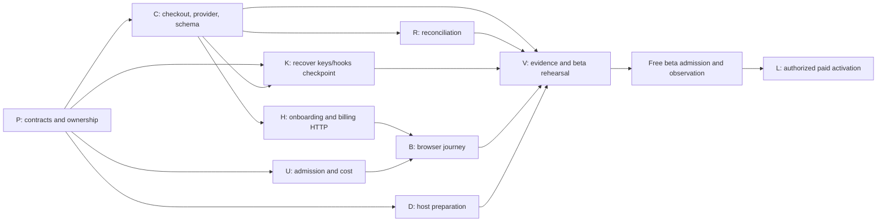

# APP-1. Plan 0002 — complete app.altcontext.com launch

- Status: active continuation; offline landed-work reconciliation recorded 2026-09-22. This document is not a release acceptance or live-integration receipt.
- Owner: APP-1, existing `feature/app-1` integration worktree.
- Inspected baseline: `11fe4dea7ae1b065893aca38d215b38e7a18c23f`.
- Supersedes the execution sequence, not APP-R1..R6 or APP-SC-01..20, in [Plan 0001](0001-app-altcontext-beta-clerk-polar-task-plan.md).
- Epic: [E16 SaaS foundation](../epics/v0.3.1/saas-foundation-epic.md).
- The operator subsequently authorized remote implementation and orchestration. Use `grok-remote` / `grok-4.6` / high for implementation and `codex-remote` / `gpt-5.6-luna` / max for grunt work under the latest operator instruction. Local implementation lanes remain prohibited. Account provisioning and real integration rehearsal remain operator-dependent; live charges remain behind the paid gate.

## Supporting assessments

- [Checkout ownership, provider portability and Link](../assessments/current/app-altcontext-checkout-provider-portability-and-link-2026-09-22.md) — current account/billing UX direction and operator prerequisites.
- [Remote vendor terms comparison](../assessments/current/app1-payment-vendor-terms-comparison.md) — source collection, not provider approval.
- [Usage/evidence adjudication](../assessments/current/app1-usage-evidence-adjudication.md) — remaining admission contracts; evaluator work must target the actual APP-1 runner, not assume the generic gate is its execution path.

## Objective

An invited customer signs into app.altcontext.com with Clerk, claims one local tenant, obtains and manages a local API key, connects WordPress, produces a caption, sees accurate allowance and can later opt into Polar billing without replacing tenant or key. Complete sandbox billing before admitting the free beta. Keep live payments disabled until the separate paid gate.

## Recovered evidence and precedence

Handoff MCP reads the repository `.task-state/handoff.db`. APP-1 decision 12900 records foundation merge `e2a53910778f1fc99aacf0b6d5ae5652c1f27ddb`, verified as an ancestor of the inspected main. Decision 13218 and `config/lane-orchestration/APP-1.json` describe the newer seven-lane W4. Those supersede the older five-node W4 suggestion in the pasted session history. W0–W3 are not a new implementation backlog.

Semantic retrieval used `find_related_prior_work`: `embeddings_mode=verified`, model `gte-base-en-v1.5`, `semantic_degrade_reason=null`. Relevant hits include APP-1 decisions 12633, 12639, 12649, 13218 and E20-7 finding 1726. Similarity is discovery evidence, not proof a requirement is satisfied.

APP-1 currently has 34 deferred findings: 6 high, 19 medium, 9 low. Zero *open* findings does not mean launch-ready. The latest user-requested harmonizing gate supersedes the older request for a clean planning review before dispatch; do not repeat that older review. The coordinator records gate state and supported dispositions.

The old plan called implemented surfaces new. The previously absent `docs/specs/app-portal-account-billing-spec.md` now exists and was amended at `662114f7c` for tenant-scoped idempotency, typed checkout identity and existing-installation upgrades. Its S0 route inventory and E16-7 disposition matrix retain some pre-implementation claims; the current source and supplied receipts are reconciled in [the offline evidence report](../assessments/current/app1-offline-evidence-reconciliation-20260922.md). Do not redo the original discovery program or a second fixwave review.

## Offline evidence reconciliation — 2026-09-22

This is a documentation-only classification. The current checkout is the source authority; the supplied landed receipts are execution evidence even when their historical SHAs or VM bundles are not resolvable here. No MCP status is changed, no credentials or accounts are provisioned, and no live provider, host, browser, or deployment evidence is implied.

- W4 usage findings 15849–15852 are offline-addressed by the landed G1/G2/G3 source and receipts. The exact matrix, including residual evidence, is in [app1-offline-evidence-reconciliation-20260922.md](../assessments/current/app1-offline-evidence-reconciliation-20260922.md). A new operation remains independently chargeable even for identical bytes; a terminal ticket cannot mint work. Post-start compute failures remain conservatively chargeable under the accepted cost contract; “all failures free” is not the contract.
- P01 enumeration and recovery are implemented in the current provider, reconciliation worker, and fenced repository. The supplied R1 receipt is green offline; the initial R1 review remains pending, and Polar sandbox/live evidence is external.
- P02 now adjudicates the scene compute paths and covered operator controls from source. Operator GPU/clustering/revert mutations are paid-only through durable `TenantEntitlement(PAID_ACTIVE)` plus the existing write/auth guard; beta/demo markers are not authority. The `/recognition/jobs/{id}` tenant census and other intentionally open-Q control-plane decisions remain pending.
- P03 is not closed as a whole: durable checkout-attempt identity, recovery/enumeration, and full-header verifier code are landed and receipted offline, but genuine webhook sandbox compatibility remains unproven. Keep the finding open until V has that evidence.
- P05 is split: the evaluator now fail-closes untyped/partial evidence, zero/failed/skipped JUnit, missing or mismatched parametrized cases, missing evidence-only artifacts, and release-mode partial selection. The supplied evaluator receipt is green offline; the full current manifest plus real PostgreSQL, restore, Clerk, Polar, browser, and alert/telemetry rehearsals remain V work.
- HOST-RV01 still blocks main after the host single-fix wave; no extra host fix is authorized here. N1 recovery work remains queued/running under coordinator control, B1’s remaining UI is incomplete, and user accounts are not provisioned.

## Wind-down addendum — 2026-09-22

This addendum supersedes the live-handle descriptions and stale implementation priorities in the historical checkpoint below. The checkpoint remains historical context, not current lane state.

- No APP-1 implementation pass remains in progress. The final pretenant-auth pass `app1-pretenant-auth-20260922-v1` ended with 26 focused VM tests passing, then failed WorkBay final verification/reporting. Checkpoint `17a6cf46e` is integrated into the feature branch; its verified bundle is `app1-pretenant-auth-20260922.bundle` and its clean worktree is retired. Billing, storage, composition and evaluator worktrees are also retired.
- An SSH `/proc` survey found no live APP-1 Grok/Codex/remote-agent processes. This is task-scoped evidence, not a claim that the whole VM is idle. No new work was dispatched during wind-down. Remote sandbox deletion remains unverified; preserved UX-map patches must survive cleanup.
- Main advanced independently to `cebc972bc1429eb8a8a07bae78993af84de9f3e0`; reconcile the feature against current main before final release checks. Nothing was deployed by this session.
- Historical checkpoint priorities included evaluator RV01–03, usage findings 15849–15852, and schema/RLS evidence. The supplied receipts and current-source reconciliation above now classify the landed evaluator and G1/G2/G3 repairs offline; release evidence and residual route census remain separate work.
- The historical RV04–06 concerns are covered by the supplied evaluator receipt: parametrized JUnit matching, missing evidence-only artifacts, and missing-artifact ledger demotion now fail closed. The full V packet and real fixtures/rehearsals remain pending; no second review or fixwave is implied.
- Semantic reinjection selected verified `gte-base-en-v1.5` prior art, including decisions 13281/13294 and finding 15555. Codemap re-found `claim_tenant` and `require_portal_principal`; coverage checks reported no recorded issue for auth, identity service and evaluator paths, which is not proof of completeness or feature-tip freshness.
- Clerk remains unavailable. Real sign-in rehearsal remains pending Clerk; nothing was deployed.

## Execution checkpoint — 2026-09-22 06:41 UTC

- At this historical checkpoint, usage checkpoint `205bffd71471f2eedf1d06f9edd5e1523eb61a94` integrated at `1a3f51fe4` after 28 focused VM tests and the four usage findings still blocked main. Later supplied G1/G2/G3 receipts reconcile those findings offline as recorded above; feature integration is not launch acceptance.
- Keys/hooks checkpoint `1f168a2de` integrated at `8f12a1e8` after 35 focused VM tests passed. The remote review expired; no completed review is claimed and no second fix loop is authorized.
- Vendor assessment `d4bee9e24` integrated at `375a4a7e9`; usage/evidence adjudication `321e8773d` integrated at `23e581153`. Focused protocol smoke checks passed, which does not prove the documents complete. Earlier failed/expired passes are superseded by these preserved artifacts.
- Checkout/Link portability assessment committed at `581405f99`; operator decisions recorded in handoff decision 13236. Checkout, reconcile and keys/hooks branches were bundled under `.task-state/branch-archive/` and their clean, integrated worktrees retired before new admission.
- Billing spec checkpoint `49325e31a` integrated at `0307f770b`; evaluator checkpoint `34b2572ff` integrated at `5d5717c3f`, with 21 focused VM tests after behavioral RED. Their worktrees were bundled and retired. The evaluator review is `app1-eval-review-20260922-v2` on Luna/max.
- Composition guard `6ecb1ce5f` integrated at `8d15cace1` with 19 focused VM tests. Its worktree is bundled and retired. Audience and authorized-party configuration are separate in composition; the second loader in `PortalAuthSettings.from_env` still requires correction.
- Billing adapter `bbcab9a90` integrated at `3c41aef1e` with 58 focused VM tests and a formatting receipt. It supplies attempt-owned idempotency, typed checkout ID/URL, bounded recovery/enumeration and full-header signature verification. Real Polar delivery rehearsal remains outstanding. Its worktree is retained only while the existing remote review owns a live lease; no additional review is admitted.
- Historical active-pass snapshot: `app1-checkout-store-20260922-v2` and `app1-pretenant-auth-20260922-v1` were Grok/high VM passes with four slice worktrees. Wind-down supersedes those handles; no live implementation pass or new reviewer is claimed here.
- Pretenant authentication is split from the full claim endpoint to run independently of checkout schema. It owns only `portal_auth.py` and two auth test files. The claim endpoint still needs an explicit durable replay outcome; the existing `claim_tenant` service returns only `PortalPrincipal`. Do not infer 201 versus 200 from a racy pre-read.
- Codemap discovers existing symbols; its main index predates feature changes, so remote briefs require exact-source verification. Verified semantic reinjection uses `gte-base-en-v1.5`; prior art and limitations accompany dispatch.
- The historical checkpoint said the operator would provision Clerk development and Polar sandbox credentials. They are not provisioned for this offline task; no credentials, accounts or live provider/network action is claimed. Blocker 821 still gates genuine rehearsal/release.
- Composition now rejects known Polar host/environment mismatches and uses the sandbox default correctly. Seller-account wiring and cross-slice construction still need harmonizing verification.
- Installed Grok adapter emits `--no-subagents`; parallelism is coordinator-owned remote lanes, not nested Grok flocks. Never spoof capability or sandbox receipts. Model discovery warning does not prove the pinned model was served; record actual receipts.

WorkBay `lane_dag` validates the next-stage edges below: four manifest roots, two second-layer nodes, one third-layer node; three lane-durations is a structural lower bound, not a wall-clock forecast. Billing implementation is already integrated, although its remote review still owns its tree. Planned nodes are not dispatched and have no worktrees; exact tests and claim persistence ownership must be finalized before admission.

```text
checkout-store ──┐
billing-adapter ┴─► checkout-service ──┐
                                      ├─► checkout-http
pretenant-auth ──► claim-http ─────────┘
eval-review (independent)
```

The claim-to-checkout HTTP edge serializes shared `portal.py` ownership; the other edges carry interfaces or implementation prerequisites. GRPH-09 conflict coloring and GRPH-31 critical-path list scheduling justify that distinction. Keep at most four actual slice trees, including review trees. Clerk/Polar accounts gate real rehearsal after browser integration, not these offline nodes.

These are point-in-time observations. Consult MCP pass state before recovery; an RPC timeout does not prove a remote pass stopped. Use the recorded pass ID with `await_offload_pass`, never duplicate a live dispatch.

## Scope selection and deduplication

| Source | Keep for this launch | Disposition |
| --- | --- | --- |
| APP-1 Plan 0001 | APP-R1..R6, APP-SC-01..20, free-beta and paid gates | One product/acceptance contract; execute remaining work through this continuation |
| E16-1..6, E16-7, GTM AP-3/AP-4/AP-5 | Identity, self-service keys, usage, billing, host, privacy-safe operations | Absorb into APP-1; no second account/key implementation or business database |
| E20-7 | Existing plugin usage/site-budget behavior and regression constraints | Reuse; server tenant admission remains authoritative; do not rebuild plugin metering wholesale |
| APP-1 W0–W3 / GX fixes | Landed foundation and regression tests | Do not redispatch |
| APP-1 W4 keys/hooks | Integrated green checkpoint at `8f12a1e8` | Preserve completed work; final harmonizing review covers interactions |
| SUITERED-1 / GATEORPH | Already-landed verification infrastructure | Reuse and verify the actual APP-1 gate, no duplicate infrastructure project |
| GPU-LAUNCH VGS findings | Only collection/evidence defects that invalidate APP-1 release evidence | Select into verification node V; leave unrelated harness work with its owner |
| GPUDEMO-1 / GPUFLOW-4 / demo deadline, DNS bench, general reaper work | No app account/billing implementation | Exclude from this backlog; retain shared-service correctness as a launch regression check |
| AP-7 concierge sales | Separate commercial path | Do not silently retire it or make it an APP-1 implementation prerequisite; settle its beta policy before offers |

## Implementation readiness

**The full launch plan is not cleared for unrestricted dispatch. Bounded checkpoint fixes and parallel contract adjudication are executing under the operator's later authorization.** The following distinctions prevent an old review or a queued lane from being mistaken for current readiness.

| Node | Current disposition | What makes the next action executable |
| --- | --- | --- |
| P — contract and ownership refresh | Ready for planning work | Close the concrete planning gaps below; publish exact route, provider and transaction contracts |
| K — keys/hooks | Integrated; no duplicate implementation | Preserve `8f12a1e8`; check cross-slice contracts at the final gate |
| D — app host preparation | Bounded implementation candidate | Freeze host allowlist/env names in P and record a planning pass; DNS/secrets are staging inputs, not grounds to fabricate a deploy pass |
| C — checkout/provider/schema | Provider integrated; persistence executing remotely | Consume typed provider results and tenant-scoped attempt repository in a subsequent checkout-service slice |
| U — usage and cost | Offline-landed for the G1/G2/G3 route set; residual census/evidence pending | Preserve global bounds, exact operation/fingerprint/job/fence identity, conservative post-start charging, and classify remaining OPEN-Q routes |
| R — reconciliation | Offline implementation and receipts present; initial R1 review pending | Retain bounded provider enumeration, cursor/lease fencing, quarantine/retry, and obtain the initial review plus external provider evidence |
| H — portal HTTP | Dependency blocked | Consume reviewed C interfaces; one owner for claim, checkout and manage routes |
| B — browser UI | Dependency blocked for integration | Freeze HTTP schemas and Clerk browser contract; consume H and U, serialize app mount ownership |
| V — evidence and release rehearsal | Offline enforcement addressed; full packet pending | Use the fail-closed evaluator checks, then run the current manifest with PostgreSQL/security, browser/vendor/restore and alert/telemetry rehearsals; targeted unit tests are not sufficient |
| L — live paid activation | Release blocked | Beta engineering gate, approved catalog/account and separately authorized real-money canary |

## Files and surfaces to change

Paths below are relative to `apps/prototype-description-service/` unless prefixed `docs/`, `scripts/deploy/` or `infra/`. Existing symbols were discovered through the code graph; new APIs below are deliverables, not claims of existing methods.

### P — contract and ownership refresh

Own this plan, the epic's active APP-1 section, the now-present `docs/specs/app-portal-account-billing-spec.md`, S0 route/metering inventory and E16-7 matrix, and a later revision of the W4 manifest. The operator has authorized execution; update the manifest only after preserving finished lanes and validating disjoint ownership.

- Record endpoint schemas, error/status vocabulary, verified pre-tenant identity versus tenant-bound principal, invitation claim plus beta grant transaction, and replay behavior.
- Define durable checkout attempt lifecycle, tenant/catalog/environment binding, customer mapping, ambiguous result recovery and a new attempt after a completed/expired purchase. Pin supported vendor behavior with official documentation and sanitized sandbox fixtures before C implementation.
- Define bounded authoritative provider enumeration, cursor/checkpoint durability, lease/fencing ownership and no network calls while holding database row locks. C owns shared schema/provider protocol; R owns processing.
- Resolve webhook signature compatibility (APP1-HG-45) before treating internal fixtures as vendor proof. This packet does not claim the existing verifier accepts genuine Polar deliveries.
- Refresh the route inventory, including `/scene/describe/multipart`, `/scene/describe/async`, `/scene/describe/run`, cancellation and costly cluster/GPU controls. Name actual handlers/worker completion seams and grant U the necessary paths before dispatch. Free polling does not consume image allowance.
- Resolve the remaining stale inherited dispositions and one-time ownership of app mount, composition, migration and contract files. The latest user-requested harmonizing gate supersedes the older request for a clean planning review before dispatch; the coordinator records gate state. No blanket S0 redispatch.

### C — checkout, provider and shared schema

Existing anchors: `recognition/infrastructure/billing/polar_provider.py:PolarBillingProvider.create_checkout_session`, `_checkout_idempotency_key`; `recognition/domain/portal_contracts.py:BillingProvider`; `db/models/portal_billing.py`; `db/migrations/versions/001_identity_schema.py`.

New surfaces: `recognition/application/services/checkout_service.py`, `recognition/infrastructure/repositories/checkout_attempt_repository.py`. Add durable attempt and R's agreed cursor/lease storage in the existing schema authority, with safe upgrades for existing installations. Preserve the pre-tenant API-key lookup boundary when deciding HG-61; do not blindly add RLS that breaks credential authentication.

Persist intent before provider mutation; concurrent equivalent requests share the attempt. An unknown outcome stays pending and is reconciled before a new mutation. Add the documented provider enumeration and webhook verification contract selected in P. C owns provider code and shared protocol changes; K must not independently modify that adapter.

Acceptance: concurrency, tenant/environment isolation, timeout-after-provider-success, restart recovery, expired-session new purchase, no automatic beta charge, unknown subscription discoverability, valid and invalid genuine-format signatures. APP-SC-02/07/10/11/12/18. Run provider/checkout/migration tests plus real PostgreSQL transaction tests.

### U — admission, usage and cost

Landed anchors: `recognition/application/services/usage_admission_service.py:UsageAdmissionService.reserve/commit/release`; `recognition/infrastructure/repositories/usage_repository.py`; `recognition/interface_adapters/http/deps/portal_composition.py:install_portal_composition`; `recognition/interface_adapters/http/deps/usage_admission.py`; analyze JSON/multipart routers; `scripts/usage_reservation_sweeper.py`.

Expand owned paths to the scene dispatch and terminal-job seams identified by P. Apply admission before all costly customer work; settle successful units exactly once; release terminal failures/cancel according to the accepted cost contract. Bind retry keys to tenant, operation/job and cost; a released/committed ticket cannot authorize new work. Sweep abandoned reservations with bounded progress and restart safety. Enforce per-tenant and global in-flight cost limits; plugin-side accounting is not sufficient.

U is sole composition-root owner, including HG-60 and provider/repository wiring coverage. Integrate C's final factories after C lands without handing the file to multiple lanes. Acceptance: remaining=1 race on real PostgreSQL, mismatched retry, process death/reclaim, asynchronous cancel, period boundary, all inventoried paths, API-key rotation cannot reset allowance, zero fabricated remaining counts. APP-SC-08/09/13/17.

### R — reconciliation and recoverability

Landed anchors: `scripts/billing_reconcile.py:BillingReconciliationWorker.run`, bounded provider enumeration, `ReconciliationProvider.retrieve_state`, `_normalize_state`; `recognition/infrastructure/repositories/billing_repository.py`; `recognition/infrastructure/repositories/billing_reconciliation_repository.py`. Offline R1 implementation/receipt is present; the initial R1 review and live provider evidence remain pending.

Recover missed events both for known projections and provider subscriptions without a local subscription projection. Bound pages, work and vendor timeouts; resume cursor across restarts; lease/fence concurrent workers; keep per-item failures isolated. Reject mismatched provider tenant/customer identity rather than inventing it from request context. Make quarantine observable and recoverable with an audited retry operation. Prove stalled/wholly unprogressed `--once` execution cannot report healthy success. APP-SC-11/12/13.

### K — key lifetime and webhook hygiene

Existing anchors: `recognition/application/services/tenant_key_service.py:TenantKeyService.rotate_key`; `recognition/interface_adapters/http/routers/billing_webhooks.py`; corresponding tests and identity-service unknown-status tests. Recover checkpoint `29c357fd4` before changing code.

Preserve finite legacy key lifetime, use consistent billing event ordering, separate harmless duplicate/older events from quarantine, inject time consistently, redact database exception parameters. Coordinate the signature-header interface with C; final webhook integration waits for C. Prove expired/cutoff boundaries, duplicate order, malformed identity state and absence of PII in fault logs. APP-SC-03/05/06/11/17.

### H — onboarding and billing HTTP

Existing anchors: `routers/portal.py:portal_me`, `get_portal_session`, `get_tenant_key_service`, `get_portal_usage`. New `routers/portal_onboarding.py` and `routers/portal_billing.py` only if useful; H owns the whole portal route surface.

Implement proposed `POST /portal/onboarding/claim`, `/portal/billing/checkout`, `/portal/billing/manage` with the contracts approved in P. Claim authenticates a verified identity without requiring a tenant that the claim has yet to create. Invitation redemption, identity linkage and beta grant are atomic and replay-safe. Billing uses C's durable service and server-selected catalog/return origins. Eliminate app-state service overrides that discard tenant binding and map internal errors without leaking cursor state. Unknown usage remains unknown, never optimistic zero reservations. APP-SC-01/02/03/07/10/13/18.

### B — actual customer browser journey

New `routers/portal_ui.py` and `recognition/interface_adapters/http/portal_ui/`; sole owner of `api/main.py:create_app` integration in W4. All mount requests from other lanes converge here. Depends on H and U for final integration; mocks may support earlier design but cannot satisfy its acceptance.

Clerk login/renew/logout; invitation claim; one-time secret display and copy; list/create/rotate/revoke keys; WordPress Test Connection guidance; honest allowance, expiry/cap/outage states; checkout/manage/pending/cancel/recovery. No secret in server-rendered HTML, logs, storage or analytics. Preserve accessibility, mobile layout, keyboard flow, supported Clerk integration and precise CSP. APP-SC-01/04/13/14/17/18. Verify a real two-tenant browser flow, not string assertions alone.

### D — host and operational preparation

Own `Caddyfile`, `.env.example`, `.env.prod.example`, new `scripts/deploy/enable-app-host.sh`, `recognition/tests/deploy/test_enable_app_host.py`, `docs/operations/app-portal-host-runbook.md`, and `infra/oci/README.md` changes.

Allow only agreed app/auth/static/webhook routes on app host; block admin/internal/unrelated API paths; keep API host separation. Align DNS, TLS, Clerk domain, cookie/CORS/CSP, body-size/raw-webhook handling and independently controlled flags. Enable script must refuse unresolved/wrong DNS and preserve existing routing on failure. Separate preparation from actual cutover. Test host routing and rollback; genuine staging probes remain V evidence. APP-SC-13/16.

### V — evidence integrity and complete beta rehearsal

Own `scripts/run_app_portal_evals.py:run_evals`, its tests, APP-1 eval manifest and release dossier. The current runner now fail-closes untyped artifacts, partial release selections, zero/failing/skipped evidence-only JUnit, missing or mismatched parametrized cases, missing evidence-only paths, and missing required artifacts. The supplied receipt proves the enforcement unit suite only; the current manifest and real rehearsals remain V work.

First prove missing artifacts, zero cases, skipped mandatory cases, failed child commands and omitted required cases cannot produce a passing release record. Then run the full declared testpaths with `ACX_STRICT_GATE=1`, `ACX_PORTAL_TESTS_REQUIRE_PG=1`, locked dev environment and fresh JUnit, without positional narrowing. Keep red and green evidence, SHA, count, exit status and artifact identity.

Require real PostgreSQL RLS/concurrency under a non-owner role; reset-role denial; off-host restore preserving revoked keys and cutoff; uncertain recovery tail stays closed; billing reconciliation before paid traffic; alert delivery and telemetry privacy; actual Clerk/Polar sandbox rehearsal; two-tenant browser-to-WordPress first-caption journey. Retain original Plan 0001 APP-SC-01..18 coverage. APP-SC-19 is cohort observation after admission, not a pre-admission unit test. APP-SC-20 is the separately authorized paid canary.

## Deferred-finding ownership crosswalk

These assignments deduplicate work; this offline document classification does not change MCP finding status or claim release acceptance. Numeric IDs are database row IDs; full finding keys remain in handoff.db.

| Owner | Existing finding rows |
| --- | --- |
| P | 15388, 15391, 15392, 15393; refresh E16-7 matrix instead of importing its entire backlog |
| C | 15546, 15525, 15537, 15587, 15476 |
| U | 15550, 15581, 15580, 15576, 15493, 15488, 15586, 15574; residual usage part of 15487 |
| R | 15548, 15584, 15524, 15523 |
| K | 15549, 15526, 15589, 15474 |
| H | 15542, 15543, 15553, 15588, 15575; verify already-landed webhook part of 15487 separately |
| V | 15490, 15497; 15475 only if still failing on the release baseline, with the schema-verifier owner |

Lint-only rows stay with their existing surface owner and do not become separate launch-blocking projects. Deferred security/billing behavior is still required where the launch acceptance calls for it.

## Lane decomposition and DAG

This is a proposed dependency graph, not a dispatched manifest. P freezes contracts and grants exact owned paths before implementation. All nodes feed V. C → R is a real provider/schema dependency missing from the old manifest. H → B and U → B are final integration dependencies. C → K gates final webhook integration, though checkpoint review can happen earlier.



Use a maximum of four workers when later authorized and admitted by the harness. After P, C/U/D can implement while K's existing checkpoint is reviewed. After C, R/H/K final integration are eligible. B integrates after H/U. A topology-only longest chain is P → C → H → B → V → beta → paid; durations are not estimated, so this is not a wall-clock critical-path claim. Shared schema/protocol belongs to C, composition to U, portal routes to H, app mount to B. Refresh the old manifest before any dispatch; its current independence claims are not this graph.

## Review readiness and remaining decisions

- Planning approval is distinct from remote admission, successful implementation and launch readiness.
- Baseline and checkpoint receipts must be fresh before a resumed dispatch. The root doctor completed, but APP-1 worktree `make status` currently reports no target; repair/verify its lifecycle installation before using it for workers. Root doctor also reported heavy dispatch would be refused for host memory pressure. Neither is a reason to bypass sandbox preflight.
- Exact endpoint/worker ownership and vendor enumeration/signature/ambiguous-checkout contracts remain P outputs. Do not invent provider APIs to make a lane appear ready.
- Final cohort, allowance, cost ceiling, price/currency/catalog, failed-payment grace, stale entitlement policy and vendor account eligibility remain explicit decisions. Preserve current proposals without presenting them as approved.
- Add a predeclared paid-conversion hypothesis before free-beta admission, then record actual offers/purchases separately from sandbox evidence. Resolve AP-7 coexistence without building a second billing stack.
- The latest user-requested harmonizing gate supersedes the older request for a clean planning review before dispatch; do not repeat that older review. Record only the remaining gate state, supported dispositions, external-evidence requirements and current blockers. No dispatch is authorized by this document.

## Consolidated Checklist

- [x] Recover handoff state, verified semantic prior art, current branch tips and deferred findings.
- [x] Deduplicate app-launch work and publish a proposed DAG with shared-file ownership.
- [x] P: reconcile the landed usage, recovery and evaluator contracts into the owned inventory/matrices; retain the initial R1 review and external-evidence actions.
- [x] Reconcile the supplied W4/fixwave receipts; they are offline evidence, not release acceptance.
- [ ] C/U/R/K/H/B/D: record behavioral RED, implement only authorized slices, record GREEN and review.
- [ ] V: prove evidence enforcement, full suite scope, PostgreSQL isolation, browser/vendor/restore/alert rehearsals.
- [ ] Authorize and admit bounded free beta; measure APP-SC-19.
- [ ] L: approve commercial inputs and separately authorize live canary; prove APP-SC-20.

## Success Criteria

Planning completion means this packet accurately distinguishes landed work, recoverable checkpoints, implementation gaps and release evidence, with one owner per remaining requirement. Product completion remains the original APP-SC-01..20 split across beta and paid gates. A planning document, mock-only suite or zero-open-findings counter cannot substitute for those outcomes.
