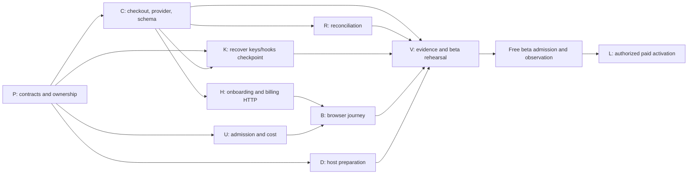

# APP-1. Plan 0002 — complete app.altcontext.com launch

- Status: active continuation; remote execution authorized, contract amendments still under review. Prepared 2026-09-21 America/Toronto (handoff records extend into 2026-09-22 UTC).
- Owner: APP-1, existing `feature/app-1` integration worktree.
- Inspected baseline: `11fe4dea7ae1b065893aca38d215b38e7a18c23f`.
- Supersedes the execution sequence, not APP-R1..R6 or APP-SC-01..20, in [Plan 0001](0001-app-altcontext-beta-clerk-polar-task-plan.md).
- Epic: [E16 SaaS foundation](../epics/v0.3.1/saas-foundation-epic.md).
- The operator subsequently authorized remote implementation and orchestration. Use `grok-remote` / `grok-4.6` / high for implementation and `codex-remote` / `gpt-5.6-luna` / max for grunt work. Local implementation lanes remain prohibited. Account provisioning and real integration rehearsal remain operator-dependent; live charges remain behind the paid gate.

## Supporting assessments

- [Checkout ownership, provider portability and Link](../assessments/current/app-altcontext-checkout-provider-portability-and-link-2026-09-22.md) — current account/billing UX direction and operator prerequisites.
- [Remote vendor terms comparison](../assessments/current/app1-payment-vendor-terms-comparison.md) — source collection, not provider approval.
- [Usage/evidence adjudication](../assessments/current/app1-usage-evidence-adjudication.md) — remaining admission contracts; evaluator work must target the actual APP-1 runner, not assume the generic gate is its execution path.

## Objective

An invited customer signs into app.altcontext.com with Clerk, claims one local tenant, obtains and manages a local API key, connects WordPress, produces a caption, sees accurate allowance and can later opt into Polar billing without replacing tenant or key. Complete sandbox billing before admitting the free beta. Keep live payments disabled until the separate paid gate.

## Recovered evidence and precedence

Handoff MCP reads the repository `.task-state/handoff.db`. APP-1 decision 12900 records foundation merge `e2a53910778f1fc99aacf0b6d5ae5652c1f27ddb`, verified as an ancestor of the inspected main. Decision 13218 and `config/lane-orchestration/APP-1.json` describe the newer seven-lane W4. Those supersede the older five-node W4 suggestion in the pasted session history. W0–W3 are not a new implementation backlog.

Semantic retrieval used `find_related_prior_work`: `embeddings_mode=verified`, model `gte-base-en-v1.5`, `semantic_degrade_reason=null`. Relevant hits include APP-1 decisions 12633, 12639, 12649, 13218 and E20-7 finding 1726. Similarity is discovery evidence, not proof a requirement is satisfied.

APP-1 currently has 34 deferred findings: 6 high, 19 medium, 9 low. Zero *open* findings does not mean launch-ready. Its only returned planning review is run 1163, `pass_with_findings`, against the old September 19 plan. There is no clean planning pass for this continuation.

The old plan still calls implemented surfaces new, and references `docs/specs/app-portal-account-billing-spec.md`, which is absent. Its S0 route inventory and E16-7 disposition matrix exist but retain pre-implementation claims. Refresh them; do not redo the entire original discovery program.

Existing branch `feature/app-1-w4-keys-hooks` contains unmerged checkpoint `29c357fd4` (four files, 221 insertions/13 deletions). Its lane is blocked and the commit message reports focused probes passing but an incomplete full result. Treat it as a review/recovery candidate, never as landed or cleanly verified. Other W4 tips inspected were at the main baseline; that alone does not prove no remote artifacts exist. Inspect existing handles before any later retry.

## Execution checkpoint — 2026-09-22 UTC

- Plan/epic preservation commit: `727dd66c0`. Usage admission checkpoint `205bffd71471f2eedf1d06f9edd5e1523eb61a94` integrated into `feature/app-1` at `1a3f51fe4c45ada621a649a92b77bbfbdc389722`, after 28 focused VM tests passed. This is feature integration, not launch acceptance. Review identified operation-id reuse, premature settlement, scene coverage and global-budget gaps; all block main pending the U amendment/fix.
- Keys/hooks checkpoint rebased to `35a5288fb`; fresh VM verification produced 30 passes and 5 webhook timestamp failures. One Grok/high fix pass is active: `app1-keys-hooks-fix-20260922-v1`. No green claim yet.
- Usage/evidence contract adjudication is running remotely with Codex/Luna/max, pass `9b83f1f9-3b7a-484c-9b0e-0272821b331e`. Billing contract adjudication refused before model spawn with `capability_unknown`, including a retry after a fresh receipt. Both adapters independently pass live availability probes; this dispatch error is not proof of unsupported inference providers.
- Operator will provision Clerk development and Polar sandbox credentials through untracked `.env` and notify the coordinator. Handoff blocker 821 gates real rehearsal/release, not offline work. Never print credential values or package `.env` into a lane.
- Actual composition currently defaults Polar environment to sandbox while its default API base is live. C/U must validate environment/base consistency and reject incoherent configuration before vendor calls; publishing an environment-variable checklist alone does not fix this defect.
- Three clean, unstarted baseline-only worktrees (deploy, portal, UI) were bundled and retired. The usage implementation branch was bundled after integration. Remote reaper dry-run found zero eligible sandboxes; locked/young/foreign sandboxes remain protected.
- Installed Grok adapter emits `--no-subagents`; current parallelism is coordinator-owned disjoint remote lanes. Nested Grok flocks need supported adapter configuration before being claimed available. Never spoof capability or sandbox receipts.

These are point-in-time observations. Consult MCP pass state and process ownership before recovering or retrying; a tool RPC timeout does not prove the remote pass stopped. Decisions 13221, 13223 and 13225 preserve the changed authorization and landing evidence.

## Scope selection and deduplication

| Source | Keep for this launch | Disposition |
| --- | --- | --- |
| APP-1 Plan 0001 | APP-R1..R6, APP-SC-01..20, free-beta and paid gates | One product/acceptance contract; execute remaining work through this continuation |
| E16-1..6, E16-7, GTM AP-3/AP-4/AP-5 | Identity, self-service keys, usage, billing, host, privacy-safe operations | Absorb into APP-1; no second account/key implementation or business database |
| E20-7 | Existing plugin usage/site-budget behavior and regression constraints | Reuse; server tenant admission remains authoritative; do not rebuild plugin metering wholesale |
| APP-1 W0–W3 / GX fixes | Landed foundation and regression tests | Do not redispatch |
| APP-1 W4 keys/hooks | Existing unmerged checkpoint | Review existing work before requesting missing fixes |
| SUITERED-1 / GATEORPH | Already-landed verification infrastructure | Reuse and verify the actual APP-1 gate, no duplicate infrastructure project |
| GPU-LAUNCH VGS findings | Only collection/evidence defects that invalidate APP-1 release evidence | Select into verification node V; leave unrelated harness work with its owner |
| GPUDEMO-1 / GPUFLOW-4 / demo deadline, DNS bench, general reaper work | No app account/billing implementation | Exclude from this backlog; retain shared-service correctness as a launch regression check |
| AP-7 concierge sales | Separate commercial path | Do not silently retire it or make it an APP-1 implementation prerequisite; settle its beta policy before offers |

## Implementation readiness

**The full launch plan is not cleared for unrestricted dispatch. Bounded checkpoint fixes and parallel contract adjudication are executing under the operator's later authorization.** The following distinctions prevent an old review or a queued lane from being mistaken for current readiness.

| Node | Current disposition | What makes the next action executable |
| --- | --- | --- |
| P — contract and ownership refresh | Ready for planning work | Close the concrete planning gaps below; publish exact route, provider and transaction contracts |
| K — keys/hooks | Ready for checkpoint review, not duplicate implementation | Inspect `29c357fd4`, recover its full receipt, identify missing tests/fixes |
| D — app host preparation | Bounded implementation candidate | Freeze host allowlist/env names in P and record a planning pass; DNS/secrets are staging inputs, not grounds to fabricate a deploy pass |
| C — checkout/provider/schema | Needs contract amendment | Durable attempt states and vendor-supported recovery, provider enumeration and signature fixture, schema/lease ownership |
| U — usage and cost | Needs scope amendment | Include scene routes and background completion/cancel, classify every remaining OPEN-Q route, enforce global cost bounds |
| R — reconciliation | Not ready as current manifest describes it | Local projection scan cannot discover a provider subscription with no local row; needs C's provider enumeration and persistence contract |
| H — portal HTTP | Dependency blocked | Consume reviewed C interfaces; one owner for claim, checkout and manage routes |
| B — browser UI | Dependency blocked for integration | Freeze HTTP schemas and Clerk browser contract; consume H and U, serialize app mount ownership |
| V — evidence and release rehearsal | Needs explicit packet | Own eval enforcement, PostgreSQL/security evidence and browser/vendor/restore rehearsal; not just targeted unit tests |
| L — live paid activation | Release blocked | Beta engineering gate, approved catalog/account and separately authorized real-money canary |

## Files and surfaces to change

Paths below are relative to `apps/prototype-description-service/` unless prefixed `docs/`, `scripts/deploy/` or `infra/`. Existing symbols were discovered through the code graph; new APIs below are deliverables, not claims of existing methods.

### P — contract and ownership refresh

Own this plan, the epic's active APP-1 section, the missing `docs/specs/app-portal-account-billing-spec.md` (new), S0 route/metering inventory and E16-7 matrix, and a later revision of the W4 manifest. Do not mutate the live manifest during this planning-only session.

- Record endpoint schemas, error/status vocabulary, verified pre-tenant identity versus tenant-bound principal, invitation claim plus beta grant transaction, and replay behavior.
- Define durable checkout attempt lifecycle, tenant/catalog/environment binding, customer mapping, ambiguous result recovery and a new attempt after a completed/expired purchase. Pin supported vendor behavior with official documentation and sanitized sandbox fixtures before C implementation.
- Define bounded authoritative provider enumeration, cursor/checkpoint durability, lease/fencing ownership and no network calls while holding database row locks. C owns shared schema/provider protocol; R owns processing.
- Resolve webhook signature compatibility (APP1-HG-45) before treating internal fixtures as vendor proof. This packet does not claim the existing verifier accepts genuine Polar deliveries.
- Refresh the route inventory, including `/scene/describe/multipart`, `/scene/describe/async`, `/scene/describe/run`, cancellation and costly cluster/GPU controls. Name actual handlers/worker completion seams and grant U the necessary paths before dispatch. Free polling does not consume image allowance.
- Resolve the missing contract artifact, stale inherited dispositions and one-time ownership of app mount, composition, migration and contract files. P requires a subsequent clean planning pass; no blanket S0 redispatch.

### C — checkout, provider and shared schema

Existing anchors: `recognition/infrastructure/billing/polar_provider.py:PolarBillingProvider.create_checkout_session`, `_checkout_idempotency_key`; `recognition/domain/portal_contracts.py:BillingProvider`; `db/models/portal_billing.py`; `db/migrations/versions/001_identity_schema.py`.

New surfaces: `recognition/application/services/checkout_service.py`, `recognition/infrastructure/repositories/checkout_attempt_repository.py`. Add durable attempt and R's agreed cursor/lease storage in the existing schema authority, with safe upgrades for existing installations. Preserve the pre-tenant API-key lookup boundary when deciding HG-61; do not blindly add RLS that breaks credential authentication.

Persist intent before provider mutation; concurrent equivalent requests share the attempt. An unknown outcome stays pending and is reconciled before a new mutation. Add the documented provider enumeration and webhook verification contract selected in P. C owns provider code and shared protocol changes; K must not independently modify that adapter.

Acceptance: concurrency, tenant/environment isolation, timeout-after-provider-success, restart recovery, expired-session new purchase, no automatic beta charge, unknown subscription discoverability, valid and invalid genuine-format signatures. APP-SC-02/07/10/11/12/18. Run provider/checkout/migration tests plus real PostgreSQL transaction tests.

### U — admission, usage and cost

Existing anchors: `recognition/application/services/usage_admission_service.py:UsageAdmissionService.reserve/commit/release`; `recognition/infrastructure/repositories/usage_repository.py`; `recognition/interface_adapters/http/deps/portal_composition.py:install_portal_composition`; analyze JSON/multipart routers. New dependency `deps/usage_admission.py` and `scripts/usage_reservation_sweeper.py`.

Expand owned paths to the scene dispatch and terminal-job seams identified by P. Apply admission before all costly customer work; settle successful units exactly once; release terminal failures/cancel according to the accepted cost contract. Bind retry keys to tenant, operation/job and cost; a released/committed ticket cannot authorize new work. Sweep abandoned reservations with bounded progress and restart safety. Enforce per-tenant and global in-flight cost limits; plugin-side accounting is not sufficient.

U is sole composition-root owner, including HG-60 and provider/repository wiring coverage. Integrate C's final factories after C lands without handing the file to multiple lanes. Acceptance: remaining=1 race on real PostgreSQL, mismatched retry, process death/reclaim, asynchronous cancel, period boundary, all inventoried paths, API-key rotation cannot reset allowance, zero fabricated remaining counts. APP-SC-08/09/13/17.

### R — reconciliation and recoverability

Existing anchors: `scripts/billing_reconcile.py:BillingReconciliationWorker.run`, `ReconciliationProvider.retrieve_state`, `_normalize_state`; `recognition/infrastructure/repositories/billing_repository.py`. Depends on C for provider enumeration and agreed cursor/lease schema.

Recover missed events both for known projections and provider subscriptions without a local subscription projection. Bound pages, work and vendor timeouts; resume cursor across restarts; lease/fence concurrent workers; keep per-item failures isolated. Reject mismatched provider tenant/customer identity rather than inventing it from request context. Make quarantine observable and recoverable with an audited retry operation. Prove stalled/wholly unprogressed `--once` execution cannot report healthy success. APP-SC-11/12/13.

### K — key lifetime and webhook hygiene

Existing anchors: `recognition/application/services/tenant_key_service.py:TenantKeyService.rotate_key`; `recognition/interface_adapters/http/routers/billing_webhooks.py`; corresponding tests and identity-service unknown-status tests. Recover checkpoint `29c357fd4` before changing code.

Preserve finite legacy key lifetime, use consistent billing event ordering, separate harmless duplicate/older events from quarantine, inject time consistently, redact database exception parameters. Coordinate the signature-header interface with C; final webhook integration waits for C. Prove expired/cutoff boundaries, duplicate order, malformed identity state and absence of PII in fault logs. APP-SC-03/05/06/11/17.

### H — onboarding and billing HTTP

Existing anchors: `routers/portal.py:portal_me`, `get_portal_session`, `get_tenant_key_service`, `get_portal_usage`. New `routers/portal_onboarding.py` and `routers/portal_billing.py` only if useful; H owns the whole portal route surface.

Implement proposed `POST /portal/onboarding/claim`, `/portal/billing/checkout`, `/portal/billing/manage` with the contracts approved in P. Claim authenticates a verified identity without requiring a tenant that the claim has yet to create. Invitation redemption, identity linkage and beta grant are atomic and replay-safe. Billing uses C's durable service and server-selected catalog/return origins. Eliminate app-state service overrides that discard tenant binding and map internal errors without leaking cursor state. Unknown usage remains unknown, never optimistic zero reservations. APP-SC-01/02/03/07/10/13/18.

### B — actual customer browser journey

New `routers/portal_ui.py` and `recognition/interface_adapters/http/portal_ui/`; sole owner of `api/main.py:create_app` integration in W4. All mount requests from other lanes converge here. Depends on H and U for final integration; mocks may support earlier design but cannot satisfy its acceptance.

Clerk login/renew/logout; invitation claim; one-time secret display and copy; list/create/rotate/revoke keys; WordPress Test Connection guidance; honest allowance, expiry/cap/outage states; checkout/manage/pending/cancel/recovery. No secret in server-rendered HTML, logs, storage or analytics. Preserve accessibility, mobile layout, keyboard flow, supported Clerk integration and precise CSP. APP-SC-01/04/13/14/17/18. Verify a real two-tenant browser flow, not string assertions alone.

### D — host and operational preparation

Own `Caddyfile`, `.env.example`, `.env.prod.example`, new `scripts/deploy/enable-app-host.sh`, `recognition/tests/deploy/test_enable_app_host.py`, `docs/operations/app-portal-host-runbook.md`, and `infra/oci/README.md` changes.

Allow only agreed app/auth/static/webhook routes on app host; block admin/internal/unrelated API paths; keep API host separation. Align DNS, TLS, Clerk domain, cookie/CORS/CSP, body-size/raw-webhook handling and independently controlled flags. Enable script must refuse unresolved/wrong DNS and preserve existing routing on failure. Separate preparation from actual cutover. Test host routing and rollback; genuine staging probes remain V evidence. APP-SC-13/16.

### V — evidence integrity and complete beta rehearsal

Own `scripts/run_app_portal_evals.py:run_evals`, its tests, APP-1 eval manifest and release dossier. Existing runner is implemented, contrary to old Plan 0001 wording; fix only the recorded enforcement gap. Include collection receipt changes only where reproduced against the APP-1 gate and coordinate with infrastructure owners.

First prove missing artifacts, zero cases, skipped mandatory cases, failed child commands and omitted required cases cannot produce a passing release record. Then run the full declared testpaths with `ACX_STRICT_GATE=1`, `ACX_PORTAL_TESTS_REQUIRE_PG=1`, locked dev environment and fresh JUnit, without positional narrowing. Keep red and green evidence, SHA, count, exit status and artifact identity.

Require real PostgreSQL RLS/concurrency under a non-owner role; reset-role denial; off-host restore preserving revoked keys and cutoff; uncertain recovery tail stays closed; billing reconciliation before paid traffic; alert delivery and telemetry privacy; actual Clerk/Polar sandbox rehearsal; two-tenant browser-to-WordPress first-caption journey. Retain original Plan 0001 APP-SC-01..18 coverage. APP-SC-19 is cohort observation after admission, not a pre-admission unit test. APP-SC-20 is the separately authorized paid canary.

## Deferred-finding ownership crosswalk

These assignments deduplicate work; they do not change finding status or claim fixes. Numeric IDs are database row IDs; full finding keys remain in handoff.db.

| Owner | Existing finding rows |
| --- | --- |
| P | 15388, 15391, 15392, 15393; refresh E16-7 matrix instead of importing its entire backlog |
| C | 15546, 15525, 15537, 15587, 15476 |
| U | 15550, 15581, 15580, 15576, 15493, 15488, 15586, 15574; residual usage part of 15487 |
| R | 15548, 15584, 15524, 15523 |
| K | 15549, 15526, 15589, 15474 |
| H | 15542, 15543, 15553, 15588, 15575; verify already-landed webhook part of 15487 separately |
| V | 15490, 15497; 15475 only if still failing on the release baseline, with the schema-verifier owner |

Lint-only rows stay with their existing surface owner and do not become separate launch-blocking projects. Deferred security/billing behavior is still required where the launch acceptance calls for it.

## Lane decomposition and DAG

This is a proposed dependency graph, not a dispatched manifest. P freezes contracts and grants exact owned paths before implementation. All nodes feed V. C → R is a real provider/schema dependency missing from the old manifest. H → B and U → B are final integration dependencies. C → K gates final webhook integration, though checkpoint review can happen earlier.

Use a maximum of four workers when later authorized and admitted by the harness. After P, C/U/D can implement while K's existing checkpoint is reviewed. After C, R/H/K final integration are eligible. B integrates after H/U. A topology-only longest chain is P → C → H → B → V → beta → paid; durations are not estimated, so this is not a wall-clock critical-path claim. Shared schema/protocol belongs to C, composition to U, portal routes to H, app mount to B. Refresh the old manifest before any dispatch; its current independence claims are not this graph.

## Review readiness and remaining decisions

- Planning approval is distinct from remote admission, successful implementation and launch readiness.
- Baseline and checkpoint receipts must be fresh before a resumed dispatch. The root doctor completed, but APP-1 worktree `make status` currently reports no target; repair/verify its lifecycle installation before using it for workers. Root doctor also reported heavy dispatch would be refused for host memory pressure. Neither is a reason to bypass sandbox preflight.
- Exact endpoint/worker ownership and vendor enumeration/signature/ambiguous-checkout contracts remain P outputs. Do not invent provider APIs to make a lane appear ready.
- Final cohort, allowance, cost ceiling, price/currency/catalog, failed-payment grace, stale entitlement policy and vendor account eligibility remain explicit decisions. Preserve current proposals without presenting them as approved.
- Add a predeclared paid-conversion hypothesis before free-beta admission, then record actual offers/purchases separately from sandbox evidence. Resolve AP-7 coexistence without building a second billing stack.
- Subsequent planning review must record a clean pass and accepted baseline before fresh remote implementation; the user has explicitly requested no dispatch now.

## Consolidated Checklist

- [x] Recover handoff state, verified semantic prior art, current branch tips and deferred findings.
- [x] Deduplicate app-launch work and publish a proposed DAG with shared-file ownership.
- [ ] P: finish exact contracts and refresh stale inventory/epic crosswalk; obtain clean planning review.
- [ ] Recover existing W4 receipts/checkpoint; confirm lifecycle and remote preflight readiness.
- [ ] C/U/R/K/H/B/D: record behavioral RED, implement only authorized slices, record GREEN and review.
- [ ] V: prove evidence enforcement, full suite scope, PostgreSQL isolation, browser/vendor/restore/alert rehearsals.
- [ ] Authorize and admit bounded free beta; measure APP-SC-19.
- [ ] L: approve commercial inputs and separately authorize live canary; prove APP-SC-20.

## Success Criteria

Planning completion means this packet accurately distinguishes landed work, recoverable checkpoints, implementation gaps and release evidence, with one owner per remaining requirement. Product completion remains the original APP-SC-01..20 split across beta and paid gates. A planning document, mock-only suite or zero-open-findings counter cannot substitute for those outcomes.
