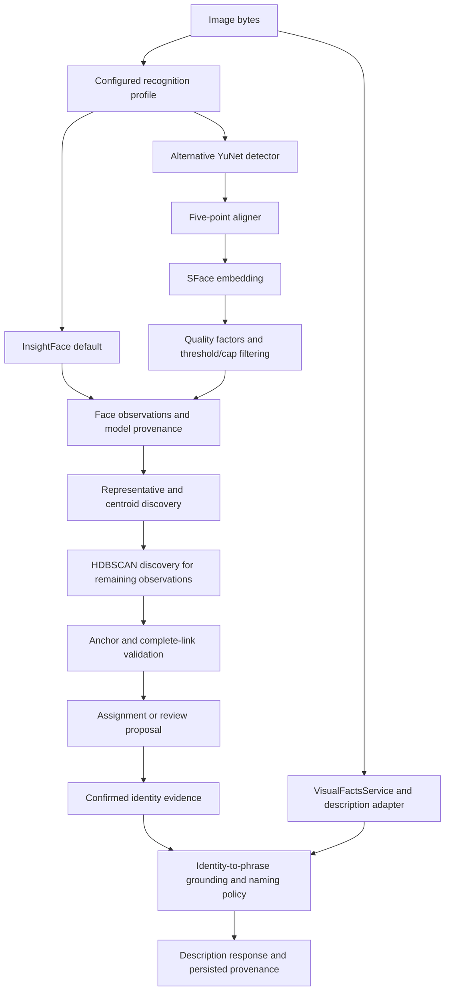

# FIR occlusion: current codemap and research delta

The [FIR report](../../benchmarks/reports/fir-embeddings-dims-detectors-qa-20260723.html#v11) now contains a v11 plan for face-level corpus repair, stage attribution, periocular matching, pose-guided head proposals, head/body association, S³POT segmentation and constrained clustering experiments. This is a research/documentation change; no production pipeline or model settings changed.

The most consequential new finding is that the [saved description run](../tasks/altq/bakeoff-results/run-altq-646-interleave-v3.json) has **640 successful descriptions across 646 images**. The manifest's 150-caption subset is not the available caption inventory. Re-captioning all 449 untriaged personal images is therefore no longer the first acquisition task.

| Query family | Candidate images | Personal | Previously untriaged personal |
|---|---:|---:|---:|
| Sunglasses | 39 | 39 | 25 |
| Masks, respirators, scarf, veil | 15 | 15 | 7 |
| Other obstruction vocabulary | 29 | 29 | 22 |
| Profile/rear/turned-away head context | 22 | 21 | 18 |

The union is **95 images**, with overlapping query families. The [review queue](../../benchmarks/reports/fir-occlusion-caption-mining-20260904.json) contains provenance, matched terms, unreviewed instance fields, failed-run IDs and a keyword-negative audit frame. It is not ground truth. Reproduce it from the repository root:

```sh
python3 scripts/mine_fir_occlusion_candidates.py
```

The broad obstruction query retrieves only 2/19 existing `occlusion_other` tags. Keyword-negative review is essential. Even the 13/13 sunglasses and 5/5 masked-tag overlaps measure agreement with imperfect image tags, not face-level recall. The queue does not infer that a named person is the wearer.

## Snapshot and codemap

Inspected checkout: `ee330e96141227bfc8bc4e92de34827514c11211`. Graph project: `context-alt-text-monorepo`, ready with 26,107 nodes and 115,107 edges when queried. Graph search/snippets and a bounded call trace preceded direct source checks. Verbose MCP reads moved to `codebase-memory-mcp cli --json <tool>` with arguments on stdin and locally filtered output.

Coverage checks returned `coverage_unavailable` (legacy coverage metadata), including for the evaluation harness. Negative claims below are limited to the inspected paths; graph absence is not treated as proof of missing code. The graph trace omitted dynamically dispatched discovery edges that the source explicitly calls, so this map combines graph discovery with direct inspection.



This is a data-flow overview, not a claim that every box is one direct synchronous call. Proposed person-pose, head embeddings and spatial occlusion masks are not represented as existing stages.

| Current anchor | What was verified | Proposed extension / retained boundary |
|---|---|---|
| [settings.py](../../apps/prototype-description-service/recognition/config/settings.py), `_resolve_face_pipeline_profile`, `bridge_oact_into_quality_settings` | InsightFace default; alternative profile knobs; OACT bridge | Record effective profile, not just available implementations |
| [face_pipeline_adapter.py](../../apps/prototype-description-service/recognition/infrastructure/embeddings/face_pipeline_adapter.py), `FacePipelineFaceDetector._detect_sync`, `detect` | YuNet→align→embed; drop paths; one detection deadline covering admission/executor; worker-owned slot release | Capture pre-filter proposals; bounded rescue crops, retaining full-image coverage |
| [aligner.py](../../apps/prototype-description-service/recognition/infrastructure/face_pipeline/aligner.py), `FivePointAligner.align` | Five coordinates drive 112×112 affine warp | Per-landmark visibility and uncertainty; oracle alignment only where truth is supportable |
| [face_quality_factors.py](../../apps/prototype-description-service/recognition/infrastructure/embeddings/face_quality_factors.py), `compute_occlusion_severity` | Eye-patch appearance statistic averaged to scalar | Validate as ranker; introduce spatial support separately |
| [assignment/quality.py](../../apps/prototype-description-service/recognition/application/assignment/quality.py), `compute_quality_adjustment` | Enabled OACT adds negative threshold adjustment; full OACT term survives cold-cluster dampening | Test leniency on unknown probes; do not describe it as uncertainty suppression |
| [discovery_pipeline.py](../../apps/prototype-description-service/recognition/application/orchestration/clustering/discovery_pipeline.py), `prepare_cluster_caches`, `run_discovery_pipeline` | Model-filtered representatives/centroids; representative and centroid candidates augment graph anchors | Preserve isolation for modality/region/preprocess versions; audit provisional evidence entering anchors |
| [graph/discovery.py](../../apps/prototype-description-service/recognition/application/discovery/graph/discovery.py), `GraphDiscovery.discover` | Anchor matching, complete-link safeguards, invalid-group singleton fallback, noise handling | Attribute fragmentation before replacing safeguards |
| [selection.py](../../apps/prototype-description-service/recognition/application/discovery/graph/selection.py), `select_algorithm`; [hdbscan_adapter.py](../../apps/prototype-description-service/recognition/infrastructure/clustering/hdbscan_adapter.py) | HDBSCAN already selected; epsilon from cosine threshold; identity argument unused by adapter | Constraints require an explicit layer; density labels are not identity acceptance |
| [visual_facts_service.py](../../apps/prototype-description-service/scene/application/visual_facts_service.py), `VisualFactsService.describe`; [reconcile.py](../../apps/prototype-description-service/scene/application/fusion/reconcile.py), `_reconcile_one_identity` | Description caching/adapter/fusion; face-bound identity and geometric association required for names | Head-only evidence needs a new typed association/naming policy, not removal of the existing guard |
| [face_metrics.py](../../apps/prototype-description-service/scripts/eval_harness/face_metrics.py), `detection_pr`, `face_identification_pr` | Exhaustive annotation required for detection; optional IoU matches; conditional ID metrics disclose detection coupling; stranger errors separate | Require IoU matching for localization claims; publish end-to-end and conditional denominators |
| [report.py](../../apps/prototype-description-service/scripts/eval_harness/report.py), `build_real_occlusion_pairs`, `synthetic_real_divergence` | Image tags applied to all named boxes; missed embedding retained within eligible frame; errored items skipped; synthetic/real divergence already measured | Face-level occlusion attribution; full-run errors counted; effective sample size, not raw 100-face floor |
| [synthetic_occlusion.py](../../apps/prototype-description-service/scripts/eval_harness/synthetic_occlusion.py), `apply_occlusion` | Mask/sunglasses/other synthetic kinds and resampled compositing | Artifact-only controls, explicit support/alpha and real holdouts |

## Reconciled evidence and new conclusions

- **Manifest correction:** [v3r](../../benchmarks/manifests/corpus-manifest-v3r-20260814.json) has 130 identities/116 unlabeled, versus v3's 137/108. Eight entries changed. Recompute pairing and design effects from the corrected inventory. The description run joins all 646 IDs, but its provenance digest does not establish image-byte equivalence. Both manifests point to an absent former-worktree image root.
- **Runtime correction:** [pyproject.toml](../../apps/prototype-description-service/pyproject.toml) already pins OpenCV 5. The [saved drift probe](../tasks/fir/evidence/opencv-5-embedding-drift.md) reports 83 matched faces, zero decisive flips, one suggestion-band flip. It is neither a fresh run nor a general occlusion validation. Blanket “merge CVUP first / all old vectors incomparable” scheduling was retired.
- **Periocular scope:** lower-face masks may leave useful upper-face signal; opaque sunglasses can remove it. Compare the same visible anatomical region on both sides and evaluate each gallery×probe condition. PLGSA's narrow severity range and lack of isolated ablations weaken continuous-adaptation claims.
- **Head rescue:** pose can propose where to search, not who is there. Oracle head boxes test whether localization is worth improving before building a pose cascade. Head-identity embeddings and event-scoped torso association are separate experiments with different evidence lifetimes.
- **S³POT:** retain as offline spatial-label assistance. Its 76.2 standard/80.4 per-image-overfit IoU figures are segmentation results. Generated reference pixels must not become identity evidence. Test no/oracle/predicted masks through a compatible matcher before optimizing segmentation.
- **Clustering:** retain reliable cores, diverse confirmed exemplars and existing model-space safeguards. Ablate constrained recovery from fragmentation, including insertion-order stress and false-merge accounting. Fewer clusters alone is not improvement.
- **Culled shortcuts:** recaptioning everything, dimension padding, universal eye-only matching, scalar leniency as visibility handling, identity from generated pixels or generic semantic resemblance, deterministic shoulder geometry, unconditional transitive merging, and synthetic/caption-only gold labels.

## Research and semantic-history intake

Primary local PDFs were read by text extraction with focused method/result/limitation inspection. PLGSA p.21 and S³POT p.7 were rendered and visually checked. This is a targeted intake, not a claim to have read every paper in the directory.

| Local source in `/Users/daniel/Documents/__research_papers/` | Use and evidence boundary |
|---|---|
| `PLGSA-Transformer- Periocular Landmark-Guided Attention with Occlusion-Adaptive Cosine Thresholding for Cross-Modal Masked and Unmasked Face Recognition.pdf` | Visible-band prior; §§3.6/5.6/6 threshold-range and data-diversity limits; §5.1 genuine-pair denominator. [Primary publication](https://arxiv.org/abs/2607.03581) |
| `S 3POT- Contrast-Driven Face Occlusion Segmentation via Self-Supervised Prompt Learning.pdf` | Spatial contrast/prompts, Table 1 protocol distinction; no recognition operating-point result. [Primary publication](https://arxiv.org/html/2602.00635v1) |
| `A survey of face recognition techniques under occlusion.pdf` | Locate/exclude support, corresponding partial features, reconstruction caveats; method taxonomy rather than proof of a winning model |
| `Efficient Detection of Occlusion prior to Robust Face Recognition.pdf` | Older selective-local-feature prior art; does not justify replacing current embeddings with a handcrafted classifier |
| `Structured Occlusion Coding for Robust Face Recognition.pdf` | Finite, sampleable occluder dictionaries; not an unrestricted open-occluder solution |
| `AdaFace- Quality Adaptive Margin for Face Recognition.pdf` | Quality-adaptive training and unrecognizable images; does not itself predict visible facial support |
| `Depth-Copy-Paste- Multimodal and Depth-Aware Compositing for Robust Face Detection.txt` | Scene/person compositing and depth order; not surgical-mask synthesis or head recognition |

The archived [clustering analysis](../archive/tasks/4.0/4.2.3/clustering-algorithm-comprehensive-analysis.md), especially Q3/Q7/Q9/Q18, already proposed exemplar aggregation and a conservative-then-merge strategy. Its Chinese Whispers implementation description is historical: current graph discovery chooses HDBSCAN. Its illustrative thresholds and merge snippets are not measured defaults for the present model. A concrete correction: SciPy `linkage(method="median")` is WPGMC centroid linkage, not Apple’s median of pairwise inter-cluster distances; its Euclidean metric requirement also excludes a casual `1 - cosine` substitution. See the [SciPy definition](https://docs.scipy.org/doc/scipy/reference/generated/scipy.cluster.hierarchy.linkage.html).

Additional primary checks: [Apple Photos](https://machinelearning.apple.com/research/recognizing-people-photos), [PDSN](https://arxiv.org/abs/1908.06290), [DirectMHP](https://arxiv.org/abs/2302.01110), [PGFA](https://openaccess.thecvf.com/content_ICCV_2019/html/Miao_Pose-Guided_Feature_Alignment_for_Occluded_Person_Re-Identification_ICCV_2019_paper.html). Their mechanisms inform experiments; reported results are not transplanted into this service's acceptance gate.

Canon intake covered DDIA (schema evolution/replayable derived state), Latency (queueing, fanout and measurement), Release It! (deadlines and bulkheads), the relevant ML distillations, EMB/CAL/EVAL/MLDATA/AUDIT rows, CARD-27/31/32, measurement/proxy integrity and Principles 9/15/20. Canon IDs retain live meaning; a frozen canon version is not an implementation requirement. The earlier [three-card assessment](../assessments/current/fir-canon-reasoning-card-application-2026-08-15.md) supplied leads, rechecked at current anchors.

WorkBay semantic retrieval returned `ok_with_results`, using `gte-base-en-v1.5`. Relevant advisory history included:

- `MAINT-occlusion-canon-fir-reflow-20260816`: decisions 5092–5094, plus full v10/v10b/v10c/v10d rationales retrieved through `get_handoff_state`.
- `MAINT-image-manifest-v3-20260728`: decision 3325, body-prior motivation around media 271; finding 5407 on missing occlusion labels.
- `FIR-1`: decision 2449 on separate mask/sunglasses/other tags; `fir-unblock`: decision 2924 on caption-mining prior art.

History was not treated as authoritative current state: the report on disk was v8, the old “449 need captions” claim missed the saved full run, and one wearer assertion conflicted with current captions. The current HTML is tracked in Git, unlike the older handoff's account of a local ignored report.

## Validation and remaining work

The miner checks duplicate IDs and exact ID-set equality, refuses a mismatched join, excludes errored outputs from keyword mining, and emits failures separately. Input/run/script hashes are embedded in the queue. Human annotation, image-byte/coordinate reconciliation, grouping/sealing, performance experiments and model artifact clearance remain implementation work, specified as R1–R6 in the FIR report. No new recognition-accuracy or latency measurements are claimed.

Validation completed: HTML tags, 39 unique anchors, 16 table column grids and new local links checked; `git diff --check` passed. Mining rerun was byte-identical; input hashes, candidate uniqueness, unreviewed/null instance fields and separation of failed descriptions were checked. Duplicate-ID and missing-ID inputs were rejected without emitting a queue. Browser rendering was attempted with isolated profiles but headless startup timed out, so no HTML visual pass is claimed. The source PDF result pages were visually inspected.

A further corpus limitation: the 646 images have already influenced earlier experiments. Re-sealing them does not erase that exposure. Use them for diagnostics; obtain independent grouped confirmation data for a new performance claim.
